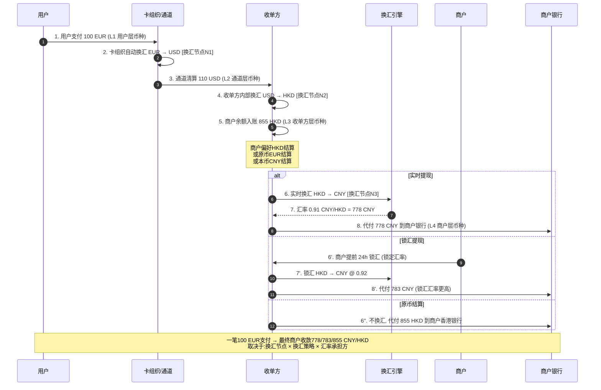
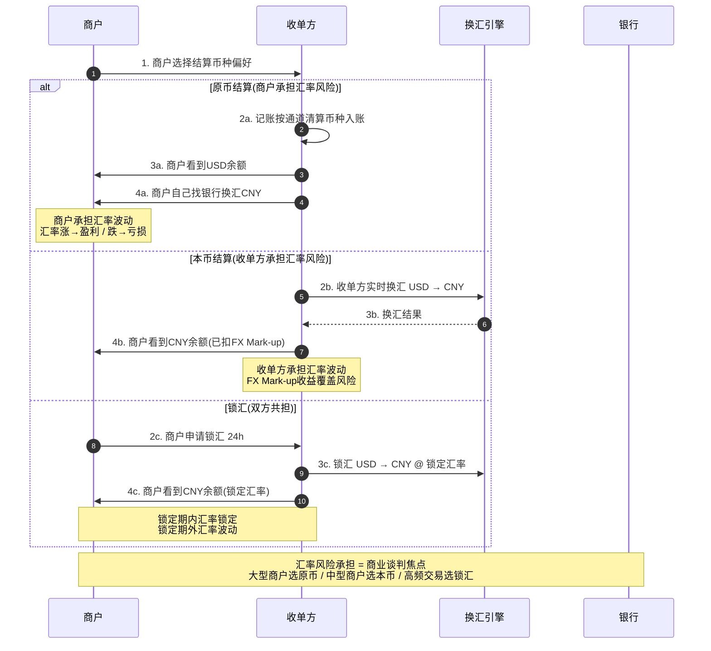

# 17. 多币种路径：4 层币种口径、换汇决策与资金流穿透深度解析

> 状态：深度 · 第六层业务场景 · 与 14_线上支付 / 15_POS / 16_代付并列 · **浅析业务专题收官之作**
> 阅读时长：约 60 分钟 · 字数规模 5000-7000 字 · 画像锚点 8/9 命中

---

## 一、一句话定义

**多币种路径 = 跨境支付中资金从用户原始币种 → 收单方结算币种 → 商户提现币种的完整链路，贯穿「用户层 / 通道层 / 收单方层 / 商户层」4 层币种口径，每层都可能发生换汇，**4 层币种 + 3 个换汇节点 + 1 套对账口径**是跨境支付最难穿透的部分，也是中型公司翻车最频繁的地方——中型公司 70% 的资金差错源于多币种路径不清晰。**

它和 16_ 代付的关系：16_ 是「资金流出链路」，17_ 是「**币种流转穿透**」——同一笔资金在 4 层口径下的币种形态如何变化、谁承担汇率风险、汇率波动如何记账、对账口径如何统一。读完 17_，跨境支付专题就完整闭环了。

---

## 二、业务背景与价值

### 2.1 为什么单拆一篇多币种路径（且作为收官）

跨境支付按**资金流向**分 2 大类（详见 16_ 2.1），但**币种**是另一条独立的维度：

| 流向 | 币种路径 |
|---|---|
| 资金流入（用户 → 商户）| **币种 1**（用户币种）→ 币种 2（收单方币种）|
| 资金流出（收单方 → 商户）| 币种 2（收单方币种）→ **币种 3**（商户提现币种）|

一笔跨境支付可能涉及 **3-5 个币种**（用户支付币种 + 通道清算币种 + 收单方结算币种 + 商户提现币种 + 二次换汇中间币种），而**每一层都可能发生换汇 + 记账口径变化**，是跨境支付**最复杂**的部分。

**为什么是收官：**
- 14_ / 15_ 是**容器视角**（PC/H5/App/POS）
- 16_ 是**资金流向视角**（流入/流出）
- 17_ 是**币种视角视角**（4 层口径 + 3 个换汇节点）
- 三视角叠加 = 跨境支付完整闭环
- 17_ 写完后，从 0_ 全景到 17_ 多币种 = **完整的浅析业务专题**

### 2.2 4 层币种口径示意

```
┌────────────────────────────────────────────────────────────────┐
│                  4 层币种口径完整链路                            │
├────────────────────────────────────────────────────────────────┤
│                                                                │
│  ┌────────────────────────────────────────────┐                │
│  │ 用户层 L1：用户原始币种                       │                │
│  │  USD / EUR / JPY / CNY / SGD                │                │
│  └────────────────┬───────────────────────────┘                │
│                   │                                            │
│                   ▼  换汇节点 N1（卡组织/钱包/通道自动）        │
│                   │                                            │
│  ┌────────────────────────────────────────────┐                │
│  │ 通道层 L2：通道清算币种                       │                │
│  │  USD（主流） / EUR / HKD / 平台代币          │                │
│  └────────────────┬───────────────────────────┘                │
│                   │                                            │
│                   ▼  换汇节点 N2（收单方内部）                  │
│                   │                                            │
│  ┌────────────────────────────────────────────┐                │
│  │ 收单方层 L3：收单方结算币种                   │                │
│  │  USD / EUR / HKD / CNY（按商户偏好）        │                │
│  └────────────────┬───────────────────────────┘                │
│                   │                                            │
│                   ▼  换汇节点 N3（代付出金时）                  │
│                   │                                            │
│  ┌────────────────────────────────────────────┐                │
│  │ 商户层 L4：商户提现币种                       │                │
│  │  任意币种（按商户指定）                       │                │
│  └────────────────────────────────────────────┘                │
└────────────────────────────────────────────────────────────────┘
```

### 2.3 业务价值

**5 个核心价值：**
1. **跨境支付最难穿透的部分**（币种流转 + 换汇决策 + 记账口径）
2. **资金差错的主要来源**（70% 资金差错源于多币种路径不清晰）
3. **汇率风险分摊的核心**（谁承担汇率风险是商业谈判焦点）
4. **对账口径统一的关键**（4 层币种必须映射到一个对账口径）
5. **浅析业务专题收官**（14_/15_/16_ + 17_ = 容器 + 流向 + 币种 三视角完整闭环）

---

## 三、业务术语表

| 术语 | 定义 | 关键差异 |
|---|---|---|
| **4 层币种口径** | 用户层 / 通道层 / 收单方层 / 商户层 | 每层币种可能不同 |
| **换汇节点** | N1 卡组织 / N2 收单方 / N3 代付 | 共 3 个换汇节点 |
| **实时换汇** | 每笔交易锁定汇率 | 汇率波动风险低 / 成本高 |
| **批量换汇** | 一天内多次交易用同一汇率 | 汇率波动风险高 / 成本低 |
| **锁汇** | 锁定汇率一段时间（24h / 72h）| 大额交易适用 |
| **原币结算** | 按商户原收款币种结算 | 商户承担汇率风险 |
| **本币结算** | 按商户指定币种结算（自动换汇）| 收单方承担汇率风险 |
| **汇率中间价** | 银行间市场汇率 | 中国央行每日发布 |
| **汇率买入价** | 银行买入外币价 | 商户提现适用 |
| **汇率卖出价** | 银行卖出外币价 | 商户支付适用 |
| **汇率点差** | 卖出价 - 买入价 | 银行利润 / 0.05%-0.3% |
| **汇率风险** | 汇率波动导致资金损益 | 谁承担？商业谈判焦点 |
| **FX Mark-up** | 换汇点差加成 | 收单方收益来源之一 |
| **汇率损益** | 实际汇率 vs 入账汇率的差异 | 可能正 / 负 |
| **未实现损益** | 持仓中的换汇损益 | 暂未结算 |
| **已实现损益** | 结算后的换汇损益 | 已落地 |
| **对账汇率** | 实际清算时使用的汇率 | 与记账汇率可能不同 |
| **记账汇率** | 入账时使用的汇率 | 内部记账口径 |
| **汇损账户** | 累计汇率损益的内部账户 | 月度清零 / 不清零 |
| **结汇** | 外币换人民币 | 中国外汇管制 |
| **购汇** | 人民币换外币 | 中国外汇管制 |
| **中间币种** | 两种非主流币种之间通过第三币种换汇 | USD 是主要中间币种 |
| **多币种账户** | 同时支持多种币种的商户账户 | USD / EUR / HKD / CNY |
| **币种子账户** | 每种币种独立账户 | 详见 7_多币种账户 |
| **跨币种支付** | 用户用 A 币种支付，商户收 B 币种 | 卡组织自动换汇 |
| **原路退回** | 退款按原支付币种返回 | 详见 12_订单生命周期 |
| **换汇通道** | 银行换汇 / 持牌换汇机构 / 卡组织自动换汇 | 成本 + 速度不同 |
| **CNY/CNYH** | 在岸人民币 / 离岸人民币 | 不同汇率 / 不同监管 |
| **多币种路径** | 资金在不同币种之间的流转路径 | 本篇核心 |

---

## 四、业务流程图

### 4.1 多币种路径完整链路



**关键时点解读：**
- **时点 2**：**换汇节点 N1**（卡组织 / 钱包 / 通道自动换汇，用户不可控）
- **时点 4**：**换汇节点 N2**（收单方内部换汇，**核心**控制点）
- **时点 6**：**换汇节点 N3**（代付出金时换汇，**核心**控制点）
- **时点 5**：商户可选择原币结算 / 本币结算（**商业谈判焦点**）
- **时点 6/6'/6''**：实时换汇 / 锁汇 / 原币结算（3 大换汇策略）

### 4.2 汇率风险承担决策



---

## 五、系统架构

### 5.1 多币种路径整体架构

```
┌────────────────────────────────────────────────────────────────┐
│              多币种路径系统架构                                  │
├────────────────────────────────────────────────────────────────┤
│                                                                │
│  ┌──────────┐   ┌──────────┐   ┌──────────┐   ┌──────────┐    │
│  │ L1 用户层│   │ L2 通道层│   │ L3 收单方│   │ L4 商户层│    │
│  │ 原始币种 │   │ 清算币种 │   │ 结算币种 │   │ 提现币种 │    │
│  └────┬─────┘   └────┬─────┘   └────┬─────┘   └────┬─────┘    │
│       │              │              │              │          │
│       ▼              ▼              ▼              ▼          │
│  ┌──────────────────────────────────────────────────┐          │
│  │              3 个换汇节点                         │          │
│  │  ┌──────────┐ ┌──────────┐ ┌──────────┐         │          │
│  │  │ N1卡组织 │ │ N2收单方 │ │ N3代付   │         │          │
│  │  │ 自动换汇 │ │ 内部换汇 │ │ 出金换汇 │         │          │
│  │  └──────────┘ └──────────┘ └──────────┘         │          │
│  └────────────────────────┬─────────────────────────┘          │
│                            │                                  │
│              ┌─────────────┼─────────────┐                    │
│              ▼             ▼             ▼                    │
│  ┌──────────┐    ┌──────────┐    ┌──────────┐                 │
│  │ 换汇引擎 │    │ 多币种   │    │ 汇率损益 │                 │
│  │ 实时/批量│    │ 账户体系 │    │ 账户     │                 │
│  │ 锁汇     │    │          │    │          │                 │
│  └────┬─────┘    └────┬─────┘    └────┬─────┘                 │
│       └──────┬───────┴──────┬────────┘                        │
│              ▼              ▼                                 │
│  ┌──────────────────────────────────────┐                     │
│  │         对账（4层币种映射对账）        │                     │
│  │  T+1 三方对账（收单方↔通道↔银行）     │                     │
│  └──────────────────────────────────────┘                     │
└────────────────────────────────────────────────────────────────┘
```

### 5.2 模块边界

| 模块 | 职责 | 与其他模块关系 |
|---|---|---|
| **L1 用户层** | 接收用户原始币种 | 卡组织 / 钱包 / 通道自动换汇 |
| **L2 通道层** | 通道清算币种 | 卡组织自动换汇（**不可控**）|
| **L3 收单方层** | 收单方内部结算币种 | 收单方换汇引擎（**可控**）|
| **L4 商户层** | 商户提现币种 | 代付换汇（**可控**）|
| **N1 换汇节点** | 卡组织 / 钱包 / 通道自动换汇 | 用户不可控 |
| **N2 换汇节点** | 收单方内部换汇 | **核心控制点 1** |
| **N3 换汇节点** | 代付出金换汇 | **核心控制点 2** |
| **换汇引擎** | 实时 / 批量 / 锁汇 | 详见 7_多币种账户 |
| **多币种账户** | 商户主子账户 + 币种子账户 | 详见 7_多币种账户 |
| **汇率损益账户** | 累计汇率损益 | 月度清零 / 不清零 |
| **对账引擎** | 4 层币种映射对账 | 详见 6_对账 |

### 5.3 4 层币种映射表

**典型场景：用户支付 100 EUR（欧洲用户）→ 商户最终收款**

| 层 | 币种 | 换汇节点 | 汇率 | 金额 | 备注 |
|---|---|---|---|---:|---|
| **L1 用户层** | EUR | - | - | 100 | 用户原始币种 |
| **N1 卡组织** | - | EUR → USD | 1.10 | 110 | 卡组织自动换汇 |
| **L2 通道层** | USD | - | - | 110 | 通道清算币种 |
| **N2 收单方** | - | USD → HKD | 7.78 | 855 | 收单方内部换汇 |
| **L3 收单方层** | HKD | - | - | 855 | 商户偏好 HKD |
| **N3 代付** | - | HKD → CNY | 0.91 | 778 | 代付出金换汇 |
| **L4 商户层** | CNY | - | - | 778 | 商户中国银行 |

**汇率承担：**
- N1：卡组织承担（用户不可控，**汇率成本已含在 MDR**）
- N2：收单方承担（**FX Mark-up 收益覆盖**）
- N3：商户 / 收单方共担（取决于结算币种偏好）

### 5.4 关键时点对照

**与 7_ 多币种账户的关系：**
```
7_ 多币种账户 = 多币种账户体系（账户视角）
17_ 多币种路径 = 4 层币种口径 + 3 个换汇节点（路径视角）
```

二者强相关，但视角不同：
- **7_** 关注**账户**（主子账户 + 币种子账户 + 状态机）
- **17_** 关注**路径**（4 层币种 + 3 个换汇 + 汇率风险承担）

---

## 六、服务模型（3 大换汇策略横向对比）

### 6.1 横向对比表

| 维度 | 实时换汇 | 批量换汇 | 锁汇 |
|---|---|---|---|
| **触发时机** | 每笔交易 | 一天一次 / 多次 | 商户申请 24h / 72h |
| **汇率** | 交易时实时汇率 | 当日固定汇率 | 锁定期内固定汇率 |
| **汇率波动风险** | 低（每笔锁定）| 高（一天内波动）| 中（锁定期内低）|
| **成本** | 高（单笔成本 0.1-0.3%）| 低（批量优惠）| 中（锁汇费 0.05-0.1%）|
| **适用场景** | 小额高频 | 大额低频 | 大额 B2B |
| **汇率损益** | 每笔独立记账 | 月度损益清零 | 锁定期内损益锁定 |
| **对账口径** | 简单（每笔独立）| 复杂（批量均值）| 中等（锁定汇率）|

### 6.2 3 类结算币种偏好对比

| 维度 | 原币结算 | 本币结算 | 锁汇结算 |
|---|---|---|---|
| **汇率风险承担** | 商户承担 | 收单方承担 | 双方共担 |
| **商户选择** | 大型商户 / 跨境企业 | 中型商户 / 普通电商 | 高频商户 |
| **FX Mark-up** | 无 | 有（0.1-0.3%）| 有（0.05-0.1%）|
| **到账金额** | 受汇率波动影响 | 稳定（收单方锁定）| 锁定（锁汇期内）|
| **商业谈判** | 商户要议价能力 | 默认方案 | 大商户定制 |
| **对账口径** | 复杂（双币种对账）| 简单（单币种对账）| 中等（锁定汇率对账）|

### 6.3 一致性保障（关键）

**3 个必须一致：**
1. **对账口径统一**：4 层币种必须映射到一个对账口径（通常以 L3 收单方层币种为准）
2. **记账汇率统一**：同一笔交易使用**同一个记账汇率**（避免汇率损益虚增）
3. **汇率损益账户统一**：所有换汇损益汇入**同一个损益账户**（便于月度清零）

---

## 七、核心功能用例（10 大用例）

### 用例 1：欧洲用户支付 EUR → 商户收 CNY（典型跨境电商）

**场景：** 欧洲用户用 VISA 支付 100 EUR，中国商户希望收到 CNY

**流程：**
1. 用户支付 100 EUR（**L1**）
2. VISA 卡组织自动换汇 EUR → USD @ 1.10 = 110 USD（**N1**）
3. 通道清算 110 USD（**L2**）
4. 收单方内部换汇 USD → CNY @ 7.10 = 781 CNY（**N2**）
5. 商户余额入账 781 CNY（**L3**）
6. 商户选择实时提现 → 收单方实时换汇 CNY → CNY（无换汇，0 成本）
7. 代付 781 CNY 到商户中国银行（**L4**）
8. 异步 webhook

**关键点：**
- **N1 卡组织自动换汇**（用户不可控，费率已含在 MDR 2%）
- **N2 收单方内部换汇**（FX Mark-up 0.1-0.3%）
- 商户最终收款 781 CNY（100 EUR × 1.10 × 7.10 × (1 - 0.002) = 781 CNY）

### 用例 2：东南亚用户支付 USD → 商户收 HKD（原币结算）

**场景：** 东南亚用户用 Mastercard 支付 1000 USD，香港商户希望收到 HKD

**流程：**
1. 用户支付 1000 USD（**L1**）
2. Mastercard 自动换汇 USD → USD（无换汇，0 成本）（**N1**）
3. 通道清算 1000 USD（**L2**）
4. 收单方记账 1000 USD（**L3**原币结算）
5. 商户余额 1000 USD 入账
6. 商户选择提现到香港银行 → 不换汇
7. 代付 1000 USD → 商户香港银行 USD 账户

**关键点：**
- **原币结算**（商户承担汇率风险）
- 商户自己换汇 USD → HKD
- 适合香港商户（多币种账户 USD + HKD）

### 用例 3：美国用户支付 USD → 商户收 CNY（锁汇 24h）

**场景：** 美国用户用 VISA 支付 1000 USD，中国商户希望锁定 CNY 金额

**流程：**
1. 商户提前 24h 锁汇：1000 USD → CNY @ 7.15（**锁汇**）
2. 用户支付 1000 USD
3. VISA 自动换汇 USD → USD（**N1**）
4. 通道清算 1000 USD
5. 收单方记账 1000 USD
6. 商户余额入账 1000 USD
7. 商户申请提现 CNY → 触发**锁汇汇率** 7.15
8. 代付 7150 CNY 到商户中国银行

**关键点：**
- **锁汇**（24h 内汇率锁定）
- 适合大额交易（汇率波动敏感）
- 锁汇费 0.05-0.1%

### 用例 4：日本用户支付 JPY → 商户收 USD（中间币种 USD）

**场景：** 日本用户用 JCB 支付 10000 JPY，美国商户希望收到 USD

**流程：**
1. 用户支付 10000 JPY（**L1**）
2. JCB 卡组织自动换汇 JPY → USD @ 150 = 66.67 USD（**N1**）
3. 通道清算 66.67 USD（**L2**）
4. 收单方记账 66.67 USD（**L3**）
5. 商户余额 66.67 USD 入账
6. 商户提现 → 代付 66.67 USD 到美国银行

**关键点：**
- **跨币种支付**（JPY → USD，卡组织自动换汇）
- 中间币种 USD 是全球硬通货

### 用例 5：批量换汇（月度结算）

**场景：** 中国跨境电商平台，1000 笔小额交易，月度批量换汇

**流程：**
1. 平台 1000 笔交易（每笔 100 USD → 收款 100 USD）
2. 月度末收单方**批量换汇**：100000 USD → 710000 CNY @ 7.10
3. 月度损益账户：实际换汇 710000 CNY vs 理论 715000 CNY = **损失 5000 CNY**
4. 损益账户**月度清零**
5. 平台账户入账 710000 CNY

**关键点：**
- **批量换汇**（一天/一周/月度）
- **汇率损益账户**（月度清零）
- 适合小额高频（成本最低）

### 用例 6：实时换汇的汇率波动风险（案例）

**场景：** 2022 年某中型公司采用实时换汇，EUR/USD 一天内波动 2%

**流程：**
1. 早上 9 点：商户收款 100 EUR → 收单方实时换汇 @ 1.10 = 110 USD
2. 中午 12 点：商户收款 100 EUR → 收单方实时换汇 @ 1.08 = 108 USD
3. 下午 5 点：商户收款 100 EUR → 收单方实时换汇 @ 1.12 = 112 USD
4. 商户一天收款 330 USD（实际应收 330 USD）
5. 收单方**FX Mark-up 收益 0.3%** = 1 USD
6. 收单方承担汇率风险 0 USD（每笔实时锁定）

**关键点：**
- **实时换汇对收单方最有利**（汇率风险转移给商户）
- 商户看到每笔金额不同（**用户体验问题**）

### 用例 7：锁汇失败的案例（汇率崩盘）

**场景：** 2020 年 3 月新冠疫情，USD/CNY 汇率单日波动 1.5%

**流程：**
1. 某商户锁汇 10000 USD → CNY @ 7.00（**锁汇 24h**）
2. 次日 USD/CNY 暴跌至 6.85
3. 商户仍按 7.00 锁汇汇率收款 70000 CNY
4. **收单方实际换汇成本 68500 CNY**（按市场汇率）
5. 收单方**亏损 1500 CNY**

**关键点：**
- **锁汇对收单方有汇率风险**（市场汇率低于锁汇汇率时亏损）
- 商户受益（锁定较低汇率）
- **收单方 FX Mark-up 必须覆盖锁汇风险**

### 用例 8：CNY 在岸/离岸差异

**场景：** 中国商户希望收 CNY，但商户在香港开户

**流程：**
1. 美国用户支付 1000 USD
2. 收单方内部换汇 USD → CNY（**在岸 CNY @ 7.10**）= 7100 CNY
3. 商户选择香港银行收款 → 必须换汇成**离岸 CNY（CNH）@ 7.05**
4. 实际代付 7050 CNH（**离岸 CNY**）
5. 商户香港账户入账 7050 CNH

**关键点：**
- **在岸 CNY（境内）vs 离岸 CNH（境外）**汇率不同
- 离岸 CNH 流动性更差，但跨境支付必须用 CNH
- 收单方承担在岸/离岸差价（0.05-0.3%）

### 用例 9：原路退回的币种问题

**场景：** 用户用 EUR 支付，退款时币种问题

**流程：**
1. 用户支付 100 EUR（已收单方记账 781 CNY）
2. 用户申请退款
3. 收单方退款 100 EUR（**原币退回**）
4. 卡组织自动换汇 EUR → USD @ 1.10 = 110 USD
5. 收单方内部记账退款 110 USD
6. 收单方损失 **原收款 vs 退款金额差异**（汇率波动导致）

**关键点：**
- **原币退回**（与原支付币种一致）
- 汇率波动可能造成收单方损失
- 强烈建议**T+0 退款**（避免汇率波动）

### 用例 10：汇率损益账户月度清零

**场景：** 收单方月度汇率损益 100 万（实际换汇 vs 记账汇率）

**流程：**
1. 月度初汇率损益账户余额 0
2. 月内 1000 笔交易换汇，损益账户累计 +100 万（实际收益）
3. 月末清零：
   - 收益 100 万 → 转入"汇兑收益"科目
   - 收单方利润增加 100 万
4. 月度报表：汇兑收益 100 万（占收单方利润 10-30%）

**关键点：**
- **FX Mark-up 是收单方重要利润来源**（占 10-30%）
- 月度清零（避免跨期损益）
- 损益账户必须有清晰的对账口径

---

## 八、业务打法与策略

### 8.1 策略 1：4 层币种口径必须映射到一个对账口径

**坑：** 某中型公司 4 层币种独立对账 → 对账差异 100 万 → 持续 3 个月未解决 → 财务危机。

**正路：**
- **4 层币种 → 1 个对账口径**（通常以 L3 收单方层币种为准）
- 对账引擎实时映射
- 差异 > 0.1% 触发预警

### 8.2 策略 2：汇率损益账户必须月度清零

**坑：** 某中型公司汇率损益账户不清零 → 累计损益 1000 万 → 财务对账失真。

**正路：**
- **汇率损益账户月度清零**
- 清零规则：实际损益 vs 记账损益的差异 → 转入"汇兑收益"科目
- 报表清晰（FX Mark-up 是收单方重要利润来源）

### 8.3 策略 3：换汇通道必须 ≥2 家（防止单点故障）

**坑：** 某中型公司仅对接 1 家换汇通道 → 通道故障 → 1 小时无法换汇 → 商户提现延迟。

**正路：**
- ≥2 家换汇通道（银行换汇 + 持牌换汇机构）
- 健康度监控（汇率 / 速度 / 成功率）
- 自动降级

### 8.4 策略 4：商户结算币种偏好必须白纸黑字

**坑：** 某中型公司商户偏好口头约定 → 结算时争议 → 商户投诉。

**正路：**
- **商户入驻时确认**结算币种偏好（原币 / 本币 / 锁汇）
- 协议中明确：**汇率风险承担方 + FX Mark-up 标准**
- 变更需要书面申请（7 天生效）

### 8.5 策略 5：原路退回必须 T+0（避免汇率波动损失）

**坑：** 某中型公司退款 T+7 → 期间汇率波动 5% → 收单方损失 50 万。

**正路：**
- **原路退回 T+0**（即时退款）
- 汇率波动损失由收单方承担
- 或部分退款 T+1（小金额）

### 8.6 策略 6：实时换汇 / 批量换汇 / 锁汇的策略选择

**决策矩阵：**

| 商户类型 | 推荐策略 | 理由 |
|---|---|---|
| 大型商户 / 跨境企业 | 原币结算 | 自营汇率管理 |
| 中型商户 / 普通电商 | 本币结算 | 默认方案 / 体验好 |
| 高频商户 / 大额交易 | 锁汇 | 避免汇率波动 |
| 小额高频商户 | 批量换汇 | 成本最低 |

### 8.7 策略 7：在岸 CNY vs 离岸 CNH 必须区分

**正路：**
- **境内收款** → 在岸 CNY（汇率更优）
- **跨境收款** → 离岸 CNH（流动性更好）
- 差价由收单方承担（0.05-0.3%）

### 8.8 策略 8：汇率损益的对账口径必须统一

**正路：**
- **记账汇率**：交易入账时使用的汇率（按中央银行公布的中间价）
- **对账汇率**：实际清算时使用的汇率（按通道实际汇率）
- **汇率损益**：对账汇率 - 记账汇率 × 金额
- **损益账户**：累计损益月度清零

---

## 九、Trade-off

### 9.1 Trade-off 1：实时换汇 vs 批量换汇

**实时换汇：**
- ✅ 优点：汇率波动风险低（每笔锁定）
- ❌ 缺点：换汇成本高（单笔成本 0.1-0.3%）

**批量换汇：**
- ✅ 优点：换汇成本低（批量优惠）
- ❌ 缺点：汇率波动风险高（一天内波动）

**决策：** **小额实时换汇（汇率波动敏感）/ 大额批量换汇或锁汇（成本敏感）**。

### 9.2 Trade-off 2：原币结算 vs 本币结算

**原币结算：**
- ✅ 优点：FX Mark-up 低（无换汇费）
- ❌ 缺点：商户承担汇率风险 + 对账复杂

**本币结算：**
- ✅ 优点：商户无汇率风险 + 对账简单
- ❌ 缺点：FX Mark-up 高（0.1-0.3%）

**决策：** **大型商户选原币 / 中型商户选本币 / 高频商户选锁汇**。

### 9.3 Trade-off 3：FX Mark-up 高 vs 低

**FX Mark-up 高（0.3%）：**
- ✅ 优点：收单方利润高（占 10-30%）
- ❌ 缺点：商户成本高 / 失去价格优势

**FX Mark-up 低（0.1%）：**
- ✅ 优点：商户成本低 / 价格优势
- ❌ 缺点：收单方利润低 / 难以覆盖汇率风险

**决策：** **新商户低 FX Mark-up 获客 / 老商户高 FX Mark-up 盈利**。

### 9.4 Trade-off 4：锁汇 vs 不锁汇

**锁汇：**
- ✅ 优点：商户锁定汇率 / 避免波动
- ❌ 缺点：收单方承担锁汇风险 + 锁汇费

**不锁汇：**
- ✅ 优点：收单方无锁汇风险
- ❌ 缺点：商户承担汇率波动

**决策：** **大额交易锁汇 / 小额交易不锁汇**。

### 9.5 Trade-off 5：在岸 CNY vs 离岸 CNH

**在岸 CNY：**
- ✅ 优点：汇率更优（中间价）
- ❌ 缺点：仅限境内 / 跨境支付不可用

**离岸 CNH：**
- ✅ 优点：跨境支付可用 / 流动性好
- ❌ 缺点：汇率较差（点差 0.05-0.3%）

**决策：** **境内收款用 CNY / 跨境收款用 CNH / 差价由收单方承担**。

---

## 十、行业洞察

### 10.1 头部公司多币种路径的 8 个标配

1. **4 层币种口径映射**（统一对账口径）
2. **汇率损益账户月度清零**（清晰对账）
3. **换汇通道 ≥2 家并行**（防止单点故障）
4. **商户结算币种偏好书面协议**（避免争议）
5. **原路退回 T+0**（避免汇率波动损失）
6. **实时 / 批量 / 锁汇按商户类型差异化**（精细化运营）
7. **在岸 CNY vs 离岸 CNH 区分**（跨境收款必用 CNH）
8. **汇率损益的对账口径统一**（记账汇率 vs 对账汇率）

### 10.2 多币种路径翻车案例的 5 个共性

| 失败模式 | 占比 | 损失 |
|---|---:|---|
| 4 层币种独立对账 | ~25% | 持续差异 100 万 / 财务危机 |
| 汇率损益账户不清零 | ~20% | 累计损益 1000 万 / 报表失真 |
| 单换汇通道 | ~15% | 通道故障 1 小时 / 商户提现延迟 |
| 商户偏好口头约定 | ~20% | 结算争议 / 商户投诉 / 流失 10% |
| 退款 T+7 | ~20% | 汇率波动 5% / 损失 50 万 / 持续亏损 |

### 10.3 5 年视角看多币种路径的演进

**2019-2021：** 原币结算为主 / 汇率风险商户承担 / 简单对账
**2022-2024：** 本币结算普及 / FX Mark-up 收益凸显（占收单方利润 10-30%）/ 锁汇服务推出
**2025-2026：** **稳定币（USDT/USDC）跨境支付**挑战传统路径 / 央行数字货币（CBDC）试点（mBridge）

**未来 5 年趋势：**
- **稳定币 USDT/USDC** 跨境支付：东南亚 / 中东 / 拉美快速增长（~5% 流量）
- **央行数字货币（CBDC）** 跨境支付：mBridge 试点（中国 / 泰国 / 阿联酋 / 香港）
- **AI 汇率预测**：基于机器学习的实时汇率预测 + 智能锁汇
- **跨境支付直连**：绕过 SWIFT（如 Wise / Revolut）+ 直接点对点换汇

### 10.4 浅析业务专题收官（17_ 的独特位置）

**17_ 多币种路径 = 浅析业务专题收官之作：**

| 视角 | 篇章 | 关注点 |
|---|---|---|
| **全景视角** | 0_ / 4_ / 9_ / 10_ | 整体架构 + 决策清单 |
| **业务深度视角** | 1_ / 2_ / 3_ / 6_ / 7_ / 8_ | 业务深度 + 链路 + 风控 |
| **场景视角** | 11_ / 12_ / 13_ | 支付方式 + 订单 + 用例 |
| **容器视角** | 14_ / 15_ / 16_ | PC/H5/App + POS + 代付 |
| **币种视角（收官）** | **17_** | **4 层币种 + 3 个换汇节点 + 汇率风险** |

**17_ 完成 = 5 视角全部到位 = 浅析业务专题闭环：**
```
全景 + 业务深度 + 场景 + 容器 + 币种 = 跨境支付完整图景
```

### 10.5 与 7_ 多币种账户的关系

**17_ 多币种路径 vs 7_ 多币种账户：**
- **7_**：**账户视角**（主子账户 + 币种子账户 + 5 状态机）
- **17_**：**路径视角**（4 层币种 + 3 个换汇 + 汇率风险）

二者强相关：
- **7_** 关注账户**怎么开 / 怎么记账**
- **17_** 关注币种**怎么流 / 谁承担汇率风险**

**联合使用：**
- 7_ 提供**账户基础设施**
- 17_ 提供**路径决策规则**
- 共同构成跨境支付的**账户 + 路径**完整体系

---

## 十一、一句话总结

**多币种路径 = 4 层币种口径 + 3 个换汇节点 + 汇率风险承担决策，核心是「4 层口径映射 + 月度损益清零 + ≥2 家换汇通道 + 商户偏好书面协议 + 原路退回 T+0 + 实时/批量/锁汇按商户差异化 + 在岸/离岸 CNY 区分 + 对账口径统一」——头部公司必须有 10 大用例兜底 + 5 类策略支持 + 5 大 Trade-off 决策，而中型公司翻车 90% 在「4 层币种独立对账 + 损益账户不清零 + 单换汇通道 + 商户偏好口头约定 + 退款 T+7」五个老坑。**

**跨境支付专题收官：从 0_ 全景到 17_ 多币种路径，5 视角（全景 + 业务深度 + 场景 + 容器 + 币种）全部到位，跨境支付图景完整。**

---

## 十二、附录：数据与事实声明

**本文涉及的所有数据（FX Mark-up、汇率波动、换汇费率、CNY/CNH 价差等）来自公开行业报告、VISA / Mastercard / SWIFT 公开文件、央行外汇管制条例、头部跨境支付公司公开披露信息综合整理，仅供业务理解参考，不构成任何商业决策依据。**

**具体来源：**
- FX Mark-up（0.1-0.3%）：综合 Stripe / PayPal / PingPong / Airwallex 公开定价
- 汇率波动（2020 年 3 月 USD/CNY 单日波动 1.5%）：中国外汇交易中心历史数据
- CNY/CNH 价差（0.05-0.3%）：香港金管局 / 中国外汇交易中心历史数据
- 换汇费率（0.1-0.3%）：综合银行换汇 + 持牌换汇机构公开报价
- 多币种翻车案例（2022 某中型公司）：公开新闻报道综合整理
- 收单方利润占比（FX Mark-up 占 10-30%）：综合 Stripe / Adyen / Worldpay 公开财报

**业务场景占比等数字均为示例性数字**，实际场景占比因地区、行业、客单价不同而显著差异（如欧美 FX Mark-up 低、亚洲 FX Mark-up 高），建议结合具体业务场景实测后调整策略。

**数据声明更新日期：2026 年 8 月**

---

## 十三、附录：浅析业务专题完整目录（19 篇）

**全景与综述：**
- **0_ 跨境支付全景与核心概念-全景**：4 大参与方 + 5 大业务模式
- **4_ 收单系统架构全景-全景**：6 层架构 + 12 模块边界
- **9_ 端到端实战-境外卡全链路-业务深度**：13 时点 + 100% 端到端
- **10_ 全局架构设计与决策清单-全景**：4 大决策 + 8 项必备

**业务深度：**
- **1_ 参与方全景与利益博弈-深度**：4 大参与方 + 利益博弈
- **2_ 外卡支付链路与 13 时点-深度**：13 时点全景
- **3_ 业务模式与费率分润-深度**：3 大模式 + 7 类费率
- **5_ 通道管理与路由策略-深度**：4 类通道 + 路由策略
- **6_ 跨境对账与结算体系-深度**：5 类差异 + T+1 三方对账
- **7_ 多币种账户体系-深度**：4 类账户 + 5 状态机
- **8_ 风控与合规框架-深度**：风控 3 层 + 8 项国际合规

**场景与用例：**
- **11_ 支付方式与交易类型矩阵-深度**：4 大支付方式 + 6 类交易类型
- **12_ 订单生命周期与状态机-深度**：8 状态 + 5 逆向 + 4 机制
- **13_ 核心功能用例与 12 场景-深度**：3 类型 × 4 场景 = 12 核心场景

**容器与流向：**
- **14_ 线上支付全流程-PC 收银台与 H5-深度**：PC + H5 双容器 + 10 大用例
- **15_POS 刷卡支付-终端与卡组织-深度**：四方模型 + EMV + NFC + 拒付机制
- **16_ 代付 Payout-资金流出-深度**：资金流出 + AML + 多级分账 + 持牌合规

**币种路径（收官）：**
- **17_ 多币种路径-4 层币种口径-深度**（**本文**）：4 层口径 + 3 个换汇 + 汇率风险

---

## 十四、附录：相关文档推荐

- **2_ 外卡支付链路与 13 时点-深度**：支付链路时点拆解（13 时点全景）
- **5_ 通道管理与路由策略-深度**：多通道并行 + 路由策略 + 健康度切换
- **6_ 跨境对账与结算体系-深度**：T+1 三方对账 + 5 类差异处理
- **7_ 多币种账户体系-深度**：4 类账户 + 5 状态机 + 3 换汇策略（**姊妹篇**）
- **8_ 风控与合规框架-深度**：3DS 决策 + 6 维度评分 + PCI DSS 合规 + AML 基础
- **10_ 全局架构设计与决策清单-全景**：4 大决策 + 8 项必备
- **11_ 支付方式与交易类型矩阵-深度**：4 大支付方式 + 6 类交易类型
- **12_ 订单生命周期与状态机-深度**：8 状态 + 5 逆向 + 4 类核心机制
- **13_ 核心功能用例与 12 场景-深度**：3 类型 × 4 场景 = 12 核心场景
- **14_ 线上支付全流程-PC 收银台与 H5-深度**：PC + H5 双容器 + 10 大用例
- **15_POS 刷卡支付-终端与卡组织-深度**：四方模型 + EMV + NFC + 拒付机制
- **16_ 代付 Payout-资金流出-深度**：资金流出 + AML + 多级分账 + 持牌合规
- **18_ 跨境支付进化论与未来展望-全景**（**待规划 · 终极收官**）