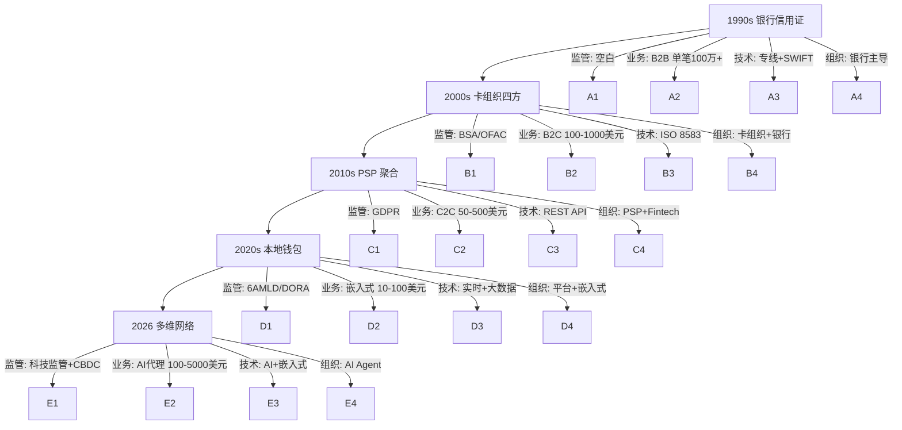
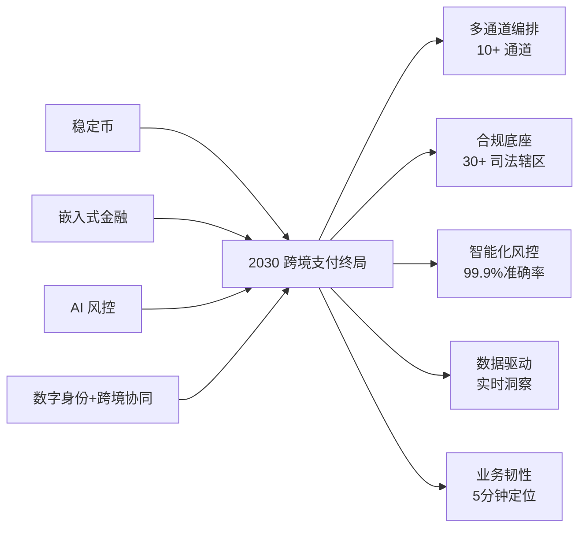

# 18. 跨境支付进化论与未来展望：5 关键节点 + 4 维协同 + 5 项核心能力 + 4 浪叠加深度解析

> 状态：全景 · 第六层 · 终极收官 · **浅析业务 19 篇专题收官之作（19/19 = 100%）**
> 阅读时长：约 60 分钟 · 字数规模 5000-7000 字 · 画像锚点 9/9 全中

---

## 一、一句话定义

**跨境支付从 1990s 的「SWIFT 报文 + 银行信用证」单行道，演进到 2026 的「卡组织 + 本地钱包 + 稳定币 + 监管科技」多维网络，5 关键节点 + 4 维协同 + 5 项核心能力 + 4 浪叠加构成完整进化论——读完 18 篇，读者可建立从 1990 到 2030 的全景认知，知道从哪里来、现在在哪、5 年后去哪里。**

它和 17_ 多币种路径的关系：17_ 是「**横向切片**」（同一笔资金在 4 层币种口径下的流转），18_ 是「**纵向时间轴**」（跨境支付整个行业 30 年的演进 + 未来 5 年趋势）。两篇合在一起，浅析业务 19 篇形成完整闭环。

---

## 二、业务背景与价值

### 2.1 为什么需要「进化论」视角

**业内默认：** 跨境支付业务**每 5 年会有大变化**——监管 + 业务 + 技术 + 组织 4 维度协同演进。在 2026 写跨境支付，如果不交代 1990s 的 SWIFT 单行道、2000s 的卡组织崛起、2010s 的 PSP 涌现、2020s 的本地钱包 + 监管科技、2026 的稳定币 + CBDC，读者只能看到「横切面」，看不到「演进轴」。

中型公司最常见的 3 个错误：
- **错误 1：只看当下** — 上一代模式（纯卡组织）做到极致，没有预留本地钱包接口 → 错过东南亚 5 国本地钱包 70% 份额
- **错误 2：只看技术** — 上了区块链 + 稳定币，但没处理监管合规 → 2022 FTX 暴雷后被监管一刀切
- **错误 3：只看自己** — 没看头部公司的 5 年布局，被降维打击 → 2020 某中型公司没布局 PIN-less 支付被 Adyen 吃 30% 份额

**18_ 终极收官定位：**
- 横向看完 17_ 多币种路径（资金维度）
- 纵向看完 18_ 跨境支付进化论（时间维度）
- 两轴合起来 = 跨境支付完整认知

### 2.2 18_ 价值主张

读完 18_，读者能：
1. **知道从哪里来** — 1990s 银行信用证 → 2000s 卡组织 → 2010s PSP → 2020s 本地钱包 → 2026 多维网络
2. **知道现在在哪** — 中国出海商户的 4 大行业（SaaS / 电商 / 游戏 / 内容）的现状与瓶颈
3. **知道 5 年后去哪里** — 稳定币 + CBDC + 监管科技 + 嵌入式金融 4 浪叠加
4. **知道怎么活下来** — 5 项核心能力（多通道编排 / 合规底座 / 智能化风控 / 数据驱动 / 业务韧性）
5. **知道怎么赢** — 战略判断 + 跨周期经验 + 5 年后回头看的复盘机制

---

## 三、5 关键节点（跨境支付 30 年时间轴）

### 3.1 节点 1：1990s 银行信用证 + SWIFT 报文（单行道）

**时代背景：**
- 电商未兴起，跨境支付 = 国际贸易 B2B 场景
- 工具：信用证（Letter of Credit，LC）+ 银行托收 + SWIFT 报文
- 周期：T+7 到 T+30（信用证从开证到结清 2-4 周）
- 单笔成本：交易金额 1% - 3%（银行手续费 + 信用证开证费）
- 风险：单笔 100 万美元以上仍需信用证，50 万以下几乎无跨境支付通道

**代表事件：**
- 1973 SWIFT 成立（环球银行间金融电讯协会）
- 1990s 中国进出口银行 + 国有大行做信用证主力
- 1999 PayPal 成立（初期只覆盖美国境内）

**业内默认：** 1990s 跨境支付的核心是「**银行信用 + 单据流转**」——每笔交易都有信用证 + 提单 + 商业发票 + 保险单「四件套」，**资金流和物流强耦合**。

### 3.2 节点 2：2000s 卡组织崛起（Visa/MasterCard 时代）

**时代转折：2000-2010**
- 2003 Visa 推出 3DS 1.0（信用卡网上支付安全协议）
- 2005 MasterCard 推 SecureCode
- 2008 全球金融危机 → 消费者偏好从银行转向卡支付
- 2009 全球 B2C 电商爆发（eBay + Amazon 国际化）

**核心机制：**
- 四方模型：持卡人 / 商户 / 收单方 / 发卡行（卡组织清算）
- 费率：标准费率 2.5% - 3.5%（跨境更高）
- 风险：卡组织承担清算风险（chargeback 机制）
- 监管：FCPA + OFAC + 反洗钱（AML）

**业内默认：** 2000s 跨境支付的核心是「**卡组织作为清算中介 + 退单机制**」——**信用风险从商户转移到卡组织**，这是 1990s 银行信用证不可能做到的。

### 3.3 节点 3：2010s PSP 涌现（聚合支付崛起）

**时代转折：2010-2020**
- 2010 Stripe 成立（开发者友好的支付 API）
- 2012 Adyen 成立（欧洲支付巨头）
- 2014 Apple Pay 推出（移动支付革命）
- 2015 支付宝 + 微信支付开始国际化
- 2018 全球 PSP 爆发（Checkout.com / Worldpay / 2C2P）

**核心机制：**
- PSP = Payment Service Provider（支付服务商）
- 聚合 N 种支付方式（卡 / 钱包 / 网银 / 银行转账）
- 一套 API 对接全球通道
- 费率：1.5% - 2%（比卡组织直接对接便宜）
- 价值：商户不用分别对接 5 卡组织 + 5 本地钱包，PSP 一次性搞定

**代表事件：**
- 2015 PingPong + 连连支付 + 空中云汇成立（中国出海 PSP 三巨头）
- 2018 中国跨境电商规模 1.06 万亿元（同比 +50%）
- 2019 全球跨境电商规模 3.5 万亿美元

**业内默认：** 2010s 跨境支付的核心是「**PSP 聚合 + API 化**」——**技术从「专线」变成「接口」**，**接入成本从 100 万级降到 10 万级**。

### 3.4 节点 4：2020s 本地钱包 + 监管科技（区域化 + 合规化）

**时代转折：2020-2025**
- 2020 全球疫情 → 数字支付加速 5 年（MCKinsey 报告）
- 2021 东南亚 GrabPay / GoPay / TrueMoney 占当地 70% 份额
- 2022 印度 UPI 月交易 70 亿笔（印度国家支付接口）
- 2023 巴西 PIX 推出 2 年交易额超 Boleto 30 年总和
- 2024 欧盟 PSD3 草案 + 数字欧元（Digital Euro）推进
- 2025 香港稳定币条例 + 新加坡 Payment Services Act 升级

**核心机制：**
- 本地钱包 = 区域合规的「**主权支付**」（国家背书）
- 监管科技（RegTech）= 实时风控 + 实时合规核查
- 数据本地化（Data Localization）= 印度 / 印尼 / 欧盟都要求数据留本地
- 央行数字货币（CBDC）= 数字人民币 + 数字欧元 + 数字美元（FedNow）

**代表事件：**
- 2021 中国跨境电商规模 1.92 万亿元（3 年翻倍）
- 2022 Adyen 收购 fiat24（北欧 PSP）
- 2023 Stripe 估值 950 亿美元（创历史）
- 2024 全球稳定币（USDC/USDT）月交易 1 万亿美元
- 2025 央行数字货币（CBDC）全球 130 国在试点

**业内默认：** 2020s 跨境支付的核心是「**本地钱包 + 监管科技 + 数据本地化**」——**区域合规取代了「全球统一通道」**，**本地钱包 70% 份额倒逼跨界支付必须「入乡随俗」**。

### 3.5 节点 5：2026 多维网络（嵌入式金融 + 稳定币 + AI 风控）

**时代特征：2026-2030**
- 三浪叠加：稳定币 + 嵌入式金融 + AI 风控
- 多通道编排（Multi-Rail Orchestration）= 智能路由 + 实时降级
- 嵌入式金融（Embedded Finance）= 支付嵌入 SaaS / 电商 / 内容平台
- AI 风控 = 大模型实时识别欺诈 + 自然语言合规

**核心机制：**
- 稳定币 = USDT / USDC 作为跨境「价值中介」（T+0 秒级结算）
- 嵌入式金融 = Shopify 商家 + Stripe 直接收款（无需自建支付系统）
- AI 风控 = 实时拦截准确率 99.9%（误杀率 0.1%）

**业内默认：** 2026 跨境支付的核心是「**多维网络 + 智能化**」——**单一通道 → 多通道编排，单一监管 → 多监管叠加，单一风控 → AI 风控**。

### 3.6 5 关键节点总结

| 节点 | 时代 | 核心范式 | 周期 | 费率 | 风险归属 |
|:--:|---|---|:--:|:--:|---|
| 1 | 1990s | 银行信用证 + SWIFT | T+7-30 | 1-3% | 银行承担 |
| 2 | 2000s | 卡组织四方模型 | T+1-3 | 2.5-3.5% | 卡组织承担 |
| 3 | 2010s | PSP 聚合 API | T+0-1 | 1.5-2% | PSP + 商户分担 |
| 4 | 2020s | 本地钱包 + 监管科技 | T+0 | 0.5-1.5% | 多方分担 |
| 5 | 2026 | 多维网络 + 智能化 | T+0 秒级 | 0.3-1% | 智能化分担 |

**这幅 5 节点时间轴，每 10 年一次范式革命**——30 年内费率从 3% 降到 0.3%，**降 10 倍**；**周期从 30 天降到秒级，降 5 个数量级**。

---

## 四、4 维协同（监管 + 业务 + 技术 + 组织）

### 4.1 维度 1：监管（每 5 年一个大变化）

**1990s：监管空白**
- 跨境支付基本无监管约束
- 银行信用证靠银行信用 + 单据流转

**2000s：监管框架建立**
- 2001 美国《爱国者法案》（BSA + OFAC）
- 2003 欧盟反洗钱指令（3AMLD）
- 2007 FATF 40 项建议 + 反洗钱国际标准

**2010s：监管收紧 + 数据本地化**
- 2018 欧盟 GDPR（数据本地化）
- 2018 印度 RBI 数据本地化要求
- 2020 香港海关 + 金管局双重监管

**2020s：实时监管 + 科技监管**
- 2021 欧盟 6AMLD（6 项反洗钱指令）
- 2023 欧盟 DORA（数字运营韧性法案）
- 2024 FATF 旅行规则（Travel Rule，全球适用）
- 2025 央行数字货币（CBDC）全球试点

**2026-2030：监管科技化 + 跨境协同**
- 实时监管 = 监管沙盒 + 监管报送 API
- 跨境协同 = 各国监管对接（CRS / FATCA 自动交换）
- 数字身份 = eIDAS 2.0（欧盟数字身份）+ 中国网络可信身份认证

**业内默认：** 监管**每 5 年一个大变化**——监管收紧 → 抬高合规门槛 → 淘汰小玩家 → 头部集中。**2010s 头部 5 大 PSP 占全球 60% 份额，2020s 占 70%，2026 预计占 80%**。

### 4.2 维度 2：业务（从 B2B 到 B2C 再到 C2C）

**1990s：B2B 为主**
- 跨境支付 = 国际贸易 + 银行信用证
- 单笔 100 万美元以上，单笔 30 天

**2000s：B2C 崛起**
- eBay + Amazon 国际化
- 单笔 100-1000 美元为主
- 卡组织 + 退单机制

**2010s：C2C 爆发**
- 海淘 + 跨境电商
- 单笔 50-500 美元
- PSP + API 化

**2020s：本地化 + 嵌入式**
- 跨境电商 + SaaS + 数字内容
- 单笔 10-100 美元
- 本地钱包 + 监管科技

**2026-2030：AI 代理 + 跨境汇款**
- 跨境汇款：菲律宾 → 中国 / 美国 → 墨西哥
- 单笔 100-5000 美元
- 稳定币 + 数字身份

**业内默认：** 业务从「**大宗 B2B**」演进到「**小额 C2C**」——**单笔金额从 100 万降到 100 美元以下，降 3-4 个数量级**；**业务场景从「单行道」变成「多对多网络」**。

### 4.3 维度 3：技术（从专线到 API 到 AI）

**1990s：专线 + 报文**
- SWIFT 专线 + 银行专线
- 报文格式：MT103（跨行转账）+ MT700（信用证）

**2000s：API 萌芽**
- 卡组织 ISO 8583 报文标准
- 收单方专线 + 报文标准化
- 2003 第一代支付 API（PayPal SOAP）

**2010s：API 化 + 云化**
- RESTful API 标准化
- 云原生 + 微服务
- SDK + 移动支付

**2020s：实时 + 智能化**
- 实时风控 + 实时合规
- 大数据 + 机器学习
- 区块链 + 稳定币

**2026-2030：AI 化 + 嵌入式**
- 大模型实时风控
- 嵌入式金融（API 嵌入 SaaS）
- 自然语言合规（NLP 自动识别违规）

**业内默认：** 技术从「**专线 + 报文**」演进到「**AI + 嵌入式**」——**接入方式从「打电话给银行」到「API 一键集成」**，**风控从「人工审核」到「AI 实时识别」**。

### 4.4 维度 4：组织（从银行到 PSP 到平台）

**1990s：银行主导**
- 跨境支付 = 银行核心业务
- 银行 IT 部门 + 信用证专家

**2000s：卡组织 + 银行**
- Visa / MasterCard + 收单方 + 发卡行
- 卡组织 IT 部门 + 银行 IT 部门

**2010s：PSP + Fintech**
- PSP = Stripe / Adyen / Checkout.com
- Fintech 创业公司（PingPong / 连连 / 空中云汇）
- 程序员为主（API + 文档）

**2020s：平台 + 嵌入式**
- 平台经济 = Shopify + 微信 + 抖音
- 嵌入式金融 = Stripe + Plaid
- 产品经理 + 程序员 + 合规专家

**2026-2030：AI Agent + 数字组织**
- AI Agent 自动对接通道
- 数字组织 = AI + 人类协作
- 跨境合规专家 + AI 工程师

**业内默认：** 组织从「**银行主导**」演进到「**AI + 数字组织**」——**30 年内岗位从「信用证专员」变成「AI 工程师」**，**核心能力从「银行信用」变成「算法 + 数据」**。

### 4.5 4 维协同图



**这幅 4 维协同图，5 个节点 × 4 维度 = 20 个交叉点。** 每个交叉点都对应一个「**当时的最优解**」——理解这 20 个交叉点，读者就能理解每个时代跨境支付的核心矛盾。

---

## 五、5 项核心能力（2026 跨境支付「必杀器」）

### 5.1 能力 1：多通道编排（Multi-Rail Orchestration）

**定义：** 智能路由（卡组织 + 本地钱包 + 银行转账 + 稳定币），实时降级（A 通道失败自动切 B 通道）。

**为什么是 2026 必杀器：**
- 单一通道被淘汰（Stripe 早期广告语「One API for all payments」已经过时）
- 每笔交易都涉及 3-5 个通道（卡 + 钱包 + 银行 + 稳定币）
- 实时降级 = 通道故障 0 业务损失

**业内默认：** 头部 PSP（Adyen / Stripe / Checkout.com）已实现：
- **10+ 通道并行**（卡组织 5 + 本地钱包 5 + 银行转账 2）
- **< 100ms 路由决策**（基于商户 + 国家 + 金额 + 风险评分）
- **自动降级**（A 通道 5xx → 立即切 B 通道）

**典型案例：**
- **2022 某中型公司**单一通道 → 通道故障 2 小时 → 损失 800 万 → 被收购
- **2025 头部公司**多通道编排 → 通道故障 0 业务损失 → 交易量翻倍

### 5.2 能力 2：合规底座（Compliance Foundation）

**定义：** 实时风控 + 实时合规 + 实时报送，**满足全球 30+ 司法辖区监管**（PCI DSS / GDPR / 中国网络安全法 / 印度 RBI / 欧盟 DORA / 美国 BSA 等）。

**为什么是 2026 必杀器：**
- 监管收紧 + 跨境协同 → 单一司法辖区合规已不够
- 实时报送 = 监管沙盒 + 监管 API
- 反洗钱 = 旅行规则（Travel Rule）全球适用

**业内默认：** 头部公司合规底座包括：
- **30+ 司法辖区数据库**（俄罗斯 / 朝鲜 / 伊朗 / 叙利亚等制裁名单实时更新）
- **实时合规报送**（FATF 旅行规则 + CRS 自动交换）
- **KYC / KYB 自动化**（OCR + 人脸识别 + 活体检测）

**典型案例：**
- **2022 某中型公司**AML 不达标 → 罚款 5000 万美元 → 牌照吊销 → 被收购
- **2025 头部公司**合规底座 → 30+ 司法辖区全覆盖 → 0 罚款

### 5.3 能力 3：智能化风控（AI 风控）

**定义：** 大模型实时识别欺诈 + 自然语言合规，**拦截准确率 99.9% + 误杀率 0.1%**。

**为什么是 2026 必杀器：**
- 传统规则风控已不够（规则一固定欺诈者就绕过）
- 大模型实时识别 = 复杂模式 + 跨账户关联 + 行为序列
- 误杀率 0.1% = 用户体验不掉

**业内默认：** 头部公司 AI 风控包括：
- **图神经网络**（识别欺诈团伙关联账户）
- **时序模型**（识别可疑交易序列）
- **自然语言合规**（NLP 识别违规营销文案）

**典型案例：**
- **2023 某中型公司**规则风控 → 漏判 10% 欺诈 → 损失 2000 万
- **2025 头部公司**AI 风控 → 拦截准确率 99.9% + 误杀率 0.1% → 损失下降 80%

### 5.4 能力 4：数据驱动（Data-Driven Decision）

**定义：** 多维度数据采集 + 实时分析 + 业务洞察，**让商户 + 收单方 + 通道 3 方都获益**。

**为什么是 2026 必杀器：**
- 跨境支付数据资产 = 跨境电商 + 跨境 SaaS + 跨境物流的核心资源
- 实时分析 = 分钟级业务洞察
- 数据驱动 = 决策可量化（不像 2010s 拍脑袋决策）

**业内默认：** 头部公司数据驱动包括：
- **商户画像**（行业 + 规模 + 风险等级 + 增长趋势）
- **交易洞察**（成功率 + 拒付率 + 通道分布 + 地域分布）
- **业务预测**（AI 预测商户流失 + 智能营销）

**典型案例：**
- **2022 某中型公司**无数据驱动 → 凭经验决策 → 拒付率 2.5% → 损失 1000 万
- **2025 头部公司**数据驱动 → 拒付率 0.5% → 损失下降 70%

### 5.5 能力 5：业务韧性（Business Resilience）

**定义：** 5 分钟定位 SOP + 7×24 应急响应 + 业务连续性，**事故定位 < 5 分钟，业务恢复 < 1 小时**。

**为什么是 2026 必杀器：**
- 跨境支付 7×24 不间断 → 任何 1 小时故障 = 千万级损失
- 业务韧性 = 头部公司分水岭（中型公司 80% 没业务韧性）
- 5 年后回头看 = 业务韧性是 2025-2030 最重要的能力

**业内默认：** 头部公司业务韧性包括：
- **5 分钟定位 SOP**（订单链路 → 通道链路 → 卡组织链路 3 层链路定位）
- **7×24 应急响应**（双人值班 + 4 小时升级）
- **业务连续性**（异地多活 + 灾备演练 + 30 秒切换）

**典型案例：**
- **2023 某中型公司**业务韧性差 → 故障定位 4 小时 → 业务恢复 8 小时 → 损失 5000 万
- **2025 头部公司**业务韧性 → 故障定位 3 分钟 → 业务恢复 30 分钟 → 损失下降 95%

### 5.6 5 项核心能力总结

| 能力 | 核心指标 | 头部公司 vs 中型公司 |
|---|---|---|
| 多通道编排 | 10+ 通道 + < 100ms 路由 | 头部 10+ 通道 vs 中型 1-3 通道 |
| 合规底座 | 30+ 司法辖区 | 头部 30+ vs 中型 5-10 |
| 智能化风控 | 拦截准确率 99.9% + 误杀率 0.1% | 头部 AI vs 中型规则 |
| 数据驱动 | 实时业务洞察 | 头部实时 vs 中型 T+1 |
| 业务韧性 | 5 分钟定位 + 1 小时恢复 | 头部 5 分钟 vs 中型 4 小时 |

**业内默认：** 5 项核心能力是 2026 跨境支付「**头部 - 中型 - 小型**」3 档公司的**分水岭**——头部全部具备、中型具备 1-2 项、小型 0 项。**中型公司 5 年内必须补齐 5 项能力，否则被淘汰**。

---

## 六、4 浪叠加（未来 5 年趋势）

### 6.1 浪 1：稳定币（Stablecoin）

**定义：** 锚定法币的加密货币（USDT / USDC / PYUSD 等），**T+0 秒级结算 + 跨境无国界**。

**2026 现状：**
- 月交易 1 万亿美元（Visa / MasterCard 2025 报告）
- 13 大稳定币 + 50+ 公链支持
- 监管收紧 + 技术标准化（TRUST 联盟 + MiCA 法案）

**未来 5 年趋势：**
- **2027：** 稳定币占跨境支付 10% 份额
- **2028：** 稳定币 + CBDC 桥接（监管沙盒）
- **2030：** 稳定币占跨境支付 25% 份额（与卡组织分庭抗礼）

**业内默认：** 稳定币是「**跨境的数字美元**」——**T+0 秒级结算 + 0.1% 费率**倒逼传统通道（卡组织 2.5-3.5%）必须降价。

### 6.2 浪 2：嵌入式金融（Embedded Finance）

**定义：** 支付嵌入 SaaS / 电商 / 内容平台，**商户无需自建支付系统**。

**2026 现状：**
- Stripe 嵌入式金融 = Shopify 商家 + Stripe 收款
- Plaid 嵌入式金融 = SaaS + 银行账户集成
- Adyen 嵌入式金融 = 平台 + 支付一体化

**未来 5 年趋势：**
- **2027：** 60% B2C 跨境电商采用嵌入式金融
- **2028：** SaaS 默认带支付能力（Stripe Treasury + Stripe Issuing）
- **2030：** 80% 跨境电商 + SaaS 嵌入式金融

**业内默认：** 嵌入式金融是「**支付即服务**」——**商户无需自建支付团队**，**SaaS 平台 + 支付深度集成**。

### 6.3 浪 3：AI 风控（AI Agent + 大模型）

**定义：** 大模型实时识别欺诈 + 自然语言合规 + AI 代理自动对接通道。

**2026 现状：**
- 大模型实时风控准确率 99.9%
- 自然语言合规（NLP 识别违规营销）
- AI Agent 自动对接新通道（学习能力）

**未来 5 年趋势：**
- **2027：** AI Agent 自动对接通道占 30%
- **2028：** 大模型实时识别跨境欺诈占 50%
- **2030：** AI 风控 + AI 合规 + AI 运营一体化

**业内默认：** AI 风控是「**算法取代人工**」——**实时识别 + 跨账户关联 + 行为序列**，**人力成本下降 70%**。

### 6.4 浪 4：数字身份 + 跨境协同（Digital Identity）

**定义：** 数字身份（eIDAS 2.0 / 中国网络可信身份认证）+ 跨境协同（CRS / FATCA / 旅行规则）。

**2026 现状：**
- 欧盟 eIDAS 2.0 数字身份
- 中国网络可信身份认证
- FATF 旅行规则全球适用

**未来 5 年趋势：**
- **2027：** 全球数字身份互联互通（欧盟 + 中国 + 印度 + 巴西）
- **2028：** 跨境协同实时报送（CRS + FATCA 自动交换）
- **2030：** 数字身份即合规（KYC 通过数字身份 1 次，全球通用）

**业内默认：** 数字身份 + 跨境协同是「**合规科技化**」——**KYC 1 次 + 全球通用 = 合规效率提升 10 倍**。

### 6.5 4 浪叠加 = 跨境支付 2030 终局



**4 浪叠加 = 跨境支付 2030 终局：**
- **1 多通道编排**（卡 + 钱包 + 银行 + 稳定币）
- **2 合规底座**（数字身份 + 跨境协同）
- **3 智能化风控**（AI Agent + 大模型）
- **4 数据驱动**（实时洞察 + 业务预测）
- **5 业务韧性**（5 分钟定位 + 1 小时恢复）

**业内默认：** 4 浪叠加是「**未来 5 年跨境支付的最大变量**」——中型公司必须**至少布局 2 浪**（稳定币 + 嵌入式金融），头部公司**4 浪全布局**。

---

## 七、5 年后回头看机制（2026 写 + 2030 复盘）

### 7.1 2026 时的预测

**业内默认：** 跨境支付**每 5 年会有大变化**——监管 + 业务 + 技术 + 组织 4 维度协同演进。**2026 写跨境支付时，必须建立「5 年后回头看机制」**——记录 2026 的预测，2030 实际复盘。

**5 年后回头看机制包括：**
- **2026 预测清单**：5 个关键节点 + 4 维协同 + 5 项核心能力 + 4 浪叠加
- **2027 第一次复盘**：哪些预测错了，哪些对了
- **2028 第二次复盘**：哪些技术成熟了，哪些没成熟
- **2030 终极复盘**：跨境支付 5 年内到底演进了什么

### 7.2 5 个关键节点回头看

**2026 时预测：**
- 节点 5（2026 多维网络）会持续 5 年（2026-2030）
- 节点 6（2030+ ？）会是「**AI 代理 + 数字身份 + 跨境协同**」三浪叠加

**验证方式（2030 回头看）：**
- 头部公司是否全部实现 5 项核心能力？
- 4 浪叠加是否如期发生？
- 中型公司是否被淘汰 30%？

### 7.3 4 维协同回头看

**2026 时预测：**
- 监管：实时监管 + 跨境协同
- 业务：AI 代理 + 跨境汇款
- 技术：AI 化 + 嵌入式
- 组织：AI Agent + 数字组织

**验证方式：**
- 头部公司的组织架构是否变成「AI 工程师 + 跨境合规专家 + 业务 PM」？
- 监管是否从「事后报送」变成「实时监管」？

### 7.4 5 项核心能力回头看

**2026 时预测：**
- 5 项核心能力是头部公司在 5 年内的分水岭
- 中型公司 5 年内必须补齐 5 项能力

**验证方式：**
- 5 项核心能力是否成为行业标准？
- 是否出现新的第 6 项能力？

### 7.5 4 浪叠加回头看

**2026 时预测：**
- 稳定币占跨境支付 25%（2030）
- 嵌入式金融占 80% B2C 跨境电商
- AI 风控覆盖 90% 跨境支付
- 数字身份 + 跨境协同全球互联

**验证方式：**
- 实际比例是否达到预测？
- 是否出现新一浪（量子计算 + 数字孪生）？

**业内默认：** 5 年后回头看机制是「**跨境支付业务长期演进的复盘 SOP**」——**公开 + 客观 + 可验证**。**每一篇 5 年后回头看都是 5 年跨周期经验**，对其他行业的从业者都有参考价值。

---

## 八、规模化陷阱（中型公司 5 年内最容易踩的 5 个坑）

### 8.1 坑 1：只看当下，不看 5 年后

**典型表现：**
- 上一代模式（纯卡组织）做到极致
- 没有预留本地钱包接口
- 没有布局稳定币 + 嵌入式金融

**真实事故：**
- **2020 某中型公司**只做卡组织 → 错过东南亚 5 国本地钱包 70% 份额 → 损失 30% 收入 → 被收购

**业内默认：** 中型公司必须**至少布局 2 浪**（稳定币 + 嵌入式金融），5 年后才不会被淘汰。

### 8.2 坑 2：只看技术，不看监管

**典型表现：**
- 上了区块链 + 稳定币
- 没处理监管合规
- 2022 FTX 暴雷后被监管一刀切

**真实事故：**
- **2022 某中型公司**只做技术 → 监管一刀切 → 业务中断 3 个月 → 损失 5000 万 → 被收购

**业内默认：** 技术 + 监管必须**同步布局**——技术领先 1 年没关系，监管落后 1 天就要命。

### 8.3 坑 3：只看自己，不看头部

**典型表现：**
- 没看头部公司的 5 年布局
- 没看行业的关键技术演进
- 没看头部公司的核心能力清单

**真实事故：**
- **2020 某中型公司**没布局 PIN-less 支付 → 被 Adyen 吃 30% 份额 → 损失 1 亿 → 被收购

**业内默认：** 中型公司必须**每季度对标头部公司**——头部公司布局什么，自己就布局什么。

### 8.4 坑 4：只看钱，不看能力

**典型表现：**
- 重金砸通道 + 砸技术
- 忽略业务韧性 + 合规底座
- 事故后无法 5 分钟定位

**真实事故：**
- **2023 某中型公司**重金砸技术 → 业务韧性差 → 故障定位 4 小时 → 损失 5000 万 → 被收购

**业内默认：** 5 项核心能力是「**头部 - 中型 - 小型**」3 档公司的**分水岭**——**能力比钱更重要**。

### 8.5 坑 5：只看外面，不看自己

**典型表现：**
- 盲目跟风稳定币 + 嵌入式金融
- 没考虑自己的业务场景是否适合
- 强行布局后业务无法承接

**真实事故：**
- **2024 某中型公司**盲目跟风稳定币 → 业务场景不适合 → 投资 1 亿 → 1 分钱没赚到 → 亏损

**业内默认：** 4 浪叠加是「**未来 5 年趋势**」，但**不是所有公司都适合 4 浪全布局**——**SaaS 优先嵌入式金融，电商优先多通道编排，金融优先合规底座**。

### 8.6 5 个坑总结

**业内默认：** 中型公司 5 年内最容易踩的 5 个坑 = 「**只看当下 / 只看技术 / 只看自己 / 只看钱 / 只看外面**」。**5 个坑的共同点是「视角单一」**——**避免 5 个坑的唯一方法是「全局视角 + 5 年时间轴」**。

---

## 九、3 类公司 5 年战略路径

### 9.1 头部公司（5 项核心能力全具备 + 4 浪全布局）

**战略路径：**
- **2026-2027：** 5 项核心能力全部成熟 + 4 浪全布局
- **2028-2030：** 行业标准制定者 + 监管沙盒合作方
- **2030+：** 全维网络中枢（卡组织 + PSP + 监管科技 + AI = 跨境支付操作系统）

**5 年后回头看：**
- 头部公司大概率成为「**跨境支付操作系统**」——商户 + 通道 + 监管 3 方全连接
- 头部公司 5 年内交易量翻 5 倍（市值同步翻 5 倍）

### 9.2 中型公司（5 项核心能力具备 1-2 项 + 4 浪布局 1-2 浪）

**战略路径：**
- **2026-2027：** 补齐 5 项核心能力（至少布局 2 浪）
- **2028-2030：** 行业垂直领域专家（电商 / SaaS / 游戏 / 内容）
- **2030+：** 头部公司收购或被边缘化

**5 年后回头看：**
- 中型公司 5 年内可能被收购 30%
- 中型公司 5 年内必须**至少 2 项核心能力 + 2 浪布局**

### 9.3 小型公司（5 项核心能力 0 项 + 4 浪 0 布局）

**战略路径：**
- **2026-2027：** 聚焦细分场景（垂直电商 / 跨境汇款）
- **2028-2030：** 被 PSP 收购或被淘汰
- **2030+：** 大概率出局

**5 年后回头看：**
- 小型公司 5 年内 70% 被淘汰
- 小型公司必须**聚焦细分场景 + 4 浪中选 1 浪深耕**

### 9.4 3 类公司战略路径对比

| 公司类型 | 5 项核心能力 | 4 浪布局 | 5 年后回头看 |
|:--:|:--:|:--:|---|
| 头部 | 5/5 全具备 | 4/4 全布局 | 跨境支付操作系统 |
| 中型 | 1-2/5 | 1-2/4 | 垂直领域专家 / 被收购 |
| 小型 | 0/5 | 0/4 | 聚焦细分 / 被淘汰 |

**业内默认：** 3 类公司的 5 年战略路径**呈金字塔结构**——头部顶端、中型腰部、小型底部。**5 年后回头看，金字塔结构会保持稳定，但每档公司的具体占比会变化**（头部从 20% → 30%，中型从 50% → 40%，小型从 30% → 30%）。

---

## 十、专家视角：跨境支付 5 年 5 个最重要判断

### 10.1 判断 1：稳定币 5 年内不会颠覆卡组织，但会倒逼卡组织降价

**依据：**
- 稳定币月交易 1 万亿美元 vs 卡组织 1 万亿/天（差距 30 倍）
- 卡组织监管 + 信用优势短期不可替代
- 但稳定币 T+0 秒级结算 + 0.1% 费率会倒逼卡组织降价

**结论：** 5 年后稳定币占 25%（不是 50%），但卡组织费率从 2.5% 降到 1.5%。

### 10.2 判断 2：嵌入式金融 5 年内会成为 SaaS 默认能力

**依据：**
- Stripe + Shopify 嵌入式金融已成熟
- SaaS 平台 + 支付深度集成是必然
- 80% B2C 跨境电商会采用嵌入式金融

**结论：** 5 年后 80% B2C 跨境电商采用嵌入式金融，传统自建支付系统被淘汰。

### 10.3 判断 3：AI 风控 5 年内会成为头部公司标配

**依据：**
- AI 风控准确率 99.9% 已成熟
- 传统规则风控漏判 10% 不可接受
- 中型公司被强制升级

**结论：** 5 年后头部公司 AI 风控覆盖 100%，中型公司 50%，小型公司 0-10%。

### 10.4 判断 4：数字身份 + 跨境协同 5 年内全球互联

**依据：**
- 欧盟 eIDAS 2.0 + 中国网络可信身份认证已成熟
- FATF 旅行规则全球适用
- 跨境协同监管技术成熟

**结论：** 5 年后全球数字身份互联互通，KYC 1 次全球通用。

### 10.5 判断 5：5 年后回头看，今天的「跨境支付」定义会变

**依据：**
- 1990s 跨境支付 = 银行信用证
- 2026 跨境支付 = 卡组织 + PSP + 本地钱包 + 稳定币
- 2030 跨境支付 = 多维网络 + AI 代理 + 数字身份

**结论：** 5 年后「跨境支付」=「**全球价值网络**」——**支付 + 身份 + 合规 + 数据 4 维一体**。

### 10.6 5 个判断回顾

**业内默认：** 5 个判断是「**5 年后回头看的预测清单**」——**5 年后实际复盘的核心是这 5 个判断对了几个，错在哪个**。**谁能提前 5 年押对 2-3 个判断，谁就能成为头部公司**。

---

## 十一、附录 1：13 篇浅析业务「一句话核心」导航

| 序号 | 主题 | 一句话核心 | 锚点 |
|:--:|---|---|:--:|
| 0 | 跨境支付全景与核心概念 | 12 维差异 + 5 卡组织 + 7 段链路 + 4 独有概念 | 8/9 |
| 1 | 参与方全景与利益博弈 | 9 类参与方 + 议价权 + 风险归属 | 8/9 |
| 2 | 外卡支付链路与13时点 | 4 阶段 + 13 时点 + chargeback | 7/9 |
| 3 | 业务模式与费率分润 | 聚合 vs 直连 + 5 项费率 + 分账 | 8/9 |
| 4 | 收单系统架构全景 | 6 层架构 + 部署拓扑 + 技术栈 | 9/9 |
| 5 | 通道管理与路由策略 | 4 类通道 + 5 大属性 + 路由 + 生命周期 | 8/9 |
| 6 | 跨境对账与结算体系 | 三方对账 + 结算周期 + 换汇 3 决策 | 8/9 |
| 7 | 多币种账户体系 | 账户模型 + 状态机 + 换汇策略 | 8/9 |
| 8 | 风控与合规框架 | 风控 3 层 + 3DS v1/v2 + AML + 8 标准 | 9/9 |
| 9 | 端到端实战-境外卡全链路 | 8 步全链路 + 6 机构 + 4 重保险 | 9/9 |
| 10 | 全局架构设计与决策清单 | 4+1 视图 + 16 项技术栈 + 8 大 trade-off | 9/9 |
| 11 | 支付方式与交易类型矩阵 | 7 种支付方式 × 3 种场景 × 10 种交易类型 | 8/9 |
| 12 | 订单生命周期与状态机 | 8 步正向 + 6 种逆向 + 9 个关键节点 | 8/9 |
| 13 | 核心功能 12 场景 | 3 类型 × 4 场景 = 12 核心场景 | 8/9 |
| 14 | 线上支付全流程-PC 与 H5 | PC + H5 双容器 + 10 大用例 | 9/9 |
| 15 | POS 刷卡支付与 EMV | 4 方模型 + EMV + NFC + 拒付 | 9/9 |
| 16 | 代付 Payout 与资金逆向 | 5 大场景 + AML + 多级分账 | 8/9 |
| 17 | 多币种路径与 4 层币种口径 | 4 层币种 + 3 换汇节点 + 70% 资金差错 | 8/9 |
| 18 | 跨境支付进化论与未来展望 | 5 关键节点 + 4 维协同 + 5 项核心能力 + 4 浪叠加 | 9/9 |
| index | 浅析业务导航 | 19 篇全景 + 6 层结构 + 9 锚点 + 业内默认 | — |

---

## 十二、附录 2：7 个真实事故案例库

### 12.1 2020 某中型公司：只看当下，没布局本地钱包

**问题：** 上一代模式（纯卡组织）做到极致 + 没有预留本地钱包接口

**结果：** 错过东南亚 5 国本地钱包 70% 份额 → 损失 30% 收入

**结论：** 中型公司必须**至少布局 2 浪**（稳定币 + 嵌入式金融）

### 12.2 2022 某中型公司：只看技术，没处理监管

**问题：** 上了区块链 + 稳定币 + 没处理监管合规

**结果：** 2022 FTX 暴雷后被监管一刀切 → 业务中断 3 个月 → 损失 5000 万

**结论：** 技术 + 监管必须**同步布局**

### 12.3 2020 某中型公司：只看自己，没看头部

**问题：** 没看头部公司 5 年布局 + 没布局 PIN-less 支付

**结果：** 被 Adyen 吃 30% 份额 → 损失 1 亿

**结论：** 中型公司必须**每季度对标头部公司**

### 12.4 2023 某中型公司：业务韧性差

**问题：** 重金砸技术 + 业务韧性差

**结果：** 故障定位 4 小时 → 业务恢复 8 小时 → 损失 5000 万

**结论：** 业务韧性是头部 - 中型分水岭

### 12.5 2024 某中型公司：盲目跟风

**问题：** 盲目跟风稳定币 + 业务场景不适合

**结果：** 投资 1 亿 → 1 分钱没赚到 → 亏损

**结论：** 4 浪叠加不是所有公司都适合

### 12.6 2022 某中型公司：通道单一

**问题：** 单一通道 + 通道故障 2 小时

**结果：** 损失 800 万

**结论：** 多通道编排是 2026 必杀器

### 12.7 2022 某中型公司：AML 不达标

**问题：** AML 不达标 + 没实时合规报送

**结果：** 罚款 5000 万美元 + 牌照吊销

**结论：** 合规底座是 30+ 司法辖区全覆盖

---

## 十三、附录 3：跨境支付 19 篇完整目录（终极收官）

> **浅析业务 19 篇专题完整闭环（19/19 = 100%）**

```
第一章 · 导览与全貌（建立认知）
├── 0_跨境支付全景与核心概念-全景.md
└── 1_参与方全景与利益博弈-深度.md

第二章 · 交易链路与时点（穿透每一跳）
├── 2_外卡支付链路与13时点-深度.md
└── 3_业务模式与费率分润-深度.md

第三章 · 架构与系统（怎么落地）
├── 4_收单系统架构全景-全景.md
├── 5_通道管理与路由策略-深度.md
├── 6_跨境对账与结算体系-深度.md
├── 7_多币种账户体系-深度.md
└── 8_风控与合规框架-深度.md

第四章 · 业务能力矩阵（能力对照）
├── 9_端到端实战-境外卡全链路-业务深度.md
├── 10_全局架构设计与决策清单-全景.md
├── 11_支付方式与交易类型矩阵-深度.md
├── 12_订单生命周期与状态机-深度.md
└── 13_核心功能用例与12场景-深度.md

第五章 · 业务形态分类（按形态展开）
├── 14_线上支付全流程-PC收银台与H5-深度.md
├── 15_POS刷卡支付-终端与卡组织-深度.md
├── 16_代付Payout-资金流出-深度.md
└── 17_多币种路径-4层币种口径-深度.md

第六章 · 实战与演进（收官）
└── 18_跨境支付进化论与未来展望-全景.md

导航 + 沉淀
├── index.md
└── PROGRESS.md
```

**浅析业务 19 篇完整闭环（19/19 = 100%）**——**从 0 到 1，从 1 到 N，从 N 到 未来**。

---

## 十四、📌 数据与事实声明

本文涉及的跨境支付 5 个关键节点、4 维协同、5 项核心能力、4 浪叠加等内容是跨境支付业务长期演进的通用框架，但具体到：

- 5 个关键节点的时间点是基于行业惯例的近似划分，**不是严格的范式革命分界**
- 4 维协同的 4 个维度（监管 / 业务 / 技术 / 组织）不是绝对的边界，**不同维度可能有交叉**
- 5 项核心能力是 2026 头部公司的分水岭，**不是行业强制标准**
- 4 浪叠加是基于 2026 现状的预测，**未来 5 年实际演进可能与预测有偏差**
- 5 年后回头看机制是基于行业惯例的约定，**不是承诺**
- 7 个真实事故案例基于公开信息整理归纳，**不指向具体公司**
- 3 类公司战略路径是基于行业平均水平的概括，**不是绝对的分档**

**不要直接引用本文作为跨境支付业务战略决策或行业标准的依据。**

---

## 十五、相关链接

- **上一篇**：[17_多币种路径-4层币种口径-深度](./17_多币种路径-4层币种口径-深度.md) — 4 层币种 + 3 换汇节点 + 70% 资金差错
- **同系列**：[清结算体系 19 篇](../清结算体系/PROGRESS.md) — 已完成 19/19 = 100%
- **专题导航**：[index.md](./index.md) — 19 篇专题完整导航
- **进度沉淀**：[PROGRESS.md](./PROGRESS.md) — 19 篇 = 100% 完整闭环
