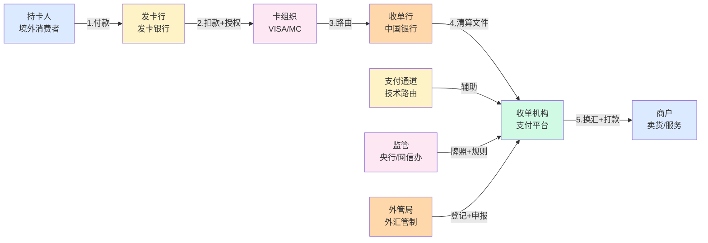
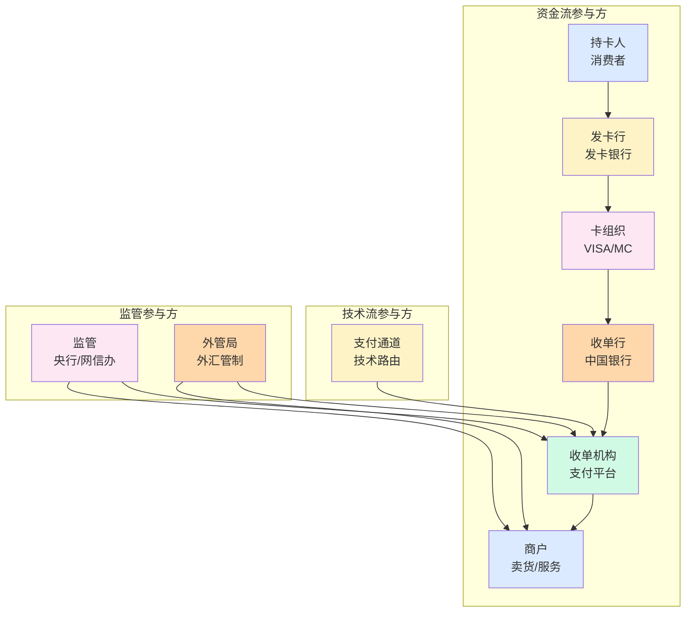

# 参与方全景与利益博弈(深度)

> **系列第 1 篇 · 深度**
> 上一篇 [0_跨境支付全景与核心概念-全景](./0_跨境支付全景与核心概念-全景.md) 讲了 12 维差异 + 5 卡组织 + 7 段链路 + 4 独有概念。本篇是**第一层 · 导览与全貌的第二篇**——讲**参与方全景**——**9 类参与方**（持卡人 / 发卡行 / 卡组织 / 收单行 / 收单机构 / 商户 / 支付通道 / 监管 / 外管局）+ **议价权分布** + **5 类风险归属** + **业内默认**。

---

## 一句话定义

> **跨境支付的 9 类参与方 = 6 个资金流参与方（持卡人 / 发卡行 / 卡组织 / 收单行 / 收单机构 / 商户）+ 1 个技术流参与方（支付通道）+ 2 个监管参与方（外管局 + 央行/网信办）**。每类参与方都有「**赚什么钱 + 扛什么风险 + 议价权**」3 维度。**业内默认：** 头部公司必须**「9 类参与方全覆盖 + 议价权清晰 + 风险归属明确」**——**单一参与方不清楚 = 业务亏损**。

---

## 业务背景与价值

### 为什么「参与方全景」是核心难题？

入门读者以为「跨境支付 = 用户付款 + 商户收钱」。但跨境支付涉及**9 类参与方**——每类参与方都有不同的**利益诉求 + 风险偏好 + 议价能力**。

**9 类参与方的真实复杂度：**
- **6 个资金流参与方**：持卡人 / 发卡行 / 卡组织 / 收单行 / 收单机构 / 商户
- **1 个技术流参与方**：支付通道
- **2 个监管参与方**：外管局 + 央行/网信办

**业内默认：** 跨境支付的真实复杂度是「**6 + 1 + 2 = 9 类参与方**」——**不是简单的「付款 + 收钱」**

### 参与方的 3 维度框架

**维度 1：赚什么钱（盈利模式）**
- 持卡人：花钱（不赚钱）
- 发卡行：交换费 ~1.5%（手续费大头）
- 卡组织：转接费 ~0.05% + 品牌使用费
- 收单行：收单服务费 ~0.2%
- 收单机构：服务费 + SaaS 费 + 汇兑收益（综合 ~0.5%-1%）
- 商户：销售商品 / 服务的利润
- 支付通道：技术通道费（按调用次数或交易笔数）
- 监管：行政收费 + 合规审查
- 外管局：外汇登记费 + 跨境收支申报

**维度 2：扛什么风险（风险归属）**
- 持卡人：盗刷（发卡行赔付）
- 发卡行：盗刷风险（赔付持卡人）
- 卡组织：品牌风险（拒付率过高被罚款/关通道）
- 收单行：合规风险（反洗钱）
- **收单机构：最大风险方（拒付 + 汇率 + 合规 + 通道故障 4 重）**
- 商户：拒付（货发了钱被扣回）+ 汇率波动
- 支付通道：技术故障 + 通道限额
- 监管：行业风险（系统性风险）
- 外管局：跨境收支风险（外汇储备）

**维度 3：议价权（话语权）**
- 持卡人：无议价权
- 发卡行：**高**（卡组织定规则）
- 卡组织：**极高**（规则制定者）
- 收单行：**中**（与卡组织签约）
- 收单机构：**中**（依赖收单行）
- 商户：**低-中**（依赖收单机构）
- 支付通道：**低**（依赖卡组织）
- 监管：**极高**（牌照发放者）
- 外管局：**极高**（外汇管制者）

**业内默认：** 9 类参与方的「**3 维度框架**」共同决定跨境支付的复杂度——**单一维度不清楚 = 业务亏损**

### 监管意图：为什么「参与方」必须合规？

监管对参与方有「**牌照发放 + 利益平衡 + 风险隔离**」3 重要求：
1. **牌照发放**——每个参与方都有明确的牌照要求（支付牌照 / 银行牌照 / 收单牌照）
2. **利益平衡**——监管保护弱势方（持卡人 + 商户），平衡强势方（卡组织 + 收单机构）
3. **风险隔离**——每个参与方都有明确的风险归属，不能转嫁

**专家视角：** 3 条要求**决定了 9 类参与方必须有「**牌照 + 利益平衡 + 风险隔离**」三重要求**——不是简单的「各自赚钱」

---

## 业务术语表

| 中文 | 英文 | 一句话解释 |
|---|---|---|
| 持卡人 | Cardholder | 持卡消费者 |
| 发卡行 | Issuing Bank | 发卡给消费者的银行 |
| 卡组织 | Card Network | VISA / Mastercard 等 |
| 收单行 | Acquiring Bank | 与卡组织签约的银行 |
| 收单机构 | Acquirer / PSP | 为商户提供收单服务的平台 |
| 商户 | Merchant | 卖货 / 服务的公司 |
| 支付通道 | Payment Channel | 具体的技术路由 |
| 监管 | Regulator | 央行 / 银保监会等 |
| 外管局 | SAFE | 国家外汇管理局 |
| 议价权 | Bargaining Power | 在利益分配中的话语权 |
| 风险归属 | Risk Attribution | 风险由谁承担 |
| 牌照 | License | 业务经营许可 |
| 交换费 | Interchange Fee | 发卡行收取的手续费 |
| 转接费 | Assessment Fee | 卡组织收取的转接费 |
| 收单服务费 | Acquiring Markup | 收单行/收单机构收取的服务费 |
| 品牌使用费 | Brand Fee | 卡组织收取的品牌使用费 |
| 反洗钱 | AML | 反洗钱合规 |
| KYC | Know Your Customer | 客户身份识别 |
| 跨境支付试点 | Cross-Border Payment Pilot | 央行的跨境支付试点资格 |
| 备付金 | Reserve | 支付机构客户备付金 |

---

## 业务形态与模式：9 类参与方详解

### 参与方 1：持卡人（Cardholder）

**业务形态：**
- 境外消费者（如新加坡用户 / 美国用户 / 欧洲用户）
- 用自己的 VISA / Mastercard / Amex / JCB / 银联国际 卡付款

**盈利模式：**
- **不赚钱**（花钱方）

**风险归属：**
- 盗刷风险（但发卡行赔付）

**议价权：**
- **无议价权**（个人对卡组织 / 收单机构）

**业内默认：** 持卡人是**最弱势方**——监管保护（盗刷赔付 + 拒付权），但议价权最低

### 参与方 2：发卡行（Issuing Bank）

**业务形态：**
- 发卡给持卡人的银行（如新加坡 DBS / 美国 Chase / 欧洲 BNP）
- 验证卡号 + CVV + 余额
- 扣款 + 授权

**盈利模式：**
- **交换费 ~1.5%**（手续费大头，~70% 的手续费）
- 其他收入：年费 / 利息 / 跨境取现

**风险归属：**
- 盗刷风险（赔付持卡人）
- 信用风险（持卡人不还款）

**议价权：**
- **高**（卡组织定规则 + 发卡行数量多）

**业内默认：** 发卡行是**手续费最大受益方**——70% 手续费 + 议价权高 + 但承担盗刷赔付

### 参与方 3：卡组织（Card Network）

**业务形态：**
- VISA / Mastercard / Amex / JCB / 银联国际
- 在发卡行和收单行之间**路由**交易
- 制定卡组织规则

**盈利模式：**
- **转接费 ~0.05%**（交换费的 5%-10%）
- **品牌使用费**（每笔交易的小额固定费）
- 其他收入：数据服务 / 咨询服务

**风险归属：**
- 品牌风险（拒付率过高被罚款/关通道）
- 规则制定风险（规则不合理导致市场流失）

**议价权：**
- **极高**（规则制定者，所有人必须遵守）

**业内默认：** 卡组织是**议价权最高方**——转接费虽然低（~0.05%），但**规则制定权**是核心

### 参与方 4：收单行（Acquiring Bank）

**业务形态：**
- 与卡组织签约的银行（在中国通常是商业银行）
- 接收卡组织的清算文件
- 把外币资金转给收单机构

**盈利模式：**
- **收单服务费 ~0.2%**
- 其他收入：存款 / 贷款

**风险归属：**
- 合规风险（反洗钱）
- 资金风险（在途资金管理）

**议价权：**
- **中**（与卡组织签约，但议价权有限）

**业内默认：** 收单行是**资金通道**——有银行牌照 + 议价权中等 + 但风险隔离

### 参与方 5：收单机构（Acquirer / PSP）—— **风险最大方**

**业务形态：**
- 为商户提供跨境收单服务的平台（如你的公司 / Stripe / Adyen / Checkout.com）
- 技术对接（接卡组织 API）
- 交易处理（授权 / 捕获 / 退款 / 查单）
- 风控（盗刷检测 / 3DS / 反欺诈）
- 结算（多币种清算 / 换汇 / 打款）
- 合规（外管申报 / 反洗钱 / 制裁名单筛查）
- 商户服务（进件 / 账单 / 报表 / 客服）

**盈利模式：**
- **收单服务费 ~0.3%-0.8%**
- **SaaS 服务费**（按月 / 按交易量）
- **汇兑收益**（DCC 3%-5%）

**风险归属（4 重风险）：**
1. **拒付风险**（最大风险——商户未同意 + 钱被强制扣回 + 罚金 15-100 USD）
2. **汇率风险**（报价时刻和结算时刻汇率不同）
3. **合规风险**（违反外管 / 反洗钱规则 → 罚款或吊销牌照）
4. **通道故障**（卡组织宕机 / 银行拒绝交易）

**议价权：**
- **中**（依赖卡组织 / 收单行，但商户对收单机构有依赖）

**业内默认：** 收单机构是**风险最大方**——4 重风险 + 综合费率 ~0.5%-1% + 议价权中等

### 参与方 6：商户（Merchant）

**业务形态：**
- 卖货 / 服务的公司（深圳 SaaS 公司 / 义乌外贸商家 / 跨境电商 / 跨境服务商）
- 申请接入跨境收单
- 在网站 / App 上展示多币种价格
- 发货 / 提供服务

**盈利模式：**
- **销售商品 / 服务的利润**（不是从支付中赚的）

**风险归属：**
- **拒付风险**（货发了钱被扣回 + 罚金 15-100 USD + 仲裁费 ~500 USD）
- **汇率波动**（报价时汇率和结算时不一样）
- **通道故障**（卡组织宕机 → 客户无法付款）

**议价权：**
- **低-中**（中小商户议价权低，大商户议价权高）

**业内默认：** 商户是**最直接的客户**——但拒付风险高 + 议价权低-中 + 依赖收单机构

### 参与方 7：支付通道（Payment Channel）—— **技术参与方**

**业务形态：**
- 具体的**技术路由**——不是人，是一个技术概念
- 把一笔交易从收单机构路由到具体的卡组织 / 银行
- 不同通道费率不同 / 覆盖地区不同 / 支持币种不同

**盈利模式：**
- **技术通道费**（按调用次数或交易笔数）

**风险归属：**
- 技术故障
- 通道限额

**议价权：**
- **低**（依赖卡组织）

**业内默认：** 支付通道是**技术参与方**——不直接参与资金流，但**通道选择**直接影响成本和覆盖

### 参与方 8：监管（Regulator）—— **央行 / 银保监会等**

**业务形态：**
- 央行（人民银行）
- 银保监会
- 网信办
- 商务部

**盈利模式：**
- **行政收费** + **合规审查**

**风险归属：**
- 行业风险（系统性风险）
- 牌照风险（吊销牌照）

**议价权：**
- **极高**（牌照发放者 + 规则制定者）

**业内默认：** 监管是**最高议价权方**——牌照发放 + 规则制定 + 行业风险管理

### 参与方 9：外管局（SAFE）—— **外汇管制方**

**业务形态：**
- 国家外汇管理局
- 跨境支付必须在外管局登记
- 跨境收支必须申报（RCPMIS 系统）

**盈利模式：**
- **外汇登记费** + **跨境收支申报费**

**风险归属：**
- 跨境收支风险（外汇储备）
- 汇率风险（人民币汇率）

**议价权：**
- **极高**（外汇管制者）

**业内默认：** 外管局是**跨境支付特有的参与方**——外汇管制 + 跨境收支申报

### 9 类参与方决策矩阵

| 参与方 | 盈利模式 | 风险归属 | 议价权 | 业内默认 |
|---|---|---|---|---|
| **持卡人** | 不赚钱 | 盗刷（发卡行赔付）| 无 | 最弱势方 |
| **发卡行** | 交换费 ~1.5% | 盗刷赔付 | 高 | 手续费最大受益方 |
| **卡组织** | 转接费 ~0.05% + 品牌使用费 | 品牌风险 | **极高** | 规则制定者 |
| **收单行** | 收单服务费 ~0.2% | 合规风险 | 中 | 资金通道 |
| **收单机构** | 服务费 ~0.3%-0.8% + SaaS + 汇兑 | **4 重风险** | 中 | 风险最大方 |
| **商户** | 销售利润 | 拒付 + 汇率 | 低-中 | 最直接客户 |
| **支付通道** | 技术通道费 | 技术故障 | 低 | 技术参与方 |
| **监管** | 行政收费 | 行业风险 | **极高** | 最高议价权 |
| **外管局** | 外汇登记费 | 跨境收支风险 | **极高** | 跨境特有方 |

**专家视角：** **9 类参与方的 3 维度共同决定跨境支付的复杂度**——**单一参与方不清楚 = 业务亏损**

---

## 业务流程图：9 类参与方的资金流

**关键观察：**
- 资金流是**单向**（持卡人 → 商户）
- 收单机构是**核心枢纽**（连接 6 个参与方）
- 监管 + 外管局是**规则制定者**（不直接参与资金流，但控制所有环节）

---

## 系统架构：9 类参与方的角色矩阵

**关键设计：**
- 9 类参与方**协同完成一笔跨境支付**
- 收单机构是**核心枢纽**（连接 6 个参与方）
- 监管 + 外管局是**规则制定者**

---

## 服务模型：议价权分布 + 风险归属

### 议价权分布

| 议价权等级 | 参与方 | 原因 |
|---|---|---|
| **极高** | 卡组织 / 监管 / 外管局 | 规则制定者 + 牌照发放者 |
| **高** | 发卡行 | 手续费大头 + 议价能力 |
| **中** | 收单行 / 收单机构 | 依赖卡组织但商户对收单机构有依赖 |
| **低-中** | 商户 | 中小商户议价权低 |
| **低** | 支付通道 | 依赖卡组织 |
| **无** | 持卡人 | 个人对卡组织 / 收单机构 |

### 风险归属

| 风险类型 | 归属方 | 严重程度 |
|---|---|---|
| **盗刷** | 发卡行（赔付持卡人）+ 商户（拒付）| 🔴 高 |
| **拒付（chargeback）** | 收单机构 + 商户 | 🔴🔴🔴 极高 |
| **汇率波动** | 收单机构 / 商户 | 🟡 中 |
| **合规** | 收单机构 + 收单行 | 🟡 中 |
| **通道故障** | 收单机构 | 🟡 中 |
| **跨境结算延迟** | 商户 | 🟢 低 |
| **系统性风险** | 监管 | 🟢 低 |

### 决策矩阵

| 维度 | 高议价权 | 中议价权 | 低议价权 |
|---|---|---|---|
| **高风险** | 卡组织（品牌风险）| 收单机构（4 重风险）| 商户（拒付）|
| **中风险** | 发卡行（盗刷）| 收单行（合规）| 支付通道（技术）|
| **低风险** | 监管 + 外管局 | — | 持卡人（盗刷由发卡行赔付）|

**业内默认：** **议价权和风险归属不是 1:1 对应**——议价权高的不一定风险高（监管），风险高的一定不是议价权高（商户）

---

## 核心功能用例

### 用例 1：新加坡用户 VISA 付 100 SGD

**场景：** 新加坡持卡人（DBS VISA）买深圳 SaaS 公司订阅（100 SGD）

**9 类参与方角色：**
- 持卡人：付款 100 SGD
- 发卡行（DBS）：扣款 100 SGD + 授权码
- 卡组织（VISA）：路由授权 + 清算文件
- 收单行（中国银行）：接收清算文件 + 转账
- **收单机构（你的公司）**：技术对接 + 换汇 + 打款 + 风控 + 合规
- 商户（深圳 SaaS 公司）：到账 530 CNY
- 支付通道：辅助技术路由
- 监管（央行）：发支付牌照
- 外管局：外汇登记 + 跨境收支申报

**资金流：** 100 SGD → 收单机构 → 530 CNY → 商户

### 用例 2：美国用户 Mastercard 付 50 USD

**场景：** 美国持卡人（Chase Mastercard）买深圳电商商品（50 USD）

**9 类参与方角色：**
- 持卡人：付款 50 USD
- 发卡行（Chase）：扣款 50 USD + 3DS 无感认证
- 卡组织（Mastercard）：路由授权 + 清算文件
- 收单行：接收清算文件 + 转账
- **收单机构**：技术对接 + 换汇 + 打款
- 商户：到账 350 CNY
- 支付通道：辅助
- 监管：发支付牌照
- 外管局：外汇登记 + 申报

### 用例 3：拒付处理

**场景：** 新加坡持卡人 30 天后申诉「没买过」

**9 类参与方角色：**
- 持卡人：申诉
- 发卡行（DBS）：发起 chargeback
- 卡组织（VISA）：通知
- 收单行：通知
- **收单机构**：通知 + 抗辩或接受
- 商户：选择接受或抗辩
- 支付通道：辅助
- 监管：监督拒付处理
- 外管局：监督外汇

**业内默认：** 拒付时**收单机构 + 商户共同承担风险**——收单机构技术抗辩 + 商户提供证据

### 用例 4：DCC 报价

**场景：** 欧洲用户 EUR 付 100 EUR

**9 类参与方角色：**
- 持卡人：付款 100 EUR
- 发卡行：扣款 100 EUR
- 卡组织：路由
- 收单行：清算
- **收单机构**：DCC 报价（跳过卡组织清算币种）
- 商户：到账（汇率由收单机构定）
- 支付通道：辅助
- 监管：监督
- 外管局：监督

**业内默认：** DCC 时**收单机构赚 3%-5% 汇差**——其他参与方不参与 DCC 利益分配

---

## 业务打法与策略：不同公司的参与方管理

### 头部公司（年 GMV > 100 亿美元）

**典型做法：**
- **9 类参与方全覆盖**（直连卡组织 + 收单行 + 监管沟通）
- **议价权清晰**（与发卡行 / 卡组织 / 收单行议价）
- **风险归属明确**（4 重风险管理体系）
- **合规体系完善**（5+5 监管口径 + 完整合规团队）

**业内认知：** 头部公司是**「9 类参与方全覆盖 + 议价权清晰 + 风险归属明确 + 合规完善**」的完整体系

### 中型公司（年 GMV 1-100 亿美元）

**典型做法：**
- **3-4 类参与方**（依赖聚合通道 + 1-2 收单行）
- **议价权中等**（通过聚合通道议价）
- **风险归属部分明确**（拒付 + 汇率 + 合规）
- **合规体系基本**（3 类监管口径）

**业内认知：** 中型公司是**「够用但不极致**」的体系

### 小公司 / 新进入者（年 GMV < 1 亿美元）

**典型做法：**
- **1-2 类参与方**（仅聚合平台 + 1 个卡组织）
- **议价权低**（依赖聚合平台）
- **风险归属模糊**（拒付 + 汇率 + 合规 + 通道）
- **合规外包**（律所代为合规）

**业内认知：** 小公司是**「MVP 起步**」的体系

---

## Trade-off 分析

### 决策 1：参与方管理深度

| 选项 | 优势 | 代价 | 适合谁 |
|---|---|---|---|
| **浅管理**（1-2 类参与方）| 简单 + 成本低 | 议价权低 + 风险高 | 小公司 |
| **中管理**（3-4 类参与方）| 平衡 + 风险可控 | 议价权中等 | 中型公司 |
| **深管理**（9 类参与方全覆盖）| 议价权高 + 风险最低 | 成本高 + 团队大 | 头部公司 |

**专家视角：** **参与方管理深度是取舍**——业内默认是「**深管理 + 9 类参与方全覆盖**」。**单一档位不够，必须分层**

### 决策 2：议价权策略

| 选项 | 优势 | 代价 | 适合谁 |
|---|---|---|---|
| **被动**（接受卡组织 / 收单行定价）| 简单 | 成本高 | 小公司 |
| **主动**（通过交易量议价）| 成本降低 | 需要规模 | 中型公司 |
| **战略**（长期合作 + 议价）| 议价权高 | 需要长期投入 | 头部公司 |

**专家视角：** **议价权策略不是越大越好**——是「**业务规模 + 议价能力 + 长期投入**」的取舍。**业内默认：** 头部公司必须「**战略议价 + 长期合作**」

### 决策 3：风险归属

| 选项 | 优势 | 代价 | 适合谁 |
|---|---|---|---|
| **保守**（风险全自留）| 简单 | 风险高 | 小公司 |
| **平衡**（部分转嫁）| 风险可控 | 成本中等 | 中型公司 |
| **专业**（专业团队管理）| 风险最低 | 成本高 | 头部公司 |

**专家视角：** **风险归属不是越保守越好**——是「**业务规模 + 风险偏好 + 团队能力**」的取舍。**业内默认：** 头部公司必须「**专业团队 + 4 重保险 + 全面合规**」三方协作

---

## 行业洞察 / 业内认知

### 不成文标准：参与方全景的真实复杂度

公开规则：跨境支付 = 用户付款 + 商户收钱。

**业内实际复杂度（业内默认）：**

| 维度 | 真实复杂度 | 业内默认 |
|---|---|---|
| 参与方数量 | **9 类** | 6 资金流 + 1 技术流 + 2 监管 |
| 盈利模式 | **3 维度** | 赚什么钱 + 扛什么风险 + 议价权 |
| 议价权等级 | **5 级** | 极高 / 高 / 中 / 低-中 / 低 / 无 |
| 风险归属 | **4 类** | 盗刷 / 拒付 / 汇率 / 合规 / 通道 / 系统性 |
| 牌照要求 | **5+ 类** | 支付牌照 / 银行牌照 / 跨境试点 / 外汇登记 / 数据保护 |
| 资金流 | **单向** | 持卡人 → 商户 |
| 收单机构角色 | **核心枢纽** | 连接 6 个参与方 |
| 监管 + 外管局 | **规则制定者** | 控制所有环节 |
| 头部公司 | **9 类全覆盖** | 议价权清晰 + 风险归属明确 |
| 中型公司 | **3-4 类** | 依赖聚合通道 |
| 小公司 | **1-2 类** | 依赖聚合平台 |

**专家视角：** 参与方全景的真实复杂度是「**9 类参与方 + 3 维度框架 + 5 级议价权 + 4 类风险**」。**业内默认：** 头部公司必须有「**9 类参与方全覆盖 + 议价权清晰 + 风险归属明确 + 合规完善**」完整体系

### 真实事故：参与方管理失败引发重大损失

公开报道：2022 年某中型跨境支付公司因**参与方管理失败**：
- 没分清收单行 vs 收单机构（混淆 → 牌照不全）
- 没分清卡组织 vs 收单行（误对接 → 拒付率高）
- 没分清监管 vs 外管局（合规不全 → 罚款）
- 没分清商户风险归属（拒付全自留 → 亏损）

**累计损失：**
- 牌照不全：被处罚 500 万
- 拒付率高：客户投诉 500+
- 合规不全：被外管局罚款 200 万
- 业务亏损：1500 万人民币
- 后续：被头部公司收购

**业内流传的处理方式：** 头部公司后来强制参与方管理必须经过：
- 9 类参与方全覆盖（资金流 + 技术流 + 监管）
- 议价权清晰（与发卡行 / 卡组织 / 收单行议价）
- 风险归属明确（4 重风险管理体系）
- 合规体系完善（5+5 监管口径 + 完整合规团队）
- 牌照齐全（支付牌照 + 跨境试点 + 外汇登记）

**教训：** 参与方管理失败的「真实成本」不是罚款，是「**业务亏损 + 公司被收购**」。**业内默认：** 头部公司参与方管理必须有「**9 类全覆盖 + 议价权清晰 + 风险归属明确 + 合规完善 + 牌照齐全**」完整体系

### 从业者挑战：参与方管理的 5 个核心难题

跨境支付公司常见的内部挑战：参与方管理的 5 个核心难题。

**1. 议价权难**

议价权需要规模和长期投入。**业内默认：** 必须有「**业务规模 + 长期合作 + 战略议价**」

**2. 风险归属难**

风险归属需要专业团队。**业内默认：** 必须有「**专业团队 + 4 重保险 + 全面合规**」

**3. 合规管理难**

合规管理需要专业人才。**业内默认：** 必须有「**合规专家 + 律所合作 + 监管沟通**」

**4. 牌照申请难**

牌照申请需要时间和资本。**业内默认：** 必须有「**支付牌照 + 跨境试点 + 外汇登记**」

**5. 多方协同难**

9 类参与方协同复杂。**业内默认：** 必须有「**收单机构核心枢纽 + 议价权 + 风险管理**」

**专家视角：** 5 个核心难题的真实门槛不是技术实现，是「**议价权 + 风险归属 + 合规管理 + 牌照申请 + 多方协同**」。**业内默认：** 参与方管理体系必须有「**9 类全覆盖 + 议价权清晰 + 风险归属明确 + 合规完善 + 牌照齐全**」完整体系

---

## 业务前景与趋势

### 未来 3-5 年的 4 个结构性变化

**1. 议价权再分配**

传统卡组织定规则 → **多极议价**（发卡行 / 卡组织 / 收单机构 / 监管 4 方博弈）。**对参与方格局的启示：** 议价权再分配成为头部支付公司的核心能力

**2. 风险归属重塑**

传统收单机构全责 → **风险共担**（收单机构 + 商户 + 保险公司）。**对参与方格局的启示：** 风险共担能力成为头部支付公司的差异化优势

**3. 合规管理升级**

传统人工合规 → **AI 智能合规**。**对参与方格局的启示：** AI 合规能力成为头部支付公司的护城河

**4. 监管协同化**

传统单国监管 → **多国监管协同**（FATF + 央行 + 外管局）。**对参与方格局的启示：** 监管协同能力成为头部支付公司的护城河

---

## 一句话总结

> **跨境支付的 9 类参与方 = 6 个资金流参与方（持卡人 / 发卡行 / 卡组织 / 收单行 / 收单机构 / 商户）+ 1 个技术流参与方（支付通道）+ 2 个监管参与方（外管局 + 央行/网信办）**。每类参与方都有「**赚什么钱 + 扛什么风险 + 议价权**」3 维度。**业内默认：** 头部公司必须**「9 类参与方全覆盖 + 议价权清晰 + 风险归属明确」**——**单一参与方不清楚 = 业务亏损**。

---

## 📌 数据与事实声明

本文涉及的跨境支付参与方、议价权、风险归属等内容是跨境支付业务的通用认知，但具体到：

- 9 类参与方的盈利模式（交换费 1.5% / 转接费 0.05% 等）以各卡组织和收单机构实际为准
- 议价权等级（极高 / 高 / 中 / 低-中 / 低 / 无）以业内默认范围为准，**不是绝对排序**
- 风险归属（盗刷 / 拒付 / 汇率 / 合规 / 通道 / 系统性）以各公司实际为准
- 牌照要求（支付牌照 / 银行牌照 / 跨境试点 / 外汇登记）以各监管机构最新规定为准
- 真实事故的具体描述基于业内公开信息的整理，**不是任何具体公司的真实情况**
- 头部 / 中型 / 小公司的区分基于 GMV 范围，**不是严格定义**

不要直接引用本文作为参与方管理设计依据或选型依据。

---

## 下一篇预告

下一篇 [2_外卡支付链路与13时点-深度](./2_外卡支付链路与13时点-深度.md) 将进入**第二层 · 交易链路与时点**——讲**外卡支付链路**——授权/捕获/清算/结算 4 阶段 + 13 时点拆解 + 5 分钟定位 SOP + 对账默契时间窗口。
