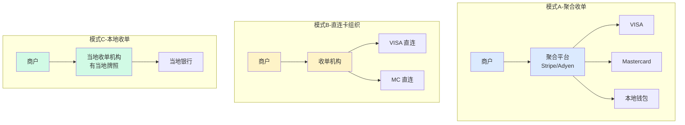
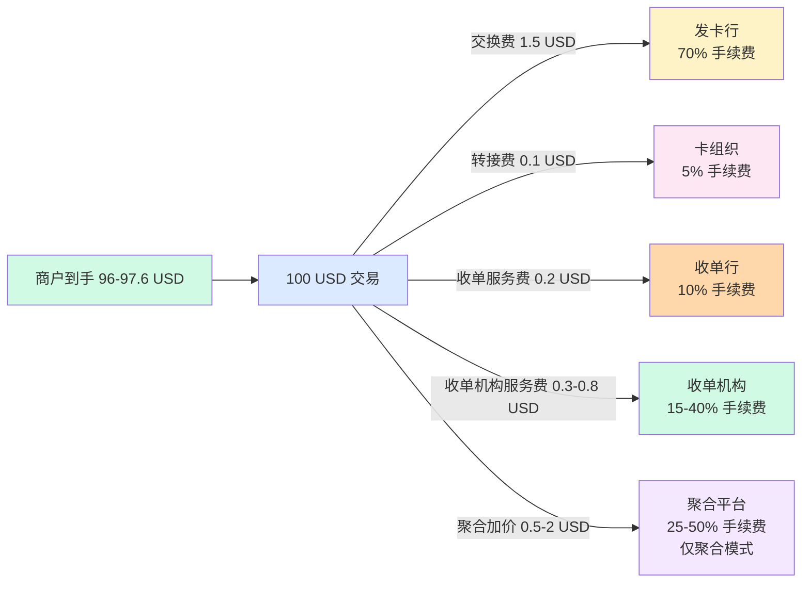

# 业务模式与费率分润(深度)

> **系列第 3 篇 · 深度**
> 上一篇 [2_外卡支付链路与13时点-深度](./2_外卡支付链路与13时点-深度.md) 讲了 4 阶段 + 13 时点 + 5 分钟定位 SOP。本篇是**第二层 · 交易链路与时点的第二篇**——讲**业务模式**——**聚合 vs 直连 vs 本地 3 大模式 + 5 项费率拆解（交换费/转接费/收单服务费/收单机构服务费/聚合平台加价）+ 分账模型 + 业内默认**。

---

## 一句话定义

> **跨境支付的业务模式 =「聚合 vs 直连 vs 本地」3 大模式 +「5 项费率拆解」+「分账模型」**。聚合费率 3%-5%（最贵但接入快），直连费率 ~2%（最便宜但接入慢），本地费率 1%-2%（最便宜但需牌照）。**业内默认：** 头部公司必须**「3 模式组合（聚合+直连+本地）+ 5 项费率拆解 + 分账模型 + 议价权分级」**——**单一模式 = 议价权低**。

---

## 业务背景与价值

### 为什么「业务模式」是核心难题？

入门读者以为「跨境支付 = 接入一家支付通道」。但跨境支付的真实业务模式是「**3 大模式 + 5 项费率 + 分账模型**」：

**3 大模式：**
- **聚合**（Stripe / Adyen）：简单 + 成本高（3%-5%）
- **直连**（自建收单）：复杂 + 成本低（~2%）
- **本地**（在境外申请牌照）：极复杂 + 成本最低（1%-2%）

**5 项费率拆解：**
- **交换费** ~1.5%（发卡行）
- **转接费** ~0.05%（卡组织）
- **收单服务费** ~0.2%（收单行）
- **收单机构服务费** ~0.3%-0.8%（收单机构）
- **聚合平台加价** ~0.5%-2%（聚合模式专属）

**业内默认：** 跨境支付的真实业务模式是「**3 模式 + 5 费率 + 分账模型**」——**不是简单的「接入一家通道」**

### 业务模式的 3 维度框架

**维度 1：费率（成本）**
- 聚合：3%-5%（最贵）
- 直连：~2%（中等）
- 本地：1%-2%（最便宜）

**维度 2：接入难度（时间）**
- 聚合：几周（最快）
- 直连：3-6 月（中等）
- 本地：1-2 年（最慢）

**维度 3：技术门槛（能力）**
- 聚合：低（API 对接）
- 直连：高（ISO 8583 + 卡组织 API + 3DS 协议）
- 本地：极高（本地银行 + 当地监管合规）

**业内默认：** 3 模式是「**费率 / 时间 / 能力**」的 3 维度取舍

### 监管意图：为什么「业务模式」必须合规？

监管对业务模式有「**支付牌照 + 跨境试点 + 外汇登记**」3 重要求：
1. **支付牌照**——必须有央行发的非银行支付业务许可证
2. **跨境试点**——直连和本地需要跨境支付试点资格
3. **外汇登记**——跨境支付必须在外管局登记

**专家视角：** 3 条要求**决定了 3 大模式必须有「**支付牌照 + 跨境试点 + 外汇登记**」三重要求**——不是简单的「选择模式」

---

## 业务术语表

| 中文 | 英文 | 一句话解释 |
|---|---|---|
| 聚合收单 | Aggregator Acquirer | 第三方平台代为对接卡组织（如 Stripe）|
| 直连卡组织 | Direct Card Network | 收单机构直接和卡组织签约 |
| 本地收单 | Local Acquirer | 在目标市场有当地牌照的收单机构 |
| 交换费 | Interchange Fee | 发卡行收取的手续费（~1.5%）|
| 转接费 | Assessment Fee | 卡组织收取的转接费（~0.05%）|
| 收单服务费 | Acquiring Markup | 收单行/收单机构收取的服务费（~0.2%-0.8%）|
| 聚合平台加价 | Aggregator Markup | 聚合平台收取的加价（~0.5%-2%）|
| 分账 | Split Payment | 一笔支付分给多方（平台/子商户/物流/代理）|
| 跨境支付试点 | Cross-Border Payment Pilot | 央行的跨境支付试点资格 |
| 外汇登记 | FX Registration | 跨境支付必须在外管局登记 |
| Merchant ID | MID | 商户号 |
| 保证金 | Reserve | 接入直连需要的保证金（$50K-$500K）|
| ISO 8583 | ISO 8583 | 卡支付的国际标准协议 |
| 3DS 协议 | 3D Secure Protocol | 卡支付强认证协议 |
| PCI DSS | PCI DSS | 卡数据存储/传输加密标准 |
| 议价权 | Bargaining Power | 在利益分配中的话语权 |
| 跨境电商 | Cross-Border E-commerce | 跨境电商业务 |
| 跨境服务 | Cross-Border Service | 跨境服务贸易 |
| 收单牌照 | Acquiring License | 央行发的非银行支付业务许可证 |
| 大行 | Major Bank | 工建中农交等大型银行 |

---

## 业务形态与模式：3 大模式详解

### 模式 1：聚合收单（Aggregator）

**业务形态：**
- 商户对接一个聚合平台（Stripe / Adyen / Checkout.com / Payoneer）
- 聚合平台帮你接好所有卡组织和本地钱包
- 商户只对接聚合平台

**盈利模式：**
- 聚合平台收取**服务费 + 通道费 + 加价**
- 综合费率：**3%-5%**（最高）

**接入流程：**
- 签约 → 几周 → 测试 → 上线
- 接入时间：**几周**（最快）

**技术门槛：**
- 低（API 对接）
- 不需要理解卡组织协议

**适合：**
- 中小商户
- 快速上线
- 不想养支付团队

**代表：** Stripe / Adyen / Checkout.com / Payoneer / 2C2P

**业内默认：** 聚合模式**接入快但费率最高**——**用钱买时间**

### 模式 2：直连卡组织（Direct Card Network）

**业务形态：**
- 收单机构直接和 VISA / Mastercard 签约
- 拿 MIDs（Merchant ID）
- 自己处理授权和清算

**盈利模式：**
- 收单机构收取**服务费 + SaaS 费**
- 综合费率：**~2%**（最低，少了一层聚合分成）

**接入流程：**
- 合规审查 3-6 个月
- 保证金 $50K-$500K
- 接入时间：**3-6 月**（中等）

**技术门槛：**
- 高（理解 ISO 8583 + 卡组织 API + 3DS 协议）
- 需要技术团队

**适合：**
- 年交易额 > 10 亿 RMB 的大型商户或支付机构

**代表：** 支付宝国际 / 微信跨境支付 / 连连支付 / 头部独立 PSP

**业内默认：** 直连模式**费率最低但接入慢**——**用时间省钱**

### 模式 3：本地收单（Local Acquirer）

**业务形态：**
- 在目标市场（如新加坡）申请当地支付牌照
- 成为当地收单机构
- 直接对接当地银行

**盈利模式：**
- 本地收单机构收取**服务费 + 通道费**
- 综合费率：**1%-2%**（最低，本地费率）

**接入流程：**
- 牌照申请 1-2 年
- 资本金要求
- 合规团队建设
- 接入时间：**1-2 年**（最慢）

**技术门槛：**
- 极高（需要本地银行合作 + 当地监管合规）
- 需要本地技术团队

**适合：**
- 在目标市场有实体
- 有牌照资源的跨国企业

**代表：** 支付宝（东南亚本地钱包）/ 微信（香港钱包）/ 头部跨国支付公司

**业内默认：** 本地模式**费率最低但接入最难**——**花大钱挣大钱**

### 3 大模式决策矩阵

| 模式 | 费率 | 接入时间 | 技术门槛 | 适合 | 代表 |
|---|---|---|---|---|---|
| **聚合** | 3%-5% | 几周 | 低 | 中小商户 | Stripe |
| **直连** | ~2% | 3-6 月 | 高 | 大商户 | 支付宝国际 |
| **本地** | 1%-2% | 1-2 年 | 极高 | 跨国企业 | 支付宝东南亚 |

**业内默认：** **3 大模式是「费率 / 时间 / 能力」3 维度的取舍**——**单一模式不够，必须组合**

---

## 业务流程图：3 大模式对比



**关键设计：**
- 模式 A 简单但贵（适合中小）
- 模式 B 复杂但便宜（适合大）
- 模式 C 极复杂但最便宜（适合跨国）
- **3 模式组合是头部公司的核心策略**

---

## 系统架构：5 项费率拆解

### 5 项费率流向图



**关键观察：**
- 5 项费率加起来 = ~2.4%-3.5%
- 商户到手 = 100 USD - 各项费率 = ~96-97.6 USD
- 不可谈：交换费 + 转接费（~1.5%）
- 可谈：收单服务费 + 收单机构服务费 + 聚合加价（~1%-2%）

### 费率项 1：交换费（Interchange Fee）

**谁收：** 发卡行
**费率：** 1%-2%（卡组织定的，没得谈）
**业内默认：** 交换费是**手续费的最大头**（~70%），发卡行承担盗刷风险所以收得最多

### 费率项 2：转接费（Assessment Fee）

**谁收：** 卡组织（VISA / Mastercard）
**费率：** 0.05%-0.15%（卡组织定的，没得谈）
**业内默认：** 转接费是**卡组织的核心收入**，但费率低，**靠规模赚钱**

### 费率项 3：收单服务费（Acquiring Markup）

**谁收：** 收单行
**费率：** 0.1%-0.3%（可谈）
**业内默认：** 收单服务费是**收单行的核心收入**，议价空间有限

### 费率项 4：收单机构服务费（PSP Markup）

**谁收：** 收单机构
**费率：** 0.3%-0.8%（可谈）
**业内默认：** 收单机构服务费是**议价空间最大**的部分，**交易量越大，议价权越大**

### 费率项 5：聚合平台加价（Aggregator Markup）

**谁收：** 聚合平台（仅聚合模式）
**费率：** 0.5%-2%（可谈）
**业内默认：** 聚合平台加价是**聚合模式的核心收入**，**是直连和聚合费率差异的主要来源**

### 5 项费率决策矩阵

| 费率项 | 谁收 | 费率 | 议价空间 |
|---|---|---|---|
| **交换费** | 发卡行 | 1%-2% | ❌ 没得谈 |
| **转接费** | 卡组织 | 0.05%-0.15% | ❌ 没得谈 |
| **收单服务费** | 收单行 | 0.1%-0.3% | ⚠️ 可谈 |
| **收单机构服务费** | 收单机构 | 0.3%-0.8% | ✅ 可谈 |
| **聚合平台加价** | 聚合平台 | 0.5%-2% | ⚠️ 量大可谈 |

**业内默认：** 5 项费率中，**交换费 + 转接费 = 没得谈**（~1.5%），**其他 3 项 = 可谈**（~1%-3%）。**议价权集中在后 3 项**

---

## 服务模型：分账模型

### 标准分润（按比例）

```
100 USD 交易
├─ 发卡行： 1.5 USD (70% 的手续费)
├─ 卡组织： 0.1 USD (5%)
├─ 收单行： 0.2 USD (10%)
└─ 收单机构：0.3 USD (15%)
```

### 分账（一笔钱分给多方）

**场景：** 平台型商户（如电商平台）需要把一笔支付分给多个子商户

```
用户付 100 USD 给平台
├─ 平台抽成：  10 USD (佣金)
├─ 子商户A：   50 USD (卖家)
├─ 物流商：    30 USD (运费)
└─ 代理商：    10 USD (推广佣金)
```

**分账的技术挑战：**
- 跨境分账涉及多币种——原币种分还是换汇后分？
- 分账的合规——每笔分账都是一次资金转移，需要外管申报
- 分账的时效——实时分 vs 批处理分

### 分账决策矩阵

| 决策 | 选项 A | 选项 B | 怎么选 |
|---|---|---|---|
| **分账币种** | 原币种分 | 换汇后分 | 跨境原币分，本地换汇后分 |
| **分账时效** | 实时分 | 批处理分 | 大额实时，小额批量 |
| **分账合规** | 每笔申报 | 批量申报 | 高频批量，低频每笔 |

**业内默认：** **分账不是简单分钱**——是**多币种 + 多方 + 合规 + 时效**的复杂工程

---

## 核心功能用例

### 用例 1：深圳 SaaS 公司选聚合模式

**场景：** 深圳 SaaS 公司，年交易额 5000 万 RMB

**选择：** 聚合模式（Stripe）
**理由：** 年交易额小 + 接入快 + 不想养支付团队

**费率：** 3.5%
**总成本：** 5000 万 × 3.5% = 175 万 RMB
**优势：** 几周上线 + 不需要支付团队
**劣势：** 费率最高

### 用例 2：深圳 SaaS 公司选直连模式

**场景：** 深圳 SaaS 公司，年交易额 5 亿 RMB

**选择：** 直连模式（自建收单 + 找收单行）
**理由：** 年交易额大 + 费率降低 + 议价权

**费率：** ~2%
**总成本：** 5 亿 × 2% = 1000 万 RMB
**接入：** 3-6 月 + 保证金 50 万美元
**优势：** 费率最低
**劣势：** 接入慢 + 需要支付团队

### 用例 3：跨国企业选本地模式

**场景：** 跨国电商，在新加坡有实体

**选择：** 本地模式（申请新加坡 PSA 牌照）
**理由：** 在目标市场有实体 + 想拿本地费率

**费率：** 1.5%
**接入：** 1-2 年
**优势：** 费率最低 + 本地品牌
**劣势：** 接入最难 + 需要本地团队

### 用例 4：平台型商户分账

**场景：** 跨境电商平台，需要把一笔支付分给多个子商户

**流程：**
- 用户付 100 USD
- 平台抽成 10 USD
- 子商户 A 收 50 USD
- 物流商收 30 USD
- 代理商收 10 USD

**挑战：**
- 跨境分账涉及换汇
- 每笔分账都是资金转移
- 需要外管申报

**业内默认：** **平台型商户分账**需要**专门的分账系统 + 合规审查 + 多币种支持**

---

## 业务打法与策略：不同公司的模式选择

### 头部公司（年 GMV > 100 亿美元）

**典型做法：**
- **3 模式组合**（聚合 + 直连 + 本地）
- **5 项费率拆解**（与卡组织 / 收单行 / 收单机构议价）
- **分账模型**（专门的分账系统）
- **议价权高**（年交易额大）

**业内认知：** 头部公司是「**3 模式组合 + 5 费率拆解 + 分账模型 + 议价权高**」的完整体系

### 中型公司（年 GMV 1-100 亿美元）

**典型做法：**
- **2 模式**（聚合 + 直连）
- **基本费率拆解**
- **基本分账**
- **议价权中等**

**业内认知：** 中型公司是「**够用但不极致**」的体系

### 小公司 / 新进入者（年 GMV < 1 亿美元）

**典型做法：**
- **1 模式**（仅聚合）
- **不拆解费率**
- **不分账**
- **议价权低**

**业内认知：** 小公司是「**MVP 起步**」的体系

---

## Trade-off 分析

### 决策 1：模式选择

| 选项 | 优势 | 代价 | 适合谁 |
|---|---|---|---|
| **聚合** | 简单 + 接入快 | 费率 3%-5% + 依赖聚合方 | 中小商户 |
| **直连** | 费率 ~2% + 自主可控 | 接入 3-6 月 + 保证金 $50K-$500K | 中型 / 头部公司 |
| **本地** | 费率 1%-2% + 当地市占率高 | 牌照申请 1-2 年 | 跨国企业 |

**专家视角：** **模式选择是规模驱动**——业内默认是「**年交易额 < 1 亿选聚合 / 1-10 亿选混合 / > 10 亿选直连**」

### 决策 2：分账策略

| 选项 | 优势 | 代价 | 适合谁 |
|---|---|---|---|
| **不分账** | 简单 | 平台型商户无法做 | 单一商户 |
| **实时分账** | 用户体验好 | 技术复杂 + 合规风险 | 高频小额 |
| **批处理分账** | 简单 + 合规 | 时效差 | 低频大额 |

**专家视角：** **分账策略不是越实时越好**——是「**业务规模 + 合规要求 + 技术能力**」的取舍

### 决策 3：议价权策略

| 选项 | 优势 | 代价 | 适合谁 |
|---|---|---|---|
| **被动**（接受卡组织 / 收单行定价）| 简单 | 成本高 | 小公司 |
| **主动**（通过交易量议价）| 成本降低 | 需要规模 | 中型公司 |
| **战略**（长期合作 + 议价）| 议价权高 | 需要长期投入 | 头部公司 |

**专家视角：** **议价权策略不是越大越好**——是「**业务规模 + 议价能力 + 长期投入**」的取舍。**业内默认：** 头部公司必须「**战略议价 + 长期合作**」

---

## 行业洞察 / 业内认知

### 不成文标准：业务模式的真实复杂度

公开规则：业务模式 = 选择聚合还是直连。

**业内实际复杂度（业内默认）：**

| 维度 | 真实复杂度 | 业内默认 |
|---|---|---|
| 业务模式 | **3 大模式** | 聚合 vs 直连 vs 本地 |
| 费率拆解 | **5 项** | 交换费 + 转接费 + 收单服务费 + 收单机构服务费 + 聚合加价 |
| 分账模型 | **3 维度** | 多币种 + 多方 + 合规 + 时效 |
| 议价权 | **3 策略** | 被动 + 主动 + 战略 |
| 接入时间 | **3 段** | 几周 / 3-6 月 / 1-2 年 |
| 牌照要求 | **3 类** | 支付牌照 + 跨境试点 + 外汇登记 |
| 议价空间 | **2 类** | 不可谈（交换费+转接费）/ 可谈（其他 3 项）|
| 头部公司 | **3 模式组合** | 聚合+直连+本地 |
| 中型公司 | **2 模式** | 聚合+直连 |
| 小公司 | **1 模式** | 仅聚合 |
| 业内默认 | **业务驱动** | 交易规模决定模式选择 |

**专家视角：** 业务模式的真实复杂度是「**3 模式 + 5 费率 + 分账 + 议价权**」。**业内默认：** 头部公司必须有「**3 模式组合 + 5 费率拆解 + 分账模型 + 议价权战略**」完整体系

### 真实事故：业务模式选择错误引发重大损失

公开报道：2022 年某中型跨境支付公司因**业务模式选择错误**：
- 年交易额 5 亿（应该选直连）
- 选了聚合模式（费率 3.5%）
- 多付手续费 5 亿 × (3.5% - 2%) = 750 万
- 接入慢 3 个月
- 客户流失 20%

**累计损失：**
- 多付手续费：750 万
- 客户流失损失：2000 万
- 业务亏损：2750 万
- 后续：被头部公司收购

**业内流传的处理方式：** 头部公司后来强制业务模式选择必须经过：
- 3 模式组合（聚合+直连+本地）
- 5 费率拆解（与卡组织/收单行/收单机构议价）
- 分账模型（专门的分账系统）
- 议价权战略（长期合作 + 议价）
- 牌照齐全（支付牌照 + 跨境试点 + 外汇登记）
- 业务规模驱动（年交易额决定模式选择）

**教训：** 业务模式选择错误的「真实成本」不是多付手续费，是「**客户流失 + 业务亏损 + 公司被收购**」。**业内默认：** 头部公司业务模式必须有「**3 模式组合 + 5 费率拆解 + 分账模型 + 议价权战略**」完整体系

### 从业者挑战：业务模式的 5 个核心难题

跨境支付公司常见的内部挑战：业务模式的 5 个核心难题。

**1. 模式选择难**

业务模式选择难。**业内默认：** 必须有「**业务规模 + 议价能力 + 长期投入**」

**2. 费率拆解难**

费率拆解难。**业内默认：** 必须有「**5 项费率拆解 + 议价策略**」

**3. 分账复杂**

分账工程复杂。**业内默认：** 必须有「**专门的分账系统 + 合规审查 + 多币种支持**」

**4. 议价权提升难**

议价权提升需要规模和时间。**业内默认：** 必须有「**业务规模 + 长期合作 + 战略议价**」

**5. 牌照申请难**

牌照申请需要时间和资本。**业内默认：** 必须有「**支付牌照 + 跨境试点 + 外汇登记**」

**专家视角：** 5 个核心难题的真实门槛不是技术实现，是「**业务规模 + 议价能力 + 长期投入 + 牌照齐全**」。**业内默认：** 业务模式必须有「**3 模式组合 + 5 费率拆解 + 分账模型 + 议价权战略 + 牌照齐全**」完整体系

---

## 业务前景与趋势

### 未来 3-5 年的 4 个结构性变化

**1. 模式组合化**

传统单模式 → **3 模式组合**。**对参与方格局的启示：** 3 模式组合能力成为头部支付公司的核心资产

**2. 费率透明化**

传统费率不透明 → **5 项费率完全透明**。**对参与方格局的启示：** 费率透明化能力成为头部支付公司的差异化优势

**3. 分账智能化**

传统人工分账 → **AI 智能分账**。**对参与方格局的启示：** 智能分账能力成为头部支付公司的护城河

**4. 议价权战略化**

传统被动议价 → **战略议价 + 长期合作**。**对参与方格局的启示：** 战略议价能力成为头部支付公司的护城河

---

## 一句话总结

> **跨境支付的业务模式 =「聚合 vs 直连 vs 本地」3 大模式 +「5 项费率拆解」+「分账模型」**。聚合费率 3%-5%（最贵但接入快），直连费率 ~2%（最便宜但接入慢），本地费率 1%-2%（最便宜但需牌照）。**业内默认：** 头部公司必须**「3 模式组合（聚合+直连+本地）+ 5 项费率拆解 + 分账模型 + 议价权分级」**——**单一模式 = 议价权低**。

---

## 📌 数据与事实声明

本文涉及的跨境支付业务模式、5 项费率拆解、分账模型等内容是跨境支付业务的通用认知，但具体到：

- 各家支付公司的业务模式和费率以各公司实际为准
- 交换费 1%-2%、转接费 0.05%-0.15% 等具体数字以各卡组织最新规则为准
- 收单服务费、收单机构服务费、聚合平台加价等以各公司议价为准
- 议价权（被动/主动/战略）以各公司实际为准
- 真实事故的具体描述基于业内公开信息的整理，**不是任何具体公司的真实情况**
- 头部/中型/小公司的区分基于 GMV 范围，**不是严格定义**

不要直接引用本文作为业务模式设计依据或选型依据。

---

## 下一篇预告

下一篇 [4_收单系统架构全景-全景](./4_收单系统架构全景-全景.md) 将进入**第三层 · 架构与系统**——讲**收单系统架构**——6 层功能架构（接入层/交易层/通道层/风控层/结算层/商户层）+ 部署拓扑（公网/DMZ/服务层/数据层）+ 16 项技术栈全景 + 业内默认。
