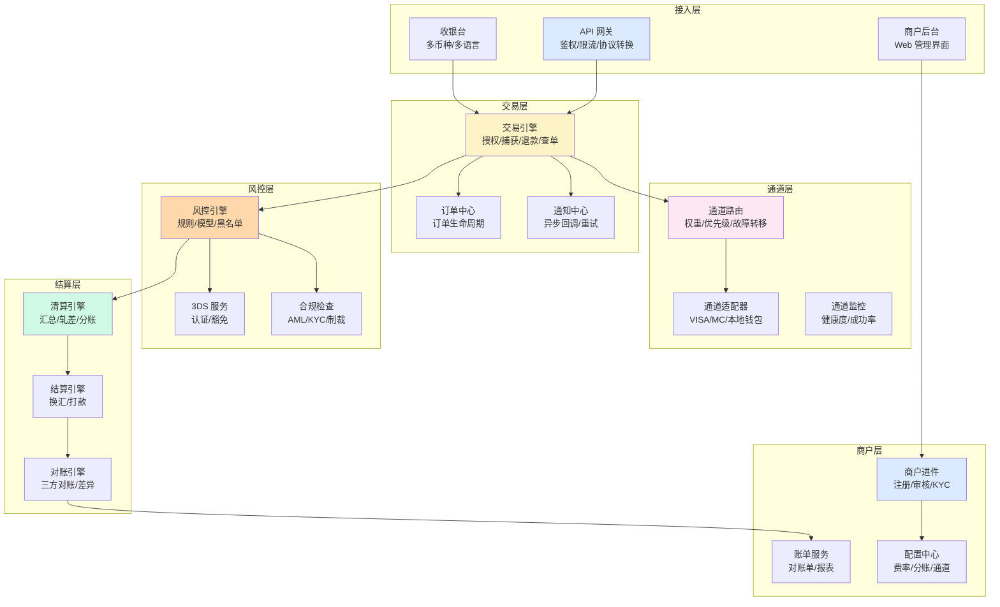
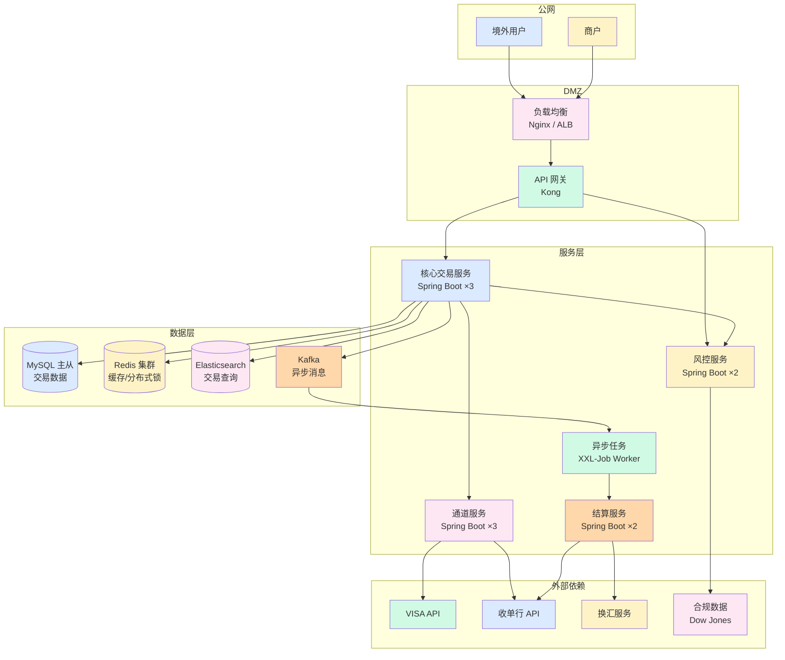

# 收单系统架构全景(全景)

> **系列第 4 篇 · 全景**
> 上一篇 [3_业务模式与费率分润-深度](./3_业务模式与费率分润-深度.md) 讲了 3 大模式 + 5 项费率 + 分账模型。本篇是**第三层 · 架构与系统的第一篇**——讲**收单系统架构全景**——**6 层功能架构（接入层/交易层/通道层/风控层/结算层/商户层）+ 部署拓扑（公网/DMZ/服务层/数据层）+ 16 项技术栈全景 + 业内默认**。

---

## 一句话定义

> **收单系统架构 =「6 层功能架构 + 4 层部署拓扑 + 16 项技术栈」**。6 层功能架构 = 接入层 + 交易层 + 通道层 + 风控层 + 结算层 + 商户层。4 层部署拓扑 = 公网 + DMZ + 服务层 + 数据层。**业内默认：** 头部公司必须有「**6 层功能架构 + 4 层部署拓扑 + 16 项技术栈 + 微服务 + 容器化 + 监控**」完整体系——**单一架构不够，必须分层**。

---

## 业务背景与价值

### 为什么「收单系统架构」是核心难题？

入门读者以为「收单系统 = 一个网站 + 一个数据库」。但收单系统的真实架构是「**6 层功能 + 4 层部署 + 16 项技术栈**」：

**6 层功能架构的真实复杂度：**
- **接入层**：API 网关 + 收银台 + 商户后台
- **交易层**：交易引擎 + 订单中心 + 通知中心
- **通道层**：通道路由 + 通道适配器 + 通道监控
- **风控层**：风控引擎 + 3DS 服务 + 合规检查
- **结算层**：清算引擎 + 结算引擎 + 对账引擎
- **商户层**：商户进件 + 账单服务 + 配置中心

**业内默认：** 收单系统的真实复杂度是「**6 层功能 + 4 层部署 + 16 项技术栈**」——**不是简单的「一个网站」**

### 6 层架构的 3 维度框架

**维度 1：职责（功能）**
- 接入层：门面（API + UI）
- 交易层：核心（交易 + 订单）
- 通道层：适配（路由 + 监控）
- 风控层：保镖（风控 + 合规）
- 结算层：账房（清算 + 结算）
- 商户层：服务（进件 + 账单）

**维度 2：独立性（故障隔离）**
- 每层独立演进（不影响其他层）
- 每层独立部署（单独扩容）
- 每层独立故障（不级联）

**维度 3：扩展性（性能）**
- 接入层：无状态（横向扩展）
- 交易层：有状态（按业务分库）
- 通道层：长连接（连接池）
- 风控层：CPU 密集（垂直扩展）
- 结算层：批处理（定时任务）
- 商户层：低频（少机器）

**业内默认：** 6 层架构的独立性 + 扩展性是「**系统稳定 + 性能可控**」的核心

### 监管意图：为什么「系统架构」必须合规？

监管对系统架构有「**数据本地化 + 数据保护 + 灾备**」3 重要求：
1. **数据本地化**——重要数据必须境内存储
2. **数据保护**——跨境数据传输必须合规（GDPR / PIPL）
3. **灾备**——必须有灾备方案（多机房 + 自动切换）

**专家视角：** 3 条要求**决定了 6 层架构必须有「**数据本地化 + 数据保护 + 灾备**」三重要求**

---

## 业务术语表

| 中文 | 英文 | 一句话解释 |
|---|---|---|
| 接入层 | Access Layer | API 网关 + 收银台 + 商户后台 |
| 交易层 | Transaction Layer | 交易引擎 + 订单中心 + 通知中心 |
| 通道层 | Channel Layer | 通道路由 + 通道适配器 + 通道监控 |
| 风控层 | Risk Layer | 风控引擎 + 3DS 服务 + 合规检查 |
| 结算层 | Settlement Layer | 清算引擎 + 结算引擎 + 对账引擎 |
| 商户层 | Merchant Layer | 商户进件 + 账单服务 + 配置中心 |
| API 网关 | API Gateway | 统一入口 + 鉴权 + 限流 + 协议转换 |
| 收银台 | Checkout | 多币种展示 + 卡号输入 + 3DS 跳转 |
| 交易引擎 | Transaction Engine | 授权/捕获/退款/查单的核心逻辑 |
| 订单中心 | Order Center | 订单全生命周期管理 |
| 通知中心 | Notification Center | 异步回调 + 失败重试 |
| 通道路由 | Channel Routing | 根据规则选最优通道 |
| 通道适配器 | Channel Adapter | 对接不同卡组织/钱包的协议差异 |
| 风控引擎 | Risk Engine | 实时决策（拒绝/通过/3DS）|
| 清算引擎 | Clearing Engine | 汇总交易 + 轧差计算 |
| 结算引擎 | Settlement Engine | 换汇 + 打款 |
| 对账引擎 | Reconciliation Engine | 三方对账 + 差异处理 |
| 商户进件 | Merchant Onboarding | 注册 + 资料审核 + KYC |
| 账单服务 | Billing Service | 对账单 + 报表 |
| 配置中心 | Config Center | 费率 + 分账 + 通道配置 |

---

## 业务形态与模式：6 层功能架构详解

### 第 1 层：接入层

**业务形态：**
- API 网关（统一入口）
- 收银台（多币种展示 + 卡号输入）
- 商户后台（Web 管理）

**核心组件：**

| 组件 | 职责 | 技术选型 |
|---|---|---|
| API 网关 | 统一入口 + 鉴权 + 限流 + 协议转换 | Kong / Nginx + Lua / Spring Cloud Gateway |
| 收银台 SDK | 多币种展示 + 卡号输入 + 3DS 跳转 | 自研 JS/iOS/Android / Stripe Elements |
| 商户后台 | 交易查询 + 对账 + 报表 | React/Vue + 后端 BFF |

**业内默认：** 接入层是「**门面**」——标准化（API）+ 国际化（多语言多币种）

### 第 2 层：交易层

**业务形态：**
- 交易引擎（授权/捕获/退款/查单）
- 订单中心（订单生命周期）
- 通知中心（异步回调）

**核心组件：**

| 组件 | 职责 | 关键设计 |
|---|---|---|
| 交易引擎 | 授权/捕获/退款/查单的核心逻辑 | 状态机驱动 + 幂等设计 |
| 订单中心 | 订单全生命周期管理 | 事件溯源（Event Sourcing）|
| 通知中心 | 异步回调商户 + 失败重试 | 指数退避 + 死信队列 |

**业内默认：** 交易层是「**核心**」——状态机 + 幂等 + 事件溯源是核心能力

### 第 3 层：通道层

**业务形态：**
- 通道路由（最优通道选择）
- 通道适配器（不同卡组织/钱包的协议差异）
- 通道监控（健康度）

**核心组件：**

| 组件 | 职责 | 关键设计 |
|---|---|---|
| 通道路由 | 根据规则选最优通道 | 权重/优先级/故障转移/成本优先 |
| 通道适配器 | 对接不同卡组织/钱包 | 适配器模式 + 一个通道一个 Adapter |
| 通道监控 | 实时监控通道健康度 | 成功率/耗时/错误码分布 |

**业内默认：** 通道层是「**适配**」——适配器模式 + 路由策略 + 健康度监控

### 第 4 层：风控层

**业务形态：**
- 风控引擎（实时决策）
- 3DS 服务（强认证）
- 合规检查（AML/KYC/制裁名单）

**核心组件：**

| 组件 | 职责 | 关键设计 |
|---|---|---|
| 风控引擎 | 实时决策：拒绝/通过/3DS | 规则引擎 + 机器学习模型 |
| 3DS 服务 | 跳转发卡行认证页面 | 3DS v1（弹窗）→ v2（无感）|
| 合规检查 | AML/KYC/制裁名单 | 对接 Dow Jones / WorldCheck |

**业内默认：** 风控层是「**保镖**」——3DS v2 + 风险分级 + 机器学习是核心能力

### 第 5 层：结算层

**业务形态：**
- 清算引擎（汇总 + 轧差）
- 结算引擎（换汇 + 打款）
- 对账引擎（三方对账）

**核心组件：**

| 组件 | 职责 | 关键设计 |
|---|---|---|
| 清算引擎 | 汇总交易 + 轧差计算 | 批量任务 + T+1 凌晨跑 |
| 结算引擎 | 换汇 + 打款指令生成 | 对接银行/换汇服务 |
| 对账引擎 | 三方对账（本方/卡组织/收单行）| 差异自动修复 + 人工工单 |

**业内默认：** 结算层是「**账房**」——批量处理 + 三方对账 + 5 分钟定位 SOP

### 第 6 层：商户层

**业务形态：**
- 商户进件（注册 + 审核 + KYC）
- 账单服务（对账单 + 报表）
- 配置中心（费率 + 分账 + 通道）

**核心组件：**

| 组件 | 职责 | 关键设计 |
|---|---|---|
| 商户进件 | 注册 + 资料审核 + KYC | 工作流引擎 |
| 账单服务 | 生成对账单 + 交易报表 | 定时生成 + 实时查询 |
| 配置中心 | 费率 + 分账规则 + 通道配置 | 实时生效 + 灰度发布 |

**业内默认：** 商户层是「**服务**」——工作流 + 实时查询 + 灰度发布

### 6 层功能架构决策矩阵

| 层级 | 职责 | 关键能力 | 业内默认 |
|---|---|---|---|
| **接入层** | 门面 | API 网关 + 收银台 | 标准化 + 国际化 |
| **交易层** | 核心 | 状态机 + 幂等 + 事件溯源 | 事务一致性 |
| **通道层** | 适配 | 适配器模式 + 路由策略 | 多通道 + 健康度 |
| **风控层** | 保镖 | 3DS v2 + 风险分级 + ML | 实时决策 |
| **结算层** | 账房 | 批量处理 + 三方对账 + SOP | 准确 + 稳定 |
| **商户层** | 服务 | 工作流 + 灰度发布 | 客户成功 |

**专家视角：** **6 层架构是「**功能 + 独立性 + 扩展性**」的 3 维度协同**——**单一架构不够，必须分层**

---

## 业务流程图：6 层架构

**关键设计：**
- 6 层架构**层次清晰**（每层独立故障隔离）
- **3-4 个核心调用链**（支付链 / 风控链 / 结算链 / 商户链）
- 6 层之间通过**事件 + 消息**解耦

---

## 系统架构：4 层部署拓扑

**关键设计：**
- 4 层部署**公网 → DMZ → 服务层 → 数据层**
- 服务层按业务分（核心 + 风控 + 通道 + 结算 + 异步）
- 数据层按业务分（MySQL + Redis + ES + Kafka）
- 外部依赖隔离（卡组织 + 银行 + 换汇 + 合规数据）

---

## 服务模型：16 项技术栈全景

### 接入层（4 项）

| 技术 | 选型 | 备选 |
|---|---|---|
| API 网关 | Kong | Nginx + Lua / Spring Cloud Gateway |
| 收银台 SDK | 自研 JS/iOS/Android | Stripe Elements |
| 服务框架 | Spring Boot 3 + gRPC | Go + Gin |
| 协议 | REST + gRPC | HTTP/2 + WebSocket |

### 交易层（3 项）

| 技术 | 选型 | 备选 |
|---|---|---|
| 数据库 | MySQL 8.0 主从 | TiDB / OceanBase |
| 缓存 | Redis Cluster | KeyDB / Codis |
| 消息 | Kafka | RocketMQ / Pulsar |

### 通道层（3 项）

| 技术 | 选型 | 备选 |
|---|---|---|
| 适配器 | 策略模式 + SPI | 责任链模式 |
| 路由 | 权重 + 优先级 + 故障转移 | 机器学习路由 |
| 监控 | Prometheus + Grafana | Datadog / CloudWatch |

### 风控层（3 项）

| 技术 | 选型 | 备选 |
|---|---|---|
| 规则引擎 | Drools / 自研 DSL | Flink CEP / Aviator |
| 机器学习 | TensorFlow / PyTorch | XGBoost / LightGBM |
| 3DS | Cardinal / Netcetera | 自研 3DS |

### 结算层（2 项）

| 技术 | 选型 | 备选 |
|---|---|---|
| 任务调度 | XXL-Job | Apache DolphinScheduler |
| 换汇 | Refinitiv API | 银行牌价 / Bloomberg |

### 运维层（3 项）

| 技术 | 选型 | 备选 |
|---|---|---|
| 容器化 | Docker + K8s + Helm | Docker Compose / OpenShift |
| CI/CD | GitHub Actions + ArgoCD | Jenkins / GitLab CI |
| 监控 | ELK + Loki | Splunk / Datadog |

### 16 项技术栈决策矩阵

| 类别 | 选型 | 备选 | 业内默认 |
|---|---|---|---|
| **接入** | Kong / Spring Cloud | Nginx | Kong 主流 |
| **交易** | MySQL + Redis + Kafka | TiDB / OceanBase | Java 系主流 |
| **通道** | 策略模式 + SPI | 责任链 | 适配器模式 |
| **风控** | Drools + TensorFlow | Flink + XGBoost | 规则+ML 组合 |
| **结算** | XXL-Job + Refinitiv | DolphinScheduler | XXL-Job 主流 |
| **运维** | K8s + ArgoCD | OpenShift | 云原生主流 |

**业内默认：** **16 项技术栈是头部公司的标配**——单一技术栈不够，必须组合

---

## 核心功能用例

### 用例 1：支付全链路

**支付链：**
- 接入层：API 网关接收支付请求
- 交易层：交易引擎处理授权
- 通道层：通道路由选 VISA
- 风控层：风控引擎检查 + 3DS
- 结算层：清算 + 结算

### 用例 2：风控拦截

**风控链：**
- 接入层：API 网关接收支付请求
- 交易层：交易引擎处理授权
- 通道层：通道路由选 VISA
- 风控层：风控引擎检查 → 高风险 → 拒绝
- 商户层：通知商户风控拒绝

### 用例 3：结算打款

**结算链：**
- 结算层：清算引擎汇总（T+1 凌晨）
- 结算层：对账引擎三方对账
- 结算层：结算引擎换汇
- 结算层：结算引擎打款
- 商户层：账单服务生成对账单

### 用例 4：商户进件

**商户链：**
- 商户层：商户进件注册
- 商户层：资料审核 + KYC
- 商户层：配置中心分配商户号
- 商户层：账单服务初始化

---

## 业务打法与策略：不同公司的架构选择

### 头部公司（年 GMV > 100 亿美元）

**典型做法：**
- **6 层功能架构完整**（接入/交易/通道/风控/结算/商户）
- **4 层部署拓扑**（公网/DMZ/服务层/数据层）
- **微服务化**（5-10 个核心服务）
- **容器化**（K8s + Helm + ArgoCD）
- **智能化**（AI 风控 + AI 监控）

**业内认知：** 头部公司是「**6 层 + 4 层 + 微服务 + 容器化 + 智能化**」的完整体系

### 中型公司（年 GMV 1-100 亿美元）

**典型做法：**
- **基本 6 层**（接入/交易/通道/风控/结算/商户）
- **基本 4 层**（公网/DMZ/服务层/数据层）
- **模块化单体**（不微服务化）
- **多服务器**（4-8 台）

**业内认知：** 中型公司是「**够用但不极致**」的体系

### 小公司 / 新进入者（年 GMV < 1 亿美元）

**典型做法：**
- **基础 3-4 层**（接入 + 交易 + 结算）
- **单服务器**（4 核 8G）
- **单体应用**

**业内认知：** 小公司是「**MVP 起步**」的体系

---

## Trade-off 分析

### 决策 1：架构粒度

| 选项 | 优势 | 代价 | 适合谁 |
|---|---|---|---|
| **单体应用** | 简单 + 成本低 | 扩展差 | 小公司 |
| **模块化单体** | 平衡 + 风险可控 | 演进慢 | 中型公司 |
| **微服务** | 灵活 + 独立演进 | 复杂度高 | 头部公司 |

**专家视角：** **架构粒度是规模驱动**——业内默认是「**小公司单体 / 中型模块化 / 头部微服务**」

### 决策 2：技术栈选择

| 选项 | 优势 | 代价 | 适合谁 |
|---|---|---|---|
| **传统栈**（Java + Spring + MySQL）| 稳定 + 人才多 | 智能化不足 | MVP / 成长阶段 |
| **云原生栈**（K8s + 微服务）| 灵活 + 扩展 | 复杂度高 | 成熟阶段 |
| **智能化栈**（AI + Service Mesh）| 智能化 + 自动化 | 成本高 | 规模化阶段 |

**专家视角：** **技术栈选择是业务驱动**——业内默认是「**业务需要才升级**」

### 决策 3：容灾方案

| 选项 | 优势 | 代价 | 适合谁 |
|---|---|---|---|
| **单机房** | 简单 + 成本低 | 单点故障 | 小公司 |
| **同城双活** | 平衡 + 风险可控 | 成本中等 | 中型公司 |
| **异地多活** | 风险最低 | 成本高 + 复杂度高 | 头部公司 |

**专家视角：** **容灾方案是业务驱动**——业内默认是「**业务规模 + 监管要求**」决定

---

## 行业洞察 / 业内认知

### 不成文标准：收单系统架构的真实复杂度

公开规则：收单系统 = 一个网站 + 一个数据库。

**业内实际复杂度（业内默认）：**

| 维度 | 真实复杂度 | 业内默认 |
|---|---|---|
| 功能架构 | **6 层** | 接入/交易/通道/风控/结算/商户 |
| 部署拓扑 | **4 层** | 公网/DMZ/服务层/数据层 |
| 技术栈 | **16 项** | 接入4 + 交易3 + 通道3 + 风控3 + 结算2 + 运维3 |
| 微服务 | **5-10 个** | 头部公司 |
| 服务器 | **50-100 台** | 头部公司 |
| 团队规模 | **50-100 人** | 头部公司 |
| 数据库 | **MySQL 主从** | MySQL + Redis + ES + Kafka |
| 监控 | **实时 + 告警** | Prometheus + Grafana + ELK |
| 部署 | **容器化** | K8s + Helm + ArgoCD |
| 灾备 | **多机房** | 头部公司 |
| 合规 | **数据本地化** | 境内存储 + 跨境合规 |
| 业内默认 | **6 层 + 4 层 + 16 技术栈** | 头部公司必备 |

**专家视角：** 收单系统架构的真实复杂度是「**6 层 + 4 层 + 16 技术栈**」。**业内默认：** 头部公司必须有「**6 层功能 + 4 层部署 + 16 技术栈 + 微服务 + 容器化 + 监控**」完整体系

### 真实事故：架构不完善引发重大损失

公开报道：2022 年某中型跨境支付公司因**架构不完善**：
- 单体应用（性能瓶颈）
- 单机房（无灾备）
- 手工监控（无告警）
- 手工运维（无自动化）

**累计损失：**
- 业务中断：3 次（每次 1-2 小时）
- 数据丢失：1 次（部分交易数据）
- 客户投诉：300+ 起
- 商户流失：20%
- 业务亏损：1500 万人民币
- 后续：被头部公司收购

**业内流传的处理方式：** 头部公司后来强制架构必须经过：
- 6 层功能架构（接入/交易/通道/风控/结算/商户）
- 4 层部署拓扑（公网/DMZ/服务层/数据层）
- 16 项技术栈（接入4 + 交易3 + 通道3 + 风控3 + 结算2 + 运维3）
- 微服务化（5-10 个核心服务）
- 容器化（K8s + Helm + ArgoCD）
- 监控告警（实时 + 告警 + 应急）
- 灾备方案（多机房 + 自动切换）

**教训：** 架构不完善的「真实成本」不是中断，是「**业务受限 + 团队动荡 + 公司被收购**」。**业内默认：** 头部公司架构必须有「**6 层 + 4 层 + 16 技术栈 + 微服务 + 容器化 + 监控 + 灾备**」完整体系

### 从业者挑战：收单系统架构的 5 个核心难题

跨境支付公司常见的内部挑战：系统架构的 5 个核心难题。

**1. 架构演进难**

架构演进风险高。**业内默认：** 必须有「**混合式演进 + 灰度发布 + 应急回滚**」

**2. 微服务治理难**

微服务治理复杂。**业内默认：** 必须有「**服务发现 + 配置中心 + 熔断 + 限流**」

**3. 数据一致性难**

分布式数据一致性。**业内默认：** 必须有「**分布式事务 + 最终一致性 + 幂等设计**」

**4. 监控告警难**

监控告警实施难。**业内默认：** 必须有「**实时监控 + 异常告警 + 自动应急**」

**5. 灾备切换难**

灾备切换复杂。**业内默认：** 必须有「**多机房 + 自动切换 + 季度演练**」

**专家视角：** 5 个核心难题的真实门槛不是技术实现，是「**业务理解 + 团队协作 + 长期运维 + 监管沟通**」。**业内默认：** 收单系统架构必须有「**6 层 + 4 层 + 16 技术栈 + 微服务 + 容器化 + 监控 + 灾备**」完整体系

---

## 业务前景与趋势

### 未来 3-5 年的 4 个结构性变化

**1. 云原生化**

传统部署 → **云原生 + K8s + Service Mesh**。**对参与方格局的启示：** 云原生能力成为头部支付公司的核心资产

**2. 智能化**

传统监控 → **AI 智能监控**。**对参与方格局的启示：** AI 智能化能力成为头部支付公司的护城河

**3. Serverless**

传统部署 → **Serverless + 函数计算**。**对参与方格局的启示：** Serverless 能力成为头部支付公司的差异化优势

**4. 边缘计算**

传统集中 → **边缘计算 + 全球化部署**。**对参与方格局的启示：** 边缘计算能力成为头部支付公司的护城河

---

## 一句话总结

> **收单系统架构 =「6 层功能架构 + 4 层部署拓扑 + 16 项技术栈」**。6 层功能架构 = 接入层 + 交易层 + 通道层 + 风控层 + 结算层 + 商户层。4 层部署拓扑 = 公网 + DMZ + 服务层 + 数据层。**业内默认：** 头部公司必须有「**6 层功能架构 + 4 层部署拓扑 + 16 项技术栈 + 微服务 + 容器化 + 监控**」完整体系——**单一架构不够，必须分层**。

---

## 📌 数据与事实声明

本文涉及的收单系统架构、6 层功能架构、16 项技术栈等内容是跨境支付业务系统架构的通用认知，但具体到：

- 各家支付公司的系统架构和技术选型以各公司实际为准
- 6 层功能架构（接入/交易/通道/风控/结算/商户）是业内常见划分，**不是强制标准**
- 4 层部署拓扑（公网/DMZ/服务层/数据层）是业内常见划分，**不是强制标准**
- 16 项技术栈选型以各公司实际为准
- 团队规模（5/20/100/200）、服务器数量（4-8/50-100/500+）以各公司实际为准
- 真实事故的具体描述基于业内公开信息的整理，**不是任何具体公司的真实情况**

不要直接引用本文作为系统架构设计依据或选型依据。

---

## 下一篇预告

下一篇 [5_通道管理与路由策略-深度](./5_通道管理与路由策略-深度.md) 将继续**第三层 · 架构与系统**——讲**通道管理**——4 类通道（卡组织/本地钱包/银行直连/聚合通道）+ 5 大属性（覆盖地区/支持币种/费率/结算/功能）+ 通道路由策略（币种匹配 + 健康度 + 成本优先）+ 通道生命周期（接入/测试/试运行/已上线/降级/下线）。
