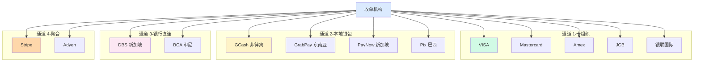
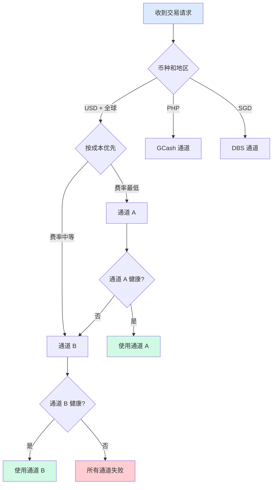

# 通道管理与路由策略(深度)

> **系列第 5 篇 · 深度**
> 上一篇 [4_收单系统架构全景-全景](./4_收单系统架构全景-全景.md) 讲了 6 层功能架构 + 4 层部署拓扑 + 16 项技术栈。本篇是**第三层 · 架构与系统的第二篇**——讲**通道管理**——**4 类通道（卡组织/本地钱包/银行直连/聚合通道）+ 5 大属性（覆盖地区/支持币种/费率/结算/功能）+ 6 阶段生命周期（接入/测试/试运行/已上线/降级/下线）+ 通道路由策略（币种匹配 + 健康度 + 成本优先 + 故障转移）+ 通道健康度监控**。

---

## 一句话定义

> **通道管理 =「4 类通道接入 + 5 大属性评估 + 6 阶段生命周期 + 路由策略 + 健康度监控」**。4 类通道 = 卡组织 + 本地钱包 + 银行直连 + 聚合通道。5 大属性 = 覆盖地区 + 支持币种 + 费率 + 结算 + 功能。6 阶段 = 接入 → 测试 → 试运行 → 已上线 → 降级 → 下线。**业内默认：** 头部公司必须有「**多通道并行（≥3 家）+ 路由策略（成本优先 + 健康度）+ 健康度监控（成功率 < 95% 自动降级）+ 故障转移（自动切备通道）**」完整体系——**单一通道 = 单点故障 = 业务中断**。

---

## 业务背景与价值

### 为什么「通道管理」是核心难题？

入门读者以为「通道 = 接入一家支付通道」。但通道管理的真实复杂度在**4 类通道 + 5 大属性 + 6 阶段生命周期 + 路由策略**：

**4 类通道的真实复杂度：**
- **卡组织通道**（VISA / MC / Amex / JCB / 银联国际）：全球覆盖 + 费率中等 + 结算 T+3
- **本地钱包**（GCash / GrabPay / PayPay / Pix）：区域覆盖 + 费率低 + 结算 T+1
- **银行直连**（DBS / BCA / 本地银行）：本地覆盖 + 费率低 + 结算 T+1
- **聚合通道**（Stripe / Adyen / Checkout）：全球覆盖 + 费率最高 + 结算 T+5~T+7

**业内默认：** 通道管理的真实复杂度是「**4 类 + 5 属性 + 6 阶段 + 路由**」——**不是简单的「接入一家」**

### 通道管理的 3 维度框架

**维度 1：成本（费率）**
- 卡组织：~2%（中等）
- 本地钱包：~1.5%（低）
- 银行直连：~1%-1.5%（低）
- 聚合通道：~3%-5%（最高）

**维度 2：覆盖（地区）**
- 卡组织：全球 200+ 国家
- 本地钱包：仅特定国家
- 银行直连：仅本地
- 聚合通道：全球 40+ 国家

**维度 3：稳定性（健康度）**
- 卡组织：高（99%+ 可用率）
- 本地钱包：中（依赖当地基础设施）
- 银行直连：中（依赖银行系统）
- 聚合通道：中（依赖聚合方）

**业内默认：** 3 维度是「**成本 + 覆盖 + 稳定性**」的取舍——**单一通道不够，必须组合**

### 监管意图：为什么「通道管理」必须合规？

监管对通道有「**牌照 + 反洗钱 + 数据保护**」3 重要求：
1. **牌照**——必须有支付牌照 + 跨境试点
2. **反洗钱**——通道必须支持 AML / KYC / 制裁名单筛查
3. **数据保护**——数据传输必须合规（GDPR / PIPL）

**专家视角：** 3 条要求**决定了通道必须有「**牌照 + 反洗钱 + 数据保护**」三重要求**

---

## 业务术语表

| 中文 | 英文 | 一句话解释 |
|---|---|---|
| 通道 | Channel | 收单系统对接的具体支付路径 |
| 卡组织通道 | Card Network Channel | 直连 VISA / MC / Amex / JCB / 银联国际 |
| 本地钱包 | Local Wallet | GCash / GrabPay / PayNow / Pix |
| 银行直连 | Direct Bank Connection | DBS / BCA / 本地银行直连 |
| 聚合通道 | Aggregator Channel | Stripe / Adyen / Checkout.com |
| 路由 | Routing | 根据规则选最优通道 |
| 适配器 | Adapter | 对接不同通道的协议差异 |
| 健康度 | Health | 通道的可用性 + 成功率 + 耗时 |
| 故障转移 | Failover | 主通道失败 → 自动切备通道 |
| 降级 | Degradation | 通道成功率 < 95% → 自动降级 |
| 灰度发布 | Gray Release | 新通道逐步放量 |
| 权重 | Weight | 多通道分流的权重 |
| 优先级 | Priority | 多通道选择的优先级 |
| 成本优先 | Cost-First | 路由策略选费率最低的通道 |
| 健康度优先 | Health-First | 路由策略选健康度最高的通道 |
| 接入 | Onboarding | 通道对接的过程 |
| 测试 | Testing | 沙箱测试 + 异常场景 |
| 试运行 | Pilot | 小流量灰度 |
| 已上线 | Live | 全量运行 |
| 备选通道 | Backup Channel | 主通道失败时切换的通道 |
| 通道能力矩阵 | Channel Capability Matrix | 各通道的 5 大属性对比 |

---

## 业务形态与模式：4 类通道详解

### 通道 1：卡组织通道（Card Network Channel）

**业务形态：**
- 直连 VISA / Mastercard / Amex / JCB / 银联国际
- 全球覆盖
- 标准化协议（ISO 8583 / REST）

**5 大属性：**

| 属性 | 说明 | 示例 |
|---|---|---|
| 覆盖地区 | 支持哪些国家/地区 | VISA 全球 200+ / MC 全球 210+ |
| 支持币种 | 可以收哪些币种 | 150+ 币种 |
| 费率 | 每笔交易收多少 | ~2% |
| 结算周期 | 几天到账 | T+3 |
| 支持功能 | 授权/捕获/退款/拒付/查单 | 全功能（10/10）|

**代表：** VISA / Mastercard / Amex / JCB / 银联国际

**业内默认：** 卡组织通道是「**全球覆盖 + 全功能**」的标配，**是头部公司的核心通道**

### 通道 2：本地钱包（Local Wallet）

**业务形态：**
- 区域覆盖（如 GCash 仅菲律宾）
- 费率低
- 结算快（T+1）

**5 大属性：**

| 属性 | 说明 | 示例 |
|---|---|---|
| 覆盖地区 | 区域覆盖 | GCash 仅菲律宾 / GrabPay 东南亚 8 国 |
| 支持币种 | 单一币种 | PHP / SGD / JPY / BRL |
| 费率 | 每笔交易收多少 | ~1.5% |
| 结算周期 | 几天到账 | T+1 |
| 支持功能 | 支付/退款/部分退款 | 5-6 种（不支持拒付）|

**代表：** GCash（菲律宾）/ GrabPay（东南亚）/ PayNow（新加坡）/ Pix（巴西）

**业内默认：** 本地钱包是「**区域覆盖 + 费率低**」的补充，**是头部公司区域扩张的关键**

### 通道 3：银行直连（Direct Bank Connection）

**业务形态：**
- 与本地银行直接对接
- 本地覆盖
- 费率低 + 结算快

**5 大属性：**

| 属性 | 说明 | 示例 |
|---|---|---|
| 覆盖地区 | 仅本地 | DBS（新加坡）/ BCA（印尼）|
| 支持币种 | 本地币种 | SGD / IDR |
| 费率 | 每笔交易收多少 | ~1%-1.5% |
| 结算周期 | 几天到账 | T+1 |
| 支持功能 | 支付/退款/查询 | 基础功能 |

**代表：** DBS / BCA / 本地银行

**业内默认：** 银行直连是「**本地覆盖 + 费率低**」的核心，**是头部公司本地化的关键**

### 通道 4：聚合通道（Aggregator Channel）

**业务形态：**
- 通过聚合平台（Stripe / Adyen）对接多家卡组织和本地钱包
- 全球覆盖
- 费率最高 + 接入最快

**5 大属性：**

| 属性 | 说明 | 示例 |
|---|---|---|
| 覆盖地区 | 全球 | Stripe 40+ / Adyen 全球 |
| 支持币种 | 100+ | 135+ |
| 费率 | 每笔交易收多少 | ~3%-5% |
| 结算周期 | 几天到账 | T+5~T+7 |
| 支持功能 | 全功能 | 全功能（10/10）|

**代表：** Stripe / Adyen / Checkout.com / Payoneer

**业内默认：** 聚合通道是「**接入快 + 成本高**」的入门，**是中小商户的起点**

### 4 类通道决策矩阵

| 通道类型 | 费率 | 覆盖 | 健康度 | 适合 | 业内默认 |
|---|---|---|---|---|---|
| **卡组织** | ~2% | 全球 200+ | 高 | 大商户 | 核心通道 |
| **本地钱包** | ~1.5% | 区域 | 中 | 区域扩张 | 补充通道 |
| **银行直连** | ~1%-1.5% | 本地 | 中 | 本地化 | 核心通道 |
| **聚合通道** | ~3%-5% | 全球 40+ | 中 | 中小商户 | 入门通道 |

**业内默认：** **4 类通道组合是头部公司的核心策略**——**单一通道 = 单点故障 = 业务中断**

---

## 业务流程图：4 类通道架构

**关键设计：**
- 4 类通道**多通道并行**（头部公司 ≥ 3 家）
- 收单机构是**核心枢纽**（连接所有通道）
- 不同通道**不同费率 + 覆盖 + 健康度**

---

## 系统架构：通道路由策略

**关键设计：**
- 路由策略**优先级**：币种匹配 → 健康度 → 成本优先 → 故障转移
- 健康度监控**实时**（成功率 < 95% 自动降级）
- 故障转移**自动**（主通道失败 → 切备通道）

---

## 服务模型：6 阶段生命周期

### 阶段 1：接入中

**做什么：**
- 商务签约
- 拿 API 密钥
- 对接文档
- 技术评估

**关键动作：** 签合同 → 拿密钥 → 评估文档

**业内默认：** 接入阶段是「**商务 + 技术**」双重评估，**不能仅看费率**

### 阶段 2：测试中

**做什么：**
- 沙箱测试
- 正常支付场景
- 异常场景（退款 / 拒付 / 失败）
- 性能压测

**关键动作：** 测试用例 → 沙箱 → 异常场景

**业内默认：** 测试阶段必须**全场景覆盖**（正常 + 异常 + 性能）

### 阶段 3：试运行

**做什么：**
- 小流量灰度（1% 流量）
- 监控成功率
- 监控耗时
- 监控错误码

**关键动作：** 灰度 → 监控 → 调优

**业内默认：** 试运行阶段必须有**灰度发布**（避免一次性全量上线）

### 阶段 4：已上线

**做什么：**
- 全量运行
- 实时监控
- 异常告警
- 定期评估

**关键动作：** 上线 → 监控 → 优化

**业内默认：** 上线阶段必须有**实时监控 + 异常告警**（避免问题累积）

### 阶段 5：降级

**做什么：**
- 通道成功率 < 95% 自动降级
- 通道降级后流量自动切到备选通道
- 监控告警触发人工介入
- 修复后恢复

**关键动作：** 降级 → 切流 → 修复 → 恢复

**业内默认：** 降级阶段必须有**自动降级 + 自动切流**（不能依赖人工）

### 阶段 6：下线

**做什么：**
- 合约到期 / 主动关闭
- 确认无在途交易
- 关闭通道
- 存档历史数据

**关键动作：** 确认 → 关闭 → 存档

**业内默认：** 下线阶段必须**确认无在途交易**（避免数据丢失）

### 6 阶段生命周期决策矩阵

| 阶段 | 关键动作 | 业内默认 | 关键指标 |
|---|---|---|---|
| **接入中** | 商务 + 技术评估 | 双重评估 | 文档完整度 |
| **测试中** | 沙箱 + 异常 + 性能 | 全场景覆盖 | 测试覆盖率 |
| **试运行** | 灰度 + 监控 + 调优 | 灰度发布 | 流量比例 |
| **已上线** | 全量 + 监控 + 告警 | 实时监控 | 成功率 / 耗时 |
| **降级** | 自动降级 + 切流 | 自动降级 | 降级阈值（95%）|
| **下线** | 确认 + 关闭 + 存档 | 确认无在途 | 在途交易数 |

**业内默认：** **6 阶段是通道完整生命周期**——**单一阶段不完善 = 通道管理失败**

---

## 核心功能用例

### 用例 1：新加坡 VISA 付 100 SGD

**通道选择：**
- 币种：SGD
- 地区：新加坡
- 通道：DBS（本地银行）+ VISA（卡组织）

**路由策略：**
- 优先级 1：DBS 本地银行（费率 1.5%）
- 优先级 2：VISA 卡组织（费率 2%）
- 优先级 3：Stripe 聚合（费率 3.5%）

**选择：** DBS 优先，DBS 失败 → VISA → Stripe

### 用例 2：菲律宾 GCash 付 5000 PHP

**通道选择：**
- 币种：PHP
- 地区：菲律宾
- 通道：GCash（本地钱包）

**路由策略：**
- 优先级 1：GCash（费率 1.5%）

**选择：** GCash（唯一通道）

### 用例 3：通道降级处理

**场景：** VISA 通道成功率 < 90%

**降级流程：**
- 监控告警（成功率 < 95%）
- 自动降级（VISA 流量切到 Mastercard）
- 人工介入（联系 VISA 排查问题）
- 修复后恢复

**时延：** 5 分钟告警 + 30 分钟降级 + 2-24 小时修复

### 用例 4：路由策略变更

**场景：** VISA 费率上升（2% → 2.5%）

**路由策略变更：**
- 优先级 1：DBS 本地银行（费率 1.5%）
- 优先级 2：Mastercard 卡组织（费率 2%）
- 优先级 3：VISA 卡组织（费率 2.5%）
- 优先级 4：Stripe 聚合（费率 3.5%）

**业内默认：** 路由策略必须**定期评估**（每季度）+ **自动调整**

---

## 业务打法与策略：不同公司的通道管理

### 头部公司（年 GMV > 100 亿美元）

**典型做法：**
- **多通道并行**（≥3 家卡组织 + ≥5 家本地钱包 + ≥1 家银行直连）
- **路由策略**（成本优先 + 健康度 + 故障转移）
- **健康度监控**（实时 + 告警 + 自动降级）
- **生命周期管理**（接入 → 测试 → 试运行 → 上线 → 降级 → 下线）

**业内认知：** 头部公司是「**多通道并行 + 路由策略 + 健康度监控 + 生命周期管理**」的完整体系

### 中型公司（年 GMV 1-100 亿美元）

**典型做法：**
- **基本多通道**（2-3 家卡组织 + 1-2 家本地钱包）
- **基础路由**（币种匹配 + 优先级）
- **基础监控**（日报）
- **基础生命周期**（接入 + 上线）

**业内认知：** 中型公司是「**够用但不极致**」的体系

### 小公司 / 新进入者（年 GMV < 1 亿美元）

**典型做法：**
- **1-2 家通道**（仅 1 家聚合平台）
- **无路由**（固定通道）
- **无监控**（出问题才知道）
- **无生命周期**（接入直接用）

**业内认知：** 小公司是「**MVP 起步**」的体系

---

## Trade-off 分析

### 决策 1：通道数量

| 选项 | 优势 | 代价 | 适合谁 |
|---|---|---|---|
| **单通道** | 简单 + 成本低 | 单点故障 | 小公司 |
| **多通道** | 容灾 + 议价 | 复杂度高 | 中型 / 头部公司 |
| **多通道 + 银行直连** | 极深覆盖 | 极复杂 | 头部公司 |

**专家视角：** **通道数量是规模驱动**——业内默认是「**小公司 1 家 / 中型 2-3 家 / 头部 ≥ 3 家**」

### 决策 2：路由策略

| 选项 | 优势 | 代价 | 适合谁 |
|---|---|---|---|
| **固定通道** | 简单 | 单点故障 | 小公司 |
| **币种匹配** | 基础路由 | 缺乏优化 | 中型公司 |
| **成本优先 + 健康度** | 智能路由 | 复杂度高 | 头部公司 |

**专家视角：** **路由策略不是越复杂越好**——是「**业务规模 + 风险偏好 + 团队能力**」的取舍

### 决策 3：健康度监控

| 选项 | 优势 | 代价 | 适合谁 |
|---|---|---|---|
| **无监控** | 简单 | 事故后才知道 | 小公司 |
| **日报** | 基本监控 | 实时性差 | 中型公司 |
| **实时 + 告警 + 自动降级** | 风险最低 | 成本高 | 头部公司 |

**专家视角：** **健康度监控不是越实时越好**——是「**业务规模 + 风险偏好 + 团队能力**」的取舍

---

## 行业洞察 / 业内认知

### 不成文标准：通道管理的真实复杂度

公开规则：通道 = 接入一家支付通道。

**业内实际复杂度（业内默认）：**

| 维度 | 真实复杂度 | 业内默认 |
|---|---|---|
| 通道类型 | **4 类** | 卡组织/本地钱包/银行直连/聚合 |
| 通道属性 | **5 大** | 覆盖/币种/费率/结算/功能 |
| 生命周期 | **6 阶段** | 接入/测试/试运行/上线/降级/下线 |
| 路由策略 | **3 类** | 币种匹配/成本优先/健康度 |
| 监控指标 | **4 类** | 成功率/耗时/错误码/告警阈值 |
| 头部公司 | **≥3 卡组织** | 多通道并行 |
| 中型公司 | **2-3 通道** | 基本多通道 |
| 小公司 | **1 通道** | 单通道 |
| 降级阈值 | **95%** | 业内默认 |
| 健康度监控 | **实时** | 头部公司必备 |
| 路由评估 | **季度** | 定期评估 |
| 业内默认 | **多通道 + 智能路由 + 健康度监控** | 头部公司标配 |

**专家视角：** 通道管理的真实复杂度是「**4 类 + 5 属性 + 6 阶段 + 3 路由 + 4 监控**」。**业内默认：** 头部公司必须有「**多通道并行 + 智能路由 + 健康度监控 + 生命周期管理**」完整体系

### 真实事故：通道管理失败引发重大损失

公开报道：2022 年某中型跨境支付公司因**通道管理失败**：
- 单通道（仅 Stripe）→ Stripe 故障 2 小时 → 业务中断
- 无降级机制 → 故障期间无法切流
- 无监控告警 → 2 小时后才人工发现
- 无生命周期管理 → 故障后无应急

**累计损失：**
- 业务中断：2 小时
- 客户投诉：200+ 起
- 商户流失：15%
- 业务亏损：800 万人民币
- 后续：增加 Adyen 备选通道

**业内流传的处理方式：** 头部公司后来强制通道管理必须经过：
- 多通道并行（≥3 家卡组织）
- 路由策略（成本优先 + 健康度 + 故障转移）
- 健康度监控（实时 + 告警 + 自动降级）
- 生命周期管理（接入 → 测试 → 试运行 → 上线 → 降级 → 下线）
- 降级阈值（成功率 < 95% 自动降级）
- 季度评估（定期评估通道 + 路由策略）

**教训：** 通道管理失败的「真实成本」不是中断，是「**客户投诉 + 商户流失 + 业务亏损**」。**业内默认：** 头部公司通道管理必须有「**多通道并行 + 智能路由 + 健康度监控 + 生命周期管理**」完整体系

### 从业者挑战：通道管理的 5 个核心难题

跨境支付公司常见的内部挑战：通道管理的 5 个核心难题。

**1. 通道接入慢**

通道接入周期长。**业内默认：** 必须有「**接入模板 + 测试用例 + 灰度发布**」

**2. 路由策略复杂**

路由策略设计复杂。**业内默认：** 必须有「**币种匹配 + 成本优先 + 健康度 + 故障转移**」

**3. 健康度监控难**

健康度监控实施难。**业内默认：** 必须有「**实时监控 + 异常告警 + 自动降级**」

**4. 故障转移慢**

故障转移速度慢。**业内默认：** 必须有「**自动切流 + 备选通道 + 应急 SOP**」

**5. 通道评估难**

通道评估缺乏数据。**业内默认：** 必须有「**实时数据 + 季度评估 + 定期优化**」

**专家视角：** 5 个核心难题的真实门槛不是技术实现，是「**通道管理 + 路由策略 + 健康度监控 + 故障转移 + 通道评估**」。**业内默认：** 通道管理必须有「**多通道并行 + 智能路由 + 健康度监控 + 生命周期管理**」完整体系

---

## 业务前景与趋势

### 未来 3-5 年的 4 个结构性变化

**1. 通道智能化**

传统路由 → **AI 智能路由**。**对参与方格局的启示：** AI 路由能力成为头部支付公司的核心资产

**2. 通道实时评估**

传统季度评估 → **实时评估**。**对参与方格局的启示：** 实时评估能力成为头部支付公司的差异化优势

**3. 通道自动化**

传统人工监控 → **自动化监控 + 降级**。**对参与方格局的启示：** 自动化能力成为头部支付公司的护城河

**4. 通道全球化**

传统区域通道 → **全球通道 + 本地化**。**对参与方格局的启示：** 全球化能力成为头部支付公司的护城河

---

## 一句话总结

> **通道管理 =「4 类通道接入 + 5 大属性评估 + 6 阶段生命周期 + 路由策略 + 健康度监控」**。4 类通道 = 卡组织 + 本地钱包 + 银行直连 + 聚合通道。5 大属性 = 覆盖地区 + 支持币种 + 费率 + 结算 + 功能。6 阶段 = 接入 → 测试 → 试运行 → 已上线 → 降级 → 下线。**业内默认：** 头部公司必须有「**多通道并行（≥3 家）+ 路由策略（成本优先 + 健康度）+ 健康度监控（成功率 < 95% 自动降级）+ 故障转移（自动切备通道）**」完整体系——**单一通道 = 单点故障 = 业务中断**。

---

## 📌 数据与事实声明

本文涉及的通道管理、4 类通道、6 阶段生命周期等内容是跨境支付通道管理的通用认知，但具体到：

- 各家支付公司的通道数量和路由策略以各公司实际为准
- 各卡组织（VISA / MC / Amex / JCB / 银联国际）的费率和覆盖以卡组织最新规则为准
- 本地钱包（GCash / GrabPay / PayNow / Pix）的费率和覆盖以各钱包最新规则为准
- 银行直连（DBS / BCA）的费率和覆盖以各银行最新规则为准
- 聚合通道（Stripe / Adyen / Checkout）的费率和覆盖以各平台最新规则为准
- 降级阈值（成功率 < 95%）是业内默认，**不是绝对标准**
- 真实事故的具体描述基于业内公开信息的整理，**不是任何具体公司的真实情况**

不要直接引用本文作为通道管理设计依据或选型依据。

---

## 下一篇预告

下一篇 [6_跨境对账与结算体系-深度](./6_跨境对账与结算体系-深度.md) 将继续**第三层 · 架构与系统**——讲**跨境对账与结算**——三方对账（本方/卡组织/收单行）+ 结算周期为什么 T+3（T+0/T+1/T+3 三段）+ 换汇 3 决策（实时/批量/原币）+ 差异处理（自动修复 + 人工工单）+ 5 类差异（漏单/重复/金额/状态/到账）。
