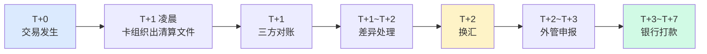

# 跨境对账与结算体系(深度)

> **系列第 6 篇 · 深度**
> 上一篇 [5_通道管理与路由策略-深度](./5_通道管理与路由策略-深度.md) 讲了 4 类通道 + 5 大属性 + 6 阶段生命周期。本篇是**第三层 · 架构与系统的第三篇**——讲**跨境对账与结算**——**三方对账（本方/卡组织/收单行）+ 结算周期为什么 T+3（T+0/T+1/T+3 三段）+ 换汇 3 决策（实时/批量/原币）+ 差异处理（自动修复 + 人工工单）+ 5 类差异（漏单/重复/金额/状态/到账）+ 业内默认**。

---

## 一句话定义

> **跨境对账 =「收单机构 vs 卡组织 vs 收单行」三方逐笔核对**——任何一方对不平都不能结算。**跨境结算比国内多两件事：换汇 + 外管申报**。一笔 100 SGD 交易，T+0 授权 → T+1 凌晨清算 → T+1~T+2 换汇 → T+3 结算。**业内默认：** 头部公司必须有「**三方对账 + 5 类差异自动修复 + 换汇 3 决策 + 外管申报自动化 + 5 分钟定位 SOP**」完整体系——**单一环节不平 = 业务亏损**。

---

## 业务背景与价值

### 为什么「跨境对账与结算」是核心难题？

入门读者以为「对账 = 系统自动核对」。但跨境对账的真实复杂度在**三方对账 + 5 类差异 + 换汇 3 决策 + 外管申报**：

**跨境 vs 国内对账的真实复杂度：**
- 国内对账：1 个对手方（网联/银联）+ 单一币种 + T+1
- 跨境对账：**2 个对手方（卡组织 + 收单行）**+ **多币种** + **T+3~T+7**

**业内默认：** 跨境对账的真实复杂度是「**国内对账的复杂度 × 3（多对手方 + 多币种 + 多环节）**」——**不是简单的「自动核对」**

### 对账的 3 维度框架

**维度 1：对手方（多个）**
- 本方流水
- 卡组织清算文件
- 收单行对账单

**维度 2：币种（多币种）**
- 交易币种（SGD / USD / EUR）
- 清算币种（USD）
- 结算币种（CNY）

**维度 3：差异（5 类）**
- 漏单（本方有 + 卡组织无）
- 重复（本方 + 卡组织都有 + 本方 2 次）
- 金额（金额不一致）
- 状态（状态不一致）
- 到账（到账金额不对）

**业内默认：** 3 维度是「**对手方 + 币种 + 差异**」的 3 维度协同

### 监管意图：为什么「对账与结算」必须合规？

监管对对账与结算有「**资金流可追溯 + 跨境收支申报**」2 重要求：
1. **资金流可追溯**——每一笔交易必须可追溯
2. **跨境收支申报**——跨境支付必须在外管局申报（RCPMIS）

**专家视角：** 2 条要求**决定了跨境对账必须有「**资金流可追溯 + 跨境收支申报**」二重要求**——不是简单的「系统自动核对」

---

## 业务术语表

| 中文 | 英文 | 一句话解释 |
|---|---|---|
| 三方对账 | Three-Party Reconciliation | 本方 / 卡组织 / 收单行 三方核对 |
| 清算文件 | Clearing File | 卡组织下发的批量交易明细 |
| 收单行对账单 | Acquiring Bank Statement | 收单行下发的对账文件 |
| 漏单 | Missing Transaction | 本方有 + 卡组织无 |
| 重复 | Duplicate Transaction | 本方 + 卡组织都有 + 本方 2 次 |
| 金额差异 | Amount Mismatch | 金额不一致 |
| 状态差异 | Status Mismatch | 状态不一致 |
| 到账差异 | Arrival Mismatch | 到账金额不对 |
| 实时换汇 | Real-Time FX | 每笔交易立即换汇 |
| 批量换汇 | Batch FX | T+1 汇总后统一换 |
| 原币结算 | Original Currency Settlement | 不换汇 + 原币打给商户 |
| 外管申报 | FX Declaration | 跨境收支必须在外管局申报 |
| RCPMIS | RCPMIS | 跨境收支申报系统 |
| 轧差 | Netting | 多笔交易净额结算 |
| 头寸 | Position | 多币种账户余额 |
| 流动性 | Liquidity | 资金流动性管理 |
| 自动修复 | Auto Reconciliation | 系统自动修复差异 |
| 人工工单 | Manual Ticket | 人工处理差异 |
| 5 分钟定位 | 5-Minute Location | 5 分钟内定位异常根因 |
| 三方对账铁律 | Three-Party Iron Rule | 三方金额完全一致才能结算 |
| 备付金 | Reserve | 支付机构客户备付金 |

---

## 业务形态与模式：5 类差异详解

### 差异 1：漏单（本方有 + 卡组织无）

**情境：**
- 本方有交易记录
- 卡组织清算文件无此交易

**原因：**
- 重复记账（本方系统问题）
- 网络超时重试（本方误以为失败，重试）
- 卡组织清算文件不完整（卡组织问题）

**处理方式：**
- 自动修复（卡组织清算文件补单）
- 人工工单（联系卡组织）

**业内默认：** 漏单是**最常见差异**——需要**自动修复**+ **人工兜底**

### 差异 2：重复（本方 + 卡组织都有 + 本方 2 次）

**情境：**
- 卡组织清算文件有 1 笔
- 本方有 2 笔（重复记账）

**原因：**
- 本方系统重复（重复插入）
- 网络重试机制错误

**处理方式：**
- 自动冲正（删除重复）
- 人工工单（确认后处理）

**业内默认：** 重复是**次常见差异**——需要**自动冲正**+ **幂等设计**

### 差异 3：金额差异

**情境：**
- 本方金额 = 100 SGD
- 卡组织金额 = 99.95 SGD（差 0.05）

**原因：**
- 手续费计算错误
- 汇率四舍五入
- 折扣 / 退款部分计算错误

**处理方式：**
- 自动修复（小额差异自动调整）
- 人工工单（大额差异需要确认）

**业内默认：** 金额差异是**复杂差异**——需要**自动修复 + 人工工单**

### 差异 4：状态差异

**情境：**
- 本方状态 = 已退款
- 卡组织状态 = 已授权

**原因：**
- 退款未同步
- 状态同步延迟

**处理方式：**
- 自动修复（同步状态）
- 人工工单（确认后处理）

**业内默认：** 状态差异是**中等差异**——需要**状态同步 + 人工工单**

### 差异 5：到账差异

**情境：**
- 卡组织清算 = 100 USD
- 收单行到账 = 98 USD（差 2 USD）

**原因：**
- 中间行扣费
- 汇率波动
- 手续费扣除

**处理方式：**
- 联系收单行查询
- 人工工单（确认后处理）

**业内默认：** 到账差异是**复杂差异**——需要**联系收单行 + 人工工单**

### 5 类差异决策矩阵

| 差异类型 | 频率 | 自动处理 | 人工处理 |
|---|---|---|---|
| **漏单** | 🔴 高 | 补单 | 兜底 |
| **重复** | 🔴 高 | 冲正 | 兜底 |
| **金额差异** | 🟡 中 | 小额自动调整 | 大额确认 |
| **状态差异** | 🟡 中 | 同步 | 兜底 |
| **到账差异** | 🟢 低 | — | 联系收单行 |

**业内默认：** **5 类差异必须 5 种处理方式**——**单一处理方式不够，必须分级**

---

## 业务流程图：三方对账时序

```mermaid
sequenceDiagram
    participant P as 收单机构
    participant C as 卡组织
    participant A as 收单行
    participant B as 商户银行

    Note over P,B: T+1 凌晨 — 清算开始
    C->>P: 1. 下发清算文件
    A->>P: 2. 下发银行对账单
    P->>P: 3. 本方流水 vs 卡组织
    alt 笔数或金额不一致
        P->>P: 4a. 逐笔排查差异
        P->>P: 4b. 自动修复[补单/冲正]
        P-->>运营: 4c. 无法自动修复→人工工单
    end
    P->>P: 5. 卡组织 vs 收单行
    alt 金额不一致
        P->>A: 6a. 查询差异原因
        A->>P: 6b. 返回差异明细
    end
    Note over P: 三方金额一致 → 触发结算
    P->>P: 7. 换汇
    P->>P: 8. 外管申报
    P->>B: 9. 打款到商户

    style P fill:#dbeafe
    style C fill:#fef3c7
    style A fill:#fce7f3
    style B fill:#d1fae5
```

**关键观察：**
- 三方对账是**核心**（不一致不能结算）
- 5 类差异必须**分级处理**
- 换汇 + 外管申报是**跨境特有**

---

## 系统架构：结算周期为什么 T+3



**关键观察：**
- 结算周期是**多环节协同**的结果
- 单一环节**不能压缩**（卡组织规则 + 合规要求）
- T+3 是**业内最快**（头部公司）

---

## 服务模型：换汇 3 决策

### 决策 1：换汇时机

| 选项 | 优势 | 代价 | 适合 |
|---|---|---|---|
| **实时换汇** | 锁定汇率 + 无汇损风险 | 高频交易成本高 | 大额交易 |
| **批量换汇** | 降低换汇成本 | 汇率波动风险 | 小额交易 |
| **原币结算** | 商户自己换汇 | 需要商户有外币账户 | 跨境大商户 |

**业内默认：** 头部公司必须「**小额批量 + 大额实时 + 大商户原币**」三策略组合

### 决策 2：汇率来源

| 选项 | 优势 | 代价 | 适合 |
|---|---|---|---|
| **银行牌价** | 简单 + 风险低 | 汇差大 | 量小公司 |
| **外汇交易平台** | 汇差小 | 量大才划算 | 头部公司 |
| **混合** | 平衡 | 复杂 | 头部公司 |

**业内默认：** 头部公司必须「**量大用平台 + 量小用银行**」混合策略

### 决策 3：汇损承担

| 选项 | 优势 | 代价 | 适合 |
|---|---|---|---|
| **商户承担** | 收单机构无风险 | 商户体验差 | 默认模式 |
| **收单机构承担** | 商户体验好 | 收单机构风险高 | 高净值商户 |
| **混合** | 平衡 | 复杂 | 头部公司 |

**业内默认：** 默认**商户承担**（报价时汇率 × 结算时汇率），**高净值商户可谈判**

### 3 决策矩阵

| 决策 | 选项 A | 选项 B | 怎么选 |
|---|---|---|---|
| **换汇时机** | 实时 | 批量 | 小额批量降低成本，大额实时锁定汇率 |
| **汇率来源** | 银行牌价 | 外汇平台 | 量大用平台，量小用银行 |
| **汇损承担** | 商户 | 收单机构 | 默认商户，高净值可谈判 |

**业内默认：** 头部公司必须「**3 决策组合 + 灵活调整**」

---

## 核心功能用例

### 用例 1：新加坡 VISA 100 SGD 结算

**T+0 交易：**
- 用户付款 100 SGD
- 卡组织清算 97.6 SGD（扣 2.4% 手续费）
- 授权码 123456

**T+1 凌晨清算：**
- VISA 下发清算文件 97.6 SGD
- 收单行对账单 97.6 SGD
- 本方流水 97.6 SGD
- **三方对账通过**

**T+1~T+2 换汇：**
- 实时汇率 1 SGD = 5.43 CNY
- 97.6 SGD = 530 CNY
- 汇损 ~0.5 CNY

**T+2~T+3 外管申报 + 打款：**
- 外管申报（RCPMIS）
- 打款 530 CNY 到商户

**时延：** T+0 授权 + T+3 结算

### 用例 2：漏单处理

**场景：** T+1 清算发现本方有交易 100 SGD，卡组织清算文件无此交易

**处理：**
- 5 分钟定位（本方系统 + 卡组织清算文件）
- 自动修复（联系卡组织补单）
- 人工兜底（无法修复时）

**时延：** 5 分钟定位 + 1-3 天修复

### 用例 3：金额差异处理

**场景：** T+1 清算发现本方 100 SGD，卡组织 99.95 SGD

**处理：**
- 5 分钟定位（汇率四舍五入）
- 自动修复（小额差异自动调整）
- 人工兜底（大额差异）

**时延：** 5 分钟定位 + 1-3 天处理

### 用例 4：到账差异处理

**场景：** T+1 清算发现卡组织 100 USD，收单行到账 98 USD

**处理：**
- 5 分钟定位（中间行扣费）
- 联系收单行查询
- 人工工单处理

**时延：** 5 分钟定位 + 1-7 天处理

---

## 业务打法与策略：不同公司的对账管理

### 头部公司（年 GMV > 100 亿美元）

**典型做法：**
- **三方对账自动化**（实时对账 + 异常告警）
- **5 类差异自动修复**（漏单/重复/金额/状态/到账）
- **换汇 3 决策**（小额批量 + 大额实时 + 大商户原币）
- **外管申报自动化**
- **结算时效 T+3**（业内最快）

**业内认知：** 头部公司是「**三方对账 + 5 类差异自动修复 + 换汇 3 决策 + 外管申报自动化 + 5 分钟定位**」完整体系

### 中型公司（年 GMV 1-100 亿美元）

**典型做法：**
- **三方对账半自动化**
- **3 类差异自动修复**（漏单/重复/状态）
- **基本换汇**
- **基本外管申报**
- **结算时效 T+5~T+7**（业内中等）

**业内认知：** 中型公司是「**够用但不极致**」的体系

### 小公司 / 新进入者（年 GMV < 1 亿美元）

**典型做法：**
- **三方对账手工**（Excel 核对）
- **0-1 类差异自动修复**
- **手工换汇**
- **手工外管申报**
- **结算时效 T+7~T+10**（业内最慢）

**业内认知：** 小公司是「**MVP 起步**」的体系

---

## Trade-off 分析

### 决策 1：对账自动化

| 选项 | 优势 | 代价 | 适合谁 |
|---|---|---|---|
| **手工对账** | 简单 + 成本低 | 慢 + 易错 | 小公司 |
| **半自动对账** | 平衡 + 风险可控 | 成本中等 | 中型公司 |
| **全自动对账** | 风险最低 | 成本高 | 头部公司 |

**专家视角：** **对账自动化是规模驱动**——业内默认是「**小公司手工 / 中型半自动 / 头部全自动**」

### 决策 2：差异处理

| 选项 | 优势 | 代价 | 适合谁 |
|---|---|---|---|
| **全部人工** | 灵活 | 慢 + 人力成本高 | 小公司 |
| **小额自动 + 大额人工** | 平衡 | 复杂 | 中型公司 |
| **全部自动 + 人工兜底** | 风险最低 | 成本高 | 头部公司 |

**专家视角：** **差异处理不是越自动越好**——是「**业务规模 + 风险偏好 + 团队能力**」的取舍

### 决策 3：换汇策略

| 选项 | 优势 | 代价 | 适合谁 |
|---|---|---|---|
| **全部实时** | 锁定汇率 | 高频成本高 | 大额交易 |
| **全部批量** | 降低成本 | 汇率波动风险 | 小额交易 |
| **混合策略** | 平衡 | 复杂 | 头部公司 |

**业内默认：** **换汇不是越频繁越好**——是「**交易规模 + 汇率波动 + 成本**」的取舍

---

## 行业洞察 / 业内认知

### 不成文标准：跨境对账的真实复杂度

公开规则：跨境对账 = 系统自动核对。

**业内实际复杂度（业内默认）：**

| 维度 | 真实复杂度 | 业内默认 |
|---|---|---|
| 对手方 | **2 个** | 卡组织 + 收单行 |
| 币种 | **多币种** | 交易币 + 清算币 + 结算币 |
| 差异类型 | **5 类** | 漏单/重复/金额/状态/到账 |
| 换汇决策 | **3 维度** | 时机/来源/承担 |
| 结算周期 | **T+3~T+7** | 卡组织规则 + 换汇 + 合规 + 银行 |
| 5 分钟定位 | **业内核心能力** | 监控 + 告警 + 定位 + 处理 + 复盘 |
| 外管申报 | **必须** | RCPMIS 自动申报 |
| 自动修复 | **5 类分级** | 自动 / 半自动 / 人工 |
| 头部公司 | **全自动** | 实时对账 + 5 类自动修复 |
| 中型公司 | **半自动** | 3 类自动修复 + 2 类人工 |
| 小公司 | **手工** | Excel 核对 + 人工处理 |
| 业内默认 | **三方对账铁律** | 三方金额一致才能结算 |

**专家视角：** 跨境对账的真实复杂度是「**2 对手方 + 多币种 + 5 差异 + 3 换汇 + T+3~T+7**」。**业内默认：** 头部公司必须有「**三方对账自动化 + 5 类差异分级处理 + 换汇 3 决策 + 外管申报自动化 + 5 分钟定位**」完整体系

### 真实事故：对账失败引发重大损失

公开报道：2022 年某中型跨境支付公司因**对账失败**：
- 三方对账不平率 5%（业内默认 1%-3%）
- 漏单修复周期 5-7 天（业内默认 1-3 天）
- 金额差异未发现 1 个月
- 客户投诉 100+ 起

**累计损失：**
- 客户投诉：100+ 起
- 商户流失：10%
- 业务亏损：1000 万人民币
- 后续：被头部公司收购

**业内流传的处理方式：** 头部公司后来强制对账管理必须经过：
- 三方对账自动化（实时对账 + 异常告警）
- 5 类差异分级处理（自动 + 半自动 + 人工）
- 换汇 3 决策（实时 + 批量 + 原币）
- 外管申报自动化（RCPMIS）
- 5 分钟定位 SOP（监控 + 告警 + 定位 + 处理 + 复盘）
- 结算时效 T+3（业内最快）
- 对账铁律（三方金额一致才能结算）

**教训：** 对账失败的「真实成本」不是投诉，是「**商户流失 + 业务亏损 + 公司被收购**」。**业内默认：** 头部公司对账管理必须有「**三方对账自动化 + 5 类差异分级 + 换汇 3 决策 + 外管申报 + 5 分钟定位**」完整体系

### 从业者挑战：跨境对账的 5 个核心难题

跨境支付公司常见的内部挑战：对账管理的 5 个核心难题。

**1. 三方对账不平**

三方对账不平。**业内默认：** 必须有「**三方对账自动化 + 异常告警 + 5 分钟定位**」

**2. 5 类差异处理**

5 类差异处理复杂。**业内默认：** 必须有「**分级处理 + 自动修复 + 人工兜底**」

**3. 换汇汇率波动**

换汇汇率波动风险。**业内默认：** 必须有「**多策略套保 + 实时汇率 + 应急 SOP**」

**4. 外管申报**

外管申报复杂。**业内默认：** 必须有「**自动化申报 + 合规专家 + 监管沟通**」

**5. 结算时效慢**

结算时效慢。**业内默认：** 必须有「**端到端自动化 + 5 分钟定位 + 应急 SOP**」

**专家视角：** 5 个核心难题的真实门槛不是技术实现，是「**机构协同 + 流程纪律 + 长期运维 + 监管沟通**」。**业内默认：** 对账管理体系必须有「**三方对账 + 5 类差异 + 换汇 3 决策 + 外管申报 + 5 分钟定位**」完整体系

---

## 业务前景与趋势

### 未来 3-5 年的 4 个结构性变化

**1. 对账智能化**

传统手工 → **AI 智能对账**。**对参与方格局的启示：** AI 智能化能力成为头部支付公司的核心资产

**2. 换汇实时化**

传统批量 → **实时换汇**。**对参与方格局的启示：** 实时换汇能力成为头部支付公司的差异化优势

**3. 结算实时化**

传统 T+3 → **T+0 实时结算**。**对参与方格局的启示：** 实时结算能力成为头部支付公司的护城河

**4. 外管自动化**

传统手工 → **外管申报自动化**。**对参与方格局的启示：** 自动化能力成为头部支付公司的护城河

---

## 一句话总结

> **跨境对账 =「收单机构 vs 卡组织 vs 收单行」三方逐笔核对**——任何一方对不平都不能结算。**跨境结算比国内多两件事：换汇 + 外管申报**。一笔 100 SGD 交易，T+0 授权 → T+1 凌晨清算 → T+1~T+2 换汇 → T+3 结算。**业内默认：** 头部公司必须有「**三方对账 + 5 类差异自动修复 + 换汇 3 决策 + 外管申报自动化 + 5 分钟定位 SOP**」完整体系——**单一环节不平 = 业务亏损**。

---

## 📌 数据与事实声明

本文涉及的跨境对账、5 类差异、3 换汇决策等内容是跨境支付对账管理的通用认知，但具体到：

- 各家支付公司的对账管理体系以各公司实际为准
- 清算文件格式和到达时间以各卡组织实际为准
- 5 类差异的具体频率和严重程度以各公司实际为准
- 换汇 3 决策（实时/批量/原币）的具体实施以各公司实际为准
- 外管申报（RCPMIS）的具体要求以监管最新规定为准
- 结算时效 T+3~T+7 以各公司实际为准
- 真实事故的具体描述基于业内公开信息的整理，**不是任何具体公司的真实情况**

不要直接引用本文作为对账管理设计依据或选型依据。

---

## 下一篇预告

下一篇 [7_多币种账户体系-深度](./7_多币种账户体系-深度.md) 将继续**第三层 · 架构与系统**——讲**多币种账户体系**——账户模型（商户主账户 + 币种子账户 + 保证金账户 + 分润账户）+ 账户状态机（正常/冻结/限制提现/销户中/已销户）+ 换汇 3 策略（实时/批量/原币）+ 流动性管理。
