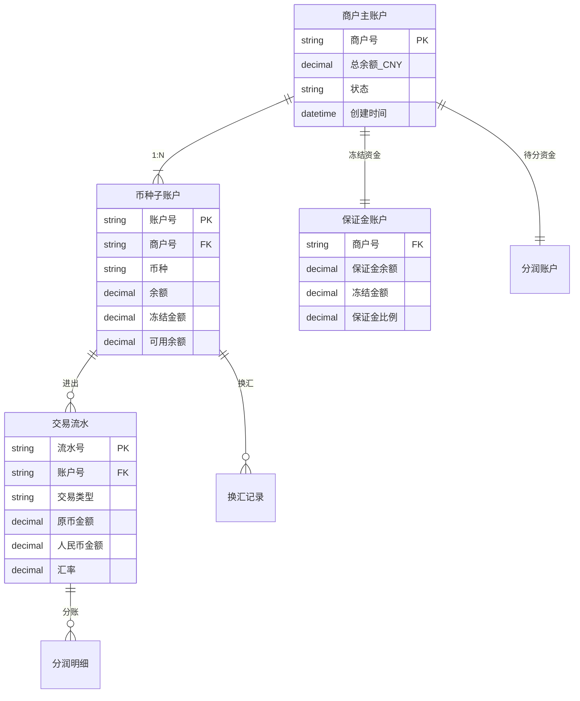
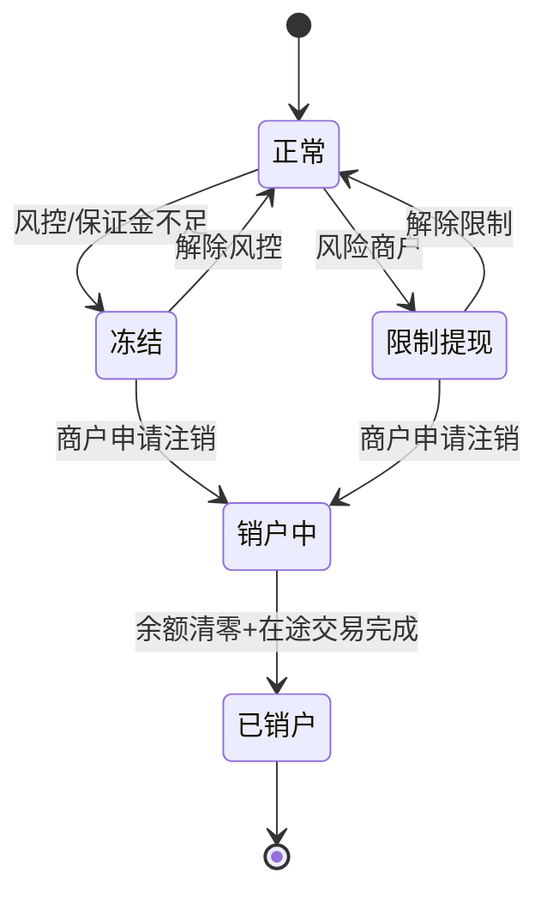

# 多币种账户体系(深度)

> **系列第 7 篇 · 深度**
> 上一篇 [6_跨境对账与结算体系-深度](./6_跨境对账与结算体系-深度.md) 讲了 5 类差异 + 换汇 3 决策 + 外管申报。本篇是**第三层 · 架构与系统的第四篇**——讲**多币种账户体系**——**账户模型（商户主账户 + 币种子账户 + 保证金账户 + 分润账户）+ 账户状态机（正常/冻结/限制提现/销户中/已销户）+ 换汇 3 策略（实时/批量/原币）+ 流动性管理（多币种账户余额 + 头寸管理）**。

---

## 一句话定义

> **多币种账户体系 =「商户主账户 + 币种子账户 + 保证金账户 + 分润账户」4 类账户 +「正常/冻结/限制提现/销户中/已销户」5 状态 +「实时/批量/原币」3 换汇策略**。核心挑战不是存钱，是**汇率波动时的多币种记账 + 双向记账 + 换汇时点 + 流动性管理**。**业内默认：** 头部公司必须有「**4 类账户 + 5 状态机 + 3 换汇策略 + 流动性管理 + 双向记账**」完整体系——**单一账户不够，必须多币种 + 多状态 + 多策略**。

---

## 业务背景与价值

### 为什么「多币种账户体系」是核心难题？

入门读者以为「账户 = 一个用户存钱的地方」。但跨境收单的真实账户体系是「**4 类账户 + 5 状态机 + 多币种记账**」：

**4 类账户的真实复杂度：**
- **商户主账户**（总账户 + 跨币种）
- **币种子账户**（每个币种一个子账户）
- **保证金账户**（冻结资金）
- **分润账户**（待分资金）

**业内默认：** 多币种账户的真实复杂度是「**4 类 + 5 状态 + 多币种 + 双向记账**」——**不是简单的「一个账户存钱」**

### 账户体系的 3 维度框架

**维度 1：账户类型（4 类）**
- 商户主账户（1:N 币种子账户）
- 币种子账户（每个币种一个）
- 保证金账户（冻结资金）
- 分润账户（待分资金）

**维度 2：账户状态（5 个）**
- 正常
- 冻结
- 限制提现
- 销户中
- 已销户

**维度 3：换汇策略（3 类）**
- 实时换汇
- 批量换汇
- 原币结算

**业内默认：** 3 维度是「**账户 + 状态 + 换汇**」的 3 维度协同

### 监管意图：为什么「多币种账户」必须合规？

监管对多币种账户有「**外管登记 + 备付金 + 反洗钱**」3 重要求：
1. **外管登记**——跨境支付必须在外管局登记
2. **备付金**——支付机构客户备付金必须存管
3. **反洗钱**——多币种账户必须支持 AML / KYC

**专家视角：** 3 条要求**决定了多币种账户必须有「**外管登记 + 备付金 + 反洗钱**」三重要求**

---

## 业务术语表

| 中文 | 英文 | 一句话解释 |
|---|---|---|
| 商户主账户 | Merchant Master Account | 商户的总账户（跨币种）|
| 币种子账户 | Currency Sub-Account | 每个币种一个子账户 |
| 保证金账户 | Reserve Account | 冻结资金的账户 |
| 分润账户 | Profit Sharing Account | 待分资金的账户 |
| 账户状态 | Account Status | 正常/冻结/限制提现/销户中/已销户 |
| 换汇 | FX Conversion | 外币 → 人民币 |
| 实时换汇 | Real-Time FX | 每笔交易立即换汇 |
| 批量换汇 | Batch FX | T+1 汇总后统一换 |
| 原币结算 | Original Currency Settlement | 不换汇 + 原币打给商户 |
| 流动性 | Liquidity | 资金流动性管理 |
| 头寸 | Position | 多币种账户余额 |
| 双向记账 | Double-Entry Bookkeeping | 借 + 贷 必须平衡 |
| 多币种记账 | Multi-Currency Bookkeeping | 每个币种独立记账 |
| 汇率损益 | FX Gain/Loss | 汇率波动产生的损益 |
| 销户 | Account Cancellation | 账户注销流程 |
| 冻结 | Account Frozen | 风险商户 / 保证金不足 |
| 限制提现 | Withdrawal Restricted | 风险商户限制提现 |
| 提现 | Withdrawal | 商户主动提现 |
| 入账 | Deposit | 交易金额入账 |
| 余额 | Balance | 账户当前余额 |
| 可用余额 | Available Balance | 余额 - 冻结金额 |
| 已销户 | Cancelled | 余额清零 + 在途完成 |

---

## 业务形态与模式：4 类账户详解

### 账户 1：商户主账户（Merchant Master Account）

**业务形态：**
- 1 个商户对应 1 个主账户
- 主账户是「总账户」，跨币种汇总
- 主账户管理 N 个币种子账户

**核心字段：**

| 字段 | 类型 | 说明 |
|---|---|---|
| 商户号 | string PK | 唯一标识 |
| 总余额 | decimal CNY | 跨币种汇总（按实时汇率换算）|
| 状态 | enum | 正常/冻结/限制提现/销户中/已销户 |
| 创建时间 | datetime | 账户创建时间 |
| KYC 状态 | enum | 已通过/审核中/未通过 |

**业内默认：** 商户主账户是「**总账户**」——按实时汇率换算成人民币汇总

### 账户 2：币种子账户（Currency Sub-Account）

**业务形态：**
- 1 个商户主账户对应 N 个币种子账户
- 每个支持的币种 1 个子账户
- 子账户独立记账

**核心字段：**

| 字段 | 类型 | 说明 |
|---|---|---|
| 账户号 | string PK | 唯一标识 |
| 商户号 | string FK | 关联主账户 |
| 币种 | string | USD/EUR/GBP/JPY/HKD/CNY |
| 余额 | decimal | 当前余额 |
| 冻结金额 | decimal | 保证金 / 风险冻结 |
| 可用余额 | decimal | 余额 - 冻结金额 |

**业内默认：** 币种子账户是「**多币种记账**」核心——每个币种独立

### 账户 3：保证金账户（Reserve Account）

**业务形态：**
- 1 个商户对应 1 个保证金账户
- 用于冻结资金（保证金 / 风险准备）
- 不可提现

**核心字段：**

| 字段 | 类型 | 说明 |
|---|---|---|
| 商户号 | string FK | 关联主账户 |
| 保证金余额 | decimal | 当前保证金 |
| 冻结金额 | decimal | 风险冻结 |
| 保证金比例 | decimal | 5%-20%（按风险等级）|

**业内默认：** 保证金账户是「**风险缓冲**」——按风险等级动态调整比例

### 账户 4：分润账户（Profit Sharing Account）

**业务形态：**
- 1 个商户对应 1 个分润账户
- 用于待分资金（平台抽成 / 子商户分成）
- 分润完成后转入主账户

**核心字段：**

| 字段 | 类型 | 说明 |
|---|---|---|
| 商户号 | string FK | 关联主账户 |
| 待分金额 | decimal | 当前待分 |
| 分润规则 | JSON | 平台抽成比例 / 子商户分成 |
| 上次分润时间 | datetime | 上次分润完成时间 |

**业内默认：** 分润账户是「**多边分账**」核心——平台型商户必备

### 4 类账户决策矩阵

| 账户类型 | 关系 | 业务 | 业内默认 |
|---|---|---|---|
| **主账户** | 1:1 商户 | 总账户 | 跨币种汇总 |
| **币种子账户** | 1:N 主账户 | 多币种记账 | 每个币种独立 |
| **保证金账户** | 1:1 商户 | 风险缓冲 | 按风险调整 |
| **分润账户** | 1:1 商户 | 多边分账 | 平台型必备 |

**业内默认：** **4 类账户是「**主 + 子 + 保证金 + 分润**」完整体系**

---

## 业务流程图：账户关系

**关键设计：**
- 商户主账户是「**总账户**」
- 币种子账户是「**多币种记账**」
- 保证金账户是「**风险缓冲**」
- 分润账户是「**多边分账**」
- 4 类账户**协同完成**多币种账户体系

---

## 系统架构：账户状态机

**关键观察：**
- 5 个状态**有限状态机**（不能跳过）
- **正常 → 冻结/限制提现**（风控触发）
- **冻结/限制提现 → 销户中**（商户申请）
- **销户中 → 已销户**（余额清零 + 在途完成）

### 5 状态决策矩阵

| 状态 | 触发 | 解除 | 业务影响 |
|---|---|---|---|
| **正常** | 默认 | — | 正常交易 |
| **冻结** | 风控触发 / 保证金不足 | 解除风控 / 补足保证金 | 暂停所有交易 |
| **限制提现** | 风险商户 | 解除限制 | 只能入账 + 退款，不能提现 |
| **销户中** | 商户申请注销 | 余额清零 + 在途完成 | 停止新交易 + 处理在途 |
| **已销户** | 销户完成 | — | 账户不可用 |

**业内默认：** **5 状态机是「**正常 → 冻结/限制提现 → 销户中 → 已销户**」的完整生命周期**

---

## 服务模型：换汇 3 策略

### 策略 1：实时换汇

**机制：**
- 每笔交易立即换汇
- 按实时汇率锁定
- 汇损 0%（锁定汇率）

**优势：**
- 锁定汇率 + 无汇损风险
- 用户体验好

**劣势：**
- 高频交易成本高
- 需要实时汇率数据

**适合：** 大额交易

### 策略 2：批量换汇

**机制：**
- T+1 汇总后统一换
- 按当天平均汇率
- 汇损 1%-3%

**优势：**
- 降低换汇成本
- 不需要实时汇率

**劣势：**
- 汇率波动风险
- 汇损较高

**适合：** 小额交易

### 策略 3：原币结算

**机制：**
- 不换汇
- 原币打给商户
- 商户自己换汇

**优势：**
- 收单机构无汇率风险
- 商户自由换汇

**劣势：**
- 需要商户有外币账户
- 商户承担汇率风险

**适合：** 跨境大商户

### 3 策略决策矩阵

| 策略 | 优势 | 代价 | 适合 |
|---|---|---|---|
| **实时换汇** | 锁定汇率 | 高频成本高 | 大额交易 |
| **批量换汇** | 降低成本 | 汇率波动 | 小额交易 |
| **原币结算** | 收单机构无风险 | 商户有外币账户 | 大商户 |

**业内默认：** **头部公司必须「**3 策略组合 + 灵活调整**」**

---

## 核心功能用例

### 用例 1：新加坡 VISA 100 SGD 入账

**流程：**
- 用户付款 100 SGD
- 卡组织清算 97.6 SGD（扣 2.4% 手续费）
- **入账：USD 子账户 +97.6 SGD**
- T+1 换汇：USD → CNY
- **入账：CNY 主账户 +530 CNY**

**资金流：** SGD 子账户 → 换汇 → CNY 主账户

### 用例 2：商户提现

**流程：**
- 商户申请提现 1000 CNY
- 检查主账户余额 ≥ 1000 CNY
- 检查可用余额 ≥ 1000 CNY
- 打款 1000 CNY 到商户银行

**资金流：** CNY 主账户 → 银行打款

### 用例 3：风险商户冻结

**场景：** 商户拒付率 > 2%

**处理：**
- 监控告警（拒付率 > 2%）
- 自动冻结账户
- 通知商户
- 人工审核（解除 / 维持）

**资金流：** 正常 → 冻结

### 用例 4：多币种商户结算

**场景：** 跨国电商商户，多币种结算

**流程：**
- USD 子账户余额 1000
- EUR 子账户余额 500
- JPY 子账户余额 50000
- 商户申请多币种结算
- 实时换汇 → 合并 CNY
- 打款 CNY

**资金流：** 多币种 → 合并换汇 → CNY 打款

---

## 业务打法与策略：不同公司的账户体系

### 头部公司（年 GMV > 100 亿美元）

**典型做法：**
- **4 类账户齐全**（主 + 子 + 保证金 + 分润）
- **5 状态机完整**（正常 + 冻结 + 限制提现 + 销户中 + 已销户）
- **3 换汇策略**（实时 + 批量 + 原币）
- **流动性管理**（多币种账户余额 + 头寸管理）
- **双向记账**（借 + 贷必须平衡）

**业内认知：** 头部公司是「**4 类 + 5 状态 + 3 策略 + 流动性 + 双向记账**」的完整体系

### 中型公司（年 GMV 1-100 亿美元）

**典型做法：**
- **3 类账户**（主 + 子 + 保证金）
- **3 状态**（正常 + 冻结 + 销户）
- **2 换汇策略**（实时 + 批量）
- **基础流动性管理**

**业内认知：** 中型公司是「**够用但不极致**」的体系

### 小公司 / 新进入者（年 GMV < 1 亿美元）

**典型做法：**
- **1 类账户**（仅主账户）
- **1 状态**（仅正常）
- **1 换汇策略**（仅实时）
- **无流动性管理**

**业内认知：** 小公司是「**MVP 起步**」的体系

---

## Trade-off 分析

### 决策 1：账户类型

| 选项 | 优势 | 代价 | 适合谁 |
|---|---|---|---|
| **1 类** | 简单 | 扩展性差 | 小公司 |
| **3 类** | 平衡 | 复杂度中等 | 中型公司 |
| **4 类** | 完整 | 复杂度高 | 头部公司 |

**专家视角：** **账户类型是规模驱动**——业内默认是「**小公司 1 类 / 中型 3 类 / 头部 4 类**」

### 决策 2：换汇策略

| 选项 | 优势 | 代价 | 适合谁 |
|---|---|---|---|
| **仅实时** | 简单 + 锁定汇率 | 高频成本高 | 小公司 |
| **实时 + 批量** | 平衡 | 复杂 | 中型公司 |
| **实时 + 批量 + 原币** | 完整 | 复杂 | 头部公司 |

**专家视角：** **换汇策略不是越多越好**——是「**业务规模 + 客户需求 + 风险偏好**」的取舍

### 决策 3：流动性管理

| 选项 | 优势 | 代价 | 适合谁 |
|---|---|---|---|
| **无管理** | 简单 | 流动性风险 | 小公司 |
| **基础管理** | 平衡 | 人工管理 | 中型公司 |
| **专业管理** | 风险最低 | 成本高 | 头部公司 |

**专家视角：** **流动性管理不是越简单越好**——是「**业务规模 + 风险偏好 + 团队能力**」的取舍

---

## 行业洞察 / 业内认知

### 不成文标准：多币种账户的真实复杂度

公开规则：多币种账户 = 多个币种。

**业内实际复杂度（业内默认）：**

| 维度 | 真实复杂度 | 业内默认 |
|---|---|---|
| 账户类型 | **4 类** | 主 + 子 + 保证金 + 分润 |
| 账户状态 | **5 个** | 正常/冻结/限制提现/销户中/已销户 |
| 换汇策略 | **3 类** | 实时 + 批量 + 原币 |
| 双向记账 | **必须** | 借 + 贷必须平衡 |
| 多币种记账 | **每个币种独立** | USD/EUR/GBP/JPY/HKD/CNY |
| 汇率损益 | **必须** | 实时计算 |
| 流动性管理 | **必须** | 多币种账户余额 + 头寸 |
| 头部公司 | **完整体系** | 4 类 + 5 状态 + 3 策略 |
| 中型公司 | **基本体系** | 3 类 + 3 状态 + 2 策略 |
| 小公司 | **MVP** | 1 类 + 1 状态 + 1 策略 |
| 备付金 | **必须存管** | 央行指定账户 |
| 反洗钱 | **必须支持** | 多币种账户 + AML/KYC |

**专家视角：** 多币种账户的真实复杂度是「**4 类 + 5 状态 + 3 策略 + 双向记账 + 多币种记账 + 流动性管理**」。**业内默认：** 头部公司必须有「**4 类 + 5 状态 + 3 策略 + 双向记账 + 多币种 + 流动性 + 备付金 + AML**」完整体系

### 真实事故：多币种账户失败引发重大损失

公开报道：2022 年某中型跨境支付公司因**多币种账户失败**：
- 单账户（仅主账户）+ 1 状态
- 换汇实时（无批量 + 无原币）
- 汇率波动时未记录汇率损益
- 双向记账不平衡（借贷差 1000 USD）

**累计损失：**
- 汇率损失：500 万人民币
- 借贷不平：1000 USD 神秘差额
- 合规处罚：200 万
- 业务亏损：700 万人民币
- 后续：被头部公司收购

**业内流传的处理方式：** 头部公司后来强制多币种账户必须经过：
- 4 类账户齐全（主 + 子 + 保证金 + 分润）
- 5 状态机完整（正常 + 冻结 + 限制提现 + 销户中 + 已销户）
- 3 换汇策略（实时 + 批量 + 原币）
- 双向记账（借 + 贷必须平衡）
- 多币种记账（每个币种独立）
- 汇率损益（实时计算）
- 流动性管理（多币种账户余额 + 头寸）
- 备付金存管（央行指定账户）
- AML/KYC 支持

**教训：** 多币种账户失败的「真实成本」不是汇率损失，是「**借贷不平 + 合规处罚 + 业务亏损 + 公司被收购**」。**业内默认：** 头部公司多币种账户必须有「**4 类 + 5 状态 + 3 策略 + 双向记账 + 多币种 + 流动性 + 备付金 + AML**」完整体系

### 从业者挑战：多币种账户的 5 个核心难题

跨境支付公司常见的内部挑战：多币种账户的 5 个核心难题。

**1. 多币种记账难**

多币种记账复杂。**业内默认：** 必须有「**每个币种独立 + 双向记账 + 汇率损益**」

**2. 状态机管理难**

状态机管理复杂。**业内默认：** 必须有「**5 状态机 + 触发条件 + 解除条件**」

**3. 换汇时点难**

换汇时点难判断。**业内默认：** 必须有「**3 策略 + 灵活调整 + 流动性管理**」

**4. 流动性管理难**

流动性管理复杂。**业内默认：** 必须有「**多币种账户余额 + 头寸管理 + 应急 SOP**」

**5. 合规管理难**

合规管理复杂。**业内默认：** 必须有「**外管登记 + 备付金存管 + AML/KYC**」

**专家视角：** 5 个核心难题的真实门槛不是技术实现，是「**多币种 + 状态机 + 换汇 + 流动性 + 合规**」5 维度协同。**业内默认：** 多币种账户必须有「**4 类 + 5 状态 + 3 策略 + 双向记账 + 多币种 + 流动性 + 备付金 + AML**」完整体系

---

## 业务前景与趋势

### 未来 3-5 年的 4 个结构性变化

**1. 账户智能化**

传统人工 → **AI 智能账户管理**。**对参与方格局的启示：** AI 智能化能力成为头部支付公司的核心资产

**2. 流动性实时化**

传统批量 → **实时流动性管理**。**对参与方格局的启示：** 实时流动性能力成为头部支付公司的差异化优势

**3. 备付金自动化**

传统手工 → **备付金自动化管理**。**对参与方格局的启示：** 自动化能力成为头部支付公司的护城河

**4. 跨境协同化**

传统独立 → **跨境账户协同**。**对参与方格局的启示：** 跨境协同能力成为头部支付公司的护城河

---

## 一句话总结

> **多币种账户体系 =「商户主账户 + 币种子账户 + 保证金账户 + 分润账户」4 类账户 +「正常/冻结/限制提现/销户中/已销户」5 状态 +「实时/批量/原币」3 换汇策略**。核心挑战不是存钱，是**汇率波动时的多币种记账 + 双向记账 + 换汇时点 + 流动性管理**。**业内默认：** 头部公司必须有「**4 类账户 + 5 状态机 + 3 换汇策略 + 流动性管理 + 双向记账**」完整体系——**单一账户不够，必须多币种 + 多状态 + 多策略**。

---

## 📌 数据与事实声明

本文涉及的多币种账户体系、4 类账户、5 状态机、3 换汇策略等内容是跨境支付账户管理的通用认知，但具体到：

- 各家支付公司的账户体系和状态机以各公司实际为准
- 4 类账户（主 + 子 + 保证金 + 分润）是业内常见划分，**不是强制标准**
- 5 状态机（正常/冻结/限制提现/销户中/已销户）是业内常见划分，**不是强制标准**
- 3 换汇策略（实时/批量/原币）的具体实施以各公司实际为准
- 双向记账的具体规则以各公司实际为准
- 备付金存管和 AML/KYC 以监管最新规定为准
- 真实事故的具体描述基于业内公开信息的整理，**不是任何具体公司的真实情况**

不要直接引用本文作为多币种账户设计依据或选型依据。

---

## 下一篇预告

下一篇 [8_风控与合规框架-深度](./8_风控与合规框架-深度.md) 将继续**第三层 · 架构与系统**——讲**风控与合规框架**——风控 3 层（硬规则/风险评估/事后监控）+ 3DS v1/v2 + AML/KYC + 国际合规 8 标准（PCI DSS / PSD2/SCA / 3DS2/EMV 3DS / GDPR / PIPL / MAS PSA / 央行 259 号文 / US BSA）+ 拒付率控制。
