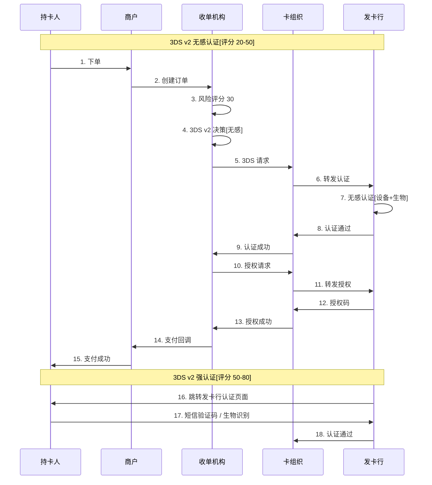

# 风控与合规框架(深度)

> **系列第 8 篇 · 深度**
> 上一篇 [7_多币种账户体系-深度](./7_多币种账户体系-深度.md) 讲了 4 类账户 + 5 状态机 + 3 换汇策略。本篇是**第三层 · 架构与系统的第五篇**——讲**风控与合规框架**——**风控 3 层（硬规则/风险评估/事后监控）+ 3DS v1/v2 + AML/KYC + 8 项国际合规标准（PCI DSS / PSD2/SCA / 3DS2/EMV 3DS / GDPR / PIPL / MAS PSA / 央行 259 号文 / US BSA）+ 拒付率控制（<0.5%）**。

---

## 一句话定义

> **风控与合规框架 =「风控 3 层（硬规则 + 风险评估 + 事后监控）+ 3DS 强认证 + AML/KYC + 8 项国际合规标准」**。3 层风控 = 硬规则（黑名单/限额/拒付）+ 风险评估（实时评分/3DS 触发）+ 事后监控（拒付率/欺诈率/异常模式）。**业内默认：** 头部公司必须有「**风控 3 层 + 3DS v2 + AML/KYC + 8 项国际合规 + 拒付率 < 0.5% + 合规团队 50+ 人**」完整体系——**单一风控不够，必须多层 + 多合规 + 多团队**。

---

## 业务背景与价值

### 为什么「风控与合规框架」是核心难题？

入门读者以为「风控 = 拦截黑名单」。但跨境支付的真实风控与合规是「**风控 3 层 + 3DS + AML/KYC + 8 项国际合规**」：

**风控 3 层的真实复杂度：**
- **硬规则**（黑名单/限额/拒付）：1 秒拦截
- **风险评估**（实时评分/3DS 触发）：100ms 决策
- **事后监控**（拒付率/欺诈率/异常模式）：T+1 报告

**合规体系的真实复杂度：**
- **AML**（Anti-Money Laundering）：反洗钱
- **KYC**（Know Your Customer）：客户身份识别
- **8 项国际合规标准**：PCI DSS / PSD2-SCA / 3DS2-EMV 3DS / GDPR / PIPL / MAS PSA / 央行 259 号文 / US BSA

**业内默认：** 跨境支付的真实风控与合规是「**风控 3 层 + 3DS + AML/KYC + 8 项国际合规**」——**不是简单的「拦截黑名单」**

### 风控与合规的 3 维度框架

**维度 1：风控层级（3 层）**
- 硬规则（前置拦截）
- 风险评估（实时决策）
- 事后监控（T+1 复盘）

**维度 2：合规体系（3 类）**
- AML/KYC（反洗钱 / 客户识别）
- 8 项国际合规标准（PCI DSS / GDPR / PIPL 等）
- 牌照要求（支付牌照 / 跨境试点 / 外汇登记）

**维度 3：团队规模（50+ 人）**
- 风控团队（30+ 人）
- 合规团队（20+ 人）
- 法务团队（10+ 人）

**业内默认：** 3 维度是「**风控 + 合规 + 团队**」的 3 维度协同

### 监管意图：为什么「风控与合规」必须严格？

监管对风控与合规有「**反洗钱 + 反欺诈 + 数据保护 + 牌照**」4 重要求：
1. **反洗钱**——AML 必须完整（客户识别 + 交易监控 + 报告）
2. **反欺诈**——拒付率必须控制（< 0.5%）
3. **数据保护**——必须合规（GDPR / PIPL）
4. **牌照要求**——必须有支付牌照 + 跨境试点

**专家视角：** 4 条要求**决定了风控与合规必须有「**反洗钱 + 反欺诈 + 数据保护 + 牌照**」四重要求**

---

## 业务术语表

| 中文 | 英文 | 一句话解释 |
|---|---|---|
| 风控 | Risk Control | 拦截欺诈 + 控制风险 |
| 硬规则 | Hard Rules | 黑名单 + 限额 + 拒付前置拦截 |
| 风险评估 | Risk Assessment | 实时评分 + 3DS 触发 |
| 事后监控 | Post-Monitoring | T+1 拒付率 + 欺诈率 + 异常模式 |
| AML | Anti-Money Laundering | 反洗钱 |
| KYC | Know Your Customer | 客户身份识别 |
| 3DS v1 | 3D Secure v1 | 卡支付强认证（弹窗）|
| 3DS v2 | 3D Secure v2 | 卡支付强认证（无感）|
| EMV 3DS | EMV 3DS | 卡组织统一标准 |
| 拒付 | Chargeback | 持卡人申诉 + 强制扣回 |
| 拒付率 | Chargeback Rate | 拒付笔数 / 总笔数 |
| 黑名单 | Blacklist | 禁止交易的卡号 / 商户 / 国家 |
| 限额 | Transaction Limit | 单笔 / 单日 / 单月限额 |
| 风险评分 | Risk Score | 0-100 分（高分高风险）|
| PCI DSS | PCI DSS | 卡数据存储/传输加密标准 |
| PSD2/SCA | PSD2 / SCA | 欧盟强客户认证 |
| GDPR | GDPR | 欧盟通用数据保护条例 |
| PIPL | PIPL | 中国个人信息保护法 |
| MAS PSA | MAS PSA | 新加坡支付服务法 |
| 央行 259 号文 | PBOC No.259 | 中国跨境支付试点 |
| US BSA | US BSA | 美国银行保密法 |
| 制裁名单 | Sanction List | OFAC / 联合国制裁名单 |
| 反欺诈 | Anti-Fraud | 拦截盗刷 + 冒用 |
| 拒付抗辩 | Chargeback Representment | 商户提供证据申诉 |

---

## 业务形态与模式：风控 3 层详解

### 第 1 层：硬规则（Hard Rules）

**业务形态：**
- 黑名单（卡号 / 商户 / 国家）
- 限额（单笔 / 单日 / 单月）
- 拒付前置拦截

**核心规则：**

| 规则 | 说明 | 拦截响应 |
|---|---|---|
| **黑名单** | 卡号 / 商户 / 国家 在名单中 | 立即拒绝 |
| **限额** | 单笔 > X / 单日 > Y / 单月 > Z | 立即拒绝 |
| **拒付前置** | 商户拒付率 > 2% | 立即拒绝 |
| **3DS 强制** | 高风险国家 / 商户 | 强制 3DS |

**业内默认：** 硬规则是「**前置拦截**」——**简单 + 快 + 必须**

### 第 2 层：风险评估（Risk Assessment）

**业务形态：**
- 实时风险评分（0-100 分）
- 3DS 触发决策
- 多维度评估

**评估维度：**

| 维度 | 权重 | 评分规则 |
|---|---|---|
| **设备指纹** | 30% | 新设备 +30 / 老设备 -10 |
| **IP 风险** | 20% | 代理 IP +30 / 干净 IP -10 |
| **行为模式** | 20% | 异常模式 +20 / 正常模式 -10 |
| **卡 BIN** | 15% | 高风险 BIN +15 / 低风险 BIN -5 |
| **交易金额** | 10% | 异常金额 +10 / 正常金额 -5 |
| **地理位置** | 5% | 高风险国家 +5 / 低风险国家 -2 |

**决策规则：**

| 评分 | 决策 |
|---|---|
| **< 20** | 通过 |
| **20-50** | 3DS v2 无感认证 |
| **50-80** | 3DS v2 强认证 |
| **> 80** | 拒绝 |

**业内默认：** 风险评估是「**实时决策**」——**100ms 内 + 评分 + 触发 3DS**

### 第 3 层：事后监控（Post-Monitoring）

**业务形态：**
- T+1 拒付率统计
- 欺诈率统计
- 异常模式分析

**核心指标：**

| 指标 | 计算 | 业内默认阈值 |
|---|---|---|
| **拒付率** | 拒付笔数 / 总笔数 | < 0.5% |
| **欺诈率** | 欺诈笔数 / 总笔数 | < 0.1% |
| **3DS 触发率** | 3DS 触发笔数 / 总笔数 | 5%-15% |
| **3DS 通过率** | 3DS 通过笔数 / 触发笔数 | > 85% |
| **授权成功率** | 授权笔数 / 总笔数 | > 95% |
| **异常模式** | 异常模式告警 | 实时监控 |

**业内默认：** 事后监控是「**T+1 复盘**」——**监控 + 异常告警 + 应急 SOP**

### 风控 3 层决策矩阵

| 层级 | 时延 | 关键能力 | 业内默认 |
|---|---|---|---|
| **硬规则** | 1 秒 | 黑名单 + 限额 + 拒付 | 前置拦截 |
| **风险评估** | 100ms | 评分 + 3DS 触发 | 实时决策 |
| **事后监控** | T+1 | 拒付率 + 欺诈率 + 异常 | 复盘 + 告警 |

**业内默认：** **3 层风控是「前置 + 实时 + 复盘」的完整体系**

---

## 业务流程图：3DS 强认证流程

**关键观察：**
- **3DS v2 无感**（评分 20-50）：设备 + 生物自动认证
- **3DS v2 强认证**（评分 50-80）：短信 / OTP / 生物
- **3DS 失败**（评分 > 80）：直接拒绝

---

## 系统架构：合规体系全景

```mermaid
graph TD
    subgraph 风控 3 层
        L1[硬规则<br/>黑名单/限额/拒付]
        L2[风险评估<br/>实时评分/3DS]
        L3[事后监控<br/>拒付率/欺诈率]
    end

    subgraph 合规 3 类
        AML[AML 反洗钱<br/>客户识别+交易监控]
        KYC[KYC 客户身份<br/>身份证+护照+地址]
        SANCTION[制裁名单<br/>OFAC+联合国]
    end

    subgraph 8 项国际合规
        PCI[PCI DSS<br/>卡数据加密]
        PSD2[PSD2/SCA<br/>欧盟强认证]
        GDPR_R[GDPR<br/>欧盟数据保护]
        PIPL_R[PIPL<br/>中国数据保护]
        MAS[MAS PSA<br/>新加坡支付法]
        PBOC[央行 259 号文<br/>跨境支付试点]
        BSA[US BSA<br/>美国银行保密]
        EMV[EMV 3DS<br/>卡组织标准]
    end

    L1 --> L2 --> L3
    AML --> KYC --> SANCTION
    PCI --> PSD2 --> GDPR_R --> PIPL_R --> MAS --> PBOC --> BSA --> EMV

    style L1 fill:#dbeafe
    style L2 fill:#fef3c7
    style L3 fill:#fce7f3
    style AML fill:#fed7aa
    style KYC fill:#d1fae5
    style SANCTION fill:#ffcdd2
```

**关键设计：**
- **风控 3 层**（前置 + 实时 + 复盘）
- **合规 3 类**（反洗钱 + 客户识别 + 制裁名单）
- **8 项国际合规**（PCI DSS / PSD2 / GDPR / PIPL / MAS / PBOC / BSA / EMV 3DS）

---

## 服务模型：8 项国际合规详解

### 合规 1：PCI DSS（卡数据加密）

**要求：**
- 卡号不能明文存储（必须加密）
- 卡号不能明文传输（必须 TLS）
- 持卡人数据必须保护

**业内默认：** PCI DSS Level 1 是头部公司的标配

### 合规 2：PSD2/SCA（欧盟强客户认证）

**要求：**
- 欧盟境内支付必须强认证
- 3DS v2 是必备
- 必须满足「知识 + 持有 + 生物」3 要素

**业内默认：** 欧盟市场必须 PSD2 + SCA 强制

### 合规 3：3DS2/EMV 3DS（卡组织标准）

**要求：**
- 卡组织（VISA / MC / Amex / JCB）统一标准
- 3DS v2 比 3DS v1 更智能
- 无感认证 + 强认证 2 种模式

**业内默认：** 3DS2 是头部公司的标配

### 合规 4：GDPR（欧盟数据保护）

**要求：**
- 欧盟用户数据必须保护
- 必须有用户授权
- 用户有删除权

**业内默认：** GDPR 是欧盟市场的强制要求

### 合规 5：PIPL（中国个人信息保护法）

**要求：**
- 中国用户数据必须保护
- 必须有用户授权
- 数据本地化

**业内默认：** PIPL 是中国市场的强制要求

### 合规 6：MAS PSA（新加坡支付服务法）

**要求：**
- 新加坡支付牌照
- 反洗钱 + 反恐怖融资
- 数据本地化

**业内默认：** MAS PSA 是新加坡市场的强制要求

### 合规 7：央行 259 号文（中国跨境支付试点）

**要求：**
- 跨境支付试点资格
- 实名认证 + 外管申报
- 备付金存管

**业内默认：** 央行 259 号文是中国跨境支付的强制要求

### 合规 8：US BSA（美国银行保密法）

**要求：**
- 美国支付牌照（MSB / Money Transmitter）
- 反洗钱 + 反恐怖融资
- 客户识别 + 交易监控

**业内默认：** US BSA 是美国市场的强制要求

### 8 项合规决策矩阵

| 合规 | 适用地区 | 核心要求 | 业内默认 |
|---|---|---|---|
| **PCI DSS** | 全球 | 卡数据加密 | Level 1 |
| **PSD2/SCA** | 欧盟 | 强认证 | 强制 |
| **3DS2/EMV 3DS** | 全球 | 卡组织标准 | 标配 |
| **GDPR** | 欧盟 | 数据保护 | 强制 |
| **PIPL** | 中国 | 数据保护 | 强制 |
| **MAS PSA** | 新加坡 | 支付牌照 | 强制 |
| **央行 259** | 中国 | 跨境试点 | 强制 |
| **US BSA** | 美国 | 反洗钱 | 强制 |

**业内默认：** **8 项合规是头部公司全球化的必备**

---

## 核心功能用例

### 用例 1：新加坡 VISA 100 SGD 风控

**流程：**
- 用户付款 100 SGD
- 硬规则检查：卡号不在黑名单 + 限额内 + 商户拒付率 < 2%
- 风险评分：30 分（设备+IP+行为）
- 3DS v2 决策：无感认证
- 授权成功

**时延：** 3 秒（含 3DS）

### 用例 2：高风险交易拦截

**场景：** 代理 IP + 新设备 + 高风险国家

**流程：**
- 硬规则：高风险国家 → 强制 3DS
- 风险评分：70 分
- 3DS v2 决策：强认证
- 用户短信验证
- 认证通过 / 失败

### 用例 3：拒付处理

**场景：** 新加坡持卡人 30 天后申诉

**流程：**
- 持卡人申诉 → DBS（发卡行）
- DBS 发起 chargeback
- VISA 通知收单机构
- 商户选择接受或抗辩
- 提供证据（订单 + 物流 + 沟通记录）
- 30-120 天处理

### 用例 4：AML 监控

**场景：** 同一商户多笔大额交易

**流程：**
- 交易监控触发 AML 告警
- 调查商户交易模式
- 确认是否可疑
- 上报（CTR / SAR）

---

## 业务打法与策略：不同公司的风控体系

### 头部公司（年 GMV > 100 亿美元）

**典型做法：**
- **风控 3 层完整**（硬规则 + 风险评估 + 事后监控）
- **3DS v2 标配**
- **AML/KYC 完整**
- **8 项国际合规齐全**
- **拒付率 < 0.5%**
- **风控团队 30+ 人**
- **合规团队 20+ 人**

**业内认知：** 头部公司是「**风控 3 层 + 3DS + AML/KYC + 8 项合规 + 50+ 团队**」完整体系

### 中型公司（年 GMV 1-100 亿美元）

**典型做法：**
- **风控 2 层**（硬规则 + 风险评估）
- **3DS v2 部分**
- **AML/KYC 基本**
- **3-4 项合规**
- **拒付率 0.5%-1%**
- **风控团队 10-20 人**

**业内认知：** 中型公司是「**够用但不极致**」的体系

### 小公司 / 新进入者（年 GMV < 1 亿美元）

**典型做法：**
- **风控 1 层**（仅硬规则）
- **3DS v1**
- **无 AML/KYC**
- **1-2 项合规**
- **拒付率 1%-3%**
- **风控团队 1-3 人**

**业内认知：** 小公司是「**MVP 起步**」的体系

---

## Trade-off 分析

### 决策 1：风控层级

| 选项 | 优势 | 代价 | 适合谁 |
|---|---|---|---|
| **1 层**（仅硬规则）| 简单 + 成本低 | 拒付率高 | 小公司 |
| **2 层**（硬规则 + 评估）| 平衡 | 成本中等 | 中型公司 |
| **3 层**（硬规则 + 评估 + 监控）| 风险最低 | 成本高 | 头部公司 |

**专家视角：** **风控层级是规模驱动**——业内默认是「**小公司 1 层 / 中型 2 层 / 头部 3 层**」

### 决策 2：3DS 策略

| 选项 | 优势 | 代价 | 适合谁 |
|---|---|---|---|
| **不强制** | 转化率最高 | 拒付率最高 | 低风险 |
| **按风险分级** | 平衡 | 规则维护 | 中型 |
| **全量强制** | 拒付率最低 | 转化率低 | 高风险地区 |

**专家视角：** **3DS 策略不是越多越好**——业内默认是「**按风险分级 + 3DS v2 + 强制高风险**」

### 决策 3：合规覆盖

| 选项 | 优势 | 代价 | 适合谁 |
|---|---|---|---|
| **本地合规** | 简单 | 全球化受限 | 小公司 |
| **区域合规** | 平衡 | 部分市场受限 | 中型公司 |
| **全球合规** | 全球化 | 成本高 | 头部公司 |

**专家视角：** **合规覆盖是市场驱动**——业内默认是「**业务范围决定合规范围**」

---

## 行业洞察 / 业内认知

### 不成文标准：风控与合规的真实复杂度

公开规则：风控 = 拦截黑名单。

**业内实际复杂度（业内默认）：**

| 维度 | 真实复杂度 | 业内默认 |
|---|---|---|
| 风控层级 | **3 层** | 硬规则 + 风险评估 + 事后监控 |
| 风险评分 | **6 维度** | 设备/IP/行为/卡BIN/金额/地理 |
| 3DS 模式 | **2 种** | v2 无感 + v2 强认证 |
| 合规体系 | **3 类** | AML/KYC + 8 项国际合规 + 牌照 |
| 国际合规 | **8 项** | PCI/PSD2/3DS2/GDPR/PIPL/MAS/PBOC/BSA |
| 拒付率 | **< 0.5%** | 头部公司 |
| 3DS 触发率 | **5%-15%** | 业内默认 |
| 风控团队 | **30+ 人** | 头部公司 |
| 合规团队 | **20+ 人** | 头部公司 |
| 法务团队 | **10+ 人** | 头部公司 |
| 业内默认 | **3 层 + 3DS + 8 合规 + 50+ 团队** | 头部公司标配 |

**专家视角：** 风控与合规的真实复杂度是「**3 层风控 + 3DS + AML/KYC + 8 项合规 + 50+ 团队**」。**业内默认：** 头部公司必须有「**3 层 + 3DS + AML/KYC + 8 项合规 + 拒付率 < 0.5% + 50+ 团队**」完整体系

### 真实事故：风控与合规失败引发重大损失

公开报道：2022 年某中型跨境支付公司因**风控与合规失败**：
- 风控 1 层（仅硬规则）
- 3DS 不强制
- 无 AML/KYC
- 3 项合规（无 GDPR / PIPL）

**累计损失：**
- 拒付率高（2.5%）：罚款 100 万美元
- 数据违规（GDPR）：罚款 500 万欧元
- 合规处罚（PIPL）：罚款 300 万人民币
- 业务亏损：2000 万人民币
- 后续：被头部公司收购

**业内流传的处理方式：** 头部公司后来强制风控与合规必须经过：
- 风控 3 层（硬规则 + 风险评估 + 事后监控）
- 3DS v2 标配
- AML/KYC 完整
- 8 项国际合规齐全
- 拒付率 < 0.5%
- 风控团队 30+ 人 + 合规团队 20+ 人
- 法务团队 10+ 人

**教训：** 风控与合规失败的「真实成本」不是罚款，是「**业务亏损 + 公司被收购**」。**业内默认：** 头部公司风控与合规必须有「**3 层 + 3DS + AML/KYC + 8 项合规 + 拒付率 < 0.5% + 50+ 团队**」完整体系

### 从业者挑战：风控与合规的 5 个核心难题

跨境支付公司常见的内部挑战：风控与合规的 5 个核心难题。

**1. 风控层级不完善**

风控层级不完善。**业内默认：** 必须有「**3 层风控 + 实时 + 复盘**」

**2. 3DS 决策难**

3DS 触发决策难。**业内默认：** 必须有「**风险分级 + 3DS v2 + 强制高风险**」

**3. AML 监控难**

AML 监控实施难。**业内默认：** 必须有「**客户识别 + 交易监控 + 报告**」

**4. 合规覆盖广**

合规覆盖广。**业内默认：** 必须有「**8 项国际合规 + 牌照齐全**」

**5. 团队成本高**

团队成本高。**业内默认：** 必须有「**风控 30+ + 合规 20+ + 法务 10+**」

**专家视角：** 5 个核心难题的真实门槛不是技术实现，是「**风控 + 3DS + AML + 合规 + 团队**」5 维度协同。**业内默认：** 风控与合规必须有「**3 层 + 3DS + AML/KYC + 8 项合规 + 拒付率 < 0.5% + 50+ 团队**」完整体系

---

## 业务前景与趋势

### 未来 3-5 年的 4 个结构性变化

**1. 风控智能化**

传统规则 → **AI 智能风控**。**对参与方格局的启示：** AI 智能化能力成为头部支付公司的核心资产

**2. 3DS 无感化**

传统强认证 → **3DS v2 无感**。**对参与方格局的启示：** 无感化能力成为头部支付公司的差异化优势

**3. 合规协同化**

传统单国合规 → **多国合规协同**。**对参与方格局的启示：** 合规协同能力成为头部支付公司的护城河

**4. 拒付预测化**

传统事后拒付 → **AI 拒付预测**。**对参与方格局的启示：** 拒付预测能力成为头部支付公司的护城河

---

## 一句话总结

> **风控与合规框架 =「风控 3 层（硬规则 + 风险评估 + 事后监控）+ 3DS 强认证 + AML/KYC + 8 项国际合规标准」**。3 层风控 = 硬规则（黑名单/限额/拒付）+ 风险评估（实时评分/3DS 触发）+ 事后监控（拒付率/欺诈率/异常模式）。**业内默认：** 头部公司必须有「**风控 3 层 + 3DS v2 + AML/KYC + 8 项国际合规 + 拒付率 < 0.5% + 合规团队 50+ 人**」完整体系——**单一风控不够，必须多层 + 多合规 + 多团队**。

---

## 📌 数据与事实声明

本文涉及的风控与合规框架、风控 3 层、3DS、AML/KYC、8 项国际合规等内容是跨境支付风控合规的通用认知，但具体到：

- 各家支付公司的风控体系和合规要求以各公司实际为准
- 风控 3 层（硬规则 + 风险评估 + 事后监控）是业内常见划分，**不是强制标准**
- 3DS v1/v2 标准以各卡组织最新规则为准
- 8 项国际合规标准（PCI DSS / PSD2/SCA / 3DS2/EMV 3DS / GDPR / PIPL / MAS PSA / 央行 259 号文 / US BSA）以各地区最新法规为准
- 拒付率 < 0.5% 是头部公司业内默认，**不是绝对标准**
- 风控团队 30+ 人 / 合规团队 20+ 人 / 法务团队 10+ 人 是头部公司业内默认范围，**不是严格定义**
- 真实事故的具体描述基于业内公开信息的整理，**不是任何具体公司的真实情况**

不要直接引用本文作为风控与合规设计依据或选型依据。

---

## 下一篇预告

下一篇 [10_全局架构设计与决策清单-全景](./10_全局架构设计与决策清单-全景.md) 将进入**第四层 · 架构与全局**——讲**全局架构设计**——决策矩阵（4 大决策：业务模式/通道管理/账户体系/合规覆盖）+ 业内默认清单（头部公司必备 8 项）+ 5 年后回头看的全局视角。