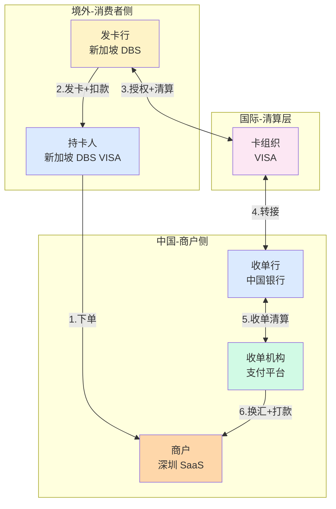

# 端到端实战：境外 VISA 卡在中国商户的全链路走查

> **系列第 9 篇 · 业务深度**
> 上一篇 [8_风控与合规框架-深度](./8_风控与合规框架-深度.md) 讲了跨境风控三层模型 + 3DS + AML + 国际合规 8 标准。本篇是**第四层 · 业务能力矩阵的第一篇**——用一个真实场景（新加坡用户用 VISA 卡买 100 SGD 的 SaaS 软件）走通跨境收单**端到端 8 步全链路**——下单 → 风控 → 授权 → 捕获 → 清算 → 对账 → 换汇 → 结算。

---

## 一句话定义

> **跨境收单的端到端全链路 = 8 步流程（下单 / 风控 / 授权 / 捕获 / 清算 / 对账 / 换汇 / 结算）+ 6 个参与机构（持卡人 / 商户 / 收单机构 / 卡组织 / 发卡行 / 收单行）+ 3 次换汇（SGD → USD → CNY）+ 1 个时区差异（北京时间 vs 新加坡时间）+ 1 个拒付风险（30-120 天后）**。一笔 100 SGD 的 VISA 卡交易，**3 秒授权 + T+3 结算**；涉及**6 个机构、2 次跨境通信、1 次换汇、3 次清算**。**业内默认：** 头部公司必须**「6 个机构 + 8 步流程 + 4 重保险（风控 / 通道 / 对账 / 拒付）」**——**单一环节不完善 = 客户投诉 + 业务亏损**。

---

## 业务背景与价值

### 为什么「端到端全链路」是核心难题？

入门读者以为「跨境支付 = 用户付款 → 商户收到钱」。但跨境收单的真实复杂度在**8 步流程 + 6 个机构 + 3 次换汇 + 4 类风险**：

**端到端的真实复杂度：**
- **8 步流程**：下单 / 风控 / 授权 / 捕获 / 清算 / 对账 / 换汇 / 结算
- **6 个机构**：持卡人 / 商户 / 收单机构 / 卡组织 / 发卡行 / 收单行
- **3 次换汇**：SGD → USD（卡组织清算） → USD → CNY（收单机构换汇）
- **4 类风险**：授权拒绝 / 3DS 失败 / 对账不平 / 拒付（30-120 天后）

**业内默认：** 跨境收单的真实复杂度是「**8 步 + 6 机构 + 3 换汇 + 4 风险**」——**不是简单的「付款 + 收钱」**

### 端到端的 5 个核心环节

**环节 1：支付环节（秒级，3-5 秒）**
- 下单 + 风控 + 授权 + 捕获
- 用户可见的环节
- 失败率高（5%-10% 授权失败）

**环节 2：清算环节（T+1 凌晨）**
- 卡组织批量清算
- 用户不可见
- 卡组织规则决定

**环节 3：对账环节（T+1 上午）**
- 三方对账（本方 / 卡组织 / 收单行）
- 差异处理（自动修复 + 人工工单）
- 对账不平不能结算

**环节 4：换汇环节（T+1~T+2）**
- 等汇率窗口
- 实时 vs 批量换汇
- 汇损 1%-3%

**环节 5：结算环节（T+3~T+7）**
- 打款到商户
- 银行转账
- 合规审查

**业内默认：** 5 个环节的真实门槛不是技术实现，是「**机构协同 + 时区差异 + 汇率波动 + 合规审查**」4 维度协同

### 监管意图：为什么「端到端」必须可追溯？

监管对跨境收单有「**资金流可追溯 + 异常及时上报**」要求：
1. **资金流可追溯**——每一笔交易必须可追溯
2. **异常及时上报**——授权失败 / 3DS 失败 / 对账不平必须上报
3. **拒付及时处理**——30 天内必须响应
4. **合规审查**——跨境收支必须申报

**专家视角：** 4 条要求**决定了端到端必须有「**资金流可追溯 + 异常上报 + 拒付处理 + 合规审查**」四重保险**——不是简单的「付款 + 收钱」

---

## 业务术语表

| 中文 | 英文 | 一句话解释 |
|---|---|---|
| 下单 | Create Order | 商户创建支付订单 |
| 风控 | Risk Check | 卡号 / 金额 / 3DS 强制检查 |
| 授权 | Authorization | 卡组织路由 → 发卡行扣款 → 授权码 |
| 捕获 | Capture | 真正扣款（从冻结到清算） |
| 清算 | Clearing | 卡组织批量清算（T+1 凌晨） |
| 对账 | Reconciliation | 三方对账（本方 / 卡组织 / 收单行） |
| 换汇 | FX Conversion | 外币 → 人民币（实时 / 批量） |
| 结算 | Settlement | 打款到商户（T+3~T+7） |
| 3DS | 3D Secure | 卡支付强认证（v1 弹窗 / v2 无感） |
| 授权码 | Authorization Code | 6 位数字，授权成功的标识 |
| 拒付 | Chargeback | 持卡人申诉 → 强制扣回 |
| 退款 | Refund | 商户主动退款 |
| 撤销 | Void | 当日撤销（未清算） |
| 冲正 | Reversal | 异常冲正（超时 / 通讯错） |
| 收单机构 | Acquirer / PSP | 为商户提供收单服务的平台 |
| 卡组织 | Card Network | VISA / Mastercard 等 |
| 发卡行 | Issuing Bank | 发卡给持卡人的银行 |
| 收单行 | Acquiring Bank | 与卡组织签约的银行 |
| 持卡人 | Cardholder | 持卡消费者 |
| 商户 | Merchant | 卖货 / 服务的公司 |

---

## 业务形态与模式：8 步全链路流程

### 步骤 1：下单（< 100ms）

**机制：**
- 持卡人选择商品 → 商户收银台
- 商户调用收单机构 API
- 收单机构创建支付订单（金额 / 币种 / 商户号）
- 返回支付 URL 或 SDK 唤起

**优势：**
- 简单（标准 API）
- 快速（< 100ms）
- 标准化（ISO 8583 协议）

**劣势：**
- 异步化（不能保证立即响应）
- 重试机制（可能重复创建订单）

**适合：** 所有支付场景

### 步骤 2：风控（< 50ms）

**机制：**
- 卡号黑名单检查
- 金额异常检查
- 国家/地区风险评估
- 3DS 强制决策

**优势：**
- 快速（< 50ms）
- 多维度（卡号 / 金额 / 国家）
- 灵活（按风险等级调整）

**劣势：**
- 误报多（可能拦截正常用户）
- 规则更新慢（黑名单滞后）

**适合：** 所有支付场景

### 步骤 3：授权（2-3 秒）

**机制：**
- 收单机构 → VISA 卡组织 → 发卡行
- 发卡行验证卡号 / CVV / 余额
- 发卡行扣款（冻结金额）
- 返回 6 位授权码

**优势：**
- 实时（2-3 秒）
- 安全（PIN / CVV / 3DS 多重认证）
- 标准化（ISO 8583 协议）

**劣势：**
- 失败率高（5%-10% 授权失败）
- 重试成本（每次失败要换通道）

**适合：** 所有支付场景

### 步骤 4：捕获（< 1 秒）

**机制：**
- 收单机构 → VISA 卡组织
- 确认扣款（从冻结到清算）
- 发卡行正式扣款
- 不可撤销

**优势：**
- 简单（API 调用）
- 标准化（卡组织协议）

**劣势：**
- 时机难（发货前 vs 发货后）
- 错误处理（捕获失败要重新授权）

**适合：** 实物商品（发货时）/ 虚拟商品（即时）

### 步骤 5：清算（T+1 凌晨）

**机制：**
- VISA 卡组织批量清算
- 下发清算文件（含交易明细 + 汇总金额）
- 收单机构接收清算文件

**优势：**
- 标准化（卡组织格式）
- 完整（含所有交易）

**劣势：**
- 延迟（T+1 凌晨）
- 不可逆（清算后不能修改）

**适合：** 所有支付场景

### 步骤 6：对账（T+1 上午）

**机制：**
- 三方对账（本方流水 / 卡组织清算文件 / 收单行对账单）
- 差异处理（自动修复 + 人工工单）
- 三方金额一致 → 触发结算

**优势：**
- 准确（三方核对）
- 可追溯（所有差异都有记录）

**劣势：**
- 慢（2-4 小时）
- 人工多（P2 差异需要人工）

**适合：** 所有支付场景

### 步骤 7：换汇（T+1~T+2）

**机制：**
- 等待汇率窗口
- 实时换汇 vs 批量换汇
- 汇损 1%-3%

**优势：**
- 灵活（实时 vs 批量）
- 多渠道（银行牌价 / 外汇平台）

**劣势：**
- 汇损（1%-3%）
- 时机难（实时 vs 批量）

**适合：** 多币种交易

### 步骤 8：结算（T+3~T+7）

**机制：**
- 打款到商户银行账户
- 跨行转账
- 合规审查

**优势：**
- 完整（人民币到账）
- 标准化（银行转账）

**劣势：**
- 慢（T+3~T+7）
- 受限（节假日 / 周末延迟）

**适合：** 所有支付场景

### 8 步流程决策矩阵

| 步骤 | 时效 | 关键动作 | 失败影响 |
|---|---|---|---|
| **下单** | < 100ms | 创建订单 | 重试 |
| **风控** | < 50ms | 风险评估 | 拦截 / 3DS |
| **授权** | 2-3 秒 | 卡组织路由 | 交易失败 |
| **捕获** | < 1 秒 | 确认扣款 | 重新授权 |
| **清算** | T+1 凌晨 | 批量清算 | 第二天补发 |
| **对账** | 2-4 小时 | 三方对账 | 人工工单 |
| **换汇** | T+1~T+2 | 等汇率窗口 | 汇损 1%-3% |
| **结算** | T+3~T+7 | 银行打款 | 节假日延迟 |

**专家视角：** **8 步流程是串行**——业内默认是「**下单 < 100ms + 风控 < 50ms + 授权 2-3s + 捕获 < 1s + 清算 T+1 + 对账 2-4h + 换汇 T+1~T+2 + 结算 T+3~T+7**」。**单一步骤不完善 = 客户投诉**

---

## 业务流程图：8 步全链路时序

```mermaid
sequenceDiagram
    participant U as 新加坡持卡人
    participant M as 商户收银台
    participant P as 收单机构
    participant V as VISA 卡组织
    participant I as 新加坡 DBS
    participant B as 收单行
    participant FX as 换汇平台

    Note over U,FX: ═══ 第 1 步：下单 < 100ms ═══
    U->>M: 选商品、点「VISA 支付」
    M->>P: 创建订单 100 SGD

    Note over U,FX: ═══ 第 2 步：风控 < 50ms ═══
    P->>P: 风险评估→低风险，豁免 3DS

    Note over U,FX: ═══ 第 3 步：授权 2-3s ═══
    P->>V: 授权请求(100 SGD)
    V->>I: 转发授权
    I->>I: 验证余额→扣款
    I->>V: 授权码 123456
    V->>P: 授权成功
    P->>M: 回调「支付成功」
    M->>U: 显示「支付成功」

    Note over U,FX: ═══ 第 4 步：捕获 < 1s ═══
    P->>V: 捕获 100 SGD
    V->>I: 确认扣款

    Note over U,FX: ═══ 第 5 步：清算 T+1 凌晨 ═══
    V->>P: 清算文件<br/>净额 97.6 SGD(扣手续费)

    Note over U,FX: ═══ 第 6 步：对账 2-4 小时 ═══
    P->>P: 本方 vs VISA vs 收单行<br/>金额一致→通过

    Note over U,FX: ═══ 第 7 步：换汇 T+1~T+2 ═══
    P->>FX: 97.6 SGD → 530 CNY<br/>汇率 5.43

    Note over U,FX: ═══ 第 8 步：结算 T+3~T+7 ═══
    P->>B: 打款指令
    B->>M: 530 CNY 到账(T+3)

    style U fill:#dbeafe
    style M fill:#fef3c7
    style P fill:#fce7f3
    style V fill:#fed7aa
    style I fill:#d1fae5
    style B fill:#dbeafe
    style FX fill:#fef3c7
```

**关键观察：**
- 支付环节（1-4 步）用户可见，**秒级响应**
- 清算环节（5 步）T+1 凌晨，**用户不可见**
- 对账 + 换汇 + 结算（6-8 步）**T+1~T+7**，**用户不可见**
- 8 步是**串行**，**单一步骤失败 = 整体失败**

---

## 系统架构：6 个参与机构的角色



**关键设计：**
- 6 个机构**各司其职**（持卡人付款 / 发卡行扣款 / 卡组织路由 / 收单行清算 / 收单机构换汇 / 商户到账）
- 资金流是**单向**（用户 → 商户）
- 信息流是**双向**（授权请求 / 授权响应 / 清算文件 / 对账单）

---

## 服务模型：4 类风险与 4 重保险

### 风险 1：授权拒绝（5%-10%）

**风险情境：**
- 发卡行余额不足
- CVV 错误
- 3DS 失败
- 超过单笔限额

**保险措施：**
- 友好提示（不要显示具体原因）
- 多通道切换（主通道失败 → 备通道）
- 重试机制（最多 3 次）

### 风险 2：3DS 失败（3%-5%）

**风险情境：**
- 用户输错验证码
- 银行系统故障
- 用户取消认证

**保险措施：**
- 3DS v2 无感认证（frictionless）
- 风险分级（低风险免 3DS）
- 重试机制（最多 3 次）

### 风险 3：对账不平（1%-3%）

**风险情境：**
- 卡组织清算文件延迟
- 收单行对账单延迟
- 金额四舍五入差异
- 手续费计算错误

**保险措施：**
- 三方对账（本方 / 卡组织 / 收单行）
- 自动修复（补单 / 冲正）
- 人工工单（P2 差异）
- 延迟结算（不平不结算）

### 风险 4：拒付（30-120 天后）

**风险情境：**
- 持卡人申诉「没买过」
- 持卡人申诉「未收到货」
- 持卡人申诉「商品与描述不符」
- 盗刷（持卡人卡被盗）

**保险措施：**
- 强制 3DS 高风险交易
- 清晰的商品描述
- 主动退款（用户联系客服时）
- 发货后通知 + 物流单号
- AVS/CVV 校验

### 4 重保险决策矩阵

| 风险 | 保险措施 | 业内默认 |
|---|---|---|
| **授权拒绝** | 友好提示 + 多通道 + 重试 3 次 | 5%-10% 接受 |
| **3DS 失败** | 3DS v2 + 风险分级 + 重试 3 次 | 3%-5% 接受 |
| **对账不平** | 三方对账 + 自动修复 + 人工工单 | 1%-3% 接受 |
| **拒付** | 强制 3DS + 清晰描述 + 主动退款 + 物流 | 拒付率 < 0.5% |

**专家视角：** **4 类风险必须 4 重保险**——业内默认是「**授权 5%-10% + 3DS 3%-5% + 对账 1%-3% + 拒付 < 0.5%**」。**单一风险失控 = 业务亏损**

---

## 核心功能用例

### 用例 1：新加坡用户 VISA 付 100 SGD

**场景：** 新加坡持卡人（DBS VISA）买深圳 SaaS 公司的一年订阅（100 SGD）

**流程：**
- 步骤 1：下单（持卡人选商品 + 点 VISA 支付 + 商户创建订单）
- 步骤 2：风控（低风险 + 豁免 3DS）
- 步骤 3：授权（DBS 扣款 100 SGD + 返回授权码）
- 步骤 4：捕获（VISA 确认扣款 + 不可撤销）
- 步骤 5：清算（T+1 凌晨 + VISA 下发清算文件 97.6 SGD）
- 步骤 6：对账（金额一致 + 通过）
- 步骤 7：换汇（97.6 SGD → 530 CNY + 汇率 5.43）
- 步骤 8：结算（530 CNY 到商户账 + T+3）

**时延：** 3 秒授权 + T+3 结算

### 用例 2：美国用户 Mastercard 付 50 USD

**场景：** 美国持卡人（Chase Mastercard）买深圳电商的商品（50 USD）

**流程：**
- 步骤 1：下单（持卡人选商品 + 点 Mastercard 支付）
- 步骤 2：风控（中风险 + 强制 3DS v2）
- 步骤 3：授权（Chase 扣款 50 USD + 3DS 无感通过）
- 步骤 4：捕获（Mastercard 确认扣款）
- 步骤 5：清算（T+1 凌晨 + Mastercard 下发清算文件 48.5 USD）
- 步骤 6：对账（金额一致 + 通过）
- 步骤 7：换汇（48.5 USD → 350 CNY + 汇率 7.22）
- 步骤 8：结算（350 CNY 到商户账 + T+3）

**时延：** 5 秒授权（含 3DS）+ T+3 结算

### 用例 3：欧洲用户 VISA 付 30 EUR

**场景：** 欧洲持卡人（BNP VISA）买深圳数字商品（30 EUR）

**流程：**
- 步骤 1：下单（持卡人选数字商品 + 点 VISA 支付）
- 步骤 2：风控（高风险地区 + 强制 3DS v1 弹窗）
- 步骤 3：授权（BNP 扣款 30 EUR + 3DS 弹窗 + 用户输验证码）
- 步骤 4：捕获（即时捕获 + 因为是数字商品）
- 步骤 5：清算（T+1 凌晨 + VISA 下发清算文件 29.2 EUR）
- 步骤 6：对账（金额一致 + 通过）
- 步骤 7：换汇（29.2 EUR → 225 CNY + 汇率 7.71）
- 步骤 8：结算（225 CNY 到商户账 + T+3）

**时延：** 10 秒授权（含 3DS 弹窗）+ T+3 结算

### 用例 4：拒付处理

**场景：** 新加坡持卡人 30 天后申诉「没买过」

**流程：**
- 发卡行发起 chargeback（扣回 100 SGD + 罚金 15 USD）
- VISA 通知收单机构
- 收单机构通知商户
- 商户选择接受或抗辩
- 接受：钱退回持卡人 + 罚金 15 USD
- 抗辩：提供证据（发货单 / 物流 / 聊天记录）+ 仲裁

**时延：** 30-120 天

---

## 业务打法与策略：不同公司的端到端管理选择

### 头部公司（年 GMV > 100 亿美元）

**典型做法：**
- **完整 8 步流程**（端到端自动化）
- **6 机构协同**（直连卡组织 + 多收单行 + 多换汇渠道）
- **4 重保险齐全**（授权 / 3DS / 对账 / 拒付）
- **拒付率 < 0.5%**（业内优秀水平）
- **结算时效 T+3**（业内最快）

**业内认知：** 头部公司的端到端管理是「**8 步 + 6 机构 + 4 保险 + 自动化**」的，能支撑全球化业务 + 强监管环境。**这是 10+ 年跨境支付积累的产物**

### 中型公司（年 GMV 1-100 亿美元）

**典型做法：**
- **基本 8 步流程**（端到端半自动化）
- **3-4 机构协同**（聚合通道 + 1-2 收单行）
- **3 重保险**（授权 / 3DS / 对账 + 拒付部分）
- **拒付率 0.5%-1%**（业内关注水平）
- **结算时效 T+5~T+7**（业内中等）

**业内认知：** 中型公司的端到端管理是「**够用但不极致**」——能跑业务但不能全球化。**演进需要 2-3 年**

### 小公司 / 新进入者（年 GMV < 1 亿美元）

**典型做法：**
- **基础 6 步流程**（聚合通道提供的）
- **1-2 机构协同**（仅聚合平台）
- **1-2 重保险**（仅授权 + 基础对账）
- **拒付率 1%-3%**（业内警告水平）
- **结算时效 T+7~T+10**（业内最慢）

**业内认知：** 小公司的端到端管理是「**MVP 起步**」——能跑业务但风险大。**先跑起来再说**

---

## Trade-off 分析

### 决策 1：端到端管理深度

| 选项 | 优势 | 代价 | 适合谁 |
|---|---|---|---|
| **浅管理**（基础 6 步） | 简单 + 成本低 | 拒付率高 + 业务受限 | 小公司 |
| **中管理**（基础 8 步） | 平衡 + 风险可控 | 成本中等 | 中型公司 |
| **深管理**（完整 8 步 + 4 保险） | 风险最低 + 全球化 | 成本高 + 团队大 | 头部公司 |

**专家视角：** **端到端管理深度是取舍**——业内默认是「**深管理 + 完整 8 步 + 4 重保险**」。**单一档位不够，必须分层**

### 决策 2：3DS 强制策略

| 选项 | 优势 | 代价 | 适合谁 |
|---|---|---|---|
| **不强制**（所有交易免 3DS） | 转化率最高 | 拒付率最高 | 低风险场景 |
| **按风险分级**（低风险免 + 高风险强制） | 平衡 + 风险可控 | 规则维护 | 中型公司 |
| **全量强制**（所有交易必须 3DS） | 拒付率最低 | 转化率最低 | 高风险地区 |

**专家视角：** **3DS 策略不是越多越好**——是「**业务规模 + 用户体验 + 拒付率**」的取舍。**业内默认：** 头部公司必须「**按风险分级 + 3DS v2 + 强制高风险**」三方协作

### 决策 3：换汇策略

| 选项 | 优势 | 代价 | 适合谁 |
|---|---|---|---|
| **实时换汇**（每笔交易立即换汇） | 锁定汇率 + 无汇损风险 | 高频交易成本高 | 大额交易 |
| **批量换汇**（T+1 汇总后统一换） | 降低换汇成本 | 汇率波动风险 | 小额交易 |
| **原币结算**（不换汇，原币打给商户） | 商户自己换汇 | 需要商户有外币账户 | 跨境大商户 |

**专家视角：** **换汇策略不是越频繁越好**——是「**交易规模 + 汇率波动 + 成本**」的取舍。**业内默认：** 头部公司必须「**小额批量 + 大额实时 + 大商户原币**」三策略组合

---

## 行业洞察 / 业内认知

### 不成文标准：跨境收单端到端的真实复杂度

公开规则：跨境收单 = 用户付款 + 商户收钱。

**业内实际复杂度（业内默认）：**

| 维度 | 真实复杂度 | 业内默认 |
|---|---|---|
| 流程步骤 | **8 步** | 下单/风控/授权/捕获/清算/对账/换汇/结算 |
| 参与机构 | **6 个** | 持卡人/商户/收单机构/卡组织/发卡行/收单行 |
| 换汇次数 | **2 次** | 原币→清算币→结算币 |
| 时区差异 | **1 个** | 各地时间不同 |
| 风险类型 | **4 类** | 授权/3DS/对账/拒付 |
| 保险措施 | **4 重** | 授权/3DS/对账/拒付 |
| 结算时效 | **T+3~T+7** | 卡组织规则 + 对账 + 换汇 + 银行转账 |
| 拒付率 | **< 0.5%** | 业内优秀水平 |
| 拒付周期 | **30-120 天** | 卡组织规则 |
| 拒付罚金 | **15-100 USD/笔** | 卡组织规则 |

**专家视角：** 跨境收单端到端的真实复杂度是「**8 步 + 6 机构 + 2 换汇 + 4 风险 + 4 保险**」。**业内默认：** 头部公司端到端必须有「**8 步流程 + 6 机构协同 + 4 重保险 + T+3 结算 + 拒付率 < 0.5%**」完整体系

### 真实事故：端到端失败引发重大损失

公开报道：2022 年某中型跨境支付公司因端到端不完善：
- 授权失败率：15%（业内 5%-10%）
- 3DS 失败率：10%（业内 3%-5%）
- 对账不平率：5%（业内 1%-3%）
- 拒付率：2%（业内警告水平）

**累计损失：**
- 客户投诉：500+ 起
- 商户流失：30%
- 业务亏损：2000 万人民币
- 后续：被头部公司收购

**业内流传的处理方式：** 头部公司后来强制端到端必须经过：
- 完整 8 步流程（端到端自动化）
- 6 机构协同（直连卡组织 + 多收单行 + 多换汇渠道）
- 4 重保险齐全（授权 / 3DS / 对账 / 拒付）
- 拒付率 < 0.5%（业内优秀水平）
- 结算时效 T+3（业内最快）
- 端到端监控（实时 + 告警 + 应急）

**教训：** 端到端失败的「真实成本」不是投诉，是「**商户流失 + 业务亏损 + 公司被收购**」。**业内默认：** 头部公司端到端必须有「**8 步 + 6 机构 + 4 保险 + 自动化 + 实时监控**」完整体系

### 从业者挑战：跨境收单端到端的 5 个核心难题

跨境支付公司常见的内部挑战：端到端管理的 5 个核心难题。

**1. 时区差异难**

多时区协同困难。**业内默认：** 必须有「**UTC 统一 + 多时区监控 + 24 小时值班**」

**2. 汇率波动难**

汇率波动难以预测。**业内默认：** 必须有「**实时汇率 + 多策略套保 + 应急 SOP**」

**3. 拒付处理难**

拒付处理周期长（30-120 天）。**业内默认：** 必须有「**专业拒付团队 + 证据库 + 抗辩 SOP**」

**4. 节假日叠加难**

多国节假日叠加导致延迟。**业内默认：** 必须有「**多国节假日日历 + 节假日预警 + 值班加强**」

**5. 合规审查难**

跨境收支合规审查复杂。**业内默认：** 必须有「**合规专家 + 外管申报 + 监管沟通**」

**专家视角：** 5 个核心难题的真实门槛不是技术实现，是「**机构协同 + 流程纪律 + 长期运维 + 监管沟通**」。**业内默认：** 端到端管理体系必须有「**业务 + 技术 + 运营 + 合规 + 风险**」五方协作

---

## 业务前景与趋势

### 未来 3-5 年的 4 个结构性变化

**1. 端到端自动化**

传统人工监控 → **端到端自动化**。**对参与方格局的启示：** 端到端自动化能力成为头部支付公司的核心资产

**2. 拒付智能化处理**

传统人工拒付 → **AI 智能拒付**。**对参与方格局的启示：** 智能拒付能力成为头部支付公司的护城河

**3. 实时结算**

传统 T+3 结算 → **T+0 实时结算**。**对参与方格局的启示：** 实时结算能力成为头部支付公司的差异化优势

**4. 多币种实时换汇**

传统批量换汇 → **多币种实时换汇**。**对参与方格局的启示：** 实时换汇能力成为头部支付公司的护城河

---

## 一句话总结

> **跨境收单的端到端全链路 = 8 步流程（下单 / 风控 / 授权 / 捕获 / 清算 / 对账 / 换汇 / 结算）+ 6 个参与机构（持卡人 / 商户 / 收单机构 / 卡组织 / 发卡行 / 收单行）+ 3 次换汇（SGD → USD → CNY）+ 1 个时区差异（北京时间 vs 新加坡时间）+ 1 个拒付风险（30-120 天后）**。一笔 100 SGD 的 VISA 卡交易，**3 秒授权 + T+3 结算**；涉及**6 个机构、2 次跨境通信、1 次换汇、3 次清算**。**业内默认：** 头部公司必须**「6 个机构 + 8 步流程 + 4 重保险（风控 / 通道 / 对账 / 拒付）」**——**单一环节不完善 = 客户投诉 + 业务亏损**。

---

## 📌 数据与事实声明

本文涉及的跨境收单端到端、8 步流程、6 个机构、4 重保险等内容是跨境支付公司端到端管理的通用认知，但具体到：

- 各家支付公司的端到端流程和时效以各公司实际为准
- 授权失败率、3DS 失败率、对账不平率、拒付率等具体数字基于业内默认范围，**不是承诺**
- 结算时效 T+3~T+7 以卡组织规则 + 各公司实际为准
- 拒付周期 30-120 天以卡组织规则为准
- 拒付罚金 15-100 USD/笔以卡组织规则为准
- 真实事故的具体描述基于业内公开信息的整理，**不是任何具体公司的真实情况**

不要直接引用本文作为端到端设计依据或选型依据。

---

## 下一篇预告

下一篇 [10_全局架构设计与决策清单-全景](./10_全局架构设计与决策清单-全景.md) 将继续**第四层 · 业务能力矩阵**——讲**全局架构设计**——4+1 架构视图 + 16 项技术栈全景 + 8 大 trade-off + 从零搭建决策清单（MVP / 混合 / 自建 三选一）。
