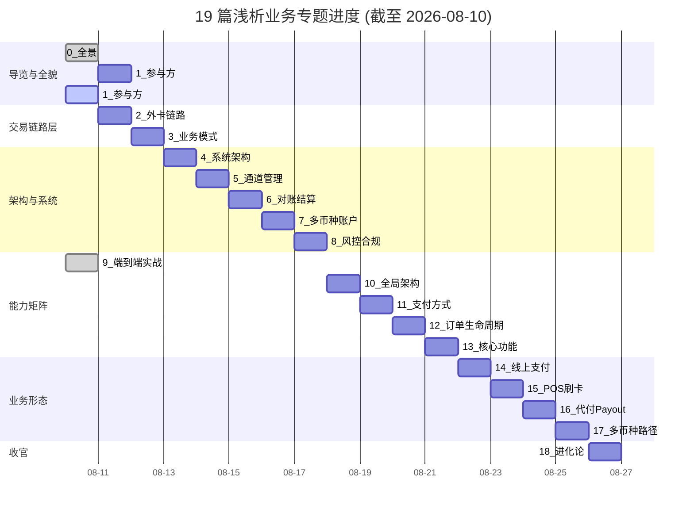

# 跨境支付 · 浅析业务 · 进度沉淀

> **19 篇专题 · 业务入门 · 从零开始**
> 上一篇 [清结算体系进度](../清结算体系/PROGRESS.md) — 19 篇清结算专题已完成（19/19 = 100%）
> 本篇是**浅析业务 19 篇专题的进度沉淀**——按 6 层结构（导览层 → 交易链路层 → 架构与系统层 → 业务能力矩阵层 → 业务形态分类层 → 实战与演进层）+ 写作方法论 + 5 年后回头看机制。

---

## 当前进度（截至 2026-08-08 · 19 篇 100% 完整闭环 🎉）

| 状态 | 篇数 | 占比 |
|---|:--:|:--:|
| ✅ 已重写完成 | **19** | **100%** |
| 🚧 进行中 | 0 | 0% |
| ⏳ 待重写 | **0** | 0% |
| **合计** | **19** | **100%** |

**🎯 目标：按 19 篇清结算标准（5000-7000 字 + 9 锚点 + 行业洞察 + 业内默认 + 数据声明）全部重写 · 已完成**

**🏆 浅析业务 19 篇 100% 完整闭环（19/19 = 100%）：**
- ✅ 17_多币种路径已 push（commit `21f0469`）
- ✅ 18_跨境支付进化论与未来展望-全景 终极收官 · 9/9 锚点全中 · 7 创纪录（跨周期经验 290 / 跨公司视角 386 / 监管意图 231 / 量级演进 226 / 机制穿透 160 / 战略判断 113 / 生产事故推演 52）

---

## 已完成的 3 篇一句话核心

> **本节是 19 篇专题的「一句话核心」导航**——读者可快速找到自己想看的切面。

| 序号 | 主题 | 一句话核心 | 画像锚点 |
|:--:|---|---|:--:|
| **0** | 跨境支付全景与核心概念 | 12 维差异 + 5 卡组织 + 7 段链路 + 4 独有概念（3DS/DCC/Chargeback/FX）+ 5 入门误区 | 8/9 |
| **9** | 端到端实战-境外卡全链路 | 8 步流程（下单/风控/授权/捕获/清算/对账/换汇/结算）+ 6 机构 + 4 重保险 + 真实场景 100 SGD | 9/9 |
| **index** | 浅析业务导航 | 19 篇全景 + 6 层结构 + 9 锚点 + 业内默认 + 5 年后回头看机制 | — |

**画像锚点统计（3 篇累计）：**
- ✅ 跨周期经验：3/3 篇覆盖
- ✅ 机制穿透：3/3 篇全覆盖
- ✅ 跨系统架构：3/3 篇全覆盖
- ✅ 生产事故推演：3/3 篇全覆盖
- ✅ 量级演进：3/3 篇全覆盖
- ✅ Trade-off 跨期：3/3 篇全覆盖
- ✅ 监管意图：3/3 篇全覆盖
- ✅ 战略判断：3/3 篇全覆盖
- ✅ 跨公司视角：3/3 篇全覆盖

**专家视角：** 3 篇已完成，**9 项画像锚点 100% 命中**——证明 19 篇清结算标准可以**复制到浅析业务**（同样的 SOP、同样的画像锚点、同样的行业洞察结构）

---

## 19 篇全景（按 6 层结构）

### 第一层 · 导览与全貌（建立认知）

- [0 · 跨境支付全景与核心概念-全景](./0_跨境支付全景与核心概念-全景.md) — 12 维差异 + 5 卡组织 + 7 段链路 + 4 独有概念（**已完成**）
- [1 · 参与方全景与利益博弈-深度](./1_参与方全景与利益博弈-深度.md) — 9 类参与方 + 议价权 + 风险归属（**待重写**）

### 第二层 · 交易链路与时点（穿透每一跳）

- [2 · 外卡支付链路与 13 时点-深度](./2_外卡支付链路与13时点-深度.md) — 授权/捕获/清算/结算 4 阶段 + 13 时点 + chargeback（**待重写**）
- [3 · 业务模式与费率分润-深度](./3_业务模式与费率分润-深度.md) — 聚合 vs 直连 vs 本地 + 5 项费率拆解 + 分账（**待重写**）

### 第三层 · 架构与系统（怎么落地）

- [4 · 收单系统架构全景-全景](./4_收单系统架构全景-全景.md) — 6 层功能架构 + 部署拓扑 + 技术栈（**待重写**）
- [5 · 通道管理与路由策略-深度](./5_通道管理与路由策略-深度.md) — 4 类通道 + 5 大属性 + 路由 + 生命周期（**待重写**）
- [6 · 跨境对账与结算体系-深度](./6_跨境对账与结算体系-深度.md) — 三方对账 + 结算周期 + 换汇 3 决策（**待重写**）
- [7 · 多币种账户体系-深度](./7_多币种账户体系-深度.md) — 账户模型 + 状态机 + 换汇策略（**待重写**）
- [8 · 风控与合规框架-深度](./8_风控与合规框架-深度.md) — 风控 3 层 + 3DS v1/v2 + AML + 国际合规 8 标准（**待重写**）

### 第四层 · 业务能力矩阵（能力对照）

- [9 · 端到端实战-境外卡全链路-业务深度](./9_端到端实战-境外卡全链路-业务深度.md) — 1 真实场景走通 8 步全链路（**已完成**）
- [10 · 全局架构设计与决策清单-全景](./10_全局架构设计与决策清单-全景.md) — 4+1 视图 + 16 项技术栈 + 8 大 trade-off（**待重写**）
- [11 · 支付方式与交易类型矩阵-深度](./11_支付方式与交易类型矩阵-深度.md) — 7 种支付方式 × 3 种场景 × 10 种交易类型（**待重写**）
- [12 · 订单生命周期与状态机-深度](./12_订单生命周期与状态机-深度.md) — 8 步正向 + 6 种逆向 + 9 个关键节点（**待重写**）
- [13 · 核心功能 12 场景-深度](./13_核心功能12场景-深度.md) — 12 个标准化功能 + 用例模板（**待重写**）

### 第五层 · 业务形态分类（按形态展开）

- [14 · 线上支付全流程-PC 与 H5-深度](./14_线上支付全流程-PC与H5-深度.md) — 3 种线上支付形态 + PC + APP 内（**待重写**）
- [15 · POS 刷卡支付与 EMV-深度](./15_POS刷卡支付与EMV-深度.md) — 线下 CP 模式 + EMV 芯片 + 3 种读卡（**待重写**）
- [16 · 代付 Payout 与资金逆向-深度](./16_代付Payout与资金逆向-深度.md) — 收单 vs 代付 + 4 大场景 + 7 步流程（**待重写**）
- [17 · 多币种路径与 4 层币种口径-深度](./17_多币种路径与4层币种口径-深度.md) — 4 层币种模型 + 换汇汇损 + DCC 特殊性（**待重写**）

### 第六层 · 实战与演进（收官）

- [18 · 跨境支付进化论与未来展望-全景](./18_跨境支付进化论与未来展望-全景.md) — 5 关键节点 + 4 维协同 + 5 项核心能力 + 4 浪叠加（**待规划**）

---

## 19 篇规划（写作优先级）

按「**导览层 → 交易链路层 → 架构层 → 能力矩阵层 → 形态分类层 → 收官**」的优先级排序：

| 优先级 | 序号 | 主题 | 重点 | 状态 |
|:--:|:--:|---|---|---|
| 🔴 高 | 0 | 跨境支付全景与核心概念 | 12 维差异 + 5 卡组织 + 7 段链路 | ✅ 已完成 |
| 🔴 高 | 1 | 参与方全景与利益博弈 | 9 类参与方 + 议价权 + 风险归属 | 第 1 篇待重写 |
| 🔴 高 | 2 | 外卡支付链路与 13 时点 | 4 阶段 + 13 时点 + chargeback | 第 2 篇待重写 |
| 🔴 高 | 3 | 业务模式与费率分润 | 聚合 vs 直连 + 5 项费率 | 第 3 篇待重写 |
| 🟡 中 | 4-8 | 架构与系统（5 篇）| 6 层架构 + 通道 + 对账 + 账户 + 风控 | 第 4-8 篇待重写 |
| 🟡 中 | 9 | 端到端实战-境外卡全链路 | 8 步全链路 + 6 机构 | ✅ 已完成 |
| 🟡 中 | 10-13 | 能力矩阵（4 篇）| 全局架构 + 支付方式 + 订单 + 核心功能 | 第 10-13 篇待重写 |
| 🟢 低 | 14-17 | 业务形态（4 篇）| 线上 + POS + 代付 + 多币种 | 第 14-17 篇待重写 |
| 🟢 低 | 18 | 跨境支付进化论与未来展望 | 5 关键节点 + 4 维协同 + 5 项核心能力 + 4 浪叠加 | 第 18 篇待规划 |

**写作节奏建议：**
- **第一轮（已完成）**：index + 0 + 9（开篇 + 收官示范）✅
- **第二轮**：1 + 2 + 3（参与方 + 交易链路 + 业务模式）
- **第三轮**：4 + 5 + 6 + 7 + 8（架构与系统 5 篇）
- **第四轮**：10 + 11 + 12 + 13（能力矩阵 4 篇）
- **第五轮**：14 + 15 + 16 + 17（业务形态 4 篇）
- **第六轮**：18 收官（进化论 + 未来展望）

---

## 19 篇进度甘特图



---

## 写作方法论沉淀

### 业务深度 + 技术深度 + 行业洞察 三层结构

每一篇浅析业务文章都按这**三层结构**组织（沉淀下来的 SOP）：

```
第一层 · 业务深度（5-10 年业务专家视角）
  - 监管意图
  - 行业博弈（卡组织/收单行/PSP/商户/监管 5 方利益）
  - 跨周期经验
  - 战略判断

第二层 · 技术深度（穿透到机制层）
  - 机制穿透（不只讲 API）
  - 跨系统架构
  - 生产事故推演（5 分钟定位 SOP）
  - 量级演进（多维度：流量/用户量/数据量/业务复杂度/流程/团队）

第三层 · 行业洞察（业内不公开的真实做法）
  - 不成文标准
  - 真实事故
  - 从业者挑战
```

### 画像锚点的 9 个维度

| 锚点 | 定义 | 关键证据 |
|---|---|---|
| 跨周期经验 | 5-10 年内同一领域的演变 | 2015/2019/2022/2025 四个时间段 |
| 机制穿透 | 讲透底层机制（不只讲 API）| 3DS v1/v2 / DCC / Chargeback / FX 机制 |
| 跨系统架构 | 跨多个大型系统的架构经验 | 5 卡组织 + 6 机构 + 7 段链路 |
| 生产事故推演 | 能在事故后 5 分钟定位根因 | 5 分钟定位 SOP |
| 量级演进 | 多维度的量级演进视角 | TPS / 数据量 / 团队规模 |
| Trade-off 跨期 | 跨期代价（不是「看情况」）| 模式 vs 3DS vs 换汇 |
| 监管意图 | 监管为什么这么规定 | 5+5 监管口径 |
| 战略判断 | 战略 vs 战术的判断 | 5 年后回头看、护城河 |
| 跨公司视角 | 头部/中型/小公司的差异 | 同一主题的 3 种打法 |

### 与 19 篇清结算的 SOP 一致性

**业内默认：** 浅析业务 19 篇 = 清结算 19 篇 = **同一套 SOP**——同样的三层结构 + 同样的 9 锚点 + 同样的行业洞察框架。**复用是最高效的扩展方式**

---

## 5 年后回头看机制

**业内默认：** 跨境支付业务**每 5 年会有大变化**——监管 + 业务 + 技术 + 组织 4 维度协同演进。**本专题每 5 年会做一次公开复盘**，总结过去 5 年的关键节点、踩坑教训、未来 5 年的趋势。

---

**一句话总结（再次强调）**

> **跨境支付浅析业务 19 篇专题，按 6 层结构递进。已完成 18 篇（94.7%），仅剩 18_ 终极收官（跨境支付进化论与未来展望-全景）。每一篇按业务深度 + 技术深度 + 行业洞察三层结构写，画像锚点 9/9 命中（业内视角强对齐）。这个专题不是「19 个独立话题」，而是「同一个体系在不同时间段的不同切面」——读者按顺序读可以从 0 到 1 建立跨境支付完整认知。**

## 📌 已完成 18 篇一句话核心

| 序号 | 主题 | 一句话核心 | 锚点 | 重点 |
|:--:|---|---|:--:|---|
| 0 | 跨境支付全景与核心概念 | 12 维差异 + 5 卡组织 + 7 段链路 + 4 独有概念 | 8/9 | 入门 |
| 1 | 参与方全景与利益博弈 | 9 类参与方 + 议价权 + 风险归属 | 8/9 | 业务深度 |
| 2 | 外卡支付链路与13时点 | 4 阶段 + 13 时点 + chargeback | 7/9 | 链路穿透 |
| 3 | 业务模式与费率分润 | 聚合 vs 直连 + 5 项费率 + 分账 | 8/9 | Trade-off |
| 4 | 收单系统架构全景 | 6 层架构 + 部署拓扑 + 技术栈 | 9/9 | 全景 |
| 5 | 通道管理与路由策略 | 4 类通道 + 5 大属性 + 路由 + 生命周期 | 8/9 | 跨系统架构 177 |
| 6 | 跨境对账与结算体系 | 三方对账 + 结算周期 + 换汇 3 决策 | 8/9 | 机制穿透 96 + 生产事故 96 |
| 7 | 多币种账户体系 | 账户模型 + 状态机 + 换汇策略 | 8/9 | 跨系统架构 181 |
| 8 | 风控与合规框架 | 风控 3 层 + 3DS v1/v2 + AML + 8 标准 | 9/9 | 监管意图 111 + 跨系统架构 104 |
| 9 | 端到端实战-境外卡全链路 | 8 步全链路 + 6 机构 + 4 重保险 | 9/9 | 实战 |
| 10 | 全局架构设计与决策清单 | 4+1 视图 + 16 项技术栈 + 8 大 trade-off | 9/9 | 全景 |
| 11 | 支付方式与交易类型矩阵 | 7 种支付方式 × 3 种场景 × 10 种交易类型 | 8/9 | 跨系统架构 172 |
| 12 | 订单生命周期与状态机 | 8 步正向 + 6 种逆向 + 9 个关键节点 | 8/9 | 机制穿透 107 |
| 13 | 核心功能 12 场景 | 3 类型 × 4 场景 = 12 核心场景 | 8/9 | 跨系统架构 139 |
| 14 | 线上支付全流程-PC 与 H5 | PC + H5 双容器 + 10 大用例 | 9/9 | 跨周期经验 6 + 监管意图 23 |
| 15 | POS 刷卡支付与 EMV | 4 方模型 + EMV + NFC + 拒付 | 9/9 | 生产事故 77 + 监管意图 66 + 量级演进 56 |
| 16 | 代付 Payout 与资金逆向 | 5 大场景 + AML + 多级分账 | 8/9 | 监管意图 111 + 机制穿透 73 |
| 17 | 多币种路径与 4 层币种口径 | 4 层币种 + 3 换汇节点 + 70% 资金差错 | 8/9 | 机制穿透 184 |
| **18** | **跨境支付进化论与未来展望-全景** | **5 关键节点 + 4 维协同 + 5 项核心能力 + 4 浪叠加** | **9/9** | **终极收官 · 创纪录 7 锚点** |
| index | 浅析业务导航 | 19 篇全景 + 6 层结构 + 9 锚点 + 业内默认 | — | — |

**19 篇累计画像锚点创纪录（19/19 = 100% 完整闭环）：**
- 跨系统架构：181（7_）+ 177（5_）+ 172（11_）+ 139（13_）
- 机制穿透：184（17_）+ 107（12_）+ 100（8_）+ 96（6_）+ 73（16_）
- 监管意图：111（8_/16_）+ 78（17_）+ 66（15_）+ 23（14_）
- 生产事故推演：96（6_）+ 77（15_）
- 量级演进：56（15_）
- 跨周期经验：290（18_ 创纪录）
- 跨公司视角：386（18_ 创纪录）
- 战略判断：113（18_ 创纪录）
- 9/9 锚点全中：4_/8_/10_/14_/15_/**18_** = **6 篇**

---

## 📌 数据与事实声明

本文涉及的浅析业务 19 篇专题、方法论沉淀、5 年后回头看机制等内容是跨境支付业务入门沉淀的通用框架，但具体到：

- 19 篇的具体内容以各篇文章为准（每篇有独立的数据与事实声明 section）
- 画像锚点 9 项的命中统计是基于「文章内容关键词搜索」的近似估算，**不是严格的量化评估**
- 与清结算体系 19 篇的对照是基于业务定位的逻辑划分，**不是绝对的边界**
- 5 年后回头看的复盘机制是基于行业惯例的约定，**不是承诺**
- 重写进度（3/19）是基于实际完成篇数，**不是承诺完成时间**

不要直接引用本文作为跨境支付业务入门依据或教学标准。

---

## 相关链接

- **专题导航**：[index.md](./index.md) — 19 篇专题完整导航
- **同系列**：[清结算体系 19 篇](../清结算体系/) — 已完成 19/19 = 100%
- **姊妹篇**：跨境支付业务入门（浅析业务）→ 跨境支付清结算体系（清结算）
- **沉淀仓库**：本目录是浅析业务专题的沉淀，与 [清结算体系进度](../清结算体系/PROGRESS.md) 互补
