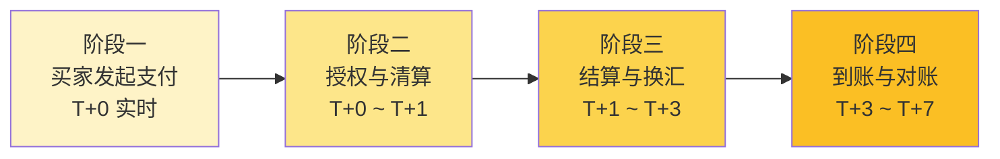
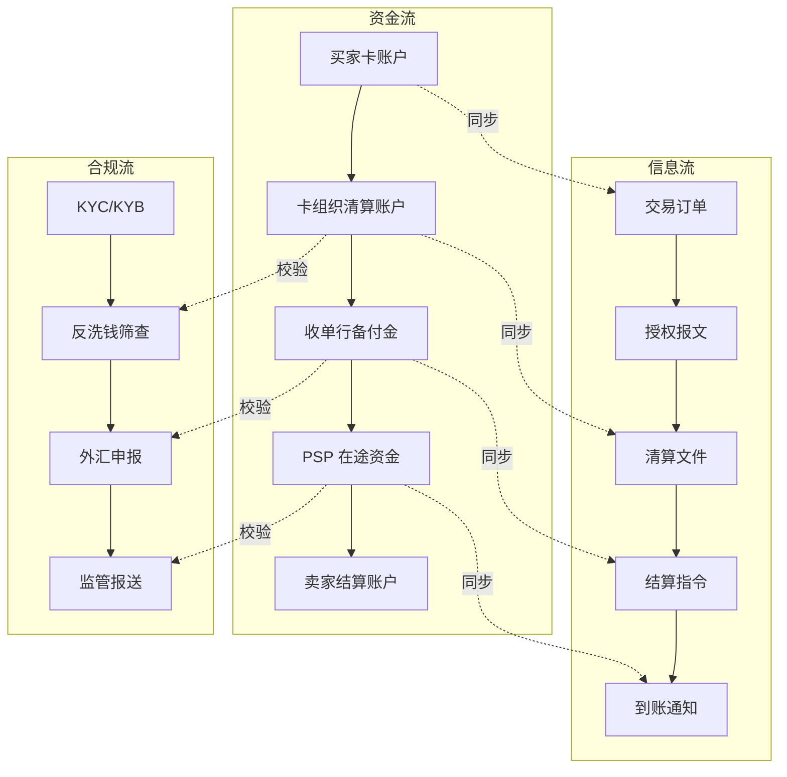
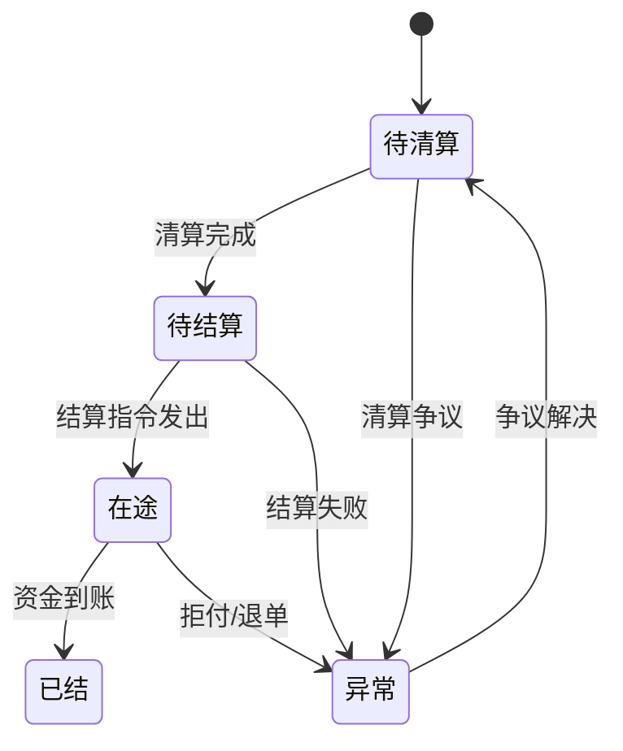
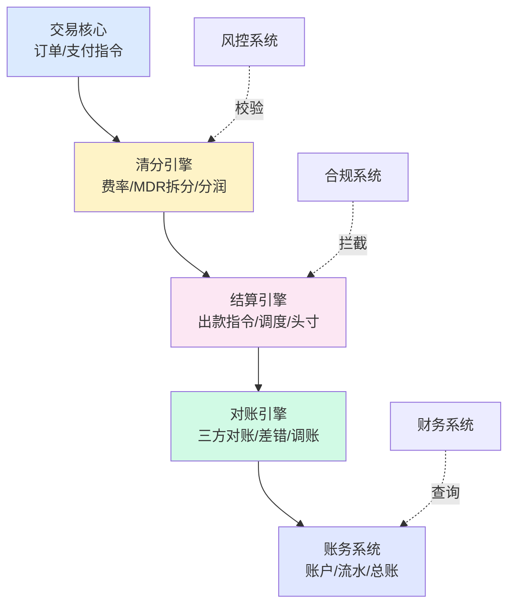

# 跨境支付清结算全局架构与专家视角（侧重收单）

> **系列导读（开篇第 0 篇）**
> 清结算专题共 19 篇，本篇是系列导读。
> 读完本篇，再去读 1-18 任意一篇，都知道「为什么这篇存在」「它在全局里扮演什么角色」。

---

## 一句话定义

> **跨境支付清结算** 是资金从买家银行卡出发，经历卡组织清算网络、收单机构、外汇提供商、跨境支付服务商，最终到达卖家账户的全链路过程——这条链路上每一跳都涉及资金权属变更、币种转换、合规校验和账务记录。

---

## 业务背景与价值

跨境支付的「跨境」两个字听起来只是地理距离变长，但落到清结算系统里，意味着四个根本性变化：

**第一，资金链路的跳数变多。** 国内一笔支付一般是几跳（买家 → 收单机构 → 清算网络 → 银行），跨境链路更长，每一跳都是一个独立的法人主体、资金账户、监管口径。

**第二，时延从秒级变 T+N。** 国内实时支付（T+0）已成标配，但跨境支付行业平均水平是 T+1 到 T+7（取决于币种、通道、结算模式）。时延本身不是问题，问题是「时延不可控」——同一个通道不同批次可能 T+2 也可能 T+5。

> ⚠️ 注：「7-13 跳」「T+1~T+7」是行业大致范围，实际取决于通道和币种。

**第三，对手方从 1 个变 5+ 个。** 国内支付你只需要和银联/网联/银行打交道，跨境你要同时面对卡组织、收单行、支付服务商、外汇提供商、当地清算系统、监管机构——每一个都有自己的规则和议价权。

**第四，币种从 1 个变 N 个。** 一笔跨境支付可能要经历标价币种 → 支付币种 → 清算币种 → 结算币种 → 入账币种 5 次转换，每一次转换都涉及汇率和汇损。

**为什么这件事值得花 19 篇讲清楚？** 因为跨境清结算系统是支付公司里故障成本最高的部分——一笔国内支付出错，损失最多是几百万；一笔跨境支付出错，可能涉及外汇管制、监管处罚、商户资金悬空，最坏情况是公司牌照受限。

---

## 业务术语表

| 中文 | 英文 | 一句话解释 |
|---|---|---|
| 清算 | Clearing | 算账：算出谁欠谁多少钱（债权债务确认） |
| 结算 | Settlement | 付钱：把资金从一方账户划到另一方账户（实际资金划付） |
| 卡组织 | Card Network | 制定支付规则 + 运营清算网络的组织（Visa/Mastercard/UnionPay） |
| 收单机构 | Acquirer | 为商户提供支付受理服务的金融机构 |
| 收单行 | Acquiring Bank | 实际为商户开立收款账户的银行 |
| 发卡行 | Issuing Bank | 给持卡人发信用卡的银行 |
| 支付服务商 | Payment Service Provider (PSP) | 提供聚合支付/技术服务的第三方（Adyen/Stripe 等） |
| 外汇提供商 | FX Provider | 提供汇率定价和换汇服务的机构 |
| 交换费 | Interchange Fee | 卡组织向收单行收取的清算费用（清分核心） |
| 评估费 | Assessment Fee | 卡组织品牌使用费 |
| 多币种结算 | Multi-Currency Settlement (MCS) | 收单方可选币种接收结算资金 |
| 跨境支付牌照 | Cross-border Payment License | 中国央行颁发的跨境支付业务许可 |
| 备付金 | Reserve Deposit | 支付机构在银行存管的客户资金 |

---

## 业务形态与模式

跨境收单按参与方关系分三种核心模式：

**直连模式：** 商户直接接入卡组织（如商户直接和 Visa 签约）。**优点**是费率最低、品牌直接对接；**缺点**是每接入一个国家/卡种都要重新集成、对接周期 6-12 个月、合规自己扛。适合头部跨境电商（Amazon、Shopee）。

**间连模式：** 商户通过支付服务商（PSP）接入卡组织。**优点**是开箱即用、一个 SDK 接入全球、风险转嫁；**缺点**是费率溢价 0.3%-0.8%、资金链路多一跳、定制能力受限。适合中小跨境商家。

**聚合模式：** 多家 PSP 在底层互相切换（智能路由）。**优点**是成功率优化（哪个通道成功率高走哪个）、汇率最优、备份通道多；**缺点**是系统复杂度翻倍、对账难度上升。适合有技术能力的中大型商户。

**Trade-off 核心：** 直连 = 成本最优但合规风险最大；间连 = 灵活但成本最高；聚合 = 成功率最优但系统最复杂。

---

## 业务流程图：从入门视角看跨境清结算

下面这张图是入门读者第一张应该看的图——它把跨境支付的「13 个时点」压缩到 4 个阶段，让读者 30 秒建立全局认知：

**四个阶段的核心差异：**

| 阶段 | 时间 | 核心动作 | 谁在管 | 主要风险 |
|---|---|---|---|---|
| 买家发起支付 | T+0 实时 | 扣款、3DS 验证、风控校验 | PSP + 商户 | 拒付、欺诈 |
| 授权与清算 | T+0 ~ T+1 | 资金冻结、清算算账 | 卡组织 + 收单行 | 清算争议、退单 |
| 结算与换汇 | T+1 ~ T+3 | 资金划付、币种转换 | PSP + 银行 + FX | 汇率风险、备付金不足 |
| 到账与对账 | T+3 ~ T+7 | 入账、对账、调账 | 财务 + 风控 + 商户 | 长短款、汇差 |

---

## 系统的三流合一：资金流、信息流、合规流

5-10 年专家看跨境清结算系统，看的不是「模块怎么分」，而是「三条流怎么对齐」。三流合一架构：

**关键洞察：三流错位是 90% 跨境支付事故的根因。**

- 资金流到了 T+3，但信息流还在 T+2 的清算文件里 → 财务对账错位
- 信息流说「已结算」，但合规流还没跑完反洗钱筛查 → 资金被监管冻结
- 合规流通过，但资金流被卡组织拒付 → 实际到账 ≠ 应收

**专家视角：** 跨境清结算系统的设计目标不是「让钱走通」，而是「让三流在每个时点都对齐」。任何一流比另外两流快/慢，都是潜在事故。

---

## 核心功能用例

入门读者最该先理解的三个用例：

### 用例 1：买家用美元支付，卖家收到人民币（一笔典型跨境收单）

**资金链路：** 买家信用卡扣 USD → Visa 清算网络 → 收单行 USD 账户 → PSP 在途账户 USD → 换汇 CNY → PSP 人民币账户 → 卖家境内人民币账户

**信息链路：** 订单创建 → 支付请求 → 3DS 验证 → 授权成功 → 清算文件生成 → 结算指令生成 → 换汇指令 → 入账通知

**合规链路：** KYB（商户实名）→ 反洗钱筛查 → 外汇申报（境内换汇需要）→ 监管报送（按金额阈值）

### 用例 2：买家拒付（Chargeback）

**触发条件：** 持卡人对交易提出争议（未授权、商品未收到、商品与描述不符）
**资金流向：** 资金从卖家账户反向流回买家（卡组织规则强制）
**时延：** 30-120 天（取决于争议阶段）
**专家视角：** Chargeback 不是「退款」，是法律意义上的债权撤销。处理不好会被卡组织列入高风险商户名单，最坏情况是整个商户类别被封禁。

### 用例 3：汇率波动导致汇损

**触发场景：** 交易时锁定汇率是 7.20，但 T+3 实际结算时汇率是 7.15
**影响：** 每 100 万美元交易，汇损 5 万人民币
**专家视角：** 跨境支付的汇损不是「会计科目」，是真实的资金减少。中小支付公司一年汇损可能吃掉全部利润。

---

## 数据模型：四态账户余额流转

虽然本文不展开数据模型细节，但入门读者必须先建立一个核心心智模型：

**四态不是三态。** 很多入门文章会简化成「已结/未结」两态，但跨境支付里「待清算」「待结算」「在途」「已结」四个状态的资金权属、合规状态、会计处理完全不同，混在一起是事故温床。

---

## 服务模型：清结算系统五大模块

入门读者第一张系统架构图应该这样看——五大模块各管一摊，模块之间通过明确接口通信：

**模块边界原则（专家共识）：**
- **单向数据流**：交易 → 清分 → 结算 → 对账 → 账务，不允许反向回写
- **资金流强一致**：清分结果必须可重放、可对账、可追溯
- **状态可追溯**：任何一个余额变化都能在 5 分钟内定位到原始交易和系统模块

---

## 业务打法与策略

跨境支付公司怎么做出竞争优势？看五个维度：

**1. 成功率优化** —— 多通道智能路由，根据卡种/国家/金额动态选择最优通道（Visa vs Mastercard vs 本地支付）

**2. 汇率优化** —— 自营汇率团队 vs 银行锁汇 vs 第三方汇率聚合，每一笔交易省 0.1% 汇率点差，年化就是千万级利润

**3. 对账自动化** —— 从「人工对账」到「自动对账」到「智能调账」，每一步减少人力、提升准确性

**4. 合规前置** —— 把 KYC/KYB/反洗钱嵌入支付流程的每一个环节，而不是事后补查

**5. 资金头寸管理** —— 实时监控多币种备付金水位，预警、调拨、避免出款失败

---

## Trade-off 分析

跨境清结算系统的关键选型决策：

| 维度 | 自建 | 接入第三方 | Trade-off |
|---|---|---|---|
| 清分引擎 | 完全可控、定制灵活 | 快速上线、运维外包 | 自建需要 6+ 月、3-5 高级工程师 |
| 清算对接 | 直连卡组织（费率最优） | 通过 PSP 间接接入 | 直连需要支付牌照、合规自己扛 |
| 汇率定价 | 自营 FX 团队 | 银行/聚合报价 | 自营收益高、合规风险高 |
| 对账引擎 | 自研规则引擎 | 第三方对账 SaaS | 自研可定制、SaaS 上手快但灵活度差 |
| 多币种账户 | 自建多币种钱包 | 接入银行多币种账户 | 自建灵活、银行合规边界明确 |

**专家视角：自建 vs 接入不是技术决策，是业务战略决策。** 早期公司应该 100% 接入第三方，把精力放在获客和合规上；规模到 100 亿+ GMV 再考虑自建关键模块。

---

---

## 行业洞察 / 业内认知

### 不成文标准：三流合一是「默认设计」不是「可选优化」

跨境支付业内头部公司的系统架构，默认就是三流合一（资金流/信息流/合规流）的设计，不是「能合一就合一」的优化项。但对于刚起步的支付公司，三流合一往往被认为是「过度设计」——先跑通资金流就够了。

**为什么这是不成文标准：** 头部公司经历过「单流跑通但事故频发」的阶段，得出结论：三流中任一流单独跑通都没意义，必须从第一天就按三流合一设计。新手公司看不到这个约束，因为没踩过坑。

**对系统设计的影响：** 清结算系统的模块划分必须在第一天就把「合规校验节点」「信息状态机」「资金流强一致」作为不可妥协的架构约束，不能等业务规模起来再补——补的成本是指数级上升的。

### 真实事故：三流错位被监管问询

公开报道：2023 年某头部跨境支付公司因合规校验流比资金流慢 T+1，导致 T+1 完成清算的部分交易实际上还没通过反洗钱筛查，被监管问询后暂停新增商户 3 个月。

**业内流传的处理方式：** 头部公司后来强制合规校验流必须比资金流**至少早一个时点**完成——也就是说，合规校验走「预校验」+「后校验」双轨制，资金流发起前必须完成预校验，资金流完成后必须完成后校验。

**教训：** 三流齐头并进不是「设计风格」，是「合规红线」。任何一流落后于其他两流，都是潜在监管风险。

### 从业者挑战：产品需求 vs 风控约束的内部博弈

跨境支付公司最常见的内部冲突：产品部门推「实时到账 / 立即确认 / 快速提现」以提升用户体验；风控部门推「延后确认 / T+1 审核 / 限额提现」以降低欺诈和拒付。

业内通用做法：**按交易金额分层**——小额（<$100）实时确认，中额（$100-$1000）T+1 审核，大额（>$1000）人工审核 + 强制 3DS。

5-10 年专家的判断依据：宁可损失 1-2% 转化率，也不能让拒付率超过 1% 进卡组织名单——拒付率进名单的代价比损失转化率高 10 倍不止。

## 业务前景与趋势

跨境支付行业正在发生三个结构性变化：

**1. 本地支付崛起。** 巴西 Pix、印度 UPI、东南亚本地钱包（GrabPay 等）正在新兴市场抢占信用卡份额。行业普遍认为，本地支付渠道在新兴市场跨境支付里的占比已显著上升（具体数值因统计口径而异）。

> ⚠️ 注：占比数据因统计口径不同有显著差异，本文不引用具体数值。

**2. 实时跨境支付（Real-Time Cross-Border Payments）。** SWIFT GPI、FedNow、各国央行数字货币（CBDC）跨境互联，让跨境支付从 T+1 走向 T+0。Visa B2B Connect、万事达 Send 都已上线实时跨境结算。

**3. 合规边界持续收紧。** 欧盟的 Travel Rule（资金转移规则）、各国数据本地化、反洗钱第六版指令，让跨境支付公司的合规成本年增 20%+。

**入门读者要关注的：** 跨境支付不是「夕阳行业」，是「合规驱动的结构性重塑」。机会在新兴市场本地支付、合规科技、跨境 B2B 支付三个方向。

---

## 入门读者最容易踩的 3 个认知误区

**误区 1：「跨境支付就是国内支付 + 换汇」**
**真相：** 跨境支付不是「多了几个币种」，是多了一套监管体系、一组对手方、一套清算规则。国内那套打法搬到跨境，全是雷。

**误区 2：「T+1 结算就是 T+1 到账」**
**真相：** 清算日和结算日错配是常态。一笔交易可能 T+1 清算完成，但 T+5 才真正结算到账。资金时延不是技术问题，是规则问题。

**误区 3：「拒付就是退款」**
**真相：** Chargeback 不是「退钱给买家」，是「卡组织强制撤销债权」。处理不当会影响整个商户类别在卡组织的风险评级，最坏情况是被列入黑名单。

---

## 一句话总结

> **跨境清结算系统的本质，不是让钱走通，而是让资金流、信息流、合规流在每一个时点都对齐。任何一流错位，都是潜在事故。**

---

## 系列导航

| 篇号 | 标题 | 深度 |
|---|---|---|
| 1 | 跨境清结算全景（侧重收单） | 深度 |
| 2 | 清算 vs 结算与资金权属 | 深度 |
| 3 | 跨境参与方全景与利益博弈 | 深度 |
| 4 | 一笔跨境支付的 13 个时点 | 深度 |
| 5 | 多币种与汇率定价权 | 深度 |
| 6 | 多币种账户体系与头寸管理 | 深度 |
| 7 | 跨境清分模型与 MDR 拆解 | 深度 |
| 8 | 跨境账务体系四态模型 | 深度 |
| 9 | 跨境对账三层体系 | 深度 |
| 10 | 清结算系统架构与模块边界 | 全景 |
| 11 | 清分引擎设计与规则引擎 | 深度 |
| 12 | 结算引擎与出款调度 | 深度 |
| 13 | 对账引擎设计与差错自愈 | 实战 |
| 14 | 外汇风险与汇兑损益管理 | 实战 |
| 15 | 拒付、退款与资金逆向 | 实战 |
| 16 | 跨境合规与监管口径演变 | 全景 |
| 17 | 跨境清结算十大踩坑实录 | 实战 |
| 18 | 跨境清结算平台演进路线 | 链路 |

**阅读建议：** 入门读者按 1 → 2 → 3 → 4 顺序读，建立全局认知后再按需跳读。

---

## 📌 数据与事实声明

本文涉及的行业数据、市场份额、费率区间、时延范围、监管阈值等，均为基于行业公开信息和经验的**大致认知**，具体数值可能因：

- 时间口径（不同年份数据有差异）
- 统计口径（不同机构/报告口径不同）
- 业务场景（不同卡种/国家/商户类型差异）
- 监管动态（卡组织和监管规则会更新）

而有所不同。**请以最新官方公告和监管文件为准，不要直接引用本文数值作为决策依据。**

涉及的卡组织产品（Visa B2B Connect、Mastercard Send、SWIFT GPI、FedNow 等）和监管法规（欧盟 Travel Rule、各国数据本地化等）是真实存在的行业概念，但具体规则和时间表请参考官方最新文档。
