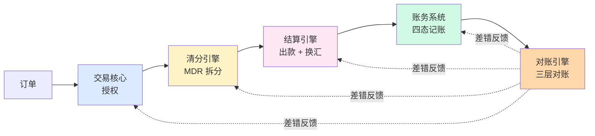
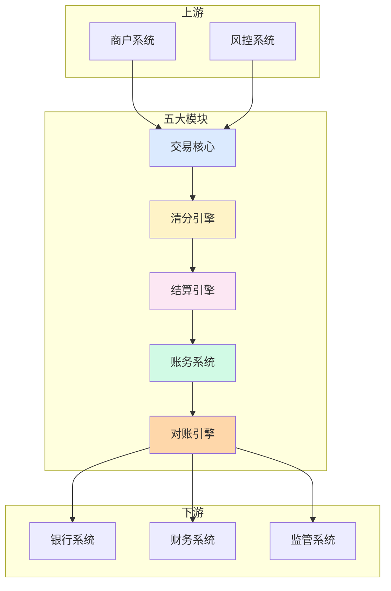

# 清结算系统架构与模块边界（全景）

> **系列第 10 篇 · 全景**
> 上一篇 [9_跨境对账三层体系](./9_跨境对账三层体系-深度.md) 讲了钱怎么对账。本篇进入**第四层 · 架构与系统**——讲清**清结算系统怎么从 0 到 1 落地**——五大模块（**交易核心 / 清分引擎 / 结算引擎 / 对账引擎 / 账务系统**）的边界、数据流、上下游依赖，以及从单体到微服务的演进路径。

---

## 一句话定义

> **清结算系统的架构，核心是「五大模块边界 + 三层数据流 + 演进路径」**。交易核心、清分引擎、结算引擎、对账引擎、账务系统五大模块**单向数据流 + 状态可追溯 + 强一致**，从单体架构演进到微服务架构，遵循「**MVP 阶段 → 成长阶段 → 成熟阶段**」三阶段路径。

---

## 业务背景与价值

### 为什么「系统架构」是清结算的核心难题？

入门读者以为「清结算系统 = 一个数据库 + 一个后端 + 一个前端」。但真实的清结算系统是**五大模块 + 多个上游 + 多个下游 + 多个数据流的复杂系统**：

**五大模块：**
- 交易核心（订单 / 支付指令）
- 清分引擎（MDR 拆分 / 分润）
- 结算引擎（出款 / 换汇）
- 对账引擎（三层对账）
- 账务系统（四态账务）

**多个上游：**
- 商户系统（订单、退款）
- 风控系统（反欺诈、合规校验）
- 通道（卡组织、PSP、FX Provider、银行）

**多个下游：**
- 商户系统（结算通知）
- 财务系统（账单、税务）
- 监管系统（报送）
- 银行系统（资金划付）

**专家视角：** 系统架构的**真实价值**不是「技术选型」，是「**模块边界**」——边界清晰 = 故障隔离 = 可扩展 = 可维护。**业内默认：** 清结算系统架构的关键不是用什么框架，是**模块边界怎么划**

### 过去 5 年的系统架构演变（跨周期视角）

| 时间段 | 主流架构 | 关键事件 |
|---|---|---|
| 2015-2018 | **单体架构期** | 跨境支付公司普遍用单体架构（Spring Boot 单应用） |
| 2019-2021 | **服务化期** | 头部公司开始按模块拆分（清分 / 结算 / 对账 / 账务独立服务） |
| 2022-2024 | **微服务 + 事件驱动期** | 头部公司推微服务架构 + 事件驱动（Kafka / RocketMQ） |
| 2025-至今 | **云原生 + AI 增强期** | K8s 部署 + Service Mesh + AI 风控 |

**关键洞察：** 5 年前清结算系统是「**单体 + 数据库**」结构，现在变成「**微服务 + 事件驱动 + 云原生**」结构。**未来 3-5 年** AI 增强（智能对账 / 智能风控 / 智能调账）会成为头部标配

### 监管意图：为什么系统架构要满足监管要求？

监管对系统架构有「底线要求」：

1. **资金流强一致**——交易、清分、结算、账务必须强一致（不允许资金状态不确定）
2. **状态可追溯**——任何资金状态变化能在 5 分钟内定位到原始交易
3. **故障隔离**——单模块故障不能影响整个系统（清分挂了不影响授权）
4. **数据本地化**——境内商户数据必须存储在境内（数据安全法）

**专家视角：** 系统架构不是「**技术选择**」，是**监管硬性要求**。单体架构如果不符合「故障隔离」「可追溯」，就会被监管处罚

---

## 业务术语表

| 中文 | 英文 | 一句话解释 |
|---|---|---|
| 单体架构 | Monolithic | 所有功能在一个应用里（早期主流） |
| 微服务 | Microservice | 按模块拆分成多个独立服务（当前主流） |
| 事件驱动 | Event-Driven | 通过事件（消息）触发后续流程（异步） |
| 强一致 | Strong Consistency | 数据修改立即可见，不允许中间状态 |
| 最终一致 | Eventual Consistency | 数据最终一致，允许中间状态（异步系统） |
| 状态机 | State Machine | 系统状态流转规则（订单状态 / 结算状态） |
| 幂等性 | Idempotency | 同一请求多次执行结果一致（防重放） |
| 单向数据流 | Unidirectional Data Flow | 数据只在一个方向流动（避免循环依赖） |
| 状态可追溯 | State Traceability | 任何状态变化能定位到原始事件 |
| 故障隔离 | Fault Isolation | 单模块故障不影响其他模块 |
| 数据本地化 | Data Localization | 数据必须存储在境内（数据安全法） |
| Saga 模式 | Saga Pattern | 微服务分布式事务解决方案 |

---

## 业务形态与模式：五大模块详解

### 模块 1：交易核心（Transaction Core）

**职责：** 接收商户订单、生成支付指令、调用通道完成授权、维护订单状态

**子模块：**
- 订单管理（订单创建 / 查询 / 撤销）
- 支付指令生成（订单 → 支付指令）
- 通道路由（按规则选通道）
- 状态机管理（待支付 / 支付中 / 已支付 / 已撤销）

**输入：** 商户订单
**输出：** 支付结果 + 交易流水

**关键设计：**
- 状态机严格（不允许跨状态变更）
- 幂等设计（同一订单多次请求结果一致）
- 异步处理（不阻塞主流程）

### 模块 2：清分引擎（Clearing Engine）

**职责：** 按 MDR 拆分规则计算每笔交易的费率、利润、分润

**子模块：**
- 规则引擎（MDR 拆分规则）
- 分润计算（按合同分账）
- 清分记录（每笔清分结果）

**输入：** 已授权交易
**输出：** 清分记录 + 分润结果

**关键设计：**
- 规则可配置（费率灵活调整）
- 计算幂等（同一交易多次计算结果一致）
- 可重放（清分结果可重新计算）

### 模块 3：结算引擎（Settlement Engine）

**职责：** 按清分结果生成结算指令、调用银行完成出款、换汇、入账

**子模块：**
- 结算指令生成（按清分结果）
- 出款调度（按通道 / 优先级 / 金额）
- 换汇调度（FX Provider）
- 入账通知（通知商户）

**输入：** 清分结果
**输出：** 出款记录 + 换汇记录 + 入账通知

**关键设计：**
- 单向数据流（不修改清分结果）
- 幂等设计（同一清分结果多次出款结果一致）
- 失败重试 + 人工介入

### 模块 4：对账引擎（Reconciliation Engine）

**职责：** 三层对账（通道 / 系统 / 银行）+ 差错发现 + 自动调账

**子模块：**
- 通道对账（卡组织 / FX 文件）
- 系统对账（订单 vs 流水 vs 账务）
- 银行对账（银行对账单）
- 差错处理（自动调账 + 人工调账）

**输入：** 三层对账数据
**输出：** 对账结果 + 差错处理

**关键设计：**
- 独立运行（不影响主流程）
- 自动告警（差错 T+1 内发现）
- 半自动调账

### 模块 5：账务系统（Accounting System）

**职责：** 四态账务（待清算 / 待结算 / 在途 / 已结）+ 双向记账（原币 + 本位币）+ 期末调汇

**子模块：**
- 账本管理（4 套独立账本）
- 双向记账（原币 + 本位币）
- 期末调汇（自动调汇）
- 风险准备金计提

**输入：** 清分结果 + 结算结果
**输出：** 账务记录 + 财务报表

**关键设计：**
- 独立账本（4 套不合并）
- 强一致（账务状态变更立即可见）
- 审计可追溯

---

## 业务流程图：五大模块的单向数据流

**关键观察：**
- 数据流**单向**（交易 → 清分 → 结算 → 账务 → 对账）
- 对账**反馈**回前 4 个模块（差错发现后回流）
- 任何模块**不允许反向修改**前序模块的结果

---

## 系统架构：模块边界 + 数据流

**关键设计：**
- 五大模块**单向依赖**（A→B→C→D→E）
- 对账引擎**独立运行**（不阻塞主流程）
- 上游（商户 / 风控）只接入交易核心
- 下游（银行 / 财务 / 监管）只接对账引擎

---

## 服务模型：3 种架构模式对比

### 模式 1：单体架构（Monolithic）

**机制：**
- 所有功能在一个 Spring Boot 应用
- 一个数据库（MySQL / PostgreSQL）
- 一次部署，扩缩容整体进行

**优势：**
- 简单（开发、测试、部署）
- 事务一致（一个数据库）
- 排查问题快（一个应用）

**劣势：**
- 单点故障（应用挂了 = 整个系统挂）
- 扩展性差（不能按模块扩展）
- 维护成本高（代码耦合）
- 团队协作差（多团队改一个代码库）

**适合：** MVP 阶段 / 早期公司

### 模式 2：服务化架构（Service-Based）

**机制：**
- 按模块拆分成 5-10 个独立服务
- 每个服务独立数据库
- 服务间通过 RPC（Dubbo / gRPC）或 HTTP 通信

**优势：**
- 故障隔离（单服务挂不影响整体）
- 独立扩展（按模块扩缩容）
- 团队协作（多团队并行）

**劣势：**
- 分布式事务（需要 Saga 模式）
- 数据一致性挑战
- 运维复杂（多服务部署）

**适合：** 成长阶段 / 中型公司

### 模式 3：微服务 + 事件驱动（Microservice + Event-Driven）

**机制：**
- 按模块拆分成 20-50 个微服务
- 服务间通过事件（Kafka / RocketMQ）异步通信
- Saga 模式解决分布式事务

**优势：**
- 极致扩展（每个服务独立扩展）
- 极致故障隔离（单服务挂不影响）
- 异步处理（不阻塞主流程）

**劣势：**
- 系统复杂度极高
- 调试困难（跨服务追踪）
- 运维成本极高
- 需要成熟团队

**适合：** 成熟阶段 / 头部公司

**专家视角：** **架构不是「越先进越好」**——MVP 阶段用单体反而是**正确选择**（开发快、风险低）。**业内默认：** 早期单体、成长服务化、头部微服务

---

## 核心功能用例

### 用例 1：标准清结算流程

**场景：** 一笔 $100 的跨境支付从订单到入账

**5 大模块协作：**
- 交易核心：订单 → 授权 → 状态「已支付」
- 清分引擎：MDR 拆分 → interchange $1.5 + assessment $0.14 + processor $0.3 + markup $0.36
- 结算引擎：结算指令 → 银行出款 → FX 换汇 → 通知商户
- 账务系统：4 态记账（待清算 → 待结算 → 在途 → 已结）
- 对账引擎：T+1 跑批对账 → 发现差错 → 调账

**时延：** 授权秒级、清算小时级、结算 T+3、已结 T+7

### 用例 2：模块故障隔离

**场景：** 清分引擎挂了，订单还能继续接吗？

**架构要求：**
- 单体架构：❌ 清分挂了 = 整个系统挂
- 服务化架构：✅ 清分挂了不影响交易核心
- 微服务架构：✅ 清分挂了 + 自动降级（用备用清分）

**业内默认：** 头部公司必须做到**模块故障不影响主流程**（授权 / 收款）

### 用例 3：分布式事务（Saga 模式）

**场景：** 结算涉及 5 个步骤（出款、换汇、记账、通知、对账），其中一步失败怎么办？

**传统方案：** 分布式事务（2PC / 3PC）—— 性能差、复杂度高

**现代方案：** Saga 模式——每个步骤有「补偿操作」，失败时回滚

**业内默认：** 头部公司用 Saga 模式 + 事件溯源（Event Sourcing）保证最终一致性

---

## 业务打法与策略：不同公司的架构选择

### 头部公司（年 GMV > 100 亿美元）

**典型做法：**
- **微服务 + 事件驱动**（20-50 个微服务）
- **Kafka / RocketMQ** 异步通信
- **Saga 模式**分布式事务
- **K8s + Service Mesh** 部署
- **AI 增强**（智能对账 / 智能风控）

**业内认知：** 头部公司的架构是**极致微服务 + 云原生**的，能支撑千万级 TPS。**这是 10+ 年技术积累的产物**

### 中型公司（年 GMV 1-100 亿美元）

**典型做法：**
- **服务化架构**（5-10 个服务）
- **Dubbo / gRPC** 同步通信
- **本地事务**（避免分布式事务）
- **虚拟机部署**（不上 K8s）

**业内认知：** 中型公司的架构是「**够用但不极致**」——能服务业务但不能支撑千万 TPS。**演进需要 2-3 年**

### 小公司 / 新进入者（年 GMV < 1 亿美元）

**典型做法：**
- **单体架构**（1 个 Spring Boot 应用）
- **MySQL 单库**
- **1 台服务器部署**

**业内认知：** 小公司的架构是「**MVP 起步**」——能跑业务但风险大（单点故障）。**先跑起来再说**

---

## Trade-off 分析

### 决策 1：单体 vs 服务化 vs 微服务

| 选项 | 优势 | 代价 | 适合谁 |
|---|---|---|---|
| **单体** | 简单、快、事务一致 | 单点故障、扩展性差 | MVP / 早期 |
| **服务化** | 故障隔离、独立扩展 | 分布式事务、运维复杂 | 成长 / 中型 |
| **微服务** | 极致扩展、极致隔离 | 复杂度极高、运维成本 | 成熟 / 头部 |

**专家视角：** 这是**架构战略决策**——不是「用最先进的技术」，是「**用适合当前业务规模的技术**」。**业内默认：** 早期单体（GMV < 1 亿）→ 成长服务化（1-100 亿）→ 头部微服务（100 亿+）

### 决策 2：同步 vs 异步通信

| 选项 | 优势 | 代价 | 适合谁 |
|---|---|---|---|
| **同步（RPC）** | 简单、事务一致 | 性能低、耦合高 | 服务化 |
| **异步（事件）** | 高性能、解耦 | 复杂度高、一致性挑战 | 微服务 |
| **混合** | 平衡 | 系统复杂 | 头部公司 |

**专家视角：** 同步 vs 异步的选择**取决于业务场景**——交易核心适合同步（需要事务一致），对账 / 报表适合异步（性能优先）。**业内默认：** 头部公司用「同步 + 异步混合」架构

### 决策 3：本地事务 vs 分布式事务

| 选项 | 优势 | 代价 | 适合谁 |
|---|---|---|---|
| **本地事务**（单库） | 简单、可靠 | 不能跨服务 | 单体 |
| **分布式事务**（2PC / 3PC） | 强一致 | 性能差、复杂 | 极少用 |
| **Saga 模式** | 高性能、最终一致 | 调试难 | 微服务 |

**专家视角：** 业内默认：**尽量避免分布式事务**——能用本地事务就用本地事务，需要时用 Saga 模式。**2PC / 3PC 已基本被淘汰**

---

## 行业洞察 / 业内认知

### 不成文标准：架构演进的「3 阶段路径」

业内默认的清结算系统架构演进路径：

| 阶段 | GMV 规模 | 架构选择 | 关键指标 |
|---|---|---|---|
| **MVP 阶段** | < 1 亿美元 | 单体 | 单 TPS < 1000 |
| **成长阶段** | 1-100 亿美元 | 服务化 | 单 TPS < 10000 |
| **成熟阶段** | > 100 亿美元 | 微服务 + 事件驱动 | 单 TPS > 10000 |

**关键观察：** 头部公司不是一开始就建微服务——而是**从单体开始，根据业务规模演进**。**业内默认：** 用 YAGNI 原则（You Aren't Gonna Need It）——「不需要的时候不要建」

### 真实事故：单体架构拖垮公司发展

公开报道：2021 年某中型跨境支付公司因单体架构无法支撑业务增长，导致：
- 交易核心挂了 6 小时（影响商户收款）
- 清分性能瓶颈（月清分从 T+1 变成 T+3）
- 团队协作困难（50 个工程师改一个代码库）

**教训：** 单体架构有「**天花板**」——超过 GMV 10 亿美元就必须演进。**业内默认：** 头部公司在 GMV 5-10 亿美元就开始服务化改造，**不要等到撑不住才动**

### 从业者挑战：分布式事务的取舍

跨境支付公司常见的内部挑战：分布式事务的取舍——2PC / 3PC 太重，Saga 太复杂，**业内通用做法**：

- **最终一致优先**——核心业务（资金）强一致，非核心业务（对账 / 报表）最终一致
- **补偿操作**——每个步骤有「反向操作」，失败时回滚
- **幂等设计**——同一操作多次执行结果一致
- **事件溯源**——所有状态变化记录为事件，可重放

**专家视角：** 分布式事务的**真实门槛**不是技术实现，是**业务理解**——必须清楚「**哪些必须强一致 / 哪些可以最终一致**」。**业内默认：** 资金强一致，对账最终一致

---

## 业务前景与趋势

### 未来 3-5 年的 4 个结构性变化

**1. Serverless + Function 化**
传统服务化 → 微服务 → **Function 化**（每个功能是一个独立函数）。**对参与方格局的启示：** 头部公司可能跳过传统微服务，直接上 Function

**2. AI 增强运维**
传统运维（监控 / 告警）→ **AI 增强运维**（异常自动发现 + 自动恢复）。**对参与方格局的启示：** 头部公司运维成本降低 50%+

**3. 跨链清算（区块链）**
传统清结算 → **跨链清算**（不同链之间自动清算）。**对参与方格局的启示：** 卡组织清算网络可能被部分替代

**4. 监管科技（RegTech）嵌入架构**
传统合规 → **RegTech 嵌入架构**（合规检查嵌入每个模块）。**对参与方格局的启示：** 合规成为系统架构的内生能力

---

## 一句话总结

> **清结算系统的架构，核心是「五大模块边界 + 三层数据流 + 演进路径」**。交易核心、清分引擎、结算引擎、对账引擎、账务系统五大模块**单向数据流 + 状态可追溯 + 强一致**，从单体架构（GMV < 1 亿）→ 服务化（1-100 亿）→ 微服务（100 亿+）三阶段演进。架构不是越先进越好，是**适合当前业务规模 + 未来 1-2 年扩展性**的最优解。

---

## 📌 数据与事实声明

本文涉及的五大模块设计、3 种架构模式、Saga 模式等内容是清结算系统架构的通用认知，但具体到：

- 各家支付公司的技术选型（Spring Cloud / Dubbo / Service Mesh 等）以各公司实际架构为准
- 各种中间件（Kafka / RocketMQ / MySQL / PostgreSQL 等）以各公司实际使用为准
- 部署方式（虚拟机 / K8s / Serverless 等）以各公司实际部署为准
- 性能指标（TPS / P99 / 延迟）以各公司实际压测结果为准

不要直接引用本文作为系统设计依据或选型依据。

---

## 下一篇预告

下一篇 [11_清分引擎设计与规则引擎-深度](./11_清分引擎设计与规则引擎-深度.md) 将深入**清分引擎怎么从 0 到 1 实现**——规则引擎（自研 DSL vs Drools vs Aviator）选型、高性能设计（批量 vs 流式）、幂等设计、可重放机制，以及业内头部的真实选型案例。