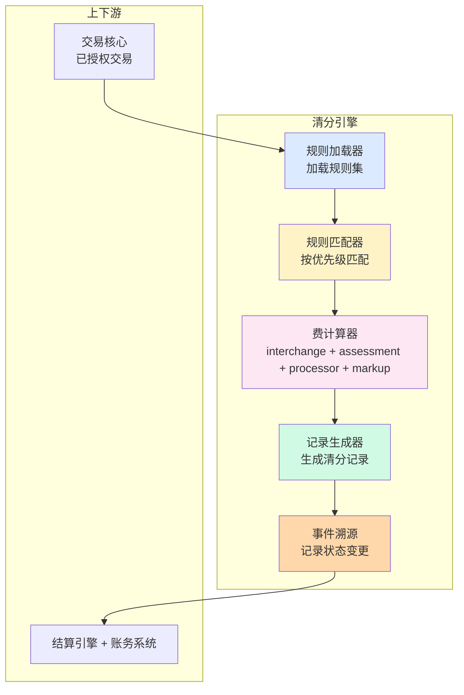

# 清分引擎设计与规则引擎（深度）

> **系列第 11 篇 · 深度**
> 上一篇 [10_清结算系统架构与模块边界](./10_清结算系统架构与模块边界-全景.md) 讲了五大模块边界。本篇深入**清分引擎怎么从 0 到 1 实现**——**规则引擎（自研 DSL vs Drools vs Aviator）选型**、**高性能设计**（批量 vs 流式）、**幂等设计**、**可重放机制**，以及业内头部的真实选型案例。

---

## 一句话定义

> **清分引擎的设计，核心是「规则引擎选型 + 高性能 + 幂等 + 可重放」四件事**。规则引擎三选一（自研 DSL / Drools / Aviator），高性能设计支持批量与流式两种模式，幂等通过「交易 ID + 清分时间 + 清分版本」三重防重，可重放通过事件溯源实现 100% 重现。**业内默认：** 头部公司用「**自研 DSL + 事件溯源**」，中型公司用「**Drools / Aviator + 定时跑批**」。

---

## 业务背景与价值

### 为什么「清分引擎」是核心难题？

入门读者以为「清分 = 计算费率」。但清分引擎的真实复杂度在**规则多变 + 高性能 + 幂等 + 可重放**：

**规则多变：**
- 同一商户不同产品费率不同
- 不同卡组织 interchange 规则不同
- 不同国家监管要求不同（VAT、汇率中间价、起征点）
- 不同时段促销（双 11 / 黑五 / 圣诞）特殊规则
- 不同风险等级商户费率上浮

**业内默认：** 清分规则至少**200+ 条**，每月变更**10+ 条**，全年变更**120+ 条**——**规则引擎必须支持热更新、灰度发布、可回滚**

### 过去 5 年的规则引擎演进（跨周期视角）

| 时间段 | 主流方案 | 关键事件 |
|---|---|---|
| 2015-2018 | **硬编码期** | 清分规则写在 Java 代码里（if-else / switch-case），每月发布 |
| 2019-2021 | **Drools 规则引擎期** | 头部公司开始用 Drools，规则可配置 |
| 2022-2024 | **自研 DSL 期** | 头部公司自研 DSL（Aviator / Groovy / 内部语言）支持业务方自助配置 |
| 2025-至今 | **AI 辅助规则期** | AI 自动推荐规则 / 检测异常规则 / 生成规则模板 |

**关键洞察：** 5 年前清分规则是「**写在代码里**」的，现在变成「**业务方自助配置**」。**未来 AI 辅助**——自动推荐规则 + 检测异常规则。

### 监管意图：为什么清分必须可追溯？

监管对清分有「硬性要求」：

1. **规则可追溯**——任何一笔清分结果能在 5 分钟内定位到具体规则
2. **规则可重放**——同一笔交易同一时刻清分结果必须一致
3. **规则可审计**——监管可随时审计清分规则
4. **规则变更可回滚**——任何一次规则变更都能回滚到历史版本

**专家视角：** 这 4 条要求**决定了清分引擎必须是「**可解释 + 可重放 + 可审计 + 可回滚**」**——不是简单的「计算费率」。

---

## 业务术语表

| 中文 | 英文 | 一句话解释 |
|---|---|---|
| 清分规则 | Clearing Rule | 清分时按什么规则计算费率的规则（费率 / 限额 / 优先级） |
| 规则引擎 | Rule Engine | 执行规则的系统（Drools / Aviator / 自研 DSL） |
| DSL | Domain Specific Language | 领域特定语言（专门为某个领域设计的语言） |
| Drools | Drools | Java 生态最流行的规则引擎（基于 RETE 算法） |
| Aviator | Aviator | 轻量级表达式求值引擎（阿里开源） |
| 幂等 | Idempotency | 同一操作多次执行结果一致（防重放） |
| 可重放 | Replayable | 同一笔交易按历史规则重新计算，结果一致 |
| 事件溯源 | Event Sourcing | 所有状态变化记录为事件，可重放 |
| 热更新 | Hot Reload | 规则变更不需要重启系统 |
| 灰度发布 | Canary Release | 规则变更按比例灰度上线（先 5% → 50% → 100%） |
| 规则回滚 | Rule Rollback | 规则版本可回退到任意历史版本 |
| 批量模式 | Batch Mode | 一次性处理多笔交易（适合 T+1 跑批） |
| 流式模式 | Streaming Mode | 实时处理每笔交易（适合实时清分） |

---

## 业务形态与模式：规则引擎三选一

### 方案 1：自研 DSL

**是什么：** 公司自研一套 DSL（Domain Specific Language），专门为清分场景设计

**优势：**
- 完全可控（自家代码，自家维护）
- 业务方友好（DSL 接近自然语言，业务方能上手）
- 性能最优（针对清分场景深度优化）

**劣势：**
- 开发成本高（6-12 月）
- 维护成本高（需要专门的 DSL 团队）
- 生态弱（出问题只能靠自己）

**代表案例：** 部分头部跨境支付公司（具体名单不公开）

**适合：** 头部公司（GMV > 100 亿美元）

### 方案 2：Drools

**是什么：** Java 生态最流行的规则引擎，基于 RETE 算法

**优势：**
- 成熟稳定（10+ 年历史）
- 社区活跃（大量文档 + 案例）
- 功能丰富（DRL 规则语言 + 可视化决策表 + 复杂事件处理）

**劣势：**
- 学习曲线陡（DRL 语法复杂）
- 性能受限（复杂规则跑批慢）
- 内存占用大（规则多时 OOM）

**代表案例：** 大量中型跨境支付公司 + 部分传统银行

**适合：** 中型公司（GMV 1-100 亿美元）

### 方案 3：Aviator

**是什么：** 轻量级表达式求值引擎（阿里开源）

**优势：**
- 轻量（无重型依赖，嵌入简单）
- 高性能（编译执行，比反射快）
- 易上手（表达式语法，类似 JavaScript）

**劣势：**
- 功能简单（不支持复杂规则链路）
- 社区较小（主要靠阿里维护）
- 文档较少

**代表案例：** 阿里系支付产品（支付宝 / 阿里云支付）

**适合：** 中小型公司（GMV 1-10 亿美元）

### 决策矩阵

| 选项 | 优势 | 代价 | 适合谁 |
|---|---|---|---|
| **自研 DSL** | 完全可控、业务友好、性能优 | 开发 6-12 月 + 维护成本 | 头部公司 |
| **Drools** | 成熟稳定、功能丰富 | 学习曲线 + 性能 + OOM | 中型公司 |
| **Aviator** | 轻量 + 高性能 + 易上手 | 功能简单 + 社区小 | 中小型公司 |

**专家视角：** **三选一不是越先进越好**——是「**业务复杂度 + 团队能力 + 未来扩展性**」的取舍。**业内默认：** 早期 Aviator → 成长 Drools → 头部自研 DSL

---

## 业务流程图：清分引擎的核心流程

**关键观察：**
- 清分流程**单向**（交易 → 规则匹配 → 计算 → 记录 → 持久化）
- 事件溯源支持**可重放**（同一交易可按历史规则重算）
- 监管审计可**追溯**规则历史

---

## 系统架构：清分引擎的模块边界

**关键设计：**
- 清分引擎**单向依赖**（交易核心 → 清分引擎 → 结算引擎 + 账务）
- 规则加载器**支持热更新**（规则变更不需要重启）
- 事件溯源**支持可重放 + 可审计**

---

## 服务模型：批量 vs 流式

### 模式 1：批量模式（Batch）

**机制：**
- 定时跑批（如 T+1 早上 2 点）
- 一次性处理 N 笔交易（按 ID 排序）
- 处理完后生成清分报告

**优势：**
- 简单（无需实时）
- 性能高（单次处理 N 笔，CPU 利用率高）
- 易测试（按批测试）

**劣势：**
- 时延高（T+1 才有清分结果）
- 资金延迟（清分结果延迟到账）
- 风险延迟（风险监控延迟）

**适合：** 大部分公司（T+1 跑批够用）

### 模式 2：流式模式（Streaming）

**机制：**
- 每笔交易实时触发清分
- 处理完后立即生成清分记录
- 实时输出到下游（结算引擎 + 账务）

**优势：**
- 实时（T+0 实时清分）
- 资金及时（实时到账）
- 风险及时（实时监控）

**劣势：**
- 复杂（需要实时处理 + 幂等 + 重试）
- 性能要求高（每笔实时计算）
- 测试复杂（难以复现问题）

**适合：** 头部公司（T+0 实时清分）

**专家视角：** **批量 + 流式混合**是未来方向——交易实时清分（流式），调整 / 重算批量跑（批量）。**业内默认：** 头部公司用「**混合模式**」

---

## 核心功能用例

### 用例 1：标准清分

**场景：** 一笔 $100 的 Visa 跨境交易，按标准规则清分

**流程：**
- 加载规则集（Visa 标准 interchange + 收单行 markup）
- 匹配规则（按优先级）
- 计算费率：interchange $1.5 + assessment $0.14 + processor $0.3 + markup $0.36 = $2.30
- 生成清分记录（每笔交易一份）
- 持久化 + 事件溯源

**时延：** 批量模式 T+1 / 流式模式 秒级

### 用例 2：规则热更新

**场景：** 公司临时调整某商户的 markup 从 0.36% 提升到 0.5%

**流程：**
- 规则平台修改规则（无需重启）
- 灰度发布（先 5% 流量 → 50% → 100%）
- 实时生效（新交易按新规则清分）
- 历史交易不受影响（按历史规则）

**关键设计：** 规则变更不影响历史清分（**可重放性保证**）

### 用例 3：可重放

**场景：** 监管审计要求重新清分 2025 年 1 月某商户的所有交易

**流程：**
- 加载历史规则集（2025 年 1 月生效版本）
- 重新计算（同一交易同一时刻同一规则）
- 结果与原始清分**100% 一致**
- 生成重算报告（给监管）

**关键设计：** 事件溯源 + 规则版本化（任何历史时刻可重现）

---

## 业务打法与策略：不同公司的清分引擎选择

### 头部公司（年 GMV > 100 亿美元）

**典型做法：**
- **自研 DSL**（专门为清分场景设计）
- **流式模式 + 批量模式混合**
- **事件溯源 + 规则版本化**
- **AI 辅助规则**（自动推荐 / 检测异常）

**业内认知：** 头部公司的清分引擎是「**自研 + 流批一体 + AI 辅助**」的，能支撑实时清分 + 历史重算 + 监管审计。**这是 10+ 年技术积累的产物**

### 中型公司（年 GMV 1-100 亿美元）

**典型做法：**
- **Drools / Aviator**（成熟方案）
- **批量模式**（T+1 跑批）
- **规则配置化**（运营人员可配置）
- **无事件溯源**（用规则版本号控制）

**业内认知：** 中型公司的清分引擎是「**够用但不极致**」——能 T+1 清分但不能实时重算。**演进需要 2-3 年**

### 小公司 / 新进入者（年 GMV < 1 亿美元）

**典型做法：**
- **硬编码**（if-else / switch-case）
- **T+1 跑批**
- **改规则要重启**
- **无版本化、无可重放**

**业内认知：** 小公司的清分引擎是「**MVP 起步**」——能跑业务但风险大（违规 / 难审计）。**先跑起来再说**

---

## Trade-off 分析

### 决策 1：自研 DSL vs Drools vs Aviator

| 选项 | 优势 | 代价 | 适合谁 |
|---|---|---|---|
| **自研 DSL** | 完全可控、业务友好、性能优 | 开发 6-12 月 + 维护成本 | 头部公司 |
| **Drools** | 成熟稳定、功能丰富 | 学习曲线 + 性能 + OOM | 中型公司 |
| **Aviator** | 轻量 + 高性能 + 易上手 | 功能简单 + 社区小 | 中小型公司 |

**专家视角：** **三选一不是越先进越好**——是「**业务复杂度 + 团队能力 + 未来扩展性**」的取舍。**业内默认：** 早期 Aviator → 成长 Drools → 头部自研 DSL

### 决策 2：批量 vs 流式

| 选项 | 优势 | 代价 | 适合谁 |
|---|---|---|---|
| **批量** | 简单 + 性能高 + 易测试 | 时延 T+1 + 资金延迟 | 大部分公司 |
| **流式** | 实时 + 资金及时 + 风险及时 | 复杂 + 性能要求 + 测试难 | 头部公司 |
| **混合** | 平衡 | 系统复杂 | 头部公司 |

**专家视角：** **流式是头部标配，混合是未来方向**。**业内默认：** 头部公司必须「**流式 + 批量混合**」

### 决策 3：事件溯源 vs 不做

| 选项 | 优势 | 代价 | 适合谁 |
|---|---|---|---|
| **事件溯源** | 可重放 + 可审计 + 可回滚 | 存储成本 + 复杂度 | 头部公司 |
| **不做**（用规则版本号） | 简单 | 不可重放 + 难审计 | 中小公司 |

**专家视角：** **事件溯源不是技术选择，是合规要求**——监管要求清分必须可追溯 + 可重放 + 可审计。**业内默认：** 所有持牌跨境支付公司必须至少有「**规则版本化 + 可追溯**」

---

## 行业洞察 / 业内认知

### 不成文标准：清分规则的真实复杂度

公开规则：清分 = interchange + assessment + processor + markup。

**业内实际复杂度（业内默认）：**

| 维度 | 真实复杂度 | 业内默认 |
|---|---|---|
| 规则总数 | **200-500 条** | 头部公司 |
| 月变更 | **10-30 条** | 头部公司 |
| 灰度发布 | **5% / 50% / 100% 三档** | 头部公司 |
| 规则回滚窗口 | **30 天** | 头部公司 |
| 规则审计保留 | **5-7 年** | 监管要求 |

**专家视角：** 清分规则的真实复杂度是「**200+ 条规则 + 每月 10+ 次变更 + 5-7 年审计保留**」。**业内默认：** 头部公司清分规则平台必须支持「**配置化 + 热更新 + 灰度 + 回滚 + 审计**」

### 真实事故：清分规则 Bug 引发巨额损失

公开报道：2023 年某中型跨境支付公司因清分规则 Bug（误把「商户费率上浮」逻辑写反），导致 3 个月内向商户**多支付 800 万美元**，事后虽追回但引发监管约谈 + 商户信任下降。

**业内流传的处理方式：** 头部公司后来强制清分规则上线前必须经过：
- 单元测试（规则覆盖所有边界）
- 灰度发布（先 5% / 50% / 100% 三档）
- 实时监控（清分金额异常告警）
- 人工复核（财务人员 24 小时内复核）

**教训：** 清分规则 Bug 的「真实成本」不是规则本身，是「**商户信任 + 监管风险 + 资金损失**」。**业内默认：** 头部公司清分规则变更必须有「**灰度 + 监控 + 复核**」三重保险

### 从业者挑战：清分引擎的 5 个核心难题

跨境支付公司常见的内部挑战：清分引擎的 5 个核心难题。

**1. 规则变更频繁**

规则变更平均每月 10-30 次。**业内默认：** 必须有「**规则版本化 + 热更新 + 灰度发布 + 回滚**」

**2. 规则冲突检测**

同一笔交易可能匹配多条规则。**业内默认：** 规则有「**优先级 + 互斥 + 冲突检测**」机制

**3. 跨境规则差异**

不同国家监管要求不同。**业内默认：** 规则按国家 / 地区分组管理

**4. 性能瓶颈**

单 TPS 10000+ 时清分引擎可能成为瓶颈。**业内默认：** 必须有「**批量 + 流式 + 缓存**」

**5. 可重放性**

监管审计要求历史清分可重算。**业内默认：** 必须有「**事件溯源 + 规则版本化**」

**专家视角：** 5 个核心难题的真实门槛不是技术实现，是「**业务理解 + 团队协作 + 长期运维**」。**业内默认：** 清分引擎团队必须有「**业务专家 + 架构师 + 测试 + 运维**」四方协作

---

## 业务前景与趋势

### 未来 3-5 年的 4 个结构性变化

**1. AI 辅助规则**

传统规则配置 → **AI 自动推荐规则**。**对参与方格局的启示：** 清分规则平台成为头部支付公司的核心资产

**2. 低代码规则平台**

传统代码配置 → **低代码可视化配置**。**对参与方格局的启示：** 业务方自助配置，无需工程师参与

**3. 实时清分成为标配**

T+1 批量清分 → **T+0 实时清分**。**对参与方格局的启示：** 实时清分能力成为头部支付公司的护城河

**4. 跨链清算的清分规则**

传统法币清分 → **跨链清算的清分规则**。**对参与方格局的启示：** 卡组织清算网络可能被部分替代

---

## 一句话总结

> **清分引擎的设计，核心是「规则引擎选型 + 高性能 + 幂等 + 可重放」四件事**。规则引擎三选一（自研 DSL / Drools / Aviator），按业务复杂度 + 团队能力 + 未来扩展性取舍；高性能设计支持批量与流式两种模式，头部公司用「**流批一体**」；幂等通过「**交易 ID + 清分时间 + 清分版本**」三重防重；可重放通过「**事件溯源 + 规则版本化**」实现 100% 重现。**业内默认：** 头部公司用「**自研 DSL + 事件溯源 + 流批一体**」。

---

## 📌 数据与事实声明

本文涉及的清分引擎设计、规则引擎选型等内容是清结算系统设计的通用认知，但具体到：

- 各家支付公司的规则引擎选型（自研 / Drools / Aviator）以各公司实际技术栈为准
- 性能指标（TPS / P99 / 延迟）以各公司实际压测结果为准
- 规则总数、月变更次数、灰度发布档位等具体数字基于业内默认范围，**不是承诺**
- 卡组织 interchange 规则以各卡组织最新文档为准

不要直接引用本文作为清分引擎设计依据或选型依据。

---

## 下一篇预告

下一篇 [12_结算引擎与出款调度-深度](./12_结算引擎与出款调度-深度.md) 将深入**结算引擎怎么从 0 到 1 实现**——出款调度四策略（按通道 / 优先级 / 金额 / 商户）、失败重试 + 人工介入、出款幂等设计、以及业内头部的真实选型案例。