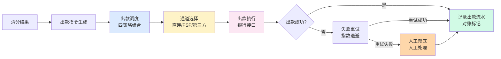
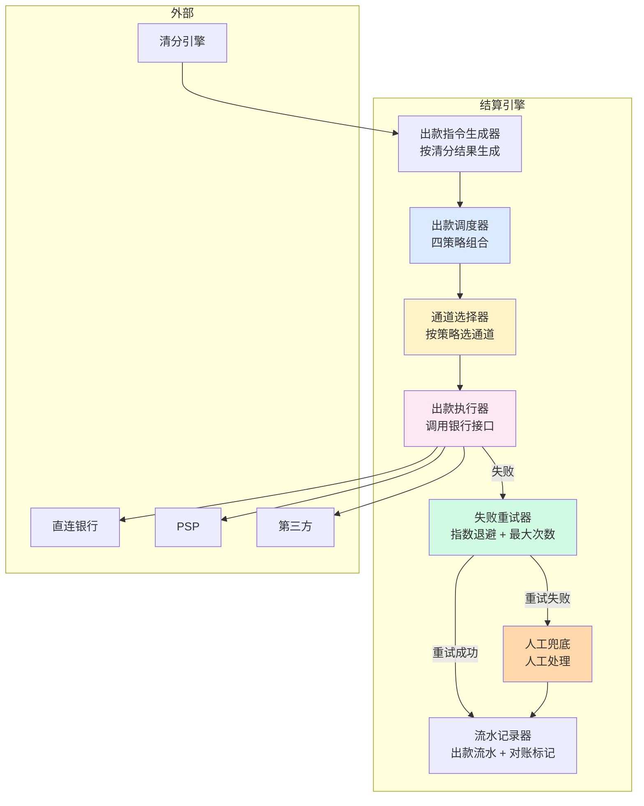

# 结算引擎与出款调度（深度）

> **系列第 12 篇 · 深度**
> 上一篇 [11_清分引擎设计与规则引擎](./11_清分引擎设计与规则引擎-深度.md) 讲了钱怎么分（按 MDR 拆成 4 部分）。本篇讲**钱怎么出去**——结算引擎从 0 到 1 实现，**出款调度四策略**（按通道 / 优先级 / 金额 / 商户）、**失败重试 + 人工介入**、**出款幂等设计**、以及业内头部的真实选型案例。

---

## 一句话定义

> **结算引擎的设计，核心是「出款调度四策略 + 失败重试 + 幂等 + 资金安全」四件事**。按通道 / 优先级 / 金额 / 商户四策略组合调度，失败重试采用指数退避 + 最大重试次数 + 人工兜底，幂等通过「出款 ID + 银行流水号 + 对账状态」三重防重，资金安全通过「专用账户 + 双签授权 + 实时监控」保障。**业内默认：** 头部公司用「**四策略组合调度 + 失败兜底机制 + 双签授权**」。

---

## 业务背景与价值

### 为什么「结算引擎」是核心难题？

入门读者以为「结算 = 把钱打到商户账户」。但结算引擎的真实复杂度在**出款调度 + 失败重试 + 幂等 + 资金安全**：

**出款调度多变：**
- 不同通道成功率不同（直连银行 95% / PSP 90% / 第三方 85%）
- 不同通道手续费不同
- 不同商户优先级不同（大商户优先 / 中商户次之 / 小商户最后）
- 不同金额上限不同（单笔上限、单日上限、单月上限）
- 不同国家监管要求不同（大额报送、反洗钱）

**业内默认：** 结算引擎出款调度至少**4 个维度组合**，每维度**5-10 个选项**——**调度的复杂度是指数级的**

### 过去 5 年的出款调度演进（跨周期视角）

| 时间段 | 主流方案 | 关键事件 |
|---|---|---|
| 2015-2018 | **单通道期** | 结算只对接 1 家银行，单一通道出款 |
| 2019-2021 | **多通道期** | 开始对接多家银行（直连 + PSP），按成功率切换 |
| 2022-2024 | **智能调度期** | 头部公司自研智能调度（按成功率 / 成本 / 时延动态选择） |
| 2025-至今 | **AI 调度期** | AI 自动预测通道成功率 + 自动调度 + 自动重试 |

**关键洞察：** 5 年前结算出款是「**单一通道 + 人工切换**」，现在变成「**多通道 + 智能调度 + AI 预测**」。**未来 AI 调度**——自动预测、自动调度、自动重试

### 监管意图：为什么结算必须可追溯？

监管对结算有「硬性要求」：

1. **资金可追溯**——任何一笔出款能在 5 分钟内定位到原始交易
2. **出款可重放**——同一笔出款按历史规则重算，结果一致
3. **大额可报送**——单笔超过阈值（如 $10,000）必须报送外管局 / 央行
4. **可疑可拦截**——反洗钱系统自动拦截可疑出款

**专家视角：** 4 条要求**决定了结算引擎必须是「**可解释 + 可重放 + 可报送 + 可拦截**」**——不是简单的「把钱打到商户账户」

---

## 业务术语表

| 中文 | 英文 | 一句话解释 |
|---|---|---|
| 出款 | Payout | 把钱从公司账户打到商户账户（结算的最后一步） |
| 出款调度 | Payout Routing | 按什么策略选通道出款（按通道/优先级/金额/商户） |
| 出款通道 | Payout Channel | 出款的实际通道（直连银行 / PSP / 第三方） |
| 通道成功率 | Channel Success Rate | 出款成功的概率（95% / 90% / 85%） |
| 失败重试 | Failure Retry | 出款失败后自动重试（指数退避 + 最大次数） |
| 人工兜底 | Manual Fallback | 自动重试都失败后由人工介入处理 |
| 出款幂等 | Payout Idempotency | 同一笔出款多次执行结果一致（防重放） |
| 银行流水号 | Bank Reference Number | 银行返回的出款标识（用于对账） |
| 双签授权 | Dual Authorization | 大额出款需要两人授权才能执行 |
| 实时监控 | Real-Time Monitoring | 出款异常实时告警（成功率下降 / 金额异常） |
| 专用账户 | Dedicated Account | 出款专用的银行账户（与收款账户分离） |
| 反洗钱 | AML (Anti-Money Laundering) | 监管要求的反洗钱系统（拦截可疑出款） |
| 大额报送 | Large-Amount Reporting | 超过监管阈值的出款必须报送 |
| 指数退避 | Exponential Backoff | 重试间隔按指数增长（1s / 2s / 4s / 8s / 16s） |
| 资金安全 | Fund Security | 保证出款不被挪用 / 错误 / 重放 |

---

## 业务形态与模式：出款调度四策略详解

### 策略 1：按通道（By Channel）

**是什么：** 同一笔出款，按通道成功率排序，优先选成功率最高的通道

**机制：**
- 实时统计每个通道的「近 1 小时成功率」
- 成功率 > 阈值（如 90%）的通道为「可用通道」
- 从可用通道中按成功率排序，依次尝试

**优势：**
- 简单（按成功率排序即可）
- 自动（不需要人工介入）
- 提升成功率（避开失败的通道）

**劣势：**
- 不考虑成本（可能选贵的通道）
- 不考虑时延（可能选慢的通道）
- 不考虑商户优先级（大商户和小商户一视同仁）

**适合：** 早期公司 / MVP 阶段

### 策略 2：按优先级（By Priority）

**是什么：** 按商户优先级分配通道（大商户优先 / 中商户次之 / 小商户最后）

**机制：**
- 商户分级（VIP / 大 / 中 / 小）
- 不同级别分配不同通道（VIP 用直连银行 / 大商户用 PSP / 小商户用第三方）
- 高优先级商户优先出款

**优势：**
- 大商户体验好（VIP 优先）
- 通道成本可控（按商户分级匹配通道）
- 监管风险低（高风险商户只能用指定通道）

**劣势：**
- 不考虑成功率（VIP 商户可能走失败的通道）
- 不考虑金额（大额小额一视同仁）
- 不灵活（分级规则变更需要重启）

**适合：** 中型公司（已有商户分级）

### 策略 3：按金额（By Amount）

**是什么：** 按出款金额选通道（小金额用便宜通道，大金额用稳定通道）

**机制：**
- 金额分级（小额 < 1 万 / 中额 1-10 万 / 大额 > 10 万）
- 不同金额用不同通道（小额用第三方便宜通道 / 大额用直连银行稳定通道）
- 大额出款需要双签授权

**优势：**
- 成本最优（小额走便宜通道省手续费）
- 大额安全（大额走稳定通道 + 双签授权）
- 监管合规（大额自动报送）

**劣势：**
- 不考虑成功率（可能选失败的通道）
- 不考虑商户优先级
- 规则复杂（金额分级 + 通道匹配）

**适合：** 大部分公司（按金额分级）

### 策略 4：按商户（By Merchant）

**是什么：** 按商户特征选通道（按商户风险等级 / 商户行业 / 商户历史成功率）

**机制：**
- 商户画像（风险等级 / 行业 / 历史出款成功率）
- 不同画像用不同通道（高风险商户用指定通道）
- 动态调整（成功率下降自动切换通道）

**优势：**
- 风险可控（高风险商户走指定通道）
- 成功率最高（按商户历史成功率选通道）
- 个性化（不同商户不同通道）

**劣势：**
- 规则极复杂（商户画像 + 通道匹配）
- 数据要求高（需要商户历史数据）
- 维护成本高（每个商户都要维护画像）

**适合：** 头部公司（有大量商户历史数据）

### 决策矩阵

| 策略 | 优势 | 代价 | 适合谁 |
|---|---|---|---|
| **按通道** | 简单 + 自动 + 提升成功率 | 不考虑成本 / 时延 / 优先级 | 早期 / MVP |
| **按优先级** | 大商户体验好 + 通道成本可控 | 不考虑成功率 / 金额 | 中型公司 |
| **按金额** | 成本最优 + 大额安全 + 合规 | 规则复杂 | 大部分公司 |
| **按商户** | 风险可控 + 成功率最高 + 个性化 | 规则极复杂 + 数据要求高 | 头部公司 |

**专家视角：** **四策略不是互斥，是组合**——业内默认是「**按通道 + 按金额 + 按优先级 + 按商户四策略组合**」。**单一策略不够，必须组合**

---

## 业务流程图：结算引擎的核心流程

**关键观察：**
- 出款流程**单向**（清分结果 → 出款指令 → 调度 → 通道 → 执行 → 记录）
- 失败重试 + 人工兜底是**兜底机制**
- 任何一笔出款都有**对账标记**（用于对账引擎对账）

---

## 系统架构：结算引擎的模块边界

**关键设计：**
- 结算引擎**单向依赖**（清分 → 结算 → 账务 → 对账）
- 出款调度器**支持四策略组合**
- 失败重试器 + 人工兜底是**双重兜底**

---

## 服务模型：3 种调度模式对比

### 模式 1：实时调度（Real-Time）

**机制：**
- 每笔清分结果实时触发出款
- 调度器实时选通道 + 实时出款
- 出款结果实时反馈

**优势：**
- 实时（出款秒级完成）
- 资金及时（商户实时收到款）
- 体验好（商户满意度高）

**劣势：**
- 性能要求高（每笔实时调度）
- 复杂（实时调度 + 实时重试）
- 测试困难（难以复现问题）

**适合：** 头部公司（T+0 实时结算）

### 模式 2：批量调度（Batch）

**机制：**
- 定时跑批（如 T+1 早上 6 点）
- 一次性处理 N 笔出款
- 处理完后生成出款报告

**优势：**
- 简单（无需实时）
- 性能高（单次处理 N 笔）
- 易测试（按批测试）

**劣势：**
- 时延高（T+1 才有出款结果）
- 资金延迟（商户 T+1 收到款）
- 体验差（商户抱怨）

**适合：** 大部分公司（T+1 跑批够用）

### 模式 3：混合调度（Hybrid）

**机制：**
- 大商户实时调度（实时出款）
- 小商户批量调度（T+1 跑批）
- VIP 商户优先调度（独立通道）

**优势：**
- 平衡（实时 + 批量）
- 成本可控（批量省手续费）
- 体验好（大商户实时）

**劣势：**
- 系统复杂（两套调度器）
- 维护成本高（实时 + 批量都要维护）

**适合：** 头部公司（商户分级明确）

**专家视角：** **混合调度是未来方向**——业内默认是「大商户实时 + 小商户批量 + VIP 优先」。**单一模式不够，必须组合**

---

## 核心功能用例

### 用例 1：标准出款

**场景：** 商户 A 申请结算 $10,000，按四策略组合调度

**流程：**
- 出款指令生成（按清分结果）
- 出款调度：按通道成功率选 → 按金额（小额走第三方）→ 按优先级（A 是大商户用 PSP）→ 按商户画像（A 历史成功率高）
- 通道选择：PSP（综合最优）
- 出款执行：调用 PSP 接口
- 出款成功：记录流水 + 对账标记

**时延：** 实时模式 秒级 / 批量模式 T+1

### 用例 2：失败重试 + 人工兜底

**场景：** 商户 B 申请结算 $50,000，第一次出款失败

**流程：**
- 出款指令生成（按清分结果）
- 出款调度：选直连银行
- 出款执行：第一次失败（银行接口超时）
- 失败重试：指数退避（1s / 2s / 4s / 8s）
- 重试成功：记录流水
- 重试失败：转人工兜底
- 人工处理：换通道或人工转账
- 人工出款成功：记录流水

**关键设计：** **失败重试 + 人工兜底是双重保障**——业内默认是「3 次自动重试 + 人工兜底」

### 用例 3：大额双签授权

**场景：** 商户 C 申请结算 $500,000（大额）

**流程：**
- 出款指令生成
- 大额识别：金额 > 阈值（$100,000）
- 双签授权：需要 2 人授权（运营 + 财务）
- 第一人授权：运营人员授权
- 第二人授权：财务人员授权
- 出款执行：调用银行接口
- 出款成功：记录流水 + 大额报送

**关键设计：** **大额必须双签授权**——业内默认是「金额 > $100,000 需要双签」

---

## 业务打法与策略：不同公司的结算引擎选择

### 头部公司（年 GMV > 100 亿美元）

**典型做法：**
- **四策略组合调度**（按通道 + 按金额 + 按优先级 + 按商户）
- **混合调度模式**（大商户实时 + 小商户批量）
- **失败重试 + 人工兜底**
- **大额双签授权**
- **AI 预测通道成功率**

**业内认知：** 头部公司的结算引擎是「**四策略组合 + 混合调度 + 双重兜底 + AI 预测**」的，能支撑实时出款 + 智能调度 + 自动重试。**这是 10+ 年技术积累的产物**

### 中型公司（年 GMV 1-100 亿美元）

**典型做法：**
- **三策略组合调度**（按通道 + 按金额 + 按优先级）
- **批量调度模式**（T+1 跑批）
- **失败重试**（无人工兜底）
- **大额双签授权**

**业内认知：** 中型公司的结算引擎是「**够用但不极致**」——能 T+1 出款但不能实时调度。**演进需要 2-3 年**

### 小公司 / 新进入者（年 GMV < 1 亿美元）

**典型做法：**
- **单策略调度**（按通道）
- **批量调度模式**
- **失败重试**（无人工兜底）
- **无双签授权**（单人授权）

**业内认知：** 小公司的结算引擎是「**MVP 起步**」——能跑业务但风险大（资金安全风险高）。**先跑起来再说**

---

## Trade-off 分析

### 决策 1：单策略 vs 多策略组合

| 选项 | 优势 | 代价 | 适合谁 |
|---|---|---|---|
| **单策略**（按通道） | 简单 + 自动 | 不考虑成本 / 时延 / 优先级 | 早期 / MVP |
| **三策略组合**（通道 + 金额 + 优先级） | 平衡 + 成本可控 + 大商户体验好 | 规则复杂 | 中型公司 |
| **四策略组合**（+ 商户） | 风险可控 + 成功率最高 + 个性化 | 规则极复杂 + 数据要求高 | 头部公司 |

**专家视角：** **策略不是越多越好**——是「**业务复杂度 + 团队能力 + 未来扩展性**」的取舍。**业内默认：** 早期单策略 → 成长三策略 → 头部四策略

### 决策 2：实时 vs 批量 vs 混合

| 选项 | 优势 | 代价 | 适合谁 |
|---|---|---|---|
| **实时** | 实时 + 资金及时 + 体验好 | 性能要求高 + 复杂 | 头部公司 |
| **批量** | 简单 + 性能高 + 易测试 | 时延高 + 资金延迟 | 大部分公司 |
| **混合** | 平衡 + 成本可控 + 体验好 | 系统复杂 | 头部公司 |

**专家视角：** **混合是未来方向**——大商户实时 + 小商户批量 + VIP 优先。**业内默认：** 头部公司必须「**混合调度**」

### 决策 3：单签 vs 双签授权

| 选项 | 优势 | 代价 | 适合谁 |
|---|---|---|---|
| **单签授权** | 简单 + 快速 | 风险高（一人可挪用） | 小公司 |
| **双签授权** | 安全（两人独立授权） | 慢 + 需要 2 人在线 | 监管要求 |

**专家视角：** **双签授权不是技术选择，是合规要求**——监管要求大额出款必须有「**双签授权 + 实时监控 + 大额报送**」。**业内默认：** 头部公司大额必须双签

---

## 行业洞察 / 业内认知

### 不成文标准：出款调度的真实复杂度

公开规则：出款 = 单一通道 + 自动重试。

**业内实际复杂度（业内默认）：**

| 维度 | 真实复杂度 | 业内默认 |
|---|---|---|
| 出款通道数 | **3-5 个** | 头部公司（直连 + 2-3 个 PSP + 第三方） |
| 调度策略维度 | **4 维组合** | 头部公司（通道 + 金额 + 优先级 + 商户） |
| 失败重试次数 | **3 次** | 头部公司（1s / 2s / 4s 指数退避） |
| 人工兜底 SLA | **30 分钟** | 头部公司 |
| 大额双签阈值 | **$100,000** | 监管要求 |
| 出款成功率 | **95%+** | 头部公司（自动重试后） |
| 出款时延 | **T+0 / T+1** | 头部公司（大商户实时 / 小商户批量） |

**专家视角：** 出款调度的真实复杂度是「**3-5 通道 + 4 维策略 + 3 次重试 + 30 分钟人工兜底 + $100,000 双签阈值 + 95% 成功率**」。**业内默认：** 头部公司结算引擎必须有「**四策略组合 + 失败兜底 + 双签授权**」

### 真实事故：出款失败引发商户信任危机

公开报道：2022 年某中型跨境支付公司因出款系统 Bug（同一笔出款被重复执行 3 次），导致商户账户被重复打款 $300,000，公司事后虽追回但引发：
- 商户投诉（信任度下降）
- 监管约谈（资金安全问题）
- 媒体报道（行业负面曝光）
- 后续 6 个月商户流失 20%

**业内流传的处理方式：** 头部公司后来强制出款必须经过：
- 幂等设计（同一笔出款只能执行一次）
- 实时监控（重复出款实时告警）
- 双签授权（大额必须双签）
- 人工复核（财务人员 24 小时内复核）

**教训：** 出款 Bug 的「真实成本」不是资金损失本身，是「**商户信任 + 监管风险 + 行业声誉**」。**业内默认：** 头部公司出款必须有「**幂等 + 监控 + 双签 + 复核**」四重保险

### 从业者挑战：结算引擎的 5 个核心难题

跨境支付公司常见的内部挑战：结算引擎的 5 个核心难题。

**1. 通道成功率波动**

成功率每天波动 2-5%（银行系统维护 / PSP 接口变更）。**业内默认：** 必须有「**实时统计 + 自动切换 + 通道降级**」

**2. 出款时延压力**

商户希望秒级到账，但实际出款需要秒级到分钟级。**业内默认：** 必须有「**实时调度 + 优先级 + VIP 通道**」

**3. 大额合规报送**

单笔 > $100,000 必须报送外管局 / 央行。**业内默认：** 必须有「**大额识别 + 双签授权 + 自动报送**」

**4. 反洗钱拦截**

可疑出款必须自动拦截（反洗钱系统）。**业内默认：** 必须有「**可疑识别 + 自动拦截 + 人工复核**」

**5. 跨币种结算**

不同币种出款需要换汇。**业内默认：** 必须有「**汇率锁定 + 换汇调度 + 多币种账户**」

**专家视角：** 5 个核心难题的真实门槛不是技术实现，是「**业务理解 + 团队协作 + 长期运维**」。**业内默认：** 结算引擎团队必须有「**业务专家 + 架构师 + 测试 + 运维 + 财务**」五方协作

---

## 业务前景与趋势

### 未来 3-5 年的 4 个结构性变化

**1. AI 智能调度**

传统调度（按规则）→ **AI 智能调度**（按预测成功率）。**对参与方格局的启示：** 调度能力成为头部支付公司的核心资产

**2. 实时结算成为标配**

T+1 批量结算 → **T+0 实时结算**。**对参与方格局的启示：** 实时结算能力成为头部支付公司的护城河

**3. 跨币种实时结算**

多币种出款需要 T+0 → **跨币种实时结算**。**对参与方格局的启示：** 多币种能力成为头部支付公司的差异化优势

**4. 区块链跨境结算**

传统银行出款 → **区块链跨境结算**。**对参与方格局的启示：** 银行结算网络可能被部分替代

---

## 一句话总结

> **结算引擎的设计，核心是「出款调度四策略 + 失败重试 + 幂等 + 资金安全」四件事**。按通道 / 优先级 / 金额 / 商户四策略组合调度（头部公司标配），失败重试采用「**3 次指数退避 + 30 分钟人工兜底**」，幂等通过「**出款 ID + 银行流水号 + 对账状态**」三重防重，资金安全通过「**专用账户 + 双签授权 + 实时监控**」保障。**业内默认：** 头部公司用「**四策略组合调度 + 失败兜底机制 + 双签授权**」。

---

## 📌 数据与事实声明

本文涉及的结算引擎设计、出款调度等内容是清结算系统设计的通用认知，但具体到：

- 各家支付公司的出款通道数（直连 / PSP / 第三方）以各公司实际通道为准
- 调度策略（按通道 / 按金额 / 按优先级 / 按商户）的实际组合以各公司业务为准
- 失败重试次数、指数退避间隔、人工兜底 SLA 等具体数字基于业内默认范围，**不是承诺**
- 大额双签授权阈值（$100,000）以监管最新要求为准
- 出款成功率、时延等性能指标以各公司实际压测结果为准

不要直接引用本文作为结算引擎设计依据或选型依据。

---

## 下一篇预告

下一篇 [13_对账引擎设计与差错自愈-实战](./13_对账引擎设计与差错自愈-实战.md) 将深入**对账引擎怎么从 0 到 1 实现**——**自动调账边界**、**差错自愈规则**（5 类差错 + 4 个边界）、**智能差错识别**（AI 辅助）、以及业内头部的真实选型案例。