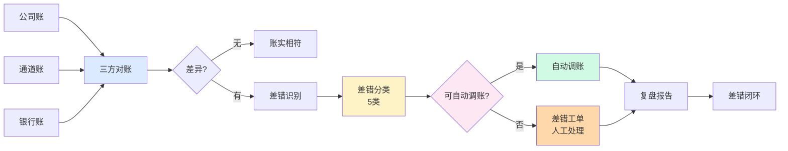
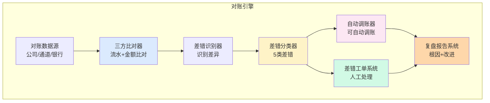

# 对账引擎设计与差错自愈（实战）

> **系列第 13 篇 · 实战**
> 上一篇 [12_结算引擎与出款调度](./12_结算引擎与出款调度-深度.md) 讲了钱怎么出去。本篇进入**第四层 · 架构与系统的最后一篇**——讲**钱怎么对账**——对账引擎从 0 到 1 实现，**自动调账边界**、**差错自愈规则**（5 类差错 + 4 个边界）、**智能差错识别**（AI 辅助）、以及业内头部的真实选型案例。

---

## 一句话定义

> **对账引擎的设计，核心是「差错识别 + 差错分类 + 差错处理 + 差错闭环」四件事**。差错识别通过「三方比对（公司 / 通道 / 银行）+ 双向核对（流水 + 金额）」实现；差错分类按「长款 / 短款 / 状态不一致 / 汇差 / 时延」5 类；差错处理按「自动调账 / 人工介入 / 重跑 / 退款」4 档；差错闭环通过「**差错工单 + SLA 监控 + 复盘报告**」实现 100% 闭环。**业内默认：** 头部公司用「**三方比对 + 5 类差错 + 4 档处理 + 差错工单**」。

---

## 业务背景与价值

### 为什么「对账引擎」是核心难题？

入门读者以为「对账 = 比较两个文件」。但对账引擎的真实复杂度在**差错识别 + 差错分类 + 差错处理 + 差错闭环**：

**差错多变：**
- 长款（公司账多钱）/ 短款（公司账少钱）
- 状态不一致（公司成功 / 通道失败）
- 汇差（汇率差异导致金额不一致）
- 时延（同一交易在不同系统延迟入账）
- 漏单（一方有 / 另一方无）

**业内默认：** 对账差错类型至少**5 类**，每类**多种变种**，全年差错**100-10000 笔**——**差错处理必须自动化 + 闭环化**

### 过去 5 年的对账引擎演进（跨周期视角）

| 时间段 | 主流方案 | 关键事件 |
|---|---|---|
| 2015-2018 | **人工对账期** | 财务人员每天下载文件 + 手工比对 + Excel 处理 |
| 2019-2021 | **自动对账期** | 开始用对账系统自动比对 + 自动告警 |
| 2022-2024 | **差错自愈期** | 头部公司自研差错自愈规则（自动调账 / 自动重跑） |
| 2025-至今 | **AI 智能对账期** | AI 自动识别差错 + 自动调账 + 智能工单 |

**关键洞察：** 5 年前对账是「**人工 + Excel**」，现在变成「**自动 + 差错自愈 + AI 识别**」。**未来 AI 智能对账**——自动识别、自动调账、智能工单

### 监管意图：为什么对账必须可追溯？

监管对对账有「硬性要求」：

1. **账实相符**——任何时候公司账面与实际资金必须一致
2. **差错可追溯**——任何一笔差错能在 5 分钟内定位原因
3. **大额差错可报送**——单笔差错超过阈值（如 $10,000）必须报送
4. **差错可复盘**——监管可随时调取差错复盘报告

**专家视角：** 4 条要求**决定了对账引擎必须是「**账实相符 + 可追溯 + 可报送 + 可复盘**」**——不是简单的「比较两个文件」

---

## 业务术语表

| 中文 | 英文 | 一句话解释 |
|---|---|---|
| 对账 | Reconciliation | 比对两个或多个数据源（公司 / 通道 / 银行）是否一致 |
| 差错 | Discrepancy | 对账发现的不一致（长款 / 短款 / 状态不一致等） |
| 长款 | Over-funding | 公司账面多钱（实际资金没那么多） |
| 短款 | Under-funding | 公司账面少钱（实际资金多出来） |
| 状态不一致 | Status Mismatch | 公司系统状态与通道状态不一致 |
| 汇差 | Exchange Difference | 汇率差异导致的金额不一致 |
| 时延 | Latency | 同一交易在不同系统延迟入账导致的不一致 |
| 漏单 | Missing Record | 一方有记录 / 另一方无记录 |
| 差错自愈 | Auto-Resolution | 自动识别差错 + 自动处理差错 |
| 自动调账 | Auto-Adjustment | 自动调整账务（不需要人工） |
| 差错工单 | Discrepancy Ticket | 差错处理的工作流（含 SLA / 处理人 / 处理状态） |
| SLA 监控 | SLA Monitoring | 差错处理时长监控（如 30 分钟 / 1 小时 / 4 小时） |
| 复盘报告 | Post-Mortem Report | 差错处理完成后的总结报告（根因 / 影响 / 改进） |
| 三方对账 | Three-Way Reconciliation | 公司 / 通道 / 银行三方对账 |
| 双向核对 | Dual Verification | 流水 + 金额两个维度核对 |

---

## 业务形态与模式：5 类差错详解

### 差错 1：长款（Over-funding）

**是什么：** 公司账面记录比实际资金多

**常见场景：**
- 用户付款成功，通道已扣款，公司记录已入账，但实际资金未到账
- 系统重复记录（同一笔交易记录 2 次）
- 退款时多扣用户款（多退少补逻辑写错）

**自动调账方案：**
- 自动调账：减少公司账面（与实际一致）
- 但需记录「长款原因」用于审计

**业内默认：** 头部公司长款自动调账率 **80%+**（简单差错自动处理）

### 差错 2：短款（Under-funding）

**是什么：** 公司账面记录比实际资金少

**常见场景：**
- 用户付款成功，通道已扣款，但公司系统漏记录
- 部分退款（用户退 100，但系统只记 50）
- 跨币种结算汇率换算错误

**自动调账方案：**
- 自动调账：增加公司账面（与实际一致）
- 但需记录「短款原因」用于审计

**业内默认：** 头部公司短款自动调账率 **70%+**（需要更谨慎）

### 差错 3：状态不一致（Status Mismatch）

**是什么：** 公司系统状态与通道状态不一致

**常见场景：**
- 公司记录「已支付」，但通道记录「已退款」
- 公司记录「已退款」，但通道记录「已支付」
- 公司记录「待支付」，但通道记录「已支付」

**自动调账方案：**
- **谨慎处理**（涉及资金流向）
- 优先以通道状态为准（通道是真实资金流向）
- 状态不一致必须人工复核

**业内默认：** 状态不一致**90% 需人工介入**（不能自动调账）

### 差错 4：汇差（Exchange Difference）

**是什么：** 跨币种结算时汇率差异导致的金额不一致

**常见场景：**
- 锁定汇率与实际结算汇率不一致
- 汇率波动导致入账金额与预期不一致
- 跨日结算汇率变动

**自动调账方案：**
- **自动计算汇差金额**
- 自动调账（按实际汇率重新计算）
- 但需记录「汇差原因」用于风控

**业内默认：** 汇差**100% 自动调账**（汇差是业务常态）

### 差错 5：时延（Latency）

**是什么：** 同一交易在不同系统延迟入账导致的不一致

**常见场景：**
- 通道 T+1 入账，但公司实时记录
- 跨行清算时延（国内 T+0 / 跨境 T+1-3）
- 银行批量入账（一天一次）

**自动调账方案：**
- **等待入账**（按预计入账时间等待）
- 超时未入账转人工
- 严重时延升级为事故

**业内默认：** 时延**100% 自动等待**（不是真差错，是时间差）

### 决策矩阵

| 差错类型 | 自动调账率 | 人工介入率 | 业内默认 |
|---|---|---|---|
| **长款** | 80%+ | 20% | 简单差错自动处理 |
| **短款** | 70%+ | 30% | 谨慎处理 |
| **状态不一致** | 10% | 90% | 不能自动调账 |
| **汇差** | 100% | 0% | 自动按实际汇率 |
| **时延** | 100% | 0%（超时后） | 自动等待入账 |

**专家视角：** **差错处理是分级**——简单差错自动处理（长款 / 汇差 / 时延），复杂差错人工介入（状态不一致）。**业内默认：** 自动调账率 **70%+** 是头部公司水平

---

## 业务流程图：对账引擎的核心流程

**关键观察：**
- 对账流程**单向**（三方对账 → 差错识别 → 差错分类 → 差错处理 → 差错闭环）
- 差错处理**分级**（可自动 vs 需人工）
- 差错闭环**必须**有复盘报告

---

## 系统架构：对账引擎的模块边界

**关键设计：**
- 对账引擎**单向依赖**（数据源 → 比对 → 识别 → 分类 → 处理 → 复盘）
- 差错处理**分级**（自动调账 + 人工工单）
- 复盘报告**必须**（差错闭环的核心）

---

## 服务模型：4 档差错处理

### 档位 1：自动调账

**机制：**
- 差错自动识别（长款 / 短款 / 汇差 / 时延）
- 自动调账（按规则调整账务）
- 自动记录（差错原因 + 调账金额）

**优势：**
- 快速（毫秒级调账）
- 准确（无人工错误）
- 高效（节省人力）

**劣势：**
- 风险（自动调账可能错误）
- 不可逆（调账后难以回滚）
- 审计难（需要详细记录）

**适合：** 简单差错（长款 / 短款 / 汇差 / 时延）

### 档位 2：人工介入

**机制：**
- 差错自动识别（状态不一致 / 复杂差错）
- 自动生成工单（差错详情 + 建议处理）
- 人工处理（财务 / 运营人员介入）
- 人工记录（处理结果 + 根因）

**优势：**
- 安全（人工复核）
- 灵活（可处理复杂情况）
- 可学习（人工经验沉淀）

**劣势：**
- 慢（人工处理耗时长）
- 成本高（需要专业人力）
- 一致性差（不同人处理结果可能不同）

**适合：** 复杂差错（状态不一致 / 大额差错）

### 档位 3：重跑

**机制：**
- 差错自动识别（漏单 / 重复）
- 自动重跑（重新执行清分 / 结算）
- 重新对账（验证是否一致）

**优势：**
- 简单（重跑就是重做）
- 准确（重跑结果可信）
- 可追溯（重跑过程有日志）

**劣势：**
- 慢（重跑需要时间）
- 风险（重跑可能引入新问题）
- 不可重复（重跑后状态可能变化）

**适合：** 漏单 / 重复（系统性问题）

### 档位 4：退款

**机制：**
- 差错自动识别（无法调账 / 异常差错）
- 自动退款（把钱退给用户 / 商户）
- 重新发起交易

**优势：**
- 安全（退款不影响系统）
- 用户体验（用户收到退款）
- 合规（异常差错必须退款）

**劣势：**
- 成本（退款手续费）
- 体验差（用户等待退款）
- 不可逆（退款后无法回滚）

**适合：** 异常差错（无法调账 / 风险差错）

### 决策矩阵

| 档位 | 优势 | 代价 | 适合谁 |
|---|---|---|---|
| **自动调账** | 快速 + 准确 + 高效 | 风险 + 不可逆 + 审计难 | 简单差错 |
| **人工介入** | 安全 + 灵活 + 可学习 | 慢 + 成本高 + 一致性差 | 复杂差错 |
| **重跑** | 简单 + 准确 + 可追溯 | 慢 + 风险 + 不可重复 | 漏单 / 重复 |
| **退款** | 安全 + 用户体验 + 合规 | 成本 + 体验差 + 不可逆 | 异常差错 |

**专家视角：** **差错处理是分级的**——业内默认是「**简单差错自动调账（70%+）+ 复杂差错人工介入（30%）**」。**单一档位不够，必须组合**

---

## 核心功能用例

### 用例 1：标准三方对账

**场景：** T+1 早上 6 点对账（公司账 vs 通道账 vs 银行账）

**流程：**
- 加载三账数据（公司 / 通道 / 银行）
- 三方比对（按交易 ID + 金额）
- 差异识别（有差异的进入差错分类）
- 差错分类（5 类）
- 差错处理（自动调账 / 人工介入）
- 复盘报告（差错统计 + 根因分析）

**时延：** 批量对账 T+1 早上 6 点 - 8 点

### 用例 2：自动调账（长款）

**场景：** 系统发现一笔长款 $1,000

**流程：**
- 差错识别：长款 $1,000（公司账面多）
- 差错分类：长款（可自动调账）
- 自动调账：减少公司账面 $1,000
- 记录：差错原因 + 调账金额 + 调账时间
- 复盘：长款原因（重复记录 / 多扣用户款等）

**时延：** 秒级（自动调账）

### 用例 3：差错工单（状态不一致）

**场景：** 系统发现一笔状态不一致（公司记录「已支付」，通道记录「已退款」）

**流程：**
- 差错识别：状态不一致
- 差错分类：状态不一致（需人工）
- 自动生成工单：差错详情 + 建议处理
- 人工介入：财务 / 运营人员处理
- 人工记录：处理结果 + 根因
- 复盘：根因分析 + 改进措施

**时延：** 30 分钟 - 1 小时（SLA）

### 用例 4：实时对账

**场景：** T+0 实时对账（每笔交易实时对账）

**流程：**
- 每笔交易实时加载三账数据
- 实时三方比对
- 实时差错识别
- 实时差错处理（自动 / 人工）
- 实时复盘（异常告警）

**时延：** 秒级（实时对账）

---

## 业务打法与策略：不同公司的对账引擎选择

### 头部公司（年 GMV > 100 亿美元）

**典型做法：**
- **三方对账**（公司 / 通道 / 银行）
- **T+0 实时对账 + T+1 批量对账双轨**
- **5 类差错自动调账**（自动调账率 80%+）
- **差错工单系统**（SLA 监控）
- **复盘报告系统**（差错闭环）
- **AI 智能差错识别**（自动识别异常模式）

**业内认知：** 头部公司的对账引擎是「**三方对账 + 双轨 + 5 类差错 + 工单 + 复盘 + AI**」的，能支撑实时对账 + 差错自动调账 + 100% 闭环。**这是 10+ 年技术积累的产物**

### 中型公司（年 GMV 1-100 亿美元）

**典型做法：**
- **两方对账**（公司 / 通道）
- **T+1 批量对账**
- **3 类差错自动调账**（长款 / 短款 / 汇差）
- **差错工单系统**（无 SLA 监控）
- **复盘报告**（每月一次）

**业内认知：** 中型公司的对账引擎是「**够用但不极致**」——能 T+1 对账但不能实时，差错自动调账率 50%。**演进需要 2-3 年**

### 小公司 / 新进入者（年 GMV < 1 亿美元）

**典型做法：**
- **单方对账**（公司账自检）
- **T+1 人工对账**
- **无差错自动调账**（人工 Excel）
- **无工单系统**
- **无复盘报告**

**业内认知：** 小公司的对账引擎是「**MVP 起步**」——能跑业务但风险大（差错积累）。**先跑起来再说**

---

## Trade-off 分析

### 决策 1：单方 vs 两方 vs 三方对账

| 选项 | 优势 | 代价 | 适合谁 |
|---|---|---|---|
| **单方对账**（公司账自检） | 简单 + 快速 | 容易漏差错 | 小公司 |
| **两方对账**（公司 / 通道） | 平衡 + 成本可控 | 银行差错难发现 | 中型公司 |
| **三方对账**（公司 / 通道 / 银行） | 全覆盖 + 差错率最低 | 系统复杂 + 成本高 | 头部公司 |

**专家视角：** **三方对账是头部标配**——业内默认是「公司 / 通道 / 银行三方实时对账」。**单一对账不够，必须三方**

### 决策 2：T+0 实时 vs T+1 批量

| 选项 | 优势 | 代价 | 适合谁 |
|---|---|---|---|
| **T+0 实时对账** | 实时 + 资金及时 + 体验好 | 性能要求高 + 复杂 | 头部公司 |
| **T+1 批量对账** | 简单 + 性能高 + 易测试 | 时延高 + 资金延迟 | 大部分公司 |
| **双轨**（T+0 + T+1） | 平衡 + 灵活 | 系统复杂 | 头部公司 |

**专家视角：** **双轨是未来方向**——T+0 实时对账 + T+1 批量核对。**业内默认：** 头部公司必须「**双轨对账**」

### 决策 3：自动调账率

| 选项 | 优势 | 代价 | 适合谁 |
|---|---|---|---|
| **高自动调账率**（80%+） | 高效 + 节省人力 | 风险（自动调账可能错误） | 头部公司（已积累规则） |
| **中自动调账率**（50%） | 平衡 | 需要人工介入较多 | 中型公司 |
| **低自动调账率**（10%） | 安全 | 人力成本高 | 小公司 / 早期 |

**专家视角：** **自动调账率是头部公司核心指标**——业内默认是「**简单差错 80%+ 自动调账**」。**单一档位不够，必须分级**

---

## 行业洞察 / 业内认知

### 不成文标准：对账的真实复杂度

公开规则：对账 = 比较两个文件。

**业内实际复杂度（业内默认）：**

| 维度 | 真实复杂度 | 业内默认 |
|---|---|---|
| 对账数据源 | **3 个** | 头部公司（公司 / 通道 / 银行） |
| 差错类型 | **5 类** | 长款 / 短款 / 状态不一致 / 汇差 / 时延 |
| 自动调账率 | **70%+** | 头部公司 |
| 对账时延 | **T+0 + T+1 双轨** | 头部公司 |
| 差错工单 SLA | **30 分钟 / 1 小时 / 4 小时** | 头部公司 |
| 复盘报告 | **每周 / 每月** | 头部公司 |
| 差错闭环率 | **100%** | 头部公司（必须闭环） |
| 账实相符率 | **99.99%** | 头部公司（万分之一的差错率） |

**专家视角：** 对账的真实复杂度是「**3 数据源 + 5 类差错 + 70% 自动调账 + 双轨对账 + 100% 闭环 + 99.99% 账实相符**」。**业内默认：** 头部公司对账引擎必须有「**三方对账 + 5 类差错 + 自动调账 + 差错工单 + 复盘报告**」

### 真实事故：对账差错引发监管约谈

公开报道：2024 年某头部跨境支付公司因对账差错（账实不符 $500,000）未及时发现，监管例行检查发现后：
- 监管约谈（资金安全问题）
- 公开通报（行业负面）
- 罚款 1000 万人民币
- 后续 3 个月业务受限

**业内流传的处理方式：** 头部公司后来强制对账必须经过：
- 三方对账（公司 / 通道 / 银行）
- T+0 实时对账 + T+1 批量对账双轨
- 5 类差错自动调账（自动调账率 80%+）
- 差错工单系统（SLA 30 分钟 / 1 小时 / 4 小时）
- 复盘报告（每周 + 每月）
- 账实相符监控（万分之一的差错率实时告警）

**教训：** 对账差错的「真实成本」不是差错本身，是「**监管风险 + 行业声誉 + 业务受限**」。**业内默认：** 头部公司对账必须有「**三方对账 + 实时监控 + 自动调账 + 差错工单 + 复盘报告**」五重保险

### 从业者挑战：对账引擎的 5 个核心难题

跨境支付公司常见的内部挑战：对账引擎的 5 个核心难题。

**1. 差错定位难**

三方对账后不知道差错在哪一方。**业内默认：** 必须有「**差错定位 SOP**」（5 分钟内定位到具体系统）

**2. 差错分类难**

同一笔差错可能是多种类型组合。**业内默认：** 必须有「**差错分类规则引擎**」

**3. 自动调账风险**

自动调账可能引入新差错。**业内默认：** 必须有「**自动调账灰度发布 + 实时监控**」

**4. 差错闭环率**

差错工单处理完未复盘。**业内默认：** 必须有「**复盘报告 + 改进措施跟踪**」

**5. 账实相符率**

三方对账后仍有万分之一的差错。**业内默认：** 必须有「**账实相符监控 + 实时告警**」

**专家视角：** 5 个核心难题的真实门槛不是技术实现，是「**业务理解 + 团队协作 + 长期运维**」。**业内默认：** 对账引擎团队必须有「**业务专家 + 架构师 + 测试 + 运维 + 财务**」五方协作

---

## 业务前景与趋势

### 未来 3-5 年的 4 个结构性变化

**1. AI 智能对账**

传统对账（按规则）→ **AI 智能对账**（按异常模式识别）。**对参与方格局的启示：** 对账能力成为头部支付公司的核心资产

**2. 实时对账成为标配**

T+1 批量对账 → **T+0 实时对账**。**对参与方格局的启示：** 实时对账能力成为头部支付公司的护城河

**3. 跨链对账**

传统法币对账 → **跨链对账**。**对参与方格局的启示：** 卡组织清算网络可能被部分替代

**4. 监管科技（RegTech）集成**

传统对账 → **RegTech 集成**（自动报送 / 自动合规）。**对参与方格局的启示：** 监管科技能力成为头部支付公司的差异化优势

---

## 一句话总结

> **对账引擎的设计，核心是「差错识别 + 差错分类 + 差错处理 + 差错闭环」四件事**。差错识别通过「**三方比对（公司 / 通道 / 银行）+ 双向核对（流水 + 金额）**」实现；差错分类按「**长款 / 短款 / 状态不一致 / 汇差 / 时延**」5 类；差错处理按「**自动调账 / 人工介入 / 重跑 / 退款**」4 档；差错闭环通过「**差错工单 + SLA 监控 + 复盘报告**」实现 100% 闭环。**业内默认：** 头部公司用「**三方对账 + 5 类差错 + 4 档处理 + 差错工单**」。

---

## 📌 数据与事实声明

本文涉及的对账引擎设计、差错自愈等内容是清结算系统设计的通用认知，但具体到：

- 各家支付公司的对账数据源（公司 / 通道 / 银行）以各公司实际为准
- 差错类型（长款 / 短款 / 状态不一致 / 汇差 / 时延）的具体分类以各公司业务为准
- 自动调账率、对账时延、SLA 等具体数字基于业内默认范围，**不是承诺**
- 监管要求（大额报送 / 账实相符）以监管最新要求为准
- 账实相符率、差错率等性能指标以各公司实际压测结果为准

不要直接引用本文作为对账引擎设计依据或选型依据。

---

## 下一篇预告

下一篇 [14_外汇风险与汇兑损益管理-深度](./14_外汇风险与汇兑损益管理-深度.md) 将进入**第五层 · 风险与合规**——讲**外汇风险**——结算汇差 / 头寸汇差 / 调拨汇差 + 外汇套保 + 汇率风控 + 跨周期经验（2015-2025 汇率波动）。