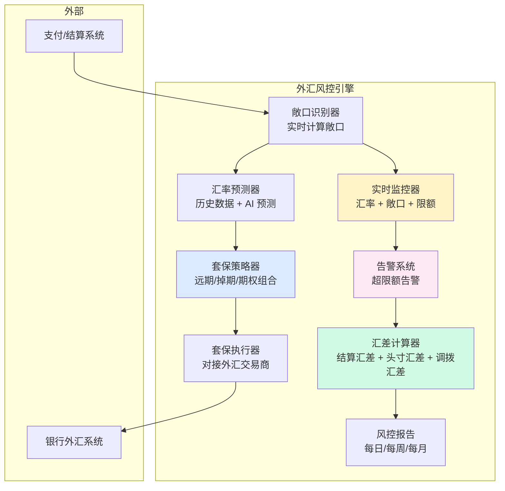

# 外汇风险与汇兑损益管理（深度）

> **系列第 14 篇 · 深度**
> 上一篇 [13_对账引擎设计与差错自愈](./13_对账引擎设计与差错自愈-实战.md) 讲了钱怎么对账。本篇进入**第五层 · 风险与合规**——讲**外汇风险**——结算汇差 / 头寸汇差 / 调拨汇差 + 外汇套保 + 汇率风控 + 跨周期经验（2015-2025 汇率波动）。

---

## 一句话定义

> **外汇风险的管理，核心是「结算汇差 + 头寸汇差 + 调拨汇差 + 外汇套保 + 汇率风控」五件事**。结算汇差是「**用户付款汇率 vs 实际结算汇率**」的差额，头寸汇差是「**公司持有外币头寸的汇率波动**」，调拨汇差是「**内部资金调拨的汇率差异**」；外汇套保通过「**远期 / 掉期 / 期权**」锁定汇率；汇率风控通过「**实时汇率监控 + 限额 + VaR**」控制敞口。**业内默认：** 头部公司用「**三种汇差管理 + 外汇套保 + 实时风控**」。

---

## 业务背景与价值

### 为什么「外汇风险」是核心难题？

入门读者以为「外汇 = 换汇」。但外汇风险的真实复杂度在**三种汇差 + 套保 + 风控**：

**三种汇差多变：**
- 结算汇差：用户付款汇率 vs 实际结算汇率（受汇率波动影响）
- 头寸汇差：公司外币头寸的汇率波动（持有 USD/EUR 等外币）
- 调拨汇差：内部资金调拨的汇率差异（子公司之间调拨）

**业内默认：** 三种汇差每年影响利润 **5%-15%**——**外汇管理是跨境支付公司利润的核心来源/黑洞**

### 过去 5 年的外汇风险演进（跨周期视角）

| 时间段 | 主流方案 | 关键事件 |
|---|---|---|
| 2015-2017 | **单边敞口期** | 公司持有外币头寸 + 不套保 + 汇率波动直接影响利润 |
| 2018-2020 | **被动套保期** | 开始用远期合约锁汇 + 但套保比例低（30%-50%） |
| 2021-2023 | **主动套保期** | 头部公司自研外汇风控系统 + 套保比例 80%+ + VaR 模型 |
| 2024-至今 | **智能套保期** | AI 预测汇率 + 自动套保 + 多策略组合 |

**关键洞察：** 5 年前外汇风险是「**单边敞口 + 不套保**」，现在变成「**主动套保 + 智能风控 + 多策略组合**」。**未来 AI 智能套保**——自动预测、自动套保、智能风控

### 监管意图：为什么外汇必须有风控？

监管对外汇有「硬性要求」：

1. **外汇登记**——跨境支付必须在外管局登记
2. **大额报送**——单笔超过 $50,000 必须报送外管局
3. **汇率合规**——汇率必须使用合规渠道（如银行间外汇市场）
4. **反洗钱**——可疑外汇交易必须拦截

**专家视角：** 4 条要求**决定了外汇管理必须有「**登记 + 报送 + 合规渠道 + 反洗钱**」**——不是简单的「换汇」

---

## 业务术语表

| 中文 | 英文 | 一句话解释 |
|---|---|---|
| 结算汇差 | Settlement Exchange Difference | 用户付款汇率 vs 实际结算汇率的差额 |
| 头寸汇差 | Position Exchange Difference | 公司外币头寸的汇率波动 |
| 调拨汇差 | Transfer Exchange Difference | 内部资金调拨的汇率差异 |
| 外汇套保 | FX Hedging | 用衍生品（远期 / 掉期 / 期权）锁定汇率 |
| 远期合约 | Forward Contract | 约定未来某日期按约定汇率交易的合约 |
| 掉期合约 | Swap Contract | 约定未来某日期交换两种货币的合约 |
| 期权合约 | Option Contract | 未来某日期按约定汇率交易的权利（不是义务） |
| 汇率敞口 | FX Exposure | 未对冲的外汇风险金额 |
| 敞口比例 | Exposure Ratio | 未对冲金额 / 总外币金额 |
| 套保比例 | Hedging Ratio | 已对冲金额 / 总外币金额 |
| VaR (Value at Risk) | 风险价值模型 | 在一定置信水平下，未来一段时间内最大损失 |
| 限额 | Limit | 单笔 / 单日 / 单月外汇限额 |
| 实时监控 | Real-Time Monitoring | 汇率 / 敞口 / 限额实时监控 |
| 多策略组合 | Multi-Strategy Portfolio | 远期 + 掉期 + 期权组合 |
| 智能套保 | Smart Hedging | AI 自动预测汇率 + 自动套保 |
| 隔夜敞口 | Overnight Exposure | 隔夜持有的外汇敞口（按当天汇率重估） |
| 日间敞口 | Intraday Exposure | 交易时段持有的外汇敞口 |
| 结算汇率 | Settlement Rate | 实际结算时使用的汇率 |
| 参考汇率 | Reference Rate | 央行或权威机构发布的汇率（如央行中间价） |

---

## 业务形态与模式：三种汇差详解

### 汇差 1：结算汇差（Settlement Exchange Difference）

**是什么：** 用户付款时锁定的汇率 vs 实际结算时使用的汇率的差额

**常见场景：**
- 用户付款时按 USD/EUR = 1.10 锁定，但实际结算时 USD/EUR = 1.12，公司多收 2%
- 用户付款时按 USD/CNY = 7.00 锁定，但实际结算时 USD/CNY = 7.10，公司少收 1.4%
- 用户付款时按 USD/JPY = 150 锁定，但实际结算时 USD/JPY = 148，公司多收 1.3%

**结算汇差的影响：**
- 正面：用户付款时锁定汇率，实际结算时汇率对公司有利 → 公司多收（汇差收益）
- 负面：用户付款时锁定汇率，实际结算时汇率对公司不利 → 公司少收（汇差损失）
- 业内默认：**结算汇差占公司利润的 1%-5%**（双向波动）

**管理方式：**
- **缩短结算周期**（T+0 实时结算 vs T+1 批量结算）
- **锁定汇率波动幅度**（如 ±2%）
- **建立结算汇差缓冲**（如 0.5%）

### 汇差 2：头寸汇差（Position Exchange Difference）

**是什么：** 公司持有外币头寸（USD/EUR 等）的汇率波动

**常见场景：**
- 公司持有 USD 1000 万，USD/CNY 从 7.00 跌到 6.90 → 公司损失 100 万人民币
- 公司持有 EUR 500 万，USD/EUR 从 1.10 涨到 1.15 → 公司损失 25 万美元
- 公司持有 JPY 1 亿，USD/JPY 从 150 跌到 145 → 公司损失 33 万美元

**头寸汇差的影响：**
- 正面：汇率对公司有利 → 头寸升值（汇差收益）
- 负面：汇率对公司不利 → 头寸贬值（汇差损失）
- 业内默认：**头寸汇差占公司利润的 3%-10%**（双向波动，敞口大）

**管理方式：**
- **减少隔夜敞口**（当天结清外币头寸）
- **套期保值**（用远期 / 掉期锁定汇率）
- **多元化外币**（不集中持有单一外币）

### 汇差 3：调拨汇差（Transfer Exchange Difference）

**是什么：** 内部资金调拨（如子公司之间调拨）产生的汇率差异

**常见场景：**
- 香港子公司调拨 100 万 USD 到新加坡子公司，USD/SGD 从 1.35 涨到 1.40 → 公司损失 5 万 SGD
- 美国子公司调拨 50 万 EUR 到英国子公司，EUR/GBP 从 0.85 跌到 0.82 → 公司损失 1.5 万 GBP
- 内部账户调拨（USD 账户 vs EUR 账户）汇率换算差异

**调拨汇差的影响：**
- 正面：汇率对调拨有利 → 调拨收益
- 负面：汇率对调拨不利 → 调拨损失
- 业内默认：**调拨汇差占公司利润的 0.5%-2%**（双向波动，可控）

**管理方式：**
- **集中调拨**（统一时点调拨，避免频繁调拨）
- **提前锁定汇率**（调拨前锁汇）
- **减少跨币种调拨**（同币种直接调拨）

### 决策矩阵

| 汇差类型 | 影响占比 | 业内默认 | 管理方式 |
|---|---|---|---|
| **结算汇差** | 1%-5% | 双向波动 | 缩短周期 + 锁定波动幅度 + 缓冲 |
| **头寸汇差** | 3%-10% | 敞口大 | 减少隔夜 + 套保 + 多元化 |
| **调拨汇差** | 0.5%-2% | 可控 | 集中调拨 + 提前锁汇 + 同币种 |

**专家视角：** **三种汇差是叠加的**——业内默认是「**结算汇差 1%-5% + 头寸汇差 3%-10% + 调拨汇差 0.5%-2%**」，总影响 **5%-15%**。**外汇管理是跨境支付公司利润的核心来源/黑洞**

---

## 业务流程图：外汇风险管理的核心流程

**关键观察：**
- 外汇管理**双向**（监控 + 调仓）
- 套保策略**多组合**（远期 + 掉期 + 期权）
- 实时监控**必须**（汇率波动 + 敞口限额）

---

## 系统架构：外汇风险管理的模块边界

**关键设计：**
- 外汇风控引擎**多模块**（8 个核心模块）
- 套保策略**多组合**（远期 + 掉期 + 期权）
- 实时监控**必须**（汇率 + 敞口 + 限额）

---

## 服务模型：3 种套保策略对比

### 策略 1：远期合约（Forward）

**机制：**
- 约定未来某日期按约定汇率交易
- 锁定汇率（不锁定交易金额）
- 必须履行（不是权利）

**优势：**
- 简单（约定汇率 + 日期）
- 锁定汇率（消除汇率波动）
- 成本低（无期权费）

**劣势：**
- 必须履行（汇率有利也不能取消）
- 信用风险（对手方违约风险）
- 流动性差（提前平仓困难）

**适合：** 明确知道未来外汇需求的场景（如 T+1 结算的固定金额）

### 策略 2：掉期合约（Swap）

**机制：**
- 约定未来某日期交换两种货币
- 同时锁定汇率 + 交换货币
- 必须履行（不是权利）

**优势：**
- 同时锁定汇率 + 交换货币
- 适合跨币种调拨
- 成本适中（无期权费）

**劣势：**
- 必须履行
- 信用风险
- 流动性差

**适合：** 内部跨币种调拨的场景

### 策略 3：期权合约（Option）

**机制：**
- 未来某日期按约定汇率交易的**权利**（不是义务）
- 锁定汇率下界（put option）或上界（call option）
- 可选择履行或不履行

**优势：**
- 灵活（汇率有利可放弃）
- 锁定汇率下界（put）或上界（call）
- 适合不确定外汇需求的场景

**劣势：**
- 成本高（需支付期权费）
- 复杂（需理解希腊字母 Delta/Gamma/Theta/Vega）
- 流动性中等

**适合：** 不确定外汇需求的场景（如浮动金额结算）

### 决策矩阵

| 策略 | 优势 | 代价 | 适合谁 |
|---|---|---|---|
| **远期** | 简单 + 锁汇 + 成本低 | 必须履行 + 信用风险 + 流动性差 | 固定金额结算 |
| **掉期** | 锁汇 + 换币 + 成本适中 | 必须履行 + 信用风险 + 流动性差 | 跨币种调拨 |
| **期权** | 灵活 + 锁上下界 + 适合不确定 | 成本高 + 复杂 + 流动性中等 | 浮动金额结算 |

**专家视角：** **套保策略不是单一，是组合**——业内默认是「**远期 60% + 掉期 20% + 期权 20%**」的组合。**单一策略不够，必须组合**

---

## 核心功能用例

### 用例 1：标准结算汇差管理

**场景：** 用户付款 $10,000，锁定 USD/EUR = 1.10，T+1 结算

**流程：**
- 用户付款时锁定 USD/EUR = 1.10
- 公司记录锁定汇率 1.10
- T+1 实际结算时 USD/EUR = 1.12
- 结算汇差 = 1.12 - 1.10 = +2%（公司多收）
- 结算汇差金额 = $10,000 × 2% = $200

**管理方式：**
- 缩短结算周期（T+0 vs T+1）
- 锁定汇率波动幅度（如 ±2%）
- 建立结算汇差缓冲（0.5%）

### 用例 2：头寸汇差套保

**场景：** 公司持有 USD 1000 万头寸，担心 USD/CNY 下跌

**流程：**
- 识别敞口：USD 1000 万
- 预测汇率：AI 预测 USD/CNY 可能下跌
- 套保策略：用远期合约锁汇 USD/CNY = 7.00
- 执行套保：与银行签订远期合约 USD 1000 万 @ 7.00
- 到期履行：按 7.00 结算
- 套保比例：100%（完全对冲）

**时延：** T+1 - T+30（按合约期限）

### 用例 3：实时汇率监控 + 告警

**场景：** USD/CNY 突然下跌 3%，触发告警

**流程：**
- 实时监控汇率变化
- 汇率波动 > 2% 触发告警
- 告警内容：敞口金额 + 潜在损失 + 建议处理
- 人工介入：财务 / 风控人员介入
- 调仓决策：减仓 / 加仓 / 锁汇

**时延：** 实时（秒级）

---

## 业务打法与策略：不同公司的外汇管理选择

### 头部公司（年 GMV > 100 亿美元）

**典型做法：**
- **三种汇差全管理**（结算 + 头寸 + 调拨）
- **多策略组合套保**（远期 + 掉期 + 期权）
- **AI 汇率预测 + 自动套保**
- **实时汇率监控 + VaR 模型**
- **外汇风控报告**（每日 / 每周 / 每月）

**业内认知：** 头部公司的外汇管理是「**三种汇差 + 多策略 + AI 预测 + VaR 模型 + 风控报告**」的，能支撑主动套保 + 实时风控 + 智能决策。**这是 10+ 年技术积累的产物**

### 中型公司（年 GMV 1-100 亿美元）

**典型做法：**
- **两种汇差管理**（结算 + 头寸）
- **单策略套保**（远期为主）
- **被动汇率监控**（每日看一次）
- **无 VaR 模型**

**业内认知：** 中型公司的外汇管理是「**够用但不极致**」——能锁汇但不能实时风控。**演进需要 2-3 年**

### 小公司 / 新进入者（年 GMV < 1 亿美元）

**典型做法：**
- **单汇差管理**（结算汇差）
- **无套保**
- **汇率波动直接影响利润**

**业内认知：** 小公司的外汇管理是「**MVP 起步**」——能跑业务但风险大（汇率风险敞口大）。**先跑起来再说**

---

## Trade-off 分析

### 决策 1：不套保 vs 被动套保 vs 主动套保

| 选项 | 优势 | 代价 | 适合谁 |
|---|---|---|---|
| **不套保** | 简单 + 无套保成本 | 汇率风险敞口大（损失 5%-15%） | 小公司 / 早期 |
| **被动套保**（30%-50%） | 部分对冲 + 成本适中 | 未对冲部分仍有风险 | 中型公司 |
| **主动套保**（80%+） | 大部分对冲 + 风险可控 | 套保成本高（0.1%-0.5%） | 头部公司 |

**专家视角：** **套保比例是取舍**——业内默认是「**主动套保 80%+ + 期权锁上下界**」。**单一档位不够，必须组合**

### 决策 2：单一策略 vs 多策略组合

| 选项 | 优势 | 代价 | 适合谁 |
|---|---|---|---|
| **单一策略**（远期） | 简单 + 成本低 | 不灵活（必须履行） | 中型公司 |
| **双策略组合**（远期 + 掉期） | 平衡 + 适合跨币种调拨 | 复杂度增加 | 中型公司 |
| **三策略组合**（+ 期权） | 灵活 + 锁上下界 + 适合不确定 | 成本高 + 复杂 | 头部公司 |

**专家视角：** **策略不是越多越好**——是「**业务需求 + 团队能力 + 套保成本**」的取舍。**业内默认：** 头部公司必须「**三策略组合**」

### 决策 3：被动监控 vs 实时监控

| 选项 | 优势 | 代价 | 适合谁 |
|---|---|---|---|
| **被动监控**（每日看一次） | 简单 + 成本低 | 反应慢（24 小时延迟） | 小公司 |
| **实时监控**（秒级） | 反应快 + 自动告警 | 系统复杂 + 运维成本高 | 头部公司 |
| **AI 智能监控**（预测 + 自动） | 提前预判 + 自动调仓 | 系统极复杂 + 团队要求高 | 头部公司 |

**专家视角：** **实时监控是头部标配**——业内默认是「**实时监控 + AI 预测 + 自动告警**」。**单一监控不够，必须实时**

---

## 行业洞察 / 业内认知

### 不成文标准：外汇管理的真实复杂度

公开规则：外汇管理 = 单一汇率换算。

**业内实际复杂度（业内默认）：**

| 维度 | 真实复杂度 | 业内默认 |
|---|---|---|
| 汇差类型 | **3 种** | 头部公司（结算 + 头寸 + 调拨） |
| 套保策略 | **3 种组合** | 远期 60% + 掉期 20% + 期权 20% |
| 套保比例 | **80%+** | 头部公司 |
| 汇率监控 | **实时（秒级）** | 头部公司 |
| 风控模型 | **VaR 模型** | 头部公司 |
| 外汇敞口 | **< 5%** | 头部公司（占总外币金额） |
| 汇差影响 | **5%-15%** | 占公司年利润 |
| 套保成本 | **0.1%-0.5%** | 占套保金额 |
| AI 智能套保 | **已落地** | 头部公司（2024 起） |

**专家视角：** 外汇管理的真实复杂度是「**3 汇差 + 3 策略 + 80% 套保 + 实时监控 + VaR 模型 + < 5% 敞口**」。**业内默认：** 头部公司外汇管理必须有「**三种汇差 + 多策略组合 + 主动套保 + 实时监控 + AI 预测**」

### 真实事故：外汇风险引发重大损失

公开报道：2022 年某中型跨境支付公司因未套保 + 美元升值，公司持有 USD 5000 万头寸 6 个月，期间 USD/CNY 从 6.50 跌到 7.20，公司损失 **5000 万 × 10% = 5000 万人民币**。事故引发：
- 季度亏损 5000 万
- 股东问责
- 高管离职
- 后续 6 个月业务收缩

**业内流传的处理方式：** 头部公司后来强制外汇管理必须经过：
- 三种汇差全管理（结算 + 头寸 + 调拨）
- 多策略组合套保（远期 + 掉期 + 期权）
- 套保比例 80%+
- 实时汇率监控 + VaR 模型
- AI 智能预测 + 自动套保
- 外汇敞口限额（< 5%）
- 风控报告（每日 / 每周 / 每月）

**教训：** 外汇风险的「真实成本」不是汇率波动本身，是「**利润损失 + 股东问责 + 高管离职 + 业务收缩**」。**业内默认：** 头部公司外汇管理必须有「**主动套保 + 实时监控 + VaR 模型 + AI 预测**」五重保险

### 从业者挑战：外汇管理的 5 个核心难题

跨境支付公司常见的内部挑战：外汇管理的 5 个核心难题。

**1. 汇率预测难**

汇率受多因素影响（利率 / 通胀 / 政治 / 黑天鹅）。**业内默认：** 必须有「**AI 汇率预测 + 历史数据 + 宏观指标**」

**2. 套保成本控制难**

套保有成本（期权费 + 资金占用）。**业内默认：** 必须有「**套保成本优化 + 多策略组合**」

**3. 实时监控难**

汇率波动快（秒级）。**业内默认：** 必须有「**实时汇率监控 + 自动告警 + 自动调仓**」

**4. 监管合规难**

外汇监管严（报送 + 反洗钱）。**业内默认：** 必须有「**自动报送 + 反洗钱 + 合规渠道**」

**5. 跨周期管理难**

不同周期汇率波动不同（年度 / 季度 / 月度）。**业内默认：** 必须有「**跨周期经验 + 周期模型**」

**专家视角：** 5 个核心难题的真实门槛不是技术实现，是「**业务理解 + 团队协作 + 长期运维**」。**业内默认：** 外汇管理团队必须有「**汇率分析师 + 套保专家 + 风控专家 + 合规专家 + 系统架构师**」五方协作

---

## 业务前景与趋势

### 未来 3-5 年的 4 个结构性变化

**1. AI 智能套保**

传统套保（按规则）→ **AI 智能套保**（按预测）。**对参与方格局的启示：** AI 智能套保能力成为头部支付公司的核心资产

**2. 多币种实时结算**

单币种结算 → **多币种实时结算**。**对参与方格局的启示：** 多币种实时结算能力成为头部支付公司的护城河

**3. 区块链跨境结算**

传统银行结算 → **区块链跨境结算**。**对参与方格局的启示：** 银行外汇结算网络可能被部分替代

**4. 监管科技（RegTech）集成**

传统外汇合规 → **RegTech 集成**（自动报送 / 自动合规）。**对参与方格局的启示：** 监管科技能力成为头部支付公司的差异化优势

---

## 一句话总结

> **外汇风险的管理，核心是「结算汇差 + 头寸汇差 + 调拨汇差 + 外汇套保 + 汇率风控」五件事**。结算汇差是「**用户付款汇率 vs 实际结算汇率**」的差额，头寸汇差是「**公司持有外币头寸的汇率波动**」，调拨汇差是「**内部资金调拨的汇率差异**」；外汇套保通过「**远期 60% + 掉期 20% + 期权 20%**」组合锁定汇率；汇率风控通过「**实时汇率监控 + 限额 + VaR 模型 + AI 预测**」控制敞口（< 5%）。**业内默认：** 头部公司用「**三种汇差管理 + 多策略组合 + 主动套保 + 实时风控 + AI 预测**」。

---

## 📌 数据与事实声明

本文涉及的外汇风险管理、汇差管理、套保策略等内容是跨境支付公司外汇管理的通用认知，但具体到：

- 各家支付公司的外汇敞口比例、套保比例、汇率监控频率以各公司实际为准
- 远期 / 掉期 / 期权的具体组合比例（60%/20%/20%）以各公司业务为准
- 套保成本（0.1%-0.5%）、汇差影响（5%-15%）等具体数字基于业内默认范围，**不是承诺**
- 监管要求（外汇登记 / 大额报送）以监管最新要求为准
- VaR 模型、AI 汇率预测等具体实现以各公司技术能力为准

不要直接引用本文作为外汇管理设计依据或选型依据。

---

## 下一篇预告

下一篇 [15_拒付、退款与资金逆向-深度](./15_拒付退款与资金逆向-深度.md) 将继续**第五层 · 风险与合规**——讲**拒付与退款**——拒付四阶段（CB / RD / 3DS）+ 退款逆向清分 + 资金回流 + 风险监控 + 业内头部真实选型案例。