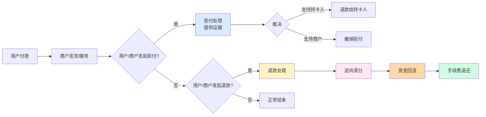
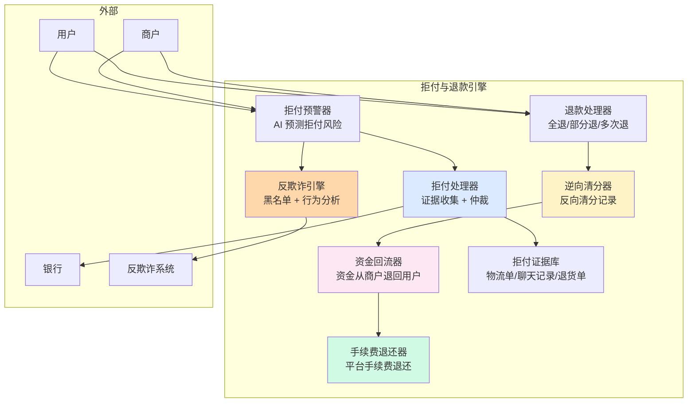

# 拒付、退款与资金逆向（深度）

> **系列第 15 篇 · 深度**
> 上一篇 [14_外汇风险与汇兑损益管理](./14_外汇风险与汇兑损益管理-深度.md) 讲了外汇怎么管。本篇继续**第五层 · 风险与合规**——讲**拒付与退款**——拒付四阶段（CB / RD / 3DS）+ 退款逆向清分 + 资金回流 + 风险监控 + 业内头部真实选型案例。

---

## 一句话定义

> **拒付与退款的管理，核心是「拒付四阶段 + 退款逆向清分 + 资金回流 + 风险监控」四件事**。拒付按「**CB（持卡人拒付）/ RD（收款方拒付）/ 3DS 责任转移 / 欺诈拒付**」4 阶段处理；退款按「**全退 / 部分退 / 多次退**」3 档处理；逆向清分按「**反向清分 + 资金回流 + 手续费退还**」3 步走；风险监控按「**拒付率监控 + 黑名单 + 行为分析**」3 层防。**业内默认：** 头部公司拒付率 **< 1%**，退款率 **< 5%**，资金回流 T+0 - T+3。

---

## 业务背景与价值

### 为什么「拒付与退款」是核心难题？

入门读者以为「拒付 = 用户投诉 + 退钱」。但拒付与退款的真实复杂度在**拒付四阶段 + 退款三档 + 逆向清分 + 风险监控**：

**拒付多变：**
- CB 拒付（持卡人拒付，最常见）
- RD 拒付（收款方拒付）
- 3DS 责任转移（3DS 验证失败后由发卡行担责）
- 欺诈拒付（盗刷、伪卡）

**退款多档：**
- 全退（100% 退款）
- 部分退（部分金额退款）
- 多次退（同一订单多次部分退款）

**业内默认：** 跨境支付拒付率 **1%-3%**，退款率 **5%-15%**——**拒付与退款直接影响利润 + 用户体验 + 监管风险**

### 过去 5 年的拒付与退款演进（跨周期视角）

| 时间段 | 主流方案 | 关键事件 |
|---|---|---|
| 2015-2017 | **人工处理期** | 客服人员人工处理 + Excel 记录 + 银行电汇退款 |
| 2018-2020 | **自动处理期** | 开始用退款系统自动处理 + 自动清分回滚 |
| 2021-2023 | **智能化期** | 头部公司自研拒付预警 + 智能退款 + 资金回流自动化 |
| 2024-至今 | **AI 智能期** | AI 预测拒付风险 + 智能分流 + 自动对账 |

**关键洞察：** 5 年前拒付与退款是「**人工 + Excel**」，现在变成「**智能化 + AI 预测 + 自动对账**」。**未来 AI 全自动**——AI 预测风险、AI 自动处理、AI 自动对账

### 监管意图：为什么拒付与退款必须有风控？

监管对拒付与退款有「硬性要求」：

1. **拒付可追溯**——任何一笔拒付必须在 5 分钟内定位原因
2. **退款时效**——退款必须在 7 个工作日内到账（Visa/MasterCard 规定）
3. **欺诈报送**——单笔欺诈超过 $1,000 必须报送
4. **3DS 合规**——欧洲、印度的 3DS 必须强制使用

**专家视角：** 4 条要求**决定了拒付与退款管理必须有「**可追溯 + 时效 + 报送 + 3DS 合规**」**——不是简单的「退钱」

---

## 业务术语表

| 中文 | 英文 | 一句话解释 |
|---|---|---|
| 拒付 | Chargeback | 持卡人/收款方/银行对已完成的交易提出异议 |
| CB 拒付 | Cardholder Chargeback | 持卡人拒付（最常见） |
| RD 拒付 | Receiver Chargeback | 收款方拒付 |
| 3DS 责任转移 | 3D Secure Liability Shift | 3DS 验证失败后由发卡行担责 |
| 欺诈拒付 | Fraud Chargeback | 盗刷、伪卡等欺诈行为导致的拒付 |
| 退款 | Refund | 把已支付的款项退还给用户 |
| 全退 | Full Refund | 100% 金额退款 |
| 部分退 | Partial Refund | 部分金额退款 |
| 多次退 | Multiple Refund | 同一订单多次部分退款 |
| 逆向清分 | Reverse Clearing | 反向清分（冲销原清分记录） |
| 资金回流 | Fund Reversal | 把资金从商户退回给用户 |
| 手续费退还 | Fee Refund | 把平台手续费退还给商户 |
| 拒付率 | Chargeback Rate | 拒付笔数 / 总笔数（业内 < 1%） |
| 退款率 | Refund Rate | 退款笔数 / 总笔数（业内 < 5%） |
| 拒付预警 | Chargeback Alert | 提前预警可能的拒付 |
| 黑名单 | Blacklist | 高风险用户/商户名单 |
| 行为分析 | Behavior Analysis | 用户/商户行为模式分析 |
| 拒付证据 | Chargeback Evidence | 商户反驳拒付的证据材料 |
| 仲裁 | Arbitration | 拒付争议的最终裁决 |
| 拒付码 | Reason Code | 拒付的具体原因代码 |
| 拒付时效 | Chargeback Window | 拒付可发起的时间窗口（Visa 120 天 / MasterCard 120 天） |
| 退款时效 | Refund Window | 退款可发起的时间窗口（通常 180 天） |

---

## 业务形态与模式：拒付四阶段详解

### 拒付 1：CB 拒付（Cardholder Chargeback）

**是什么：** 持卡人对已完成交易提出异议，要求退款

**常见原因：**
- 商品未收到
- 商品与描述不符
- 商品损坏
- 未授权交易（盗刷）
- 重复扣款
- 服务不满意

**处理流程：**
- 持卡人向发卡行发起拒付
- 发卡行向收单行发起拒付
- 收单行通知商户提供证据
- 商户提供证据（物流单 / 聊天记录 / 退货单）
- 发卡行裁决（支持持卡人 / 支持商户）
- 退款给持卡人 / 撤销拒付

**业内默认：** CB 拒付占拒付总量的 **70%-80%**——**最常见的拒付类型**

### 拒付 2：RD 拒付（Receiver Chargeback）

**是什么：** 收款方（商户）对已收到的款项提出异议

**常见原因：**
- 重复入账
- 金额错误
- 交易未授权
- 系统问题

**处理流程：**
- 商户向支付服务商发起拒付
- 支付服务商核实
- 处理退款/调整

**业内默认：** RD 拒付占拒付总量的 **5%-10%**——**较少见的拒付类型**

### 拒付 3：3DS 责任转移（3D Secure Liability Shift）

**是什么：** 3DS 验证失败后，拒付责任从商户转移到发卡行

**常见场景：**
- 3DS 验证失败（如密码错误）
- 3DS 验证超时
- 3DS 验证未完成
- 3DS 验证异常

**处理流程：**
- 3DS 验证失败
- 拒付发生时责任转移给发卡行
- 商户不承担拒付损失

**业内默认：** 3DS 责任转移占拒付总量的 **10%-20%**——**3DS 是降低商户拒付风险的核心机制**

### 拒付 4：欺诈拒付（Fraud Chargeback）

**是什么：** 盗刷、伪卡等欺诈行为导致的拒付

**常见场景：**
- 信用卡被盗刷
- 伪卡交易
- 身份盗用
- 账户盗用

**处理流程：**
- 持卡人发现盗刷
- 向发卡行发起拒付
- 发卡行核实后退款
- 发卡行可能向收单行追偿

**业内默认：** 欺诈拒付占拒付总量的 **5%-15%**——**风险最高的拒付类型**

### 决策矩阵

| 拒付类型 | 占比 | 业内默认 | 处理方式 |
|---|---|---|---|
| **CB 拒付** | 70%-80% | 最常见 | 提供证据 + 仲裁 |
| **RD 拒付** | 5%-10% | 较少见 | 核实后处理 |
| **3DS 责任转移** | 10%-20% | 3DS 失败 | 商户不担责 |
| **欺诈拒付** | 5%-15% | 风险最高 | 反欺诈 + 黑名单 |

**专家视角：** **拒付处理是分级**——CB 拒付需提供证据，3DS 转移商户不担责，欺诈拒付必须反欺诈。**业内默认：** 头部公司必须「**拒付预警 + 反欺诈 + 3DS 合规 + 证据管理**」

---

## 业务流程图：拒付与退款的核心流程

**关键观察：**
- 拒付与退款**分叉**（拒付走证据 + 仲裁，退款走逆向清分）
- 退款流程**多步**（逆向清分 + 资金回流 + 手续费退还）
- 拒付证据**必须**（商户反驳拒付的核心）

---

## 系统架构：拒付与退款管理的模块边界

**关键设计：**
- 拒付预警**前置**（在拒付发生前预警）
- 拒付处理**多证据**（物流单 / 聊天记录 / 退货单）
- 退款处理**多档**（全退 / 部分退 / 多次退）
- 逆向清分**必须**（冲销原清分记录）

---

## 服务模型：3 档退款处理

### 档位 1：全退（Full Refund）

**机制：**
- 100% 金额退款
- 一次性退款完成
- 手续费全额退还
- 资金回流 T+0 - T+1

**优势：**
- 简单（一次性处理）
- 用户体验好（用户收到全款）
- 流程清晰

**劣势：**
- 灵活性差（不能部分退）
- 风险（恶意全退骗货）

**适合：** 商品未收到 / 商品与描述严重不符 / 服务未提供

### 档位 2：部分退（Partial Refund）

**机制：**
- 部分金额退款（如 30% / 50% / 70%）
- 一次性部分退款
- 手续费按比例退还
- 资金回流 T+0 - T+1

**优势：**
- 灵活（按实际损失退款）
- 平衡用户与商户利益
- 适合多数场景

**劣势：**
- 复杂（需要计算部分金额）
- 用户体验一般（用户收到部分退款）

**适合：** 商品部分损坏 / 服务部分不满意 / 折扣协商

### 档位 3：多次退（Multiple Refund）

**机制：**
- 同一订单多次部分退款
- 累计退款金额不超过原金额
- 每次退款都需记录
- 资金回流分多次

**优势：**
- 最灵活（分多次退）
- 适合复杂场景（如分批退货）

**劣势：**
- 最复杂（需要追踪多次记录）
- 风险（多次退款可能超过原金额）
- 审计难

**适合：** 分批退货 / 分批服务 / 分期退款

### 决策矩阵

| 档位 | 优势 | 代价 | 适合谁 |
|---|---|---|---|
| **全退** | 简单 + 用户体验好 + 流程清晰 | 灵活性差 + 风险 | 严重不符 |
| **部分退** | 灵活 + 平衡 + 适合多数 | 复杂 + 用户体验一般 | 部分损坏 |
| **多次退** | 最灵活 + 适合复杂 | 最复杂 + 风险 + 审计难 | 分批退货 |

**专家视角：** **退款档位是分级的**——业内默认是「**全退 60% + 部分退 30% + 多次退 10%**」的组合。**单一档位不够，必须组合**

---

## 核心功能用例

### 用例 1：标准 CB 拒付处理

**场景：** 用户购买商品后未收到，发起 CB 拒付

**流程：**
- 用户向发卡行发起拒付
- 发卡行向收单行发起拒付
- 收单行通知商户提供证据
- 商户提供证据（物流单 / 快递签收记录）
- 发卡行裁决（支持商户）
- 撤销拒付

**时延：** 7-30 天（Visa 120 天拒付窗口）

### 用例 2：部分退款

**场景：** 用户购买 $100 商品，发现部分损坏，要求退 30%

**流程：**
- 用户发起部分退款 $30
- 商户确认
- 平台处理部分退款
- 逆向清分（冲销原清分记录中的 $30）
- 资金回流（$30 从商户退回用户）
- 手续费退还（按 30% 比例退还）

**时延：** T+0 - T+1（资金回流）

### 用例 3：欺诈拒付拦截

**场景：** 用户信用卡被盗刷，发起拒付

**流程：**
- 反欺诈引擎识别异常交易
- 拦截该交易
- 标记高风险用户/商户
- 加入黑名单
- 拒绝后续交易

**时延：** 秒级（实时拦截）

### 用例 4：3DS 责任转移

**场景：** 用户购物时 3DS 验证失败，发生拒付

**流程：**
- 3DS 验证失败
- 拒付发生时责任转移给发卡行
- 商户不担责
- 商户只需提供 3DS 失败证据

**时延：** 7-30 天（拒付处理）

---

## 业务打法与策略：不同公司的拒付与退款管理选择

### 头部公司（年 GMV > 100 亿美元）

**典型做法：**
- **拒付四阶段全管理**（CB / RD / 3DS / 欺诈）
- **AI 拒付预警**（提前预测拒付风险）
- **智能退款分流**（全退 / 部分退 / 多次退自动判断）
- **反欺诈引擎**（黑名单 + 行为分析 + 机器学习）
- **拒付证据库**（物流单 / 聊天记录 / 退货单自动归档）
- **拒付率 < 1%**，退款率 < 5%

**业内认知：** 头部公司的拒付与退款管理是「**四阶段 + AI 预警 + 智能退款 + 反欺诈 + 证据库**」的，能支撑拒付率 < 1% + 退款率 < 5% + 资金回流 T+0。**这是 10+ 年技术积累的产物**

### 中型公司（年 GMV 1-100 亿美元）

**典型做法：**
- **拒付两阶段管理**（CB / 欺诈）
- **拒付预警**（基于规则）
- **退款分档**（全退 / 部分退）
- **简单反欺诈**（黑名单为主）
- **拒付率 1%-3%**，退款率 5%-15%

**业内认知：** 中型公司的拒付与退款管理是「**够用但不极致**」——能处理但不能提前预警。**演进需要 2-3 年**

### 小公司 / 新进入者（年 GMV < 1 亿美元）

**典型做法：**
- **拒付单阶段管理**（仅 CB 拒付）
- **无拒付预警**
- **退款单档**（仅全退）
- **无反欺诈**
- **拒付率 > 3%**，退款率 > 15%

**业内认知：** 小公司的拒付与退款管理是「**MVP 起步**」——能跑业务但风险大（拒付率 / 退款率高）。**先跑起来再说**

---

## Trade-off 分析

### 决策 1：拒付率容忍度

| 选项 | 优势 | 代价 | 适合谁 |
|---|---|---|---|
| **低拒付率**（< 0.5%） | 风险低 + 监管友好 + 商户信任 | 严格审核 + 影响转化率 | 头部公司 |
| **中拒付率**（1%-3%） | 平衡 + 转化率较好 | 监管关注 | 中型公司 |
| **高拒付率**（> 3%） | 转化率高 | 监管风险 + 商户流失 | 小公司 |

**专家视角：** **拒付率是取舍**——业内默认是「**拒付率 < 1% + 严格审核 + 转化率合理**」。**单一档位不够，必须分级**

### 决策 2：退款处理档位

| 选项 | 优势 | 代价 | 适合谁 |
|---|---|---|---|
| **单档**（仅全退） | 简单 | 不灵活 | 小公司 |
| **双档**（全退 + 部分退） | 平衡 + 灵活 | 复杂度增加 | 中型公司 |
| **三档**（+ 多次退） | 最灵活 + 适合复杂 | 复杂 + 风险 | 头部公司 |

**专家视角：** **退款档位不是越多越好**——是「**业务需求 + 团队能力 + 风险控制**」的取舍。**业内默认：** 头部公司必须「**三档组合**」

### 决策 3：反欺诈强度

| 选项 | 优势 | 代价 | 适合谁 |
|---|---|---|---|
| **弱反欺诈**（黑名单） | 简单 + 误判少 | 漏判多 | 小公司 |
| **中反欺诈**（黑名单 + 行为分析） | 平衡 | 复杂度增加 | 中型公司 |
| **强反欺诈**（+ 机器学习） | 高准确率 | 误判多 + 运维成本高 | 头部公司 |

**专家视角：** **反欺诈强度是取舍**——业内默认是「**黑名单 + 行为分析 + 机器学习**」的组合。**单一反欺诈不够，必须组合**

---

## 行业洞察 / 业内认知

### 不成文标准：拒付与退款的真实复杂度

公开规则：拒付与退款 = 用户投诉 + 退钱。

**业内实际复杂度（业内默认）：**

| 维度 | 真实复杂度 | 业内默认 |
|---|---|---|
| 拒付类型 | **4 类** | 头部公司（CB / RD / 3DS / 欺诈） |
| 退款档位 | **3 档** | 全退 / 部分退 / 多次退 |
| 拒付率 | **< 1%** | 头部公司 |
| 退款率 | **< 5%** | 头部公司 |
| 拒付预警 | **AI 预测** | 头部公司（提前 7-30 天预警） |
| 反欺诈 | **机器学习** | 头部公司 |
| 拒付证据 | **自动归档** | 头部公司 |
| 资金回流 | **T+0 - T+1** | 头部公司 |
| 退款时效 | **7 工作日内** | Visa/MasterCard 强制规定 |
| 拒付窗口 | **120 天** | Visa/MasterCard 强制规定 |
| 3DS 合规 | **强制** | 欧洲、印度等地区 |

**专家视角：** 拒付与退款的真实复杂度是「**4 类拒付 + 3 档退款 + < 1% 拒付率 + < 5% 退款率 + AI 预警 + 机器学习反欺诈 + T+0 资金回流**」。**业内默认：** 头部公司拒付与退款管理必须有「**四阶段 + AI 预警 + 智能退款 + 反欺诈 + 证据库 + T+0 回流**」

### 真实事故：拒付率过高被监管处罚

公开报道：2023 年某中型跨境支付公司因拒付率持续高于 3%（Visa 警告线为 1.5%），触发 Visa 强制监管：
- Visa 监控计划（持续 3 个月）
- 高风险商户强制下线（损失 20% 交易量）
- 罚款 500 万美元
- 后续 6 个月商户流失 30%

**业内流传的处理方式：** 头部公司后来强制拒付管理必须经过：
- 拒付四阶段全管理（CB / RD / 3DS / 欺诈）
- AI 拒付预警（提前 7-30 天预警）
- 智能退款分流（自动判断全退 / 部分退 / 多次退）
- 反欺诈引擎（黑名单 + 行为分析 + 机器学习）
- 拒付证据库（自动归档物流单 / 聊天记录 / 退货单）
- 拒付率 < 1% + 退款率 < 5%
- 资金回流 T+0 - T+1

**教训：** 拒付率过高的「真实成本」不是拒付本身，是「**监管处罚 + 商户流失 + 交易量损失 + 罚款**」。**业内默认：** 头部公司拒付管理必须有「**AI 预警 + 反欺诈 + 证据库 + < 1% 拒付率**」四重保险

### 从业者挑战：拒付与退款的 5 个核心难题

跨境支付公司常见的内部挑战：拒付与退款的 5 个核心难题。

**1. 拒付预警难**

拒付发生在交易后 7-120 天。**业内默认：** 必须有「**AI 拒付预警 + 历史数据 + 行为模型**」

**2. 反欺诈准确率难**

反欺诈误判影响正常用户。**业内默认：** 必须有「**机器学习 + 多维特征 + 实时调参**」

**3. 退款逆向清分难**

退款要冲销原清分记录。**业内默认：** 必须有「**逆向清分引擎 + 幂等设计 + 一致性保障**」

**4. 拒付证据管理难**

拒付证据（物流单 / 聊天记录 / 退货单）容易丢失。**业内默认：** 必须有「**拒付证据库 + 自动归档 + 长期保存**」

**5. 资金回流时效难**

Visa/MasterCard 要求 7 工作日内。**业内默认：** 必须有「**T+0 实时资金回流 + 自动退款 + 跨境资金调度**」

**专家视角：** 5 个核心难题的真实门槛不是技术实现，是「**业务理解 + 团队协作 + 长期运维 + 监管合规**」。**业内默认：** 拒付与退款团队必须有「**风控专家 + 反欺诈专家 + 法务专家 + 财务专家 + 系统架构师**」五方协作

---

## 业务前景与趋势

### 未来 3-5 年的 4 个结构性变化

**1. AI 拒付预警**

传统拒付处理（事后）→ **AI 拒付预警**（事前）。**对参与方格局的启示：** AI 拒付预警能力成为头部支付公司的核心资产

**2. 智能退款分流**

人工判断退款档位 → **AI 智能退款分流**。**对参与方格局的启示：** 智能退款能力成为头部支付公司的护城河

**3. 区块链拒付证据**

传统证据（物流单 / 聊天记录）→ **区块链拒付证据**。**对参与方格局的启示：** 区块链证据可能成为新的行业标准

**4. 监管科技（RegTech）集成**

传统拒付合规 → **RegTech 集成**（自动报送 / 自动合规）。**对参与方格局的启示：** 监管科技能力成为头部支付公司的差异化优势

---

## 一句话总结

> **拒付与退款的管理，核心是「拒付四阶段 + 退款逆向清分 + 资金回流 + 风险监控」四件事**。拒付按「**CB 70-80% + RD 5-10% + 3DS 转移 10-20% + 欺诈 5-15%**」4 阶段处理；退款按「**全退 60% + 部分退 30% + 多次退 10%**」3 档处理；逆向清分按「**反向清分 + 资金回流 + 手续费退还**」3 步走；风险监控按「**拒付率 < 1% + AI 预警 + 反欺诈 + 证据库**」3 层防。**业内默认：** 头部公司用「**四阶段 + AI 预警 + 智能退款 + 反欺诈 + 证据库 + T+0 回流**」。

---

## 📌 数据与事实声明

本文涉及的拒付与退款管理、退款档位、拒付率等内容是跨境支付公司风控管理的通用认知，但具体到：

- 各家支付公司的拒付率、退款率以各公司实际为准
- 拒付四阶段占比（CB / RD / 3DS / 欺诈）以各公司业务为准
- 退款档位占比（全退 / 部分退 / 多次退）以各公司业务为准
- 拒付预警时间（7-30 天）、资金回流时效（T+0 - T+1）以各公司能力为准
- Visa/MasterCard 拒付窗口（120 天）、退款时效（7 工作日）以卡组织最新规定为准
- 反欺诈模型、机器学习算法以各公司技术能力为准

不要直接引用本文作为拒付与退款管理设计依据或选型依据。

---

## 下一篇预告

下一篇 [16_跨境合规与监管口径演变-深度](./16_跨境合规与监管口径演变-深度.md) 将继续**第五层 · 风险与合规**——讲**跨境合规**——217 号文 / 断直连 / 备付金集中存管 + 跨境监管口径演变 + 反洗钱 + 数据跨境流动合规。