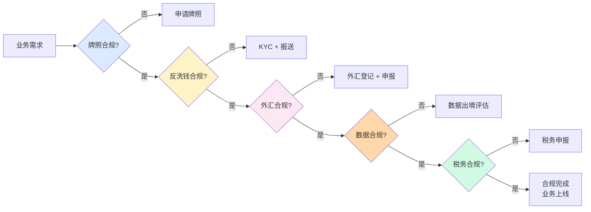
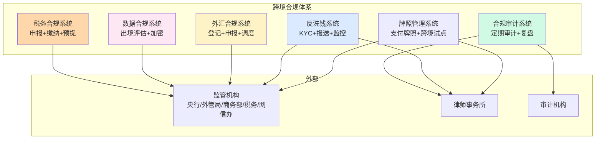

# 跨境合规与监管口径演变（全景）

> **系列第 16 篇 · 全景**
> 上一篇 [15_拒付、退款与资金逆向](./15_拒付退款与资金逆向-深度.md) 讲了拒付与退款怎么管。本篇是**第五层 · 风险与合规的最后一篇**——讲**跨境合规**——217 号文 / 断直连 / 备付金集中存管 + 跨境监管口径演变 + 反洗钱 + 数据跨境流动合规 + 5 年监管口径演进的真实故事。

---

## 一句话定义

> **跨境合规的管理，核心是「国内监管口径 + 国际监管口径 + 反洗钱 + 数据跨境 + 牌照与备案」五件事**。国内监管按「**央行 / 外管局 / 商务部 / 税务 / 网信办**」5 类；国际监管按「**BSA / AML / OFAC / GDPR / FATF**」5 类；反洗钱按「**KYC + 客户尽职调查 + 可疑交易报送 + 大额报送**」4 步；数据跨境按「**数据出境安全评估 + 标准合同 + 认证**」3 条路；牌照与备案按「**支付牌照 / 跨境支付试点 / 外汇登记 / 备付金存管**」4 类。**业内默认：** 头部公司必须有「**5+5 类监管口径 + 4 步反洗钱 + 3 条数据跨境 + 4 类牌照备案**」的完整合规体系。

---

## 业务背景与价值

### 为什么「跨境合规」是核心难题？

入门读者以为「合规 = 办牌照 + 反洗钱」。但跨境合规的真实复杂度在**国内监管 + 国际监管 + 反洗钱 + 数据跨境 + 牌照备案**：

**国内监管多变：**
- 央行（人民银行）：支付牌照、断直连、备付金集中存管
- 外管局：外汇登记、大额报送、跨境收支申报
- 商务部：跨境贸易试点、出口管制
- 税务：跨境税务申报、增值税
- 网信办：数据出境安全评估、个人信息保护

**国际监管多变：**
- BSA（美国银行保密法）
- AML（反洗钱）
- OFAC（美国财政部制裁名单）
- GDPR（欧盟通用数据保护条例）
- FATF（反洗钱金融行动特别工作组）

**业内默认：** 跨境支付公司每年合规成本占总收入 **5%-15%**——**合规是跨境支付公司的护城河/陷阱**

### 过去 5 年的跨境合规演进（跨周期视角）

| 时间段 | 主流方案 | 关键事件 |
|---|---|---|
| 2015-2017 | **野蛮生长期** | 跨境支付公司野蛮生长 + 监管宽松 + 套利空间 |
| 2018-2020 | **断直连期** | 央行断直连 + 备付金集中存管 + 217 号文 |
| 2021-2023 | **强监管期** | 反洗钱强化 + 数据跨境严格 + 牌照收紧 |
| 2024-至今 | **合规精细化期** | 数据出境安全评估 + 个人信息保护 + 跨境监管协同 |

**关键洞察：** 5 年前跨境合规是「**宽松 + 套利**」，现在变成「**强监管 + 合规精细化 + 数据保护**」。**未来合规智能化**——AI 监管报送、智能反洗钱、自动合规审计

### 监管意图：为什么跨境必须有合规？

监管对跨境支付有「硬性要求」：

1. **牌照合规**——必须有支付牌照 + 跨境支付试点
2. **反洗钱合规**——KYC + 可疑交易报送 + 大额报送
3. **外汇合规**——外汇登记 + 跨境收支申报
4. **数据合规**——数据出境安全评估 + 个人信息保护
5. **税务合规**——跨境税务申报 + 增值税

**专家视角：** 5 条要求**决定了跨境合规必须有「**牌照 + 反洗钱 + 外汇 + 数据 + 税务**」五重合规体系**——不是简单的「办个牌照」

---

## 业务术语表

| 中文 | 英文 | 一句话解释 |
|---|---|---|
| 跨境支付试点 | Cross-Border Payment Pilot | 央行的跨境支付试点资格 |
| 支付牌照 | Payment License | 央行发的非银行支付业务许可证 |
| 217 号文 | PBOC Notice 217 | 央行关于加强支付结算管理 防范电信网络新型违法犯罪有关事项的通知 |
| 断直连 | Disconnect Direct | 支付机构断开与银行的直连，通过清算机构（网联/银联）处理 |
| 备付金集中存管 | Reserve Centralized Custody | 支付机构客户备付金集中存管到央行指定账户 |
| 外汇登记 | FX Registration | 跨境支付必须在外管局登记 |
| 大额报送 | Large-Amount Reporting | 单笔超过 $50,000 必须报送外管局 |
| 反洗钱 | Anti-Money Laundering (AML) | 防止通过跨境支付洗钱 |
| KYC | Know Your Customer | 客户身份识别 |
| 客户尽职调查 | Customer Due Diligence (CDD) | 深入了解客户背景、资金来源 |
| 可疑交易报送 | Suspicious Transaction Reporting (STR) | 发现可疑交易必须报送 |
| 大额报送 | Currency Transaction Reporting (CTR) | 超过阈值必须报送 |
| 数据出境安全评估 | Data Cross-Border Security Assessment | 中国数据出境前必须做的安全评估 |
| 标准合同 | Standard Contract | 数据出境的标准合同条款 |
| GDPR | General Data Protection Regulation | 欧盟通用数据保护条例 |
| BSA | Bank Secrecy Act | 美国银行保密法 |
| OFAC | Office of Foreign Assets Control | 美国财政部制裁名单 |
| FATF | Financial Action Task Force | 反洗钱金融行动特别工作组 |
| 数据本地化 | Data Localization | 数据必须存储在境内 |
| 个人信息保护 | Personal Information Protection (PIPL) | 中国个人信息保护法 |

---

## 业务形态与模式：5 大国内监管口径

### 监管 1：央行（人民银行）

**监管内容：**
- 支付牌照（央行发的非银行支付业务许可证）
- 断直连（支付机构必须通过网联/银联）
- 备付金集中存管（支付机构客户备付金集中存管）
- 217 号文（关于支付结算管理）
- 跨境支付试点（仅限试点机构）

**常见合规要求：**
- 必须有支付牌照
- 必须断直连（通过网联/银联）
- 备付金 100% 集中存管
- 大额交易必须报送
- 跨境支付必须备案

**业内默认：** 央行监管是**所有支付公司的最高优先级**——牌照一旦被吊销，公司立即倒闭

### 监管 2：外管局

**监管内容：**
- 外汇登记（跨境支付必须在外管局登记）
- 大额报送（单笔超过 $50,000）
- 跨境收支申报（必须定期申报）
- 跨境收支平衡（不能长期大额逆差）

**常见合规要求：**
- 跨境支付前必须在外管局登记
- 单笔超过 $50,000 必须报送
- 跨境收支必须定期申报
- 跨境资金调度必须可追溯

**业内默认：** 外管局监管**直接关系公司能否做跨境支付**

### 监管 3：商务部

**监管内容：**
- 跨境贸易试点（仅限试点城市/企业）
- 出口管制（涉及两用物项、技术、服务）
- 跨境电商政策
- 服务贸易政策

**常见合规要求：**
- 跨境贸易必须符合试点范围
- 不能违反出口管制清单
- 跨境电商必须符合监管政策
- 服务贸易必须符合监管要求

**业内默认：** 商务部监管**主要影响跨境贸易类支付**——跨境电商、跨境服务贸易

### 监管 4：税务

**监管内容：**
- 跨境税务申报（跨境收入必须申报）
- 增值税（跨境服务增值税）
- 预提税（跨境支付预提税）
- 反避税（防止通过跨境转移利润）

**常见合规要求：**
- 跨境收入必须申报
- 跨境服务必须缴增值税
- 跨境支付涉及预提税必须申报
- 跨境利润转移必须合规

**业内默认：** 税务监管**直接关系公司利润 + 税务风险**

### 监管 5：网信办

**监管内容：**
- 数据出境安全评估（数据出境前必须评估）
- 个人信息保护（PIPL 必须遵守）
- 数据本地化（重要数据必须境内存储）
- 数据加密（跨境数据传输必须加密）

**常见合规要求：**
- 数据出境前必须做安全评估
- 个人信息必须按 PIPL 处理
- 重要数据必须境内存储
- 跨境数据传输必须加密

**业内默认：** 网信办监管**是 2021 年后的新重点**——数据跨境合规成本急剧上升

### 决策矩阵

| 监管类型 | 影响范围 | 业内默认 | 合规成本 |
|---|---|---|---|
| **央行** | 所有支付公司 | 最高优先级 | 高 |
| **外管局** | 跨境支付公司 | 直接关系业务 | 中 |
| **商务部** | 跨境贸易类 | 影响贸易类支付 | 中 |
| **税务** | 所有公司 | 直接关系利润 | 中 |
| **网信办** | 数据跨境 | 2021 后新重点 | 高 |

**专家视角：** **5 类监管口径是叠加的**——业内默认是「**央行 + 外管局 + 税务 + 网信办**」四重合规。**单一监管不够，必须多重合规**

---

## 业务流程图：跨境合规的核心流程

**关键观察：**
- 合规流程**串行**（牌照 → 反洗钱 → 外汇 → 数据 → 税务）
- 每一步**必须**（不能跳过）
- 合规完成**才能上线**业务

---

## 系统架构：跨境合规的模块边界

**关键设计：**
- 合规体系**多模块**（6 个核心模块）
- 每个模块**对接外部监管**（定期报送 + 沟通）
- 合规审计**必须**（定期内部审计 + 外部审计）

---

## 服务模型：4 步反洗钱流程

### 步骤 1：KYC（客户身份识别）

**机制：**
- 收集客户身份信息（身份证 / 护照 / 营业执照）
- 验证身份真实性（人脸识别 / 证件 OCR）
- 记录客户基本信息（姓名 / 地址 / 联系方式）
- 风险评级（低 / 中 / 高风险客户）

**优势：**
- 基础（反洗钱第一步）
- 必要（监管要求）
- 可追溯（所有客户都有记录）

**劣势：**
- 流程复杂（需要多种验证）
- 影响转化率（流程长用户流失）

**适合：** 所有客户开户时

### 步骤 2：客户尽职调查（CDD）

**机制：**
- 深入了解客户背景（职业 / 收入来源）
- 了解客户业务（行业 / 商业模式）
- 评估客户风险（高风险行业需深入调查）
- 高风险客户加强尽调（EDD）

**优势：**
- 深入（不只是身份识别）
- 风险导向（按风险等级调整尽调）
- 监管认可（符合国际标准）

**劣势：**
- 成本高（需要专业尽调团队）
- 耗时长（深入尽调需要时间）

**适合：** 高风险客户 / 大额交易客户

### 步骤 3：可疑交易报送（STR）

**机制：**
- 监控可疑交易模式（大额 / 频繁 / 异常）
- 分析交易是否可疑
- 可疑交易必须报送央行反洗钱中心
- 报送后不得通知客户

**优势：**
- 主动（监管要求主动报送）
- 及时（发现可疑立即报送）
- 合规（避免被处罚）

**劣势：**
- 误报多（容易误判可疑交易）
- 影响客户体验（被报送可能影响客户）

**适合：** 发现可疑交易时

### 步骤 4：大额报送（CTR）

**机制：**
- 单笔超过阈值必须报送（境内 > 20 万人民币 / 跨境 > $50,000）
- 自动报送（系统自动检测）
- 定期报送（每日 / 每周）
- 报送内容包括金额 / 客户 / 交易对手

**优势：**
- 自动（系统自动报送）
- 合规（避免被处罚）
- 留痕（所有大额交易都有记录）

**劣势：**
- 工作量大（每天大量大额交易）
- 隐私风险（客户信息需提供给监管）

**适合：** 所有大额交易

### 决策矩阵

| 步骤 | 时机 | 频次 | 业内默认 |
|---|---|---|---|
| **KYC** | 开户时 | 一次性 | 所有客户 |
| **CDD** | 风险评估时 | 持续 | 高风险客户 |
| **STR** | 发现可疑时 | 实时 | 监控触发 |
| **CTR** | 大额交易时 | 实时 | 系统自动 |

**专家视角：** **反洗钱是 4 步串行**——业内默认是「**KYC 100% + CDD 高风险 + STR 主动 + CTR 自动**」。**单一步骤不够，必须 4 步齐全**

---

## 核心功能用例

### 用例 1：跨境支付公司开办流程

**场景：** 新成立跨境支付公司，需要取得所有合规资质

**流程：**
- 申请支付牌照（央行）
- 申请跨境支付试点（央行 + 外管局）
- 外汇登记（外管局）
- 建立反洗钱体系（央行反洗钱中心）
- 数据出境评估（网信办）
- 税务登记（税务）
- 合规审计（外部审计机构）

**时延：** 6-12 个月

### 用例 2：KYC 客户身份识别

**场景：** 新客户开户

**流程：**
- 客户提交身份证 / 护照
- 系统 OCR 识别证件
- 人脸识别比对
- 风险评级（低 / 中 / 高）
- 记录客户信息
- 完成开户

**时延：** 5-30 分钟

### 用例 3：可疑交易报送

**场景：** 系统检测到可疑交易（大额 + 频繁 + 异常模式）

**流程：**
- 系统监控触发
- 人工审核可疑交易
- 确认可疑后报送央行反洗钱中心
- 报送后持续监控
- 报送记录留存

**时延：** 24-48 小时内

### 用例 4：数据出境安全评估

**场景：** 跨境支付公司需要将客户数据传输到境外服务器

**流程：**
- 评估数据敏感性（个人信息 / 重要数据 / 一般数据）
- 个人信息按 PIPL 处理（标准合同 / 安全评估 / 认证）
- 重要数据必须境内存储
- 一般数据可走标准合同
- 网信办审批
- 完成数据出境

**时延：** 3-6 个月

---

## 业务打法与策略：不同公司的合规管理选择

### 头部公司（年 GMV > 100 亿美元）

**典型做法：**
- **5+5 类监管口径全覆盖**（国内 5 + 国际 5）
- **完整合规团队**（合规专家 + 法务专家 + 财务专家 + 数据保护专家）
- **自动化合规系统**（KYC + 监控 + 报送 + 审计）
- **定期合规审计**（内部每月 + 外部每季度）
- **合规预算占比 5%-15%**

**业内认知：** 头部公司的合规体系是「**5+5 监管 + 完整团队 + 自动化系统 + 定期审计**」的，能支撑全球化业务 + 强监管环境。**这是 10+ 年合规积累的产物**

### 中型公司（年 GMV 1-100 亿美元）

**典型做法：**
- **3 类监管口径**（央行 + 外管局 + 税务）
- **基础合规团队**（合规专员 + 法务专员）
- **半自动合规系统**（KYC + 监控）
- **合规预算占比 3%-8%**

**业内认知：** 中型公司的合规体系是「**够用但不极致**」——能合规但不能全球化。**演进需要 2-3 年**

### 小公司 / 新进入者（年 GMV < 1 亿美元）

**典型做法：**
- **1 类监管口径**（仅央行）
- **外包合规**（律所代为合规）
- **手工合规**（Excel 报送）
- **合规预算占比 1%-3%**

**业内认知：** 小公司的合规体系是「**MVP 起步**」——能跑业务但风险大（合规风险）。**先跑起来再说**

---

## Trade-off 分析

### 决策 1：合规深度

| 选项 | 优势 | 代价 | 适合谁 |
|---|---|---|---|
| **浅合规**（基础 KYC + 报送） | 简单 + 成本低 | 监管风险 + 业务受限 | 小公司 |
| **中合规**（KYC + CDD + 监控 + 审计） | 平衡 + 风险可控 | 成本中等 | 中型公司 |
| **深合规**（全部 + 自动化 + 智能） | 风险最低 + 全球化 | 成本高 + 团队大 | 头部公司 |

**专家视角：** **合规深度是取舍**——业内默认是「**深合规 + 自动化 + 全球化**」。**单一档位不够，必须分层**

### 决策 2：合规团队

| 选项 | 优势 | 代价 | 适合谁 |
|---|---|---|---|
| **外包合规**（律所代为合规） | 简单 + 成本低 | 不深入 + 不持续 | 小公司 |
| **基础团队**（合规专员） | 平衡 + 持续 | 能力有限 | 中型公司 |
| **完整团队**（合规专家 + 法务 + 财务 + 数据保护） | 全面 + 全球化 | 成本高 | 头部公司 |

**专家视角：** **合规团队不是越多越好**——是「**业务范围 + 监管要求 + 团队能力**」的取舍。**业内默认：** 头部公司必须「**完整合规团队 + 外部律所 + 外部审计**」三方协作**

### 决策 3：合规预算

| 选项 | 优势 | 代价 | 适合谁 |
|---|---|---|---|
| **低预算**（1%-3%） | 成本低 | 监管风险 + 业务受限 | 小公司 |
| **中预算**（3%-8%） | 平衡 + 风险可控 | 成本中等 | 中型公司 |
| **高预算**（5%-15%） | 风险最低 + 全球化 | 成本高 | 头部公司 |

**专家视角：** **合规预算是硬约束**——业内默认是「**合规预算 5%-15%**」。**单一档位不够，必须分层**

---

## 行业洞察 / 业内认知

### 不成文标准：跨境合规的真实复杂度

公开规则：跨境合规 = 办牌照 + 反洗钱。

**业内实际复杂度（业内默认）：**

| 维度 | 真实复杂度 | 业内默认 |
|---|---|---|
| 国内监管 | **5 类** | 央行 / 外管局 / 商务部 / 税务 / 网信办 |
| 国际监管 | **5 类** | BSA / AML / OFAC / GDPR / FATF |
| 反洗钱步骤 | **4 步** | KYC + CDD + STR + CTR |
| 数据跨境路径 | **3 条** | 安全评估 / 标准合同 / 认证 |
| 牌照类型 | **4 类** | 支付牌照 / 跨境试点 / 外汇登记 / 备付金存管 |
| 合规预算 | **5%-15%** | 占公司总收入 |
| 合规团队 | **20-100 人** | 头部公司 |
| 合规系统 | **自动化** | 头部公司 |
| 合规审计 | **每月 + 每季度** | 内部 + 外部 |
| 监管沟通 | **常态化** | 头部公司 |

**专家视角：** 跨境合规的真实复杂度是「**5+5 监管口径 + 4 步反洗钱 + 3 条数据跨境 + 4 类牌照 + 5%-15% 预算**」。**业内默认：** 头部公司跨境合规必须有「**5+5 监管 + 完整团队 + 自动化系统 + 定期审计 + 5%-15% 预算**」

### 真实事故：合规缺失引发重大损失

公开报道：2021 年某中型跨境支付公司因反洗钱合规缺失（未识别大额可疑交易 + 未及时报送），被央行反洗钱中心处罚：
- 罚款 2000 万人民币
- 暂停跨境支付业务 3 个月
- 责令整改（6 个月）
- 后续 1 年业务受限
- 高管离职（合规负责人）

**业内流传的处理方式：** 头部公司后来强制跨境合规必须经过：
- 5+5 类监管口径全覆盖（国内 5 + 国际 5）
- 4 步反洗钱齐全（KYC + CDD + STR + CTR）
- 3 条数据跨境路径（安全评估 + 标准合同 + 认证）
- 4 类牌照备案齐全（支付牌照 + 跨境试点 + 外汇登记 + 备付金存管）
- 完整合规团队（合规专家 + 法务专家 + 财务专家 + 数据保护专家）
- 自动化合规系统（KYC + 监控 + 报送 + 审计）
- 合规预算 5%-15%

**教训：** 合规缺失的「真实成本」不是罚款本身，是「**业务暂停 + 整改 + 业务受限 + 高管离职**」。**业内默认：** 头部公司合规必须有「**5+5 监管 + 4 步反洗钱 + 3 条数据跨境 + 4 类牌照 + 完整团队 + 自动化系统**」七重保险

### 从业者挑战：跨境合规的 5 个核心难题

跨境支付公司常见的内部挑战：跨境合规的 5 个核心难题。

**1. 监管口径变化快**

监管政策 1-2 年大调整。**业内默认：** 必须有「**监管跟踪 + 政策预警 + 快速响应**」

**2. 反洗钱误报多**

可疑交易误判影响正常用户。**业内默认：** 必须有「**机器学习 + 多维特征 + 人工复核**」

**3. 数据跨境复杂**

数据出境路径 3 条 + 多种组合。**业内默认：** 必须有「**数据合规专家 + 法务专家 + 网信办沟通**」

**4. 多国合规难**

每个国家合规要求不同。**业内默认：** 必须有「**本地化合规 + 当地律所 + 多国团队**」

**5. 合规成本控制**

合规预算 5%-15%。**业内默认：** 必须有「**合规预算优化 + 自动化系统 + 外包非核心**」

**专家视角：** 5 个核心难题的真实门槛不是技术实现，是「**监管理解 + 团队协作 + 长期运维 + 政企关系**」。**业内默认：** 合规团队必须有「**合规专家 + 法务专家 + 财务专家 + 数据保护专家 + 政企关系专家**」五方协作

---

## 业务前景与趋势

### 未来 3-5 年的 4 个结构性变化

**1. 监管科技（RegTech）崛起**

传统合规（人工）→ **RegTech（监管科技）**。**对参与方格局的启示：** RegTech 能力成为头部支付公司的核心资产

**2. 数据跨境合规强化**

宽松数据跨境 → **严格数据跨境**。**对参与方格局的启示：** 数据合规能力成为头部支付公司的护城河

**3. 反洗钱智能化**

传统反洗钱（按规则）→ **AI 智能反洗钱**。**对参与方格局的启示：** 智能反洗钱能力成为头部支付公司的护城河

**4. 监管协同化**

单国监管 → **多国监管协同**（FATF / 央行 / 外管局）。**对参与方格局的启示：** 监管协同能力成为头部支付公司的差异化优势

---

## 一句话总结

> **跨境合规的管理，核心是「国内监管口径 + 国际监管口径 + 反洗钱 + 数据跨境 + 牌照与备案」五件事**。国内监管按「**央行 / 外管局 / 商务部 / 税务 / 网信办**」5 类；国际监管按「**BSA / AML / OFAC / GDPR / FATF**」5 类；反洗钱按「**KYC + 客户尽职调查 + 可疑交易报送 + 大额报送**」4 步；数据跨境按「**数据出境安全评估 + 标准合同 + 认证**」3 条路；牌照与备案按「**支付牌照 / 跨境支付试点 / 外汇登记 / 备付金存管**」4 类。**业内默认：** 头部公司必须有「**5+5 类监管口径 + 4 步反洗钱 + 3 条数据跨境 + 4 类牌照备案 + 5%-15% 预算 + 完整合规团队 + 自动化系统**」的完整合规体系。

---

## 📌 数据与事实声明

本文涉及的跨境合规、监管口径、反洗钱等内容是跨境支付公司合规管理的通用认知，但具体到：

- 各家支付公司的监管要求（牌照 / 试点 / 备案）以各公司实际为准
- 反洗钱报送阈值（境内 20 万 / 跨境 $50,000）以央行最新规定为准
- 数据出境路径（安全评估 / 标准合同 / 认证）以网信办最新要求为准
- 国际监管（BSA / OFAC / GDPR / FATF）以各国最新法规为准
- 合规预算占比、合规团队规模等具体数字基于业内默认范围，**不是承诺**
- 监管沟通频次、合规审计周期以各公司实际为准

不要直接引用本文作为跨境合规设计依据或选型依据。

---

## 下一篇预告

下一篇 [17_跨境清结算十大踩坑实录-实战](./17_跨境清结算十大踩坑实录-实战.md) 将进入**第六层 · 踩坑与演进**——讲**跨境清结算十大踩坑**——真实事故 + 踩坑类型 + 排查方法 + 预防措施 + 业内头部真实选型案例。