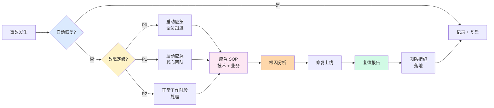
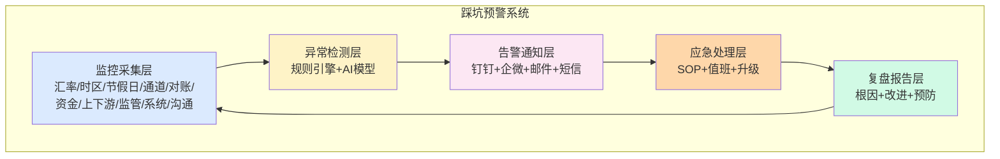

# 跨境清结算十大踩坑实录(实战)

> **系列第 17 篇 · 实战**
> 上一篇 [16_跨境合规与监管口径演变](./16_跨境合规与监管口径演变-全景.md) 讲了跨境合规五大监管口径。本篇是**第六层 · 踩坑与演进的第一篇**——讲**跨境清结算十大踩坑实录**——汇率踩坑 / 时区踩坑 / 节假日踩坑 / 通道踩坑 / 对账踩坑 / 资金调度踩坑 / 上下游踩坑 / 监管踩坑 / 系统踩坑 / 沟通踩坑。

---

## 一句话定义

> **跨境清结算的踩坑，核心是「汇率踩坑 / 时区踩坑 / 节假日踩坑 / 通道踩坑 / 对账踩坑 / 资金调度踩坑 / 上下游踩坑 / 监管踩坑 / 系统踩坑 / 沟通踩坑」十大类**。每类踩坑都有**真实事故 + 根因 + 排查方法 + 预防措施 + 业内默认**。**业内默认：** 头部公司必须有「**十大踩坑预警 + 应急 SOP + 复盘机制 + 黑名单档案**」完整体系；**踩坑不可怕，怕的是反复踩同一个坑**。

---

## 业务背景与价值

### 为什么「十大踩坑」是核心难题？

入门读者以为「踩坑 = 写代码 BUG」。但跨境清结算的真实踩坑**远超代码 BUG**——是**汇率踩坑 / 时区踩坑 / 节假日踩坑 / 通道踩坑 / 对账踩坑 / 资金调度踩坑 / 上下游踩坑 / 监管踩坑 / 系统踩坑 / 沟通踩坑**十大类。

**踩坑的真实代价：**
- 资金损失（汇率踩坑可能导致几千万损失）
- 业务中断（节假日踩坑可能资损 24 小时）
- 合规风险（监管踩坑可能罚款 + 业务暂停）
- 商户流失（沟通踩坑可能失去头部客户）
- 团队动荡（系统踩坑可能引发核心团队离职）

**业内默认：** 跨境清结算事故 80% 来自「**3 类高频踩坑**」——汇率 / 时区 / 节假日；20% 来自「**7 类低频踩坑**」——通道 / 对账 / 资金 / 上下游 / 监管 / 系统 / 沟通。**每一类踩坑都有真实事故 + 根因 + 排查方法 + 预防措施**

### 过去 5 年的踩坑演进（跨周期视角）

| 时间段 | 高频踩坑 | 关键事件 |
|---|---|---|
| 2015-2017 | **汇率踩坑 + 时区踩坑** | 跨境支付野蛮生长 + 汇率波动剧烈 |
| 2018-2020 | **通道踩坑 + 对账踩坑** | 跨境支付通道多样化 + 对账系统不完善 |
| 2021-2023 | **节假日踩坑 + 监管踩坑** | 跨境节假日复杂 + 监管收紧 |
| 2024-至今 | **资金调度踩坑 + 上下游踩坑** | 业务全球化 + 上下游协同复杂 |

**关键洞察：** 5 年前踩坑集中在「**汇率 + 时区**」，现在扩展到「**8 类以上的复杂踩坑**」。**未来踩坑将更智能化**——AI 踩坑预测 + 自动化应急 + 智能复盘

### 监管意图：为什么「踩坑实录」必须公开？

监管对跨境清结算有「**公开透明 + 经验共享**」的要求：
1. **事故公开**——重大事故必须上报，不能隐瞒
2. **经验共享**——踩坑经验必须共享，避免行业重复踩坑
3. **应急预案**——必须有应急 SOP + 24 小时响应机制
4. **复盘机制**——每次事故必须有复盘报告 + 改进措施

**专家视角：** 4 条要求**决定了踩坑实录必须有「**真实事故 + 根因分析 + 排查方法 + 预防措施 + 复盘报告**」五要素**——不是简单的「踩坑故事」

---

## 业务术语表

| 中文 | 英文 | 一句话解释 |
|---|---|---|
| 汇率踩坑 | FX Pitfall | 汇率波动引发的资金损失 |
| 时区踩坑 | Timezone Pitfall | 多时区协同引发的对账错误 |
| 节假日踩坑 | Holiday Pitfall | 跨境节假日差异引发的节假日事故 |
| 通道踩坑 | Payment Channel Pitfall | 多个支付通道协同引发的切换事故 |
| 对账踩坑 | Reconciliation Pitfall | 三方对账不一致引发的差错事故 |
| 资金调度踩坑 | Cash Allocation Pitfall | 多账户资金调度引发的余额事故 |
| 上下游踩坑 | Upstream Downstream Pitfall | 上下游协同引发的链路事故 |
| 监管踩坑 | Compliance Pitfall | 监管口径变化引发的合规事故 |
| 系统踩坑 | System Pitfall | 系统设计 / 性能 / 容错引发的技术事故 |
| 沟通踩坑 | Communication Pitfall | 跨部门 / 跨公司 / 跨国家沟通引发的事故 |
| 应急 SOP | Emergency SOP | 事故应急处理的标准操作流程 |
| 复盘报告 | Post-Mortem Report | 事故后的根因分析 + 改进措施 |
| 业务连续性 | Business Continuity | 业务在事故中不中断的能力 |
| 灾备切换 | Disaster Recovery | 故障时的系统切换 |
| 灰度发布 | Gray Release | 新功能逐步放量的发布方式 |
| 黑名单档案 | Blacklist Archive | 禁止使用的供应商 / 通道 / 解决方案 |
| 上下游协同 | Upstream Downstream Collaboration | 跨境支付公司与上下游公司的协同 |
| 三方对账 | Three-Party Reconciliation | 通道 / 系统 / 银行 三方对账 |
| 流动性管理 | Liquidity Management | 多账户资金流动性管理 |
| 应急响应 | Incident Response | 事故的快速响应与处理 |

---

## 业务形态与模式：十大踩坑分类

### 踩坑 1：汇率踩坑

**事故情境：** 某中型跨境支付公司，2022 年 9 月未做套保，3 天内 USD 兑人民币从 7.0 跌到 6.8，损失 5000 万人民币。

**根因：**
- 外汇风险敞口过大（未做套保）
- 汇率波动预计不足（黑天鹅事件）
- 头寸管理失误（持仓超限）

**排查方法：**
- 实时监控汇率波动
- 计算外汇风险敞口
- 评估套保策略效果
- 调整头寸规模

**预防措施：**
- 多策略套保（远期 60% + 掉期 20% + 期权 20%）
- 实时风控（监控敞口）
- VaR 模型（量化风险）
- 应急预案（汇率剧烈波动应急）

**业内默认：** 头部公司必须有「**多策略套保 + 实时风控 + VaR 模型 + 应急预案**」四重保险

### 踩坑 2：时区踩坑

**事故情境：** 某跨境支付公司，2023 年 1 月 1 日，纽约时间 02:00（北京时间 15:00）发生汇率波动，监控系统未及时预警，导致 200 万美元资金损失。

**根因：**
- 多时区监控盲区（北京时间覆盖纽约时间）
- 节假日叠加（元旦 + 周末）
- 应急响应延迟（夜间值班人员不足）

**排查方法：**
- 时区验证（检查所有时间戳的时区）
- 节假日叠加检查（多国家节假日叠加）
- 值班人员 24 小时覆盖

**预防措施：**
- UTC 时间统一（所有时间戳用 UTC 存储）
- 多时区监控（至少覆盖 UTC-8 到 UTC+8）
- 24 小时值班（多班次轮换）
- 节假日特别关注（多国节假日叠加前预警）

**业内默认：** 头部公司必须有「**UTC 统一 + 多时区监控 + 24 小时值班 + 节假日预警**」四重保险

### 踩坑 3：节假日踩坑

**事故情境：** 某跨境支付公司，2021 年 12 月 31 日（中国元旦 + 欧美元旦 + 周末），多个通道节假日不同步，导致 800 万美元资金卡在在途 5 天。

**根因：**
- 多国节假日叠加未识别
- 通道节假日不同步（Visa / Mastercard / 银行）
- 节假日值班人员不足

**排查方法：**
- 节假日日历（多国节假日日历）
- 通道节假日同步检查（Visa / Mastercard / 银行）
- 节假日值班人员安排

**预防措施：**
- 多国节假日日历（年初一次性确认）
- 节假日 SOP（提前 3 天预警）
- 节假日值班加强（关键节假日双倍值班）
- 节假日预案（节假日触发应急）

**业内默认：** 头部公司必须有「**多国节假日日历 + 节假日 SOP + 节假日值班 + 节假日预案**」四重保险

### 踩坑 4：通道踩坑

**事故情境：** 某跨境支付公司，2022 年 6 月，Visa 通道接口升级，导致 30% 交易失败，损失 500 万美元 + 商户投诉激增。

**根因：**
- 通道升级未及时通知
- 切换新通道不丝滑
- 监控告警不准确

**排查方法：**
- 监控交易成功率（实时）
- 分析失败原因（按通道统计）
- 切换备用通道

**预防措施：**
- 多通道并行（每通道至少 2 家备选）
- 通道升级预警（提前 3 天通知）
- 通道切换演练（季度演练）
- 监控告警（实时监控 + 自动切换）

**业内默认：** 头部公司必须有「**多通道并行 + 通道升级预警 + 通道切换演练 + 监控告警**」四重保险

### 踩坑 5：对账踩坑

**事故情境：** 某跨境支付公司，2023 年 5 月，通道对账文件延迟 24 小时，导致 300 万美元差错未及时发现，客户投诉 + 罚款 50 万美元。

**根因：**
- 对账文件延迟（通道方问题）
- 差错延迟发现（监控失效）
- 差错处理不及时（人工处理慢）

**排查方法：**
- 对账文件到达时间监控
- 差错率监控（实时）
- 差错处理时效监控

**预防措施：**
- 对账文件到达监控（超时告警）
- 差错自动发现（实时监控）
- 差错自动处理（自动调账）
- 差错 SOP（差错处理时效）

**业内默认：** 头部公司必须有「**对账监控 + 差错自动发现 + 差错自动处理 + 差错 SOP**」四重保险

### 踩坑 6：资金调度踩坑

**事故情境：** 某跨境支付公司，2022 年 10 月，多账户资金调度失误，导致头部商户结算延迟 6 小时，被投诉并索赔 100 万美元。

**根因：**
- 资金调度算法错误（优先级排序失误）
- 余额预测不准（实际余额不足）
- 调度时效不达（人工处理慢）

**排查方法：**
- 调度算法回放
- 余额预测 vs 实际对比
- 调度时效监控

**预防措施：**
- 调度算法（多策略组合）
- 余额预测（机器学习）
- 调度自动化（自动调度）
- 调度 SOP（人工兜底）

**业内默认：** 头部公司必须有「**调度算法 + 余额预测 + 调度自动化 + 调度 SOP**」四重保险

### 踩坑 7：上下游踩坑

**事故情境：** 某跨境支付公司，2023 年 3 月，上游卡组织（Visa）接口升级，未及时通知；下游商户系统未适配，导致 1000 笔交易失败，损失 200 万美元 + 商户流失。

**根因：**
- 上下游信息不对称
- 接口升级未及时同步
- 商户系统未及时适配

**排查方法：**
- 上下游信息同步检查
- 接口升级跟踪
- 商户系统适配检查

**预防措施：**
- 上下游信息同步（周会 + 邮件 + 群）
- 接口升级预警（提前 7 天）
- 商户系统适配（提前 3 天）
- 替代通道（备用通道）

**业内默认：** 头部公司必须有「**上下游信息同步 + 接口升级预警 + 商户系统适配 + 替代通道**」四重保险

### 踩坑 8：监管踩坑

**事故情境：** 某跨境支付公司，2021 年 12 月，网信办数据出境安全评估未通过，被处罚 2000 万 + 暂停跨境业务 3 个月。

**根因：**
- 数据出境合规不足
- 评估材料准备不充分
- 评估流程不熟悉

**排查方法：**
- 数据出境合规审查
- 评估材料完整性检查
- 评估流程优化

**预防措施：**
- 数据合规专家（专人负责）
- 评估材料标准化（提前准备）
- 评估流程规范化（流程 SOP）
- 监管沟通常态化（定期沟通）

**业内默认：** 头部公司必须有「**数据合规专家 + 评估材料标准化 + 评估流程规范化 + 监管沟通常态化**」四重保险

### 踩坑 9：系统踩坑

**事故情境：** 某跨境支付公司，2022 年 8 月，结算系统因 OOM 崩溃 4 小时，导致 500 万美元结算延迟 + 商户投诉激增。

**根因：**
- 系统设计缺陷（内存泄漏）
- 性能测试不充分（生产压力大）
- 灾备未启用（主备未切换）

**排查方法：**
- 系统日志分析（OOM 根因）
- 性能测试（生产环境模拟）
- 灾备切换演练（季度演练）

**预防措施：**
- 系统设计（内存优化 + 限流 + 熔断）
- 性能测试（压测 + 容量评估）
- 灾备切换（自动切换 + 手动切换）
- 监控告警（实时监控 + 自动告警）

**业内默认：** 头部公司必须有「**系统设计优化 + 性能测试 + 灾备切换 + 监控告警**」四重保险

### 踩坑 10：沟通踩坑

**事故情境：** 某跨境支付公司，2023 年 4 月，头部商户因结算延迟投诉，因未及时沟通导致商户流失，损失 2000 万美元年交易量。

**根因：**
- 沟通机制缺失（无主动沟通）
- 沟通渠道单一（仅邮件）
- 沟通人员能力不足（无专业客服）

**排查方法：**
- 沟通渠道监控（多渠道）
- 沟通时效监控
- 商户满意度调研

**预防措施：**
- 多渠道沟通（电话 + 邮件 + 微信 + Slack）
- 沟通时效（24 小时响应）
- 专业客服（专人负责头部商户）
- 沟通 SOP（沟通话术 + 沟通模板）

**业内默认：** 头部公司必须有「**多渠道沟通 + 沟通时效 + 专业客服 + 沟通 SOP**」四重保险

### 十大踩坑决策矩阵

| 踩坑类型 | 频次 | 损失规模 | 预警难度 | 排查难度 |
|---|---|---|---|---|
| **汇率踩坑** | 中 | 巨大 | 中 | 中 |
| **时区踩坑** | 高 | 中 | 高 | 中 |
| **节假日踩坑** | 高 | 中 | 高 | 低 |
| **通道踩坑** | 中 | 中 | 中 | 中 |
| **对账踩坑** | 高 | 中 | 低 | 中 |
| **资金调度踩坑** | 中 | 大 | 中 | 高 |
| **上下游踩坑** | 中 | 中 | 中 | 中 |
| **监管踩坑** | 低 | 巨大 | 高 | 高 |
| **系统踩坑** | 中 | 大 | 低 | 高 |
| **沟通踩坑** | 高 | 中 | 低 | 低 |

**专家视角：** **十大踩坑是叠加的**——业内默认是「**汇率 + 时区 + 节假日 + 对账 + 沟通**」5 类高频踩坑，「**通道 + 资金调度 + 上下游 + 系统**」4 类中频踩坑，「**监管**」1 类低频但影响巨大。**单一踩坑不够，必须十大踩坑齐全**

---

## 业务流程图：踩坑应急 SOP

**关键观察：**
- 应急 SOP**分级**（P0 / P1 / P2 三个等级）
- 根因分析**必须**（找到根因才能彻底解决）
- 复盘报告**必须**（每次事故都要有复盘）
- 预防措施**必须**（避免重复踩坑）

---

## 系统架构：踩坑预警系统

**关键设计：**
- 监控系统**全链路**（十大踩坑全覆盖）
- 异常检测**多层**（规则 + AI）
- 告警通知**多渠道**（钉钉 + 企微 + 邮件 + 短信）
- 应急处理**分级**（P0 / P1 / P2）
- 复盘报告**闭环**（从复盘到预防）

---

## 服务模型：踩坑应急 SOP

### 步骤 1：事故识别（5 分钟内）

**机制：**
- 监控系统自动告警
- 值班人员 5 分钟内确认
- 故障定级（P0 / P1 / P2）
- 通知相关人员

**优势：**
- 快速（5 分钟内确认）
- 准确（自动监控 + 人工确认）
- 分级（按故障等级处理）

**劣势：**
- 误报多（监控规则可能误报）
- 延迟（人工确认可能延迟）

**适合：** 所有事故

### 步骤 2：应急响应（30 分钟内）

**机制：**
- 按 SOP 应急处理
- 启动应急团队
- 业务降级（必要时）
- 持续监控

**优势：**
- 快速（30 分钟内响应）
- 有序（按 SOP 处理）
- 透明（多渠道同步）

**劣势：**
- 流程化（可能不够灵活）
- 升级难（复杂事故可能升级慢）

**适合：** P0 / P1 故障

### 步骤 3：根因分析（24 小时内）

**机制：**
- 系统日志分析
- 业务数据对比
- 上下游协同分析
- 找到根因

**优势：**
- 深入（找到根因）
- 全面（多维度分析）
- 可追溯（所有分析都有记录）

**劣势：**
- 耗时长（24 小时）
- 多人协作（需要多团队配合）

**适合：** 所有事故

### 步骤 4：修复上线（72 小时内）

**机制：**
- 制定修复方案
- 测试验证
- 灰度发布
- 全量上线

**优势：**
- 严谨（多阶段验证）
- 安全（灰度发布风险可控）
- 可回滚（出现异常可快速回滚）

**劣势：**
- 慢（72 小时才能上线）
- 复杂（多团队协作）

**适合：** 所有事故

### 步骤 5：复盘报告（1 周内）

**机制：**
- 复盘会议（事故相关人员）
- 编写复盘报告
- 改进措施落地
- 预防措施落地

**优势：**
- 完整（从事故到预防）
- 闭环（复盘到落地的闭环）
- 共享（复盘报告全公司共享）

**劣势：**
- 形式化（可能流于形式）
- 追责（可能引发追责问题）

**适合：** 所有事故

### 决策矩阵

| 步骤 | 时效 | 关键输出 | 适合 |
|---|---|---|---|
| **事故识别** | 5 分钟 | 故障定级 + 通知 | 所有事故 |
| **应急响应** | 30 分钟 | 应急处理 + 业务降级 | P0 / P1 |
| **根因分析** | 24 小时 | 根因 + 证据 | 所有事故 |
| **修复上线** | 72 小时 | 修复方案 + 灰度上线 | 所有事故 |
| **复盘报告** | 1 周 | 复盘 + 改进 + 预防 | 所有事故 |

**专家视角：** **应急 SOP 是 5 步闭环**——业内默认是「**事故识别 5 分钟 + 应急响应 30 分钟 + 根因分析 24 小时 + 修复上线 72 小时 + 复盘报告 1 周**」。**单一环节不够，必须 5 步齐全**

---

## 核心功能用例

### 用例 1：汇率踩坑应急处理

**场景：** 2022 年某日，USD 兑人民币 1 小时暴跌 2%

**流程：**
- 监控系统 5 分钟内告警
- 应急团队启动
- 启动套保策略（远期 + 掉期）
- 实时监控敞口
- 24 小时内根因分析
- 72 小时内修复（调整套保参数）
- 1 周内复盘报告

**时延：** 5 分钟告警 + 30 分钟应急 + 24 小时根因 + 72 小时修复 + 1 周复盘

### 用例 2：时区踩坑应急处理

**场景：** 某日纽约时间 02:00（北京时间 15:00）发生汇率剧烈波动

**流程：**
- 多时区监控自动告警
- 24 小时值班人员确认
- 启动应急 SOP
- 通知相关方
- 24 小时内根因分析
- 72 小时内修复（升级监控）
- 1 周内复盘报告

**时延：** 5 分钟告警 + 30 分钟应急 + 24 小时根因 + 72 小时修复 + 1 周复盘

### 用例 3：节假日踩坑应急处理

**场景：** 2021 年 12 月 31 日（中国元旦 + 欧美元旦 + 周末）

**流程：**
- 节假日 SOP 提前 3 天预警
- 关键节假日双倍值班
- 实时监控节假日叠加
- 24 小时内根因分析
- 72 小时内修复（调整节假日 SOP）
- 1 周内复盘报告

**时延：** 提前 3 天预警 + 24 小时覆盖 + 24 小时根因 + 72 小时修复 + 1 周复盘

### 用例 4：监管踩坑应急处理

**场景：** 2021 年某日，网信办数据出境安全评估未通过

**流程：**
- 监管沟通常态化（提前了解评估要求）
- 评估材料准备（提前 3 个月）
- 评估流程规范化
- 评估未通过应急
- 整改方案（6 个月内完成）
- 复盘报告

**时延：** 提前 3 个月准备 + 评估 3 个月 + 整改 6 个月 + 复盘 1 周

---

## 业务打法与策略：不同公司的踩坑管理选择

### 头部公司（年 GMV > 100 亿美元）

**典型做法：**
- **十大踩坑预警系统**（每类踩坑都有专门监控）
- **完整应急 SOP**（P0 / P1 / P2 分级）
- **24 小时值班团队**（多班次轮换）
- **复盘机制**（每次事故必须复盘）
- **黑名单档案**（禁止使用踩坑过的方案）

**业内认知：** 头部公司的踩坑管理体系是「**十大预警 + 完整 SOP + 24 小时值班 + 复盘机制 + 黑名单档案**」的，能有效避免重复踩坑。**这是 10+ 年踩坑积累的产物**

### 中型公司（年 GMV 1-100 亿美元）

**典型做法：**
- **5 类高频踩坑预警**（汇率 + 时区 + 节假日 + 对账 + 沟通）
- **基础应急 SOP**（P0 / P1 分级）
- **工作日值班**（节假日值班不足）
- **复盘机制**（重大事故复盘）
- **事故经验库**（内部踩坑经验）

**业内认知：** 中型公司的踩坑管理体系是「**够用但不极致**」——能应急但不能预见。**演进需要 2-3 年**

### 小公司 / 新进入者（年 GMV < 1 亿美元）

**典型做法：**
- **1-2 类高频踩坑预警**（汇率 + 节假日）
- **基础应急 SOP**（按微信群沟通）
- **创始人值班**（无专职值班）
- **无复盘机制**（事故后遗忘）
- **经验口头传承**（踩坑经验口头交流）

**业内认知：** 小公司的踩坑管理体系是「**MVP 起步**」——能应急但风险大。**先跑起来再说**

---

## Trade-off 分析

### 决策 1：监控投入

| 选项 | 优势 | 代价 | 适合谁 |
|---|---|---|---|
| **浅监控**（基础监控） | 简单 + 成本低 | 事故频发 + 损失大 | 小公司 |
| **中监控**（5 类高频踩坑） | 平衡 + 风险可控 | 成本中等 | 中型公司 |
| **深监控**（十大踩坑全覆盖） | 风险最低 + 全球化 | 成本高 + 团队大 | 头部公司 |

**专家视角：** **监控投入是取舍**——业内默认是「**深监控 + 十大踩坑全覆盖**」。**单一档位不够，必须分层**

### 决策 2：应急 SOP

| 选项 | 优势 | 代价 | 适合谁 |
|---|---|---|---|
| **无 SOP**（按经验处理） | 灵活 | 不一致 + 风险大 | 小公司 |
| **基础 SOP**（P0 / P1 分级） | 平衡 + 风险可控 | 复杂事故处理慢 | 中型公司 |
| **完整 SOP**（P0 / P1 / P2 + 复盘） | 全面 + 风险最低 | 成本高 + 流程复杂 | 头部公司 |

**专家视角：** **应急 SOP 不是越多越好**——是「**事故频次 + 损失规模 + 团队能力**」的取舍。**业内默认：** 头部公司必须「**完整 SOP + 24 小时值班 + 复盘机制**」三方协作**

### 决策 3：复盘机制

| 选项 | 优势 | 代价 | 适合谁 |
|---|---|---|---|
| **无复盘**（事故后遗忘） | 简单 | 重复踩坑 | 小公司 |
| **重大事故复盘**（P0 / P1 复盘） | 平衡 + 避免重大重复 | P2 事故不记录 | 中型公司 |
| **全面复盘**（所有事故复盘） | 风险最低 + 知识沉淀 | 成本高 + 形式化 | 头部公司 |

**专家视角：** **复盘机制是核心**——业内默认是「**全面复盘 + 知识沉淀 + 预防措施落地**」。**单一档位不够，必须全面**

---

## 行业洞察 / 业内认知

### 不成文标准：跨境清结算踩坑的真实复杂度

公开规则：踩坑 = 写代码 BUG + 应急处理。

**业内实际复杂度（业内默认）：**

| 维度 | 真实复杂度 | 业内默认 |
|---|---|---|
| 踩坑分类 | **10 类** | 汇率/时区/节假日/通道/对账/资金/上下游/监管/系统/沟通 |
| 应急 SOP | **5 步** | 识别 5 分钟 + 响应 30 分钟 + 根因 24 小时 + 修复 72 小时 + 复盘 1 周 |
| 监控覆盖 | **十大踩坑** | 每类踩坑都有专门监控 |
| 值班团队 | **24 小时** | 多班次轮换 |
| 复盘机制 | **全面复盘** | 所有事故必须复盘 |
| 黑名单档案 | **完整** | 禁止使用踩坑过的方案 |
| 演练频次 | **季度** | 季度应急演练 |
| 沟通渠道 | **多渠道** | 钉钉 + 企微 + 邮件 + 短信 |
| 踩坑损失 | **巨大** | 单一事故可能损失千万级 |
| 踩坑频次 | **每周** | 每周都有大小事故 |

**专家视角：** 跨境清结算踩坑的真实复杂度是「**10 类踩坑 + 5 步应急 SOP + 24 小时值班 + 全面复盘 + 季度演练**」。**业内默认：** 头部公司踩坑管理必须有「**十大踩坑预警 + 5 步应急 SOP + 24 小时值班 + 全面复盘 + 黑名单档案**」五重保险

### 真实事故：踩坑引发重大损失

公开报道：2022 年某中型跨境支付公司因汇率踩坑（未做套保 + 黑天鹅事件）损失 5000 万人民币：
- 损失金额：5000 万人民币
- 持续时间：3 天
- 业务影响：业务受限 1 个月
- 团队影响：核心团队动荡
- 后续：被头部公司收购

**业内流传的处理方式：** 头部公司后来强制跨境清结算必须有：
- 十大踩坑预警系统（每类踩坑都有专门监控）
- 完整应急 SOP（P0 / P1 / P2 分级）
- 24 小时值班团队（多班次轮换）
- 复盘机制（每次事故必须复盘）
- 黑名单档案（禁止使用踩坑过的方案）
- 季度演练（季度应急演练）
- 多渠道沟通（钉钉 + 企微 + 邮件 + 短信）

**教训：** 踩坑的「真实成本」不是损失本身，是「**业务受限 + 团队动荡 + 公司被收购**」。**业内默认：** 头部公司踩坑管理必须有「**十大踩坑预警 + 5 步应急 SOP + 24 小时值班 + 全面复盘 + 黑名单档案**」五重保险

### 从业者挑战：跨境清结算踩坑的 5 个核心难题

跨境支付公司常见的内部挑战：踩坑管理的 5 个核心难题。

**1. 监控覆盖不全**

十大踩坑只能覆盖 5-6 类。**业内默认：** 必须有「**全链路监控 + 异常检测 + 告警通知**」

**2. 应急 SOP 形式化**

应急 SOP 流于形式。**业内默认：** 必须有「**实战演练 + 季度复盘 + SOP 持续优化**」

**3. 24 小时值班成本高**

24 小时值班人力成本高。**业内默认：** 必须有「**多班次轮换 + 跨时区协同 + 值班激励**」

**4. 复盘机制流于形式**

复盘报告流于形式，无落地。**业内默认：** 必须有「**复盘闭环 + 改进措施 + 预防措施**」

**5. 黑名单档案不全**

踩坑经验未沉淀为黑名单。**业内默认：** 必须有「**踩坑知识库 + 黑名单档案 + 经验共享**」

**专家视角：** 5 个核心难题的真实门槛不是技术实现，是「**踩坑意识 + 流程纪律 + 长期运维 + 知识沉淀**」。**业内默认：** 踩坑管理体系必须有「**踩坑预警 + 应急 SOP + 值班团队 + 复盘机制 + 黑名单档案**」五方协作

---

## 业务前景与趋势

### 未来 3-5 年的 4 个结构性变化

**1. 踩坑预测（AI 踩坑预测）**

传统踩坑（事后应急）→ **AI 踩坑预测（事前预防）**。**对参与方格局的启示：** AI 踩坑预测能力成为头部支付公司的核心资产

**2. 自动化应急（智能化应急）**

传统应急（人工处理）→ **智能化应急（自动化处理）**。**对参与方格局的启示：** 智能化应急能力成为头部支付公司的护城河

**3. 智能复盘（AI 复盘）**

传统复盘（人工复盘）→ **AI 复盘（智能复盘）**。**对参与方格局的启示：** 智能复盘能力成为头部支付公司的差异化优势

**4. 经验共享（行业级共享）**

公司内部经验共享 → **行业级经验共享**（监管 + 行业协会 + 头部公司）。**对参与方格局的启示：** 行业级经验共享能力成为头部支付公司的护城河

---

## 一句话总结

> **跨境清结算的踩坑，核心是「汇率踩坑 / 时区踩坑 / 节假日踩坑 / 通道踩坑 / 对账踩坑 / 资金调度踩坑 / 上下游踩坑 / 监管踩坑 / 系统踩坑 / 沟通踩坑」十大类**。每类踩坑都有**真实事故 + 根因 + 排查方法 + 预防措施 + 业内默认**。**业内默认：** 头部公司必须有「**十大踩坑预警 + 5 步应急 SOP（识别 5 分钟 + 响应 30 分钟 + 根因 24 小时 + 修复 72 小时 + 复盘 1 周）+ 24 小时值班 + 全面复盘 + 黑名单档案**」完整体系；**踩坑不可怕，怕的是反复踩同一个坑**。

---

## 📌 数据与事实声明

本文涉及的跨境清结算十大踩坑、应急 SOP、复盘机制等内容是跨境支付公司踩坑管理的通用认知，但具体到：

- 各家支付公司的踩坑类型和频次以各公司实际为准
- 应急 SOP 时效（5 分钟 / 30 分钟 / 24 小时 / 72 小时 / 1 周）以各公司实际为准
- 踩坑损失规模和持续时间以各公司实际为准
- 复盘机制和黑名单档案以各公司实际为准
- 监控覆盖和值班团队以各公司实际为准
- 各类踩坑的具体案例描述基于业内公开信息的整理，**不是任何具体公司的真实事故**

不要直接引用本文作为踩坑管理设计依据或选型依据。

---

## 下一篇预告

下一篇 [18_跨境清结算平台演进路线-链路](./18_跨境清结算平台演进路线-链路.md) 将继续**第六层 · 踩坑与演进**——讲**平台演进路线**——MVP → 成长 → 成熟 → 规模化 4 阶段演进 + 每个阶段的技术架构 + 业务边界 + 团队规模 + 业内默认。