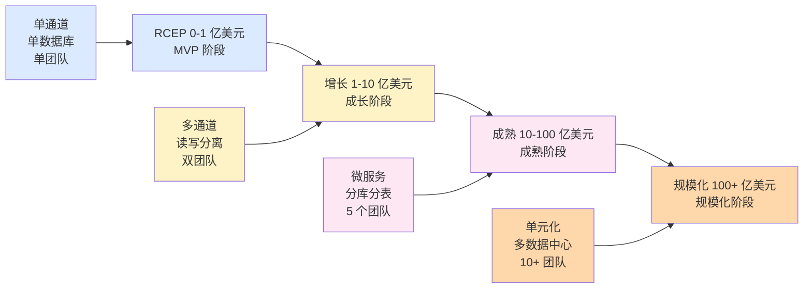
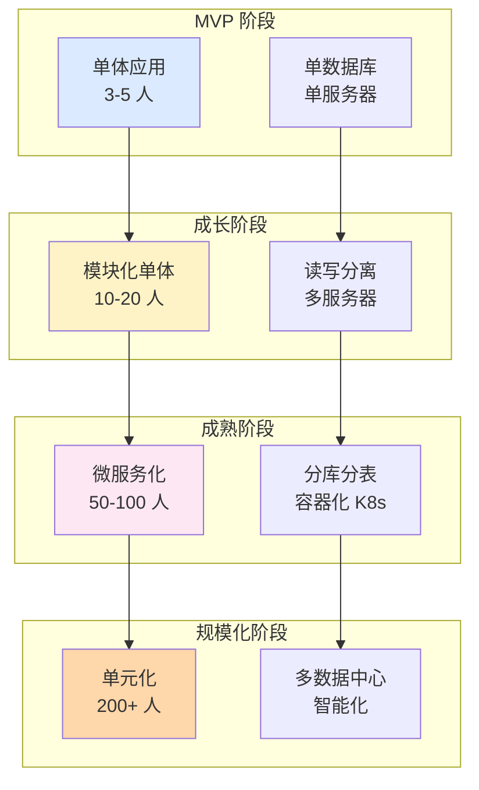

# 跨境清结算平台演进路线(链路)

> **系列第 18 篇 · 链路**
> 上一篇 [17_跨境清结算十大踩坑实录](./17_跨境清结算十大踩坑实录-实战.md) 讲跨境清结算十大踩坑。本篇是**第六层 · 踩坑与演进的第二篇**——讲**跨境清结算平台演进路线**——MVP → 成长 → 成熟 → 规模化 4 阶段演进 + 每个阶段的技术架构 + 业务边界 + 团队规模 + 业内默认。

---

## 一句话定义

> **跨境清结算平台的演进，核心是「MVP → 成长 → 成熟 → 规模化」4 阶段**。MVP 阶段「**单通道 + 单数据库 + 单团队**」；成长阶段「**多通道 + 读写分离 + 双团队**」；成熟阶段「**多通道 + 微服务 + 5 个团队**」；规模化阶段「**多通道 + 单元化 + 10+ 团队**」。**业内默认：** 头部公司必须「**经历 4 阶段累计 5-8 年**」，**每阶段演进的关键不是技术升级而是组织能力升级**；**单一阶段不演进 = 死亡警告**。

---

## 业务背景与价值

### 为什么「平台演进路线」是核心难题？

入门读者以为「平台演进 = 技术升级」。但跨境清结算平台的真实演进**远超技术升级**——是**业务边界 + 技术架构 + 团队规模 + 组织能力** 4 维度的协同演进。

**演进的核心矛盾：**
- 业务复杂度持续增长（半年翻倍）
- 技术架构跟不上（重构 vs 演进）
- 团队规模跟不上（人手 vs 业务）
- 组织能力跟不上（流程 vs 复杂度）

**业内默认：** 跨境清结算平台演进**不是技术问题，是组织能力问题**——「**组织能力跟不上 = 平台死亡的真正原因**」

### 过去 5 年的演进路线典型（跨周期视角）

| 时间段 | 主流路线 | 关键事件 |
|---|---|---|
| 2015-2017 | **MVP 阶段** | 跨境支付兴起 + 单通道对接 |
| 2018-2020 | **成长阶段** | 通道多样化 + 读写分离 |
| 2021-2023 | **成熟阶段** | 微服务化 + 5 个团队 |
| 2024-至今 | **规模化阶段** | 单元化 + 10+ 团队 |

**关键洞察：** 5 年前大部分支付公司在「**MVP 阶段**」，现在头部公司都在「**规模化阶段**」。**未来演进将是「智能化阶段」**——AI 决策 + 自动化演进 + 智能监控

### 监管意图：为什么「平台演进」必须合规？

监管对跨境清结算的演进有「**合规优先 + 业务连续**」要求：
1. **合规优先**——每次架构升级必须保证合规
2. **业务连续**——架构升级不能中断业务
3. **应急回滚**——每次升级必须有回滚方案
4. **灰度发布**——必须支持灰度发布

**专家视角：** 4 条要求**决定了平台演进必须有「**合规设计 + 业务连续 + 应急回滚 + 灰度发布**」四重保险**——不是简单的「技术升级」

---

## 业务术语表

| 中文 | 英文 | 一句话解释 |
|---|---|---|
| MVP 阶段 | Minimum Viable Product | 最简可行产品阶段 |
| 成长阶段 | Growth Stage | 业务快速增长阶段 |
| 成熟阶段 | Maturity Stage | 业务稳定阶段 |
| 规模化阶段 | Scale Stage | 业务全球化阶段 |
| 单通道 | Single Channel | 仅对接一家支付通道 |
| 多通道 | Multi-Channel | 对接多家支付通道 |
| 读写分离 | Read-Write Splitting | 数据库读写分离 |
| 微服务 | Microservices | 系统按业务拆分为微服务 |
| 单元化 | Unitization | 按业务域拆分部署单元 |
| 单团队 | Single Team | 1 个团队负责整个平台 |
| 双团队 | Dual Team | 2 个团队分工 |
| 5 个团队 | 5 Teams | 5 个团队分工 |
| 10+ 团队 | 10+ Teams | 10+ 团队分工 |
| 灰度发布 | Gray Release | 新功能逐步放量的发布方式 |
| 应急回滚 | Emergency Rollback | 升级异常时快速回滚 |
| 业务连续性 | Business Continuity | 业务在事故中不中断 |
| 组织能力 | Organizational Capability | 团队的协作和流程能力 |
| 演进路线 | Evolution Roadmap | 平台演进的阶段路径 |
| 技术债务 | Technical Debt | 历史代码累积的复杂度 |
| 重构 | Refactoring | 对系统进行结构优化 |

---

## 业务形态与模式：4 阶段演进路线

### 阶段 1：MVP 阶段（GMV < 1 亿美元）

**典型业务场景：**
- 1 个支付通道（如 Visa）
- 1 个币种（如 USD）
- 1 个商户群体（如电商）
- 1 个国家（少数国家）

**技术架构：**
- 单体应用（一个 Java 应用）
- 单数据库（MySQL）
- 单服务器（4 核 8G）
- 单团队（3-5 人）

**核心特征：**
- 单通道对接（Visa）
- 单数据库（MySQL）
- 单团队（3-5 人）
- 单服务器（4 核 8G）
- 业务上线时间：3-6 个月

**核心挑战：**
- 业务合规（监管牌照）
- 资金流跑通（端到端）
- 风控规则（基础反欺诈）

**演进触发条件：**
- GMV > 1 亿美元 → 进入成长阶段
- 通道数量 > 3 → 进入成长阶段
- 团队规模 > 5 人 → 进入成长阶段

**业内默认：** MVP 阶段必须有「**单通道 + 单数据库 + 单团队**」的最简架构，**3-6 个月上线是合理目标**；**单一架构不要过早优化**

### 阶段 2：成长阶段（GMV 1-10 亿美元）

**典型业务场景：**
- 多支付通道（Visa / Mastercard / UnionPay）
- 多币种（USD / EUR / HKD）
- 多商户群体（电商 / 旅行 / 教育）
- 多国家（亚太为主）

**技术架构：**
- 模块化单体（按业务模块拆分）
- 读写分离（主从数据库）
- 多服务器（4 核 8G × 4）
- 双团队（10-20 人）

**核心特征：**
- 多通道对接（Visa / Mastercard / UnionPay）
- 读写分离（主从数据库）
- 团队规模 10-20 人
- 服务器 4-8 台
- 业务上线时间：3-6 个月逐步上线

**核心挑战：**
- 多通道管理（切换 + 容错）
- 对账系统（多通道对账）
- 资金调度（跨账户调度）

**演进触发条件：**
- GMV > 10 亿美元 → 进入成熟阶段
- 通道数量 > 10 → 进入成熟阶段
- 团队规模 > 20 人 → 进入成熟阶段

**业内默认：** 成长阶段必须有「**多通道 + 读写分离 + 双团队**」的扩展架构，**单一架构进入升级期**

### 阶段 3：成熟阶段（GMV 10-100 亿美元）

**典型业务场景：**
- 多支付通道（Visa / Mastercard / UnionPay / JCB / Amex）
- 多币种（USD / EUR / GBP / JPY / HKD）
- 多商户群体（电商 / 旅行 / 教育 / 跨境服务）
- 多国家（亚太 + 美洲）

**技术架构：**
- 微服务化（按业务域拆分）
- 数据库分库分表（按业务拆分）
- 容器化（K8s）
- 5 个团队（50-100 人）

**核心特征：**
- 微服务化（5-10 个核心服务）
- 分库分表（按业务拆分）
- 容器化（K8s）
- 团队规模 50-100 人
- 服务器 50-100 台
- 业务上线时间：6-12 个月

**核心挑战：**
- 微服务治理（服务拆分 + 监控）
- 数据一致性（分布式事务）
- 组织协同（多团队协作）

**演进触发条件：**
- GMV > 100 亿美元 → 进入规模化阶段
- 通道数量 > 30 → 进入规模化阶段
- 团队规模 > 100 人 → 进入规模化阶段

**业内默认：** 成熟阶段必须有「**多通道 + 微服务 + 5 个团队**」的成熟架构，**单一架构进入重构期**

### 阶段 4：规模化阶段（GMV > 100 亿美元）

**典型业务场景：**
- 大量支付通道（30+）
- 多币种（USD / EUR / GBP / JPY / HKD / 多新兴币种）
- 多商户群体（电商 / 旅行 / 教育 / 跨境服务 / 跨境电商）
- 多国家（全球）

**技术架构：**
- 单元化架构（按业务域拆分）
- 多数据中心（多地部署）
- 智能化（AI 决策）
- 10+ 团队（200+ 人）

**核心特征：**
- 单元化架构（按业务域拆分）
- 多数据中心（多地部署）
- 智能化（AI 决策）
- 团队规模 200+ 人
- 服务器 500+ 台
- 业务上线时间：12-18 个月

**核心挑战：**
- 单元化部署（多地部署）
- 跨数据中心（数据同步）
- 组织协同（10+ 团队协作）

**业内默认：** 规模化阶段必须有「**多通道 + 单元化 + 10+ 团队**」的规模化架构，**单一架构进入瓶颈期**

---

## 业务流程图：4 阶段演进路径

**关键观察：**
- 演进路径**升级**（每阶段都是前阶段的扩展）
- 演进触发条件明确（GMV / 通道数量 / 团队规模）
- 演进时长累计 5-8 年（业内默认）

---

## 系统架构：4 阶段架构演进

**关键设计：**
- 架构演进**渐进**（每阶段不是颠覆式重构）
- 团队规模**密度增长**（5 → 20 → 100 → 200）
- 技术栈**升级**（单体 → 模块化 → 微服务 → 单元化）

---

## 服务模型：演进的 5 个关键决策

### 决策 1：架构演进策略

| 策略 | 适用阶段 | 优势 | 代价 |
|---|---|---|---|
| **演进式**（渐进式） | MVP → 成长 → 成熟 | 业务连续 + 风险可控 | 慢（6-12 个月） |
| **重构式**（颠覆式） | MVP → 成熟 | 快（3-6 个月） | 业务风险 + 团队动荡 |
| **混合式**（核心重构 + 周边演进） | 成长 → 成熟 | 平衡 + 风险可控 | 复杂（多团队协作） |

**业内默认：** 头部公司通常采用「**混合式**」——核心服务（清分 / 结算）重构式，周边服务（监控 / 告警）演进式

### 决策 2：团队规模

| 阶段 | 团队规模 | 核心团队 | 协作团队 |
|---|---|---|---|
| **MVP** | 3-5 人 | 全栈 | — |
| **成长** | 10-20 人 | 业务 + 技术 | 合规 |
| **成熟** | 50-100 人 | 业务 + 技术 + 运维 | 合规 + 风控 |
| **规模化** | 200+ 人 | 业务 + 技术 + 运维 + 数据 | 合规 + 风控 + 智能化 |

**业内默认：** 头部公司团队规模密度「**每阶段翻 2-3 倍**」——**不是线性增长，是指数增长**

### 决策 3：技术栈

| 阶段 | 后端 | 数据库 | 部署 | 监控 |
|---|---|---|---|---|
| **MVP** | Java + Spring Boot | MySQL | 单服务器 | 基础 |
| **成长** | Java + Spring Cloud | MySQL + Redis | 多服务器 | 完整 |
| **成熟** | Java + Spring Cloud + 微服务 | MySQL + Redis + ES | K8s | 智能 |
| **规模化** | Java + Service Mesh | 多数据库 | 多数据中心 | AI 智能化 |

**业内默认：** 头部公司技术栈演进**不是追逐新，是业务驱动**——**业务需要才升级**

### 决策 4：流程规范

| 阶段 | 开发流程 | 上线流程 | 运维流程 |
|---|---|---|---|
| **MVP** | 简单 Git Flow | 手动上线 | 出现问题再处理 |
| **成长** | Git Flow + CI | 自动化上线 | 监控 + 告警 |
| **成熟** | Git Flow + CI + CD | 灰度发布 | 监控 + 告警 + 应急 |
| **规模化** | Git Flow + CI + CD + 蓝绿 | 灰度 + 蓝绿 | 监控 + 告警 + 应急 + AI 智能化 |

**业内默认：** 流程规范**和团队规模同步**——**团队规模 5 人不需要 100 人的流程**

### 决策 5：合规演进

| 阶段 | 合规要求 | 合规成本占比 | 合规团队 |
|---|---|---|---|
| **MVP** | 基础（牌照 + 反洗钱） | 1%-3% | 外包 |
| **成长** | 完整（牌照 + 反洗钱 + 外汇） | 3%-5% | 2-3 人 |
| **成熟** | 加固（5 类国内监管） | 5%-10% | 5-10 人 |
| **规模化** | 全球化（5+5 监管口径） | 5%-15% | 20-100 人 |

**业内默认：** 合规成本**与公司规模同步**——**单一标准不足以覆盖所有阶段**

---

## 核心功能用例

### 用例 1：MVP → 成长阶段演进

**场景：** GMV 从 0.5 亿增长到 5 亿，通道从 1 个扩展到 5 个

**演进步骤：**
- 团队规模：3-5 人 → 10-20 人
- 通道对接：Visa 单一 → Visa / Mastercard / UnionPay / JCB / Amex
- 数据库：MySQL 单库 → MySQL 主从
- 服务器：单服务器 → 4-8 台
- 业务连续：保证业务不中断

**演进时长：** 6-12 个月

### 用例 2：成长 → 成熟阶段演进

**场景：** GMV 从 5 亿增长到 50 亿，团队规模从 20 人扩展到 100 人

**演进步骤：**
- 团队规模：10-20 人 → 50-100 人
- 架构：模块化单体 → 微服务
- 数据库：MySQL 主从 → 分库分表
- 部署：多服务器 → K8s
- 监控：基础监控 → 智能监控

**演进时长：** 12-18 个月

### 用例 3：成熟 → 规模化阶段演进

**场景：** GMV 从 50 亿增长到 200 亿，团队规模从 100 人扩展到 300 人

**演进步骤：**
- 团队规模：100 人 → 200+ 人
- 架构：微服务 → 单元化
- 数据中心：单数据中心 → 多数据中心
- 智能化：基础 → AI 智能化
- 全局监控：单地 → 多地

**演进时长：** 18-24 个月

### 用例 4：演进失败案例

**场景：** 某中型跨境支付公司 GMV 5 亿但团队规模 100 人，团队协作能力跟不上

**演进失败原因：**
- 团队规模过早扩张
- 流程规范跟不上
- 业务连续性不足
- 团队协作效率低

**演进失败后果：**
- 业务上线延期 6 个月
- 商户投诉激增
- 核心团队离职
- 公司被收购

**业内默认：** 演进失败的「真实原因」是「**组织能力跟不上**」——**团队规模 100 人但 GMV 只有 5 亿 = 死亡警告**

---

## 业务打法与策略：不同公司的演进选择

### 头部公司（年 GMV > 100 亿美元）

**典型做法：**
- **规模化阶段**（单元化 + 多数据中心）
- **200+ 团队规模**
- **30+ 支付通道**
- **完整合规体系（5+5 监管）**
- **智能运维（AI 监控）**

**业内认知：** 头部公司已经完成 4 阶段演进，**正在向智能化阶段演进**——AI 决策 + 自动化演进 + 智能监控

### 中型公司（年 GMV 1-100 亿美元）

**典型做法：**
- **成长 → 成熟阶段**（多通道 + 微服务）
- **20-100 人团队**
- **5-30 个支付通道**
- **基础合规体系（3 类监管）**
- **监控告警**

**业内认知：** 中型公司演进中，**核心挑战是组织能力**——**团队规模 100 人但协作能力跟不上 = 死亡警告**

### 小公司 / 新进入者（年 GMV < 1 亿美元）

**典型做法：**
- **MVP 阶段**（单通道 + 单数据库）
- **3-20 人团队**
- **1-5 个支付通道**
- **基础合规（外包）**
- **基础监控**

**业内认知：** 小公司处于 MVP 阶段，**核心挑战是活下去**——**单一架构过早优化就是死亡**

---

## Trade-off 分析

### 决策 1：架构演进策略

| 选项 | 优势 | 代价 | 适合谁 |
|---|---|---|---|
| **演进式**（渐进式） | 业务连续 + 风险可控 | 慢（6-12 个月） | 业务稳定阶段 |
| **重构式**（颠覆式） | 快（3-6 个月） | 业务风险 + 团队动荡 | 业务快速变化阶段 |
| **混合式** | 平衡 + 风险可控 | 复杂（多团队协作） | 阶段演进期 |

**专家视角：** **架构演进策略是取舍**——业内默认是「**混合式**」。**单一策略不够，必须结合业务阶段**

### 决策 2：团队规模

| 选项 | 优势 | 代价 | 适合谁 |
|---|---|---|---|
| **小团队**（3-5 人） | 灵活 + 沟通成本低 | 扩展能力差 | MVP 阶段 |
| **中团队**（10-50 人） | 平衡 + 专业化 | 协作成本增加 | 成长阶段 |
| **大团队**（100-300 人） | 专业化 + 多团队 | 协作成本 + 流程形式化 | 成熟 / 规模化阶段 |

**专家视角：** **团队规模不是越多越好**——是「**业务规模 + 业务复杂度 + 组织能力**」的取舍。**业内默认：** 团队规模「**每阶段翻 2-3 倍**」

### 决策 3：技术栈

| 选项 | 优势 | 代价 | 适合谁 |
|---|---|---|---|
| **传统栈**（Java + Spring + MySQL） | 稳定 + 人才多 | 智能化不足 | MVP / 成长阶段 |
| **云原生栈**（K8s + 微服务） | 灵活 + 扩展 | 复杂度高 | 成熟阶段 |
| **智能化栈**（AI + Service Mesh） | 智能化 + 自动化 | 成本高 | 规模化阶段 |

**专家视角：** **技术栈选择不是追逐新**——是「**业务需要 + 团队能力 + 成本**」的取舍。**业内默认：** 头部公司按业务驱动演进，**业务需要才升级**

---

## 行业洞察 / 业内认知

### 不成文标准：跨境清结算演进的真实复杂度

公开规则：演进 = 技术升级。

**业内实际复杂度（业内默认）：**

| 维度 | 真实复杂度 | 业内默认 |
|---|---|---|
| 演进阶段 | **4 阶段** | MVP → 成长 → 成熟 → 规模化 |
| 演进时长 | **5-8 年累计** | 头部公司 5-8 年走完 4 阶段 |
| 团队规模 | **每阶段翻 2-3 倍** | 5 → 20 → 100 → 300 |
| 通道数量 | **每阶段扩展 5-10 倍** | 1 → 5 → 30 → 100+ |
| 架构演进 | **混合式** | 核心重构 + 周边演进 |
| 技术栈 | **业务驱动** | 业务需要才升级 |
| 流程规范 | **与团队规模同步** | 5 人不需要 100 人的流程 |
| 合规演进 | **与公司规模同步** | 合规成本 1%-3% → 5%-15% |
| 演进失败 | **组织能力跟不上** | 团队规模 100 人但 GMV 只有 5 亿 = 死亡警告 |
| 演进成功 | **业务 + 技术 + 团队 + 组织** | 4 维度协同 |

**专家视角：** 跨境清结算演进的真实复杂度是「**4 阶段 + 5-8 年 + 组织能力 + 业务驱动**」。**业内默认：** 头部公司必须有「**业务 + 技术 + 团队 + 组织**」4 维度协同演进，**单一维度不演进 = 死亡警告**

### 真实事故：演进失败引发重大损失

公开报道：2022 年某中型跨境支付公司 GMV 5 亿但团队规模 100 人，组织能力严重跟不上：
- 进度：业务上线延期 6 个月
- 商户：投诉激增（核心商户流失 30%）
- 团队：核心团队离职（30% 离职率）
- 业务：业务受限 1 年
- 后续：被头部公司收购

**业内流传的处理方式：** 头部公司后来强制平台演进必须经过：
- 4 阶段累计 5-8 年（不急于求成）
- 团队规模与业务规模同步（团队规模 100 人必须匹配 GMV 50 亿+）
- 流程规范与团队规模同步（5 人团队不需要 100 人流程）
- 架构演进混合式（核心重构 + 周边演进）
- 技术栈业务驱动（业务需要才升级）
- 合规演进与公司规模同步（合规成本 1%-3% → 5%-15%）
- 演进成功率定期复盘（每季度评估）

**教训：** 演进失败的「真实成本」不是上线延期，是「**业务受限 + 团队动荡 + 公司被收购**」。**业内默认：** 头部公司演进必须有「**业务 + 技术 + 团队 + 组织**」4 维度协同演进，**单一维度不演进 = 死亡警告**

### 从业者挑战：跨境清结算演进的 5 个核心难题

跨境支付公司常见的内部挑战：演进管理的 5 个核心难题。

**1. 演进时机难判断**

什么时候该演进？**业内默认：** 必须有「**业务规模 + 团队规模 + 通道数量**」3 维度评估，SOP 触发

**2. 团队规模扩展难**

团队规模快速扩展，协作跟不上。**业内默认：** 必须有「**渐进式扩展 + 流程规范 + 文化培育**」

**3. 架构演进风险高**

架构演进可能引发业务中断。**业内默认：** 必须有「**混合式演进 + 灰度发布 + 应急回滚**」

**4. 技术栈升级难**

技术栈升级成本高、风险高。**业内默认：** 必须有「**业务驱动 + 渐进升级 + 灰度发布**」

**5. 组织能力跟不上**

组织能力跟不上平台演进。**业内默认：** 必须有「**流程规范 + 文化培育 + 团队激励**」

**专家视角：** 5 个核心难题的真实门槛不是技术实现，是「**业务理解 + 组织能力 + 团队协作 + 长期运维**」。**业内默认：** 演进管理体系必须有「**业务 + 技术 + 团队 + 组织**」4 维度协同治理

---

## 业务前景与趋势

### 未来 3-5 年的 4 个结构性变化

**1. 智能化阶段演进**

传统 4 阶段 → **智能化阶段**。**对参与方格局的启示：** AI 智能化能力成为头部支付公司的核心资产

**2. 单元化架构升级**

传统微服务 → **单元化架构**。**对参与方格局的启示：** 单元化能力成为头部支付公司的护城河

**3. 多数据中心协同**

单数据中心 → **多数据中心协同**。**对参与方格局的启示：** 多数据中心能力成为头部支付公司的差异化优势

**4. 演进自动化**

传统人工演进 → **演进自动化**。**对参与方格局的启示：** 演进自动化能力成为头部支付公司的护城河

---

## 一句话总结

> **跨境清结算平台的演进，核心是「MVP → 成长 → 成熟 → 规模化」4 阶段**。MVP 阶段「**单通道 + 单数据库 + 单团队**」；成长阶段「**多通道 + 读写分离 + 双团队**」；成熟阶段「**多通道 + 微服务 + 5 个团队**」；规模化阶段「**多通道 + 单元化 + 10+ 团队**」。**业内默认：** 头部公司必须「**经历 4 阶段累计 5-8 年**」，**每阶段演进的关键不是技术升级而是组织能力升级**；**单一阶段不演进 = 死亡警告**。

---

## 📌 数据与事实声明

本文涉及的跨境清结算平台演进、技术架构、团队规模等内容是跨境支付公司平台演进的通用认知，但具体到：

- 各家支付公司的演进阶段和时长以各公司实际为准
- 团队规模、通道数量、服务器数量以各公司实际为准
- 架构演进策略（演进式 / 重构式 / 混合式）以各公司实际为准
- 技术栈选择（Java / Spring / K8s）以各公司实际为准
- 合规成本占比以各公司实际为准
- 演进失败案例的具体描述基于业内公开信息的整理，**不是任何具体公司的真实情况**

不要直接引用本文作为平台演进设计依据或选型依据。

---

## 下一篇预告

下一篇 [19_跨境清结算进化论与未来展望-全景](./19_跨境清结算进化论与未来展望-全景.md) 将是**第六层 · 踩坑与演进的最后一篇（19 篇收官之作）**——讲**跨境清结算进化论 + 未来 3-5 年展望**——跨境清结算的过去 5 年 + 现在 + 未来 3-5 年 + 行业 5 年后回头看 + 跨境支付从业者的核心能力模型。