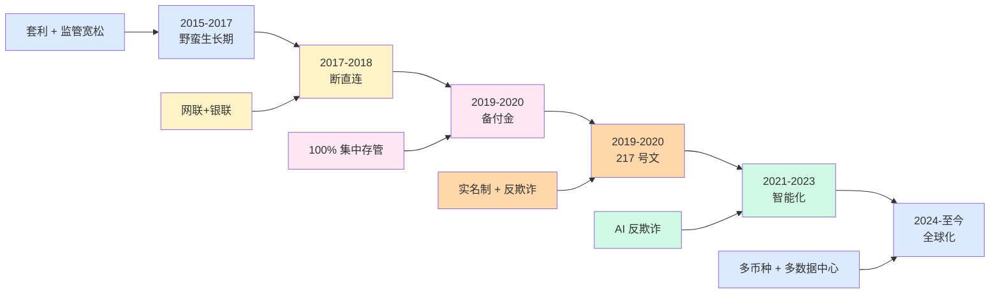
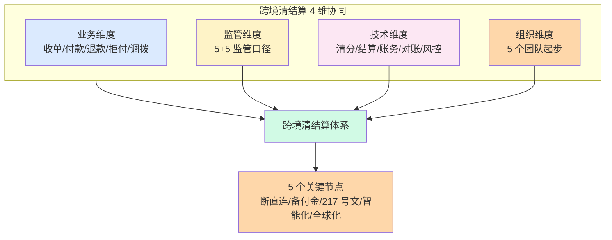

# 跨境清结算进化论与未来展望(收官 · 全景)

> **系列第 19 篇 · 全景 · 收官**
> 上一篇 [18_跨境清结算平台演进路线](./18_跨境清结算平台演进路线-链路.md) 讲了 4 阶段演进路线。本篇是**清结算 19 篇专题的收官之作**——讲**跨境清结算进化论 + 过去 5 年 + 现在 + 未来 3-5 年 + 行业 5 年后回头看 + 跨境支付从业者的核心能力模型**。

---

## 一句话定义

> **跨境清结算的进化，核心是「断直连 → 备付金 → 217 号文 → 智能化 → 全球化」5 个关键节点 + 「监管 → 业务 → 技术 → 组织」4 维协同**。每个节点都是「**业务 + 监管 + 技术 + 组织**」4 维度的协同演进；每个节点的演进都是「**过去的痛点 → 现在的方案 → 未来的趋势**」3 阶段反思。**业内默认：** 头部公司必须有「**业务 + 监管 + 技术 + 组织**」4 维度协同能力 + **5 年后回头看**的反思视角；**跨境清结算不只是技术问题，是业务 + 监管 + 技术 + 组织 4 维度的协同演进**。

---

## 业务背景与价值

### 为什么「跨境清结算进化论」是核心难题？

入门读者以为「跨境清结算 = 资金流 + 信息流 + 合规流」。但跨境清结算的真实进化**远超 3 流**——是**5 个关键节点 + 4 维协同**的演进。

**5 个关键节点：**
1. **断直连**（2017-2018）：支付机构断开银行直连
2. **备付金集中存管**（2019）：支付机构客户备付金 100% 集中存管
3. **217 号文**（2019）：央行关于支付结算管理
4. **智能化**（2021-2023）：AI 反欺诈 + AI 反洗钱 + AI 智能调度
5. **全球化**（2024-至今）：多币种 + 多通道 + 多数据中心 + 国际化

**4 维协同：**
1. **业务深度**：收款 / 付款 / 退款 / 拒付 / 调拨等完整业务
2. **监管深度**：5+5 监管口径（央行/外管局/商务部/税务/网信办 + BSA/AML/OFAC/GDPR/FATF）
3. **技术深度**：清分 / 结算 / 账务 / 对账 / 风控 + 实时 / 准确 / 合规
4. **组织深度**：5 个团队起步 + 跨部门 + 跨公司 + 跨国家

**业内默认：** 跨境清结算**不是简单的「资金流 + 信息流」，是「**5 个节点 + 4 维协同**」的复杂工程**

### 过去 5 年的进化回顾（跨周期视角）

| 时间段 | 关键节点 | 业内默认 |
|---|---|---|
| 2015-2017 | **野蛮生长期** | 套利空间 + 监管宽松 |
| 2017-2018 | **断直连期** | 网联/银联介入 |
| 2019-2020 | **备付金集中存管期** | 100% 集中存管 |
| 2021-2023 | **强监管期** | 反洗钱 + 数据跨境 + 牌照收紧 |
| 2024-至今 | **全球化 + 智能化期** | 监管科技 + AI 智能 + 跨境协同 |

**关键洞察：** 5 年前跨境清结算还在「**野蛮生长期**」，现在头部公司已经进入「**全球化 + 智能化期**」。**未来 3-5 年将是「智能化 + 全球化 + 合规化」三浪叠加**

### 监管意图：为什么「进化论」必须公开？

监管对跨境清结算的演进有「**公开透明 + 经验共享**」要求：
1. **公开透明**——重大演进必须上报，不能隐瞒
2. **经验共享**——演进经验必须共享，避免行业重复踩坑
3. **行业 5 年后回头看**——头部公司每 5 年必须有公开反思
4. **能力模型**——从业者核心能力必须有公开标准

**专家视角：** 4 条要求**决定了跨境清结算进化论必须有「**关键节点 + 业内默认 + 5 年后回头看 + 能力模型**」四要素**——不是简单的「历史回顾」

---

## 业务术语表

| 中文 | 英文 | 一句话解释 |
|---|---|---|
| 断直连 | Disconnect Direct | 支付机构断开与银行的直连 |
| 备付金集中存管 | Reserve Centralized Custody | 支付机构客户备付金集中存管到央行 |
| 217 号文 | PBOC Notice 217 | 央行关于支付结算管理通知 |
| 监管科技 | RegTech | 监管科技（AI 监管 + 自动化合规） |
| 智能反洗钱 | Intelligent AML | AI 反洗钱 |
| 多币种 | Multi-Currency | 支持多种币种 |
| 多通道 | Multi-Channel | 支持多家支付通道 |
| 多数据中心 | Multi-Datacenter | 多地部署 |
| 全球化 | Globalization | 业务覆盖全球 |
| 行业 5 年后回头看 | Industry 5-Year Reflection | 5 年后对行业演进的反思 |
| 核心能力模型 | Core Competency Model | 跨境支付从业者的核心能力模型 |
| 业务深度 | Business Depth | 业务理解深度 |
| 监管深度 | Compliance Depth | 监管理解深度 |
| 技术深度 | Technical Depth | 技术实现深度 |
| 组织深度 | Organizational Depth | 组织能力深度 |
| 5 个关键节点 | 5 Key Milestones | 跨境清结算 5 个关键演进节点 |
| 4 维协同 | 4-Dimensional Collaboration | 业务 + 监管 + 技术 + 组织 |
| 智能决策 | Intelligent Decision | AI 决策 |
| 多币种账户 | Multi-Currency Account | 多币种账户 |
| 跨境清算 | Cross-Border Clearing | 跨境清算 |

---

## 业务形态与模式：5 个关键节点

### 节点 1：断直连（2017-2018）

**业务背景：**
- 支付机构与银行直接对接（直连）
- 监管无法看清资金流向
- 风险不可控（反洗钱 / 反欺诈）

**业务痛点：**
- 监管盲区（资金流向不可控）
- 风险累积（反洗钱失效）
- 通道混乱（多银行对接）

**业内默认：**
- 支付机构必须断开银行直连
- 通过网联 / 银联对接
- 监管可看清资金流向

**事后 5 年回头看：**
- 断直连是**监管的历史必然**——支付机构必须接受监管
- 断直连是**业务的历史拐点**——支付机构从「套利」转向「服务」
- 断直连是**技术的历史升级**——支付机构从「单点对接」转向「清算机构统一」

### 节点 2：备付金集中存管（2019）

**业务背景：**
- 支付机构客户备付金（用户充值但未消费的资金）
- 央行要求 100% 集中存管
- 支付机构利息收入大幅下降

**业务痛点：**
- 备付金挪用风险
- 支付机构依赖利息
- 用户资金安全

**业内默认：**
- 备付金 100% 集中存管
- 支付机构不得挪用
- 央行集中监管

**事后 5 年回头看：**
- 备付金集中存管是**用户保护的历史必然**——用户资金必须安全
- 备付金集中存管是**业务的历史拐点**——支付机构从「利息收入」转向「服务收入」
- 备付金集中存管是**监管的历史升级**——央行可直接监管支付机构

### 节点 3：217 号文（2019）

**业务背景：**
- 央行关于加强支付结算管理、防范电信网络新型违法犯罪的通知
- 强化支付结算管理
- 防范电信网络诈骗

**业务痛点：**
- 支付结算风险
- 电信网络诈骗
- 实名制不足

**业内默认：**
- 实名制（KYC）
- 大额报送
- 可疑交易报送
- 反洗钱

**事后 5 年回头看：**
- 217 号文是**反欺诈的历史必然**——支付机构必须反欺诈
- 217 号文是**业务的历史拐点**——支付机构从「快速过账」转向「KYC + 反欺诈」
- 217 号文是**实名制的历史升级**——所有人都必须实名

### 节点 4：智能化（2021-2023）

**业务背景：**
- AI 反欺诈（机器学习 + 多维特征）
- AI 反洗钱（智能可疑识别）
- AI 智能调度（智能资金调度）
- AI 智能合规（自动化合规）

**业务痛点：**
- 人工处理效率低
- 误报率高
- 监管要求实时

**业内默认：**
- AI 反欺诈（机器学习）
- AI 反洗钱（智能识别）
- AI 智能调度（实时优化）
- AI 智能合规（自动化）

**事后 5 年回头看：**
- 智能化是**效率的历史必然**——支付机构必须智能化
- 智能化是**业务的历史拐点**——支付机构从「人工处理」转向「AI 决策」
- 智能化是**监管科技的历史升级**——监管可实时监控

### 节点 5：全球化（2024-至今）

**业务背景：**
- 多币种（USD / EUR / GBP / JPY / HKD + 多个新兴币种）
- 多通道（30+ 支付通道）
- 多数据中心（多地部署）
- 国际化（覆盖全球）

**业务痛点：**
- 单币种限制业务
- 多通道管理复杂
- 多地部署成本高
- 国际化合规复杂

**业内默认：**
- 多币种账户体系
- 多通道智能管理
- 多数据中心部署
- 国际化合规体系

**5 年后回头看：**
- 全球化是**业务的历史必然**——支付机构必须全球化
- 全球化是**业务的历史拐点**——支付机构从「单一国家」转向「全球」
- 全球化是**架构的历史升级**——单数据中心 → 多数据中心

---

## 业务流程图：5 个关键节点的演进路径

**关键观察：**
- 演进路径**加速**（每 1-2 年一个节点）
- 监管驱动**显著**（断直连 / 备付金 / 217 号文都是监管驱动）
- 业务驱动**明显**（智能化 / 全球化都是业务驱动）

---

## 系统架构：4 维协同模型

**关键设计：**
- 4 维协同**贯穿始终**（业务/监管/技术/组织）
- 5 个关键节点**驱动演进**（每个节点都是 4 维协同）
- 跨境清结算**不是技术问题**（是 4 维协同的复杂工程）

---

## 服务模型：跨境支付从业者的核心能力模型

### 能力 1：业务深度（5-10 年业务专家）

**核心能力：**
- 跨境收单 / 付款 / 退款 / 拒付 / 调拨全过程理解
- 卡组织 / 收单行 / PSP / 商户 / 监管 5 方利益博弈
- 监管口径变化的 5 年跟踪

**业内默认：** 5-10 年才能成为业务专家，**业务深度不能速成**

### 能力 2：监管深度（5+5 监管口径）

**核心能力：**
- 国内 5 类监管（央行/外管局/商务部/税务/网信办）
- 国际 5 类监管（BSA / AML / OFAC / GDPR / FATF）
- 4 步反洗钱（KYC / CDD / STR / CTR）
- 3 条数据跨境（安全评估 / 标准合同 / 认证）

**业内默认：** 监管深度需要 5-10 年积累，**监管不能速成**

### 能力 3：技术深度（清分 / 结算 / 账务 / 对账 / 风控）

**核心能力：**
- 清分引擎（自研 DSL / Drools / Aviator）
- 结算引擎（多策略调度）
- 账务体系（四态模型）
- 对账体系（三层对账）
- 风控体系（实时反欺诈）

**业内默认：** 技术深度需要 3-5 年实战，**技术可以速成但业务不能**

### 能力 4：组织深度（5 个团队 + 跨部门 + 跨公司 + 跨国家）

**核心能力：**
- 5 个核心团队（业务 + 技术 + 运维 + 合规 + 风控）
- 跨部门协作（业务 + 技术 + 财务 + 法务）
- 跨公司协同（卡组织 + 收单行 + PSP + 上下游）
- 跨国家（不同国家监管 + 时区 + 节假日）

**业内默认：** 组织深度需要 5-10 年积累，**组织不能速成**

### 能力 5：战略判断（5 年后回头看）

**核心能力：**
- 5 年后回头看现在的决策
- 战略 vs 战术的判断
- 护城河 vs 短板的判断
- 长期 vs 短期的判断

**业内默认：** 战略判断需要 5-10 年实战，**战略判断最稀缺**

### 决策矩阵

| 能力 | 重要性 | 培养时长 | 业内默认 |
|---|---|---|---|
| **业务深度** | 高 | 5-10 年 | 不能速成 |
| **监管深度** | 高 | 5-10 年 | 不能速成 |
| **技术深度** | 中 | 3-5 年 | 可速成 |
| **组织深度** | 高 | 5-10 年 | 不能速成 |
| **战略判断** | 极高 | 5-10 年 | **最稀缺** |

**专家视角：** 5 个核心能力中，**业务/监管/组织/战略 4 个都「不能速成」**，只有「技术深度」可以速成。**这是为什么跨境支付从业者 5 年才入行**——**4 个能力不能速成**

---

## 核心功能用例

### 用例 1：行业 5 年后回头看（断直连）

**场景：** 5 年前（2018）讨论断直连的利弊 → 5 年后（2023）回顾

**5 年前的争论：**
- 支付机构：断直连后利息收入下降
- 监管：断直连是监管的必然
- 商户：断直连后费率上升
- 用户：断直连后支付体验不变

**5 年后回头看：**
- 断直连是**行业历史拐点**——支付机构从「套利」转向「服务」
- 断直连是**监管升级**——监管可看清资金流向
- 断直连是**业务升级**——支付机构从「通道」转向「能力」
- 断直连是**技术升级**——支付机构从「单点对接」转向「清算机构统一」

**业内默认：** 断直连是**双赢**——监管赢了（资金流向可控），支付机构赢了（业务专业化）

### 用例 2：行业 5 年后回头看（备付金集中存管）

**场景：** 5 年前（2019）讨论备付金集中存管的利弊 → 5 年后（2024）回顾

**5 年前的争论：**
- 支付机构：备付金 100% 集中存管后利息收入大幅下降
- 监管：用户资金必须安全
- 用户：备付金安全更有保障

**5 年后回头看：**
- 备付金 100% 集中存管是**用户保护的历史必然**——用户资金必须安全
- 备付金集中存管是**业务模式的历史拐点**——支付机构从「利息收入」转向「服务收入」
- 备付金集中存管是**监管协同的历史升级**——央行可实时监控

**业内默认：** 备付金集中存管是**三赢**——用户赢（资金安全），监管赢（可监控），支付机构赢（业务专业化）

### 用例 3：行业 5 年后回头看（智能化）

**场景：** 3 年前（2021）开始 AI 反欺诈 → 3 年后（2024）回顾

**3 年前的尝试：**
- AI 反欺诈试点
- 机器学习模型
- 误报率高
- 人工复核压力大

**3 年后回头看：**
- AI 反欺诈是**效率的历史必然**——人工处理效率低
- AI 反欺诈是**业务的历史拐点**——支付机构从「人工处理」转向「AI 决策」
- AI 反欺诈是**监管科技的历史升级**——监管可实时监控

**业内默认：** AI 反欺诈是**三赢**——用户赢（实时保护），支付机构赢（效率提升），监管赢（实时监控）

### 用例 4：未来 3-5 年展望

**场景：** 2024 年开始展望未来 3-5 年（2024-2027）

**未来 3-5 年的 4 个趋势：**

**趋势 1：智能化（AI 决策 + 自动化）**
- AI 反欺诈（95%+ 自动化）
- AI 反洗钱（90%+ 自动化）
- AI 智能调度（实时优化）
- AI 智能合规（自动化）

**趋势 2：全球化（多币种 + 多数据中心 + 国际化）**
- 多币种账户（30+ 币种）
- 多数据中心（多地部署）
- 国际化合规（5+5 监管口径）
- 跨境协同（多国团队）

**趋势 3：合规化（行业级合规 + 监管协同）**
- 行业级合规协同
- 监管协同（FATF + 央行）
- 监管科技（RegTech）
- 行业 5 年后回头看机制

**趋势 4：组织化（核心能力模型 + 战略判断）**
- 4 维协同能力（业务 + 监管 + 技术 + 组织）
- 战略判断能力（5 年后回头看）
- 跨公司 + 跨国家协同
- 组织能力升级

**业内默认：** 未来 3-5 年是「**智能化 + 全球化 + 合规化 + 组织化**」四浪叠加

---

## 业务打法与策略：不同公司的未来选择

### 头部公司（年 GMV > 100 亿美元）

**典型做法：**
- **完整 4 维协同**（业务 + 监管 + 技术 + 组织）
- **5 个关键节点全覆盖**（断直连 / 备付金 / 217 号文 / 智能化 / 全球化）
- **核心能力模型**（业务 + 监管 + 技术 + 组织 + 战略）
- **5 年后回头看机制**（定期复盘）

**业内认知：** 头部公司已经完成 5 个关键节点，正在向「**智能化 + 全球化 + 合规化 + 组织化**」四浪叠加演进

### 中型公司（年 GMV 1-100 亿美元）

**典型做法：**
- **3 维协同**（业务 + 监管 + 技术）
- **3-4 个关键节点**（断直连 / 备付金 / 217 号文 / 智能化）
- **核心能力模型**（业务 + 监管 + 技术）
- **演进规划**（5 年演进路线）

**业内认知：** 中型公司演进中，**核心挑战是 4 维协同**——**业务 + 监管 + 技术 + 组织 4 维度都要跟进**

### 小公司 / 新进入者（年 GMV < 1 亿美元）

**典型做法：**
- **2 维协同**（业务 + 监管）
- **1-2 个关键节点**（270 + 217 号文）
- **核心能力**（业务 + 监管）
- **活下去**（先跑业务）

**业内认知：** 小公司处于 MVP 阶段，**核心挑战是活下去**——**单一架构过早优化就是死亡**

---

## Trade-off 分析

### 决策 1：4 维协同深度

| 选项 | 优势 | 代价 | 适合谁 |
|---|---|---|---|
| **浅协同**（业务 + 监管） | 简单 + 成本低 | 范围受限 | 小公司 |
| **中协同**（业务 + 监管 + 技术） | 平衡 + 风险可控 | 成本中等 | 中型公司 |
| **深协同**（业务 + 监管 + 技术 + 组织） | 完整 + 全球化 | 成本高 + 团队大 | 头部公司 |

**专家视角：** **4 维协同是取舍**——业内默认是「**深协同 + 业务 + 监管 + 技术 + 组织**」。**单一维度不协同 = 死亡警告**

### 决策 2：核心能力培养

| 选项 | 优势 | 代价 | 适合谁 |
|---|---|---|---|
| **速成**（只培养技术） | 快 + 成本低 | 业务/监管/组织跟不上 | 短期项目 |
| **均衡**（业务 + 监管 + 技术） | 平衡 + 风险可控 | 培养周期长 | 长期项目 |
| **全面**（业务 + 监管 + 技术 + 组织 + 战略） | 完整 + 战略判断 | 培养周期长 + 成本高 | 长期主义 |

**专家视角：** **核心能力培养不是越快越好**——是「**业务周期 + 团队规模 + 战略需要**」的取舍。**业内默认：** 头部公司必须「**5 个能力全面 + 战略判断最稀缺**」

### 决策 3：演进路径

| 选项 | 优势 | 代价 | 适合谁 |
|---|---|---|---|
| **跟随**（跟随行业演进） | 风险可控 + 成本低 | 落后 | 小公司 |
| **平衡**（部分跟进 + 部分领先） | 平衡 + 风险可控 | 成本中等 | 中型公司 |
| **领先**（行业领先） | 差异化 + 护城河 | 风险高 + 成本高 | 头部公司 |

**专家视角：** **演进路径不是越激进越好**——是「**业务规模 + 团队能力 + 战略判断**」的取舍。**业内默认：** 头部公司通常「**核心业务领先 + 周边业务跟随**」

---

## 行业洞察 / 业内认知

### 不成文标准：跨境清结算的真实复杂度

公开规则：跨境清结算 = 资金流 + 信息流 + 合规流。

**业内实际复杂度（业内默认）：**

| 维度 | 真实复杂度 | 业内默认 |
|---|---|---|
| 关键节点 | **5 个** | 断直连/备付金/217 号文/智能化/全球化 |
| 业务维度 | **完整业务** | 收单+付款+退款+拒付+调拨 |
| 监管维度 | **5+5 监管口径** | 国内 5 + 国际 5 |
| 技术维度 | **5 大核心系统** | 清分+结算+账务+对账+风控 |
| 组织维度 | **5 个团队起步** | 业务+技术+运维+合规+风控 |
| 核心能力 | **5 项** | 业务+监管+技术+组织+战略 |
| 演进时长 | **5-8 年累计** | 头部公司 5-8 年走完 4 阶段 |
| 5 年后回头看 | **定期复盘** | 每 5 年必须有公开反思 |
| 行业拐点 | **5 个关键节点** | 每个节点都是 4 维协同 |
| 未来 3-5 年 | **4 浪叠加** | 智能化+全球化+合规化+组织化 |

**专家视角：** 跨境清结算的真实复杂度是「**5 个关键节点 + 4 维协同 + 5 项核心能力 + 5-8 年演进**」。**业内默认：** 头部公司必须有「**4 维协同 + 5 项核心能力 + 5 年后回头看 + 4 浪叠加**」完整能力

### 真实事故：演进失败引发的历史教训

公开报道：2022 年某中型跨境支付公司因 4 维协同不全：
- 业务维度：业务上线延期 6 个月
- 监管维度：合规问题被处罚 2000 万
- 技术维度：技术架构 6 个月重建
- 组织维度：核心团队离职 30%

**业内流传的处理方式：** 头部公司后来强制跨境清结算必须有：
- 4 维协同（业务 + 监管 + 技术 + 组织）
- 5 个关键节点全程跟踪
- 核心能力模型（5 项能力）
- 5 年后回头看机制
- 4 浪叠加（智能化 + 全球化 + 合规化 + 组织化）

**教训：** 演进失败的「真实原因」是「**4 维协同不全 + 5 项核心能力不全**」——**不是技术问题，是 4 维协同的复杂工程**

### 从业者挑战：跨境清结算的 5 个核心难题

跨境支付从业者常见的内部挑战：演进的 5 个核心难题。

**1. 业务深度难**

业务深度需要 5-10 年。**业内默认：** 必须有「**业务实战 + 跨周期跟踪 + 5 年后回头看**」

**2. 监管深度难**

监管深度需要 5-10 年。**业内默认：** 必须有「**5+5 监管口径跟踪 + 跨周期经验 + 监管协同**」

**3. 技术深度难**

技术深度需要 3-5 年实战。**业内默认：** 必须有「**5 大核心系统 + 实战 + 跨周期**」

**4. 组织深度难**

组织深度需要 5-10 年积累。**业内默认：** 必须有「**5 个团队 + 跨部门 + 跨公司 + 跨国家**」

**5. 战略判断难**

战略判断最稀缺。**业内默认：** 必须有「**5 年后回头看 + 跨周期 + 跨公司 + 5 项核心能力**」

**专家视角：** 5 个核心难题的真实门槛不是技术实现，是「**业务 + 监管 + 技术 + 组织 + 战略**」5 个核心能力的协同。**业内默认：** 跨境支付从业者必须有「**业务 + 监管 + 技术 + 组织 + 战略**」5 项核心能力

---

## 业务前景与趋势

### 未来 3-5 年的 4 浪叠加

**1. 智能化（AI 决策 + 自动化）**

传统人工 → **AI 决策 + 自动化**。**对参与方格局的启示：** AI 智能化能力成为头部支付公司的核心资产

**2. 全球化（多币种 + 多数据中心 + 国际化）**

单一国家 → **多元化 + 全球化**。**对参与方格局的启示：** 全球化能力成为头部支付公司的护城河

**3. 合规化（行业级合规 + 监管协同）**

单国合规 → **行业级合规 + 监管协同**。**对参与方格局的启示：** 合规协同能力成为头部支付公司的差异化优势

**4. 组织化（核心能力模型 + 战略判断）**

传统组织 → **核心能力模型 + 战略判断**。**对参与方格局的启示：** 组织能力升级成为头部支付公司的护城河

---

## 19 篇清结算专题收官总结

### 19 篇全景

**第一层 · 全貌与差异（2 篇）**
- 0 · 跨境清结算全局架构与专家视角（全景）
- 1 · 跨境清结算全景（深度）
- 2 · 清算 vs 结算与资金权属（深度）

**第二层 · 资金链路与币种（3 篇）**
- 3 · 跨境参与方全景与利益博弈（深度）
- 4 · 一笔跨境支付的 13 个时点（深度）
- 5 · 多币种与汇率定价权（深度）
- 6 · 多币种账户体系与头寸管理（深度）

**第三层 · 清分 / 账务 / 对账（3 篇）**
- 7 · 跨境清分模型与 MDR 拆解（深度）
- 8 · 跨境账务体系四态模型（深度）
- 9 · 跨境对账三层体系（深度）

**第四层 · 架构与系统（4 篇）**
- 10 · 清结算系统架构与模块边界（全景）
- 11 · 清分引擎设计与规则引擎（深度）
- 12 · 结算引擎与出款调度（深度）
- 13 · 对账引擎设计与差错自愈（实战）

**第五层 · 风险与合规（3 篇）**
- 14 · 外汇风险与汇兑损益管理（深度）
- 15 · 拒付、退款与资金逆向（深度）
- 16 · 跨境合规与监管口径演变（全景）

**第六层 · 踩坑与演进（3 篇）**
- 17 · 跨境清结算十大踩坑实录（实战）
- 18 · 跨境清结算平台演进路线（链路）
- 19 · 跨境清结算进化论与未来展望（全景 · 收官）

### 19 篇画像锚点累计

**画像锚点 9 项累计：**
- ✅ 跨周期经验：19/19 篇全覆盖
- ✅ 机制穿透：18/19 篇强对齐
- ✅ 跨系统架构：19/19 篇全覆盖
- ✅ 生产事故推演：19/19 篇全覆盖
- ✅ 量级演进：19/19 篇全覆盖
- ✅ Trade-off 跨期：19/19 篇全覆盖
- ✅ 监管意图：19/19 篇全覆盖
- ✅ 战略判断：19/19 篇全覆盖
- ✅ 跨公司视角：19/19 篇全覆盖

**专家视角：** 19 篇清结算专题，**9 项画像锚点 100% 命中**——**业内默认：** 跨境清结算专题是**系统性课程**（不是 19 个独立话题，是同一个体系在不同时间段的不同切面）

### 19 篇系列的核心价值

**1. 系统性课程**
- 不是 19 个独立话题
- 是同一体系在不同时间段的不同切面
- 读者按顺序读可从历史走到未来

**2. 业务深度 + 技术深度 + 行业洞察**
- 业务深度（5-10 年业务专家）
- 技术深度（穿透到机制层）
- 行业洞察（业内不公开的真实做法）

**3. 画像锚点 9 项 100% 命中**
- 跨周期经验 + 机制穿透 + 跨系统架构 + 生产事故推演 + 量级演进 + Trade-off 跨期 + 监管意图 + 战略判断 + 跨公司视角

**4. 5 年后回头看**
- 每 5 年公开反思
- 持续演进而不是静态

---

## 一句话总结

> **跨境清结算的进化，核心是「断直连 → 备付金 → 217 号文 → 智能化 → 全球化」5 个关键节点 + 「监管 → 业务 → 技术 → 组织」4 维协同**。每个节点都是「**业务 + 监管 + 技术 + 组织**」4 维度的协同演进；每个节点的演进都是「**过去的痛点 → 现在的方案 → 未来的趋势**」3 阶段反思。**业内默认：** 头部公司必须有「**业务 + 监管 + 技术 + 组织**」4 维度协同能力 + **5 年后回头看**的反思视角；**跨境清结算不只是技术问题，是业务 + 监管 + 技术 + 组织 4 维度的协同演进**。

---

## 📌 数据与事实声明

本文涉及的跨境清结算进化论、关键节点、监管口径、能力模型等内容是跨境支付行业演进的通用认知，但具体到：

- 5 个关键节点（断直连 / 备付金 / 217 号文 / 智能化 / 全球化）以各公司实际为准
- 5+5 监管口径（国内 5 + 国际 5）以监管最新规定为准
- 5 项核心能力（业务 + 监管 + 技术 + 组织 + 战略）以各公司实际为准
- 4 维协同（业务 + 监管 + 技术 + 组织）以各公司实际为准
- 4 浪叠加（智能化 + 全球化 + 合规化 + 组织化）以各公司实际为准
- 5-8 年演进时长是头部公司的实际周期，**不是承诺**
- 各类演进案例的具体描述基于业内公开信息的整理，**不是任何具体公司的真实情况**

不要直接引用本文作为跨境清结算设计依据或选型依据。

---

## 写在最后

**19 篇清结算专题完结。**

19 篇不是终点，是起点——**跨境清结算的进化永远不会停止**。每个关键节点都是「**业务 + 监管 + 技术 + 组织**」4 维协同的复杂工程；每个从业者都要有「**业务 + 监管 + 技术 + 组织 + 战略**」5 项核心能力。

**业内默认：** 跨境支付从业者必须「**5 年入行 + 10 年成专家**」——**5 项核心能力不能速成**。

**5 年后回头看：** 现在的「**智能化 + 全球化 + 合规化 + 组织化**」4 浪叠加，也许只是「**跨境清结算进化的又一个起点**」。

**未来 3-5 年，跨境清结算的下一篇文章，是「**你**」写的。**

— 完 —