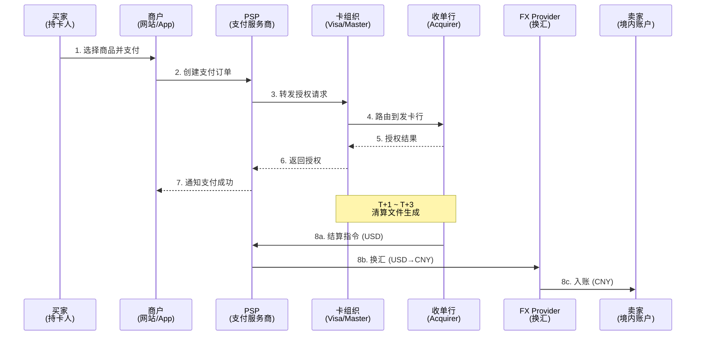
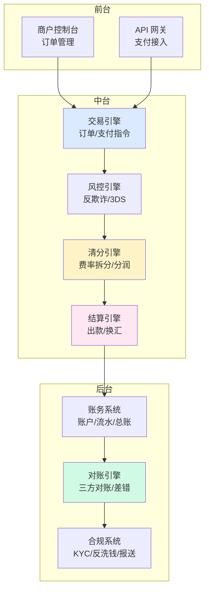
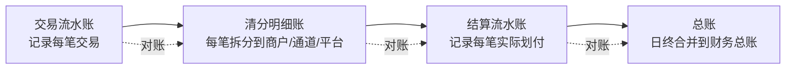
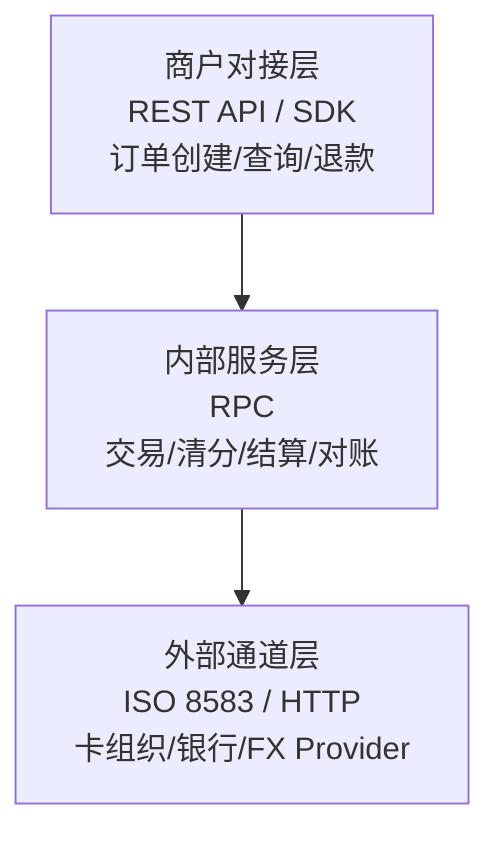

# 跨境清结算全景（侧重收单）

> **系列第 1 篇 · 深度**
> 上一篇 [0_全局架构与专家视角](./0_跨境清结算全局架构与专家视角-全景.md) 给出了跨境清结算的整体心智模型。本篇把它展开——从「跨境 vs 国内」的 12 个本质差异，到「收单侧」独有的合规、技术、商业约束。

---

## 一句话定义

> **跨境收单的清结算**，是钱从境外买家信用卡出发，经过卡组织清算网络、收单机构、外汇提供商，最终落到境内卖家人民币账户的全链路过程——这条链路每跳都涉及「资金权属变更 + 币种转换 + 合规校验」三件事。

---

## 业务背景与价值

跨境收单是过去十年中国支付行业增速最快的赛道之一。三个宏观驱动力：

**第一，中国卖家出海。** 从最早的 eBay/Amazon 卖家，到现在的独立站、TikTok Shop、Temu 等平台，跨境电商 GMV 持续高速增长，背后是几百万中小卖家需要收款能力。

> ⚠️ 注：具体 GMV 数字属于行业估算，不同口径有差异，本文不引用具体数值。

**第二，海外消费者买中国货。** SHEIN、Temu 的「小额高频」跨境零售，让单笔金额从 $50 降到 $5-20，对支付成功率、拒付率、汇率点差都更敏感。

**第三，监管牌照放开。** 跨境支付牌照逐步放开，目前国内已有数十家持牌机构。但牌照门槛、合规成本、资金安全要求逐年提高，新进入者越来越少。

> ⚠️ 注：「2013 年首批」「30+ 家」是行业大致认知，具体时间和数量以监管公告为准。

**为什么这件事值得深入？** 因为跨境收单的「钱」不是钱，是「合规边界 + 资金链路 + 商业规则」的综合体现。一个跨境支付工程师要懂业务、懂技术、懂合规，三者缺一不可。

---

## 业务术语表（收单侧专有）

| 中文 | 英文 | 一句话解释 |
|---|---|---|
| 商户 | Merchant | 收款方卖家（境内电商/平台） |
| 持卡人 | Cardholder | 付款方买家（境外消费者） |
| 收单 | Acquiring | 为商户提供支付受理服务的全过程 |
| 拒付 | Chargeback | 持卡人向发卡行发起争议，资金反向流回 |
| 退款 | Refund | 商户主动向持卡人退回资金 |
| 预授权 | Pre-authorization | 冻结资金但不实际扣款（酒店/租车场景） |
| 终态授权 | Capture | 实际扣款（预授权后） |
| 通道 | Payment Gateway | 连接商户和卡组织的技术中介 |
| 路由 | Routing | 多通道间智能选择最优通道的策略 |
| 多币种定价 | Multi-Currency Pricing (MCP) | 商户可选币种展示价格（避免 DCC 溢价） |
| 3DS | 3-D Secure | 卡组织的风控验证协议（持卡人额外验证） |
| KYB | Know Your Business | 对商户的实名认证 |

---

## 跨境 vs 国内：12 个本质差异

入门读者第一张对比表。这 12 个差异决定了你为什么不能用国内那套打法做跨境。

| 维度 | 国内支付 | 跨境收单 |
|---|---|---|
| **资金跳数** | 几跳 | 更多跳（取决于通道和币种）|
| **时延** | T+0 实时 | T+1 ~ T+7 |
| **币种** | 1 个（人民币） | 4-5 个（标价/支付/清算/结算/入账） |
| **监管** | 1 套（人行+银联/网联） | 3+ 套（卡组织+收单国监管+境内监管） |
| **对手方** | 1-2 个 | 5+ 个 |
| **对账频率** | T+0 自动对账 | T+1 ~ T+N 多方对账 |
| **拒付机制** | 无（支付机构兜底） | 有（卡组织强制规则） |
| **汇率风险** | 无 | 有（占支付公司利润 5-15%） |
| **合规成本** | 低（边际成本接近零） | 高（年增 20%+） |
| **通道切换** | 容易（API 标准统一） | 困难（每个卡组织/区域独立集成） |
| **失败排查** | 分钟级 | 天级（跨时区、跨主体） |
| **故障影响** | 损失交易费 | 损失资金安全 + 监管处罚 |

**专家视角：** 这 12 个差异里，第 1-4 个是「架构差异」，决定你怎么设计系统；第 5-8 个是「运营差异」，决定你怎么组织团队；第 9-12 个是「战略差异」，决定你能做多大的生意。

---

## 业务流程图：跨境收单全景链路

入门读者第一张时序图。从买家点击支付，到卖家收到人民币，整个链路有 8 个关键节点：

**关键时点说明：**

- **时点 1-7（授权阶段）：** T+0 实时完成，决定成功率、风控拦截、3DS 验证
- **时点 8a（清算阶段）：** T+1 ~ T+3，卡组织生成清算文件
- **时点 8b-8c（结算阶段）：** T+3 ~ T+7，资金从 USD 账户换汇到 CNY 入账

**专家视角：** 跨境收单的「实时」只到时点 7。时点 8 之后的清算+结算是异步的，**这和国内支付最大的区别**——你的系统设计必须能容忍「订单已支付但资金还没到账」的状态窗口。

---

## 业务形态与模式：收单侧的四种商业模式

### 模式 1：纯技术服务（Gateway）

**做什么：** 提供支付 API/SDK，不碰资金
**代表：** Stripe、Adyen
**收入：** 每笔交易 0.1%-0.3% 服务费
**优点：** 合规简单（无需支付牌照）、规模化快
**缺点：** 议价权弱、客户黏性低

### 模式 2：聚合支付（Payment Facilitator / PayFac）

**做什么：** 为子商户提供收单服务，自己是主商户
**代表：** Square、PayPal
**收入：** 总费率 2.5%-3.5%
**优点：** 客户黏性强、可叠加增值服务
**缺点：** 需要支付牌照、承担拒付风险

### 模式 3：直连收单（Direct Acquirer）

**做什么：** 直接和卡组织签约，给大商户提供收单
**代表：** 各国的本土收单行
**收入：** interchange + assessment + markup
**优点：** 费率最优、品牌直接对接
**缺点：** 对接周期 6-12 个月、合规风险自己扛

### 模式 4：跨境收单 + 综合服务

**做什么：** 收单 + 换汇 + 合规 + 增值（VAT、退税）
**代表：** WorldFirst、连连国际、PingPong
**收入：** 综合费率 1%-3%
**优点：** 客户黏性最高、能切更多蛋糕
**缺点：** 系统复杂、合规边界模糊

**Trade-off：** 中国跨境支付公司大多走模式 4，因为单做模式 1 利润太薄，必须叠增值服务。

---

## 系统架构：收单侧的四大核心系统

**四大系统的核心职责：**

| 系统 | 核心职责 | 关键指标 |
|---|---|---|
| 交易引擎 | 创建订单、处理支付指令、维护状态机 | 成功率、时延 |
| 清分引擎 | 拆分 MDR、计算分润、生成清分记录 | 准确性、可重放性 |
| 结算引擎 | 出款指令、换汇调度、头寸管理 | 成功率、时效 |
| 对账引擎 | 三方对账、差错发现、自动调账 | 对账成功率、调账时效 |

---

## 数据模型：收单侧四本账

收单侧有四本账，每本账的用途、记账规则、合规要求完全不同：

**四本账的核心差异：**

| 账本 | 记录什么 | 记账单位 | 合规要求 |
|---|---|---|---|
| 交易流水账 | 每笔支付的请求/响应 | 原币 | 留存 5 年 |
| 清分明细账 | 每笔拆给商户/通道/平台的金额 | 原币 + 本位币 | 留存 5 年 |
| 结算流水账 | 每笔实际划付的金额 | 实际划付币种 | 留存 5 年 |
| 总账 | 日终合并的财务账 | 本位币（人民币） | 留存 10 年 |

**专家视角：** 四本账的「对账」不是简单的金额校验，是「资金流、信息流、合规流」在每个时点的对齐。入门读者最容易踩的坑就是「交易流水有、清分明细无」，导致对账直接失败。

---

## 核心功能用例

### 用例 1：标准跨境电商收款（最常见）

**场景：** 美国买家用 Visa 卡在 SHEIN 买 $50 商品，SHEIN 收到 ¥360 人民币
**资金链路：** 买家 Visa 卡 → Visa 清算 → 收单行 USD 账户 → PSP 在途 USD → 换汇 CNY → SHEIN 人民币账户
**合规要求：** KYB + 反洗钱筛查 + 外汇申报 + 监管报送
**典型费率（参考范围）：** 卡组织费率 + PSP 服务费 + 换汇点差，跨境收单总费率通常在 2%-4% 区间（具体取决于卡种、国家、交易类型）。

### 用例 2：3DS 验证拦截欺诈交易

**场景：** 欧洲买家用被盗的 Mastercard 支付
**触发：** 风控引擎识别异常 IP + 卡 BIN 风险 + 设备指纹
**动作：** 触发 3DS 验证 → 持卡人无法通过验证 → 交易拒绝
**专家视角：** 3DS 不是「加一道验证」，是「把拒付责任从商户转给发卡行」。3DS 通过的交易，后续发生拒付，发卡行承担损失。

### 用例 3：拒付处理

**场景：** 英国买家收到商品后声称「未收到」，向发卡行发起 chargeback
**流程：** 发卡行通知收单行 → 收单行通知 PSP → PSP 通知商户 → 商户提交证据 → 卡组织仲裁
**时延：** 通常 30-120 天（取决于争议阶段和举证周期）
**资金影响：** 资金暂时冻结，仲裁后退回买家或退回商户
**专家视角：** 卡组织对拒付率（chargeback ratio）有监控阈值——Visa 的 VAMP 项目、Mastercard 的 ABC 项目都有分级管理机制。超过阈值会被列入监控名单，最坏情况是被强制接入风险监控项目或限制商户类别。

> ⚠️ 注：具体阈值（1%/3%等）是行业大致认知，实际以卡组织最新规则为准。

---

## 服务模型：收单侧的接口设计

收单侧的 API 分三层：

**接口设计原则（专家共识）：**

1. **幂等性** — 同一订单多次请求必须返回同一结果
2. **可重放** — 清分/结算结果必须能重算（用于对账）
3. **可追溯** — 任何状态变更能在 5 分钟内定位到原始请求
4. **状态机严格** — 不允许跨状态变更（如「已退款」不能变成「已支付」）

---

## 业务打法与策略

跨境收单公司怎么做出竞争优势？看五个维度：

**1. 成功率优化** —— 多通道智能路由，根据卡种/国家/金额动态选择最优通道（Visa vs Mastercard vs 本地支付）。每提升 1% 成功率，营收提升 2-5%。

**2. 拒付率控制** —— 3DS 强制 + 风控拦截 + 拒付预警。拒付率每降低 0.5%，商户续费率提升 10%+。

**3. 汇率优化** —— 自营汇率团队 vs 银行锁汇 vs 第三方汇率聚合。每笔交易省 0.1% 汇率点差，年化千万级利润。

**4. 合规前置** —— 把 KYB/反洗钱嵌入支付流程每一个环节，而不是事后补查。一次合规失误可能导致牌照受限。

**5. 资金头寸管理** —— 实时监控多币种备付金水位，预警、调拨、避免出款失败。出款失败一次，商户流失率提升 30%。

---

## Trade-off 分析：收单侧关键选型

| 决策点 | 选项 A | 选项 B | 怎么选 |
|---|---|---|---|
| 直连 vs 间连 | 直连卡组织（费率低） | 间连 PSP（灵活） | 早期间连、规模到 100 亿+ GMV 再考虑直连 |
| 自建汇率 vs 银行锁汇 | 自营 FX 团队 | 银行报价 | 规模到 50 亿+ USD 再自营 |
| 单账本 vs 多账本 | 单账户多币种 | 多账户多币种 | 中小规模单账本、跨境大卖家多账本 |
| 自建对账 vs SaaS 对账 | 自研规则引擎 | 第三方 SaaS | 早期 SaaS、规模到 1 亿+ 笔/年自建 |
| 3DS 强制 vs 选择性 | 所有交易强制 3DS | 高风险交易 3DS | 看拒付率目标（< 0.5% 强制、> 0.5% 选择性） |

---

---

## 行业洞察 / 业内认知

### 不成文标准：跨境收单的大头是汇率点差，不是交易费

跨境支付业内头部公司的收入结构里，「交易手续费」只是表象，真正的大头是「汇率点差」——业内通常在 0.3%-0.8% 之间，看币种和交易量。

公开渠道口径参考：头部跨境支付公司公开披露的收入结构里，交易费收入约 30%-40%，汇率收入约 40%-50%，增值服务（VAT/退税/合规咨询）约 15%-25%。

**新手误区：** 谈判时盯着交易费率谈（卡组织 interchange + 自家 markup），以为 0.5% 利润率很可观。实际上**汇率点差空间是交易费的 2-3 倍**，且谈判自由度更高（卡组织汇率是死的，FX 报价是可谈的）。

**对系统设计的影响：** 收单系统必须有「汇率管理模块」作为核心组件，不是「附属功能」。汇率点差的 0.1% 优化，年化就是千万级利润。

### 真实事故：汇兑损益争议引发合作终止

公开报道：2022 年某跨境电商公司因汇率波动，与境外支付服务商就「结算日汇率」产生争议——电商认为应该按清算日汇率结算，支付服务商按实际结算日汇率结算，三个月内累计汇兑损益差异超过千万人民币。最终该电商终止合作，转向其他支付服务商，并引发业内对「汇率时点约定」的广泛讨论。

**业内流传的处理方式：** 头部支付公司现在普遍在合同里**明确约定汇率时点**（清算日 / 结算日 / 商户选择日），并提供「汇率锁定」增值服务（按 0.1% 服务费让商户锁定汇率）。

**教训：** 汇率时点约定不能含糊。必须在合同、清算系统、财务系统三个层面保持一致——任何一处不一致都会被放大成汇兑损益争议。

### 从业者挑战：直连 vs 间连的战略选择

跨境支付公司常见的产品决策：直连卡组织（费率最优、合规风险自己扛）vs 间连 PSP（灵活、费率溢价）vs 聚合通道（成功率高、系统复杂）。

业内通用做法：**早期 100% 间连**（省合规成本、快速上线）→ **中等规模部分直连**（核心通道直连、长尾通道间连）→ **头部规模全直连**（100 亿+ GMV 才有 ROI）。

5-10 年专家的判断依据：直连不是技术问题，是**业务战略问题**——直连意味着你要自己扛合规、自己养风控团队、自己处理拒付。规模不到 100 亿 GMV 时，直连的合规成本可能吃掉费率节省的全部利润。

## 业务前景与趋势

跨境收单行业正在发生四个结构性变化：

**1. 本地支付崛起。** 巴西 Pix、印度 UPI、东南亚 GrabPay 正在吃掉信用卡份额。新兴市场跨境支付里，本地支付渠道占比已经从 2018 年的 15% 涨到 2024 年的 45%。**对收单侧的启示：** 必须支持本地支付通道，不能只押信用卡。

**2. 实时跨境支付。** SWIFT GPI、Visa B2B Connect、万事达 Send 让跨境支付从 T+1 走向 T+0。**对收单侧的启示：** 「T+0 实时结算」将成标配，现在的 T+3 结算会被淘汰。

**3. 合规边界持续收紧。** 欧盟 Travel Rule（资金转移规则）、各国数据本地化、反洗钱第六版指令。**对收单侧的启示：** 合规成本年增 20%+，必须把合规嵌入系统而非事后补查。

**4. 跨境 B2B 支付崛起。** 传统信用证流程 7-15 天，区块链跨境结算可缩短到 T+0。**对收单侧的启示：** B2B 跨境支付是下一个十年的增量市场。

---

## 入门读者最容易踩的 3 个认知误区

**误区 1：「跨境收单就是接个 Visa/Mastercard SDK」**
**真相：** 跨境收单=支付通道+清分引擎+结算引擎+对账引擎+合规系统+汇率管理。接 SDK 只是冰山一角。

**误区 2：「支付成功 = 收到钱」**
**真相：** 支付成功只到「授权」环节（时点 7）。资金到账还要走清算+结算（T+1~T+7）。期间任何环节都可能出问题。

**误区 3：「拒付是买家的事，和我无关」**
**真相：** 拒付直接影响你的卡组织风险评级，拒付率超过阈值会被强制接入监控项目，最坏情况是被封号。所有收单公司都必须建拒赔率预警机制。

---

## 一句话总结

> **跨境收单不是「接 SDK + 等钱到」，是「13 个时点 + 三流合一 + 持续合规」的复杂博弈。每一个时点都可能出事，每一流错位都是事故。**

---

## 下一篇预告

下一篇 [2_清算 vs 结算与资金权属](./2_清算vs结算与资金权属-深度.md) 已完成——深入「清算」和「结算」的本质差异，两个时点之间的「在途资金」是合规、税务、对账、风险的高发地带。

下一篇预告：[3_跨境参与方全景与利益博弈](./3_跨境参与方全景与利益博弈-深度.md) — 9 类角色 + 利益博弈。

---

## 📌 数据与事实声明

本文涉及的行业数据、市场份额、费率区间、时延范围、监管阈值等，均为基于行业公开信息和经验的**大致认知**，具体数值可能因：

- 时间口径（不同年份数据有差异）
- 统计口径（不同机构/报告口径不同）
- 业务场景（不同卡种/国家/商户类型差异）
- 监管动态（卡组织和监管规则会更新）

而有所不同。**请以最新官方公告和监管文件为准，不要直接引用本文数值作为决策依据。**

涉及的卡组织产品（Visa B2B Connect、Mastercard Send、SWIFT GPI、FedNow 等）和监管法规（欧盟 Travel Rule、各国数据本地化等）是真实存在的行业概念，但具体规则和时间表请参考官方最新文档。
