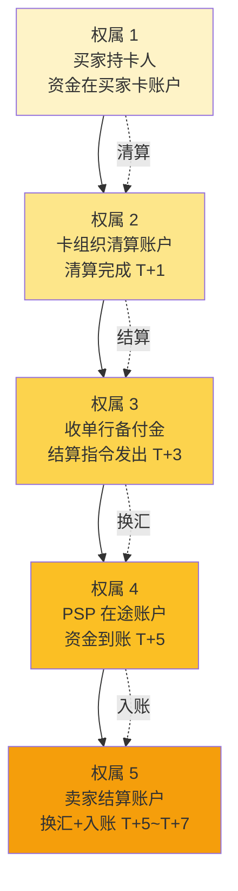
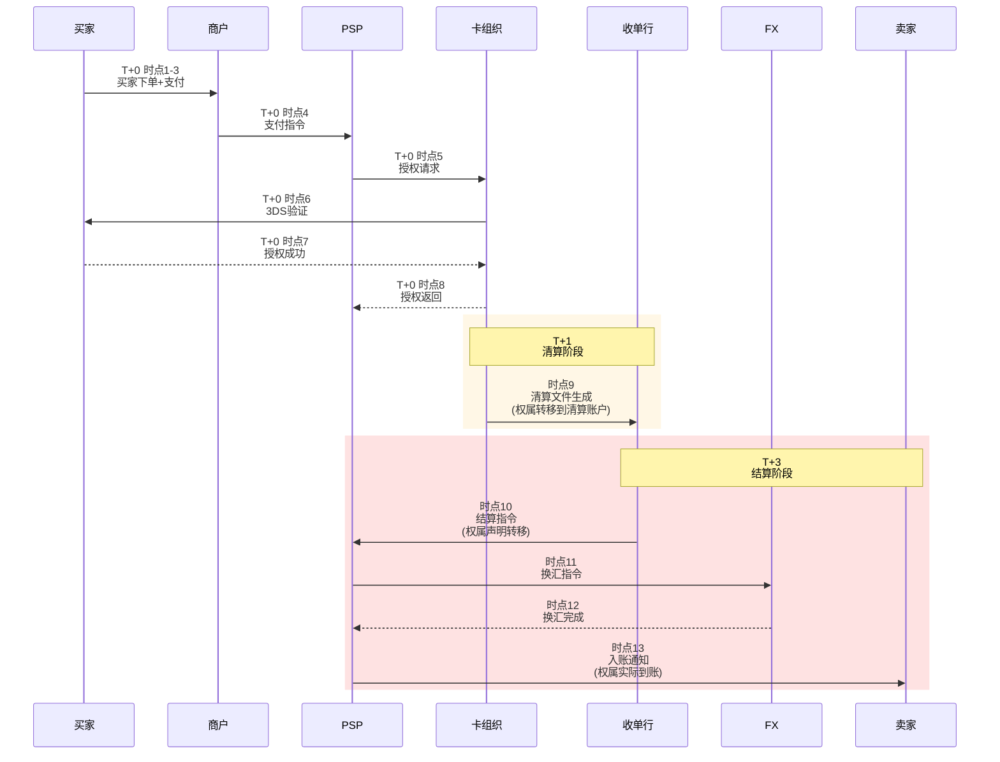

# 清算 vs 结算与资金权属（侧重收单）

> **系列第 2 篇 · 深度**
> 上一篇 [1_跨境清结算全景](./1_跨境清结算全景-深度.md) 讲过资金链路有 8 个关键节点。本篇聚焦其中最容易被入门读者混淆的两个时点——**清算**（Clearing）和**结算**（Settlement）。这两个词只差一个字，但法律意义、资金权属、合规处理完全不同。

---

## 一句话定义

> **清算** = 法律意义上的债权债务确认时点（钱在哪个账户「应该归谁」被法律锁定）；**结算** = 资金的实际划付时点（钱真的从一个账户划到另一个账户）。清算完成不等于钱到账，结算发起不等于钱已收到——这两个时点之间的「在途资金」，是跨境支付事故的高发地带。

---

## 业务背景与价值

为什么入门读者最容易把这两个词搞混？因为日常语言里「清结算」经常被当成一个词使用。但在跨境支付的合规、税务、争议处理场景里，**清算日和结算日是两个独立的法律时点**：

**典型场景：跨境电商 SHEIN 的 $10,000 美元收款**

| 时点 | 事件 | 法律意义 | 资金权属 |
|---|---|---|---|
| T+0 买家支付成功 | 授权通过 | 合同成立 | 仍在买家卡账户 |
| T+1 清算文件生成 | Visa 清算网络算出「该划给收单行 $10,000」 | **清算完成** | 资金权属转移到卡组织清算账户 |
| T+3 结算指令发出 | 收单行向 PSP 发出结算指令 | 结算发起 | 资金权属声明转移到 PSP |
| T+5 资金实际到账 | PSP 账户收到 $10,000 | **结算完成** | 资金权属实际转移到 PSP |

**为什么这件事重要？** 因为如果发生纠纷（比如买家拒付、监管冻结、税务核查），问「钱在什么时候属于谁」决定了谁来承担法律责任。如果你的回答是「T+0 买家支付成功就归商户」，可能面临监管处罚——因为那时钱还在买家账户里，清算没完成前法律上不归你管。

---

## 业务术语表

| 中文 | 英文 | 一句话解释 |
|---|---|---|
| 清算 | Clearing | 算账+锁定权属：算出谁欠谁多少，并锁定法律意义上的资金归属 |
| 结算 | Settlement | 划付+落地：把资金从一个账户实际划到另一个账户 |
| 清算日 | Clearing Date | 卡组织清算文件生成日（通常 T+1） |
| 结算日 | Settlement Date | 资金实际到账日（跨境 T+3 ~ T+7） |
| 在途资金 | In-transit Funds | 清算完成但结算未完成的资金 |
| 资金权属 | Beneficial Ownership | 资金在法律上「归谁所有」 |
| 头寸 | Position | 账户里可用资金余额（结算完成后才增加） |
| 待清算 | Pending Clearing | 资金权属尚未锁定的中间状态 |
| 待结算 | Pending Settlement | 权属已锁定但钱未到账的中间状态 |
| 净额清算 | Net Clearing | 多笔交易轧差后只清算差额（降低清算网络压力） |
| 实时全额清算 | RTGS | 大额支付系统的实时全额划付（央行级别） |

---

## 清算 vs 结算：6 个维度对比

这是入门读者必须掌握的第一张对比表：

| 维度 | 清算 | 结算 |
|---|---|---|
| **本质** | 算账 + 锁定权属 | 划钱 + 落地 |
| **法律意义** | 债权债务确认时点 | 资金实际转移时点 |
| **时间** | 通常 T+1（卡组织清算文件生成） | 跨境 T+3 ~ T+7 |
| **资金权属** | 锁定到清算账户（卡组织层面） | 实际转移到收款方 |
| **可逆性** | 清算后可被拒付（chargeback）撤销 | 结算完成后一般不可逆 |
| **税务影响** | 清算完成是部分税务管辖区收入确认时点 | 结算完成是大部分税务管辖区收入确认时点 |

**专家视角：** 国内支付因为「秒级到账」，清算和结算几乎同时发生，所以大家感受不到差异。但跨境支付这两个时点错开 2-7 天，**任何系统设计、账务处理、合规报送、争议处理都必须基于这两个时点分别建模**。

---

## 资金权属流转：13 个时点中的 5 个权属变化

跨境支付的「钱」在链路上要经过 5 次权属变化。每一次都是法律意义的变更，不只是技术动作：



**关键洞察：每次权属变化都伴随 3 件事：**
1. **会计记账**：原币账 + 本位币账双重记录
2. **合规校验**：当前权属方是否有 KYC/KYB
3. **风险归属**：当前权属方承担拒付/欺诈/汇率风险

**专家视角：** 资金权属变化不是「系统自动完成」的动作，是「法律事实」。系统能做的只是记录权属变化时点，不能「创造」权属变化。这意味着——

> **你的系统必须能回答「2026-07-31 14:23:01 这 $10,000 在法律上属于谁？」这个问题。**

答不上来 = 合规风险。

---

## 时序图：清算与结算在 13 个时点中的位置

把清算和结算放进完整的 13 个时点时序图，看清楚两个时点的精确位置：



**图中两个 rect 的核心区别：**
- **黄色 rect（清算）**：只有「算账 + 锁定权属」，钱还没动
- **红色 rect（结算）**：钱真的从 A 账户划到 P 账户再到 S 账户

**专家视角：** 清算日 vs 结算日错配是**跨境支付合规问题的高发区**。比如：
- 监管要求「T+1 报送可疑交易」，但你的系统是基于结算日 T+3 报送 → 漏报
- 税务申报需要「收入确认时点」，但你的账务是基于结算日 T+5 确认 → 错配税务期间
- 商户问「我的钱什么时候能花」，你的回答是「结算完成后」（T+5），但商户以为「授权成功后」（T+0）→ 商户投诉

---

## 业务形态：清算与结算的四种组合模式

### 模式 1：清算 + 结算同天（国内支付）

**特点：** T+0 当天清算完成，当天结算完成
**典型场景：** 国内支付宝、微信支付
**优点：** 实时到账，用户体验好
**缺点：** 系统复杂度高，对账压力大

### 模式 2：清算 T+1，结算 T+1（境外卡国内收单）

**特点：** 卡组织清算文件 T+1 生成，结算 T+1 完成
**典型场景：** Visa/Master 国内收单
**优点：** 标准模式，卡组织规则明确
**缺点：** 商户 T+1 才能看到钱

### 模式 3：清算 T+1，结算 T+3 ~ T+7（跨境收单）

**特点：** 清算完成早，结算完成晚
**典型场景：** 跨境电商收款
**优点：** 卡组织规则统一
**缺点：** 在途资金规模大，汇兑风险高

### 模式 4：清算 + 结算分多笔（净额清算）

**特点：** 多笔交易轧差后只清算净额
**典型场景：** 银行间清算、B2B 大额支付
**优点：** 降低清算网络压力
**缺点：** 单笔追溯难，对账复杂

**Trade-off：** 跨境收单一般是模式 3，但商户希望模式 1（实时到账）。中间的 gap 是支付公司的产品机会——可以垫付资金做「T+0 到账」增值服务，收取垫付手续费。

---

## 数据模型：清算日与结算日字段分离

跨境支付系统必须把清算日和结算日作为**两个独立字段**存储，不能用一个 `settlement_date` 字段搞定：

```
清算日期: clearing_date = 2026-07-30
结算日期: settlement_date = 2026-08-02
在途时长: in_transit_days = 3
资金状态: status = PENDING_SETTLEMENT
权属方: beneficial_owner = PSP（在途）
```

**为什么必须分开？**
1. **对账需要** — 清算文件 T+1 到达，结算文件 T+3 到达，对账必须按各自日期分别处理
2. **合规报送需要** — 反洗钱系统按清算日筛查，税务系统按结算日申报
3. **头寸管理需要** — 资金头寸按清算日计算（已锁定权属的部分），不用等结算
4. **拒付处理需要** — 拒付窗口从清算日开始算，不是从结算日开始

**专家视角：** 入门系统经常犯的错——用一个 `payment_date` 字段记录所有时间点。这会导致：
- 反洗钱系统 T+1 筛查不到 T+1 清算的交易（因为 payment_date 是 T+0）
- 财务对账时找不到 T+3 结算的交易
- 拒付处理错过清算日窗口

**正确做法：清算日、结算日、拒付窗口日、对账日分别建模。**

---

## 服务模型：清算和结算的接口设计

清结算系统的接口必须明确两个时点：

```
清算接口：
  POST /clearing/process
    入参: clearing_file (卡组织清算文件)
    返回: clearing_results (清算结果+权属变更记录)
    时点: T+1 批量处理

结算接口：
  POST /settlement/initiate
    入参: settlement_orders (结算指令列表)
    返回: settlement_results (结算结果+头寸变更)
    时点: T+3 批量发起

  POST /settlement/confirm
    入参: bank_receipts (银行回单)
    返回: settlement_confirmed (结算确认记录)
    时点: T+3 ~ T+7 异步确认
```

**关键设计原则：**
1. **清算接口幂等** — 同一清算文件多次处理结果一致
2. **结算接口状态机** — 发起 → 银行处理中 → 成功/失败，不允许跨状态变更
3. **权属变更原子性** — 清算完成的权属变更必须和清算文件处理在同一事务
4. **对账独立** — 清算对账和结算对账是两个独立流程，不要混在一起

---

## 核心功能用例

### 用例 1：清算完成但结算失败的回滚

**场景：** T+1 清算完成，T+3 结算指令发出，但 T+5 银行回单显示「账户余额不足」
**处理：**
1. 结算失败 → 触发头寸预警
2. 自动重试（最多 3 次，间隔 1 小时）
3. 仍失败 → 人工介入
4. 资金权属状态：回退到「待结算」（不是「待清算」，因为清算已完成）

**专家视角：** 清算完成 ≠ 结算完成。如果结算失败，资金权属**不会自动回退到清算前状态**——你必须明确处理这个「半完成」状态，否则对账会混乱。

### 用例 2：跨境电商多币种结算的税务处理

**场景：** SHEIN 收到 $10,000 USD，需要换汇成 ¥72,000 CNY 给境内卖家
**税务时点：**
- 清算完成（T+1）→ 部分税务管辖区认定为收入确认时点
- 结算完成（T+5）→ 中国税务管辖区认定为收入确认时点

**Trade-off：** 同一笔交易在两个税务时点之间有 4 天 gap。如果 4 天内汇率从 7.20 跌到 7.15，卖家收到的人民币减少 ¥3,500——**这 ¥3,500 是汇兑损失还是收入减少？会计处理完全不同**。

### 用例 3：监管冻结在途资金

**场景：** 跨境支付公司因合规问题被监管冻结账户，所有 T+3 后的结算无法实际到账
**问题：** 清算已完成（T+1），但结算无法完成（T+5 资金被冻结）
**资金权属：**
- 清算完成时 → 权属理论上应转移到 PSP
- 实际结算时 → 钱被冻结，权属不明

**处理：**
- 法律上：权属仍在卡组织清算账户（因为没完成结算）
- 会计上：按「在途资金挂账」处理，不能确认为收入
- 合规上：触发监管报送，标注「异常状态」

**专家视角：** 在途资金被监管冻结是**最高级别的合规事件**——既影响商户资金（钱到不了账），又触发监管问询（为什么被冻结），又影响公司牌照（合规风险暴露）。必须建立 in-transit funds 的专项监控。

---

## Trade-off 分析

| 决策点 | 选项 A | 选项 B | 关键考虑 |
|---|---|---|---|
| 清算日 vs 结算日建模 | 一个字段 | 两个字段 | **必须两个**（合规、对账、税务都需要） |
| 在途资金记账 | 不记账 | 挂账 | **必须挂账**（影响资产负债表） |
| 在途资金利息 | 不计 | 计 | 看合规要求（部分监管要求不计息） |
| 拒付窗口起点 | 授权日 | 清算日 | **必须清算日**（卡组织规则） |
| 收入确认时点 | 授权日 | 结算日 | 看税务管辖区（中国一般是结算日） |
| 多币种记账 | 原币 | 本位币 | **双记账**（原币+本位币） |

---

---

## 行业洞察 / 业内认知

### 不成文标准：备付金的「不计息」真相

公开规则：支付机构在银行存管的客户备付金**不计息**（人行规定）。这是合规要求，目的是防止支付机构用客户资金赚利差。

**业内实际做法：** 头部跨境支付公司通过以下方式**变相拿到隐性收益**，且部分做法已在业内通行：

1. **「内部转账」模式：** 收单行在结算时点前，向支付机构备付金账户进行「内部资金调拨」——名义上是活期存款，实际是通过协议存款、结构性存款等方式给到 0.5%-1.5% 的年化收益（远高于活期 0.35%）。

2. **「结算时点调整」模式：** 通过协商结算发起时点（比如 T+1 vs T+3），实际延长备付金在收单行的停留时间，间接增加计息基数（按协议存款方式）。

3. **「阶梯优惠」模式：** 月交易量达到某个阶梯后，收单行通过「手续费折扣」「结算费减免」等方式变相返利，本质上是把备付金的利息收益分一部分给支付机构。

**新手误区：** 以为备付金就是「无成本资金」，忽视隐性收益，影响和收单行的合作关系。业内头部客户和收单行谈合作时，备付金收益是必谈项之一，不是「可选项」。

### 不成文标准：对账的「默契」时间窗口

公开规则：卡组织清算文件 T+1 生成，对账系统 T+1 处理。

**业内实际做法（业内默认时间窗口）：**

| 时间 | 对账状态 | 业内操作 |
|---|---|---|
| **T+1 00:00 ~ 06:00** | 清算文件生成中，**不要查对账** | 系统维护、文件下载等待 |
| **T+1 06:00 ~ 12:00** | 清算文件陆续到达，**开始跑批但不全** | 跑批 + 异常监控，**不要查全量对账结果** |
| **T+1 12:00 ~ 18:00** | 跑批基本完成，**开始查但有在途** | 查通道对账结果，对账差错按在途处理 |
| **T+1 18:00 ~ T+2 06:00** | 跑批完成，**真正稳的对账** | 全量对账查询、差错处理 |
| **T+2 06:00 之后** | T+1 对账关闭 | 切换到 T+2 跑批流程 |

**为什么这是不成文标准：** 卡组织清算文件不是凌晨 0 点一次性生成，而是 T+1 凌晨 0 点到早上 6 点陆续生成（跨时区、多清算节点）。如果你的对账系统在 0 点就跑批，会因为「部分文件还没到」看到一大堆假差错。

**新手误区：** 以为对账越早越好，T+0 就开始查，结果每天被假差错淹没，运营团队疲于应付真差错。**业内默认：T+1 早上 6 点后查，T+2 上午稳态查。**

**对系统设计的影响：** 对账系统必须支持「分时段跑批」+「差错分状态」（在途差错 / 真差错），而不是简单地「T+0 跑完就对」。

### 从业者挑战：在途资金的会计处理

跨境支付公司财务部门最常遇到的两难：在途资金（T+1 清算完成、T+3 结算未完成）该怎么记账？

- **会计准则（IFRS / 中国会计准则）：** 在途资金应作为「应收款项」挂账，不能确认为收入
- **业务部门诉求：** 清算完成就该算「我的钱」，否则 KPI 不好看
- **风控部门诉求：** 在途资金可能因拒付/合规问题被撤销，必须保留风险准备金

业内通用做法：**「双记账 + 准备金」**——在途资金按原币 + 本位币双记账，同时按历史拒付率计提风险准备金（比如清算金额 × 1.5%）。

5-10 年专家的判断依据：在途资金挂账不是「会计技术」，是「合规要求」——一旦被监管认定「在途资金被挪用」（即使只是会计处理上），都是严重的合规事件。


## 业务前景与趋势

清算与结算正在发生三个结构性变化：

### 1. 实时跨境结算成为可能

Visa B2B Connect、Mastercard Send 等产品正在实现 T+0 跨境结算。**未来 3-5 年，跨境支付的清算日和结算日会越来越接近**——但永远不会完全合并，因为两者法律意义不同。

### 2. 央行数字货币（CBDC）改变结算底层

中国数字人民币（e-CNY）、美国 FedNow、各国 CBDC 的跨境互联项目（如 mBridge）正在重新定义「结算」的含义——从「银行账户划付」变成「数字货币转账」。

### 3. 区块链智能合约实现「条件结算」

部分跨境支付公司尝试用区块链智能合约实现「条件结算」——清算完成后自动触发结算，无需人工干预。这对在途资金的合规边界提出新挑战。

---

## 入门读者最容易踩的 3 个认知误区

**误区 1：「授权成功 = 收到钱」**
**真相：** 授权成功（T+0）只代表买家卡账户被冻结资金。钱真正到商户账上，要走完清算（T+1）+ 结算（T+3~T+7）+ 换汇 + 入账。这中间任何环节都可能失败。

**误区 2：「清算和结算是同一个动作」**
**真相：** 清算=算账+锁定权属（不动钱），结算=划钱+落地（钱动）。清算完成不等于结算完成。两个时点错开 2-7 天是跨境支付的常态。

**误区 3：「在途资金 = 我们的钱」**
**真相：** 在途资金的法律权属可能是卡组织清算账户的，不是你的。会计上挂账，但**不能确认为收入**，更**不能用于投资或周转**。这是支付公司常见的合规雷区。

---

## 一句话总结

> **清算 = 锁定权属（不动钱），结算 = 划钱落地（钱动）。跨境支付的清算日和结算日错开 2-7 天，这之间的「在途资金」是合规、税务、对账、风险的高发地带。系统必须把两个时点分别建模，否则事故迟早发生。**

---

## 📌 数据与事实声明

本文涉及的清算/结算时点、资金权属变化、会计处理逻辑是跨境支付行业的通用认知，但具体到：

- 各国税务管辖区对「收入确认时点」的规定不同（中国/美国/欧盟口径有差异）
- 卡组织清算规则版本可能更新（Visa Core Rules、Mastercard Chargeback Guide 等）
- 在途资金的具体合规边界依赖当地监管口径

实际业务中，请以最新卡组织规则、监管文件和会计准则为准，不要直接引用本文时点作为合规依据。

---

## 下一篇预告

下一篇 [3_跨境参与方全景与利益博弈](./3_跨境参与方全景与利益博弈-深度.md) 将拆解跨境支付里的 9 类角色——卡组织、收单行、PSP、FX Provider、监管机构各自赚什么、担什么风险，以及他们之间的利益博弈如何决定支付公司的策略空间。