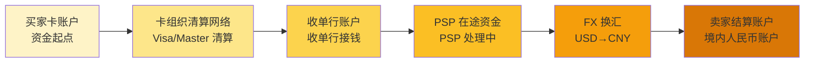
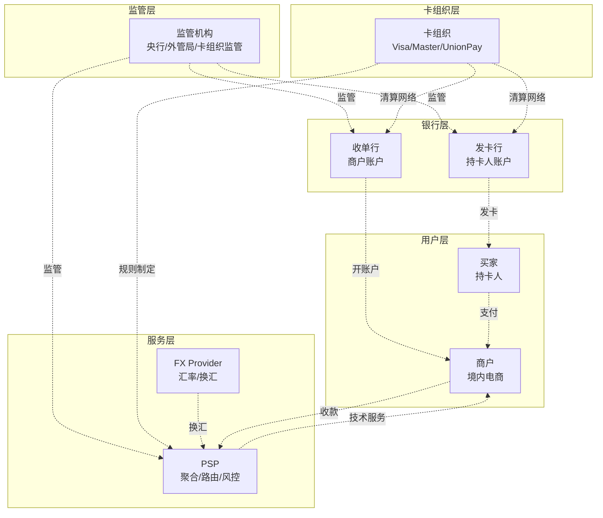
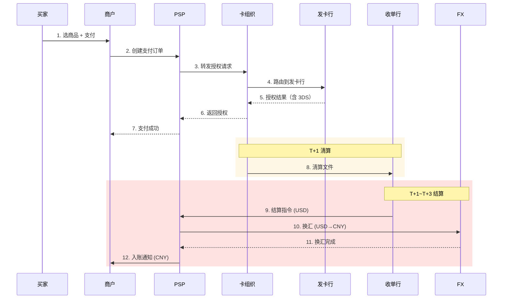

# 跨境参与方全景与利益博弈（侧重收单）

> **系列第 3 篇 · 深度**
> 上一篇 [2_清算 vs 结算与资金权属](./2_清算vs结算与资金权属-深度.md) 讲过清算 / 结算的法律时点。本篇把镜头拉远——讲清这笔跨境支付从买家卡里到卖家账户里，**钱经过谁的手、谁赚什么、谁担什么风险、他们之间怎么博弈**。

---

## 一句话定义

> **跨境支付收单链路上的 9 类参与方**——卡组织、发卡行、收单机构、收单行、支付服务商（PSP）、外汇提供商（FX Provider）、监管机构、商户、买家——各自赚不同的钱、担不同的风险、议价权完全不同。他们之间的利益博弈，决定了支付公司的策略空间。

---

## 业务背景与价值

### 为什么这件事值得花一篇讲清楚？

跨境支付的「跨境」两个字看起来是地理距离变长，落到参与方层面是 **9 个独立法人主体** 在抢同一笔钱的不同切块。每一类参与方都有自己的盈利模型和议价权，新手公司看不懂这个格局，就会：

- 用「技术决策」的方式做「业务战略决策」（什么时候直连 vs 间连）
- 低估某些参与方的议价权（被卡组织或 FX Provider 卡脖子）
- 高估自己能控制的范围（以为能跳过中间环节）
- 在监管边缘试探（不知道监管为什么这么规定）

**专家视角：** 跨境支付不是「一单赚 2% 手续费」那么简单。**手续费只是表象，真正的利润分配是 9 类参与方博弈的结果**。

### 过去 5 年的格局演变（跨周期视角）

| 时间段 | 格局特征 | 关键事件 |
|---|---|---|
| 2015-2018 | **PSP 崛起期** | Adyen、Stripe 全球扩张，连连、PingPong 在中国跨境收单崛起 |
| 2019-2021 | **本地支付挑战期** | 巴西 Pix（2020）、印度 UPI（2016 上线但 2019 后爆发）开始抢占新兴市场份额 |
| 2022-2024 | **合规收紧期** | 欧盟 Travel Rule 全面实施、中国跨境支付牌照监管细化、卡组织对高风险商户管控加强 |
| 2025-至今 | **实时跨境支付期** | SWIFT GPI、Visa B2B Connect、Mastercard Send 推动 T+0 跨境结算落地 |

**关键洞察：** 5 年前「接入卡组织 SDK 就完事」，现在「要看接入哪个本地支付、谁管合规、汇率怎么锁、备付金怎么存」。参与方越来越多，每个参与方的角色都在变。

### 监管意图：为什么监管要发跨境支付牌照？

很多新手以为「牌照」是合规成本。但监管的真实意图是：

1. **风险隔离**——防止支付公司挪用客户资金（备付金集中存管）
2. **反洗钱**——跨境资金是洗钱高发路径，牌照让监管有抓手
3. **数据出境管控**——跨境支付数据涉及国家金融安全
4. **外汇管控**——跨境支付涉及大量外汇申报，牌照是申报的承接点

**专家视角：** 牌照不是「准入门槛」，是「监管抓手」。理解了监管意图，就理解为什么「断直连」「备付金集中存管」「217 号文」等政策看似复杂，其实都是同一个目标的不同手段。

---

## 业务术语表

| 中文 | 英文 | 一句话解释 |
|---|---|---|
| 卡组织 | Card Network / Card Scheme | 制定支付规则 + 运营清算网络的组织（Visa / Mastercard / UnionPay / Amex / Discover） |
| 发卡行 | Issuing Bank | 给持卡人发信用卡的银行（赚持卡人年费 + 利息 + 持卡人分期手续费） |
| 收单机构 | Acquirer / Merchant Acquirer | 为商户提供支付受理服务的金融机构（赚收单服务费 + 部分 interchange） |
| 收单行 | Acquiring Bank | 实际为商户开立收款账户的银行（属于收单机构的一部分） |
| 支付服务商 | Payment Service Provider (PSP) | 提供聚合支付 / 技术服务的第三方（Adyen / Stripe / Windcave / 国内连连 PingPong 等） |
| 外汇提供商 | FX Provider | 提供汇率定价和换汇服务的机构（银行 / 专业 FX 公司） |
| 独立销售组织 | Independent Sales Organization (ISO) | 在美国市场为收单机构拓展商户的代理组织 |
| 支付牌照 | Payment License | 监管机构颁发的支付业务许可（国内人行 + 外管局，海外各央行） |
| 备付金 | Reserve / Customer Funds | 支付机构代客户持有的资金（监管要求集中存管） |
| 交换费 | Interchange Fee | 卡组织向收单方收取的清算费用（清分核心，占总费率大头） |
| 评估费 | Assessment Fee | 卡组织品牌使用费（按交易笔数固定） |
| 处理器费 | Processor Fee | PSP / 收单机构收取的处理服务费 |
| 标记化 | Tokenization | 卡组织推出的卡号替代技术（如 Visa Token Service），降低 PCI 合规成本 |
| 3DS | 3-D Secure | 卡组织风控验证协议（持卡人额外验证，转嫁拒付责任） |

---

## 业务形态与模式：9 类参与方全景

跨境支付收单链路上的 9 类参与方，按「资金流」的位置划分：

### ① 买家 / 持卡人（Cardholder）

**在哪：** 起点，资金来源
**赚什么：** 不赚钱（消费者）
**担什么：** 信用风险（用了信用卡就要还款）
**议价权：** **极弱**——只能选发卡行和卡组织
**业内认知：** 买家不会直接选 PSP，但会因为 PSP 风控策略（强制 3DS）而流失——业内头部公司宁可损失 1-2% 转化率，也不能让拒付率超过 1% 进卡组织名单

### ② 发卡行（Issuing Bank）

**在哪：** 资金起点，发卡给持卡人
**赚什么：** **年费 + 持卡人利息 + 分期手续费**——这部分利润**远比 interchange 高**
**担什么：** 信用风险（持卡人不还款）+ 拒付风险（争议时先垫付）
**议价权：** **强**——发卡行掌握持卡人入口，决定卡组织能给什么激励
**业内认知：** 业内默认：发卡行是整个支付生态**真正的金主**。卡组织 interchange 看似是「过路费」，实际是发卡行的「回扣」——发卡行靠 interchange 利润覆盖持卡人奖励的成本

### ③ 卡组织（Card Network / Visa / Mastercard）

**在哪：** 中枢，制定规则 + 运营清算网络
**赚什么：** **Assessment Fee**（按交易笔数）+ **部分 interchange 分成** + **品牌授权费**
**担什么：** 品牌信誉风险（一旦某商户欺诈，整个品牌受影响）
**议价权：** **极强**——规则制定者，interchange 定价权完全在卡组织
**业内认知：** 卡组织是「影子央行」——他定的规则就是行业标准，他的 interchange 就是行业基准利率。头部跨境支付公司对卡组织的真实依赖度，业内默认「远高于公司对外宣传」

### ④ 收单机构 / 收单行（Acquirer）

**在哪：** 资金接收端，给商户开立收款账户
**赚什么：** **interchange 差价 + 收单服务费 + 跨境结算费 + 罚款**（拒付 / 退单 / 清算争议）
**担什么：** **商户违约风险**（商户跑路 / 欺诈）+ **合规风险**（商户违规）
**议价权：** **中**——收单行依赖卡组织，但商户依赖收单行（双边关系）
**业内认知：** 收单行是「夹心层」——上面被卡组织收 interchange，下面被商户压价。所以收单行的核心能力是「风险定价」——能识别商户真实风险并定合适费率

### ⑤ 支付服务商 / PSP

**在哪：** 中介层，给商户提供 API / SDK / 风控 / 路由 / 对账
**赚什么：** **每笔交易的服务费**（通常 0.1%-0.3% 的 markup）+ **增值服务费**（VAT 退税 / 合规咨询）
**担什么：** **技术风险**（系统宕机）+ **合规连带责任**（商户违规 PSP 也要被罚）
**议价权：** **弱-中**——技术差异化空间有限，主要靠渠道 / 客户关系
**业内认知：** PSP 是「红海赛道」——技术门槛低，比拼的是商务关系。业内头部 PSP 的真实护城河不是技术，是**与头部商户的长期合同**和**与多家卡组织的议价能力**

### ⑥ 外汇提供商（FX Provider）

**在哪：** 跨境结算时点，提供汇率 + 换汇服务
**赚什么：** **汇率点差**（0.3%-0.8% 看币种和交易量）+ **换汇手续费**
**担什么：** **汇率波动风险**（汇率变动可能让 FX Provider 亏损）+ **流动性风险**
**议价权：** **强**——汇率定价权，外汇市场本身就是寡头格局
**业内认知：** 业内默认：**FX 点差是跨境支付公司真正的大头利润**。某头部公司公开披露：交易费收入约 30-40%，汇率收入约 40-50%，增值服务约 15-25%。汇率点差空间的 0.1% 优化，年化就是千万级利润

### ⑦ 监管机构（Regulator）

**在哪：** 规则制定 + 合规监督 + 牌照发放
**赚什么：** 不直接赚钱（政府机构）
**担什么：** **金融稳定**（系统性风险防控）+ **消费者保护**
**议价权：** **极强**——可以发牌照、吊销牌照、罚款、暂停业务
**业内认知：** 监管意图分三层：**金融稳定（系统风险）、消费者保护（拒付 / 欺诈）、国家利益（外汇 / 数据出境）**。理解这三层意图，才能理解为什么「断直连」「备付金集中存管」「217 号文」这些政策看似复杂，实则都是同一个目标的不同手段

### ⑧ 商户（Merchant）

**在哪：** 资金最终接收方
**赚什么：** **销售额 - 退款 - 支付成本**——支付成本是商户的销售费用
**担什么：** **拒付风险**（争议时可能被扣款）+ **合规风险**（违规可能被冻结资金）
**议价权：** **取决于规模**——头部商户（Amazon）议价权强，尾部商户议价权弱
**业内认知：** 商户议价权随规模指数级增长。**头部商户的真实费率远低于公开标准**——业内默认：月交易量超过千万美元的客户，PSP 给的费率可能比标准低 30-50%

### ⑨ 跨境支付公司（跨境收单机构，本系列读者群）

**在哪：** 综合 ④ ⑤ ⑥ 的角色（在中国跨境支付牌照下，可以一站做收单 + PSP + FX）
**赚什么：** 综合费率（interchange 差价 + 服务费 + FX 点差 + 增值服务）
**担什么：** **综合性风险**（技术 + 合规 + 商户违约 + 汇率 + 监管）
**议价权：** **取决于规模 + 牌照 + 合规能力**——头部公司议价权强，中尾段弱
**业内认知：** 中国跨境支付公司大多走「综合服务」模式（连连、PingPong、万里汇等），**单一费率谈判已经不是核心竞争点**——核心是「综合解决方案 + 合规能力 + 商户运营」

---

## 业务流程图：资金从买家卡到卖家账户的资金链路

下面这张图把 9 类参与方压缩到 6 个关键节点（监管机构 + 独立销售组织通常不直接出现在资金流），展示资金流的真实路径：

**关键时点：**
- T+0：买家支付 → 卡组织授权（实时）
- T+1：卡组织清算文件生成（清算日）
- T+1~T+3：收单行接钱 → PSP 处理
- T+3~T+7：FX 换汇 → 卖家人民币入账

**专家视角：** 资金流看起来线性，但每跳都是**独立法人主体 + 独立账户 + 独立监管口径**。任何一跳出问题都可能卡住整个链路——业内默认的对账 SOP 必须支持「单点失败不影响其他节点」的降级。

---

## 系统架构：9 类参与方的层级关系

**关键洞察：** 监管层在最顶端（不参与资金流，但制定规则）。卡组织层是中枢。银行层是资金出入口。服务层（PSP + FX）是技术 + 汇率服务。用户层是终端。

---

## 服务模型：一笔跨境支付的典型交互时序

---

## 核心功能用例

### 用例 1：标准跨境电商收款（最常见）

**场景：** 美国买家用 Visa 卡在 SHEIN 买 $50 商品，SHEIN 收到 ¥360 人民币
**9 类参与方全部上场：**
- 买家：扣 $50
- 发卡行：赚利息 + 年费 + 分期手续费（interchange 看似大头，实际利润大头在这里）
- 卡组织：赚 assessment + interchange 分成
- 收单行：赚 interchange 差价 + 服务费
- PSP（连连/PingPong）：赚 0.1%-0.3% 服务费
- FX Provider：赚汇率点差（约 0.3-0.5%）
- 商户（SHEIN）：收到 ¥360
- 监管机构：监督全链路合规

**典型费率拆分：** interchange ~1.5% + assessment 0.14% + PSP 0.2% + FX 0.4% ≈ 总成本 2.24%——这个数字是 SHEIN 实际承担的支付成本

### 用例 2：拒付（跨公司博弈激烈场景）

**场景：** 英国买家声称未收到商品，发起拒付
**9 类参与方的博弈：**
- 买家：向发卡行发起争议
- 发卡行：先垫付（争议期间），向卡组织提交争议
- 卡组织：通知收单行
- 收单行：通知 PSP
- PSP：通知商户
- 商户：提交证据（物流签收单 / 沟通记录）
- 仲裁：卡组织根据证据判商家赢 / 输
- 输家承担成本 + 罚款

**业内认知：** 拒付处理的真实成本不是退款金额本身，是**对卡组织风险评级的影响**。拒付率（chargeback ratio）超过阈值的商户会被卡组织列入监控名单，最坏情况是被强制接入风险监控项目（Visa VAMP / Mastercard ABC），导致所有商户类别被额外监控，成本翻倍

### 用例 3：多币种结算（FX Provider 介入）

**场景：** 欧洲买家用欧元支付，境内卖家要人民币
**FX Provider 的真实价值：**
- 提供欧元 → 人民币的实时汇率
- 提供「汇率锁定」服务（让商户锁定汇率，避免汇率波动）
- 提供「结算时点调整」（让商户选择哪个时点结算）

**业内认知：** FX Provider 不是单纯的「换汇服务」——业内头部 FX Provider 会提供**汇率预警 + 自动调拨 + 多账户管理**等综合服务。中小跨境支付公司往往把 FX 业务外包给银行 / 专业 FX 公司，而头部公司会自营 FX 团队（因为利润空间大）

---

## 业务打法与策略：不同公司怎么选参与方组合

### 头部公司（年 GMV > 100 亿美元）

**典型打法：**
- **直连卡组织**（interchange 最低，自己扛合规）
- **自营 FX 团队**（汇率点差全留）
- **自建风控**（拒付率 < 0.5%，远低于行业平均）
- **多牌照布局**（覆盖多个国家，合规灵活）

**业内认知：** 头部公司的真实护城河是**合规能力**（能搞定多个国家的牌照 + 持续合规）+ **商户运营**（头部商户的长期合同）+ **综合解决方案**（不只是收单，还提供 VAT / 退税 / 物流等增值服务）

### 中型公司（年 GMV 1-100 亿美元）

**典型打法：**
- **间连为主 + 核心通道直连**（核心通道直连降本，长尾通道间连省合规）
- **FX 业务部分外包**（部分自营 + 部分外包给银行）
- **风控外包为主**（拒付率控制在 0.8-1.5%）
- **重点攻 1-2 个区域市场**（比如专注东南亚或专注拉美）

**业内认知：** 中型公司的核心挑战是「合规成本摊薄」——多个区域的合规成本不能像头部公司那样分摊到大量交易上。所以中型公司往往**专注细分市场**（比如只做东南亚电商），避免全面铺开

### 小公司 / 新进入者（年 GMV < 1 亿美元）

**典型打法：**
- **100% 间连 PSP**（合规成本最低）
- **FX 完全外包**（自营不划算）
- **风控靠 PSP 提供的模板**（拒付率往往 > 1.5%，接近卡组织警戒线）
- **聚焦单一卡种 + 单一国家**（最小可行产品）

**业内认知：** 小公司的真实风险是「合规成本 vs 交易额比例过高」——很多小公司 80% 成本是合规，20% 才是技术。这导致小公司很难盈利，必须快速做大或退出

---

## Trade-off 分析

### 决策 1：直连 vs 间连 vs 聚合

| 选项 | 优势 | 代价 | 适合谁 |
|---|---|---|---|
| **直连卡组织** | interchange 最优（节省 0.3%-0.8%） | 合规自己扛、对接周期 6-12 月、技术投入大 | 年 GMV > 100 亿的头部公司 |
| **间连 PSP** | 上线快、合规外包、灵活 | 费率溢价 0.3%-0.8% | 年 GMV 1-100 亿的中型公司 |
| **聚合通道** | 成功率最优、汇率最优 | 系统复杂、对账难度翻倍 | 任何规模都可，但需技术能力 |

**专家视角：** 这不是技术决策，是**业务战略决策**。直连意味着你要自己养合规团队 + 自己处理拒付 + 自己扛汇率风险。规模不到 100 亿 GMV 时，直连的合规成本可能吃掉费率节省的全部利润

### 决策 2：自营 FX vs 银行锁汇

| 选项 | 优势 | 代价 | 适合谁 |
|---|---|---|---|
| **自营 FX 团队** | 利润全留、汇率灵活 | 流动性风险、合规风险、专业人才稀缺 | 年 FX 量 > 50 亿美元的头部公司 |
| **银行锁汇** | 合规边界清晰、无汇率风险 | 0.1%-0.3% 锁汇成本 | 中型公司 |
| **FX 聚合报价** | 汇率最优、灵活 | 系统复杂、对账难度 | 任何规模，看技术能力 |

**专家视角：** 自营 FX 业务的真实门槛不是技术，是**流动性**。没有 50 亿美元 + 的换汇量，自营 FX 团队养不起（流动性差导致点差过大）。自营 FX 的 0.1% 点差优化，听起来不多，年化可能就是千万级利润——但前提是规模

### 决策 3：单币种 vs 多币种结算

| 选项 | 优势 | 代价 | 适合谁 |
|---|---|---|---|
| **单币种结算**（商户只收人民币） | 简单、合规清晰 | 商户承担所有汇率风险 | 中小商户 |
| **多币种结算**（商户可选币种） | 商户体验好、汇率风险共担 | 系统复杂、合规要求高 | 头部商户 / 跨境平台 |

**专家视角：** 多币种结算的真实成本不是技术，是**合规**——每多一个结算币种，监管要求就会显著增加（外汇申报、数据出境等）。多币种是头部公司才能玩的，中型公司应该谨慎

---

## 行业洞察 / 业内认知

### 不成文标准：参与方议价权的真实分布

业内默认的议价权排序（从强到弱）：

1. **监管机构**（极强）——牌照、罚款、暂停业务
2. **卡组织**（强）——规则制定、interchange 定价
3. **发卡行**（强）——持卡人入口、interchange 主要受益方
4. **FX Provider**（强）——汇率定价权
5. **收单行**（中）——双边依赖，但有商户违约风险
6. **头部商户**（中-强）——交易量大议价权强
7. **PSP**（弱-中）——技术差异化有限，主要靠商务
8. **中小商户**（弱）——只能接受标准费率
9. **买家**（极弱）——只能选发卡行

**专家视角：** 跨境支付公司（PSP / 收单机构）的议价权**取决于规模和牌照**——头部公司议价权强（可以跟卡组织谈费率），中小公司议价权弱（只能接受标准）。这意味着头部公司的真实利润空间是中小公司的 5-10 倍，不是 2-3 倍

### 真实事故：监管收紧引发的行业洗牌

公开报道：2023 年某头部跨境支付公司因合规问题被监管约谈 + 暂停新增商户 3 个月，导致市场份额被竞争对手抢占 15%-20%。

业内流传的处理方式：
- 头部公司后来强制合规校验流必须比资金流**至少早一个时点**完成
- 把合规嵌入支付流程的每一个环节，而不是事后补查
- 多国牌照布局（避免单一国家监管风险）

**业内认知：** 合规不是成本，是**护城河**。某头部公司公开披露：合规投入占运营成本 25%+，但合规带来的「监管信任溢价」让其在头部商户议价时多赚 1-2 个费率点。年化收益远高于合规成本

### 从业者挑战：直连 vs 间连的战略选择

跨境支付公司常见的产品决策：直连卡组织（费率最优、合规风险自己扛）vs 间连 PSP（灵活、费率溢价）vs 聚合通道（成功率高、系统复杂）。

业内通用做法：**早期 100% 间连**（省合规成本、快速上线）→ **中等规模部分直连**（核心通道直连、长尾通道间连）→ **头部规模全直连**（100 亿+ GMV 才有 ROI）。

**专家视角：** 直连 vs 间连的真实决策点是**合规成本摊薄**——只有当交易量大到能摊薄合规成本时，直连才划算。**5 年后回头看**：很多中型公司在交易量没到 100 亿时就强行直连，结果合规成本吃掉全部费率节省，最终被市场淘汰

---

## 业务前景与趋势

### 未来 3-5 年的 4 个结构性变化

**1. 本地支付崛起**
巴西 Pix、印度 UPI、东南亚本地钱包正在新兴市场抢占信用卡份额。业内普遍认为本地支付渠道在新兴市场跨境支付里的占比将持续提升。**对参与方格局的启示：** PSP 必须支持本地支付通道，不能只押信用卡；收单行需要重新设计本地清算流程

**2. 实时跨境支付（Real-Time Cross-Border Payments）**
SWIFT GPI、Visa B2B Connect、Mastercard Send、万事达 B2B 等正在推动 T+0 跨境结算落地。**对参与方格局的启示：** 「T+0 实时结算」将成标配，现在的 T+3 结算会被淘汰。FX Provider 的角色会从「结算时点汇率」转向「实时汇率」

**3. 合规边界持续收紧**
欧盟 Travel Rule 全面实施（资金转移规则）、各国数据本地化、反洗钱第六版指令。**对参与方格局的启示：** 合规成本年增 20%+。中小支付公司面临「合规成本摊薄 vs 交易额比例」恶化，可能加速行业洗牌

**4. CBDC 跨境互联**
中国数字人民币（e-CNY）、美国 FedNow、各国 CBDC 的跨境互联项目（如 mBridge）正在重新定义「结算」的含义。**对参与方格局的启示：** CBDC 可能让卡组织清算网络被部分替代，但 3-5 年内仍以传统清算为主

---

## 一句话总结

> **跨境支付不是「一单赚 2% 手续费」那么简单——是 9 类参与方博弈的结果。** 卡组织、发卡行、收单行、PSP、FX Provider、监管机构、商户、买家各自赚不同的钱、担不同的风险、议价权完全不同。理解这个格局，是看懂跨境支付公司一切策略（直连 vs 间连、自营 FX vs 外包、单一市场 vs 多市场）的前提。

---

## 📌 数据与事实声明

本文涉及的参与方分类、议价权排序、典型费率、行业格局演变等内容是跨境支付行业的通用认知，但具体到：

- 各参与方的实际费率（interchange / assessment / PSP 服务费 / FX 点差）因卡种/国家/商户类型差异较大
- 头部公司公开披露的收入结构（交易费 / 汇率 / 增值服务比例）是公开信息
- 监管政策（断直连 / 217 号文 / 备付金集中存管 / 欧盟 Travel Rule 等）是真实存在的法规
- 卡组织产品（Visa B2B Connect / Mastercard Send / SWIFT GPI / FedNow 等）是真实存在的产品

但具体数字、监管细节、费率阈值以官方最新公告和卡组织最新规则为准，不要直接引用本文数值作为决策依据。

---

## 下一篇预告

下一篇 [4_一笔跨境支付的 13 个时点](./4_一笔跨境支付的13个时点-深度.md) 将深入「钱从买家卡里到卖家账户里，到底经历了多少个关键时点」——这是把参与方全景落到具体流程的关键一步。每个时点都可能出问题，每个时点都有合规 / 技术 / 业务的三层含义。