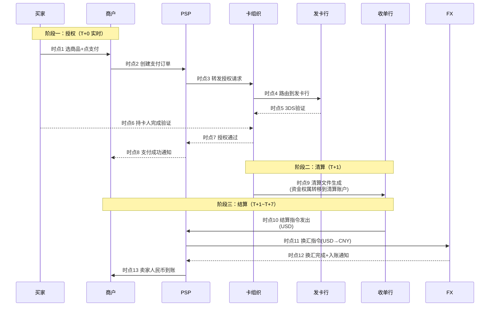
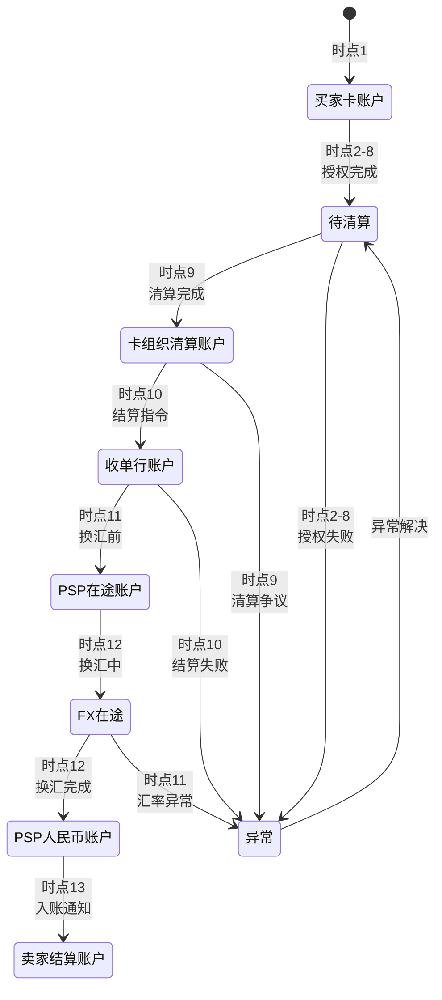

# 一笔跨境支付的 13 个时点（侧重收单）

> **系列第 4 篇 · 深度**
> 上一篇 [3_跨境参与方全景与利益博弈](./3_跨境参与方全景与利益博弈-深度.md) 讲了 9 类参与方怎么博弈。本篇把它落到具体时序——讲清一笔跨境支付从买家点击支付到卖家收到人民币，到底经历**多少个关键时点**，每个时点对应**什么法律 / 技术 / 业务含义**。

---

## 一句话定义

> **一笔跨境支付从买家点击「支付」到卖家收到人民币，经历 13 个关键时点**——分为授权阶段（T+0 时点 1-8）、清算阶段（T+1 时点 9）、结算阶段（T+1~T+7 时点 10-13）。每个时点跨越 9 类参与方中的某几个，每个时点都有独特的法律 / 技术 / 业务含义，**任何一个时点出问题都会导致整个链路失败**。

---

## 业务背景与价值

### 为什么「13 个时点」这个数字重要？

很多入门读者以为跨境支付就是「买家付款、卖家收款」两件事。但**真实链路里至少有 13 个关键时点**，每个时点：

- **跨越一个或多个参与方**——单一参与方不会做完所有事
- **产生新的法律事实**——资金权属变更 / 债权债务确认 / 数据记录
- **可能产生新的风险**——拒付 / 汇率波动 / 合规问题
- **需要被记录 / 对账 / 监控**——任何时点漏记录都会导致后续事故

**专家视角：** 13 个时点不是「跨境支付的特性」，是**所有清算型支付系统的特性**。国内支付宝支付也有类似时点，只是时延短（秒级），所以感受不到。跨境支付的时延 T+1~T+7 让时点错位被放大，事故风险也成倍放大。

### 过去 5 年的时点压缩趋势（跨周期视角）

| 时间段 | 平均到账时延 | 关键事件 |
|---|---|---|
| 2015-2018 | T+5 ~ T+7 | Visa/Master 传统清算周期 |
| 2019-2021 | T+3 ~ T+5 | SWIFT GPI 提速、本地支付崛起 |
| 2022-2024 | T+1 ~ T+3 | Visa Direct、万事达 Send 实时跨境结算 |
| 2025-至今 | T+0 ~ T+1 | SWIFT GPI 全面实时化、CBDC 跨境互联试点 |

**关键洞察：** 5 年前跨境支付平均要等 5-7 天，现在头部通道可以做到 T+0。**时点被压缩**意味着：
- 资金风险窗口缩短（在途资金规模减小）
- 汇率风险窗口缩短（汇率波动影响减小）
- 但**合规校验时点不能压缩**——监管要求反洗钱筛查必须在资金流动前完成

### 监管意图：为什么时点设计不能无限压缩？

监管对时点设计有「底线要求」：

1. **反洗钱筛查必须在资金划付前**——所以 KYC/AML 不能压缩到「实时瞬间完成」，必须有时点预留
2. **外汇申报必须在换汇前**——所以换汇时点要预留外汇申报的时间
3. **资金权属变更必须可追溯**——所以每个时点必须有独立记录，不能跳过

**专家视角：** 跨境支付的时点不是「技术性能问题」，是**法律 / 合规 / 商业规则的物理体现**。技术上完全可以做到 T+0 实时跨境结算，但监管要求决定了**最少需要保留哪些时点**作为合规边界

---

## 业务术语表

| 中文 | 英文 | 一句话解释 |
|---|---|---|
| 授权 | Authorization | 发卡行批准这笔交易（实时） |
| 清算 | Clearing | 算出谁欠谁多少钱（T+1） |
| 结算 | Settlement | 实际划付款项（T+1 ~ T+7） |
| 拒付 | Chargeback | 持卡人发起争议，资金反向流回 |
| 退款 | Refund | 商户主动退回资金 |
| 预授权 | Pre-authorization | 冻结资金但不实际扣款 |
| 终态授权 | Capture | 预授权后实际扣款 |
| 清算文件 | Clearing File | 卡组织生成的清算批次文件 |
| 结算指令 | Settlement Instruction | 收单行向 PSP 发出的划付指令 |
| 在途资金 | In-transit Funds | 清算完成但结算未完成的资金 |
| 资金权属 | Beneficial Ownership | 资金在法律上「归谁所有」 |
| 拒付窗口 | Chargeback Window | 持卡人可以发起争议的时间范围 |

---

## 业务形态与模式：13 个时点的分类

13 个时点按业务阶段分为三大类：

### 阶段一：授权阶段（T+0 实时，时点 1-8）

**核心动作：** 买家发起支付、卡组织授权、发卡行批准、PSP 处理、风控拦截

**关键参与方：** 买家、卡组织、发卡行、PSP、商户

**时延：** **秒级**——必须实时，否则用户体验差

**失败模式：** 风控拦截、3DS 验证失败、卡片余额不足、欺诈拒绝

### 阶段二：清算阶段（T+1，时点 9）

**核心动作：** 卡组织生成清算文件、算出谁欠谁多少

**关键参与方：** 卡组织、发卡行、收单行

**时延：** **T+1 凌晨到早上**——卡组织批量处理

**失败模式：** 清算文件生成失败、清算争议（金额不一致）

### 阶段三：结算阶段（T+1 ~ T+7，时点 10-13）

**核心动作：** 收单行向 PSP 划付、PSP 换汇、入账通知、商户收款

**关键参与方：** 收单行、PSP、FX Provider、商户

**时延：** **T+1 ~ T+7**——跨币种、跨银行体系

**失败模式：** 备付金不足、汇率波动、FX 流动性问题、银行系统故障

**专家视角：** 三个阶段的时延差异巨大——授权阶段秒级、清算阶段小时级、结算阶段天级。**每个阶段的事故成本完全不同**——授权阶段失败只影响单笔交易，结算阶段失败可能影响整个批次的资金

---

## 业务流程图：13 个时点的完整时序

下面这张图把 13 个时点画到完整时序里，看清资金 / 信息 / 合规三条流在每个时点的对齐情况：

**关键观察：**
- 时点 1-8：买家 → 商户 → PSP → 卡组织 → 发卡行 → 卡组织 → PSP → 商户，**8 个时点全部在秒级完成**
- 时点 9：**资金权属变更**（清算完成 → 资金在卡组织清算账户）
- 时点 10-13：**实际资金划付**（USD → 换汇 → CNY → 商户账户），**跨越 1-7 天**

---

## 资金在 13 个时点的状态流转

13 个时点不仅是「时间顺序」，更是**资金状态的物理变化**：

**关键洞察：** 资金状态在 13 个时点里有 **6 次权属变化**，不是「一次支付一次权属变更」那么简单。每次权属变化都是法律意义上的变更，对应不同的合规要求和会计处理

---

## 系统架构：13 时点 × 3 流对齐矩阵

每个时点都涉及「资金流 / 信息流 / 合规流」三条流的同步。任何一个时点三流错位都是事故风险：

| 时点 | 资金流 | 信息流 | 合规流 | 错位风险 |
|---|---|---|---|---|
| 1 买家点支付 | 资金冻结在卡账户 | 订单创建 | — | 极低 |
| 2 商户创建订单 | — | 订单信息 | KYC/KYB 校验 | 中（KYB 失败导致订单作废） |
| 3 PSP 转发授权 | — | 授权请求 | — | 低 |
| 4 卡组织路由 | — | 路由信息 | — | 低 |
| 5-7 发卡行授权 | — | 授权结果 | 3DS 验证 | 中（3DS 失败导致拒付风险） |
| 8 PSP 通知商户 | — | 支付成功通知 | 风控结果 | 中（通知延迟导致商户重复发货） |
| 9 清算文件生成 | **资金权属变更** | 清算文件 | 反洗钱筛查 | **高**（清算完成但 AML 未跑会被监管冻结） |
| 10 结算指令发出 | 资金权属声明转移 | 结算指令 | — | 中（结算失败导致资金挂账） |
| 11-12 换汇 | 资金币种转换 | 换汇记录 | 外汇申报 | 高（汇率异常导致汇兑损益） |
| 13 卖家入账 | 资金实际到账 | 入账通知 | — | 低 |

**专家视角：** 时点 9 是**整个链路最大的合规风险点**——清算完成意味着资金权属已转移，但反洗钱筛查如果还没跑完，资金实际是在「合规真空」状态。业内头部公司的做法是：**反洗钱筛查必须在清算前完成（预校验 + 后校验双轨）**，不能依赖清算后再补查

---

## 服务模型：每个时点的接口与失败模式

| 时点 | 关键接口 | 失败模式 | 监控重点 |
|---|---|---|---|
| 1-2 | 商户 API / PSP SDK | 接口超时 | 接口成功率 < 99.9% |
| 3-4 | PSP → 卡组织 API | 网络抖动 | 重试次数 |
| 5-7 | 卡组织 → 发卡行 API | 3DS 失败、余额不足 | 授权成功率 |
| 8 | PSP 通知商户 | Webhook 失败 | Webhook 重试 |
| 9 | 卡组织清算文件下载 | 文件生成延迟 | 清算文件到达时间 |
| 10 | 收单行 → PSP 结算 API | 备付金不足 | 结算成功率 |
| 11-12 | FX Provider API | 汇率异常 | 汇率偏离阈值 |
| 13 | PSP → 商户入账通知 | 银行系统故障 | 入账通知到达时间 |

**专家视角：** 13 个时点的监控重点**不是均匀分布**——时点 9（清算）和时点 10-12（结算）的事故成本最高，应该用最严格的监控和告警。业内默认：**清算 + 结算时点的事故成本是授权时点的 100 倍**

---

## 核心功能用例

### 用例 1：标准流程（最常见，13 个时点全部走完）

**场景：** 美国买家用 Visa 卡买 $50 商品

**13 个时点细节：**
- 时点 1-2（T+0 秒级）：买家点支付 → 商户创建订单 → PSP 接收订单
- 时点 3-4（T+0 秒级）：PSP 转发到 Visa → Visa 路由到 Chase 发卡行
- 时点 5-7（T+0 1-3 秒）：Chase 触发 3DS → 买家输入验证码 → Chase 批准
- 时点 8（T+0 秒级）：Visa 返回授权成功 → PSP 通知商户
- 时点 9（T+1 早上）：Visa 生成清算文件 → 资金权属转移到清算账户
- 时点 10（T+1 下午）：收单行向 PSP 发出 USD 结算指令
- 时点 11-12（T+1 ~ T+3）：PSP 通过 FX Provider 换汇 USD→CNY
- 时点 13（T+3）：商户收到 ¥360 人民币

### 用例 2：异常路径——清算完成但 AML 筛查失败

**场景：** T+1 清算文件生成后，反洗钱系统发现该交易涉及高风险商户

**处理：**
- 时点 9 完成后才发现风险——此时资金权属已转移到清算账户
- 资金被冻结在清算账户，等待人工审查
- **风险：** 商户资金被冻结、可能引发商户投诉 + 监管问询
- **业内默认做法：** 反洗钱筛查必须**预校验**（授权前）+ **后校验**（授权后），不能依赖清算后再查

### 用例 3：降级方案——T+0 实时跨境结算

**场景：** 头部商户用 Visa Direct / 万事达 Send，要求实时到账

**流程：**
- 时点 1-8：正常授权（秒级）
- **跳过时点 9 清算文件**——直接进入时点 10 结算指令
- 时点 10-13：**压缩到秒级**——授权完成的同时，资金实时到账

**Trade-off：** 实时跨境结算的代价是：
- FX 汇率**不能锁定**——实时汇率波动大，商户承担汇率风险
- 合规检查**必须在毫秒级完成**——AML 失败就没法撤销
- 系统成本高——需要卡组织 + 收单行 + PSP 全链路实时对接

---

## 业务打法与策略：5 分钟定位 SOP

**业内默认的 5 分钟定位 SOP——出问题先看哪个时点：**

### 第 1 分钟：判断故障范围
- 单笔交易失败 → 时点 1-8 授权阶段
- 批次清算异常 → 时点 9 清算阶段
- 资金没到账 → 时点 10-13 结算阶段

### 第 2 分钟：检查时点 9 清算文件
- **清算文件到达时间**是否在 6 点前？不在就是卡组织侧问题
- 清算文件**内容是否完整**？缺数据就是 PSP 同步问题
- 清算文件**金额是否一致**？不一致就是上游商户 / PSP 数据问题

### 第 3 分钟：检查时点 10-12 结算链路
- 备付金余额是否充足？
- FX 汇率是否在阈值内？
- 银行系统是否有告警？

### 第 4 分钟：检查时点 13 入账通知
- Webhook 是否发送成功？
- 商户系统是否接收？
- 银行入账是否成功？

### 第 5 分钟：判断事故级别 + 上报
- 单笔失败：P3 - 业务运营处理
- 批次失败：P2 - 风控 + 财务 + 技术联合处理
- 资金安全风险：P1 - 立即上报 + 启动应急响应

**专家视角：** 业内默认：13 个时点任何一个出问题，**前 5 分钟的定位速度决定了事故成本**。5 分钟内定位 + 1 小时内处理完，P3 事故；超过 30 分钟才定位，P2 事故；超过 2 小时，P1 事故（可能触发监管问询）

---

## Trade-off 分析

### 决策 1：实时跨境结算 vs T+1 跨境结算

| 选项 | 优势 | 代价 | 适合谁 |
|---|---|---|---|
| **实时结算（T+0）** | 商户体验最好、汇率风险小 | FX 不能锁、合规压力、系统成本高 | 头部商户 / 高频小额 |
| **T+1 结算** | 汇率可锁、合规充分、对账稳定 | 商户等 1 天、汇率风险中等 | 大部分商户 |
| **T+3~T+7 结算** | 系统最简单、成本最低 | 商户等很久、汇率风险大 | 尾部商户 |

**专家视角：** 实时结算的真实门槛不是技术（技术上完全可以），是**合规和汇率**。实时结算意味着反洗钱筛查必须在毫秒级完成、汇率波动全由商户承担。**5 年后回头看**：大部分支付公司会提供「T+0 实时 + 汇率锁定 + 合规充分」的组合服务，但成本会比 T+1 高 0.2%-0.5%

### 决策 2：清算文件自处理 vs 委托第三方

| 选项 | 优势 | 代价 | 适合谁 |
|---|---|---|---|
| **自处理清算文件** | 灵活、对账快 | 开发成本 3-6 月、运维复杂 | 头部公司 |
| **委托第三方对账 SaaS** | 上线快、维护简单 | 月费 + 数据在第三方 | 中型公司 |
| **PSP 提供清算服务** | 一站式、对账自动化 | 锁定单一 PSP | 小公司 |

**专家视角：** 自处理清算文件的真实门槛是**卡组织规则理解 + 数据清洗能力**。清算文件格式各异（Visa / Mastercard / UnionPay 不同），清洗规则每月可能变，业内默认**每年需要 1-2 个全职工程师维护清算文件处理系统**

---

## 行业洞察 / 业内认知

### 不成文标准：对账的「默契」时间窗口

公开规则：卡组织清算文件 T+1 生成，对账系统 T+1 处理。

**业内实际做法（业内默认时间窗口）：**

| 时间 | 对账状态 | 业内操作 |
|---|---|---|
| **T+1 00:00 ~ 06:00** | 清算文件生成中，**不要查对账** | 系统维护、文件下载等待 |
| **T+1 06:00 ~ 12:00** | 清算文件陆续到达，**开始跑批但不全** | 跑批 + 异常监控 |
| **T+1 12:00 ~ 18:00** | 跑批基本完成，**开始查但有在途** | 查通道对账结果 |
| **T+1 18:00 ~ T+2 06:00** | 跑批完成，**真正稳的对账** | 全量对账查询、差错处理 |
| **T+2 06:00 之后** | T+1 对账关闭 | 切换到 T+2 跑批流程 |

**专家视角：** 对账系统必须支持「分时段跑批」+「差错分状态」（在途差错 / 真差错），不能简单地「T+0 跑完就对」。**业内默认：T+1 早上 6 点后查，T+2 上午稳态查**——T+0 查只会看到假差错

### 真实事故：对账延迟引发监管问询

公开报道：2024 年某头部跨境支付公司因对账系统延迟 T+2（实际 T+3 才完成），导致部分商户资金 T+5 才到账，部分商户资金悬空被监管约谈，最终被罚款 + 暂停新增商户 3 个月。

**业内流传的处理方式：** 头部公司后来强制对账系统必须 T+1 早上 6 点前完成，且必须有降级方案（实时对账失败也要 T+1 早上 6 点前跑批）。

**教训：** 对账延迟的「真实成本」不是商户投诉，是**监管风险**。对账系统必须按 T+1 早上 6 点后查、T+2 上午稳态查，错过这个窗口 = 监管事故

### 从业者挑战：在途资金的合规边界

跨境支付公司财务部门最常遇到的两难：在途资金（T+1 清算完成、T+3 结算未完成）该怎么记账？

- **会计准则：** 在途资金应作为「应收款项」挂账，不能确认为收入
- **业务部门诉求：** 清算完成就该算「我的钱」，否则 KPI 不好看
- **风控部门诉求：** 在途资金可能因拒付 / 合规问题被撤销，必须保留风险准备金

**业内通用做法：** 「**双记账 + 准备金**」——在途资金按原币 + 本位币双记账，同时按历史拒付率计提风险准备金（比如清算金额 × 1.5%）。

**专家视角：** 在途资金挂账不是「会计技术」，是**合规要求**——一旦被监管认定「在途资金被挪用」（即使只是会计处理上），都是严重的合规事件。所以**业内默认**：13 个时点里的「在途资金」必须独立监控、独立记账、独立计提准备金

---

## 业务前景与趋势

### 实时跨境支付如何压缩 13 个时点

未来 3-5 年的关键变化：

**1. 实时清算（Visa Direct / Mastercard Send）**
传统 T+1 清算文件被实时清算替代，时点 9 的「批量清算」变成「逐笔清算」。**代价：** 卡组织系统压力大、合规检查窗口压缩

**2. 实时结算（CBDC 跨境互联）**
传统 T+1~T+7 结算被实时结算替代，时点 10-13 压缩到秒级。**代价：** FX 汇率实时波动、商户承担汇率风险

**3. 嵌入式合规（监管科技）**
传统「预校验 + 后校验」双轨制被「嵌入式合规」替代——合规检查嵌入每个时点的处理过程，不是独立环节。**代价：** 监管科技投入大、合规人才稀缺

**4. 时点消失 vs 时点合并**
未来 3-5 年，时点不会消失，但**会合并**——13 个时点可能压缩到 5-6 个核心时点。**代价：** 监管要求决定了最少时点数（合规边界不可压缩）

---

## 一句话总结

> **一笔跨境支付不是「一次付款一次收款」——是 13 个时点的复杂博弈，每个时点都有独特的法律 / 技术 / 业务含义。** 时点 9（清算文件生成）是最大的合规风险点，时点 10-13（结算链路）是最大的资金安全风险点。理解这 13 个时点，是看懂跨境支付系统一切设计（清算文件处理 / 对账 SOP / 在途资金记账 / 5 分钟定位）的底层框架。

---

## 📌 数据与事实声明

本文涉及的 13 个时点划分、对账默契时间窗口、清算与结算时点差异等内容是跨境支付行业的通用认知，但具体到：

- 各卡组织的清算文件格式（Visa BASE II / Mastercard IPM / UnionPay 等）每年可能更新
- 卡组织对授权、清算、结算的具体规则版本以官方最新规则为准
- 监管政策（断直连 / 217 号文 / 备付金集中存管 / 反洗钱第六版指令）以最新监管文件为准
- 实时跨境支付产品（Visa Direct / Mastercard Send / SWIFT GPI / CBDC 互联）以各产品官方文档为准

不要直接引用本文时点作为合规依据或具体系统设计依据。

---

## 下一篇预告

下一篇 [5_多币种与汇率定价权](./5_多币种与汇率定价权-深度.md) 将深入「标价币种 / 支付币种 / 清算币种 / 结算币种 / 入账币种」五币种差异，以及汇率点差（DCC vs MCP vs 商户自定价）三种策略的合规边界和业务影响。