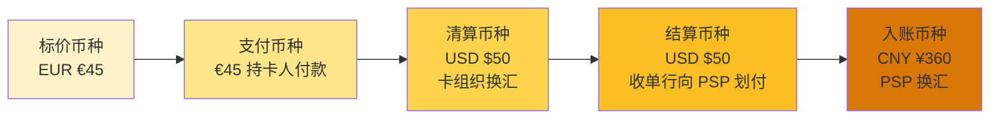
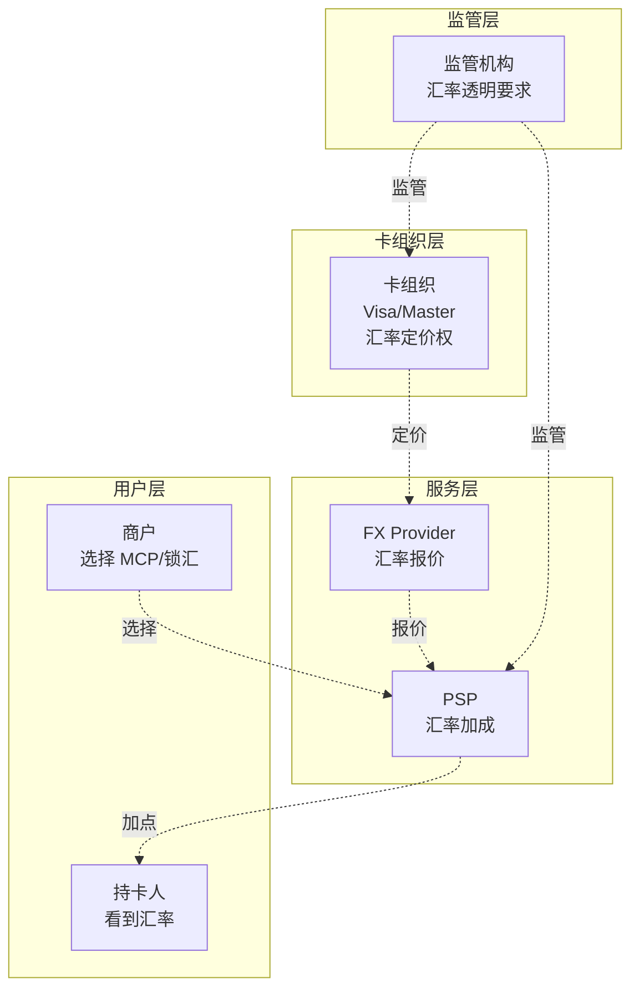

# 多币种与汇率定价权（侧重收单）

> **系列第 5 篇 · 深度**
> 上一篇 [4_一笔跨境支付的 13 个时点](./4_一笔跨境支付的13个时点-深度.md) 讲过从授权到入账的 13 个时点。本篇聚焦其中最容易被忽略的一环——**币种和汇率**。一笔跨境支付可能要经历**标价币种 → 支付币种 → 清算币种 → 结算币种 → 入账币种** 5 次转换，每次转换都涉及汇率和汇损。

---

## 一句话定义

> **跨境支付的多币种问题，核心是「五个币种 + 三种汇率策略 + 一个汇损归属」**。标价币种 / 支付币种 / 清算币种 / 结算币种 / 入账币种五者关系错综复杂，DCC（动态货币转换）/ MCP（商户定价）/ 商户自定价 三种策略各有合规边界，汇损由谁承担决定了产品体验和公司利润。

---

## 业务背景与价值

### 为什么「多币种」比看起来复杂得多？

入门读者以为跨境支付就是「美元换人民币」。但真实链路里至少有 5 个币种，每个币种的角色和转换规则都不同：

- **标价币种**：商品页面显示的价格（USD？EUR？CNY？）
- **支付币种**：买家实际付款的币种（信用卡账单币种）
- **清算币种**：卡组织清算时的币种（USD）
- **结算币种**：收单行向 PSP 划付的币种（USD 或本地币）
- **入账币种**：商户最终收到的币种（CNY）

**专家视角：** 5 个币种的关系不是「一对一转换」，是**有向图**——任何两个币种之间都可能换汇，每次换汇都产生点差和汇损。这就是为什么跨境支付的「汇率点差收入」是公司利润的大头（业内头部公司汇率收入占总收入 40%-50%）。

### 过去 5 年的多币种趋势（跨周期视角）

| 时间段 | 趋势 | 关键事件 |
|---|---|---|
| 2015-2018 | **DCC 兴起期** | Visa / Mastercard 推广 DCC，让持卡人在 POS 终端选择本地币或支付币 |
| 2019-2021 | **MCP 普及期** | 商户定价（MCP）成为头部跨境电商默认选择，DCC 被欧盟监管限制 |
| 2022-2024 | **实时汇率 + 锁汇服务期** | PSP 提供实时汇率 API + 锁汇服务，头部商户开始定制汇率策略 |
| 2025-至今 | **多币种钱包 + CBDC 期** | 数字人民币（e-CNY）跨境试点、多币种钱包成为标配 |

**关键洞察：** 5 年前商户几乎只能选 DCC 或 MCP 二选一，现在可以**按交易类型分层定价**（小额 DCC、大额 MCP、高频锁汇）。汇率策略从「单一选项」变成「组合拳」

### 监管意图：为什么 DCC 在欧盟被限制？

DCC（动态货币转换）是卡组织推动的「让持卡人在 POS 终端选择用本地币还是卡组织币」的机制。但欧盟监管认为 DCC 的汇率点差**对消费者不透明**，2019 年起部分欧盟国家禁止 DCC 推广。

监管的意图是：
1. **消费者保护**——DCC 点差对消费者不透明，可能被「宰」
2. **市场竞争公平**——DCC 让卡组织在商户侧赚汇率点差，与商户定价（MCP）形成不公平竞争
3. **汇率透明**——监管要求汇率定价透明，DCC 不符合

**专家视角：** 理解监管意图才能理解为什么「DCC 在欧盟被限、MCP 在中国被推、锁汇服务在头部商户被需要」——三者是同一个监管意图的不同体现：**汇率定价要透明，不能让中间方偷吃信息差**

---

## 业务术语表

| 中文 | 英文 | 一句话解释 |
|---|---|---|
| 标价币种 | Display Currency | 商品页面显示的价格币种 |
| 支付币种 | Transaction Currency | 买家实际付款的币种（信用卡账单币种） |
| 清算币种 | Clearing Currency | 卡组织清算时的币种（多为 USD） |
| 结算币种 | Settlement Currency | 收单行向 PSP 划付的币种 |
| 入账币种 | Deposit Currency | 商户最终收到的币种 |
| 动态货币转换 | Dynamic Currency Conversion (DCC) | 持卡人在 POS 终端选择用本地币还是卡币支付 |
| 商户定价 | Multi-Currency Pricing (MCP) | 商户在商品页面展示多种币种价格（让买家选） |
| 锁汇 | FX Lock | 商户锁定当前汇率，避免后续波动 |
| 汇率点差 | FX Spread | 买入价和卖出价的差额（PSP / FX Provider 的利润） |
| 外汇申报 | FX Declaration | 中国境内换汇需要的外汇申报 |
| 多币种结算 | Multi-Currency Settlement (MCS) | 收单方可选币种接收结算资金 |
| 多币种钱包 | Multi-Currency Wallet | 同时持有多种币种的账户 |
| 跨境支付牌照 | Cross-border Payment License | 中国央行颁发的跨境支付业务许可 |

---

## 业务形态与模式：5 个币种的转换关系

### 典型场景：境内商户 vs 美国买家

**场景：** SHEIN 在中国，卖 $50 商品给美国买家，商户最终收到 ¥360 人民币

```
买家看到：$50（标价币种 USD）
买家付款：$50（支付币种 USD，信用卡账单 USD）
卡组织清算：$50（清算币种 USD）
收单行 → PSP：$50 USD（结算币种 USD）
PSP 换汇：$50 USD → ¥360 CNY（换汇点差 0.4%）
商户收到：¥360 CNY（入账币种 CNY）
```

**关键观察：** 整个链路有 5 个币种，但**只发生一次换汇**（USD → CNY，在 PSP 这一步）。点差在换汇这一步被 PSP 吃掉。

### 复杂场景：欧洲买家 vs 境内商户

**场景：** SHEIN 卖 €45 商品给德国买家，商户收到 ¥360 人民币

```
买家看到：€45（标价币种 EUR）
买家付款：€45（支付币种 EUR）
卡组织清算：$50 USD（清算币种 USD，卡组织内部从 EUR 换 USD）
收单行 → PSP：$50 USD 或 €45 EUR（结算币种可选）
PSP 换汇：$50 USD → ¥360 CNY（点差 0.4%）
商户收到：¥360 CNY（入账币种 CNY）
```

**关键观察：** 这里有**两次换汇**（EUR→USD 卡组织清算时、USD→CNY PSP 换汇时）。**两次换汇都有点差**——卡组织赚一次、PSP 赚一次。商户的入账金额比第一种场景**少 1%-2%**，因为多了一次卡组织点差。

**专家视角：** 5 个币种的转换关系决定了「谁赚汇率点差」「商户入账金额」「合规复杂度」。任何一次换汇都涉及**汇率点差 + 合规校验（外汇申报）**。跨境支付公司的核心能力之一就是**优化币种转换路径**——把不必要的换汇环节砍掉，节省点差

---

## 业务流程图：5 币种转换的资金流



**5 个币种的关键转换点：**
- 标价币种 → 支付币种：**买家选择**（用 DCC 还是用卡币）
- 支付币种 → 清算币种：**卡组织内部处理**（不可控）
- 清算币种 → 结算币种：**收单行决定**（USD 还是本地币）
- 结算币种 → 入账币种：**PSP 决定**（FX 策略 + 商户需求）

---

## 系统架构：汇率定价权的博弈



**关键观察：** 卡组织和 FX Provider 都有汇率定价权。PSP 通过「加点」（在 FX 报价基础上加 0.2%-0.5%）赚汇率收入。监管要求汇率透明，约束 PSP 和卡组织的点差空间

---

## 服务模型：3 种汇率策略的对比

### 策略 1：DCC（动态货币转换）

**是什么：** 持卡人在 POS 终端选择用本地币或卡币支付

**机制：**
- 持卡人看到「用本地币（USD）还是卡币（EUR）」的选项
- 选 USD → 终端按 USD/EUR 实时汇率换算
- 选 EUR → 直接用 EUR 支付

**谁赚点差：** 卡组织（在换算环节加点）

**优势：**
- 持卡人可以选择熟悉的币种
- 持卡人不需要承担汇率波动风险（一次性换算）

**劣势：**
- DCC 点差通常高于 MCP（业内默认 DCC 点差 2%-3%，MCP 点差 0.5%-1%）
- 欧盟部分国家禁止 DCC 推广
- 持卡人可能被「宰」（不透明汇率）

**适合场景：** 小额支付、旅游场景

### 策略 2：MCP（商户定价）

**是什么：** 商户在商品页面展示多种币种价格（让买家选）

**机制：**
- 商户在 SHEIN 网站看到 $50、€45、¥360 三个价格
- 买家选哪个币种就按哪个币种付款
- 商户承担所有汇率风险（提前算好每个币种价格）

**谁赚点差：** 商户（自己定价，但需要 FX 报价辅助）

**优势：**
- 汇率透明（买家清楚看到每个币种价格）
- 避免 DCC 的不透明点差
- 商户可以优化定价策略（差异化定价）

**劣势：**
- 商户承担汇率风险（价格波动时损失）
- 商户需要专业汇率团队（中小商户做不到）
- MCP 价格更新不及时（汇率波动时）

**适合场景：** 跨境电商零售、头部商户

### 策略 3：商户自定价 + 锁汇

**是什么：** 商户按 MCP 展示价格 + 通过锁汇服务锁定汇率

**机制：**
- 商户在 PSP 后台设置 MCP 价格（每 1 小时更新一次）
- 商户选择「锁汇」服务，锁定当前汇率
- 后续汇率波动不影响商户的入账金额

**谁赚点差：** PSP（锁汇服务费 0.1%-0.3%）

**优势：**
- 商户 100% 锁定汇率风险
- 汇率波动不影响业务连续性
- 适合大额交易、长期合约

**劣势：**
- 锁汇服务费增加成本
- 锁汇额度有限（中小商户可能抢不到）
- 锁汇时段过期需要重新锁定

**适合场景：** 大额 B2B 交易、长期合约商户

**专家视角：** 业内默认：**头部跨境电商都采用「MCP 展示 + 锁汇服务 + 实时汇率备份」的组合策略**，而不是单一策略。这反映了**汇率管理的真实复杂度**——不是「选一个策略」，是「组合拳 + 动态调整」

---

## 核心功能用例

### 用例 1：标准 MCP 收款

**场景：** SHEIN 在美国站展示 $50 商品，德国买家选 EUR €45 付款

**5 个币种流转：**
- 标价币种：EUR €45（MCP 显示）
- 支付币种：EUR €45（买家付 EUR）
- 清算币种：USD $50（卡组织内部 EUR→USD 换汇）
- 结算币种：USD $50（收单行向 PSP 划付 USD）
- 入账币种：CNY ¥360（PSP 换汇 USD→CNY）

**点差分配：**
- 卡组织 EUR→USD 点差：约 0.3%
- PSP USD→CNY 点差：约 0.4%
- 总点差：约 0.7%（商户入账金额减少约 0.7%）

### 用例 2：DCC 收款（已受欧盟监管限制）

**场景：** 德国买家在 POS 终端看到「用本地币 USD 还是卡币 EUR」选项，选 USD 付款

**5 个币种流转：**
- 标价币种：EUR €45
- 支付币种：USD $50（持卡人选 USD）
- 清算币种：USD $50
- 结算币种：USD $50
- 入账币种：CNY ¥360

**点差分配：**
- 卡组织 DCC EUR→USD 点差：约 2%-3%（**远高于 MCP**）
- PSP USD→CNY 点差：约 0.4%
- 总点差：约 2.4%-3.4%（商户入账金额减少 2.4%-3.4%）

**业内认知：** DCC 对商户和持卡人都不利——持卡人被「宰」汇率点差、商户入账金额减少。**业内默认：** 头部跨境电商主动禁用 DCC（避免客户投诉 + 减少点差成本）

### 用例 3：锁汇服务（大额 B2B）

**场景：** 中国跨境电商与美国 B2B 客户签 $100 万 USD 大单，要求锁汇

**5 个币种流转：**
- 标价币种：USD $100 万
- 支付币种：USD $100 万
- 清算币种：USD $100 万
- 结算币种：USD $100 万（商户锁汇，汇率锁定 7.20）
- 入账币种：CNY ¥720 万（按锁汇汇率换算）

**锁汇服务费：** 0.1%-0.3%（约 ¥7,200-¥21,600）

**专家视角：** 锁汇的真实价值不是「避免汇率损失」，是「**确定性**」——商户知道自己能收到多少人民币，可以提前安排供应链资金。**业内默认：** 大额 B2B 交易必须用锁汇，否则商户会因为汇率不确定性拒绝大单

---

## 业务打法与策略：不同公司的汇率策略选择

### 头部公司（年 GMV > 100 亿美元）

**典型打法：**
- **自营 FX 团队** + **多币种钱包** + **锁汇服务** + **实时汇率 API**
- MCP 默认开启（避免 DCC 点差）
- 大额交易默认推荐锁汇
- 自建汇率风险监控系统（实时监控汇率波动）

**业内认知：** 头部公司的汇率策略是「**组合拳 + 自动化**」——根据交易金额、币种、买家画像自动选择最优策略。这需要强大的风控 + 数据能力，是中小公司做不到的

### 中型公司（年 GMV 1-100 亿美元）

**典型打法：**
- **FX 业务部分外包**（专业 FX Provider 报价 + 加点）
- MCP + DCC 并存（让商户选）
- 大额交易锁汇（按需）

**业内认知：** 中型公司的汇率策略核心是「**灵活但不专业**」——能支持多种策略，但每个策略都不深入。适合大多数商户，但难以服务顶级商户

### 小公司 / 新进入者（年 GMV < 1 亿美元）

**典型打法：**
- **FX 完全外包给 PSP 上游**
- 默认 DCC（简单但点差高）
- 没有锁汇服务

**业内认知：** 小公司的汇率策略是「**单一 + 高成本**」——默认 DCC 让卡组织赚点差，商户承担高成本。**5 年后回头看：** 这种策略会被市场淘汰（头部商户会要求 MCP 或锁汇）

---

## Trade-off 分析

### 决策 1：DCC vs MCP vs 锁汇

| 选项 | 优势 | 代价 | 适合谁 |
|---|---|---|---|
| **DCC** | 简单、买家可选 | 点差高（2%-3%）、欧盟受限 | 小额、尾部商户 |
| **MCP** | 汇率透明、点差低（0.5%-1%） | 商户承担汇率风险、需要专业团队 | 大部分商户 |
| **锁汇** | 100% 锁定汇率 | 锁汇服务费（0.1%-0.3%） | 大额 B2B、长期合约 |

**专家视角：** 这不是技术决策，是**业务战略决策**。DCC 让卡组织赚点差，商户和买家都吃亏；MCP 让商户承担汇率风险但点差低；锁汇是确定性最高的方案但成本最高。**5 年后回头看：** 头部商户会从 DCC → MCP → 锁汇一路迁移，公司要提前布局

### 决策 2：自营 FX 团队 vs 外包 FX 业务

| 选项 | 优势 | 代价 | 适合谁 |
|---|---|---|---|
| **自营 FX 团队** | 利润全留、汇率灵活 | 流动性风险、人才稀缺 | 年 FX 量 > 50 亿美元 |
| **外包给专业 FX Provider** | 合规清晰、无汇率风险 | 0.2%-0.5% 加点 | 大部分公司 |
| **FX 聚合报价** | 汇率最优 | 系统复杂 | 任何规模，看技术能力 |

**专家视角：** 自营 FX 业务的真实门槛不是技术，是**流动性**。没有 50 亿美元 + 的换汇量，自营 FX 团队养不起。**业内默认：** 中型公司应该用「FX 聚合报价」——按交易金额自动选最优 FX Provider，平衡汇率和风险

### 决策 3：单币种钱包 vs 多币种钱包

| 选项 | 优势 | 代价 | 适合谁 |
|---|---|---|---|
| **单币种钱包**（商户只收人民币） | 简单、合规清晰 | 商户承担所有汇率风险 | 中小商户 |
| **多币种钱包**（商户可选币种） | 商户体验好、汇率风险共担 | 系统复杂、合规要求高 | 头部商户 / 跨境平台 |

**专家视角：** 多币种钱包的真实成本不是技术，是**合规**——每多一个结算币种，监管要求就会显著增加（外汇申报、数据出境等）。多币种是头部公司才能玩的，中型公司应该谨慎

---

## 行业洞察 / 业内认知

### 不成文标准：汇率点差的真实水平

业内默认的汇率点差范围（按交易场景分）：

| 场景 | 公开点差 | 业内实际点差 | 谁赚 |
|---|---|---|---|
| **DCC 换汇** | 1%-2% | **2%-3%** | 卡组织 |
| **MCP 换汇** | 0.3%-0.8% | **0.5%-1%** | PSP + FX Provider |
| **锁汇服务** | 0.05%-0.2% | **0.1%-0.3%** | PSP（按锁定金额） |
| **实时汇率 API** | 不收 | **0.05%-0.1%** | PSP（按调用量） |

**专家视角：** 业内头部公司的真实利润大头是**汇率点差收入**（40%-50%），不是交易手续费（30%-40%）。某头部公司公开披露：交易费收入约 30-40%，汇率收入约 40-50%，增值服务约 15-25%。**0.1% 的汇率点差优化，年化就是千万级利润**

### 真实事故：汇率时点争议引发合作终止

公开报道：2022 年某跨境电商公司与境外支付服务商就「结算日汇率」产生争议——电商认为应该按清算日汇率结算，支付服务商按实际结算日汇率结算，三个月内累计汇兑损益差异超过千万人民币。最终该电商终止合作，转向其他支付服务商，并引发业内对「汇率时点约定」的广泛讨论。

**业内流传的处理方式：** 头部支付公司现在普遍在合同里**明确约定汇率时点**（清算日 / 结算日 / 商户选择日），并提供「汇率锁定」增值服务（按 0.1% 服务费让商户锁定汇率）。

**教训：** 汇率时点约定不能含糊。必须在合同、清算系统、财务系统三个层面保持一致——任何一处不一致都会被放大成汇兑损益争议

### 从业者挑战：多币种结算的合规边界

跨境支付公司常见的合规挑战：多币种结算（让商户选币种）需要多个监管批准（外汇申报、数据出境、本地结算牌照）。

- **外汇申报：** 每笔换汇都需要外汇申报（境内换汇需要人行 / 外管局批准）
- **数据出境：** 跨境支付数据涉及金融数据出境（受数据安全法约束）
- **本地结算牌照：** 每个币种对应一个国家的结算体系（需要当地牌照）

**业内通用做法：** 中型公司通常只支持「USD → CNY」单币种结算（避免多币种合规复杂度）。头部公司支持 5-10 个币种（多币种钱包 + 多牌照布局）。

**专家视角：** 多币种结算的真实门槛不是技术，是**合规资源**——每多一个币种，监管要求就会显著增加。**5 年后回头看：** 多币种结算能力会成为头部支付公司的护城河，中型公司难以追赶

---

## 业务前景与趋势

### 未来 3-5 年的 4 个结构性变化

**1. 实时汇率 API 普及**
传统「每日汇率更新」会被「实时汇率 API」替代。商户可以按交易实时获取汇率，定价更精准。**对参与方格局的启示：** PSP 必须提供实时汇率 API，否则会被淘汰

**2. 锁汇服务下沉到中小商户**
传统锁汇服务只服务头部商户，未来会下沉到中小商户（通过 SaaS 化降低门槛）。**对参与方格局的启示：** PSP 的锁汇服务会从「高端服务」变成「标配」

**3. CBDC 跨境互联**
中国数字人民币（e-CNY）+ mBridge 项目让 CBDC 跨境互联成为可能，未来可能直接用 CBDC 结算，省去换汇环节。**对参与方格局的启示：** 传统 FX Provider 角色可能被弱化，CBDC 直接结算

**4. 多币种钱包标配化**
多币种钱包从「头部商户专属」变成「所有商户标配」。**对参与方格局的启示：** 多币种钱包会成为跨境支付公司的核心能力之一

---

## 一句话总结

> **跨境支付的多币种问题，核心是「五个币种 + 三种汇率策略 + 一个汇损归属」**。5 个币种的转换路径决定点差分配，3 种汇率策略（DCC / MCP / 锁汇）各有合规边界，汇损由谁承担决定产品体验和公司利润。汇率点差收入是跨境支付公司真正的利润大头（40%-50%），不是交易手续费。

---

## 📌 数据与事实声明

本文涉及的 5 币种概念、3 种汇率策略（DCC / MCP / 锁汇）、汇率点差范围等内容是跨境支付行业的通用认知，但具体到：

- 各币种的实时汇率以各 FX Provider 报价为准
- 卡组织对 DCC / MCP 的具体规则（Visa Core Rules / Mastercard Chargeback Guide）以官方最新版为准
- 各国监管对汇率定价透明度的要求（欧盟 Travel Rule、中国外汇管理政策等）以最新监管文件为准
- 多币种钱包和锁汇服务的产品细节以各 PSP 官方文档为准

不要直接引用本文点差范围作为合规依据或定价依据。

---

## 下一篇预告

下一篇 [6_多币种账户体系与头寸管理](./6_多币种账户体系与头寸管理-深度.md) 将深入「多币种钱包、多账户、单账户多币种」三种账户模式的设计原理，以及跨境支付公司的头寸管理（备付金水位、调拨策略、预警机制）如何决定资金安全和合规边界。