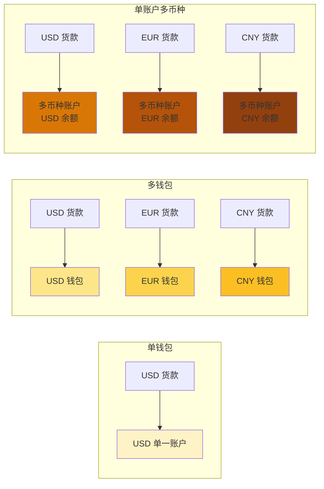
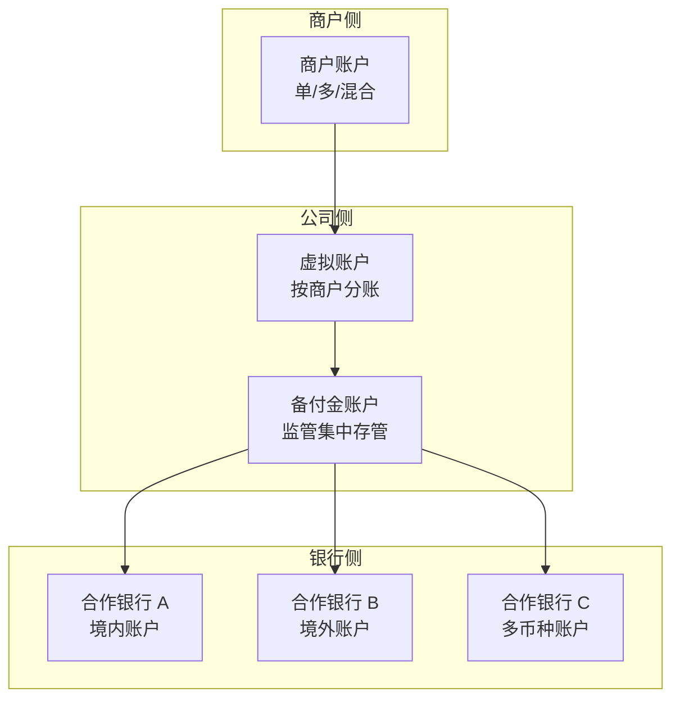

# 多币种账户体系与头寸管理（侧重收单）

> **系列第 6 篇 · 深度**
> 上一篇 [5_多币种与汇率定价权](./5_多币种与汇率定价权-深度.md) 讲了 5 币种 + 3 汇率策略。本篇深入跨境支付公司**如何为商户设计账户**——单钱包 / 多钱包 / 单账户多币种 三种账户模式，以及跨境支付公司自身**如何管理头寸**（备付金水位、调拨策略、预警机制）。

---

## 一句话定义

> **跨境支付的多币种账户体系，核心是「三种账户模式 + 一套头寸管理 + 一个合规边界」**。商户账户怎么设计（单币种 vs 多币种）、跨境支付公司头寸怎么管（备付金 + 调拨 + 预警）、监管对账户体系有什么要求（外汇申报 + 数据出境）——这三件事共同决定了跨境支付公司的资金安全和合规边界。

---

## 业务背景与价值

### 为什么账户体系比想象中复杂？

入门读者以为「账户」就是「存钱的地方」。但跨境支付的账户体系涉及 3 个层次：

- **商户侧账户**：商户在跨境支付公司开的账户（收货款用）
- **公司侧账户**：跨境支付公司自身的备付金账户（监管要求集中存管）
- **银行侧账户**：跨境支付公司在合作银行开的中间账户（实际资金划付用）

**专家视角：** 三个层次的账户**互相耦合又互相独立**——商户账户决定产品体验，公司侧账户决定资金安全，银行侧账户决定合规边界。任何一层设计错都会引发问题——这是为什么跨境支付公司**账户体系设计往往要做 6+ 个月**而不是几周

### 过去 5 年的账户体系演变（跨周期视角）

| 时间段 | 趋势 | 关键事件 |
|---|---|---|
| 2015-2018 | **单币种账户主导期** | 跨境支付公司普遍只支持单币种账户（人民币 / 美元） |
| 2019-2021 | **多币种钱包兴起期** | Airwallex、万里汇推出多币种钱包，支持 10+ 币种 |
| 2022-2024 | **CBDC 钱包探索期** | 中国数字人民币（e-CNY）跨境试点，新加坡 Project Orchid 多币种清算 |
| 2025-至今 | **嵌入式金融期** | 多币种钱包 + 信用卡 + 收单 + 汇款 一站式集成 |

**关键洞察：** 5 年前商户只能选「收美元还是收人民币」，现在可以**用 10+ 币种钱包 + 实时换汇 + 跨境汇款 + 嵌入式信用卡**。账户体系从「单一收款工具」变成「综合金融服务入口」

### 监管意图：为什么账户体系要备案？

监管对账户体系有「底线要求」：

1. **备付金集中存管**——客户资金必须存放在指定银行的备付金账户，不能挪用
2. **账户实名制**——每个账户必须实名（KYC / KYB）
3. **账户隔离**——不同商户的资金必须独立记账、不能混用
4. **数据本地化**——境内商户数据必须存储在境内服务器（数据安全法）

**专家视角：** 监管要求不是「成本」，是**信任锚点**。跨境支付公司账户体系符合监管 = 商户信任 = 业务增长。监管合规差 = 商户资金被冻 = 公司停业

---

## 业务术语表

| 中文 | 英文 | 一句话解释 |
|---|---|---|
| 单钱包 | Single Wallet | 一个账户只支持一种币种（最简单） |
| 多钱包 | Multi-Wallet | 一个用户开多个独立账户，每个账户一种币种 |
| 单账户多币种 | Multi-Currency Account | 一个账户支持多个币种（最复杂） |
| 备付金 | Reserve / Customer Funds | 支付机构代客户持有的资金（监管集中存管） |
| 头寸 | Position | 账户里可用资金余额（备付金水位） |
| 调拨 | Allocation | 在不同账户 / 银行 / 币种之间转移资金 |
| 头寸预警 | Position Alert | 备付金低于阈值时自动告警 |
| 多币种钱包 | Multi-Currency Wallet | 同时持有多种币种的账户 |
| 虚拟账户 | Virtual Account | 银行提供的子账户（资金实际在主账户） |
| 内部账户 | Internal Account | 跨境支付公司内部的记账账户（不上链） |
| 外部账户 | External Account | 银行实际开户的账户（受监管） |
| 头寸管理 | Position Management | 实时监控 + 自动调拨 + 预警的全套机制 |

---

## 业务形态与模式：3 种商户账户模式对比

### 模式 1：单钱包（Single Wallet）

**是什么：** 商户在跨境支付公司开一个账户，只能存一种币种

**机制：**
- 商户选「人民币账户」或「美元账户」
- 收到的货款直接入对应币种账户
- 商户需要换汇时手动发起

**优势：**
- **简单**——账户体系最简单，合规清晰
- **风险隔离**——一个账户出问题不影响其他账户
- **监管友好**——单一币种账户合规边界明确

**劣势：**
- **体验差**——商户需要手动管理多个账户
- **换汇成本**——每次换汇都涉及点差
- **扩展性差**——新增币种需要新开账户

**适合：** 中小商户 / 单一市场 / 单一币种交易

### 模式 2：多钱包（Multi-Wallet）

**是什么：** 商户在跨境支付公司开多个独立账户，每个账户一种币种

**机制：**
- 商户开「USD 钱包」「EUR 钱包」「CNY 钱包」三个独立账户
- 每个账户独立记账、独立监管、独立合规
- 商户可以独立管理每个账户的资金

**优势：**
- **风险隔离好**——一个币种账户出问题不影响其他
- **合规清晰**——每个币种账户独立合规
- **灵活管理**——商户可以分别管理每个币种账户

**劣势：**
- **开户复杂**——多个账户需要多次 KYC / KYB
- **管理成本**——商户需要管理多个账户
- **合规成本**——每个账户都要单独维护合规

**适合：** 中型商户 / 多个币种交易 / 风险敏感商户

### 模式 3：单账户多币种（Multi-Currency Account）

**是什么：** 一个账户支持多个币种，每个币种独立余额

**机制：**
- 商户开「多币种账户」，账户下有 USD 余额、EUR 余额、CNY 余额
- 收到 USD 货款自动入 USD 余额，EUR 货款入 EUR 余额
- 商户可以实时换汇（按当前汇率）

**优势：**
- **体验最好**——一个账户管理所有币种
- **换汇灵活**——实时汇率 API
- **集成服务**——可以叠加信用卡、汇款等

**劣势：**
- **合规复杂**——多币种账户涉及外汇申报、数据出境
- **系统复杂**——账户引擎、汇率引擎、合规引擎需要联动
- **风险大**——一个账户出问题影响所有币种

**适合：** 头部商户 / 跨境平台 / 跨境电商大卖家

**专家视角：** 业内默认：**头部跨境支付公司（如 Airwallex、万里汇）都从「单钱包」演进到「多钱包」，再演进到「单账户多币种」**。每个阶段都解决前一阶段的痛点，但都带来新的合规挑战。**单账户多币种不是「最优解」，是「演进终点」**——它要求最严格的多币种合规能力，只有头部公司才能做好

---

## 业务流程图：3 种账户模式的资金流对比

---

## 系统架构：跨境支付公司自身账户体系

**关键设计：**
- **虚拟账户层**：跨境支付公司内部按商户分账（不上链、只记账）
- **备付金层**：所有商户资金汇总到备付金账户（受监管）
- **银行层**：实际资金存放在合作银行的多个账户

**专家视角：** 三层架构的**核心价值**是「**合规边界清晰**」——商户看到的是自己的虚拟账户（产品体验），监管看到的是备付金账户（合规边界），银行看到的是实际资金（资金安全）。任何一层出问题都有降级方案

---

## 服务模型：头寸管理的 4 个核心机制

### 机制 1：实时水位监控

**做什么：** 实时监控备付金账户的水位（多币种）

**业内默认做法：**
- 每 5 分钟扫描一次备付金余额
- 设定多档水位（绿色 80%+ / 黄色 50%-80% / 红色 < 50%）
- 红色时自动触发预警

**业内认知：** 头寸监控的真实成本不是系统，是**误报**——告警太频繁导致团队疲劳、告警太稀疏导致风险漏报。**业内默认：** 阈值要按币种分（USD 阈值 50 万、CNY 阈值 200 万、EUR 阈值 30 万），不能统一

### 机制 2：自动调拨策略

**做什么：** 在不同账户 / 银行 / 币种之间自动调拨资金

**业内默认做法：**
- 备付金低于黄色水位 → 自动从合作银行调入
- 备付金高于绿色水位 → 自动调出到合作银行
- 调拨时机：避开银行系统高峰期（早上 8 点、下午 5 点）

**专家视角：** 自动调拨的真实门槛不是技术，是**银行对接**。每个合作银行的 API 都不一样，调拨时效也不同（境内实时 / 跨境 T+1）。业内头部公司通常对接 5-10 家合作银行，**分散单点故障风险**

### 机制 3：多币种调拨

**做什么：** 在不同币种的备付金账户之间调拨

**业内默认做法：**
- 美元备付金不足 → 自动用人民币备付金换汇调入美元
- 欧元备付金不足 → 自动用美元备付金换汇调入欧元
- 调拨汇率按实时汇率 + 0.1% 加点（锁汇策略）

**业内认知：** 多币种调拨的真实风险是**汇率波动**——调拨时机不对可能损失点差。业内头部公司通常用**自动锁汇**避免汇率风险，但锁汇有额度限制

### 机制 4：头寸预警

**做什么：** 头寸异常时自动告警

**业内默认做法：**
- 备付金低于红色水位 → P1 告警（立即响应）
- 调拨失败 → P2 告警（30 分钟响应）
- 大额出款待处理 → P3 告警（2 小时响应）

**专家视角：** 头寸预警的核心是「**早 + 准**」——预警太早浪费资源、预警太晚错过最佳处理时机。业内默认：**预警阈值要按历史波动动态调整**，不能写死

---

## 核心功能用例

### 用例 1：商户多币种收款

**场景：** 头部跨境电商在 Airwallex 开多币种账户，收到 USD / EUR / GBP 三种货款

**流程：**
- 商户在 Airwallex 开多币种账户
- 收到 USD 100 万 → 入账户 USD 余额
- 收到 EUR 80 万 → 入账户 EUR 余额
- 商户想换汇成人民币 → 实时汇率 API + 锁汇服务
- 商户想提现到境内 → 跨境汇款 + 外汇申报

### 用例 2：备付金不足应急

**场景：** T+3 结算日，美元备付金账户余额低于红色水位

**处理：**
- 系统检测到水位异常 → P1 告警
- 自动从合作银行调入美元（境内银行实时 / 跨境银行 T+1）
- 调拨记录 + 调拨回执 + 调拨成本记账
- 后续运营跟进，确保调拨及时到位

### 用例 3：合规冻结

**场景：** 某商户因合规问题被监管冻结账户

**处理：**
- 监管要求冻结商户资金 → 系统冻结商户虚拟账户
- 备付金账户中该商户的资金**独立核算**（不能与其他商户混用）
- 等待监管调查结果 → 决定解冻或划转

**业内认知：** 合规冻结的真实成本不是冻结本身，是**冻结的会计处理**——商户资金冻结时，跨境支付公司需要独立核算、计提风险准备金、不能挪用。**业内默认：** 合规冻结必须 24 小时内响应、72 小时内完成独立核算

---

## 业务打法与策略：不同公司的账户模式选择

### 头部公司（年 GMV > 100 亿美元）

**典型打法：**
- **单账户多币种**（10+ 币种）+ **多银行对接**（5-10 家）+ **实时汇率 API**
- 商户可以随时换汇、随时提现
- 嵌入式信用卡 + 跨境汇款 + 收款

**业内认知：** 头部公司的账户体系是「**综合金融服务入口**」——不只是收款工具，是「跨境金融操作系统」。这种能力的**真实门槛**是合规能力（多币种 + 多牌照）+ 技术能力（实时汇率 + 多银行对接）+ 资本能力（备付金水位）

### 中型公司（年 GMV 1-100 亿美元）

**典型打法：**
- **多钱包**（5-8 个币种独立账户）+ **3-5 家合作银行**
- 商户按需选择钱包
- 实时汇率但额度有限

**业内认知：** 中型公司的账户体系是「**够用但不完美**」——能支持大部分商户需求，但跨境汇款 / 大额换汇能力弱。适合中型跨境电商

### 小公司 / 新进入者（年 GMV < 1 亿美元）

**典型打法：**
- **单钱包**（单一币种）+ **1-2 家合作银行**
- 商户需要换汇时手动发起
- 没有多币种钱包

**业内认知：** 小公司的账户体系是「**MVP 起步**」——能支持基本收款，但**用户体验差、合规风险高**。长期会被市场淘汰

---

## Trade-off 分析

### 决策 1：单钱包 vs 多钱包 vs 单账户多币种

| 选项 | 优势 | 代价 | 适合谁 |
|---|---|---|---|
| **单钱包** | 简单、合规清晰 | 体验差、换汇成本高 | 中小商户 |
| **多钱包** | 风险隔离好、合规清晰 | 开户复杂、管理成本 | 中型商户 |
| **单账户多币种** | 体验最好、灵活 | 合规复杂、系统复杂 | 头部商户 |

**专家视角：** 这是**业务战略决策**——单钱包简单但体验差、多钱包合规清晰但复杂、单账户多币种体验好但合规门槛高。**业内默认：** 头部公司必须支持单账户多币种（行业标杆），中型公司优先做多钱包（合规清晰），小公司先做单钱包（MVP 起步）

### 决策 2：自建账户引擎 vs 用第三方钱包 SaaS

| 选项 | 优势 | 代价 | 适合谁 |
|---|---|---|---|
| **自建账户引擎** | 完全可控、定制灵活 | 开发成本 12+ 月、合规自己扛 | 头部公司 |
| **第三方钱包 SaaS** | 上线快、合规外包 | 锁定 SaaS、月费、定制受限 | 中型公司 |
| **银行虚拟账户** | 合规清晰、不需要自建 | 单一银行、单币种受限 | 小公司 |

**专家视角：** 自建账户引擎的**真实门槛**是合规能力——账户引擎必须支持多币种、多监管、多银行的合规要求，这不是技术问题。**业内默认：** 中型公司应该用「第三方钱包 SaaS + 自营合规系统」，避免从零自建

### 决策 3：备付金集中 vs 分散

| 选项 | 优势 | 代价 | 适合谁 |
|---|---|---|---|
| **集中存管**（监管要求） | 合规清晰 | 灵活性差、银行选择受限 | 所有公司 |
| **分散存管**（多家银行） | 单点故障风险低 | 合规复杂、跨行调拨成本 | 头部公司 |

**专家视角：** 备付金**必须集中存管**（监管硬要求），但**可以分散到多家合作银行**（降低单点故障）。业内默认：**头部公司对接 5-10 家合作银行，每家存一部分**，通过自动调拨实现「集中合规 + 分散风险」

---

## 行业洞察 / 业内认知

### 不成文标准：备付金的「不计息」真相

公开规则：支付机构在银行存管的客户备付金**不计息**（人行规定）。

**业内实际做法：** 头部跨境支付公司通过以下方式**变相拿到隐性收益**：

1. **「内部转账」模式**：收单行在结算时点前向支付机构备付金账户进行「内部资金调拨」，名义上是活期存款，实际通过协议存款、结构性存款等方式给到 0.5%-1.5% 的年化收益（远高于活期 0.35%）

2. **「结算时点调整」模式**：通过协商结算发起时点（比如 T+1 vs T+3），实际延长备付金在收单行的停留时间，间接增加计息基数

3. **「阶梯优惠」模式**：月交易量达到某个阶梯后，收单行通过「手续费折扣」「结算费减免」等方式变相返利

**业内认知：** 头部客户和收单行谈合作时，备付金收益是**必谈项之一**，不是「可选项」

### 真实事故：备付金不足引发系统故障

公开报道：2023 年某中型跨境支付公司因美元备付金不足，导致 T+3 结算日多个商户的资金无法及时到账，引发商户投诉 + 监管问询。公司最终被罚款 + 暂停新增商户 3 个月。

**业内流传的处理方式：** 头部公司后来强制：
- 备付金水位监控必须**实时**（不是 T+1）
- 头寸预警必须**多档**（绿色 / 黄色 / 红色 / 紧急）
- 调拨策略必须**自动化**（不能依赖人工）

**教训：** 备付金不足不是「会计问题」，是「系统问题 + 合规问题」。业内默认：**备付金水位监控是跨境支付公司最重要的运维指标**

### 从业者挑战：多币种调拨的汇率风险

跨境支付公司常见的内部挑战：多币种备付金调拨时的汇率风险——调拨时机不对可能损失点差。

**业内通用做法：**
- **自动锁汇**——调拨前自动锁汇（避免汇率波动）
- **大额调拨人工审核**——超过阈值的大额调拨要人工确认
- **调拨成本计入商户费率**——把调拨成本分摊给商户

**专家视角：** 多币种调拨的真实门槛不是技术，是**流动性**。没有 50 亿美元 + 的换汇量，多币种调拨的点差会过大。**5 年后回头看：** 多币种调拨能力会成为头部支付公司的护城河，中型公司难以追赶

---

## 业务前景与趋势

### 未来 3-5 年的 4 个结构性变化

**1. 多币种钱包标配化**
单账户多币种会从「头部公司专属」变成「所有跨境支付公司标配」——技术成熟 + 监管清晰 + 商户需求强。**对参与方格局的启示：** 不支持多币种钱包的支付公司会被淘汰

**2. CBDC 跨境互联**
中国数字人民币（e-CNY）+ mBridge 项目让 CBDC 跨境互联成为可能，未来 CBDC 钱包可能直接成为跨境支付账户体系的一部分。**对参与方格局的启示：** 传统备付金账户可能被 CBDC 钱包替代

**3. 嵌入式金融账户**
跨境支付账户不再只是「收款工具」，会演变成「综合金融服务入口」——集成信用卡、汇款、投资、保险。**对参与方格局的启示：** 跨境支付公司需要从「支付服务」转型为「金融科技」

**4. 监管科技（RegTech）账户**
监管要求持续收紧，跨境支付公司需要「监管科技」账户——自动合规、自动报送、自动审计。**对参与方格局的启示：** RegTech 能力会成为头部支付公司的护城河

---

## 一句话总结

> **跨境支付的多币种账户体系，核心是「三种账户模式 + 一套头寸管理 + 一个合规边界」**。商户账户怎么设计（单钱包 / 多钱包 / 单账户多币种）决定了产品体验，公司头寸怎么管（备付金水位 + 调拨策略 + 预警机制）决定了资金安全，监管对账户体系有什么要求（外汇申报 + 数据出境 + 备付金集中存管）决定了合规边界。这三件事共同决定了跨境支付公司的核心竞争力。

---

## 📌 数据与事实声明

本文涉及的 3 种账户模式（单钱包 / 多钱包 / 单账户多币种）、备付金管理机制、监管要求等内容是跨境支付行业的通用认知，但具体到：

- 各家支付公司的账户模式（Airwallex / 万里汇 / PingPong 等）以各公司官方文档为准
- 备付金计息规则（协议存款 / 结构性存款）以各合作银行实际报价为准
- 监管对多币种账户的具体要求（外汇申报 / 数据出境）以最新监管文件为准
- 头寸管理的具体阈值（黄色 / 红色水位）以各公司实际配置为准

不要直接引用本文阈值作为系统设计依据或合规依据。

---

## 下一篇预告

下一篇 [7_跨境清分模型与 MDR 拆解](./7_跨境清分模型与MDR拆解-深度.md) 将深入「MDR（Merchant Discount Rate）」的拆解——interchange / assessment / processor / markup 四部分分别谁赚多少，以及不同卡种 / 国家 / 商户类型的费率差异如何影响支付公司的策略空间。