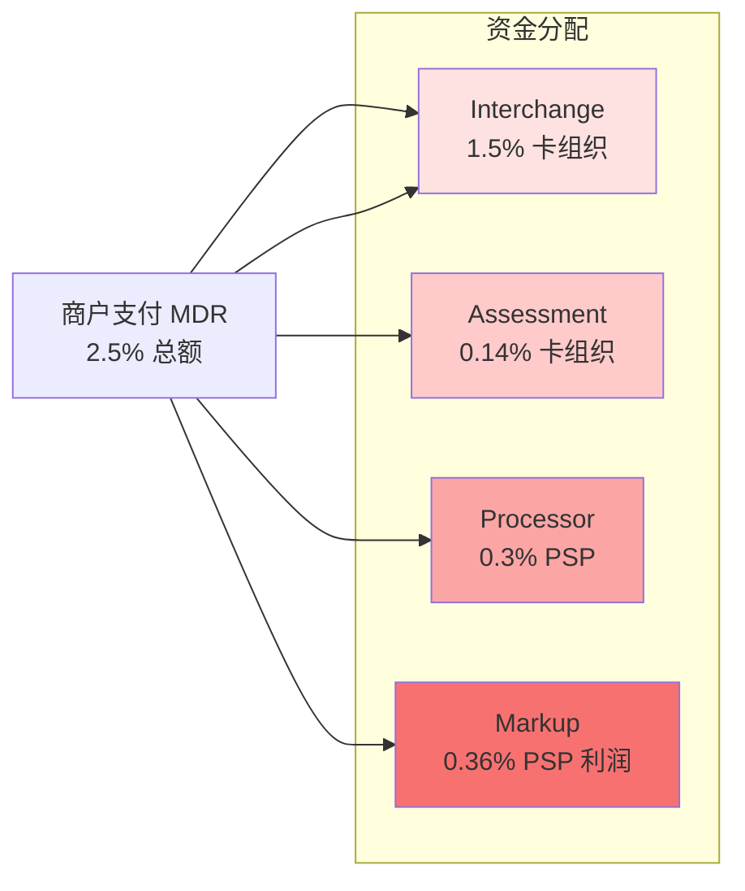
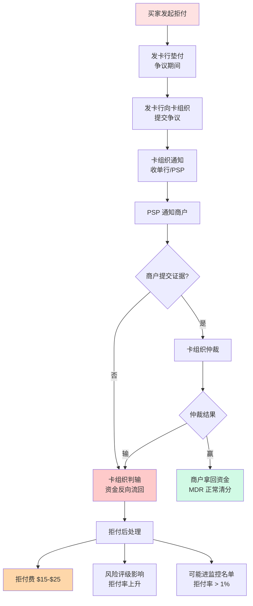

# 跨境清分模型与 MDR 拆解（侧重收单）

> **系列第 7 篇 · 深度**
> 上一篇 [6_多币种账户体系与头寸管理](./6_多币种账户体系与头寸管理-深度.md) 讲了商户账户和公司头寸。本篇深入「**钱进来之后怎么分**」——一笔支付从商户看是 2.5% 的总成本，但内部要拆给 4-5 个参与方。**MDR（Merchant Discount Rate）拆解**是跨境支付公司必须精通的核心能力。

---

## 一句话定义

> **跨境支付的清分模型，核心是「MDR 拆解 + 清算模式选择 + 拒付反向清分」**。MDR 由 interchange（交换费）/ assessment（评估费）/ processor（处理器费）/ markup（PSP 加点）四部分组成，每部分谁赚多少、按什么规则分——决定了支付公司的成本结构和盈利模型。

---

## 业务背景与价值

### 为什么 MDR 拆解比想象中重要？

入门读者以为「跨境支付费率就是 2.5%」。但真实情况是：

```
MDR（商户支付的总费率）= interchange + assessment + processor + markup
                         ~1.5%      ~0.14%       ~0.5%       ~0.36%
```

**每一部分都有不同的归属方：**

- **interchange**：卡组织向收单行收取（**大头**）
- **assessment**：卡组织品牌使用费
- **processor**：PSP / 收单机构收取的处理服务费
- **markup**：PSP / 收单机构的利润加成

**专家视角：** MDR 拆解的真实价值不是「知道每部分多少」，是**「知道谁能谈」**——interchange 由卡组织定（不可谈）、assessment 由卡组织定（不可谈）、processor 可谈（头部客户能谈到 0.3%）、markup 可谈（看议价能力）。**头部公司的真实利润来自 markup + 部分 processor**

### 过去 5 年的 MDR 演变（跨周期视角）

| 时间段 | 趋势 | 关键事件 |
|---|---|---|
| 2015-2018 | **标准费率期** | interchange 约 1.5%-1.8%（信用卡标准） |
| 2019-2021 | **本地化压力期** | 欧盟监管要求降低 interchange，欧盟国家降至 0.3%（借记卡）/ 1.5%（信用卡） |
| 2022-2024 | **差异化定价期** | 卡组织推差异化 interchange（按卡种 / 国家 / 商户类型），头部商户拿到优惠费率 |
| 2025-至今 | **实时清算 + 透明化期** | Visa Direct / Mastercard Send 推动实时清算，interchange 透明度提升 |

**关键洞察：** 5 年前 interchange 是「黑箱」（卡组织定、行业接受），现在欧盟监管强制透明化、美国市场也有「interchange 公开」压力。**未来 interchange 透明度会持续提升**

### 监管意图：为什么欧盟要降低 interchange？

欧盟 2015 年通过 IFR（Interchange Fee Regulation），对 debit 卡 interchange 上限 0.2%、credit 卡 1.5%。监管的意图：

1. **降低商户成本**——interchange 越高，商户成本越高，最终转嫁给消费者
2. **促进支付市场竞争**——降低卡组织的 interchange 议价能力
3. **消费者保护**——降低消费者承担的支付成本

**专家视角：** 欧盟 IFR 是全球支付监管的「试金石」——美国虽然没有类似规定，但卡组织也「主动降费」避免监管介入。**未来 3-5 年**，更多国家可能跟进降低 interchange，对头部支付公司是「利润压力」

---

## 业务术语表

| 中文 | 英文 | 一句话解释 |
|---|---|---|
| MDR | Merchant Discount Rate | 商户支付的总费率 |
| 交换费 | Interchange Fee | 卡组织向收单行收取的清算费用 |
| 评估费 | Assessment Fee | 卡组织品牌使用费 |
| 处理器费 | Processor Fee | PSP / 收单机构的处理服务费 |
| 加点 | Markup | PSP / 收单机构的利润加成 |
| 直连模式 | Direct Model | 商户直接接入卡组织 |
| 间连模式 | Indirect Model | 商户通过 PSP 接入卡组织 |
| 聚合模式 | Aggregator Model | 多 PSP 在底层互相切换 |
| 拒付 | Chargeback | 持卡人发起争议，资金反向流回 |
| 拒付反向清分 | Chargeback Reversal | 拒付触发后的反向清算流程 |
| MCC | Merchant Category Code | 商户类别代码（影响 interchange） |
| BIN | Bank Identification Number | 发卡行识别码（影响 interchange） |
| 卡组织 | Card Network | Visa / Mastercard / UnionPay 等 |

---

## 业务形态与模式：MDR 4 部分拆解详解

### 第 1 部分：Interchange（交换费）—— 卡组织大头

**是什么：** 卡组织向收单行收取的清算费用

**业内典型水平（公开认知，具体以卡组织最新规则为准）：**

| 场景 | Interchange 范围 |
|---|---|
| 美国信用卡（标准） | 1.5%-2.5% |
| 美国借记卡 | 0.05%-1.6%（按风险等级分） |
| 欧盟信用卡（监管上限） | ≤ 1.5% |
| 欧盟借记卡（监管上限） | ≤ 0.2% |
| 国际信用卡（跨境） | 1.5%-2.5% |

**谁来收：** 卡组织
**谁来付：** 收单行
**谁能谈：** **不能谈**——卡组织定的，行业接受

**影响因素：**
- **MCC（商户类别代码）**——超市 vs 酒店 vs 航空，不同 MCC interchange 不同
- **BIN（发卡行识别码）**——不同发卡行 interchange 不同
- **卡种**——信用卡 / 借记卡 / 签名卡 / PIN 卡
- **国家**——不同国家监管要求不同
- **交易类型**——线上 / 线下 / 跨境

**专家视角：** Interchange 是**跨境支付的最大成本项**（占总 MDR 60%+）。降低 interchange 的方法不是「谈判」（不可谈），是「**优化商户 MCC / 选择合适卡种 / 减少跨境交易**」

### 第 2 部分：Assessment（评估费）—— 卡组织品牌使用费

**是什么：** 卡组织按交易笔数收取的品牌使用费

**业内典型水平：**

| 卡组织 | 评估费水平 |
|---|---|
| Visa | 约 0.14% + $0.10-$0.20/笔 |
| Mastercard | 约 0.13%-0.15% + $0.10-$0.20/笔 |
| UnionPay | 约 0.10%-0.12% + $0.05-$0.10/笔 |
| American Express | 约 0.15%-0.20%（Amex 模式不同） |

**谁来收：** 卡组织
**谁来付：** 收单行
**谁能谈：** **不能谈**——固定费率

**专家视角：** Assessment 是「**小但必付**」的成本项，单笔交易约 0.14% + $0.10-$0.20。**对小额交易特别不划算**（固定费用占比高），所以小额交易往往用「折扣费」结构（卡组织降低评估费让小额交易可行）

### 第 3 部分：Processor Fee（处理器费）—— PSP / 收单机构服务费

**是什么：** PSP / 收单机构收取的支付处理服务费

**业内典型水平：**

| 服务商 | 处理器费 |
|---|---|
| 大型收单行（如 Chase Paymentech） | 约 0.2%-0.5% |
| 中型 PSP（如 Windcave） | 约 0.3%-0.5% |
| 大型 PSP（如 Adyen / Stripe） | 约 0.2%-0.4%（可谈到 0.15%） |
| 中国跨境支付公司 | 约 0.1%-0.3% |

**谁来收：** PSP / 收单机构
**谁来付：** 商户（转嫁）
**谁能谈：** **可以谈**——头部客户能谈到 0.15%-0.2%

**影响因素：**
- 交易量（量大从优）
- 接入模式（直连 vs 间连）
- 风控能力（低风险商户费率低）
- 增值服务（多币种、锁汇等）

**专家视角：** Processor Fee 是**头部商户议价的核心战场**。头部商户（Amazon、SHEIN）通过月交易量承诺、年交易量阶梯、品牌联名等方式把 Processor Fee 谈到 0.15% 甚至更低。**这是为什么头部商户的真实成本远低于公开标准**

### 第 4 部分：Markup（加点）—— PSP / 收单机构的利润

**是什么：** PSP / 收单机构在成本基础上的利润加成

**业内典型水平：**

| 服务商 | Markup |
|---|---|
| 头部 PSP（Adyen） | 约 0.1%-0.3%（高透明、低 Markup） |
| 中型 PSP | 约 0.2%-0.5% |
| 中国跨境支付公司 | 约 0.1%-0.3%（汇率点差替代部分 Markup） |
| 头部商户专属 PSP | 约 0.05%-0.15% |

**谁来收：** PSP / 收单机构
**谁来付：** 商户（转嫁）
**谁能谈：** **可以谈**——头部客户能谈到 0.05%-0.1%

**专家视角：** Markup 是 PSP 真正的「**利润空间**」——但**头部公司越来越少靠 Markup**，而是通过**汇率点差 + 增值服务**赚更多利润（业内默认：汇率收入占头部公司总收入 40%-50%）

---

## 业务流程图：MDR 4 部分资金分配



**关键观察：**
- 卡组织拿走大头（Interchange + Assessment ≈ 65%）
- PSP 拿走小头（Processor + Markup ≈ 35%）
- **头部 PSP 通过汇率点差再额外赚 10%-30%**

---

## 系统架构：3 种清算模式对比

### 模式 1：直连模式（Direct Model）

**机制：**
- 商户直接和卡组织签约
- 卡组织向商户直接收取 interchange + assessment
- 商户自建（或购买）PSP 服务处理授权 / 清算 / 对账

**MDR 拆分：**
- Interchange：1.5%（卡组织收）
- Assessment：0.14%（卡组织收）
- Processor：0%（商户自建或购买 PSP）
- Markup：0%（直接给卡组织）
- **合计：** 1.64%（**比标准 2.5% 低 0.86%**）

**优势：**
- 费率最低（节省 Markup + 部分 Processor）
- 完全控制（自建 PSP）
- 合规自己扛（要拿支付牌照）

**劣势：**
- 对接周期 6-12 个月（每个国家都要重新集成）
- 需要支付牌照
- 需要风控团队

**适合：** 年 GMV > 100 亿美元的头部公司

### 模式 2：间连模式（Indirect Model）

**机制：**
- 商户通过 PSP 接入卡组织
- PSP 代收 MDR，扣除自己的费用后转付给卡组织
- 商户按 PSP 给的费率支付

**MDR 拆分：**
- Interchange：1.5%（PSP 代付给卡组织）
- Assessment：0.14%（PSP 代付给卡组织）
- Processor：0.3%（PSP 收）
- Markup：0.36%（PSP 利润）
- **合计：** 2.3%（**比直连模式高 0.66%**）

**优势：**
- 上线快（PSP 一站式）
- 合规外包（PSP 持牌）
- 灵活（换 PSP 即可换通道）

**劣势：**
- 费率溢价（高 0.66%）
- 议价权弱（看 PSP 脸色）

**适合：** 年 GMV 1-100 亿美元的中型公司

### 模式 3：聚合模式（Aggregator Model）

**机制：**
- 多家 PSP 在底层互相切换
- 商户接入聚合 SDK，背后根据成功率 / 汇率 / 风险动态路由

**MDR 拆分：**
- Interchange：1.5%（动态路由到卡组织）
- Assessment：0.14%（动态路由到卡组织）
- Processor：0.2%-0.4%（动态选最低）
- Markup：0.2%-0.4%（聚合 PSP 利润）
- **合计：** 2.0%-2.4%（**比间连模式低 0-0.3%**）

**优势：**
- 成功率最优（动态选最优通道）
- 汇率最优（动态选最优 FX）
- 备份通道多（单 PSP 故障不影响）

**劣势：**
- 系统复杂度翻倍
- 对账难度上升（多 PSP 账单对账）
- 调试难度高（出问题不知道是哪家 PSP）

**适合：** 任何规模都可，但需技术能力

**专家视角：** 业内默认：**头部公司直连（100 亿+）、中型公司间连（1-100 亿）、有技术能力的公司聚合**。**聚合不是「最优」，是「次优但灵活」**——直连才是真正最优，但合规成本太高

---

## 服务模型：拒付反向清分机制

**拒付（Chargeback）**触发反向清分——这是 MDR 模型里最复杂的部分。

### 拒付反向清分流程

```
买家发起拒付
   ↓
发卡行垫付（争议期间）
   ↓
发卡行向卡组织提交争议
   ↓
卡组织通知收单行 / PSP
   ↓
PSP 通知商户
   ↓
商户提交证据（物流 / 沟通记录）
   ↓
卡组织根据证据判商家赢 / 输
   ↓
赢：商户拿回资金（MDR 正常清分）
输：资金反向流回买家（MDR 反向清分）
```

### 拒付反向清分的成本

**业内默认拒付处理的真实成本：**
- 拒付金额本身（100% 损失）
- 拒付处理费（$15-$25/笔）
- 拒付率超过阈值后的**罚款**（业内头部公司风险评级风险）
- 拒付率超过阈值后**强制接入监控项目**（Visa VAMP / Mastercard ABC）

**业内认知：** 拒付处理的真实成本**不是拒付金额**，是**对卡组织风险评级的影响**。拒付率（chargeback ratio）超过阈值的商户会被卡组织列入监控名单，最坏情况是被强制接入风险监控项目，导致所有商户类别被额外监控，成本翻倍

### 拒付反向清分流程图



### 拒付反向清分对 MDR 模型的影响

- **Interchange 反向退还**：拒付成功后，intercharge 部分会从商户账上扣除
- **Assessment 不退**：评估费照收（卡组织不退）
- **Processor Fee 不退**：处理费照收（PSP 不退）
- **Markup 退**：Markup 部分按合同退（看 PSP 政策）

**业内认知：** 拒付发生后，**商户的真实损失 > MDR 总额**——因为还要承担拒付处理费 + 风险评级损失。**业内默认：** 拒付率超过 1% 的商户应该被列入高风险名单，超过 3% 必须紧急降级或下线

---

## 核心功能用例

### 用例 1：标准信用卡交易

**场景：** 美国买家用 Chase Visa 信用卡买 $100 商品

**MDR 拆分：**
- Interchange：1.65%（Chase Visa 标准）
- Assessment：0.14% + $0.10（Visa 标准）
- Processor：0.3%（PSP 标准）
- Markup：0.36%（PSP 加点）
- **合计：** 2.45% + $0.10（**商户实际收到 $97.55 - $0.10**）

### 用例 2：跨境拒付处理

**场景：** 英国买家拒付 $100 商品（声称未收到）

**拒付流程：**
- 拒付费：$25/笔（Visa 标准）
- 拒付金额：$100（反向流回买家）
- 风险评级：商户拒付率上升（从 0.5% 上升到 0.8%）
- 累计影响：商户可能进入卡组织监控名单（拒付率 > 1% 触发）

### 用例 3：聚合模式智能路由

**场景：** 中国跨境电商接入聚合 PSP，背后有 Adyen + Stripe + Windcave 三个通道

**路由决策：**
- 卡种：Mastercard → Stripe（汇率最优）
- 卡种：Visa → Adyen（成功率最优）
- 卡种：本地支付 → Windcave（本地支持最优）

**MDR 拆分（不同通道不同）：**
- Mastercard → Stripe：MDR 2.6%
- Visa → Adyen：MDR 2.4%
- 本地支付 → Windcave：MDR 1.5%
- **加权平均：** 2.3%（**比单一通道低 0.2%**）

---

## 业务打法与策略：不同公司的清分模式选择

### 头部公司（年 GMV > 100 亿美元）

**典型打法：**
- **直连卡组织**（interchange 最优）
- **自营 FX 团队**（汇率点差替代部分 Markup）
- **多通道聚合**（成功率优化）
- **自建风控**（拒付率 < 0.5%）

**业内认知：** 头部公司的 MDR 拆分策略是「**组合拳**」——核心通道直连、长尾通道间连、特殊通道聚合。MDR 实际成本往往比公开低 0.5%-1%

### 中型公司（年 GMV 1-100 亿美元）

**典型打法：**
- **间连为主 + 核心通道直连**（降低 0.3% MDR）
- **FX 业务部分外包**（汇率点差 0.3-0.5%）
- **风控外包为主**（拒付率 0.8-1.5%）
- **重点攻细分市场**（避免全面铺开）

**业内认知：** 中型公司的 MDR 拆分核心是「**核心通道直连 + 长尾间连**」——不是所有通道都直连，而是高交易量通道直连降本

### 小公司 / 新进入者（年 GMV < 1 亿美元）

**典型打法：**
- **100% 间连 PSP**（合规成本最低）
- **FX 完全外包**（自营不划算）
- **风控靠 PSP 提供的模板**（拒付率 > 1.5%）
- **聚焦单一卡种 + 单一国家**（MVP 起步）

**业内认知：** 小公司的真实成本是「**合规 + 风控 + FX 三项占 80%**」，剩余 20% 才是技术。**长期会被市场淘汰**——除非快速做大

---

## Trade-off 分析

### 决策 1：直连 vs 间连 vs 聚合

| 选项 | MDR 实际成本 | 优势 | 代价 | 适合谁 |
|---|---|---|---|---|
| **直连** | 1.6%-1.8% | 费率最低 | 合规自己扛 | 年 GMV > 100 亿 |
| **间连** | 2.2%-2.5% | 上线快、灵活 | 费率溢价 0.5%-0.7% | 年 GMV 1-100 亿 |
| **聚合** | 2.0%-2.4% | 成功率最优 | 系统复杂 | 任何规模，需技术 |

**专家视角：** 这是**业务战略决策**。直连意味着你要自己养合规团队 + 自己处理拒付 + 自己扛汇率风险。**规模不到 100 亿 GMV 时，直连的合规成本可能吃掉费率节省的全部利润**

### 决策 2：自营风控 vs 外包风控

| 选项 | 拒付率 | 优势 | 代价 | 适合谁 |
|---|---|---|---|---|
| **自营风控** | 0.3%-0.5% | 拒付率最低 | 团队成本 50+ 人 | 头部公司 |
| **外包风控** | 0.8%-1.5% | 上线快 | 拒付率高 0.5%+ | 中型公司 |
| **混合风控** | 0.5%-0.8% | 平衡 | 协调成本 | 中型公司 |

**专家视角：** 风控能力是**拒付率控制的关键**。拒付率每降低 0.5%，商户续费率提升 10%+。**业内默认：** 头部公司必须自营风控（拒付率 < 0.5%），中型公司可以外包（拒付率 0.8%-1.5%），小公司只能外包（拒付率 > 1.5%）

### 决策 3：单币种 vs 多币种结算

| 选项 | 汇率收入 | 优势 | 代价 | 适合谁 |
|---|---|---|---|---|
| **单币种结算** | 0% | 简单、合规清晰 | 商户承担汇率风险 | 中小商户 |
| **多币种结算** | 0.3%-0.8% | 利润空间大 | 系统复杂、合规要求高 | 头部商户 |

**专家视角：** 多币种结算是头部公司的**核心利润来源**——业内头部公司汇率收入占总收入 40%-50%。**5 年后回头看：** 不支持多币种结算的支付公司会被淘汰

---

## 行业洞察 / 业内认知

### 不成文标准：头部商户的真实费率

业内默认的「**头部商户真实费率**」（业内共识，不公开）：

| 商户规模 | 公开标准费率 | 真实成交费率 | 议价空间 |
|---|---|---|---|
| **超大商户**（月交易 > $100M） | 2.5% | 1.5%-1.8% | 议价 35%-40% |
| **大商户**（月交易 $10M-$100M） | 2.5% | 1.8%-2.2% | 议价 12%-28% |
| **中商户**（月交易 $1M-$10M） | 2.5% | 2.2%-2.4% | 议价 4%-12% |
| **小商户**（月交易 < $1M） | 2.5% | 2.4%-2.5% | 议价 0-4% |

**业内认知：** 头部商户的真实费率**远低于公开标准**——业内默认：月交易量超过千万美元的客户，PSP 给的费率可能比标准低 30-50%

### 真实事故：interchange 上调引发行业抗议

公开报道：2023 年 Visa / Mastercard 在美国宣布上调部分 MCC 的 interchange（如超市 MCC 从 1.5% 调到 1.8%），引发零售商行业组织大规模抗议，部分商户威胁更换支付通道。

**业内流传的处理方式：** 头部公司后来推动差异化定价——**对低风险商户降 interchange、对高风险商户升 interchange**，平衡商户关系。

**教训：** Interchange 调整是**行业级事件**——单一支付公司无法对抗，需要行业协会 + 商户联盟联合行动

### 从业者挑战：拒付率阈值的真实标准

业内默认的拒付率监控阈值（卡组织规则）：

| 拒付率 | 阈值含义 |
|---|---|
| **< 0.5%** | 安全区间 |
| **0.5%-0.9%** | 警告区间（可能被监控） |
| **0.9%-1.5%** | 监控区间（被列入风险名单） |
| **> 1.5%** | 强制接入监控项目（Visa VAMP / Mastercard ABC） |
| **> 3%** | 商户类别冻结（强制下线） |

**业内认知：** 拒付率阈值的**真实执行**比公开规则更严格——业内头部公司会按「**比卡组织阈值低 0.3%**」作为内部目标，确保有余量应对突发拒付潮

---

## 业务前景与趋势

### 未来 3-5 年的 4 个结构性变化

**1. Interchange 透明化**
欧盟 IFR 模式（强制透明）可能扩展到更多国家。**对支付公司影响：** interchange 议价空间被压缩，必须靠汇率点差 + 增值服务盈利

**2. 拒付监控智能化**
卡组织推 AI 风控（如 Visa Advanced Authorization、Visa Token Service），拒付率可能下降 30%-50%。**对支付公司影响：** 自营风控投资回报降低，可以更依赖卡组织风控

**3. 实时清算降低清分延迟**
Visa Direct / Mastercard Send 推动 T+0 清算，清分从「按天」变成「按笔」。**对支付公司影响：** 实时清分需要更复杂的系统，但资金风险窗口缩短

**4. CBDC 跨境互联可能重塑 MDR 模型**
CBDC 直接结算可能绕过卡组织清算网络，intercharge + assessment 可能下降。**对支付公司影响：** 传统 MDR 模型被颠覆，必须找到新的盈利点

---

## 一句话总结

> **跨境支付的清分模型，核心是「MDR 拆解 + 清算模式选择 + 拒付反向清分」**。MDR 由 interchange（卡组织大头）/ assessment（卡组织小头）/ processor（PSP 服务费）/ markup（PSP 利润）四部分组成，不同清算模式（直连 / 间连 / 聚合）的 MDR 实际成本差异显著（1.6%-2.5%）。头部公司通过组合拳（核心直连 + 长尾间连 + 多通道聚合）把实际成本压到比公开标准低 30%-50%。

---

## 📌 数据与事实声明

本文涉及的 MDR 4 部分拆解（Interchange / Assessment / Processor / Markup）、典型费率范围、拒付率阈值等内容是跨境支付行业的通用认知，但具体到：

- 各卡组织的 interchange 费率（Visa Interchange Rate / Mastercard Interchange Rate）以各卡组织最新规则为准
- 欧盟 IFR 规定（0.2% debit / 1.5% credit）以欧盟监管最新文件为准
- 拒付率监控阈值（Visa VAMP / Mastercard ABC）以各卡组织最新规则为准
- 各 PSP 的实际 processor fee / markup 以各 PSP 报价为准

不要直接引用本文费率作为定价依据或合规依据。

---

## 下一篇预告

下一篇 [8_跨境账务体系四态模型](./8_跨境账务体系四态模型-深度.md) 将深入「**钱在跨境支付系统里如何记账**」——从买家扣款到商户入账，资金会经历「待清算 / 待结算 / 在途 / 已结」四种状态，每种状态对应不同的会计处理和合规要求。