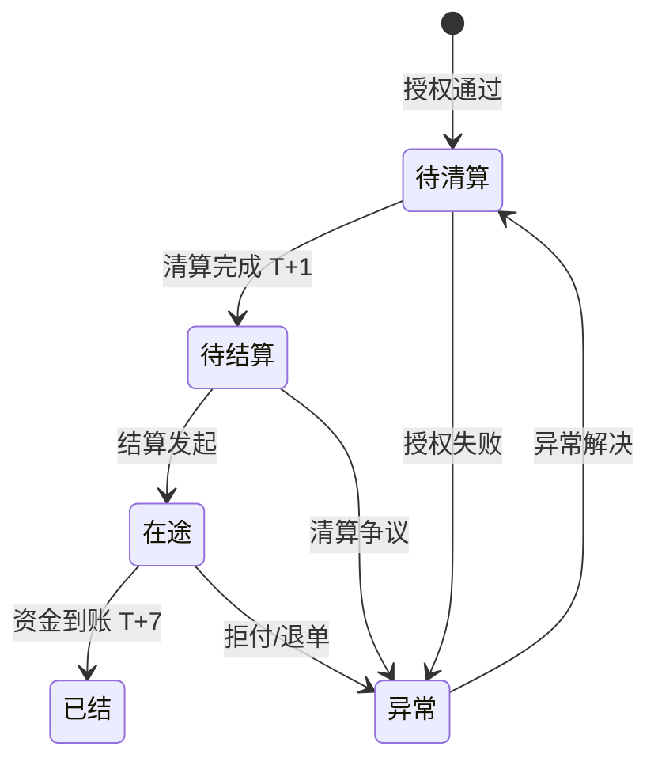
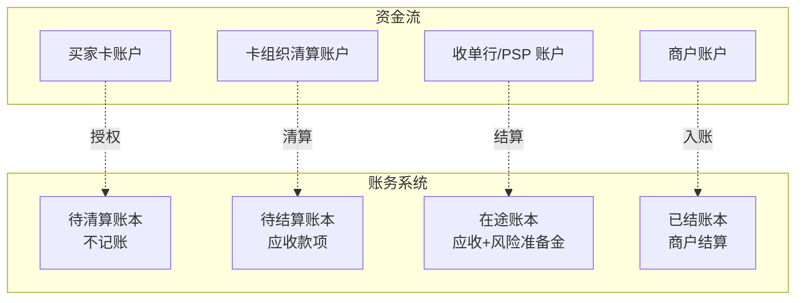

# 跨境账务体系四态模型（侧重收单）

> **系列第 8 篇 · 深度**
> 上一篇 [7_跨境清分模型与 MDR 拆解](./7_跨境清分模型与MDR拆解-深度.md) 讲了钱怎么分（interchange / assessment / processor / markup）。本篇讲**钱在跨境支付系统里如何记账**——从买家扣款到商户入账，资金会经历「**待清算 / 待结算 / 在途 / 已结**」四种状态，每种状态对应不同的会计处理和合规要求。

---

## 一句话定义

> **跨境支付的账务体系，核心是「四态账户模型 + 双向记账 + 在途资金合规边界」**。资金在 13 个时点中会经过「待清算 / 待结算 / 在途 / 已结」四种状态，每种状态对应不同的账务处理、合规要求、会计准则。原币 / 本位币双向记账保证一致性，在途资金的会计处理是合规红线。

---

## 业务背景与价值

### 为什么「四态」比「二态」重要？

入门读者以为「跨境支付账务就是'已收'和'未收'」。但实际跨境支付账务有 **4 种状态**：

```
买家扣款 → 待清算（T+0 实时）→ 待结算（T+1）→ 在途（T+1~T+7）→ 已结（T+7）
```

**每种状态的会计处理完全不同：**

- **待清算**：资金权属在买家卡账户，**不能**确认为商户收入
- **待结算**：资金权属在卡组织清算账户，**不能**确认为商户收入
- **在途**：资金权属在收单行/PSP 账户，**挂账**处理
- **已结**：资金实际到账，**可以**确认为商户收入

**专家视角：** 4 态不是「细分」是「合规边界」——错把「在途」当「已结」入账，会导致：
- 收入提前确认 → 税务错报
- 资金被挪用 → 监管认定违规
- 拒付发生时无法回滚 → 财务风险

**这是为什么 4 态账务体系被监管要求**——不是技术问题，是合规问题

### 过去 5 年的账务体系演变（跨周期视角）

| 时间段 | 趋势 | 关键事件 |
|---|---|---|
| 2015-2018 | **二态简化期** | 国内支付普遍用「已收 / 未收」二态模型，跨境支付跟着简化 |
| 2019-2021 | **四态标准化期** | 监管要求跨境支付必须用四态账务体系（防止收入提前确认） |
| 2022-2024 | **多币种账务期** | 多币种钱包普及，原币 / 本位币双记账成为标配 |
| 2025-至今 | **实时账务期** | 实时跨境支付推动账务从「按天」变成「按笔」，四态压缩到秒级 |

**关键洞察：** 5 年前账务体系是「后端会计的事」，现在变成「合规边界 + 实时风控」。**未来账务系统必须实时**——T+1 账务报告会被监管要求 T+0

### 监管意图：为什么必须用四态账务？

监管对账务体系有「底线要求」：

1. **收入确认时点**——税务规定收入必须在「资金实际到账」才能确认，**不能提前**
2. **备付金核算**——备付金必须按状态独立核算（不能混用）
3. **拒付回滚**——拒付发生时，资金可以从「在途」回退，但不能从「已结」回退（除非走争议）
4. **数据报送**——监管报送数据必须按状态分类（不能合并）

**专家视角：** 四态账务不是「技术最佳实践」，是**法律硬性要求**。跨境支付公司必须按四态独立记账、计提风险准备金、独立审计。**二态账务体系是违规的**

---

## 业务术语表

| 中文 | 英文 | 一句话解释 |
|---|---|---|
| 待清算 | Pending Clearing | 资金权属在买家卡账户（清算未完成） |
| 待结算 | Pending Settlement | 资金权属在卡组织清算账户（结算未完成） |
| 在途 | In-transit | 资金权属在收单行/PSP 账户（划付未完成） |
| 已结 | Settled | 资金实际到账（入账通知已发出） |
| 原币记账 | Original Currency Booking | 按交易原始币种记账（USD 记 USD，EUR 记 EUR） |
| 本位币记账 | Base Currency Booking | 按公司本位币（人民币）记账 |
| 双向记账 | Dual Currency Booking | 同时记原币和本位币（保证一致性） |
| 期末调汇 | Period-end FX Adjustment | 期末按新汇率调整账务（产生汇兑损益） |
| 汇兑损益 | FX Gain/Loss | 汇率波动产生的账务损益 |
| 计提风险准备金 | Risk Provision | 按历史拒付率计提的合规准备金 |
| 账实相符 | Book-Actual Match | 账务记录与实际资金一致 |
| 备付金 | Reserve / Customer Funds | 支付机构代客户持有的资金 |

---

## 业务形态与模式：四态账户余额流转

### 状态 1：待清算（Pending Clearing）

**资金在哪：** 买家卡账户
**资金权属：** **买家**
**账务处理：** 不记账（不确认收入）
**典型时点：** T+0 实时（授权完成到清算文件生成之间）

**账务示例：**
```
交易 ID: T001
买家卡账户：-USD 100（买家账上扣款）
商户账户：未记账
状态：待清算
```

**关键洞察：** 待清算状态的「钱」**不在跨境支付公司账上**——只在买家卡账户上。跨境支付公司的账务系统不记录这个状态，只记录「授权通过」事件

### 状态 2：待结算（Pending Settlement）

**资金在哪：** 卡组织清算账户
**资金权属：** **卡组织**（清算完成后）
**账务处理：** **挂账**（不确认收入，挂「应收款项」）
**典型时点：** T+1（清算文件生成后）

**账务示例：**
```
交易 ID: T001
卡组织清算账户：+USD 100（清算账户余额增加）
商户账户：未记账
跨境支付公司账上：+USD 100 应收款项（挂账）
状态：待结算
```

**关键洞察：** 待结算状态的「钱」**法律上属于卡组织清算账户**——但**操作上**由跨境支付公司挂账。**这是 4 态里最复杂的**——权属和操作分离

### 状态 3：在途（In-transit）

**资金在哪：** 收单行/PSP 账户
**资金权属：** **收单行/PSP**（结算发起后）
**账务处理：** **挂账**（不确认收入，挂「应收款项」+ 计提风险准备金）
**典型时点：** T+1 ~ T+7（结算发起到资金到账之间）

**账务示例：**
```
交易 ID: T001
收单行账户：+USD 100
跨境支付公司账上：+USD 100 应收款项（挂账）+ 计提 USD 1.5 风险准备金
商户账户：未记账
状态：在途
```

**关键洞察：** 在途状态是**跨境支付合规的核心**——必须独立核算 + 计提风险准备金。**业内默认：** 风险准备金 = 在途金额 × 1.5%（按历史拒付率）

### 状态 4：已结（Settled）

**资金在哪：** 商户账户
**资金权属：** **商户**
**账务处理：** **确认收入**（从「应收款项」转为「商户结算」）
**典型时点：** T+7（资金到账 + 入账通知发出）

**账务示例：**
```
交易 ID: T001
商户账户：+CNY 720（按结算汇率换算）
跨境支付公司账上：-USD 100 应收款项（核销）+ +CNY 720 商户结算
状态：已结
```

**关键洞察：** 已结状态是**税务确认点**——只有这时才能确认收入、上报税务。**入账通知发出 = 已结状态**

---

## 业务流程图：四态账户余额流转



**关键观察：**
- 4 态顺序流转：待清算 → 待结算 → 在途 → 已结
- 异常状态可发生在任何阶段
- 异常解决后回到待清算（不是「在途」或「已结」）
- **没有「跳过」的流转**（如「待清算 → 已结」是不允许的）

---

## 系统架构：四态账务体系设计



**关键设计：**
- 4 个账本独立维护（不能合并）
- 资金流变化触发账务状态切换
- 账本状态可逆（异常状态回到待清算）
- 账本记录必须**可追溯**（任何余额变化能定位到原始交易）

---

## 服务模型：双向记账机制

跨境支付账务必须用「**原币 + 本位币双向记账**」，不能只记原币或只记本位币。

### 双向记账机制

```
交易 ID: T001
原币（USD）：
  应收 USD 100
  汇兑损益 USD 1（结算日汇率变化）
  实收 USD 99

本位币（CNY）：
  应收 CNY 720（按 7.20 汇率）
  实收 CNY 713（按 7.21 汇率）
  汇兑损益 CNY 7
```

**关键设计：**
- **原币账本**：记录原始币种的金额变化（保证卡组织对账一致）
- **本位币账本**：记录按人民币计价的金额变化（保证国内税务申报）
- **期末调汇**：按新汇率调整本位币账本（产生汇兑损益）

### 双向记账的合规价值

- **税务合规**：本位币账本是税务申报的唯一依据
- **审计合规**：原币账本是审计的唯一依据（监管要求原币对账）
- **业务合规**：商户看到的是本位币金额（按结算日汇率换算）

**专家视角：** 双向记账的真实门槛不是技术，是**汇率管理**。每次记账都要确定「**用哪个汇率**」——授权日汇率、清算日汇率、结算日汇率，三者不同就会产生汇兑损益。**业内默认：** 跨境支付公司必须按交易日锁定汇率（避免汇率波动对账务的冲击）

---

## 核心功能用例

### 用例 1：标准四态流转

**场景：** 美国买家用 Visa 卡买 $100 商品，最终商户收到 ¥720 人民币

**四态流转：**
- T+0：买家扣款 $100 → **待清算**（不记账）
- T+1：Visa 清算完成 → **待结算**（挂账 USD 100 应收）
- T+3：收单行结算发起 → **在途**（挂账 + 计提 USD 1.5 风险准备金）
- T+7：资金到账 + 入账通知 → **已结**（确认收入 + 商户账户 +CNY 720）

**账务记录：**
```
T+1 待结算：
  借：应收 USD 100
  贷：清算账户 USD 100

T+3 在途：
  借：应收 USD 100
  借：风险准备 USD 1.5
  贷：结算中 USD 100

T+7 已结：
  借：结算中 USD 100
  贷：商户结算 CNY 720
  借：汇兑损益 CNY 7
  贷：应收 USD 100
```

### 用例 2：在途资金拒付

**场景：** 同一笔交易，商户收到 ¥720 后，T+30 买家拒付

**账务处理：**
- 拒付金额：$100（按拒付日汇率 ¥720）
- 拒付费：$25
- 风险准备金：$1.5 已计提（冲回）
- 商户实际损失：¥720 + $25 + 汇率风险

**业内默认：** 拒付时直接扣商户账户（商户授权时同意的）+ 风险准备金冲回。如果商户账户余额不足，扣下一笔交易

### 用例 3：合规冻结（在途状态）

**场景：** 商户因合规问题被冻结账户，资金仍在「在途」状态

**账务处理：**
- 在途状态保持（不能转为已结）
- 资金独立核算（不能与其他商户混用）
- 等待监管调查结果 → 决定解冻或划转

**关键洞察：** 合规冻结必须在**「在途」状态处理**——如果已经「已结」（入账通知发出），冻结难度会大幅上升。**业内默认：** 合规冻结 24 小时内响应、72 小时内完成独立核算

---

## 业务打法与策略：不同公司的四态账务体系

### 头部公司（年 GMV > 100 亿美元）

**典型做法：**
- **四态独立账本**（4 套独立数据库）
- **双向记账**（原币 + 本位币 + 实时调汇）
- **实时账务报告**（T+0 实时对账）
- **自动化风险准备金**（按历史拒付率动态计提）

**业内认知：** 头部公司的账务系统是**实时 + 双向 + 自动化**的，能在秒级完成四态流转。**这是 10+ 年技术积累的产物**

### 中型公司（年 GMV 1-100 亿美元）

**典型做法：**
- **四态账本**（可能用 2 个数据库实现 4 态）
- **双向记账**（部分自动化）
- **T+1 账务报告**（隔天对账）
- **手工风险准备金**（按月调整）

**业内认知：** 中型公司的账务系统是「**够用但不完美**」——能支持四态但不是实时。**合规风险中等**

### 小公司 / 新进入者（年 GMV < 1 亿美元）

**典型做法：**
- **二态账本**（已收 / 未收）—— **违规**
- **单向记账**（只记本位币）—— **不完整**
- **手工对账**（按周对账）
- **无风险准备金**（不合规）

**业内认知：** 小公司的账务系统**几乎都不合规**——二态账本是违规的、单向记账是不完整的。**长期会被监管处罚**

---

## Trade-off 分析

### 决策 1：四态 vs 二态 vs 三态

| 选项 | 优势 | 代价 | 适合谁 |
|---|---|---|---|
| **二态**（已收/未收） | 简单 | **违规** | ❌ 不推荐 |
| **三态**（待清算/在途/已结） | 部分合规 | 仍不满足监管要求 | ❌ 不推荐 |
| **四态**（待清算/待结算/在途/已结） | **完全合规** | 系统复杂 | **必须** |

**专家视角：** 四态不是「选择」，是**监管硬性要求**。任何小于四态的账务体系都**违规**。业内默认：**所有持牌跨境支付公司必须用四态账务体系**

### 决策 2：原币 vs 本位币 vs 双向记账

| 选项 | 优势 | 代价 | 适合谁 |
|---|---|---|---|
| **原币记账** | 卡组织对账一致 | 税务申报复杂 | 部分场景 |
| **本位币记账** | 税务申报简单 | 汇率风险大 | 国内业务为主 |
| **双向记账** | **同时满足** | 系统复杂 | **跨境必须** |

**专家视角：** 跨境支付公司**必须**用双向记账——只记原币或只记本位币都不合规。**业内默认：** 跨境支付账务 = 原币 + 本位币 + 期末调汇

### 决策 3：自动 vs 手工风险准备金

| 选项 | 优势 | 代价 | 适合谁 |
|---|---|---|---|
| **自动计提** | 准确、实时 | 系统开发成本 | 头部公司 |
| **半自动**（按月调） | 平衡 | 每月调一次 | 中型公司 |
| **手工** | 简单 | 不合规风险 | ❌ 不推荐 |

**专家视角：** 自动计提风险准备金是**合规底线**——手工计提不能实时反映风险。**业内默认：** 拒付率 > 0.5% 的支付公司必须自动计提

---

## 行业洞察 / 业内认知

### 不成文标准：四态账务的真实门槛

业内默认四态账务体系的**真实门槛**：

1. **账本独立性**——4 套独立数据库，不能合并
2. **双向记账**——原币 + 本位币实时联动
3. **风险准备金**——按历史拒付率动态计提（建议 1.5%）
4. **期末调汇**——按新汇率调整本位币账本
5. **审计可追溯**——任何余额变化能在 5 分钟内定位到原始交易

**业内认知：** 这 5 项是**「合规底线 + 实操门槛」**。任何一项缺失都会被监管处罚或审计质疑

### 真实事故：在途资金被挪用导致公司停业

公开报道：2022 年某中型跨境支付公司因财务人员误把「在途」资金当「已结」入账，导致公司提前确认收入、提前缴税。后续因拒付潮爆发，**实际资金不足以覆盖拒付损失**，公司被监管处罚 + 暂停业务 6 个月 + 罚款 2000 万。

**业内流传的处理方式：** 头部公司后来强制：
- 四态账务系统必须有**独立审计接口**
- 财务人员和账务系统必须有**权限分离**
- 「在途」状态资金**禁止**挪用、禁止投资、禁止周转

**教训：** 在途资金是**公司负债不是资产**——任何挪用都是违规。业内默认：**「在途」资金的会计处理是合规红线**

### 从业者挑战：多币种账务的复杂性

跨境支付公司常见的合规挑战：多币种账务的复杂性——同一笔交易要按多个币种记账 + 期末调汇 + 风险计提。

**业内通用做法：**
- **统一汇率策略**——按交易日锁定汇率（避免汇率波动）
- **自动化调汇**——期末按新汇率自动调整（避免人工错误）
- **多币种准备金**——按币种分别计提风险准备金

**专家视角：** 多币种账务的**真实门槛**是「**自动化**」——手工处理多币种账务必然出错。**业内默认：** 多币种账务系统必须自动化，不能依赖人工

---

## 业务前景与趋势

### 未来 3-5 年的 4 个结构性变化

**1. 实时账务系统成为标配**
传统 T+1 账务报告会被 T+0 实时账务替代——监管要求 + 商户需求。**对参与方格局的启示：** 实时账务能力会成为头部支付公司的护城河

**2. 智能风险准备金**
传统按历史拒付率计提会被 AI 智能计提替代——按实时交易画像动态计提。**对参与方格局的启示：** AI 风控能力成为头部支付公司的护城河

**3. 区块链账务**
区块链智能合约可能改变账务体系——资金权属变更自动记录、智能合约自动执行。**对参与方格局的启示：** 传统账务系统可能被区块链替代

**4. 跨账本对账**
跨境支付涉及多国账本，未来会推「跨账本对账」——按统一标准对账（避免对账差异）。**对参与方格局的启示：** 跨账本对账能力成为头部支付公司的护城河

---

## 一句话总结

> **跨境支付的账务体系，核心是「四态账户模型 + 双向记账 + 在途资金合规边界」**。资金在 13 个时点中经过「待清算 / 待结算 / 在途 / 已结」四种状态，每种状态对应不同的账务处理、合规要求、会计准则。原币 / 本位币双向记账保证一致性，在途资金是公司负债不是资产——任何挪用都是违规。4 态账务体系是监管硬性要求，不是技术选择。

---

## 📌 数据与事实声明

本文涉及的四态账务体系、双向记账机制、风险准备金计提等内容是跨境支付行业的通用认知，但具体到：

- 各卡组织的清算 / 结算具体规则以各卡组织最新规则为准
- 各国监管对账务体系的具体要求（中国 / 欧盟 / 美国）以最新监管文件为准
- 会计准则（IFRS / 中国会计准则 / 美国 GAAP）以最新版本为准
- 风险准备金的计提比例（业内默认 1.5%）以各公司实际风控策略为准

不要直接引用本文账务处理方式作为合规依据或审计依据。

---

## 下一篇预告

下一篇 [9_跨境对账三层体系](./9_跨境对账三层体系-深度.md) 将深入「**跨境支付的钱怎么对账**」——通道对账（外部）/ 系统对账（内部）/ 银行对账（资金）三层对账体系，差错四类型（长款 / 短款 / 汇差 / 状态不一致）的处理方法，以及 5 分钟定位对账差异的 SOP。