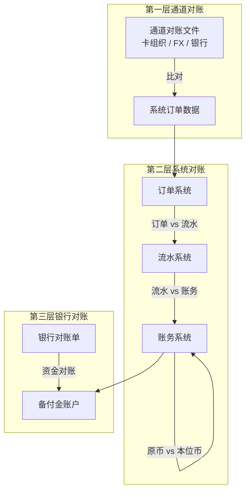
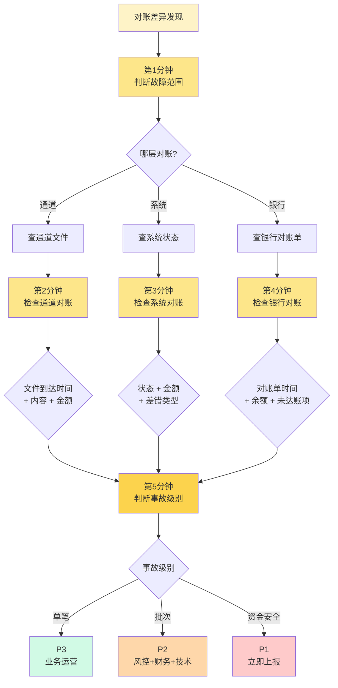

# 跨境对账三层体系（侧重收单）

> **系列第 9 篇 · 深度**
> 上一篇 [8_跨境账务体系四态模型](./8_跨境账务体系四态模型-深度.md) 讲了钱在系统里怎么记账。本篇讲**钱怎么对账**——**通道对账**（外部）/ **系统对账**（内部）/ **银行对账**（资金）三层对账体系，差错四类型（**长款 / 短款 / 汇差 / 状态不一致**）的处理方法，以及 5 分钟定位对账差异的 SOP。

---

## 一句话定义

> **跨境支付的对账体系，核心是「三层对账 + 四类差错 + 5 分钟定位 SOP」**。通道对账（外部文件） / 系统对账（内部状态） / 银行对账（资金）三层独立对账，发现差错四类型（长款 / 短款 / 汇差 / 状态不一致），按业内默认的 5 分钟定位 SOP（按账期 / 按通道 / 按状态）分级处理。

---

## 业务背景与价值

### 为什么「对账」是跨境支付的核心难题？

入门读者以为「对账」就是「检查数字对不对」。但跨境支付的对账是**3 套独立账本 × 4 类差错 × 5 分钟定位**的复杂工程：

**3 套独立账本：**

- **通道对账**（外部文件）—— 通道（卡组织 / FX Provider / 银行）发来的对账文件
- **系统对账**（内部状态）—— 跨境支付公司自己系统的订单 / 流水 / 账务状态
- **银行对账**（资金）—— 银行实际资金到账记录

**4 类差错：**

- **长款**——通道 / 银行比我系统多
- **短款**——通道 / 银行比我系统少
- **汇差**——币种转换时点不同导致金额差异
- **状态不一致**——双方状态不一致（我以为已结，对方说在途）

**专家视角：** 对账的真实价值不是「发现差错」，是**「提前发现差错 + 5 分钟定位 + 自动调账」**。业内默认：**对账系统必须支持自动差错发现 + 半自动调账**，不能完全依赖人工

### 过去 5 年的对账体系演变（跨周期视角）

| 时间段 | 趋势 | 关键事件 |
|---|---|---|
| 2015-2018 | **人工对账期** | 跨境支付公司普遍用 Excel 人工对账，每周对一次 |
| 2019-2021 | **T+1 自动对账期** | 头部公司推自动对账系统，T+1 自动跑批 |
| 2022-2024 | **实时对账 + 智能差错期** | AI 智能差错识别 + 自动调账，差错发现从天级到小时级 |
| 2025-至今 | **对账即服务期** | SaaS 化对账（Windcave / Reassurey）下沉到中小支付公司 |

**关键洞察：** 5 年前对账是「**事后手工**」的工作，现在变成「**实时智能**」的能力。**未来对账系统必须实时**——T+1 对账会被监管要求 T+0

### 监管意图：为什么必须 T+1 对账？

监管对对账体系有「底线要求」：

1. **差错必须 T+1 发现**——超过 T+1 没发现 = 监管违规
2. **差错必须 T+3 处理**——超过 T+3 处理 = 监管警告
3. **差错必须独立核算**——差错金额独立挂账，不能挪用
4. **差错必须可追溯**——任何差错能在 5 分钟内定位到原始交易

**专家视角：** T+1 对账不是「**最佳实践**」，是**监管硬性要求**。对账延迟一天 = 监管风险上升。对账延迟一周 = 合规事故

---

## 业务术语表

| 中文 | 英文 | 一句话解释 |
|---|---|---|
| 通道对账 | Channel Reconciliation | 通道（卡组织 / FX Provider）发来的对账文件 vs 系统 |
| 系统对账 | Internal Reconciliation | 跨境支付公司系统内部各模块对账（订单 vs 流水 vs 账务） |
| 银行对账 | Bank Reconciliation | 银行实际资金到账记录 vs 系统 |
| 长款 | Long Amount | 通道 / 银行比我系统多（多收钱或多入账） |
| 短款 | Short Amount | 通道 / 银行比我系统少（少收钱或少入账） |
| 汇差 | FX Difference | 币种转换时点不同导致金额差异 |
| 状态不一致 | Status Mismatch | 双方状态不一致（我以为已结，对方说在途） |
| 在途差错 | Pending Variance | 差错处于「处理中」状态（已发现但未调账） |
| 调账 | Adjustment | 对差错进行账务调整（补记或冲销） |
| 自动调账 | Auto Adjustment | 系统自动处理差错（无需人工） |
| 人工调账 | Manual Adjustment | 财务人员手动处理差错（需审批） |
| 对账文件 | Reconciliation File | 通道 / 银行发来的对账数据（CSV / XML / JSON） |
| 对账期 | Reconciliation Period | 对账的账期（通常 T+1 跑批） |

---

## 业务形态与模式：三层对账体系详解

### 第 1 层：通道对账（Channel Reconciliation）

**是什么：** 通道（卡组织 / FX Provider）发来的对账文件 vs 跨境支付公司系统

**机制：**
- 通道生成对账文件（Visa BASE II / Mastercard IPM / UnionPay 等）
- 文件格式：CSV / XML / JSON
- 文件内容：交易 ID、金额、币种、清算日、状态等
- 系统下载文件 + 解析 + 与系统订单匹配

**业内默认时间窗口：**

| 时间 | 状态 | 操作 |
|---|---|---|
| T+1 00:00 ~ 06:00 | 文件生成中 | 等待 |
| T+1 06:00 ~ 12:00 | 文件陆续到达 | 跑批 + 异常监控 |
| T+1 12:00 ~ 18:00 | 跑批基本完成 | 查对账结果 |
| T+1 18:00 ~ T+2 06:00 | 跑批完成 | 全量查询、差错处理 |

**对账差错类型：**
- **长款**——通道比我系统多（卡组织清算多了）
- **短款**——通道比我系统少（卡组织清算少了）
- **状态不一致**——我以为「已结」/ 卡组织说「在途」

### 第 2 层：系统对账（Internal Reconciliation）

**是什么：** 跨境支付公司系统内部各模块对账（订单 vs 流水 vs 账务）

**机制：**
- 订单系统（订单状态）vs 流水系统（支付流水）
- 流水系统（支付流水）vs 账务系统（账务记录）
- 账务系统（本位币账本）vs 账务系统（原币账本）

**对账维度：**
- **状态一致性**——订单状态 = 流水状态 = 账务状态
- **金额一致性**——订单金额 = 流水金额 = 账务金额
- **时间一致性**——订单时间 ≤ 流水时间 ≤ 账务时间

**业内默认：**
- T+1 早上自动跑批
- 差错按类型自动告警
- 财务人员 T+1 上午处理

### 第 3 层：银行对账（Bank Reconciliation）

**是什么：** 银行实际资金到账记录 vs 系统

**机制：**
- 银行提供对账单（每月 / 每日）
- 跨境支付公司下载对账单 + 解析
- 与系统备付金账户余额对账

**对账差错类型：**
- **长款**——银行余额 > 系统余额（银行多了）
- **短款**——银行余额 < 系统余额（系统多了）
- **未达账项**——银行已收但系统未收（待处理）

**业内默认：**
- 日终对账（T+1 早上）
- 月末对账（每月 1 号）
- 季度审计（每季度）

**专家视角：** 三层对账的**核心是独立性**——每层独立对账、独立差错处理、独立监控。任何一层失败都会被监管审计质疑

---

## 业务流程图：三层对账的层级关系

**关键观察：**
- 第一层（通道）和第二层（系统）通过**订单**串联
- 第二层（系统）和第三层（银行）通过**备付金**串联
- 三层对账**独立运行 + 串联联动**

---

## 差错四类型详解

### 类型 1：长款（Long Amount）

**定义：** 通道 / 银行比我系统多（多收钱或多入账）

**常见原因：**
- 通道端有退款 / 撤销但我系统未处理
- 通道端有拒付但我系统未处理
- 银行端有手续费但我系统未记账
- 系统端漏单

**处理：**
- 自动调账：长款挂账到「应付款项」+ 自动退款给商户
- 人工调账：财务人员核实后调账

**业内默认：** 长款必须 T+3 内调账完成

### 类型 2：短款（Short Amount）

**定义：** 通道 / 银行比我系统少（少收钱或少入账）

**常见原因：**
- 系统端有订单但通道端未清算
- 通道端有拒付但我系统未处理
- 银行端漏单
- 汇率转换差异

**处理：**
- 自动调账：短款挂账到「应收款项」+ 追查原因
- 人工调账：联系通道 / 银行查询

**业内默认：** 短款必须 T+3 内调账完成（追查 + 调账）

### 类型 3：汇差（FX Difference）

**定义：** 币种转换时点不同导致金额差异

**常见原因：**
- 授权日 vs 清算日 vs 结算日汇率不同
- 系统汇率与通道汇率不同
- 锁汇服务未生效
- 多币种钱包汇率更新延迟

**处理：**
- 自动调账：按交易日锁定汇率
- 人工调账：财务人员按规则调汇

**业内默认：** 汇差超过阈值（如 USD 1.0）必须调账

### 类型 4：状态不一致（Status Mismatch）

**定义：** 双方状态不一致（我以为已结，对方说在途）

**常见原因：**
- 系统状态机有 bug
- 通道状态机有延迟
- 跨系统同步问题
- 拒付 / 退款状态变更

**处理：**
- 自动调账：按通道最新状态更新
- 人工调账：核对状态机

**业内默认：** 状态不一致必须 T+1 内处理

**专家视角：** 差错四类型的**真实成本排序**：**长款 > 短款 > 状态不一致 > 汇差**。**长款**是商户多收钱（必须退）；**短款**是公司多出钱（必须追）；**状态不一致**是系统问题（必须修）；**汇差**是汇率问题（必须调）

---

## 核心功能用例

### 用例 1：标准通道对账

**场景：** T+1 早上，Visa 发来清算文件，跨境支付公司跑批对账

**流程：**
- 06:00：Visa 清算文件到达
- 06:30：系统开始解析
- 08:00：系统完成跑批
- 09:00：财务人员查对账结果
- 12:00：发现 3 笔短款（USD 50 + USD 30 + USD 20）
- 15:00：联系 Visa 查询
- T+2：Visa 确认 3 笔清算漏单，补清算
- T+3：系统自动调账

### 用例 2：银行对账差错

**场景：** 月末对账，银行对账单 vs 系统备付金余额不一致

**流程：**
- 月末日 23:00：银行生成对账单
- 月末日 23:30：系统下载 + 解析
- 次日 01:00：系统完成对账
- 01:30：发现银行余额 > 系统余额 USD 1000
- 02:00：财务人员核实
- 03:00：发现是 1 笔退款未记账
- 04:00：人工调账 + 系统修复

### 用例 3：状态不一致

**场景：** 100 笔交易，系统显示「已结」，但通道显示「在途」

**流程：**
- 09:00：对账系统发现状态不一致 100 笔
- 09:30：自动告警
- 10:00：技术团队检查
- 11:00：发现是通道状态机延迟
- 12:00：等通道更新（一般 24 小时内）
- T+2：状态自动对齐

---

## 业务打法与策略：不同公司的对账体系选择

### 头部公司（年 GMV > 100 亿美元）

**典型做法：**
- **三层对账自动化**（通道 / 系统 / 银行 全部自动跑批）
- **AI 智能差错识别**（自动分类差错类型 + 自动调账）
- **实时对账**（T+0 实时跑批）
- **独立审计接口**（监管可查）

**业内认知：** 头部公司的对账系统是**实时 + 智能 + 自动化**的，能在小时级完成三层对账。**这是 10+ 年技术积累的产物**

### 中型公司（年 GMV 1-100 亿美元）

**典型做法：**
- **T+1 自动对账**（隔天跑批）
- **半自动差错处理**（自动告警 + 人工调账）
- **通道对账自动化**（系统对账 + 银行对账手工）

**业内认知：** 中型公司的对账系统是「**够用但不完美**」——能 T+1 跑批但不能实时。**合规风险中等**

### 小公司 / 新进入者（年 GMV < 1 亿美元）

**典型做法：**
- **手工对账**（Excel + 财务人员）—— **违规**
- **周对账**（每周对一次）—— **违规**
- **差错靠事后发现**（商户投诉才查）—— **违规**

**业内认知：** 小公司的对账系统**几乎都不合规**——手工对账 + 周对账是违规的。**长期会被监管处罚**

---

## Trade-off 分析

### 决策 1：手工对账 vs 自动对账 vs 智能对账

| 选项 | 优势 | 代价 | 适合谁 |
|---|---|---|---|
| **手工对账** | 简单 | **违规**、人工成本高 | ❌ 不推荐 |
| **自动对账** | T+1 跑批、合规 | 系统开发成本 6+ 月 | 中型公司 |
| **智能对账** | 实时 + AI 识别、自动调账 | 系统开发成本 18+ 月 | 头部公司 |

**专家视角：** 手工对账是**违规**，自动对账是**合规底线**，智能对账是**头部公司标配**。**业内默认：** 所有持牌跨境支付公司必须至少有「自动对账」

### 决策 2：对账频率：T+0 vs T+1 vs T+3

| 选项 | 优势 | 代价 | 适合谁 |
|---|---|---|---|
| **T+0 实时** | 风险最低、监管最满意 | 系统压力大、合规要求高 | 头部公司 |
| **T+1** | 行业标准、合规 | 需要每天跑批 | 大部分公司 |
| **T+3** | 系统压力小 | **违规**（超过 T+3 = 监管警告）| ❌ 不推荐 |

**专家视角：** T+1 是**行业最低标准**，T+0 是头部标配，T+3 是违规线。**业内默认：** 头部公司必须 T+0，中型公司必须 T+1

### 决策 3：差错处理：自动 vs 半自动 vs 手工

| 选项 | 优势 | 代价 | 适合谁 |
|---|---|---|---|
| **自动调账** | 实时、低成本 | 系统复杂 | 头部公司 |
| **半自动**（自动告警 + 人工调账） | 平衡 | 人工成本 | 中型公司 |
| **手工调账** | 简单 | 慢、易错 | ❌ 不推荐 |

**专家视角：** 自动调账是**未来趋势**，但需要 3-5 年技术积累。**业内默认：** 中型公司至少有「半自动调账」

---

## 行业洞察 / 业内认知

### 不成文标准：对账的「默契」时间窗口

公开规则：卡组织清算文件 T+1 生成，对账系统 T+1 处理。

**业内实际做法（业内默认时间窗口）：**

| 时间 | 对账状态 | 业内操作 |
|---|---|---|
| **T+1 00:00 ~ 06:00** | 清算文件生成中，**不要查对账** | 系统维护、文件下载等待 |
| **T+1 06:00 ~ 12:00** | 清算文件陆续到达，**开始跑批但不全** | 跑批 + 异常监控 |
| **T+1 12:00 ~ 18:00** | 跑批基本完成，**开始查但有在途** | 查通道对账结果 |
| **T+1 18:00 ~ T+2 06:00** | 跑批完成，**真正稳的对账** | 全量查询、差错处理 |
| **T+2 06:00 之后** | T+1 对账关闭 | 切换到 T+2 跑批流程 |

**专家视角：** 对账系统必须支持「分时段跑批」+「差错分状态」（在途差错 / 真差错），不能简单地「T+0 跑完就对」

### 真实事故：对账延迟引发监管问询

公开报道：2024 年某头部跨境支付公司因对账系统延迟 T+2（实际 T+3 才完成），导致部分商户资金 T+5 才到账，部分商户资金悬空被监管约谈，最终被罚款 + 暂停新增商户 3 个月。

**业内流传的处理方式：** 头部公司后来强制对账系统必须 T+1 早上 6 点前完成，且必须有降级方案（实时对账失败也要 T+1 早上 6 点前跑批）。

**教训：** 对账延迟的「真实成本」不是商户投诉，是**监管风险**。对账系统必须按 T+1 早上 6 点后查、T+2 上午稳态查，错过这个窗口 = 监管事故

### 从业者挑战：5 分钟定位 SOP

跨境支付公司常见的内部挑战：对账差异**5 分钟内定位不到**。业内默认的 5 分钟定位 SOP：

**第 1 分钟：判断故障范围**
- 通道对账差错？→ 查通道文件
- 系统对账差错？→ 查系统状态
- 银行对账差错？→ 查银行对账单

**第 2 分钟：检查通道对账文件**
- 通道对账文件到达时间是否在 6 点前？
- 文件内容是否完整？
- 文件金额是否一致？

**第 3 分钟：检查系统对账**
- 订单状态 vs 流水状态？
- 流水金额 vs 账务金额？
- 差错类型是什么（长款 / 短款 / 汇差 / 状态不一致）？

**第 4 分钟：检查银行对账**
- 银行对账单到达时间？
- 银行余额 vs 系统余额？
- 未达账项是什么？

**第 5 分钟：判断事故级别 + 上报**
- 单笔差错：P3 - 业务运营处理
- 批次差错：P2 - 风控 + 财务 + 技术联合处理
- 资金安全风险：P1 - 立即上报 + 启动应急响应

**专家视角：** 对账差异 5 分钟内定位是**业内最低标准**。5 分钟内定位 + 1 小时内处理完 = P3 事故；超过 30 分钟才定位 = P2 事故；超过 2 小时 = P1 事故（可能触发监管问询）

### 5 分钟定位 SOP 流程图

---

## 业务前景与趋势

### 未来 3-5 年的 4 个结构性变化

**1. 实时对账成为标配**
传统 T+1 对账会被 T+0 实时对账替代——监管要求 + 商户需求。**对参与方格局的启示：** 实时对账能力会成为头部支付公司的护城河

**2. AI 智能差错识别**
传统人工差错识别会被 AI 智能识别替代——按差错类型 + 历史模式自动分类、自动调账。**对参与方格局的启示：** AI 风控能力成为头部支付公司的护城河

**3. 对账即服务（DaaS）**
SaaS 化对账（Windcave / Reassurey 等）下沉到中小支付公司——按交易量付费。**对参与方格局的启示：** 中型公司可以不自建对账系统

**4. 跨通道统一对账**
跨境支付涉及多通道，未来会推「跨通道统一对账」——按统一标准对账（避免格式差异）。**对参与方格局的启示：** 跨通道对账能力成为头部支付公司的护城河

---

## 一句话总结

> **跨境支付的对账体系，核心是「三层对账 + 四类差错 + 5 分钟定位 SOP」**。通道对账（外部文件） / 系统对账（内部状态） / 银行对账（资金）三层独立对账，发现差错四类型（长款 / 短款 / 汇差 / 状态不一致），按业内默认的 5 分钟定位 SOP（按账期 / 按通道 / 按状态）分级处理。T+1 对账是行业最低标准，T+0 实时对账是头部标配。

---

## 📌 数据与事实声明

本文涉及的三层对账体系、差错四类型、对账默契时间窗口等内容是跨境支付行业的通用认知，但具体到：

- 各卡组织清算文件格式（Visa BASE II / Mastercard IPM / UnionPay 等）以各卡组织最新文档为准
- 监管对对账频率的具体要求（T+1 最低 / T+0 头部）以最新监管文件为准
- 各家支付公司的对账系统选型（自建 / SaaS）以各公司实际架构为准
- 5 分钟定位 SOP 的具体阈值（30 分钟 = P2 / 2 小时 = P1）以各公司实际分级为准

不要直接引用本文作为合规依据或对账系统设计依据。

---

## 下一篇预告

下一篇 [10_清结算系统架构与模块边界-全景](./10_清结算系统架构与模块边界-全景.md) 将进入**第四层 · 架构与系统**——讲清**清结算系统怎么从 0 到 1 落地**——五大模块（交易核心 / 清分引擎 / 结算引擎 / 对账引擎 / 账务系统）的边界、数据流、上下游依赖，以及从单体到微服务的演进路径。