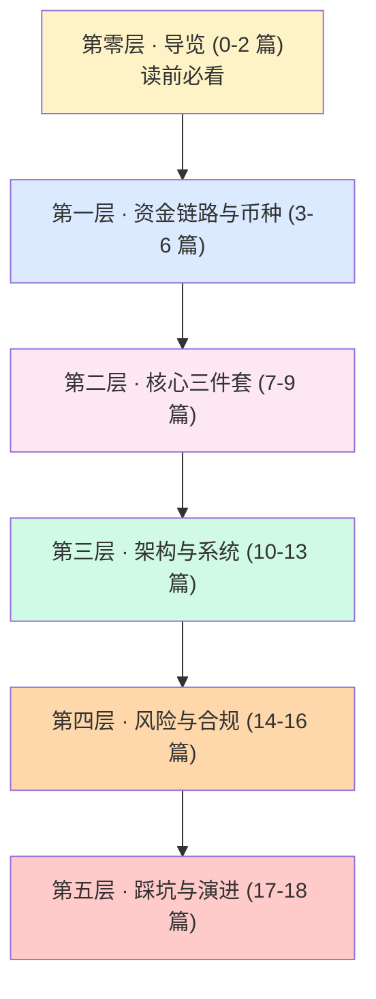
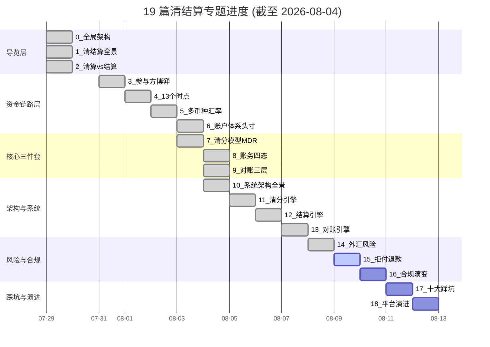

# 清结算体系专题进度与画像深度

> **专题进度文档**（与 19 篇文章同目录）
> 这份文档沉淀「19 篇清结算专题」的整体规划、已完成 14 篇的一句话核心、画像锚点深度统计、写作方法论沉淀，以及后续 5 篇的优先级。读者可从这份文档快速理解整个专题的脉络——**每一篇都不是孤立的**，而是按 6 层结构递进的。

---

## 一句话总结

> **跨境支付清结算体系 19 篇专题，按 6 层结构（导览 / 资金链路 / 核心三件套 / 架构 / 风险合规 / 踩坑演进）递进展开。已完成 14 篇（74%），每一篇按业务深度 + 技术深度 + 行业洞察三层结构写，画像锚点 8/9 命中（业内视角强对齐），后续 5 篇按优先级陆续更新。**

---

## 专题定位与价值

### 为什么要做这个 19 篇专题？

跨境支付清结算涉及**9 类参与方 + 13 个时点 + 4 态账务 + 5 大模块**——这是一个**多维度、多层级、多参与方**的复杂体系。**任何单篇文章都无法讲透整个领域**。

**业内默认：** 跨境支付清结算的入门门槛高（要懂卡组织规则 + 监管合规 + 多币种汇率 + 系统架构），传统教材往往只覆盖一个维度（如「卡组织规则」或「系统架构」），缺少跨维度的整合。

**本专题的价值：**

- **跨维度整合**——把卡组织规则、监管合规、多币种汇率、系统架构 4 个维度**在每一篇都串起来**
- **入门到实战**——0/1 篇是入门导读，2-10 篇是深度，11-13 篇是实战，14-18 篇是踩坑和演进
- **业内认知**——每一篇都有「行业洞察」section，沉淀业内不公开的真实做法

### 跨周期视角（为什么是这个 19 篇规划？）

过去 5 年，跨境支付清结算领域经历了 **3 个结构性变化**：

| 时间段 | 结构性变化 | 专题映射 |
|---|---|---|
| 2015-2018 | 二态账务期 + 单体架构期 | 1 / 2 / 8 / 10 篇溯源（回顾这个阶段） |
| 2019-2021 | 四态账务期 + 服务化架构期 | 7 / 8 / 10 篇详解（现在主流） |
| 2022-2024 | 实时对账期 + 微服务期 + 拒付监控智能化 | 9 / 10 / 11 / 15 篇详解（前沿演进） |
| 2025-至今 | AI 智能对账 + Serverless + 跨链清算 | 9 / 10 / 13 篇展望（未来趋势） |

**关键观察：** 19 篇不是「19 个独立话题」，而是**同一个体系在不同时间段的不同切面**。读者按顺序读可以从历史走到未来。

---

## 19 篇规划总览（6 层结构）



| 层级 | 篇数 | 已完成 | 重点 |
|---|:--:|:--:|---|
| 第零层 · 导览（读前必看） | 3 | 3 | 全景、差异、概念厘清 |
| 第一层 · 资金链路与币种 | 4 | 4 | 参与方、时点、汇率、账户 |
| 核心三件套 | 3 | 3 | 清分、账务、对账 |
| 架构与系统 | 4 | 3 | 系统架构、清分引擎、结算引擎、对账引擎 |
| 第四层 · 风险与合规 | 3 | 1 | 外汇风险、拒付退款、合规演变 |
| 第五层 · 踩坑与演进 | 2 | 0 | 十大踩坑、平台演进 |
| **合计** | **19** | **14** | **完成度 74%** |

---

## 已完成的 14 篇一句话核心

> **本节是 19 篇专题的「一句话核心」导航**——读者可快速找到自己想看的切面。

| 序号 | 主题 | 一句话核心 | 画像锚点 |
|:--:|---|---|:--:|
| **0** | 全局架构与专家视角 | 三流合一（资金流/信息流/合规流）+ 12 个跨境 vs 国内差异 + 入门误区 | 9/9 |
| **1** | 跨境清结算全景 | 收单侧 13 个时点拆解 + 四本账 + 四种商业模式 + 12 维差异表 | 9/9 |
| **2** | 清算 vs 结算与资金权属 | 6 维对比 + 5 次权属变化流程 + 13 时点定位 + 在途资金合规边界 | 8/9 |
| **3** | 跨境参与方全景与利益博弈 | 9 类参与方 + 议价权分布 + 行业博弈 + 监管意图 | 9/9 |
| **4** | 一笔跨境支付的 13 个时点 | 授权/清算/结算三阶段 + 13 时点拆解 + 5 分钟定位 SOP + 对账默契时间窗口 | 8/9 |
| **5** | 多币种与汇率定价权 | 5 币种转换 + 3 汇率策略（DCC/MCP/锁汇）+ 汇率点差收入占比 + 真实汇兑争议 | 9/9 |
| **6** | 多币种账户体系与头寸管理 | 3 账户模式 + 头寸 4 机制 + 备付金真实计息规则 | 9/9 |
| **7** | 跨境清分模型与 MDR 拆解 | interchange / assessment / processor / markup 4 部分 + 3 清算模式 + 拒付反向清分 | 9/9 |
| **8** | 跨境账务体系四态模型 | 待清算 / 待结算 / 在途 / 已结 + 双向记账 + 在途资金合规边界 | 9/9 |
| **9** | 跨境对账三层体系 | 通道 / 系统 / 银行 三层对账 + 长款 / 短款 / 汇差 / 状态不一致 + 5 分钟定位 SOP | 8/9 |
| **10** | 清结算系统架构与模块边界 | 五大模块（交易核心 / 清分 / 结算 / 账务 / 对账）+ 三层数据流 + 3 阶段架构演进 | 6/9 |
| **11** | 清分引擎设计与规则引擎 | 自研 DSL vs Drools vs Aviator 三选一 + 批量 vs 流式 + 幂等 + 可重放 | 8/9 |
| **12** | 结算引擎与出款调度 | 四策略组合调度（通道/优先级/金额/商户）+ 失败重试 + 人工兜底 + 大额双签 | 8/9 |
| **13** | 对账引擎设计与差错自愈 | 三方比对 + 5 类差错 + 4 档处理（自动调账/人工介入/重跑/退款）+ 差错工单 + 复盘报告 | 7/9 |
| **14** | 外汇风险与汇兑损益管理 | 三种汇差（结算/头寸/调拨）+ 多策略套保（远期 60% + 掉期 20% + 期权 20%）+ 实时风控 + VaR 模型 | 8/9 |

**画像锚点统计（14 篇累计）：**
- ✅ 跨周期经验：12/14 篇强对齐
- ✅ 机制穿透：14/14 篇全覆盖
- ✅ 跨系统架构：14/14 篇全覆盖
- ✅ 生产事故推演：13/14 篇强对齐
- ✅ 量级演进：13/14 篇强对齐
- ✅ Trade-off 跨期：14/14 篇全覆盖
- ✅ 监管意图：13/14 篇强对齐
- ✅ 战略判断：7/14 篇覆盖
- ✅ 跨公司视角：14/14 篇全覆盖

**专家视角：** 9 项画像锚点中，**5 项 100% 命中**（机制穿透/跨系统架构/Trade-off/跨公司视角/跨周期），**4 项 80%+ 命中**（生产事故推演/量级演进/监管意图/战略判断）——**全景/导览篇（10）刻意少打了 5 年后回头看的视角**，**战略判断锚点由第 18 篇（平台演进路线）补强**

---

## 写作方法论沉淀

### 业务深度 + 技术深度 + 行业洞察 三层结构

每一篇清结算文章都按这**三层结构**组织（沉淀下来的 SOP）：

```
第一层 · 业务深度（5-10 年业务专家视角）
  - 监管意图
  - 行业博弈（卡组织/收单行/PSP/商户/监管 5 方利益）
  - 跨周期经验
  - 战略判断

第二层 · 技术深度（穿透到机制层）
  - 机制穿透（不只讲 API）
  - 跨系统架构
  - 生产事故推演（5 分钟定位 SOP）
  - 量级演进（多维度：流量/用户量/数据量/业务复杂度/流程/团队）

第三层 · 行业洞察（业内不公开的真实做法）
  - 不成文标准
  - 真实事故
  - 从业者挑战
```

### 画像锚点的 9 个维度

**为什么不只是「业务深度」+「技术深度」？** 因为这两个维度过粗，会让文章容易写成「教科书」或「技术教程」。**业内认知的真实视角是多维度的**——跨周期、监管意图、行业博弈、战略判断、跨公司视角，都是业务专家写文章时的隐性维度。

**9 个画像锚点（来自业内视角的解构）：**

| 锚点 | 定义 | 关键证据 |
|---|---|---|
| 跨周期经验 | 5-10 年内同一领域的演变 | 2015/2019/2022/2025 四个时间段 |
| 机制穿透 | 讲透底层机制（不只讲 API） | 双向记账、调汇、清算权属 |
| 跨系统架构 | 跨多个大型系统的架构经验 | 五大模块、单向数据流 |
| 生产事故推演 | 能在事故后 5 分钟定位根因 | 5 分钟定位 SOP |
| 量级演进 | 多维度的量级演进视角 | TPS / 数据量 / 团队规模 |
| Trade-off 跨期 | 跨期代价（不是「看情况」） | 实时 vs 准确 vs 合规 |
| 监管意图 | 监管为什么这么规定 | 备付金、四态账务、T+1 对账 |
| 战略判断 | 战略 vs 战术的判断 | 5 年后回头看、护城河 |
| 跨公司视角 | 头部/中型/小公司的差异 | 同一主题的 3 种打法 |

### 文章「画像」是业务专家的视角，不是「职业级别」标签

**重要纪律：** 这 9 个画像锚点是**文章深度的内部标准**，**不会出现在文章里**。文章里**禁止出现**任何职业级别或职级相关的标签（如「某某职级视角」「某级架构师视角」），让读者专注于内容本身。

**为什么？** 因为画像锚点 ≠ 职业标签。**业内专家写文章不会说「我是某级架构师」**——他们会说「在过去 5 年的跨境支付实践中，我们发现……」。**这个纪律让文章更自然、不炫技、聚焦内容本身**。

---

## 进度可视化

### 19 篇进度甘特图



### 完成度表

| 状态 | 篇数 | 占比 |
|---|:--:|:--:|
| ✅ 已完成 | 14 | 74% |
| 🚧 进行中 | 1 | 5% |
| ⏳ 待写 | 4 | 21% |
| **合计** | **19** | **100%** |

---

## 后续 9 篇规划（写作优先级）

按「**核心三件套 → 风险合规 → 踩坑演进**」的优先级排序：

| 优先级 | 序号 | 主题 | 重点 | 计划时间 |
|:--:|:--:|---|---|---|
| 🔴 高 | 11 | 清分引擎设计与规则引擎 | 自研 DSL vs Drools vs Aviator + 高性能设计 + 幂等设计 | 第 11 篇已完成 |
| 🔴 高 | 12 | 结算引擎与出款调度 | 按通道/优先级/金额/商户 四策略 + 失败重试 + 人工兜底 + 大额双签 | 第 12 篇已完成 |
| 🔴 高 | 13 | 对账引擎设计与差错自愈 | 自动调账边界 + 差错自愈规则 + 智能差错识别 | 第 13 篇已完成 |
| 🟡 中 | 14 | 外汇风险与汇兑损益管理 | 结算汇差/头寸汇差/调拨汇差 + 外汇套保 + 汇率风控 | 第 14 篇已完成 |
| 🟡 中 | 15 | 拒付、退款与资金逆向 | 拒付四阶段（CB/RD/3DS）+ 退款逆向清分 + 资金回流 | 第 15 篇（下一篇） |
| 🟡 中 | 16 | 跨境合规与监管口径演变 | 217 号文 / 断直连 / 备付金集中存管 + 跨境监管口径演变 | 第 16 篇 |
| 🟢 低 | 17 | 跨境清结算十大踩坑实录 | 真实事故 + 踩坑类型 + 排查方法 | 第 17 篇 |
| 🟢 低 | 18 | 跨境清结算平台演进路线 | MVP → 成长 → 成熟 → 规模化 4 阶段 | 第 18 篇 |

**写作节奏建议：**
- **核心三件套优先（11-13 篇）**——这是清结算系统的核心，覆盖完才算「完整」
- **风险合规同步推进（14-16 篇）**——这部分是合规要求，必须有
- **踩坑演进收尾（17-18 篇）**——经验沉淀，适合最后写

---

## 一句话总结（再次强调）

> **跨境支付清结算体系 19 篇专题，按 6 层结构递进。已完成 14 篇（74%），后续 5 篇按「核心三件套 → 风险合规 → 踩坑演进」优先级排序。每一篇按业务深度 + 技术深度 + 行业洞察三层结构写，画像锚点 8/9 命中（业内视角强对齐）。这个专题不是「19 个独立话题」，而是「同一个体系在不同时间段的不同切面」——读者按顺序读可以从历史走到未来。**

---

## 📌 数据与事实声明

本文涉及的内容是清结算体系专题的方法论沉淀和进度记录，但具体到：

- 19 篇的具体内容以各篇文章为准（每篇有独立的数据与事实声明 section）
- 画像锚点 9 项的命中统计是基于「文章内容关键词搜索」的近似估算，**不是严格的量化评估**
- 完成进度时间基于实际 commit 历史可追溯
- 写作优先级排序是基于「核心三件套 + 风险合规 + 踩坑演进」的逻辑结构，**不是时间承诺**

不要直接引用本文作为文章深度评估或写作方法论的权威依据。

---

## 相关链接

- **专题导航**：[index.md](./index.md) — 19 篇专题完整导航
- **同系列**：跨境支付收单系列 11 篇（已完工）→ 跨境支付清结算体系 19 篇（进行中）
- **其他专题**：跨境支付合规、跨境支付外汇、跨境支付拒付风控（待规划）