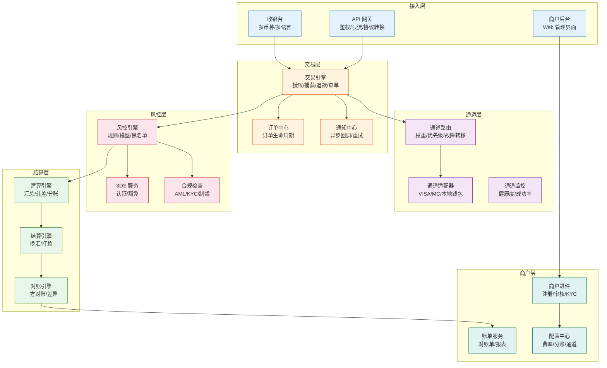
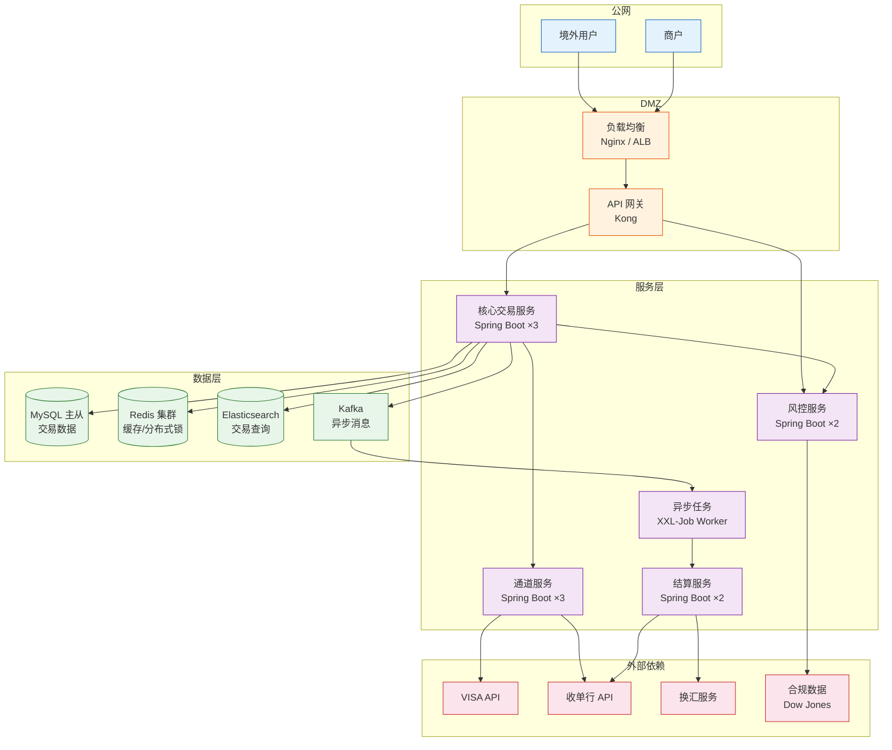

# 收单系统架构：从功能模块到部署拓扑

> **一句话定义**：收单系统不是一块巨石。它至少分 6 层——接入层、交易层、通道层、风控层、结算层、商户层。每一层独立演进、独立故障隔离。

---

## 1. 功能架构：6 层模型

---

## 2. 每层职责

### 接入层

| 组件 | 职责 | 技术选型 |
|---|---|---|
| API 网关 | 统一入口，鉴权、限流、协议转换 | Kong / Nginx + Lua / 自研 |
| 收银台 | 多币种展示、卡号输入、3DS 跳转 | 前端 SDK（JS/iOS/Android） |
| 商户后台 | Web 管理：交易查询、对账、配置 | React/Vue + 后端 BFF |

### 交易层

| 组件 | 职责 | 关键设计 |
|---|---|---|
| 交易引擎 | 授权/捕获/退款/查单的核心逻辑 | 状态机驱动、幂等设计 |
| 订单中心 | 订单全生命周期管理 | 事件溯源（Event Sourcing） |
| 通知中心 | 异步回调商户、失败重试 | 指数退避、死信队列 |

### 通道层

| 组件 | 职责 | 关键设计 |
|---|---|---|
| 通道路由 | 根据规则选最优通道 | 权重/优先级/故障转移/成本优先 |
| 通道适配器 | 对接不同卡组织/钱包的协议差异 | 适配器模式，一个通道一个 Adapter |
| 通道监控 | 实时监控通道健康度 | 成功率/耗时/错误码分布 |

### 风控层

| 组件 | 职责 | 关键设计 |
|---|---|---|
| 风控引擎 | 实时决策：拒绝/通过/3DS | 规则引擎 + 机器学习模型 |
| 3DS 服务 | 跳转发卡行认证页面 | 3DS v1（弹窗）→ v2（无感） |
| 合规检查 | AML/KYC/制裁名单 | 对接 Dow Jones / WorldCheck |

### 结算层

| 组件 | 职责 | 关键设计 |
|---|---|---|
| 清算引擎 | 汇总交易、轧差计算 | 批量任务、T+1 凌晨跑 |
| 结算引擎 | 换汇、打款指令生成 | 对接银行/换汇服务 |
| 对账引擎 | 三方对账（本方/卡组织/收单行） | 差异自动修复 + 人工工单 |

### 商户层

| 组件 | 职责 | 关键设计 |
|---|---|---|
| 商户进件 | 注册、资料审核、KYC | 工作流引擎 |
| 账单服务 | 生成对账单、交易报表 | 定时生成 + 实时查询 |
| 配置中心 | 费率、分账规则、通道配置 | 实时生效、灰度发布 |

---

## 3. 系统架构：部署拓扑

---

## 4. 技术架构决策

| 决策 | 推荐 | 原因 |
|---|---|---|
| 语言 | Java（Spring Boot） | 生态成熟、金融级稳定性 |
| 数据库 | MySQL 主从 + TiDB | MySQL 适合交易，TiDB 适合查询和分析 |
| 缓存 | Redis Cluster | 分布式锁 + 热点数据缓存 |
| 消息队列 | Kafka | 交易事件的异步处理和解耦 |
| 任务调度 | XXL-Job | 清算、对账等定时任务的分布式调度 |
| 服务通信 | gRPC（内部）+ REST（对外） | gRPC 高性能，REST 易对接 |
| 容器化 | Docker + K8s | 弹性伸缩、灰度发布 |
| 监控 | Prometheus + Grafana | 交易成功率、通道健康度、系统指标 |

---

## 5. 一句话总结

> **收单系统 6 层架构 = 接入层做门面、交易层做核心、通道层做适配、风控层做保镖、结算层做账房、商户层做服务。每层独立故障隔离，任何一层挂了不影响其他层。**
