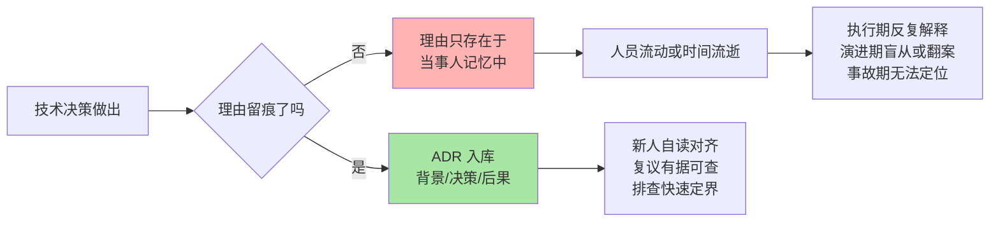
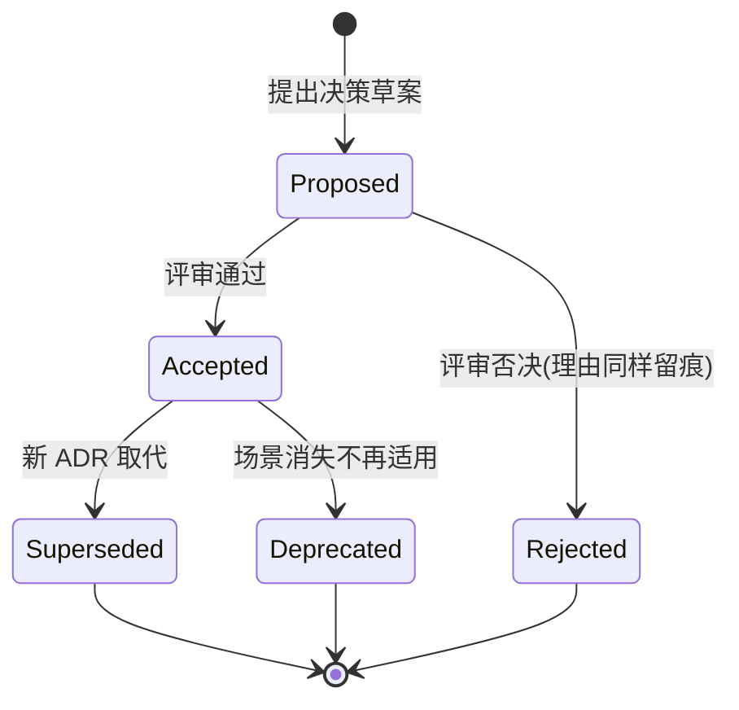

# 架构决策与 ADR 方法：让技术决策可追溯（入门）

> **一句话摘要**：ADR（Architecture Decision Record，架构决策记录）是用一页短文档把「当时为什么这么定」沉淀下来的方法——核心是 Nygard 三段式（背景/决策/后果），它解决的不是「做什么决定」，而是「半年后没人记得为什么这么定」。

> **本文核心**：技术决策的失效模式不是「定错了」，而是「定完就失忆」——决策依据留在某个人的脑子里，人一走或时间一长，团队只能二选一：盲从旧决定，或者盲目推翻重来。ADR 的组织主线是把决策从「口头共识」变成「可追溯资产」：背景（当时面临什么约束）→ 决策（选了什么、放弃了什么）→ 后果（带来什么好处、付出什么代价）。**机制链**：约束变化 → 决策依据过期 → 复议触发 → 新 ADR 取代旧 ADR（superseded），整条链有据可查，而不是靠回忆吵架。本篇是「架构师软实力」系列第一篇，讲的是技术负责人从「会做决定」到「会管理决定」的第一步。

## 一句话摘要

后端工程师都经历过这样的场景：接手一个系统，看到某处用了一个看起来「过时」的方案，第一反应是「这谁定的，为什么不用更现代的做法」——翻遍代码注释和 wiki 找不到答案，问老同事，得到的回答是「当时好像是因为某个问题才这么干的，具体记不清了」。这就是**决策失忆**：决定本身被 git 记住了，但决定的理由没有留下任何痕迹。ADR 的价值就在这里——它不改变你做什么决定，它只做一件事：**把决策的约束、选项、代价写下来，让未来的自己和相关方可以基于事实复议，而不是基于情绪翻案**。决策能力是技术负责人区别于纯执行角色的分水岭，而决策留痕能力，是决策能力里最容易被忽略、又最能在跨周期协作里兑现价值的一环。

## 5W 速记卡

| 维度 | 一句话 |
|---|---|
| What | 一页纸记录：背景/决策/后果的 Nygard 三段式决策档案 |
| Why | 决策失忆导致盲从或盲目翻案，留痕让复议有据可查 |
| Who | 决策的制定者、执行者、以及半年后接手的人 |
| When | 有取舍、有多个可行选项、后果影响面超出本周的决策 |
| How | 写 ADR → 编号入库 → 约束变化时按触发条件复议 → 新 ADR 标记取代旧的 |

## 一、为什么技术决策必须留痕：决策失忆的三种代价

不留痕的决策，会在三个时间点上反复收费：

**代价一：执行期——「为什么要这么做」的沟通成本反复发生。** 一个影响三个团队的决定，定完之后每个新加入的人都会问一遍为什么。没有 ADR，这个「为什么」靠口口相传，每传一手就衰减一分，传到第三手就变成「上面定的」。有 ADR，新人自己读十分钟就能对齐，这是留痕最直接的投资回报。

**代价二：演进期——该推翻的没人敢推翻，该坚持的没人守得住。** 没有记录，旧决策看起来就像「无理由的既成事实」：一种人选择盲从（「既然一直这样，肯定有原因」），另一种人选择全盘怀疑（「都什么年代了还这么干」）。两种反应都危险——**决策的价值取决于它背后的约束是否还在，而约束只在 ADR 的「背景」段里活着**。

**代价三：事故期——排查时无法区分「设计如此」和「实现走样」。** 出了线上问题，排查的第一步是确认「这是当初的设计决策，还是后来改坏了」。没有决策记录，这两者无法区分，复盘会退化成互相甩锅；有决策记录，五分钟就能定位到底是约束变了没跟上，还是执行环节出了偏差。

三种代价叠加起来，就是一个团队技术债里最贵的一种：**不是代码债，是认知债**——代码债还标在扫描报告里，认知债连欠条都没有。

## 二、ADR 的最小骨架：Nygard 三段式

ADR 有多个流派，入门只需掌握 Michael Nygard 在 2011 年提出的经典三段式——因为它最短、最不容易写歪，也是后续各种变体（MADR、Y-statements 等）的共同底座：

| 段落 | 回答的问题 | 反例（写了等于没写） | 正例 |
|---|---|---|---|
| 背景（Context） | 当时面对什么约束与压力？ | 「我们需要一个缓存」 | 「读流量是写流量的十倍以上，数据库高峰期 CPU 接近饱和，且读多写少允许分钟级不一致」（行业内常见画像，非实测数据） |
| 决策（Decision） | 选了什么、放弃了什么？ | 「决定引入缓存」 | 「引入读缓存承载读流量；放弃直接扩容数据库——成本曲线不划算，也放弃本地缓存——多实例间不一致的排查成本高」 |
| 后果（Consequences） | 得到什么、付出什么、欠下什么？ | 「系统性能提升了」 | 「读路径延迟下降一个量级（以压测为准）；代价是新增缓存与数据库一致性的维护责任，后续需建设失效机制与监控」 |

三段式的设计思想值得点破：**它强制决策者同时写下「为什么选」和「为什么不用别的」**。多数人写决策文档只写前者——但半年后引发争议的恰恰是后者。被放弃的选项（替代方案）就是这份记录里最值钱的部分：复议时你首先想知道的是「当时的另一个选项是不是其实更对」。

一条 ADR 的生命周期由状态机管理：

注意两个细节：一是 **Rejected 也要留档**——被否决的方案连同否决理由，是防止同一个坏方案半年后换个名字卷土重来的唯一手段；二是 **Superseded 而非 Deleted**——旧 ADR 永远不删除，只被新 ADR 指向取代，决策史保持完整可追溯。

## 三、不同量级团队的决策留痕：约束驱动解法

决策留痕的「度」对量级极其敏感，同一套做法在小团队是仪式感负担，在大组织是救命绳索。每一档的约束来源不同，思考方式也不同：

- **十万行代码以内的十人以下团队**：决策频率低、传播链路短。这一档的核心问题是让决策「可见」，而不是流程「完备」——约束来源是人人都互相知道对方在干什么，缺的只是把口头共识落成文字的习惯。思考方式是轻量驱动：一个 `docs/adr/` 目录加编号文件就够，不需要评审系统。为什么不用更重的流程？因为流程成本会立刻超过信息成本。
- **百万行代码、几十人协同的中型系统**：跨团队决策开始出现「二次解释」损耗。这一档的核心问题是让决策「可被发现」，而不是仅仅「被记录」——约束来源是决策者与受影响者不再坐在一起，一份没人搜得到的 ADR 等于没写。思考方式是检索驱动：统一目录、统一命名、在代码关键路径上挂 ADR 编号注释，让「为什么」可以被 grep 到。
- **千万行代码、亿级请求平台上的百人以上组织**：决策的影响面横跨多个业务线，一个决定可能在两年后的另一条产品线上被无意破坏。这一档的核心问题是决策的「跨周期存活」，而不是单次对齐——约束来源是组织记忆天然短于系统寿命。思考方式是治理驱动：ADR 纳入评审门禁、关键决策与监控告警挂钩（约束失效即告警），让决策从「文档」升级为「受管理的资产」。

**一句话的量级 Trade-off 意识**：十人团队一页纸就够，百人团队必须可检索，千人组织要把决策做成有门禁有告警的资产——跳档加流程是官僚，压档省流程是裸奔。

## 四、与会议纪要的区别辨析

最常见的误解是「我们已经开会都有纪要，还需要 ADR 吗」——两者记录的对象根本不同，这正是它们的核心区别：

| 维度 | 会议纪要 | ADR |
|---|---|---|
| 记录对象 | 过程（谁说了什么、讨论到哪） | 结论（定什么、为什么、代价是什么） |
| 生命周期 | 会后即过期 | 决策存续期内持续有效 |
| 检索方式 | 按时间/按会议 | 按主题/按系统模块 |
| 读者 | 参会者及补会议的人 | 所有受这个决策影响的人 |

会议纪要是**流式的过程资产**，ADR 是**结构化的结论资产**。一个实用的协作方式是：会议纪要里产生的技术共识，最终沉淀为一条 ADR——纪要负责「讨论过程可回溯」，ADR 负责「决策本身可执行、可复议」。只有纪要没有 ADR 的团队，会出现「记得当时吵了很久，但没人记得最后为什么这么定」的怪象；只有 ADR 没有纪要的团队，争论细节丢失反而无害——因为 ADR 保留了结论所需的全部依据。

同理，ADR 与「技术方案文档」的区别在于：方案文档回答「接下来怎么做」（面向未来与执行），ADR 回答「当时为什么定这个方向」（面向历史与复议）。大型方案文档里通常会内嵌一节「备选方案对比」，这一节独立抽出来就是一条现成的 ADR。

## 五、决策复议的触发条件：什么时候该重新讨论一个「定过的」决策

留痕的终极目的不是「把决定钉死」，而是**让推翻决定这件事变得便宜且体面**。没有触发条件的团队，复议全凭嗓门和资历；有明确触发条件的团队，复议是一个工程流程。四个经过实践验证的触发条件：

1. **约束消失或新增**——这是最硬的触发器。ADR 背景段里写明的关键约束（例如「流量峰谷差在十倍以内」）不再成立，决策就自动进入待复议状态。这也是为什么背景段必须写具体约束而不是写感想：**背景段写得越可验证，复议时机就越机器可判**。
2. **代价超过收益的拐点出现**——后果段里记录的「接受中的代价」开始指数化增长（例如缓存一致性维护成本从边缘问题变成主要故障源），说明决策的生命周期到了。
3. **替代方案的能力发生跃迁**——当时被放弃的方案，其短板被生态演进补齐了（例如某类中间件的运维复杂度被托管服务消解）。这也是决策档案必须记录「放弃了什么」的原因：不知道放弃了什么，就检测不到「对手变强了」。
4. **影响面扩张到新场景**——决策原定的适用边界被突破（例如「仅限内部工具」的决策被复用到对外产品上），必须重新评估而不是默认延续。

复议的产出永远是**新的 ADR 取代旧的 ADR**，而不是在旧文档上就地修改——决策史不允许被篡改，只允许被延续或推翻，且推翻本身也要留痕。

## 六、典型使用场景

- **方向类决策**：单体拆微服务还是继续模块化单体、自建还是采购、同步调用还是异步消息——影响面以年计，必须留痕
- **技术选型类决策**：存储引擎、消息队列、框架迁移——替代方案与放弃理由尤其值钱（篇 3 展开）
- **一致性类决策**：错误码规范、日志规范、接口版本策略——目的是终结重复争论，一条 ADR 终身引用
- **兜底类决策**：降级策略、容量预案的取舍——事故排查时需要立刻区分「设计如此」与「走样了」

## 七、误区与不适用

- **误区一：把 ADR 写成论文。** 一条 ADR 超过两页就危险了——写不短通常说明决策本身没有收敛（一次想解决三个问题）。一页纸的约束反而逼你把决策切小。
- **误区二：只记「对的」决策。** ADR 记录的是「当时的最佳判断」，不是「被证明正确的判断」。事后看走眼的决策同样要留档——它的复议记录比成功案例更有教学价值。
- **误区三：等定稿了再补写。** ADR 最大的价值时点在评审期：把「为什么不用 X」提前写出来，评审会从立场之争变成依据之争。事后补写的 ADR 只是墓志铭。
- **不适用场景**：可逆的、影响面在一周以内的日常小决定（函数拆分、局部重构）——为一个改动能回滚的决定写档案，是把流程用在了错误量级上。判断口诀：**两周内可逆且单人可承担后果的决定，不值得一条 ADR**。

## 八、什么时候用/不用：一张决策卡

| 信号 | 建议 |
|---|---|
| 决策影响两个以上团队，或回滚成本以月计 | 立即写 ADR（明确推荐起点） |
| 同一个问题半年内被反复争论第三次以上 | 补一条 ADR 终结争论 |
| 线上事故复盘发现「不知道是设计还是 bug」 | 事故修复之外补写决策档案 |
| 改动可逆、影响面小、单人可决策 | 不写，避免仪式感负担 |
| 团队从未写过 ADR | 从下一个中等影响面的决策开始试点，别回头补历史 |

**决策原则**：ADR 的成本是写的一小时，收益是每次复议省下的一天争吵加每次排查省下的半天考古。按「影响面 × 不可逆程度」判断，不按「感觉这事大不大」判断。

## 你们可能会问

**Q1：ADR 应该放在代码仓库里还是独立文档系统里？**
优先放代码仓库、跟着代码走。理由是机制层面的：代码仓库自带版本、评审、检索三件套，而这恰是决策档案最需要的三种能力；独立文档系统的优势（富文本、评论）对一页纸的决策记录是伪需求。放代码仓库还有个隐含收益——新人 clone 代码的同时就拿到了全部决策上下文。

**Q2：团队没有预算做这件事，怎么向负责人推销？**
不要推销「方法论」，推销「事故」。找一个最近因「不知道当时为什么这么设计」而拖延的排查案例，算一算那次浪费的人力小时数，再对比写一条 ADR 的成本。决策留痕的生意账非常好算：一次避免的翻案争论就回本。另外一个更诚实的说法是：这不增加流程，它只是把你们本来在会上说过的话落在纸面上。

**Q3：Nygard 格式之外还有 MADR 等变体，入门该选哪个？**
先跑通三段式，再考虑升级。MADR 在三段式基础上加了「决策驱动因素」「选项与权衡」的显式化，适合决策密度高、需要多选项对比的团队；但对入门团队，段落数量的增加直接转化为「写不出来所以不写」的放弃率。格式服务的对象是「半年后的读者」，读者能看懂的最短格式就是正确格式。

**Q4：决策定错了，ADR 会不会变成「追责证据」？**
这取决于团队把 ADR 定位成「决策的质量记录」还是「人的绩效记录」。正确的定位是前者：ADR 记录的是**当时约束下的理性判断**，约束变化导致的失效不构成追责依据——这条边界本身就应该写在团队的 ADR 使用约定里。没有这条安全声明，没人会认真写背景段，整个机制就会退化成形式主义。

## 自测三问

1. Nygard 三段式各回答什么问题？哪一段最常被写空、为什么它最值钱？
2. 决策复议的四个触发条件是什么？哪个最容易被机器化检测？
3. 一个决定影响两个团队、回滚成本三个月，该不该写 ADR？判断依据是哪两个维度？

## 💡 实战提示

- 💡 写「背景」段时强迫自己回答：这个决策依赖哪三个可验证的约束条件？写不出具体条件的背景段，复议时就无法判断「约束是否还在」，等于没写
- 💡 每条 ADR 必须有一节「被放弃的选项」——哪怕只有一段。半年后引发复议争议的几乎永远是「为什么不用 X」而不是「为什么用 Y」
- 💡 给 ADR 编号并在代码关键位置（目录 README、核心配置文件注释）挂上编号引用，让「为什么」可以被 grep——检索不到的决策档案等于不存在
- 💡 评审 ADR 时把「谁被这个决定影响但不在会场」列成清单并逐一确认——决策留痕最大的失败模式不是没写，是写给了一小撮已经对齐的人

## 追问思考与开放问题

**质疑者追问链**：为什么不用 wiki 页面随手记，非要搞带编号带状态的 ADR？——第一层追问：wiki 的问题在哪？问题在于无主：谁都能改、没有状态、没有取代关系，半年后你无法判断那页内容是「现行的决定」还是「某个午后的一次讨论」。——再追问：编号和状态真的有人维护吗？这确实是最容易腐烂的环节，所以成熟的实践是把「状态过期检查」做成季度例行事项，甚至挂在架构评审的入口作为门禁——维护成本必须制度化摊销，否则机制必然荒废。——打破砂锅问到底：AI 时代还需要人写 ADR 吗？恰恰更需要——AI 可以帮你生成代码和方案，但「当时组织为什么这么取舍」的上下文只存在于人的判断里，这份记录未来反而是喂给 AI 做辅助决策的最优质语料（篇 5 会回到这个话题）。

**一次排查的复盘叙事**：某团队接手一个老系统，发现下单链路上有一段「所有请求先写一条本地消息表再异步落库」的奇怪逻辑，第一反应是设计冗余、计划移除。移除前的例行排查中，工程师按目录约定找到了四年前的一条 ADR：当时数据库在高峰期出现过连接耗尽，下单链路通过本地消息表实现了削峰与失败重投。复盘这次未遂事故的结论很有代表性：**那段「奇怪」的代码是当年一条关键约束的解药，而约束（数据库容量画像）在后来一次扩容后已经消失**——正确的动作不是删代码，而是走复议流程：新 ADR 记录「容量约束已解除」，迁移方案评审通过后再移除，全程有据可查。如果没有那次翻档案，这次「优化」大概率直接上线，而当年的削峰场景一旦在某个大促重现，故障排查会毫无头绪。

**设计思想层面的开放问题**：决策留痕机制会不会反过来让组织变得保守——既然每个决定都要写档案、都可能被复议，决策者会不会倾向写「进可攻退可守」的模糊决策？值得讨论。一种可能的对冲是：ADR 评审标准里明确奖励「可证伪的背景段」（约束写得越具体越好），惩罚「免责式措辞」——机制设计的目标是让具体的人得到具体的回报。这条边界怎么定，留给每个组织自己回答。

## Trade-off 与取舍分析

决策留痕的每个环节都在「信息保全」与「流程负担」之间做取舍：记录越详细，复议依据越充分，但写作成本越高、放弃率越大；状态管理越严格（评审/门禁/季度巡检），档案可信度越高，但机制官僚化的风险越大；记录范围越宽（连小决定也写），覆盖越全，但信噪比下降会让真正关键的决策被淹没。**取舍的锚点是「复议时需要什么」**：恰好够一次复议使用的最小信息集（三个约束、一个选择、一组被放弃的选项、一组代价）就是最优篇幅。凡事记是负担，关键事不记是裸奔——这个度的判断力，本身就是技术负责人软实力的一部分。

## 🎯 核心带走

- **核心一句话**：ADR = 用「背景/决策/后果」三段式把决策从口头共识变成可追溯资产，解决的不是「定什么」而是「半年后为什么这么定」
- **机制链**：约束变化 → 依据过期 → 按触发条件复议 → 新 ADR 取代旧 ADR，全程有据可查而非靠回忆
- **失效点/边界**：两周内可逆的小决定不值得写；写「为什么不用别的」比写「为什么用它」更值钱；档案检索不到等于没写；机制不摊销维护成本必然荒废

## 📌 数据与事实声明

- 写于 2026-09-17，L1 入门层概念篇
- Nygard 三段式出自 Michael Nygard 2011 年公开提出的架构决策记录实践（公开资料）；文中性能、容量等描述均为行业通用画像或经验认知，未引用任何公司内部数据
- 「决策失忆的三种代价」「复议触发条件」为经验认知层面的归纳，非统计结论

## 📚 参考资料

| 类型 | 标题 | 来源 |
|---|---|---|
| 系列内 | 技术方案写作（篇 2） | [2_技术方案写作-入门.md](2_技术方案写作-入门.md) |
| 系列内 | 技术选型方法论（篇 3） | [3_技术选型方法论-入门.md](3_技术选型方法论-入门.md) |
| 系列内 | AI 时代工程师能力模型（篇 5） | [5_AI时代工程师能力模型-入门.md](5_AI时代工程师能力模型-入门.md) |
| 原始文献 | Documenting Architecture Decisions（Michael Nygard） | cognitect.com/blog/documenting-architecture-decisions |
| 官方站点 | Architecture Decision Records 社区站点 | adr.github.io |
| 延伸阅读 | MADR 决策记录格式 | github.com/adr/madr |
