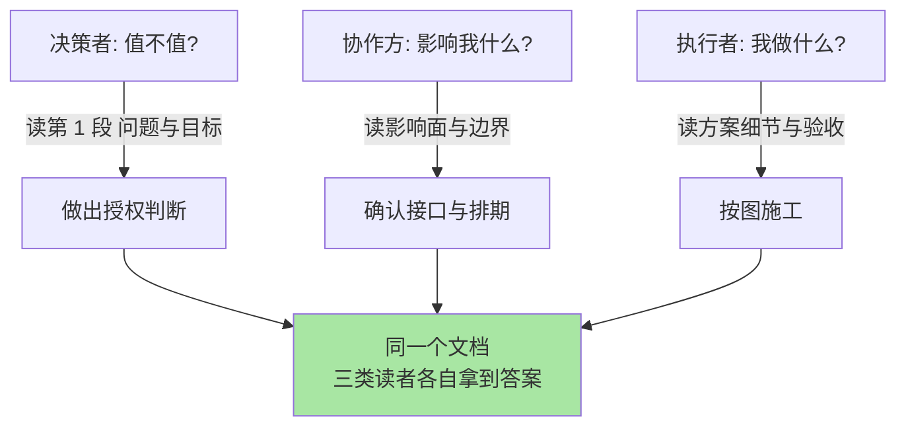

# 技术方案写作：让方案在十分钟内被看懂（入门）

> **一句话摘要**：技术方案文档是「用书面形式换取决策与执行授权」的工具——骨架是六段式（问题/目标/方案/对比/风险/演进），写法的第一原则不是「写得全」，而是「让最忙的决策者十分钟内看懂并做出判断」。

> **本文核心**：方案写作失败的头号原因不是文笔差，而是**视角错位**——作者按「我实现时的思考顺序」写（从方案细节开始），读者按「我要不要同意」的顺序读（从问题与代价开始）。组织主线是把文档当成**决策接口**来设计：先给结论与影响面，再给依据与细节，让不同角色的读者各取所需。**机制链**：问题定义锁定讨论边界 → 目标给出可验收的成功标准 → 方案对比暴露取舍 → 风险与演进交代代价与退出路径 → 评审从「立场之争」变成「依据之争」。本篇是「架构师软实力」系列第二篇——决策要留痕（篇 1），而方案文档是决策留痕最重要的载体。

## 一句话摘要

工程师的日常里有大量沟通是靠方案文档完成的：晋升答辩看它，跨团队协作看它，线上变更审批还是看它。但大多数方案文档的宿命是「写的时候用尽功力，评审的时候没人读完」——决策者翻三页没找到「要花多少钱、冒多大险」，直接批一句「再想想」，作者还委屈：明明细节都写全了。问题出在结构上：**文档的读者不是自己，而是带着不同问题来的三类人**——决策者问「值不值」，协作方问「影响我什么」，执行者问「我做什么」。一份好方案让三类人各自在两分钟内找到自己问题的答案，剩下的人往深处读。写作能力是技术负责人放大自身杠杆的核心通道：一个想法只讲给十个人听，影响就是十个人；写成一份人人能读懂的方案，影响是所有能读到它的人，且跨周期不衰减。

## 5W 速记卡

| 维度 | 一句话 |
|---|---|
| What | 问题/目标/方案/对比/风险/演进的六段式决策接口 |
| Why | 视角错位导致评审读不完；按读者问题组织才能拿到判断 |
| Who | 决策者（值不值）、协作方（影响我什么）、执行者（做什么） |
| When | 需要授权、需要跨团队对齐、需要事后可追溯的改动 |
| How | 结论前置 + 分层展开 + 每段回答一个读者问题 |

## 一、写给谁看：三类读者的三个问题

动笔之前先回答一个问题：这份文档是写给谁的。几乎所有方案文档的读者都落在三类人里，他们带着完全不同的问题来读：

| 读者 | 他真正想问的 | 他会在第几段失去耐心 | 你欠他的内容 |
|---|---|---|---|
| 决策者/技术负责人 | 要多少资源、冒多大风险、不做的代价是什么 | 第一页没看到结论 | 一段话摘要 + 风险与代价的量化区间 |
| 协作方/上下游团队 | 你的改动动不动我的接口、我的数据、我的排期 | 找不到「影响范围」一节 | 明确的影响面清单 + 需要对方做什么 |
| 执行者/未来的自己 | 边界条件是什么、异常怎么处理、验收标准是什么 | 方案与现实的细节断层 | 设计细节 + 验收标准 + 回退方案 |

**由此推出方案写作的总原则：结论前置，分层展开。** 第一页必须同时回答「做什么、为什么现在做、要什么、风险是什么」——这不是摘要，这是给决策者的完整决策包。细节全部后置，并允许读者按需跳读。判断一份方案的结构是否合格，有个机械方法：把每一节标题抽出来读一遍，看能否拼出一条完整的决策逻辑链——读者只读标题也应该能复述你的主张。

## 二、方案文档的六段骨架

六段式覆盖了从「为什么做」到「以后怎么办」的完整决策闭环，每一段回答一个固定的问题：

**第一段：问题。** 用三五句话说清「现在的系统在什么场景下遇到了什么障碍，为什么必须现在解决」。这一段最常见的毛病是把「方案」当「问题」写——「目前系统没有缓存」是现象，「高峰期响应延迟超出可接受范围导致转化率受损」才是问题。问题段写不好，后面全盘皆输：**问题定义锁定了讨论的边界**，问题写错了，评审会跑偏到「这问题存不存在」，而不是「这方案好不好」。

**第二段：目标。** 把「做成什么样算成功」写成可验收的陈述，同时写明**非目标**（这次明确不解决什么）。目标写得可验收，评审才有抓手；非目标写得明确，才能挡住评审会上「顺便把 X 也解决了」的范围蔓延——范围失控是方案延期最常见的根因，而防线就是这一段。

**第三段：方案。** 主方案的设计思路与关键决策点。注意粒度控制：写到「关键决策点有结论、异常路径有交代」即可，不必事无巨细——方案文档不是代码的实现说明书，评审者需要理解的是「骨架与关节」，不是每一根手指。

**第四段：方案对比。** 至少列一个严肃的替代方案，并写清放弃的理由。这一段是文档可信度的来源：**没有对比的方案在评审者眼里等于「没想过别的可能」**。为什么不用更简单的做法？为什么不用成熟的中间件？这些问题评审会上一定会被问，提前写出来，评审就从审问变成了确认。这背后其实有一个设计思想：方案的可信度不来自论证自己有多好，而来自诚实地呈现「别的路为什么走不通」——单方面的优点陈述在评审者眼里自带折扣，而自我反驳后的结论才有说服力。

**第五段：风险。** 列出「这个方案会坏在哪、坏了怎么办、谁负责发现」。风险段写「无重大风险」的方案，等于告诉评审者「没认真想过失效路径」。每个风险配一个缓解措施，形成闭环。

**第六段：演进。** 两个内容：这个方案的下一步规划，以及**退出路径**——如果方向错了，怎么以最小代价退出来。多数人想不到写退出路径，但这恰是有经验的评审者最先翻看的一段：一条设计好了退路的方案，说明作者对不确定性有敬畏（退出成本的重要性在篇 3 选型方法论里展开）。

## 三、不同量级改动下的方案写作：约束驱动解法

方案文档的详略对改动量级极其敏感，同一套模板写小改动是负担，写大改动是不足。每一档的约束来源不同，思考方式也不同：

- **影响单个模块、十万行代码以内的改动**：这一档的核心问题是「对齐理解」，而不是「获取授权」——约束来源是决策者就是执行者自己，文档的作用是把设计想清楚。思考方式是便签驱动：六段式各两三句话，半页纸收工，重点放在方案对比与风险两段。
- **跨团队、百万级日请求系统的改动**：这一档的核心问题是「跨边界信任」——约束来源是评审者不掌握你的上下文，且改动影响别人的系统。思考方式是契约驱动：影响面清单（动了谁的接口/数据/容量）、灰度计划、回退步骤必须显式成文，目标段必须给出以对方系统能观测的指标表述的验收标准。
- **方向级、亿级请求平台上的架构演进**：这一档的核心问题是「跨周期承诺」——约束来源是执行周期以季度计，评审者之外还有审计与合规在问「当初为什么这么改」。思考方式是资产驱动：方案文档与 ADR（篇 1）配套归档，风险段升级为「风险登记表」持续维护，演进段写清分阶段里程碑与每阶段的量化承诺。

**一句话的量级 Trade-off 意识**：模块级改动半页纸够用，跨团队改动必须写影响面与回退，方向级演进要配 ADR 与分阶段承诺——小改动写长文是内耗，大改动写便签是裸奔。

## 四、与设计文档、周报的区别辨析

三种文档经常被混为一谈，但它们服务的时间轴完全不同——这正是三者的核心区别：

| 维度 | 方案文档 | 设计文档 | 周报 |
|---|---|---|---|
| 回答的问题 | 这件事该不该做、怎么做 | 系统内部怎么实现 | 这周做了什么 |
| 生命周期 | 评审通过后转为执行依据 | 随系统演进持续维护 | 写完即过期 |
| 读者姿态 | 批准或驳回 | 理解或修改 | 知悉 |
| 失效后果 | 决策无据可查 | 系统不可维护 | 几乎无后果 |

其中最值得点破的是方案文档与设计文档的分界：**方案文档在「门外」——讲边界、取舍与承诺；设计文档在「门内」——讲结构与机制**。实践中两者常合并成一份「设计评审文档」，但章节必须分开：评审会上，「该不该做」的争论和「怎么做」的争论要能各自定位到各自的章节，否则两拨人会在同一段文字里各说各话。

## 五、怎么让人十分钟看懂：四个可操作的写作技巧

**技巧一：第一页放完整决策包。** 结论、代价、风险、要的资源，一页写完。决策者读完第一页就能给出「同意/再想/升级讨论」三选一，剩下的页数是为「同意之后的执行」服务的。

**技巧二：每个大段开头放一句加粗结论。** 「本段结论：放弃服务端渲染，因为首屏性能瓶颈在接口聚合层而不是模板层。」——读者即使不读正文也不会误解你的主张，读正文只是获取证据。这个技巧的底层原理是「金字塔结构」：人的阅读理解总是先搭框架再填细节，把结论放在段的顶部，读者的大脑会自动带着结论去校验论据，理解速度和准确率同时上升。

**技巧三：用表格承载对比，用图承载结构。** 多方案对比用表格（维度/方案A/方案B），架构关系用一张图。反方案分析（为什么不用 X）放在对比表格的「放弃理由」列——这是评审会上被问概率最高的问题，答案必须触手可及。

**技巧四：写给「离开项目组三个月的自己」测试。** 写完后自问：一个不了解背景的技术负责人，不问我任何问题，能否只靠这份文档做出正确判断？凡是需要「当面解释一下」才能成立的内容，都说明文档里缺了一段背景或一个定义。

## 六、典型使用场景

- **争取资源与授权**：性能治理、架构迁移、新技术引入——决策者需要量化代价与预期收益才能批
- **跨团队协作立项**：改动涉及上下游接口、共享数据、公共容量——协作方需要影响面清单排期
- **高风险变更前置评审**：大促前的容量改造、存储迁移、降级预案——评审者需要风险与回退路径
- **跨周期共识沉淀**：执行周期超过一个季度的演进——方案与 ADR 配套，防止人走茶凉

## 七、误区与不适用

- **误区一：把字数当诚意。** 评审者的耐心是固定资源，篇幅每多一页，「被完整读完」的概率就下降一截。注水的文档不是勤奋，是把筛选成本转嫁给了读者。
- **误区二：方案对比列稻草人。** 放一个明显荒谬的替代方案再轻松否掉，只会让评审者怀疑你没认真想过真选项。替代方案必须是「一个理性的人真的可能选」的方案，放弃理由要写到那个方案的**真实短板**上。
- **误区三：风险段只写技术风险。** 组织风险（关键人力只有一个）、协作风险（依赖方排期不确定）、演进风险（方案把系统锁死在某个选择上）往往比纯技术风险更容易让方案翻车。
- **不适用场景**：纯探索性 Spike（写代码验证想法比写文档更快）、一小时能完成且可回滚的小改动——这两类硬写方案是流程税。判断口诀：**需要别人授权、需要别人配合、或者错了很难退**，三条中一条，写；三条都不占，直接干。

## 八、什么时候用/不用：一张决策卡

| 信号 | 建议 |
|---|---|
| 改动需要跨团队协调或消耗共享资源 | 完整六段式 + 影响面清单（明确推荐起点） |
| 决策影响面以季度计 | 六段式 + 配套 ADR + 分阶段承诺 |
| 单模块内改动、自己授权自己 | 半页便签式方案，重点写对比与风险 |
| 纯 Spike 验证、两天内有结论 | 不写正式方案，事后把结论补成 ADR 即可 |

**决策原则**：方案文档的成本由作者承担，收益由读者获得——因为成本落在自己身上就偷工减料，是这类工具失败的头号人因。正确的自检不是「我写全了吗」，而是「决策者读完第一页能拍板吗」。

## 你们可能会问

**Q1：评审会上总有人揪着细节不放，方案写得再好也控不住场怎么办？**
把「方案边界」写进文档第二段（非目标）。评审跑题时引用一句「这个点不在本次范围内，我记入待办」——大多数揪细节不是恶意，是文档没写清边界导致对方不确定该不该问。边界声明写得越早，评审越收敛。

**Q2：决策者只看结论不看论证就批了，出了问题算谁的？**
这正是「结论前置」要配套「依据可查」的原因：批准者承担决策责任，作者承担披露责任——风险段写没写、代价报没报，决定了披露责任是否尽到。一份风险如实披露后被批准的方案，执行出问题走的是变更流程；一份风险藏着掖着的方案，出问题就是作者的全责。文档在这里起的是责任划界的作用。

**Q3：英文不好、画图不好，是不是就写不出好方案？**
方案写作的核心能力是「替读者预排问题」，与文笔无关。反例见得多了：辞藻漂亮但问题段都没定义清楚的方案，照样被驳回。先把六段的顺序与「每段回答谁的问题」想清楚，表达形式往后放——表格和图的模板网上都是，问题定义能力没有模板。从机制上说，方案写作考验的是对问题空间的穿透力：能把「为什么是这个问题」拆到底层的人，即使只用平实的语言，文档也自然有说服力。

**Q4：方案评审通过了，但执行中发现方向不对，文档要改吗？**
要，而且这正是「演进」段存在的意义。执行中的方向修正必须回写到方案文档并同步评审者——文档与现实的偏差一旦超过一个里程碑，这份文档就从资产变成了误导源。修正频繁到失控时，说明当初的方案对比段欠了功课（根本约束没找准），值得复盘而不是硬着头皮改文档。

## 自测三问

1. 三类方案读者各带着什么问题来读？分别对应文档的哪些部分？
2. 六段骨架里哪一段最常被省略？它的缺失会在评审会上以什么形式反噬？
3. 「需要授权/需要配合/难以回退」三条判断口诀，对应你最近一次写方案的经历是哪条？

## 💡 实战提示

- 💡 写完先做「标题朗读测试」：只读每节标题，听是否构成完整决策链——读者靠标题决定深读哪里，标题混乱的文档必然被跳读
- 💡 方案对比永远至少放一个「你真心觉得也有道理」的替代方案——放下它并写出放弃理由的那一刻，你的方案才算经过了自我评审
- 💡 风险段按「概率 × 爆炸半径」排序，前两条风险必须各配一个可执行的缓解动作——没有缓解动作的风险条目是免责声明，不是风险管理
- 💡 评审前把文档发给最可能的反对者私下预读一轮——会上被当众反驳的方案，十有八九是私下没做功课的方案

## 追问思考与开放问题

**质疑者追问链**：为什么非要书面文档，当面讲方案不是更快吗？——第一层追问：快在哪？快在表达，慢在对齐：当面讲的信息带宽高但衰减快，三天后每个听众记得的版本都不一样，而文档是唯一能让「三个月后的新相关方」零成本对齐的媒介。——再追问：AI 都能生成文档了，这个能力还值钱吗？AI 能把你的想法排版成文档，但「问题定义对不对、替代方案选得严不严肃、风险估得实不实」这些判断不会凭空出现——喂给 AI 的思考质量决定了文档质量，思考能力反而是被 AI 放大了（篇 5 展开这个判断）。——打破砂锅问到底：文档写得好看但项目照样失败，说明这能力没用？恰恰相反——多数失败项目的方案文档复盘时都能发现：问题段夸大了收益或风险段漏了关键依赖。**文档不是项目的装饰，文档就是项目最早一次的全面演练**，写的时候糊弄，执行时就会以十倍代价补课。

**一次排查的复盘叙事**：某团队的存储迁移方案评审时全票通过，执行到一半被迫中止。复盘会上把当年的方案文档翻出来对照，发现问题并不在执行，而在文档的两个缺口：目标段写的是「迁移完成后性能不下降」，但没有定义「用什么指标在哪个压测场景下度量」，导致迁移中途双方对「性能不下降」各执一词；风险段漏了「旧库上还有一个定时任务在直连读写」，直到灰度阶段数据出现不一致才被排查出来，此时回退窗口已经关闭，只能紧急修复再继续。复盘的改进项落到文档规范上只有两条：目标必须带验收指标与度量方式；风险排查必须包含「对存储的所有读写方全量盘点」——后来这个团队的每一次迁移方案里都多了一张「读写方清单表」，同类问题再没有复发过。这次复盘最深的教训是：**方案文档里每一个模糊表述，都会在执行期变成一次真实的意外**。

**设计思想层面的开放问题**：方案文档的结构会不会被 AI 重构——当每个人都有一个了解全部上下文的 AI 助手，文档还需要为「读者缺上下文」而服务吗？值得讨论。一种可能的演进是文档分层：给人看的「决策与取舍层」保持不变（因为责任判断永远在人），给 AI 看的「上下文与细节层」机器化、结构化。两层怎么划分、以什么格式互链，是未来几年写作实践最值得观察的变化。

## Trade-off 与取舍分析

方案写作的每个选择都在「严谨」与「效率」之间做取舍：文档越厚，决策依据越充分，但读者的阅读成本与作者后续的维护成本越高；评审越前置越严格，方向性风险越小，但启动速度越慢；结构越标准化，跨团队协作越顺畅，但小型场景下的仪式负担越重。**取舍的锚点是「改动的不可逆程度」**：越难回头的改动，越值得在文档阶段多花时间——因为文档阶段发现缺口修正的是文字，执行阶段发现缺口修正的是系统。另一个常被忽略的代价是延迟决策的成本：为了写出完美方案而无限收集信息，机会窗口可能已经关闭。好的实践是给文档阶段设定一个明确的时间盒，在时间盒内追求严谨，到点带着「已知与未知清单」上会——把「还有哪些没想清楚」如实写进风险段，比悄悄延期一周更能建立信任。

## 🎯 核心带走

- **核心一句话**：方案文档 = 用六段式（问题/目标/方案/对比/风险/演进）把一个想法包装成「决策接口」，让决策者十分钟内能拍板
- **机制链**：问题定义锁定边界 → 目标给出验收标准 → 对比暴露取舍 → 风险交代兜底 → 演进写明退路 → 评审从立场之争变成依据之争
- **失效点/边界**：需要授权/配合/难以回退才值得写；结论前置分层展开；每个模糊表述都会在执行期变成意外；文档是项目最早一次的全面演练

## 📌 数据与事实声明

- 写于 2026-09-17，L1 入门层概念篇
- 「读者耐心」「评审跑题频率」等为经验认知层面的归纳，文中未引用任何统计数字；涉及性能、容量处均为通用画像表述，未引用任何公司内部数据
- 六段骨架为业界方案写作常见结构的归纳整理，具体团队可按需裁剪

## 📚 参考资料

| 类型 | 标题 | 来源 |
|---|---|---|
| 系列内 | 架构决策与 ADR 方法（篇 1） | [1_架构决策与ADR方法-入门.md](1_架构决策与ADR方法-入门.md) |
| 系列内 | 技术选型方法论（篇 3） | [3_技术选型方法论-入门.md](3_技术选型方法论-入门.md) |
| 系列内 | AI 时代工程师能力模型（篇 5） | [5_AI时代工程师能力模型-入门.md](5_AI时代工程师能力模型-入门.md) |
| 公开书籍 | 技术方案写作与评审相关实践 | 各大社技术写作类书目（按需检索） |
| 行业惯例 | RFC 驱动的开源协作模式 | 各开源基金会 RFC 流程公开文档 |
