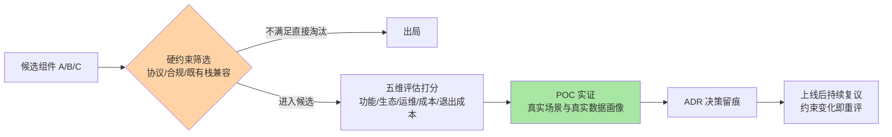
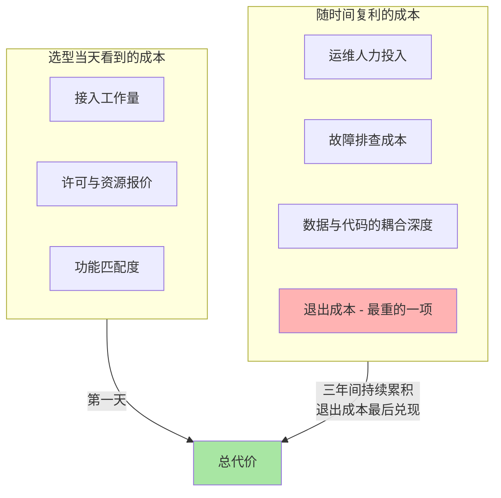

# 技术选型方法论：五个维度与被忽略的退出成本（入门）

> **一句话摘要**：技术选型是一次「用今天的判断力为未来三年买保险」的决策——评估维度是功能/生态/运维/成本/退出成本五个维度，方法上有 POC 验证兜底；其中「退出成本」最容易被忽略，因为它在选型当天永远显不出来。

> **本文核心**：选型失败的头号模式不是「选了个差的技术」，而是**评估维度单薄**——只比功能清单，把生态、运维、成本尤其是退出成本留给了运气。组织主线是把选型当成一次**跨周期的机制设计**：今天的选择决定了明天「能走多快」和「能不能走」。**机制链**：需求抽象出硬约束 → 五维度打分收敛候选 → POC 用真实场景验证纸上结论 → 决策留痕（ADR）→ 退出成本在签约第一天就开始计息。选型能力是技术负责人「替系统做长期决定」的核心软实力，它与篇 1 的决策留痕、篇 2 的方案写作共同构成「定方向」的完整闭环。

## 一句话摘要

几乎每个后端工程师都会在某个时刻第一次面对选型：给系统挑一个消息队列、一个存储引擎、一个任务调度框架。新手的第一反应是搜索「X 和 Y 哪个好」，然后陷入参数表的海洋——吞吐数字、特性对比、社区活跃度。但选型的本质不是「找出最好的那个」，而是**找出「在这个场景、这个团队、这个时间点」代价结构最可接受的那个**：同一个组件，在小团队手里是利器，在另一个团队手里可能是负担，因为运维能力、生态 familiarity（熟悉度）、人力结构完全不同。更关键的是，选型评估的时间视野天然错位——它要求你判断的是生态三年后的演进方向，而你手上只有今天的快照：功能差异第一天就能看到，运维成本第一个月显现，而退出成本要在决定「离开它」的那一天才显形——那时往往已经积了三年的数据、代码习惯和团队肌肉记忆。这篇讲的就是怎么把这个错位的时间视野拉平：用五维度补全评估面，用 POC 把纸面判断变成实证，用退出成本给所有乐观预期上保险。

## 5W 速记卡

| 维度 | 一句话 |
|---|---|
| What | 功能/生态/运维/成本/退出成本五维评估 + POC 实证 + ADR 留痕 |
| Why | 只比功能清单的选型，把最贵的代价（运维与退出）留给了运气 |
| Who | 做选择的技术负责人、承担运维的团队、三年后接手的后来者 |
| When | 引入新依赖、替代旧组件、平台方向调整之前 |
| How | 硬约束先筛 → 五维打分收敛 → POC 验证 → 决策留痕 → 定期复议 |

## 一、为什么选型容易翻车：三个认知陷阱

**陷阱一：功能清单选型。** 把候选组件的特性表拉出来逐项打勾，勾最多的胜出。这个方法的致命缺陷是：**功能清单回答不了「你的场景用不用得上」**——用不上的功能不是加分项，是潜在的复杂度。更隐蔽的是，功能表对比天然偏向「功能多的」，而工程上「少而稳」往往优于「多而新」。

**陷阱二：热度选型。** 「大家都在用所以应该没错」——社区热度确实是生态维度的合理信号，但把它当唯一依据会把选型变成追星。热的项目说明「生态在投入」，不说明「它匹配你的约束」：热门方案默认的团队规模、运维水位、迭代节奏，可能与你的组织完全错配。

**陷阱三： demo 选型。** 跑通了一个官方示例就拍板。示例验证的是「理想路径存在」，选型要验证的是「你的路径走得通」——真实数据分布、真实故障模式、真实运维场景，这些在示例里一个都不出现。

三个陷阱的共同根因是：**把选型当成了「比较题」，而它实际是「预测题」**——预测这个选择在接下来三年里的总代价。预测题需要的是机制性的评估框架，不是一次性的灵感。

## 二、五个评估维度：每个维度在回答什么问题

| 维度 | 核心问题 | 常用判断依据 | 最常被高估/低估 |
|---|---|---|---|
| 功能 | 它能不能解决我的核心问题（不是全部问题） | 核心场景覆盖度、扩展点机制 | 高估「功能数量」的价值 |
| 生态 | 遇到问题时，外面有没有人已经踩过同样的坑 | 社区规模、周边集成、人才市场供给 | 低估「招人难度」这个生态信号 |
| 运维 | 出事的时候，我们这个团队能不能自己搞定 | 可观测性成熟度、故障模式是否已知、升级路径 | 低估「凌晨三点能不能排查」 |
| 成本 | 三年总账是多少（不是第一天账单） | 许可费用、人力投入、硬件资源、学习曲线 | 只算采购不算人力 |
| 退出成本 | 三年后想换掉它，要付多大代价 | 数据导出能力、接口标准化程度、耦合深度 | 严重低估（下节展开） |

五个维度不是并列打分加总那么简单——**它们有先后与权重，权重由场景决定**：核心链路组件（存储、消息）运维与退出成本权重高，因为换不起；边缘工具类组件功能与上手成本权重高，因为换得起。一个实用的思考方式是先问「这个东西坏了会怎样」：坏了对用户无感，选型可以激进；坏了就是事故，选型必须保守。这也是选型最底层的机制——**风险敞口决定评估的严格程度**。

## 三、为什么「退出成本」最容易被忽略

退出成本被忽略不是偶然，而是三个机制叠加的必然结果：

**机制一：它是唯一「负向」的维度。** 功能、生态、运维、成本都有「当下可见的证据」（演示、社区、监控面板、报价单），唯独退出成本是「假想中的未来支出」——没有任何仪表盘显示它。人类的评估机制天然偏好可感知的证据，负向且未来的项自动沉底。

**机制二：选型者与承担者分离。** 做选型决定的人，往往不是三年后执行迁移的人。退出成本是一种典型的「跨期转嫁」：今天的便捷（专有协议接入快、深度定制好上手）变成明天的枷锁（数据格式私有、API 无标准替代）。

**机制三：供应商与社区都在激励你忽略它。** 一切「顺利接入」的宣传都在强调进入成本低，而进入成本低经常与退出成本高是同一枚硬币的两面——专有特性用得越爽，标准替代路径就越远。

**退出成本的实操评估清单**——选型时逐项过一遍：

- **数据能出来吗**：数据格式是否开放标准？全量导出的工具与耗时？出不来或极慢的数据就是人质
- **接口有多专用**：核心 API 是否存在行业通用等价物？封装层能不能把专有特性隔离在薄薄一层里？
- **耦合有多深**：业务代码里直接引用它的地方有多少处？有没有可能通过防腐层（适配层）把依赖收敛到少数模块？
- **双跑可行吗**：如果必须迁移，新旧系统能否并行过渡？不能并行就只能停机豪赌

评估结果落在文档上就是一句话的量级判断：「退出代价约等于重做 X」或「退出代价仅为替换一个适配层」。**这句话在选型当天写下来，是未来团队最值钱的遗产之一**——它同时是当初决策质量的证词和未来复议的起点（回到篇 1 的复议触发条件）。

## 四、POC 设计：把纸面判断变成实证

POC（Proof of Concept，概念验证）是选型流程里唯一能产生「一手证据」的环节，但随手的 POC 只是又一次 demo。一份有效的 POC 设计有四条纪律：

**纪律一：用真实的数据画像，不用示例数据。** 数据量级、读写比例、热点分布、脏数据形态，都按生产画像构造——你要验证的是它在「你的世界」里的行为，不是它在「官方世界」里的行为。量级至少对齐未来一两年的预期峰值，而不是当前水位：为今天的量级选的方案，常常在上量后第一个失效。

**纪律二：验证核心场景加失败场景，不验证安装。** POC 的目标场景清单来自需求分析：核心读写路径必测，异常路径（节点宕机、网络抖动、超时重试）必测，「安装顺利」不值得写进验证目标——那是文档问题，不是选型问题。

**纪律三：预设通过标准，跑完如实打分。** 先写下「延迟 P99 低于 X、故障恢复在 Y 内、数据零丢失」再开跑，跑完对照打分。先跑后定标准的 POC 会不自觉地向结论靠拢——这是评估环节最常见的不自觉作弊。

**纪律四：限时间盒，记录未知清单。** POC 预算以人周计，到点必须收口：已验证的结论、未覆盖的未知、遗留风险，全部写进 ADR。无限期的评估本身就是一种决策瘫痪，而且机会成本比选错更隐蔽。

## 五、不同量级场景下的选型策略：约束驱动解法

同一张五维评估表，在不同量级下权重完全不同，选型策略也应该是三套而不是一套。每一档的约束来源不同，思考方式也不同：

- **十万级日请求、单团队规模**：这一档的核心问题是「交付速度」，而不是「极限能力」——约束来源是人力比资源贵，团队没有专职运维。思考方式是托管优先：优先托管服务或运维面窄的方案，为什么不用功能最强的自维护方案？因为你买得起它的功能，养不起它的运维。
- **百万级日请求、多团队共享**：这一档的核心问题是「组织规模化的一致性」——约束来源是组件成为多团队共享基础设施，一个选型失误被放大成多团队的排期风险。思考方式是标准驱动：选型流程正式化（五维评估 + POC + ADR），重视人才市场供给（招不到人的方案等于无人运维），退出成本权重上调。
- **亿级请求、平台化组织**：这一档的核心问题是「供应链的跨周期韧性」——约束来源是任何组件的深度绑定都会在多年尺度上变成组织级风险，且规模本身改变问题性质（通用方案的成本曲线在此档失效）。思考方式是组合防御：核心链路自研或深度可控 + 防腐层隔离 + 退出预案常态化演练，把「能不能走」当成与「跑多快」同级的架构指标。

**一句话的量级 Trade-off 意识**：十万级托管起步快速验证，百万级流程正式化防扩散，亿级自研加防腐层保退出权——小量级追新是白交学费，大量级锁死是给自己修围城。

## 六、与 Benchmarks（跑分）的区别辨析

很多团队用第三方跑分报告替代选型评估，这是把「区别」搞混了的典型——跑分和选型评估回答的是两个不同的问题：

| 维度 | 跑分报告 | 选型评估 |
|---|---|---|
| 回答的问题 | 在理想环境下极限能力是多少 | 在我的约束下总代价是多少 |
| 场景 | 标准化的合成负载 | 你的真实数据画像与故障模式 |
| 时间视野 | 当下这个版本 | 三年生命周期 |
| 结论形态 | 排名 | 权衡后的取舍与代价清单 |

跑分可以作为五维评估里「功能/性能维度」的输入之一，但永远不能替代评估本身——**跑分测的是组件的天花板，选型要算的是你家的地板**。你的数据分布、团队运维能力、上下游兼容约束，每一条都可能让跑分排名与实际表现完全颠倒。

## 七、典型使用场景

- **新依赖引入**：给系统挑第一个消息队列/缓存/调度框架——五维评估 + 轻量 POC + ADR 留痕，一页纸起步
- **旧组件替换**：现有组件出现维护风险或能力缺口——重点评估迁移路径与双跑可行性，退出成本评估反向应用于「现任」
- **托管与自建抉择**：云服务还是自部署——把「运维维度」折算成钱直接比较，把「退出成本」折算成议价筹码
- **平台方向决策**：跨团队共享基础设施的统一选型——完整流程 + 复议机制，选型从个人判断升级为组织资产

## 八、误区与不适用

- **误区一：五维表当算术题。** 打分加总选最高分——权重设定本身就是最大的判断，机械加总会把「运维维度差到致命」的方案因为功能分高而选进来。评分表用于结构化讨论，不用于替代判断。
- **误区二：POC 做成翻译官方示例。** 换了数据换了场景的 POC 才有信息量，照抄示例参数跑通的 POC 只能证明「官方文档没写错」。
- **误区三：选型一次定终身。** 把「推翻旧选型」视为打脸，导致组织在错误的路上越走越远。正确姿态是给每个重大选型设定期限（例如两年后自动进入复议），约束变了就重新评估——推翻的是「过期结论」，不是当初的判断（当初的判断质量看 ADR 记录）。
- **不适用场景**：无状态的工具库（一个工具类、一个前端组件）——退出成本接近零，选错了重写就是，不必走完整流程。判断口诀：**数据落在它那儿的，才值得全套评估**；无状态依赖的选型，功能加社区两个维度就够了。

## 九、什么时候用/不用：一张决策卡

| 信号 | 建议 |
|---|---|
| 有状态组件、数据落在它那里、换它要迁移数据 | 完整五维评估 + POC + ADR（明确推荐起点） |
| 组件将成为多团队共享基础设施 | 完整流程 + 明确复议期限 + 人才供给评估 |
| 无状态工具库、替换成本以天计 | 功能与社区两维快速判断即可 |
| 两个候选在所有维度接近打平 | 选退出成本低、团队更熟的那个——平局规则提前定好 |

**决策原则**：选型的最优解不是「最好的组件」，而是「错了也能退出的组合」——把退出权留在自己手里，其余的都可以边走边调。

## 你们可能会问

**Q1：小团队没有人力走完整流程，最简版是什么？**
三件事不能省：写下硬约束（不满足直接淘汰的那几条）、写下放弃理由（哪怕只有一个替代方案）、写下退出路径评估。这三样加起来一页纸、半天工作量，覆盖了选型决策里「事后最容易被追问」的部分。五维打分表和正式 POC 都可以按量级裁剪，唯独「当时为什么选它」和「将来怎么出去」不能不写。

**Q2：怎么评估一个开源项目的「会不会黄」？**
没有可靠方法预测单个项目的生死（业内普遍共识），但有几个降险机制：看治理结构与演进轨迹（基金会托管优于个人维护，版本节奏稳定优于大起大落）、看许可证（许可证变更风险是真实存在的行业事件类型）、看自己在用的版本是否有多个组织在生产环境使用（公开资料可查）。更实用的姿态不是预测，而是假设它会黄：数据能导出、接口有替代、封装有隔离——三条满足，「黄」只是迁移成本，不是生存危机。

**Q3：团队里有人强烈推崇某个技术，情绪很足，怎么处理？**
把热情导入流程而不是对抗：让他做该技术的 POC 负责人，按纪律四的时间盒与预设标准跑。热情驱动的 POC 往往很投入——如果真适合，他拿出一手证据说服所有人；如果不适配，预设的通过标准会替你说「不」，你不必成为那个反对者。流程在这里起的作用是把「人与人的立场之争」转换成「证据与标准的对照」。

**Q4：AI 辅助选型靠谱吗——让它列对比表？**
AI 生成的对比表适合做**初筛与学习材料**：快速了解候选集合、各家的定位与争议点，效率远超人工翻文档。但它不能替代 POC 与退出成本评估——这两项的输入是你的真实场景与团队约束，AI 不知道也不该替你猜。正确的分工是 AI 压缩信息收集阶段，人守住判断与责任（篇 5 展开这个分工边界）。

## 自测三问

1. 五个评估维度各自回答什么问题？为什么说「坏了会怎样」决定评估的严格程度？
2. 退出成本为什么天然被低估？它的实操评估清单有哪四项？
3. 一份有效的 POC 设计有哪四条纪律？哪一条最容易被跳过、后果是什么？

## 💡 实战提示

- 💡 选型会前先逼所有人写下「这个方案最可能死在哪」——从失败模式出发的讨论比从优点清单出发的讨论更快收敛，也更能暴露没做功课的人
- 💡 给每个有状态组件的选型写一句「退出代价陈述」并放进 ADR——这句话是未来复议时判断「约束是否变化」的锚点
- 💡 用防腐层思维对待所有第三方依赖：专有 API 只出现在适配层，业务代码只见自有接口——这层薄封装是你在选型错误时唯一 cheap 的退路
- 💡 POC 报告的「未知清单」比「结论」更有长期价值——结论会过期，未知清单是给后来者省命的地图

## 追问思考与开放问题

**质疑者追问链**：为什么不直接选大社区的默认流行方案，省掉整套评估？——第一层追问：流行方案错了吗？多数时候没错，但「默认流行」的含义是「对典型场景的典型团队最优」，你的约束只要偏离典型（比如极端成本敏感、特殊合规要求），默认解就可能恰好踩在你的短板上。——再追问：那评估的意义不就是验证流行解吗？对，大部分时候五维评估的产出确实是「确认默认解成立」，这不可耻——**评估的价值不在于推翻默认，而在于让「接受默认」从侥幸变成判断**，并且留下了放弃理由，未来环境变化时知道该重新看什么。——打破砂锅问到底：选型能力能被 AI 替代吗？AI 可以把五维评估的信息收集压缩到分钟级，但权重设定是组织价值观的表达——「运维成本和交付速度哪个重要」这个问题的答案在组织的伤口里，不在数据里。判断可以外包给流程，责任没法外包给模型。

**一次排查的复盘叙事**：某平台三年前引入了一个任务调度组件，当年选型报告只有一段话——「社区活跃、功能齐全、性能满足要求」，没有任何放弃理由与退出评估。三年后该组件核心维护者停止维护，安全漏洞不再修复，团队启动迁移时才发现：任务定义的元数据格式是私有的，全平台数万条任务配置散落在各业务代码里，没有统一导出通道。排查迁移可行性的那两周里，团队做的事情本质上是补写三年前欠下的那张评估清单：盘点耦合点、评估数据导出、设计双跑方案。最终迁移完成了，但复盘报告里写了一句很重的话：**这次迁移的全部成本，都是当年那一段话省下来的**。此后这个团队的选型模板里，「退出成本」一栏是必填项，空着不让提交——用流程堵住人性里「对未来的自己过度乐观」的缺口。

**设计思想层面的开放问题**：五维评估框架本身会不会过时——当基础设施全面托管化、组件更换成本持续下降，「退出成本」的权重是否终将归零？值得讨论。观察到的相反趋势是：托管降低的是「组件级」更换成本，抬高的是「平台级」锁定成本——这是基础设施多年演进里反复出现的模式——单点容易换了，但数据、权限、可观测性体系与某个云平台的耦合变深了。锁定的粒度在迁移而不是消失，评估的对象也许会从「组件」变成「平台」，但「进入易、退出难」这个不对称结构，看起来比任何具体技术都长寿。

## Trade-off 与取舍分析

选型流程的每一步都在「决策质量」与「决策速度」之间做取舍：评估维度越全，翻车概率越低，但流程越重、小场景越不划算；POC 越充分，一手证据越扎实，但时间盒越长、机会成本越高；复议机制越灵敏，纠错越快，但组织对既有选型的投入意愿越摇摆——没人愿意深投入一个「随时可能被推翻」的选择。**取舍的锚点是「不可逆性」**：数据落在组件上的深度、耦合的广度、迁移的窗口，共同决定该为这个决定花多少评估成本。可逆的选择快刀斩乱麻，不可逆的选择慢工出细活——把「果断」和「审慎」用在正确的量级上，比任何评估表都更能定义一个技术负责人的选型水平。最后记住那个不对称：进入成本是明码标价的，退出成本是暗账——**所有评估维度里，只有退出成本需要你主动去想**，这正是它被忽略又最重要的原因。

## 🎯 核心带走

- **核心一句话**：选型 = 用「功能/生态/运维/成本/退出成本」五维评估 + POC 实证，为未来三年选一个「代价结构可接受且退得出」的方案
- **机制链**：硬约束筛掉不合格 → 五维收敛候选 → POC 用真实画像验证 → ADR 留下理由与退出陈述 → 约束变化触发复议
- **失效点/边界**：无状态依赖不必全套流程；评分表辅助讨论不替代判断；跑分测天花板而选型算地板；退出成本是唯一必须主动去想的负向维度

## 📌 数据与事实声明

- 写于 2026-09-17，L1 入门层概念篇
- 「开源项目维护停止」「许可证变更风险」为业内公开发生过的风险类型概括，未指涉具体项目；文中所有性能、规模描述均为通用画像，未引用任何公司内部数据
- 五维评估框架与 POC 纪律为业界常见实践的归纳整理，属经验认知

## 📚 参考资料

| 类型 | 标题 | 来源 |
|---|---|---|
| 系列内 | 架构决策与 ADR 方法（篇 1） | [1_架构决策与ADR方法-入门.md](1_架构决策与ADR方法-入门.md) |
| 系列内 | 技术方案写作（篇 2） | [2_技术方案写作-入门.md](2_技术方案写作-入门.md) |
| 系列内 | 跨团队协作与技术影响力（篇 4） | [4_跨团队协作与技术影响力-入门.md](4_跨团队协作与技术影响力-入门.md) |
| 公开方法 | Architecture Decision Records 社区站点 | adr.github.io |
| 延伸阅读 | 防腐层（Anti-Corruption Layer）模式 | 各经典架构书目相关章节 |
