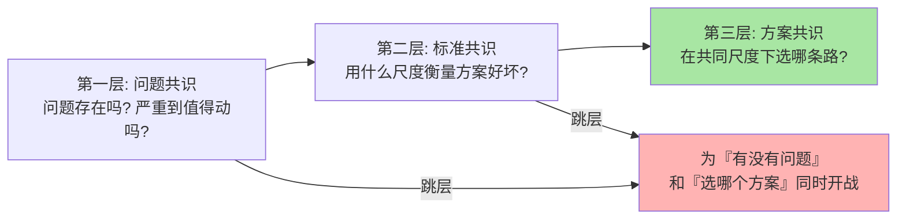
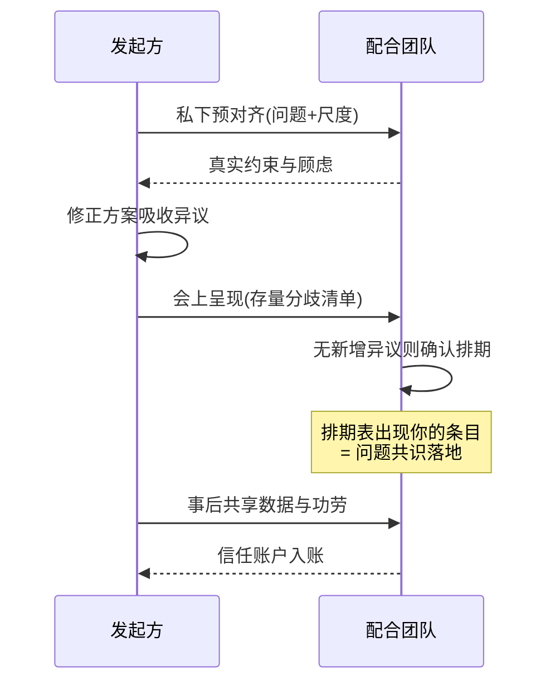

# 跨团队协作与技术影响力：让共识自己长出来（入门）

> **一句话摘要**：跨团队的技术推动力不来自职权，而来自「共识的工程化生产」——路径是先对齐问题再争论方案、反对意见对事成对系统、用数据替代形容词；横向影响力的边界是「你有证据、别人有选择权」。

> **本文核心**：职权管辖止于团队边界，但系统问题从不停在边界上——跨团队协作的本质是**在没有指挥权的地方制造出可执行的共识**。组织主线是把共识生产当成一条流水线：问题共识（大家都承认问题存在）→ 标准共识（用什么尺度衡量好坏）→ 方案共识（选哪条路）——绝大多数协作冲突，是跳过前两步直接吵第三步造成的。**机制链**：私下预对齐暴露真实异议 → 会上只解决存量分歧 → 数据与复盘记录替代嗓门 → 事后共享功劳回补信任账户。技术影响力是「架构师软实力」系列里最反直觉的一环：它恰恰在你最想「赢」的时候要求你先帮对方赢。

## 一句话摘要

每个后端工程师都会撞上这堵墙：你发现了一个跨系统的问题——比如某个公共接口的重试策略会让下游在故障时雪崩——解决方案需要两个你管不到的团队配合改造。你发消息、提单、开会，对方排期遥遥无期，最后问题继续存在，你只能继续看着它难受。这时候缺的不是技术判断力，而是**横向影响力**：在不动用任何职权的前提下，让一群不向你汇报的人，自愿把你的优先级变成他们的优先级。这件事有方法可循，而且方法相当工程化——共识是有生产流程的，反对意见是有表达协议的，数据是有呈现纪律的，影响力是有边界与边界的守法的。本篇把这四件事拆开讲透。值得先立住的一个判断：横向影响力不是「会来事」，它是一种**让正确的事情更容易发生的系统设计能力**——你设计的不是代码，是别人参与协作时的决策路径。

## 5W 速记卡

| 维度 | 一句话 |
|---|---|
| What | 问题共识 → 标准共识 → 方案共识的流水线，配数据呈现与异议协议 |
| Why | 职权止步团队边界，跨系统问题必须靠共识解决 |
| Who | 有跨系统诉求的工程师、被请求配合的兄弟团队、双方的上层 |
| When | 改动跨边界、风险共享、需要别人排期配合时 |
| How | 私下预对齐 → 会上解决存量分歧 → 数据说话 → 功劳共享回补信任 |

## 一、为什么多数跨团队争论是无效的：共识的三层结构

回想一次你经历过的跨团队技术争执——大概率是这样的走向：会议开始十分钟，双方已经在争论「该用方案 A 还是方案 B」，各讲各的道理，谁也说服不了谁，最后升级到两个负责人再开一次会。**这种争论无效的根因是层级错位：双方还在「问题是否存在」都没对齐的层，就开始争夺「方案选哪个」的层。**

共识其实有三层，必须按序生产，不能跳步：

**问题共识**：对方承认这个问题真实存在、且严重到值得投入。这一层经常是伪的——口头的「是的我们也有这个问题」可能只是礼貌，真实的信号是对方愿意为它排期。检验问题共识只有一个标准：**它出现在对方的排期表上，而不是出现在会议纪要里**。

**标准共识**：双方同意用同一把尺子评估方案——比如「优先看故障恢复时间而不是平均延迟」。很多旷日持久的方案之争，本质是双方各拿一把尺子：一方量性能，一方量成本，永远吵不完。先把尺子统一，方案之争经常自动消解——这是跨团队协作里杠杆最高的一步，也最常被忽略。

**方案共识**：在统一尺度下比较各选项。到了这一层，分歧通常变成技术问题而非立场问题，可以用 ADR（篇 1）的流程收敛。

三层结构的实践推论：**跨团队会议前，至少完成前两层的私下对齐**。会上一上来就吵方案，说明前两层被默认跳过了——那是协作失败的准确信号。

## 二、反对意见的表达：三个协议

跨团队协作里最珍贵的不是支持，而是高质量的反对——反对意见处理得好，是信任的加速器。三个经过反复验证的表达协议：

**协议一：先复述，再反对。** 「如果我理解得对，你们的约束是 X、担心的是 Y——在这个前提下，我认为方案可能有一个盲区……」。复述的作用是机制性的：它强制你先进入对方的上下文，也向对方证明你听懂了。大量「反对」引发的冲突，根因是对方感到没被理解，而不是反对本身。

**协议二：反对方案，附带代价，而非反对动机。** 「这个方案在数据量上去之后会撞上 X 瓶颈，我估的触发线是百万级日请求」是工程反馈；「你们这个方案考虑不周」是人身判断。前者可以进入 ADR 的方案对比段变成公共资产，后者只会制造敌人。**每一次反对都应该能被写进文档**——写不进文档的反对，大概率是情绪。

**协议三：公开场合留余地，私下场合给台阶。** 会上发现对方方案的硬伤，先问「这个场景你们是怎么考虑的」而不是直接宣布结论——给对方自己发现问题的机会。会议上被逼到墙角的人会转入防御模式，防御模式的人不做理性决策。这条不是圆滑，是机制：**你的目的是修复问题，不是赢得当场**；当场赢了辩论、输了协作，净收益是负的。

## 三、用数据说话：让形容词退场

「性能很差」「风险很大」「体验不好」——这类形容词是跨团队协作里的硬通货坏账：它们无法被反驳，也无法被采纳，只能制造情绪。数据化的本质是把争议变成**可验证的陈述**：

| 形容词版本 | 数据版本 | 差异机制 |
|---|---|---|
| 「高峰期很慢」 | 「高峰时段 P99 延迟是平时的三倍（监控截图与时间戳见附）」 | 可复核 |
| 「这个改动风险很大」 | 「改动涉及五张核心表中的三张，按近半年变更记录，这类改动的故障率约为其他类型的两倍（变更平台口径）」 | 有基准线 |
| 「大家都遇到过这个问题」 | 「故障群里该问题的求助记录最近一个月 N 条（原始记录链接）」 | 可溯源 |

三条呈现纪律：**给基准线**（三倍——相对什么？没有基准的数字也是形容词）；**给口径**（哪个系统、哪个时间段、怎么统计的）；**给链接**（原始数据可回查，而不是只给结论截图）。有纪律的数据有一个额外的机制性收益：它把讨论从「信不信你」变成「数据对不对」——**前者消耗信任，后者只消耗时间**。信任是存量，时间是流量，用流量换存量永远是划算的生意。

还有一个高阶用法：**让对方的系统自己说话**。在对方的服务上挂一层观测（征得同意后），让对方亲眼看到自己系统的指标曲线在你说的时间点抖动——自我说服的效率是外部说服的十倍。这是「用数据说话」的终极形态：你不需要说服任何人，你只需要让事实可被看见。

## 四、横向影响力的边界：它能做什么、不能做什么

把影响力神话化是新手最常见的过度矫正——从「只会讲道理」摆到「以为讲道理能解决一切」。横向影响力有三个硬边界：

**边界一：它不能替代资源决策。** 你可以推动两个团队都认为事情该做，但双方都排不出人力时，决定「谁先让路」的是资源所有权人。影响力能把你送到决策桌前，不能替你坐上那个位置。此时正确的动作是把已经对齐的问题共识、数据、方案成本整理成一页纸，交给有权做权衡的人——**把判断题交给有判断权的人，不是失败的协作，是协作的正确收尾**。

**边界二：它不能长期透支。** 每一次跨团队请求都在动用「信任账户」：事前预对齐、事后共享功劳是存入，硬塞优先级、抢功劳是支出。账户余额决定下次请求的响应速度。只取不存的工程师，第三四次请求时就会体会到什么叫「消息已读不回」。

**边界三：它不能绕过合理的否决。** 对方基于真实约束说不，这个否决应当被尊重——影响力不是说服对方放弃合理边界的手段。此时正确动作是回到问题共识层：要么共同找到缩小问题规模的办法（先修一半），要么接受现状并把复议条件写下来（约束变化时重启）。

**守法总纲**：影响力的合法性来自「你有证据、对方有选择权」。一旦任何一方缺失——你只剩立场，或对方没有拒绝的自由——协作就退化成消耗。

## 五、不同组织规模的协作策略：约束驱动解法

协作方法对组织规模极其敏感，同一套打法随组织演进阶段的不同效果完全不同——百人公司与万人组织里几乎没有可比性。每一档的约束来源不同，思考方式也不同：

- **十人以内同地协作**：这一档的核心问题是「信息同步」而不是「共识生产」——约束来源是大家抬头可见，冲突在白板前五分钟消解。思考方式是直接对话驱动：别发明流程，别写正式文档，问题不过夜。
- **数十到数百人、十几个团队的中型组织**：这一档的核心问题是「边界契约」——约束来源是团队间不再共享上下文，接口变更、容量占用这些跨边界动作需要明确的协议。思考方式是机制驱动：接口评审、共享组件的容量申请、ADR 归档，让协作从「刷脸」升级为「走机制」，因为刷脸的覆盖率已经跟不上团队增长。
- **千人以上、跨部门与跨地域的大型组织**：这一档的核心问题是「目标对齐的跨周期衰减」——约束来源是信息层级损耗，一个技术诉求传导到有权解决它的人那里要经过数层转述。思考方式是杠杆驱动：把个案推动升级为标准与平台建设（推动观测体系统一、推动跨团队变更规范），让每一次成功推动沉淀为不再需要推动的机制；单个问题靠沟通，一类问题靠机制。

**一句话的量级 Trade-off 意识**：十人团队白板解决，百人组织靠机制与契约，千人组织靠标准与平台——小规模走流程是内耗，大规模靠刷脸是裸奔。

## 六、与「向上管理」的区别辨析

横向影响力经常与「向上管理」混在一起谈，但两者的作用机制有本质区别——分清这个区别，能避免最常见的策略误用：

| 维度 | 横向影响力 | 向上沟通 |
|---|---|---|
| 作用对象 | 平级团队，无管辖权 | 有决策权的上级 |
| 核心货币 | 信任账户与数据证据 | 信息质量与预期管理 |
| 典型动作 | 预对齐、异议协议、功劳共享 | 汇报、申请资源、风险上报 |
| 失效模式 | 透支信任、绕过否决 | 只报喜、向上转嫁冲突 |

最常见的误用是**用向上沟通替代横向协作**：「搞不定平级就找领导拍板」。这一招短期有效，长期是灾难——每次升级都在向对方团队广播「与你协作的默认终点是找你领导」，此后所有团队对你的请求都会预先防御。升级决策应当是最后手段且要有升级礼仪：升级前告知对方「这个问题卡在 X，我准备把双方的数据与诉求同步给两位负责人对齐」——**光明正大的升级是流程，偷偷摸摸的升级是告状**，同一动作两种定性。

## 七、典型使用场景

- **跨系统性能治理**：下游拖累上游，需要对方改造接口或扩容——问题共识用对方的监控数据建立，标准共识用 SLO 统一
- **公共组件推广**：你维护的组件希望被兄弟团队采用——影响力用在降低接入成本上（迁移工具、兼容层），而不是用在说服上
- **事故后的改进推动**：跨团队的故障复盘，改进项落在别人团队——用复盘报告的问题共识背书，把改进项送进对方排期
- **技术规范统一**：错误码、日志、告警规范的跨团队推行——用「标准共识先行」减少方案之争，用试点数据代替行政命令，让规范随组织演进持续迭代而非一次性发文

## 八、误区与不适用

- **误区一：把说服当目标。** 协作的目标是问题被解决，不是对方认输。抱着「赢」的执念推动协作，即使赢了每一场争论，也会输掉下一次合作的入场券。
- **误区二：数据拿来当武器。** 用对方系统指标的截图当场突袭——数据在没有预对齐的情况下出现，对方的第一反应是质疑口径而不是承认问题。数据要配合预对齐使用：先私下同步「我看到了一些现象，想约时间一起看下数据」，再正式呈现。
- **误区三：影响力可以跨层透传。** 试图通过影响对方团队的工程师来「架空」对方负责人——这是横向影响力里最快的自毁动作。平级负责人是协作的正当接口，绕过接口的动作一旦被发现，信任账户直接清零。
- **不适用场景**：己方职权范围内的执行细节、对方团队的内部实现选择——影响力不该伸进别人的自主领地。判断口诀：**问题跨了边界才协作，边界之内管住手**。

## 九、什么时候用/不用：一张决策卡

| 信号 | 建议 |
|---|---|
| 问题横跨两个以上系统，需要他人排期配合 | 走共识流水线：预对齐 → 统一尺度 → 会上收敛（明确推荐起点） |
| 双方对「问题是否存在」尚未对齐 | 先建问题共识，会前不出方案——带方案进场只会触发防御 |
| 改动完全在你职权范围内 | 直接做，不发起协作流程 |
| 对方基于真实约束明确说不 | 尊重否决，记录复议条件，必要时一页纸升级给有权者 |

**决策原则**：发起协作前先自问三个问题——问题出在谁的边界上？对方欠我什么共识（问题/标准/方案）？我的信任账户余额够吗？三个答案清楚了，协作动作自然清楚。

## 你们可能会问

**Q1：对方团队就是不配合，预对齐和数据都试过了，怎么办？**
按顺序走三步：第一步，把「问题共识」降维——请求小到对方无法拒绝（先修引起 80% 问题的那 20% 接口，而不是要求整体改造）；第二步，把复议条件写下来——「当前约束下暂缓，当 X 指标超过 Y 时重启」，让说不的人也为未来的重启签名；第三步，一页纸升级——把双方对齐过的事实与分歧如实呈给双方负责人。三步走完还不动，说明这个问题在组织当前的优先级里就该靠后——接受它，把精力投到能推动的地方，这本身也是一种协作成熟度。

**Q2：我不是负责人，人微言轻，谈影响力是不是太早？**
恰恰相反——横向影响力是少数「职位越低越适合开始练」的能力：低职级时试错成本低、对方防御弱、用数据和预对齐反而显得郑重。等有了职权再学横向影响力的人，普遍带着「用职权 hacks 影响力」的后遗症。从小事练起：一次跨团队的问题排查、一份有基准线的数据报告，都是信任账户的第一笔存款。

**Q3：功劳共享会不会让自己显得没贡献？**
机制上恰好相反：功劳分配的可见性远高于个人贡献的细节——「这次改造是两个团队联合完成的，对方团队在接口兼容上做了关键设计」这句话，让双方所有相关者都知道你是那个能成事的人。抢功劳换来的短期可见，代价是下次协作时所有人预设的防备；**在协作型工作里，你的产出上限等于别人愿意跟你合作的意愿上限**。

**Q4：线上出了跨团队事故，复盘会上气氛紧张，改进项怎么推得动？**
复盘会的纪律是「对系统不对人」——追责会让所有当事人启动自我保护，改进项立刻失真。可操作的顺序：先让数据与时间线说话（故障链路图还原，不点名），再共同确认改进项的归属（按系统边界而非按过错归属），最后把每条改进项写进对应团队的排期并约定复查时间。改进项推不动的复盘，八成是会上先找了人。

## 自测三问

1. 共识的三层结构是什么？为什么跳层争论必然低效？「问题共识」的检验标准是什么？
2. 反对意见的三个协议分别防住什么失效模式？「写不进文档的反对」说明了什么？
3. 横向影响力的三个硬边界是什么？「光明正大的升级」和「偷偷摸摸的升级」差在哪一步？

## 💡 实战提示

- 💡 任何跨团队会前先跑一轮私下预对齐：让会上只剩真正的存量分歧——会议是共识的确认仪式，不是共识的生产车间
- 💡 每份数据报告按「基准线 + 口径 + 原始链接」三件套检查一遍再发出——少任何一件，数据就退化成较有说服力的形容词
- 💡 每次跨团队合作结束后主动做一次功劳归因：在双方都可见的场合点名对方的贡献——这是信任账户利息最高的一笔存款
- 💡 推不动的时候写「复议条件」而不是硬顶：把「什么信号出现时该重启讨论」写成双方认可的文字，让说不的人参与签名——它既是你的体面退场，也是未来的自动重启开关

## 追问思考与开放问题

**质疑者追问链**：为什么不能直接用职权解决问题——让领导出面一次就完了，为什么要费这么大劲建共识？——第一层追问：职权推进的真实成本是什么？职权能压出一个排期，压不出问题共识：对方执行时不知道为什么做、边界在哪，做出来的改造大概率漏掉关键约束，验收时返工，总成本反超。——再追问：那共识生产会不会太慢，急事怎么办？急事恰恰分两种：救火类（立即止血，先职权后复盘补共识）与建设类（共识流水线本身就是为了长期省时间——每一次完整走完的共识流程，都会让下一次同类协作更快）。——打破砂锅问到底：AI 时代协作会不会变简单——让 AI 代理谈判？信息摘要与数据整理可以交给 AI，但信任账户无法代理：影响力的核心资产是「对方相信你会在功劳分配时守信、在对方说不时尊重边界」，这种预期建立在一手交往的历史里，没有捷径。（篇 5 会回到 AI 对协作方式本身的改造。）

**一次排查的复盘叙事**：某支付链路出现周期性超时，发起方团队从监控数据判断是下游一个服务的重试策略放大了抖动，第一轮沟通直接把截图甩进了对方群并点了名——对方的第一反应是质疑口径（「你的客户端超时设置太短了」），两轮拉扯毫无进展，问题持续了两个迭代。复盘转折点是发起方换了打法：先私下约了对方一个工程师一起看双方的完整链路追踪，逐跳确认耗时分布，两人共同发现超时根源在两端的参数组合（客户端超时短于对方重试间隔，放大效应来自两侧叠加）——问题从「你的问题」变成了「我们的问题」。随后的修复方案双方各改一处，一周内上线，超时清零。复盘报告里最值得留下的一句话是：**同样的数据，甩在群里是武器，摊在桌上是地图**——武器引发防御，地图邀请同行。此后该组织跨团队排查有了一条不成文的约定：先约看数据，再谈归属。

**设计思想层面的开放问题**：协作机制会不会被协作工具重构——当 AI 助手实时参加每场跨团队会议、自动记录承诺与分歧，「信任账户」是否会被「承诺账本」这种机器可查的机制替代？值得讨论。可以观察到的一个张力是：协作机制的历史演进里反复出现这个张力：机制越透明，事前博弈的成本越低，但人际信任的积累空间可能被挤压——有些协作弹性恰恰来自「这次你帮我一把，没写进任何账本」。透明机制的边界在哪里，是未来协作设计里最值得观察的问题之一。

## Trade-off 与取舍分析

横向协作的每个选择都在「推动效率」与「关系存量」之间做取舍：直接找领导拍板，本周就能动工，代价是协作通道的长期收窄；充分预对齐，启动慢一周，换来的是执行期零扯皮；数据当武器突袭，当场占优，代价是对方此后所有数据的口径防御；功劳让出去，短期绩效表上少一笔，换回的是下一次推动的入场券。这些取舍的共同结构是：**都在用确定的小成本，置换不确定但更大的长期收益（或反身）**。取舍的判断锚点是「这段协作关系的预期寿命」——一次性的边界交接可以快刀斩乱麻，而系统相邻的团队注定要反复打交道，所有节省下来的沟通成本都会在未来以利息计回。技术负责人与执行者的一个深层区别就在这里：后者优化单次交付，前者优化协作系统的可持续产出。

## 🎯 核心带走

- **核心一句话**：跨团队协作 = 在没有职权的地方生产共识——按「问题共识 → 标准共识 → 方案共识」按序推进，用数据替代形容词，用预对齐替代现场交锋
- **机制链**：私下预对齐暴露真实异议 → 统一评估尺度消解方案之争 → 异议按协议表达（能写进文档） → 功劳共享回补信任账户 → 推不动时写下复议条件体面收场
- **失效点/边界**：影响力不能替代资源决策、不能长期透支、不能绕过合理否决；边界之内管住手；升级要有礼仪，偷偷升级是告状

## 📌 数据与事实声明

- 写于 2026-09-17，L1 入门层概念篇
- 文中「故障率倍数」「求助记录条数」等为数据化表达方法的示例句式，非真实统计；「自我说服效率更高」「信任账户」等为经验认知层面的比喻与归纳
- 未引用任何公司内部数据与真实事故细节，叙事均已匿名化为通用场景

## 📚 参考资料

| 类型 | 标题 | 来源 |
|---|---|---|
| 系列内 | 架构决策与 ADR 方法（篇 1） | [1_架构决策与ADR方法-入门.md](1_架构决策与ADR方法-入门.md) |
| 系列内 | 技术方案写作（篇 2） | [2_技术方案写作-入门.md](2_技术方案写作-入门.md) |
| 系列内 | AI 时代工程师能力模型（篇 5） | [5_AI时代工程师能力模型-入门.md](5_AI时代工程师能力模型-入门.md) |
| 延伸阅读 | 无职权影响力与横向领导力相关书目 | 各社横向领导力类公开书目 |
| 行业惯例 | 无责复盘（Blameless Postmortem）实践 | 各工程效能类公开文档 |
