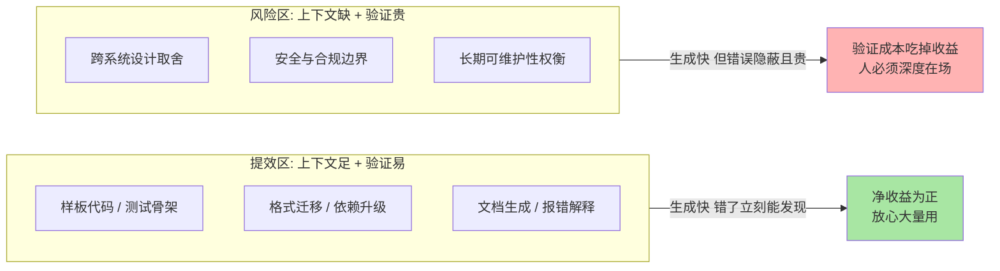
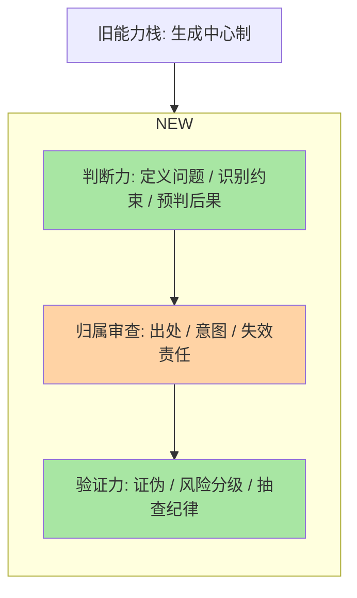
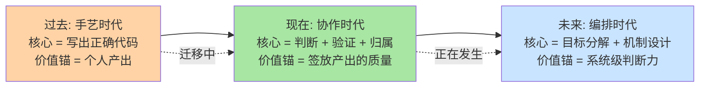

# AI 时代工程师能力模型：哪些能力在增值（入门）

> **一句话摘要**：AI 接管「生成」之后，工程师的价值向两端迁移——上游的「判断」（定义问题、审查归属、做取舍）与下游的「验证」（证明结果正确、安全、可维护）在增值，中间的「纯产出」在贬值；能力栈的重心从「怎么写出来」转向「怎么为结果负责」。

> **本文核心**：把工程师工作拆成「定义问题 → 生成方案 → 验证结果 → 承担后果」四段，AI 正在以肉眼可见的速度吃掉第二段，而第一、三、四段的稀缺性同步上升——因为它们的责任主体无法外包给模型。组织主线是能力栈的**重心迁移**：从「写出代码的能力」迁移到「为代码的正确性、安全性、演进性背书的能力」。**机制链**：生成成本趋零 → 产出数量不再稀缺 → 判断力（做什么、值得做）与验证力（对不对、该不该上）成为新瓶颈 → 归属审查（谁为这段代码负责）成为协作与安全的新边界。本篇是「架构师软实力」系列收官篇：决策（篇 1）、写作（篇 2）、选型（篇 3）、协作（篇 4）四项能力在 AI 时代非但没有贬值，反而因为「判断与验证」的增值而集体升值——软实力恰好长在 AI 吃不掉的那几段上。

## 一句话摘要

「AI 会不会取代工程师」是个问错的问题——更准的问法是「工程师工作里的哪些环节正在被替代，剩下的环节价值如何变化」。把一天的工作摊开看：写样板代码、查语法、生成测试骨架、翻译旧代码——这些「给定问题、产出答案」的环节，AI 的完成度在快速逼近甚至超过平均水平；而「问题本身对不对」「生成的东西敢不敢上线」「上线后出事谁负责」这三个环节，AI 给不出答案，因为它们本质是**责任与判断**，不是**生成**。行业里已经有了一个越来越清晰的共识性信号（业内认知）：用 AI 武装的工程师与不会用 AI 的工程师之间，产出效率的差距在拉大；但决定这个差距归谁的，不是「会不会写提示词」这种表层技能，而是「能不能判断 AI 给的东西能不能用」这种底层能力。本篇讲的就是这套新能力模型：哪些能力在增值、怎么系统地练、以及能力栈怎么演进。

## 5W 速记卡

| 维度 | 一句话 |
|---|---|
| What | 判断力/归属审查/验证力增值、纯生成贬值的新能力栈 |
| Why | AI 吃掉「生成」环节，价值向「定义问题」与「为结果负责」两端迁移 |
| Who | 所有以「产出代码」为主要价值来源的技术人 |
| When | 从团队开始把 AI 产出直接合入主干的那个月起 |
| How | 把自己从「生成者」重新定位为「提出问题者 + 质量闸门 + 责任主体」 |

## 一、AI 协作：提效的边界在哪里

先立一条机制性的判断：**AI 是史上最强的「条件概率机器」——给定上下文，它生成最可能的延续**。这条机制决定了它提效的边界天然落在两类地方：

**提效显著的一侧：上下文充足、验证容易。** 样板代码、单元测试骨架、格式迁移、文档生成、报错解释——这些任务的共同点是「对错一眼可验」：跑一下测试就知道，错了重生成一次的成本趋近于零。在这类任务上，AI 的提效是数量级的，行业的普遍体验是「小时级工作压缩到分钟级」（业内认知）。

**风险陡增的一侧：上下文缺失、验证困难。** 跨系统的设计决策、需要业务约束的取舍、安全边界的判断、长期可维护性的权衡——这些任务的上下文在人的脑子里、在组织的沟通过程里、在「没写下来的历史」里，AI 拿不到；而它们的验证成本极高：代码能编译不等于逻辑对，逻辑对不等于设计对，设计对不等于此刻该这么做。**验证成本高的地方，生成的效率优势会被验证成本吃掉，甚至倒赔**——快速生成一百行需要三小时审查的代码，不如人工写三十行。

一个实用的自检问题：**「AI 给的这份产出，我验证它需要多久？」**——验证时间接近或超过生成时间的工作，用 AI 要按「风险区」纪律来；验证时间远小于生成时间的，大胆放量。这条判断把「哪里能用 AI」从信仰问题变成了算术问题。

## 二、哪些能力在增值：判断力、归属审查、验证能力

**增值能力一：判断力——决定「做什么」的能力。** 生成越便宜，选择越昂贵。当一天能产出十个方案时，「十个里哪个值得做」的价值就超过了「做出一个」。判断力在这里拆开是三个具体动作：定义问题（把模糊的不满变成可解的技术问题——篇 2 的问题段能力）、识别约束（知道哪些约束是硬的、哪些是自我设限——篇 3 的选型能力）、预判第二阶后果（这个方案上线后，半年、三年后各会变成什么样——篇 1 的决策留痕能力）。判断力无法被代理的根本原因：**它依赖组织的上下文与价值权重，而这些信息的唯一完整副本在人脑与组织的交往史里**。

**增值能力二：归属审查——决定「谁为它负责」的能力。** 这是最容易被低估的一项。AI 产出合入代码库的那一刻，责任必须落到一个具体的人身上——出了安全漏洞、性能事故、许可证纠纷，找不到「模型负责」的机制（业内普遍共识：当前法律与工程实践都指向使用者担责）。归属审查在实践里是三个清单：这段代码的**出处可查吗**（AI 生成痕迹、可能的训练数据污染、许可证风险）；**意图可溯吗**（为什么存在这段代码，指向哪条需求或哪条 ADR）；**失效有人接吗**（半年后它坏了，谁有能力也有义务修）。团队的代码评审流程因此多了一个维度：评审者不只是 reviewer，还是**归属确认人**——签字的那一刻，这段代码就成为你的。

**增值能力三：验证能力——决定「敢不敢上」的能力。** AI 把生成的边际成本打到趋零后，验证成为整个生产链条的瓶颈环节，验证能力自然增值。它不是一个技能而是一套组合：快速证伪的能力（用最小成本构造出「这份产出错了」的证据——测试、类型、契约校验都是证伪工具）；风险分级的能力（哪些产出可以轻验证直接用、哪些必须重验证）——本质是篇 3 的「不可逆性决定审慎程度」在 AI 产出上的应用；以及批判性抽查的能力（对 AI 产出保持「默认存疑、按比例抽查」的纪律，而不是全盘接受或全盘怀疑）。

值得点破的设计思想：这三项能力不是并列的新技能，而是同一个身份转换的三个侧面——**从「生产者」转为「质量闸门 + 责任主体」**。生产时代你的产出就是你；闸门时代你的产出是「经过你签放的产出流」的质量分布。

## 三、AI 协作的风险：三个真实失效模式

**失效模式一：自动化偏见（automation bias）。** 人对机器产出有天然的让权倾向：一段代码看起来足够专业，审查的严格度就不自觉下降。机制上的对冲是把「抽查」制度化而不是靠自觉：比如规定 AI 产出合入前的最低审查清单（依赖来源、异常路径、权限边界三项必查），让纪律替代注意力。

**失效模式二：技能空心化。** 长期只审不写，底层能力会退化——而审查能力恰恰依赖你曾经会写：你无法可靠地审查超出你自己能力上限一个量级的代码。机制上的对冲是「留一块自留地」：保持一定比例的从零手写练习（算法、底层组件、新语言），像运动员保持基础体能一样。

**失效模式三：上下文幻觉的连带污染。** AI 会以流畅的口吻输出看似合理但不存在的 API、不存在的配置项、错位的版本特性——这类错误混入文档与代码后，会误导后来的开发者与后来的 AI，形成污染循环。机制上的对冲是给 AI 喂真实上下文（本仓库的真实接口与 ADR），并要求它标注不确定的部分——**用可溯源的上下文压缩幻觉空间**。

三种失效模式的共同底层规律：**风险不在 AI 错，而在「错了但组织没有发现机制」**。所以防线全部是组织性的：审查清单、抽查比例、上下文管理——这也是为什么说 AI 时代的个人能力必须长在团队的机制上。

## 四、不同经验阶段的 AI 协作策略：约束驱动解法

AI 协作的最优姿势对经验阶段极其敏感，同一套用法对新手是电梯，对老手是杠杆，错位使用各有各的危险。每一档的约束来源不同，思考方式也不同：

- **入门期工程师（经验以万行代码计）**：这一档的核心问题是「建立判断的底座」，而不是「产出速度」——约束来源是你还没有足够的能力储备去审查 AI 的产出，此时放量的 AI 依赖等于把能力建设外包给了黑盒。思考方式是底座驱动：AI 当讲师不当枪手——让它解释代码、出练习题、陪你调试，但关键路径自己写；为什么不用 AI 直接写作业？因为审查能力来自写作能力，此时省下的每一小时都是未来要还的高利贷。
- **成长期工程师（独立交付一个模块到百万级日请求系统的子系统）**：这一档的核心问题是「提效与留手的平衡」——约束来源是你已具备审查多数产出的能力，风险区在高阶设计决策。思考方式是分区驱动：提效区（测试、样板、迁移）放量用 AI，风险区（接口设计、容量取舍、安全边界）AI 只当陪练——让它列方案与反方案（为什么不用 X），判断签在自己手里。
- **成熟期技术负责人（亿级请求平台、跨团队职责）**：这一档的核心问题是「组织级的质量闸门设计」——约束来源是你签放的不是自己的代码，而是全团队的 AI 增强产出流。思考方式是机制驱动：设计归属审查流程、AI 产出的最低验证标准、上下文资产（ADR、接口文档）的维护机制——个人能力此时只有沉淀为团队机制才产生杠杆（篇 4 的标准与平台建设是同一个原理）。

**一句话的量级 Trade-off 意识**：入门期 AI 当讲师省的是弯路，成长期 AI 当陪练省的是重复劳动，成熟期 AI 当流水线省的是全团队的生成时间——错档使用：新手拿黑盒当捷径是自断根基，老手只把 AI 当搜索是浪费杠杆。

## 五、与「学新框架」的区别辨析

面对 AI 浪潮，最常见的策略误用是把它当成「又一个要学的新框架」——两者的学习对象与学习回报结构有本质区别：

| 维度 | 学新框架 | 建 AI 协作能力 |
|---|---|---|
| 学习对象 | 确定的 API 与概念 | 不确定的人机分工边界 |
| 回报曲线 | 会了即受益，一次投入 | 持续调整，随模型能力演进重新校准 |
| 贬值速度 | 框架更替时归零 | 判断与验证能力随经验复利 |
| 失效方式 | 版本升级 | 能力边界漂移（今天不能做的明年能做了） |

框架知识会被 AI 大幅压缩获取成本（问一下就有），但「知道什么时候该信 AI、什么时候必须自己来」的校准能力，只能靠自己长期积累——这个区别决定了两者的投入配比：**框架按需学，校准持续练**。这也是能力栈演进的微观机制：每次 AI 产出与你的判断出现分歧时，花五分钟搞清楚「是我错了还是它错了、为什么」——这五分钟就是校准训练本身，比任何教程都贵重。

## 六、能力栈的演进路径：一张五年视角的演进图

把时间轴拉长，能力栈的重心迁移可以画成一条清晰的演进线（下图为经验认知的归纳，非预测承诺）：

**演进的可操作路线**——不分阶段空谈「转型」，按可执行的顺序排：

1. **第一步（本月可做）**：给自己的工作做一次 AI 分区——列出本周任务，逐个标注「提效区/风险区」，提效区放量，风险区人工主导。这一步的成本是一次下午的自省，收益是立刻开始积累分区经验
2. **第二步（本季度）**：把验证能力产品化——为团队沉淀 AI 产出的审查清单与抽查机制，个人的批判性眼光变成团队的质量闸门。这一步同时是影响力建设（篇 4）：你的清单被采用的范围，就是你的横向影响力半径
3. **第三步（今年）**：把判断力资产化——坚持写 ADR 与方案文档（篇 1、篇 2），让每个判断留下可复盘的记录。判断力的复利来自复盘，复盘的原材料是留痕
4. **持续项**：保持一块手写自留地防技能空心化；保持对模型能力边界的定期重测——今天的边界明天就漂移，校准是一辈子的日常

这条路线的底层逻辑与整个系列一脉相承：**AI 越强，篇 1 到篇 4 的软实力越值钱**——决策、写作、选型、协作，全部长在「定义问题、做出取舍、为结果背书」这一侧，也就是 AI 吃不掉的那一侧。

## 七、典型使用场景

- **日常开发提效**：测试骨架、样板代码、依赖升级、报错排查的第一手线索——提效区放量，按抽查纪律审查
- **学习加速**：让 AI 讲解陌生模块、出练习题、模拟评审对手——把它当「随叫随到的陪练」而不是「代写者」
- **文档与方案起草**：方案初稿、会议纪要、ADR 的格式整理（篇 2 的六段骨架交给 AI 填充，判断由你注入）
- **团队机制建设**：AI 产出的归属审查流程、验证标准、上下文资产管理——成熟期技术负责人的主战场

## 八、误区与不适用

- **误区一：把「会用 AI」当独立技能写进能力清单。** 「会用 AI」不是一个能力，它是既有能力的放大器：判断力强的人用它放大判断，判断力弱的人用它放大错误。单独练「提示词技巧」的收益曲线极陡地衰减——模型自己会越来越懂人话。
- **误区二：AI 产出直接合入不审查。** 「能跑就行」是 AI 协作里最贵的一句话：能跑的代码同样可能有安全边界漏洞、许可证污染、维护性灾难——这些都不是「跑」能暴露的。归属审查清单（出处/意图/失效责任）是底线机制。
- **误区三：因为风险而全面禁用。** 因噎废食的组织会输掉效率战争，且禁令挡不住员工用个人工具——正确的姿态是划定验证分级与使用边界，而不是一刀切。
- **不适用场景**：核心涉密数据、强合规边界的场景直接喂给外部模型——数据出域的合规红线高于一切效率考量（业内普遍共识），此类场景用私有化部署或干脆人工。

## 九、什么时候用/不用：一张决策卡

| 信号 | 建议 |
|---|---|
| 任务验证容易（有测试、有类型、有契约） | AI 放量生成 + 抽查审查（明确推荐起点） |
| 任务需要业务上下文与跨系统取舍 | AI 当陪练列方案与反方案，判断签字在你 |
| 数据涉密或强合规 | 外部模型禁用，私有化或人工 |
| 你尚不具备审查该产出领域的能力 | 先学后用：AI 当讲师，关键产出自己写 |

**决策原则**：用「验证成本」给任务分类，用「自身审查能力」给阶段定位——分类清楚，用与不用、怎么用，全部变成算术题而不是焦虑题。

## 你们可能会问

**Q1：AI 进步这么快，现在练的「验证能力」会不会明年就被模型自己做了？**
验证能力的核心是「为结果承担责任的意愿与上下文」，这不是模型能力问题而是责任结构问题——只要组织需要「一个人对结果负责」（而事故追责、合规审计都指向需要），验证签字权就必须在人手里。模型可能替你生成测试、替你做静态检查，但「敢不敢合入主干」的判断连同后果，机制上落不到模型头上。会贬值的是验证里的机械部分，增值的是风险分级与责任判断部分。

**Q2：团队里有经验的同事用 AI 的意愿很低，怎么推动？**
先找原因再选工具：多数抵触来自「AI 产出质量不稳定，审查它比自己写累」——这个反馈通常是对的，说明当前任务在风险区或模型能力不足，硬推只会强化抵触。有效的路径是：从对方自己公认的脏活累活切入（写测试、迁移格式、整理文档），用一次明确的提效体验换态度，再逐步进入深水区。推工具不如造体验——这与篇 4 的机制一致：改变行为靠降低对方的选择成本，不靠说服。

**Q3：怎么判断自己是不是在过度依赖 AI？**
一个自测信号：拿走 AI 后，你能否独立完成自己「签放」过的设计决策的推演？如果对近期经手的核心方案讲不清取舍与替代路径，说明判断已经空心化——产出流经了你，但没有经过你的判断。对冲动作是给核心工作保留「离线推演」习惯：方案先自己想一遍，再让 AI 补充与挑战，顺序不能反——**先有己见再借外脑，校准才有基准线**。

**Q4：外部对工程师能力的考察方式在变（越来越多转向实践与判断的评估），学习策略要不要变？**
值得先说明：本仓库只沉淀原理与方法，不沉淀应试技巧（那是另一套体系的职责），但学习策略本身值得回答：任何考察方式的变化都是结果，能力结构的变化才是原因——当生成能力被工具拉平，考察自然向判断与验证迁移。所以学习策略的答案恰好是本篇的内容：把投入从「背更多 API」移向「练判断、练验证、练归属意识」——这些能力无论考察形式怎么变，都是底层资产。

## 自测三问

1. AI 提效边界的自检问题是什么？「验证时间接近生成时间」的任务应该按什么纪律用？
2. 归属审查的三个清单是什么？为什么说评审者是「归属确认人」？
3. 三个经验阶段各自的 AI 协作核心问题是什么？入门期为什么不能把 AI 当枪手？

## 💡 实战提示

- 💡 每次把 AI 产出合入主干前过一遍归属三问：出处可查吗、意图可溯吗、失效有人接吗——三个都是「是」才签字，签字即认领
- 💡 给自己定一条「先己见后外脑」的规矩：核心方案先独立推演十分钟，再让 AI 挑战——顺序反了，你的校准基准线就没了
- 💡 每季度做一次「能力边界重测」：拿上个季度 AI 做不好的任务再试一次——能力边界在漂移，一年前画的分区图已经不可信
- 💡 把自己踩过的 AI 幻觉案例记进团队的上下文资产库——每个案例都是一条审查清单条目的原始证据，清单靠证据才能立住

## 追问思考与开放问题

**质疑者追问链**：模型能力继续跃进，「验证能力」本身会不会也被吃掉——模型自我验证、自我修正，人只看结论？——第一层追问：技术上可能吗？部分可能：自我验证已在封闭域（可自动判对错的任务）里相当成熟；但开放域（业务取舍、安全边界）的正确性没有 oracle（标准答案），验证无法在系统内部闭环。——再追问：那验证的外包边界在哪里？可以这样划：**凡是错误后果由组织承担的验证，签字权就不会离开组织**；模型可以把验证成本降到极低，但降不掉签字责任的归属——成本与责任是两个量纲。——打破砂锅问到底：如果有一天法律与组织形态真的接受了「模型担责」呢？那是制度演进问题而非技术问题——真到那一步，人的价值锚点会进一步上移到「设定目标与价值观约束」（判断力的最上游），能力栈的迁移逻辑不变，只是重心更高。

**一次排查的复盘叙事**：某团队开启 AI 辅助开发后的第一次生产故障，排查过程极具教学价值：一个 AI 生成的缓存刷新函数在正常路径上表现完美，但漏掉了一个手动触发的旁路入口——缓存与数据库的不一致在数天后才以偶发投诉的形式浮出水面。排查花了两天，因为这段代码通过了全部测试（测试也由 AI 生成，覆盖思路与实现同源，天然盲区重叠），评审者也确认「逻辑没问题」。复盘产出的改进项很值得记录：其一，AI 生成的测试必须人工补充异常路径清单（旁路入口、并发、重入）——**同源生成的测试是实现的镜子，照不出实现自己的盲区**；其二，评审清单增加一条「这段代码知道所有调用入口吗」。这次复盘之后，该团队的 AI 产出审查重点从「逻辑对不对」转向「上下文全不全」——这与本篇的判断一致：验证的瓶颈正在从逻辑验证迁移到上下文验证。

**设计思想层面的开放问题**：能力模型本身会不会失效——当 AI 全面接管「定义问题」上游（自己发现该做什么）与「验证」下游，「人」在系统里的位置还剩什么？值得讨论。可以观察到的锚点是：责任的承担者始终需要是一个可以被问责的意志主体——只要社会结构以「人」为单位分配信任与追责，能力模型再怎么演进，内核都是「把某类判断修炼到值得被托付」。模型怎么变，「值得被托付」的标准就怎么变——这或许是理解所有职业演进的元设计思想。

## Trade-off 与取舍分析

AI 协作的每个选择都在「效率」与「能力存量」之间做跨期取舍：今天让 AI 全包，本季度产出最大化，代价是验证能力与底层手感的钝化——而这两样恰恰是未来审查 AI 产出的本钱；反过来，坚持事必躬亲，能力扎实，代价是在效率竞赛中掉队，且掉队者的审查能力同样会因缺乏实战校准而退化。团队层面的取舍结构相同：全面放开 AI 是拿质量风险换速度，全面收紧是拿速度换安全，两者都会输给「分区管理 + 分级验证」的中间路线——但中间路线的实施成本（清单、抽查、归属流程）比两个极端都高，这正是它稀缺的原因。**取舍的锚点依然是「不可逆性」与「验证成本」**：可逆且易验证的任务把效率拉满，不可逆或难验证的任务把人的判断前置。最后是那个贯穿整个系列的取舍公理在 AI 时代的变体：工具改变的是能力的价格，不改变能力的定义——判断与责任从来都贵，只是 AI 让它们的价格变得更显眼。

## 🎯 核心带走

- **核心一句话**：AI 吃掉「生成」，工程师的价值向「判断（做什么）—归属（谁负责）—验证（敢不敢上）」三处迁移，能力栈重心从个人产出转向签放产出的质量
- **机制链**：生成成本趋零 → 产出不再稀缺 → 验证成为瓶颈 → 归属审查成为安全与协作的新边界 → 个人能力沉淀为团队机制才产生杠杆
- **失效点/边界**：验证成本高于生成成本的任务慎用 AI；同源测试照不出同源盲区；先己见后外脑才有校准基准；涉密数据出域是红线不是取舍

## 📌 数据与事实声明

- 写于 2026-09-17，L1 入门层概念篇，系列收官篇
- 「提效差距在拉大」「使用者担责的行业共识」「自动化偏见」等为业内普遍认知与公开研究领域的常见结论概括，未引用具体统计数字；文中叙事均已匿名化为通用场景，未引用任何公司内部数据
- 能力栈演进路线为经验认知的归纳，不构成对未来的预测承诺

## 📚 参考资料

| 类型 | 标题 | 来源 |
|---|---|---|
| 系列内 | 架构决策与 ADR 方法（篇 1） | [1_架构决策与ADR方法-入门.md](1_架构决策与ADR方法-入门.md) |
| 系列内 | 技术方案写作（篇 2） | [2_技术方案写作-入门.md](2_技术方案写作-入门.md) |
| 系列内 | 技术选型方法论（篇 3） | [3_技术选型方法论-入门.md](3_技术选型方法论-入门.md) |
| 系列内 | 跨团队协作与技术影响力（篇 4） | [4_跨团队协作与技术影响力-入门.md](4_跨团队协作与技术影响力-入门.md) |
| 公开研究 | 自动化偏见（automation bias）相关研究 | 人因工程领域公开文献 |
| 相关系列 | 从零开始认识AI系列（模型与 Agent 概念） | [0_系列导读-全景.md](../../../ai/入门层/从零开始认识AI系列/0_系列导读-全景.md) |
