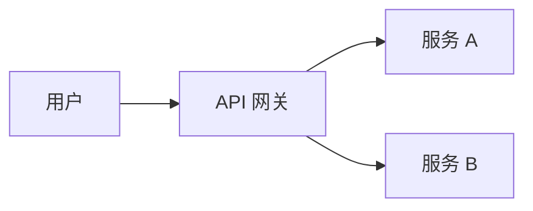

# 图片规范

> 文章里的图片怎么放、怎么处理、怎么引用。

## 两种来源

文章配图分两种来源，**两种都要支持**：

| 来源 | 适用场景 | 优缺点 |
|---|---|---|
| **本地图片**（仓库内） | 核心架构图、自绘流程图、需要长期保留的图 | ✅ 永久有效、跟随版本<br>❌ 仓库体积变大、PR 改动大 |
| **外部图床**（远程 URL） | 一次性截图、临时补充、第三方文档原图 | ✅ 不占仓库体积、上传快<br>❌ 图床失效风险、版本不可控 |

**默认本地，按需远程**：核心内容（架构、流程）用本地；一次性截图（某次报错、某次调试）可用图床。

## 本地图片：目录结构

```
docs/
└── public/
    └── images/
        ├── article/         ← 文章配图（按分类子目录）
        │   ├── backend/
        │   │   ├── restful-status-codes.png
        │   │   └── distributed-id-flow.svg
        │   ├── devops/
        │   │   ├── cicd-pipeline.svg
        │   │   └── kubernetes-arch.png
        │   └── ...
        └── global/          ← 跨文章复用的图（Logo、占位、通用图示）
            └── knowledge-graph-icon.svg
```

**`docs/public/` 是 VitePress 静态资源根**，目录下的文件会被自动部署到 GitHub Pages。

引用时路径前缀是 `/images/...`（不带 `docs/public/`，VitePress 自动展开）。

## 外部图床：元数据规范

外部图床不存仓库，但**要在文章 frontmatter 里登记元数据**，便于失效时追溯。

### 1. frontmatter 字段约定

```yaml
---
title: 某文章
images:
  - src: https://cdn.example.com/screenshot-2025-07-25.png
    alt: 报错截图
    srcset:                    # 可选，响应式图片
      - https://cdn.example.com/screenshot-mobile.png 480w
      - https://cdn.example.com/screenshot.png 1200w
    type: screenshot           # 类型：screenshot / diagram / photo / icon
    source: postman            # 来自哪个工具/文档
    expires: 2026-07-25        # 可选，预期有效日期
    backup: /images/article/backend/backup-screenshot.png  # 可选，仓库内备份
---
```

### 2. 引用语法（用 frontmatter 变量）

```markdown
<!-- 引用单张图 -->


<!-- 带响应式 -->
<picture>
  <source srcset="{{ images[0].srcset[0] }}" media="(max-width: 600px)">
  
</picture>
```

**好处：** 图床失效时，只需修改 frontmatter，不动正文。

## 引用语法速查

### 本地图片（默认推荐）

```markdown

```

### 外部图床

```markdown
<!-- 直接 URL（简单） -->


<!-- 通过 frontmatter（推荐，便于追溯） -->

```

### 带 caption

```markdown

```

### 暗色 / 浅色双版本（本地）

```markdown
<picture>
  <source media="(prefers-color-scheme: dark)" srcset="/images/article/backend/restful-status-codes-dark.png">
  
</picture>
```

## 格式选择

| 场景 | 推荐格式 | 理由 |
|---|---|---|
| 截图（UI、终端、IDE） | **PNG** | 无损、清晰 |
| 照片、复杂插画 | **JPG** | 体积小 |
| 矢量图、图标、流程图 | **SVG** | 体积最小、可任意缩放 |
| 架构图、流程图、时序图 | **Mermaid** | 可复制、可修改、自动适配主题 |
| 动图 | **WebP** | 比 GIF 小 60%+ |

**避免：** 用 Word/PPT 直接导出图片（体积大、质量差）。

## 大小限制

### 本地图片

- 单张图 **不超过 300 KB**
- 单篇文章图片总大小 **不超过 1 MB**
- 超大图先用 [tinypng](https://tinypng.com/) 或 [svgo](https://github.com/svg/svgo) 压缩

### 外部图床

- 不限制大小（图床扛得住）
- 但**单张超过 1 MB 的截图必须先压缩再上传**

## 命名规范

```
{category}-{slug}.{ext}

restful-status-codes.png       ✅
devops-cicd-flow.svg           ✅
backend/分布式-id-generator.png ✅  （子目录按分类）

RESTful 状态码.png             ❌  （中文文件名 GitHub Pages 乱码）
RESTfulStatusCodes.png         ❌  （驼峰不统一）
Screenshot 2025-07-25.png      ❌  （带空格、随意）
```

## 暗色 / 浅色适配

文章里的图片分两种：

### 1. 内容图（不依赖主题）

- 截图、终端输出、照片、矢量流程图 → **只要一个版本**
- 截图保留原样（深色背景下输出深色截图，浅色背景下输出浅色截图，按文章主题选）

### 2. 主题相关图（背景色跟随主题）

- 颜色块、UI mockup、code 高亮截图 → **要两个版本**
- 文件名后缀 `-dark.png` / `-light.png`
- 用 `<picture>` 标签自动切换

## Mermaid 优先

能用 Mermaid 画的图（VitePress 1.x 原生支持）：

- 架构图、流程图、时序图、类图、状态图、甘特图、思维导图（用 `flowchart`）

```markdown

```

**好处：** 不用维护图片文件、可复制、跟随主题、可访问性更好。

## 何时用哪种

```
需要这张图吗？
│
├── 是核心内容（架构/流程/概念图）
│   └── 仓库内 SVG / Mermaid
│
├── 是临时截图（某次报错/某次操作）
│   └── 外部图床（带 frontmatter 元数据）
│
├── 是 UI mockup / 主题相关图
│   └── 仓库内 dark+light 双版本
│
└── 是其他文档的原图
    └── 外部 URL + 标注来源
```

## 优化 checklist

提交前：

- [ ] **本地图**：命名符合规范（小写 + 连字符 + 分类前缀）
- [ ] **本地图**：大小 < 300 KB（单张）
- [ ] **本地图**：主题相关图有 dark/light 双版本
- [ ] **所有图**：有清晰的 alt 描述
- [ ] **架构类图**：优先用 Mermaid
- [ ] **外部图**：frontmatter 登记元数据（src / alt / type / source）
- [ ] **外部图**：单张 > 1MB 先压缩

## 禁止事项

- ❌ **不要**把图片提交到 `docs/{category}/` 子目录（不会被 VitePress 部署）
- ❌ **不要**用绝对路径或 `../../`（构建时会 404）
- ❌ **不要**直接用 base64 嵌入（HTML 体积爆炸）
- ❌ **不要**用中文文件名（GitHub Pages 会乱码）
- ❌ **不要**用「不靠谱」的免费图床（如微博、QQ 空间）—— 失效概率高

## 相关

- [UI 设计规范](./ui-design.md) — 图片相关的 UI 设计约束
- [示例代码链接规范](./code-example-link.md) — 截图里包含代码时的处理
