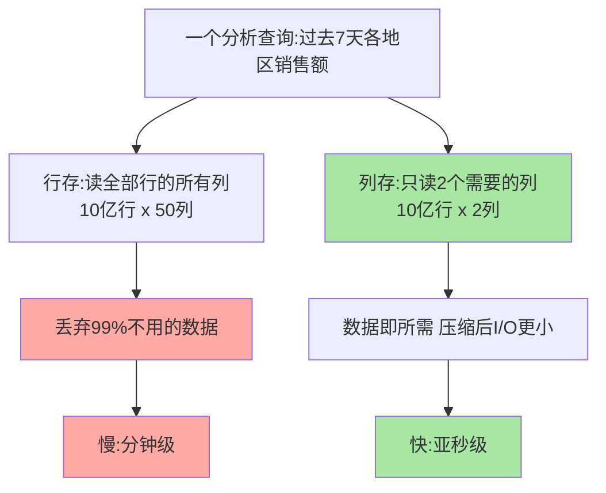
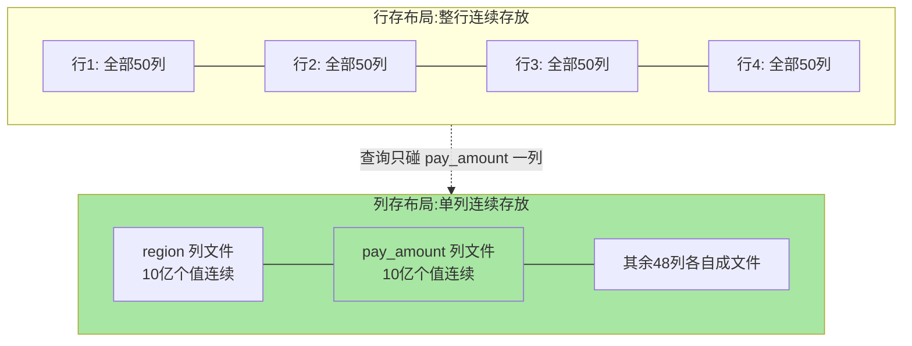

# ClickHouse 是什么与 OLAP 革命：列存为什么快

> 一句话：ClickHouse 是开源列式 OLAP 数据库——把「分析查询快百倍」的赌注押在列存 + 向量化执行上，为「亿级行、宽表、只查少数列」的聚合统计而生。

## 🎯 本文核心

**核心一句话：ClickHouse 快的底层原理 = 列存——数据按「列」而非「行」落盘，分析查询只读需要的列（I/O 降一到两个数量级），同列数据类型一致使压缩率飙升（进一步减少 I/O），再配向量化执行（一批值一次 CPU 运算）——三者相乘得出「百倍」差距。**

一图看懂本篇主线：



组织主线（四段全挂这条线）：分析查询与事务查询是两种生物 → 列存是分析场景的物理最优解 → 向量化执行是列存的 CPU 红利 → 但列存的代价决定了它的边界。

## 一句话摘要

ClickHouse 是 Yandex 开源（2016 公开）的列式 OLAP 数据库：**建表时每列的数据连续存放在一起**，分析查询（扫描聚合亿级行）只碰用到的列；行式数据库（MySQL 等）则把整行连续存放，分析查询哪怕只算一列总和也要把所有行读出来。业内认知下，同样的聚合查询列存比行存快一个到两个数量级（几十到上百倍），公开口径中 ClickHouse 官方基准里单表每秒可处理数亿行的扫描聚合。它**不支持事务、不擅长高频点查与频繁更新**——它不是「更快的 MySQL」，而是「另一种数据库」：OLAP（在线分析处理）赛道上的专用武器，与 OLTP（在线事务处理）分属两个物种。

## 一、为什么需要它：分析查询与事务查询是两种生物

先看两个真实形态的查询，感受「两种生物」的分野。

**事务查询（OLTP）**：电商下单，按主键取一行、改两个字段、提交——

```sql
-- OLTP:单行点查 + 小事务
SELECT * FROM orders WHERE order_id = 10086;
UPDATE orders SET status = 'PAID' WHERE order_id = 10086;
```

特征：碰 1 行、要求强一致、毫秒内完成、并发数万 QPS。

**分析查询（OLAP）**：数据团队要「过去 7 天各地区的支付金额与订单量」——

```sql
-- OLAP:亿级行扫描聚合 只碰3列
SELECT region, sum(pay_amount) AS total, count() AS cnt
FROM orders
WHERE pay_time >= now() - INTERVAL 7 DAY
GROUP BY region;
```

特征：碰 10 亿行、只关心 3 列（`region / pay_amount / pay_time`）、无事务、允许秒级甚至亚秒级延迟、并发通常只有个位数到几十。

同一张 50 列的 orders 表、10 亿行数据，两类查询对存储引擎的诉求完全相反：OLTP 要「按主键快速取整行 + 高并发小事务」，OLAP 要「海量行 × 少数列的扫描吞吐」。用一个引擎同时服务两者，结果是两头都做不好——这就是 OLAP 数据库（ClickHouse、Doris 等）存在的理由。

## 二、列存的底层原理：为什么分析查询快百倍

追问：同样是磁盘扫描，为什么「按列存」就能快百倍？把账算到底，红利有三层。

### 红利一：I/O 只买需要的列

先看两种布局在磁盘上的真实形态——同一张 orders 表的 4 行数据：



分析查询通常只碰宽表的 5%-10% 的列（业内认知）。行存下数据库的最小读取单元是「行页」——读 `sum(pay_amount)` 也必须把每行的用户名、地址、商品描述全部读进内存再丢弃；列存下每列独立成文件，只读 `pay_amount` 一列的数据文件。**磁盘 I/O 直接除以列数**：50 列的表，无效 I/O 从 98% 归零。

### 红利二：同列数据压缩率飙升

追问：只读一列，数据量还是 10 亿个值，够快吗？再深一层看列存的物理形态：**同一列里数据类型一致、模式相似**（金额都是数值、状态都是有限枚举、时间戳单调递增），压缩算法的命中率极高。业内常见量级：行存压缩 2-3 倍，列存可到 5-10 倍以上（公开口径，取决于数据分布）；ClickHouse 默认对每列按 8192 行一个批次做压缩，时间戳列配合专用编码能压得更狠。压缩不仅省磁盘——**查询时解压的数据量也少了 5-10 倍，I/O 是第一瓶颈的分析查询直接受益**。

### 红利三：向量化执行——CPU 按批次算

传统行存引擎逐行处理（火山模型：每次迭代吐一行、做一次函数调用），CPU 大部分时间花在函数调用与分支跳转上。ClickHouse 按列成批处理：一批（默认 8192 个值）连续内存一次性做 SIMD 运算——一条 CPU 指令处理多个值，缓存命中率与指令吞吐都拉满。列存与向量化是天然一对：**数据按列连续存放，才有「一批同构值」可供向量化**——这就是两者的设计思想：存储布局为执行模型服务。

三层红利相乘（I/O 除以列数 × 压缩 5-10 倍 × CPU 每指令多值），得出业内普遍体验的「几十到上百倍」差距。三者不是并列的锦上添花，而是列存这一个存储决策在 I/O、压缩、CPU 三层的连锁收益。

## 三、与行存 OLTP 的区别：一张表看清分界

| 维度 | 行存 OLTP（MySQL 等） | 列存 OLAP（ClickHouse） |
|---|---|---|
| 物理布局 | 整行连续存放 | 单列连续存放 |
| 典型查询 | 按主键取 1 行、小事务 | 扫亿行聚合、全表统计 |
| 读取成本 | 取整行快，扫聚合慢 | 聚合快，取单行全列反而要拼 N 个列文件 |
| 写入模式 | 单行增删改、高并发小事务 | 批量追加为主（万行/批次级） |
| 事务 | ACID 完整支持 | 无完整事务（业内认知：以原子性与最终一致换吞吐） |
| 更新/删除 | 随时 | 变更通过重写/标记实现，高频更新是禁区 |
| 并发画像 | 数万 QPS 小查询 | 个位数并发的大扫描 |
| 数据规模舒适区 | 千万行级单表 | 亿到万亿行级单表（公开口径） |

一个「排查复盘」的实战视角：曾在线上遇到一次报表慢查询复盘，同一条聚合 SQL 在从库 MySQL 跑了 90 秒，迁到列存库后同数据量亚秒级返回——复盘结论不是「MySQL 不行」，而是「把 OLAP 查询放错了引擎」：90 秒里绝大部分时间在读永远不用的列。分清两种生物，选型就赢了一半。

> 💡 **实战提示**
> - 判断一个查询是不是 OLAP：看「碰多少行 × 用多少列」的比值——碰百万行以上、用列少于 10%，就是列存的主场
> - 不要拿 ClickHouse 当业务主库：无完整事务 + 不擅长点查，订单/账户类数据仍归 OLTP 库，分析侧另建列存副本
> - 宽表设计天然利好列存：把常用分析维度冗余进一张大宽表，查询少 JOIN、列存收益最大

## 四、5W 速记卡

| 维度 | 一句话 |
|---|---|
| What | 开源列式 OLAP 数据库：列存 + 压缩 + 向量化执行 |
| Why | 亿级行宽表的聚合分析，行存慢百倍的痛点 |
| When | 实时数仓、日志/行为分析、报表聚合 |
| Where | 独立集群（多副本/分片），常接 Kafka/Mysql 同步链路 |
| How | 建表选 MergeTree 引擎族，批量写入，SQL 查询 |

## 五、典型使用场景

- **用户行为分析**：埋点事件流水（亿级/天），按「渠道 × 日期 × 事件」多维聚合漏斗与留存
- **日志/审计分析**：应用日志与审计流水入列存库，按时间范围 + 服务名过滤统计，替代「翻日志文件」
- **实时报表与大屏**：交易/流水的分钟级聚合看板，秒级刷新
- **广告/风控明细查询**：亿级明细的任意维度下钻（配合物化视图预聚合）
- 量级分档一句话：十万行级用 MySQL 聚合就够；千万到亿级必须上列存；十亿级以上要叠加分片与预聚合——量级决定架构，不要为想象中的量级预付复杂度。

## 六、常见误区与代价

- ❌ **「ClickHouse 是更快的 MySQL」**：它无完整事务、高频更新/删除代价极高（触发后台重写）、单行点查反而不如行存——把它当业务库是架构错位
- ❌ **「列存全面碾压行存」**：按主键取整行（`SELECT *` 单行）时，列存要打开几十个列文件再拼接，反而慢——每种布局只对一类查询是最优
- ❌ **「快是免费的」**：代价是 JOIN 能力弱（业内认知：大表 JOIN 需谨慎设计）、更新贵、并发低——换来的正是上面那三层红利
- 常见踩坑：业务直接往明细表高频 UPDATE 同步数据，后台 merge 风暴拖垮集群——同步链路应改为批量追加 + 版本标记

## 七、什么时候用与不用：明确推荐

- **什么时候用**：数据以追加为主、查询以大范围聚合为主、表宽且单查询碰列少、数据量千万级起步——四条满足即**明确推荐**列存库，ClickHouse 是社区最活跃的选择之一（公开口径：GitHub star 数在分析型数据库中居前列）
- **什么时候不用**：需要强事务（订单交易主库）、高频更新同一行（库存扣减）、按主键高并发点查（用户详情页）、并发数千的在线服务——回到 OLTP 库或 KV/搜索系统
- **怎么与其他存储配合**：典型分工是「MySQL 存业务事实 → CDC/批量同步 → ClickHouse 承接分析，Redis 挡热点，ES 承接全文检索」——各引擎只做自己物理布局最优的那一类查询

## 八、Trade-off：列存这一注押了什么、放弃了什么

列存的设计取舍：**押注「分析查询只读少数列」这一统计规律，放弃「任意访问整行都便宜」的通用性**。得到的：I/O、压缩、CPU 三层红利；放弃的：点查效率、事务能力、更新友好度。反方案分析——「为什么不用行存加缓存扛分析？」如果不改布局只加缓存，第一次扫全表的查询仍然要把无效列读一遍，缓存在亿级扫描下命中率与收益都撑不住；「为什么不用数据仓库批量 T+1 出报表？」传统数仓能满足准确性，但牺牲实时性——ClickHouse 补的正是「秒级延迟的交互式分析」这个生态位。每一档选型都是约束下的取舍，不存在全能引擎。

## 九、你们可能会问

**Q1：向量化执行能一句话讲清吗？**
能：CPU 不再「一次算一个值」，而是「一批值（如 8192 个）装进连续内存、用 SIMD 指令一次算多个」——把函数调用的开销摊薄到批次里。它依赖列存提供连续同构数据，所以是列存的红利而非独立黑科技。

**Q2：ClickHouse 快百倍，为什么不全公司都换它？**
因为「百倍」只在聚合扫描场景成立。换掉 OLTP 主库，点查变慢、事务没了、高频更新直接不可用——选型按查询形态分引擎，不按「谁最快」一刀切。

**Q3：数据怎么进 ClickHouse？还是像 MySQL 那样业务直写吗？**
主流不是直写：常见链路是 OLTP 库经 CDC 上下游工具（如基于 binlog 的同步组件）或 Kafka 批量灌入，攒批写入（业内建议每批至少万行级）发挥其追加吞吐优势——高频小批量写入是新手第一大坑。打破砂锅再问一层：为什么不能小批量高频写？因为每次写入都会产生一个待合并的数据部件，写入越碎、后台合并压力越大——这是篇 2「合并树」要展开的机制。

## 十、开放问题

- 实时 OLAP 赛道上 ClickHouse、Doris、StarRocks 的边界在互相渗透：过去 5 年里三者围绕存算分离、湖仓一体持续演变，两年后的选型结论可能不同
- 「HTAP（混合事务分析）」试图用一个引擎同时服务两种生物——是融合趋势还是工程妥协，业内尚无定论

## 十一、自测三问

1. 同一条聚合 SQL，列存比行存快百倍的三层红利分别是什么？哪一层是根因？
2. 一个查询满足什么特征才算 OLAP？举一个「看似分析、实为 OLTP」的反例。
3. ClickHouse 代价清单里，哪三条最容易被新团队低估？

下一篇讲「表引擎与 MergeTree 家族」：合并树思想与 LSM 的亲缘关系、分区/排序键/稀疏索引怎么协作、副本怎么保数据安全。

## 🎯 核心带走

- **核心一句话**：ClickHouse = 列存 + 压缩 + 向量化——为「亿级行宽表 × 只查少数列 × 大范围聚合」而生，快来自存储布局而非玄学
- **主线**：两种查询生物 → 列存三层红利 → 与 OLTP 分界表 → 场景与边界
- **哪里会坏**：当业务库用（事务/更新/点查）、高频小批量写入、按列存短板设计查询
- **边界**：本篇是定位与原理层；引擎与建表在篇 2，选型对比在篇 3

## 📌 数据与事实声明

- 写于 2026-09-24；列存原理以 ClickHouse 官方文档（clickhouse.com/docs）公开口径为准
- 「快几十到上百倍」「压缩 5-10 倍」「8192 行批次」为业内经验认知与官方文档公开参数，按数据分布与版本实测
- 免责：性能数字随硬件、数据分布、版本演进变化，以官方基准与自测为准

## 📚 参考资料

| 类型 | 标题 | 来源 |
|---|---|---|
| 官方文档 | ClickHouse Documentation（Why is ClickHouse so fast? 章） | clickhouse.com/docs |
| 公开论文 | MergeTree 相关设计见官方博客与公开技术分享 | clickhouse.com/blog |
| 同类引擎 | Apache Doris / StarRocks 官方文档 | doris.apache.org / starrocks.io |
