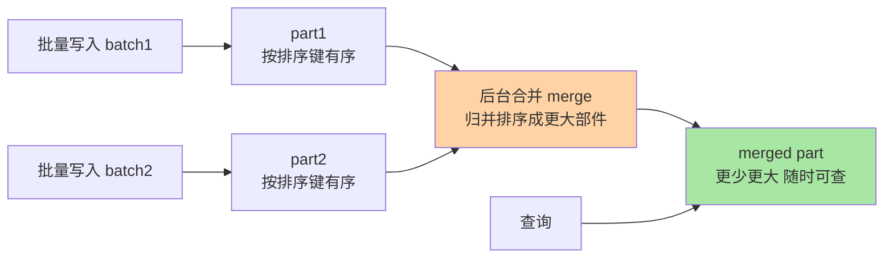
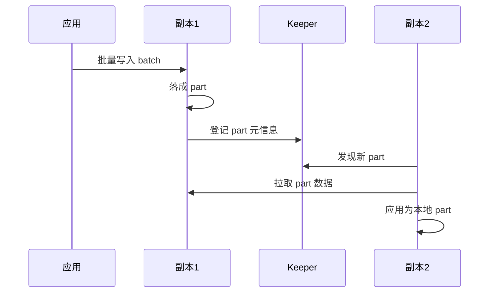

# 表引擎与 MergeTree 家族：合并树思想与稀疏索引

> 一句话：ClickHouse 里「表引擎」决定一张表的一切物理行为——MergeTree 家族用「批量写入数据部件 + 后台异步合并」换来了极致的写吞吐与扫描速度，是 90% 以上场景的建表答案（业内认知）。

## 🎯 本文核心

**核心一句话：MergeTree = 「写入时不动存量、每次写入生成一个已按排序键排好序的数据部件（part），后台再把小部件异步合并成大部件」——牺牲实时有序换写入吞吐；分区键负责物理裁剪、排序键决定部件内数据序、稀疏索引每 8192 行插一个路标，三者叠加让查询「先切分区、再定位部件、最后只扫目标粒度段」。**

一图看懂写入与合并主流程：



组织主线：为什么需要合并树（写入矛盾的解法）→ 建表四要素（真实 DDL 逐个拆）→ 稀疏索引怎么定位 → 副本怎么保命 → 引擎家族怎么挑。

## 一句话摘要

ClickHouse 用「表引擎」组织一张表的存储与行为：`MergeTree` 家族（合并树）是绝对主力（公开文档口径：生产表绝大多数由它及其变体承载）。它的机制与 LSM 树是亲缘——**数据先不追求全局一份有序大文件，而是每批写入直接落成一个「按排序键有序」的小数据部件，后台持续把小部件归并成大部件**；查询时按分区裁剪 + 排序键 + 稀疏索引（默认每 8192 行一个索引标记）三级漏斗，把亿级扫描缩到目标数据段。代价与 LSM 同源：合并是异步的（读到的是「最终合并」状态）、更新/删除靠标记重写（`ALTER ... DELETE` 类操作异步生效）、频繁小批量写入会引发合并风暴。`ReplicatedMergeTree` 在此之上加多副本：基于 ZooKeeper/Keeper 协调，数据部件在副本间拉取同步——单机坏了数据不丢，这是生产标配（业内共识）。

## 5W 速记卡

| 维度 | 一句话 |
|---|---|
| What | 表引擎决定表的物理行为；MergeTree 家族 = 追加 part + 异步合并 |
| Why | 列存要有序与批量，但高吞吐写不起随机插——合并树解这个矛盾 |
| When | 明细/流水/日志类追加型表；去重与预聚合选家族变体 |
| Where | 单机版 MergeTree；生产用 ReplicatedMergeTree（Keeper 协调） |
| How | 建表定四要素：引擎 / 分区键 / 排序键 / 索引粒度 |

## 一、为什么需要合并树：写入矛盾的解法

矛盾：列存要求「数据按列连续、按排序键有序」才好吃到压缩与扫描红利，但「每来一行就插到有序文件的正确位置」是 B+ 树式的随机写——高吞吐写入下性能崩塌。

MergeTree 的解法（合并树的设计思想）：**放弃实时全局有序，接受「许多个各自有序的部件」这一中间态**。每次写入（建议万行级批次）直接生成一个不可变的 part 文件组——落盘即有序、不可变即可并发读；后台线程把小 part 归并排序成大 part，逐步收敛到「少量大部件」的理想形态。这正是 LSM 树「内存写 + 后台 compaction」思想的磁盘直用版——两者共同的取舍是：**用后台合并的计算开销，换前台写入的顺序性**。

追问：既然是「最终合并」，查询会不会读到中间态的不一致？会看到多个 part 共存，但 ClickHouse 保证查询是「当前所有可见 part 的并集」且单个 part 原子可见——业务感知是最终一致而非丢数据。再追问一层：合并到一半机器宕机，part 会不会写坏一半？合并产物先写临时目录、成功后原子改名——半成品不会被查询看见，这是 part 不可变设计的附带红利。打破砂锅再问一层：如果写入持续快于合并会怎样？part 数量堆积（`too many parts` 报错）、写入被拒绝——这就是篇 1 说的「高频小批量写入是第一大坑」的机制根源。

## 二、建表四要素：一张真实 DDL 逐个拆

```sql
CREATE TABLE orders
(
    order_id   UInt64,
    region     LowCardinality(String),
    pay_amount Decimal(18, 2),
    pay_time   DateTime
)
ENGINE = ReplicatedMergeTree('/clickhouse/tables/{shard}/orders', '{replica}')
PARTITION BY toYYYYMM(pay_time)
ORDER BY (region, pay_time, order_id)
SETTINGS index_granularity = 8192;
```

### 要素一：分区键 PARTITION BY——查询裁剪的第一刀

按 `toYYYYMM(pay_time)` 即「按月分区」：每月数据物理分家成一个分区目录。查询带 `WHERE pay_time >= '2026-09-01'` 时，引擎直接**跳过其他所有月份的目录**（分区裁剪），不读就赢了。反方案分析——为什么不用「按天分区」更细？分区不是越细越好：每个分区都要独立索引与后台合并，分区数过多会产生「分区爆炸」（官方文档明确警示，业内经验单表活跃分区控制在千级以内）——约束来源是「每分区的固定管理成本 × 并发合并的物理上限」。

### 要素二：排序键 ORDER BY——部件内的物理序

`(region, pay_time, order_id)` 决定每个 part 内数据的存储顺序：同 region 的数据物理相邻、同 region 内按时间有序。「按 region 过滤再按时间统计」这类最常见查询，扫描范围被压到连续数据段。排序键是「一个部件一个序」，建表后不可改（要改得重建或用投影）——所以选排序键是 ClickHouse 建表最重的一个决策：**把最高频查询的过滤列放最左**。

### 要素三：索引粒度 index_granularity——8192 这个数的来历

每 8192 行（默认值，官方文档口径）被划成一个「粒度段」，是稀疏索引与数据读取的最小单元。为什么是 8192？一粒度段数据一次连续读取对压缩与缓存都友好，太小则索引与寻址开销膨胀，太大则扫描浪费——这是官方校准过的工程常数，一般不动。

### 要素四：引擎本体——为什么 DDL 里写的是 Replicated 前缀

`MergeTree` 是单机版；生产环境加 `Replicated` 前缀变成多副本版（见第四节）。规则：**本地实验用 MergeTree，生产建表默认 ReplicatedMergeTree**——副本只花存储成本，却兜住单机故障的数据安全。

> 💡 **实战提示**
> - 排序键把「查询里必带、基数适中」的列放最左：如 `region` 基数几十放最左、`order_id` 唯一键放最右——最左列基数过高会让「相邻」失去意义
> - 分区键用日期函数（月/日）最常见：查询永远带上分区列的时间范围，裁剪才生效——不带时间条件的查询等于放弃第一刀裁剪
> - 灰度上线前跑 `system.parts` 看 part 数量与合并健康度：parts 常态上千说明写入批太小，先修写入端再谈调优

## 三、稀疏索引怎么工作：每 8192 行一个路标

与 MySQL 的 B+ 树「每行都有索引项」不同，MergeTree 是**稀疏索引**：只为每个粒度段的第一行记录索引项（主键值 + 数据文件偏移量），索引小到常驻内存。

一次真实查询的定位过程（`WHERE region = '华东' AND pay_time >= '2026-09-01'`）：


稀疏的取舍：索引项之间隔了 8192 行，**无法定位到单行，只能定位到「段」**——所以 ClickHouse 点查不如 OLTP 库；但换来的索引体积小、扫描时定位成本近乎为零，对「大范围扫描」恰好是最优解。这正是篇 1 结论在引擎层的落点：每个机制都为同一类查询形态服务。

## 四、ReplicatedMergeTree 与副本：单机故障的兜底

副本机制三要素：**多个节点存同一张表的完整拷贝 + 依赖 ZooKeeper/Keeper 做协调 + 副本间按 part 拉取同步**。写入任一副本，该 part 元信息登记到协调服务，其他副本自行拉取数据文件——没有「主从复制流」的单一管道，天然多活。



要点：副本是**表级**选择（每张表自己决定要不要副本）；`{shard}` 与 `{replica}` 宏区分分片与副本角色；查询可以打到任一副本（负载均衡由接入层或驱动处理）。分片（Shard）与副本（Replica）是两个正交概念——分片解决容量与吞吐的横向扩展，副本解决可用性，生产常配「2 副本 × N 分片」（业内常见形态，公开口径）。

## 五、与 LSM 家族的区别：亲缘不等于相同

| 维度 | MergeTree（ClickHouse） | LSM（HBase/RocksDB 类） |
|---|---|---|
| 写入缓冲 | 直接写磁盘 part（攒批在客户端/消息队列） | 先写内存表 + WAL 再刷盘 |
| 有序单元 | part 内按排序键有序（列存压缩） | memtable/SSTable 按 RowKey 有序（KV 行存） |
| 合并触发 | 后台按 part 数量/大小策略持续归并 | compaction 按大小分层策略 |
| 读取路径 | 稀疏索引定位粒度段 + 扫描 | memtable + 多层 SSTable 回溯查 key |
| 目标负载 | 大范围扫描聚合（OLAP） | 单 key 点查与范围扫（在线 KV） |

同源的「追加写 + 后台合并」，分叉在**目标负载**：LSM 为点查优化（数据按 key 可快速回溯），MergeTree 为扫描优化（数据按列压缩、按粒度段批量读）。理解这一点，「为什么 ClickHouse 点查慢」就不再玄学。

## 六、典型使用场景与引擎家族怎么挑

- **事件/流水明细表**：`MergeTree`/`ReplicatedMergeTree` 本尊——埋点、日志、订单流水，篇 1 场景的主力引擎
- **去重与版本标记**：`ReplacingMergeTree`（同排序键保留最新版）、`SummingMergeTree`/`AggregatingMergeTree`（预聚合）——注意去重/合并是**后台异步**的，查询时要配合去重语义的 SQL（如 `FINAL` 或 `argMax`），不能假设即时生效
- **小维表**：`Dictionary`（字典）或 `Log` 系引擎——百万行内维表不必进 MergeTree 体系
- 量级一句话：十万行级直接上 `Log`/外部表就够；千万到亿级 MergeTree 单分片扛得住；十亿级以上「分片 + 副本 + 物化视图预聚合」三件套起步——量级上台阶，引擎配套跟着升级。

## 七、常见误区与代价

- ❌ **「ReplacingMergeTree 会自动去重所以可以放心重复写」**：去重在后台合并时发生，查询瞬间可能仍见重复行——异步机制不等于同步承诺，踩过「报表数字对不上」的团队基本都栽在这里（线上排查思路：先查 `system.parts` 确认未合并的重复 part，再决定补 `FINAL` 还是修写入幂等）
- ❌ **「分区越细裁剪越准越好」**：每分区固定管理成本，过细导致合并与查询元数据开销爆炸——分区的约束来源是管理成本，不是裁剪精度
- ❌ **「副本就是备份，不需要再加机制」**：副本防单机故障，防不了误删表/错误写入——数据安全的完整答案是「副本 + 定期备份」两层
- ❌ **「ORDER BY 随便填反正能查」**：排序键错了，所有查询都在做全段扫描——建表最重决策没有之一

## 八、什么时候用与不用：明确推荐

- **什么时候用 MergeTree 家族**：批量追加为主、按时间/维度大范围扫描、需要横向扩展——满足即**明确推荐** MergeTree 系，且生产表默认上副本
- **什么时候不用**：需要行级实时更新（更新走标记重写代价高）、需要强事务、单行点查为主、表只有几万行（引擎管理成本大于收益）——这些场景 MergeTree 是错配
- **怎么配**：明细表用 ReplicatedMergeTree 承接写入，聚合需求用物化视图沉淀到 AggregatingMergeTree 预聚合表——明细保真、聚合提速，两层配合是标准架构

## 九、Trade-off：合并树押了什么、放弃了什么

合并树的设计取舍：**押注「数据以追加为主、合并可以异步」这一负载假设，放弃「写入即时全局有序、更新即时生效」的实时性**。得到的：写入吞吐拉满、part 不可变带来的并发安全、压缩与扫描红利；放弃的：实时去重可见性、行级更新友好度、小批量写入友好度。反方案分析——「为什么不用 B+ 树保证实时有序？」B+ 树的随机写在亿级批量灌入下吞吐崩塌，且页内行存布局直接放弃列存红利；「为什么不用双写预聚合表替代后台合并？」预聚合解决读放大但解决不了存储层的部件收敛，两者是互补不是替代——这是权衡的边界，不是二选一。

## 十、你们可能会问

**Q1：MergeTree、ReplacingMergeTree、AggregatingMergeTree 到底怎么选？**
看「写入侧能不能保证唯一/聚合好」：能就选最简的 MergeTree（把去重/聚合放写入 ETL）；不能就用对应变体兜底，但要记住它们的合并是异步的，查询侧必须配合语义 SQL。默认答案永远是本尊，变体是有代价的补丁。

**Q2：8192 粒度、按月分区这些默认值需要调吗？**
绝大多数场景不需要（约束来源：官方按通用负载校准）。需要动的是排序键与分区键这两个「决策项」，而非常数项——把精力花在决策上，不花在微调常数上。

**Q3：副本之间数据不一致了怎么办？**
Keeper 记录的是 part 级元信息，副本会按元信息补齐缺失 part（自动愈合）；若人工发现副本数据落后且无法自愈，可从 `system.replicas` 排查差异 part，必要时重建副本再拉取——先观察自愈，再人工介入。

## 十一、开放问题

- 合并的异步性是 MergeTree 的速度之源也是语义之坑（`FINAL` 的代价问题）：社区在探索「更强的即时可见语义」与「合并成本」的新平衡点，尚未定论
- 存算分离架构下 part 直接落对象存储，合并与缓存的分工在重新设计——引擎形态随存储介质演变

## 十二、自测三问

1. MergeTree 写入路径的四步是什么？它与 LSM 的同源点和分叉点各在哪？
2. 分区键、排序键、索引粒度各自负责哪一级裁剪？排序键为什么是建表最重决策？
3. 稀疏索引换来了什么、放弃了什么？这如何解释 ClickHouse 点查不如 OLTP 库？

下一篇讲「场景选型与边界」：哪些场景该用 ClickHouse、哪些是禁区、与 Doris/StarRocks/ES 的定位差异。

## 🎯 核心带走

- **核心一句话**：MergeTree = 追加不可变 part + 后台异步合并——分区键裁剪目录、排序键定部件内序、稀疏索引 8192 行一个路标，三级漏斗把亿级扫描缩到目标段
- **主线**：写入矛盾 → 合并树思想 → 建表四要素（真实 DDL）→ 稀疏索引定位 → 副本机制 → LSM 亲缘分叉
- **哪里会坏**：小批量高频写（too many parts）、把异步去重当同步、分区过细、排序键错配
- **边界**：本篇是引擎层；单机 MergeTree 到分片集群的部署拓扑、物化视图细节留待特性层展开

## 📌 数据与事实声明

- 写于 2026-09-24；引擎机制与默认参数（8192 粒度、分区警示、副本协调）以 ClickHouse 官方文档公开口径为准
- 「生产表绝大多数由 MergeTree 家族承载」「2 副本 × N 分片常见」为业内经验认知
- 免责：参数默认值与合并策略随版本演进可能调整，以所用版本官方文档为准

## 📚 参考资料

| 类型 | 标题 | 来源 |
|---|---|---|
| 官方文档 | ClickHouse MergeTree 引擎族文档 | clickhouse.com/docs/en/engines/table-engines/mergetree-family |
| 官方文档 | Replication 与数据复制机制章 | clickhouse.com/docs |
| 公开对比 | LSM-Tree 论文（O'Neil 等，1996，公开） | 公开学术出版物 |
| 系列导航 | ClickHouse 系列目录 | `docs/data/clickhouse/index.md` |
