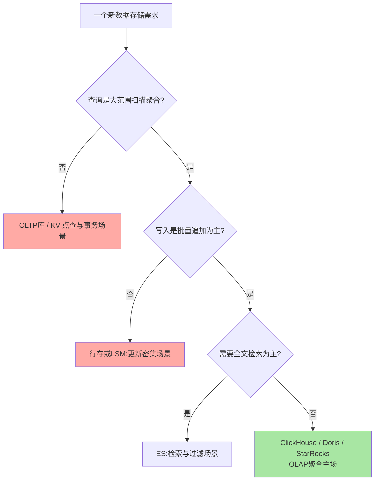
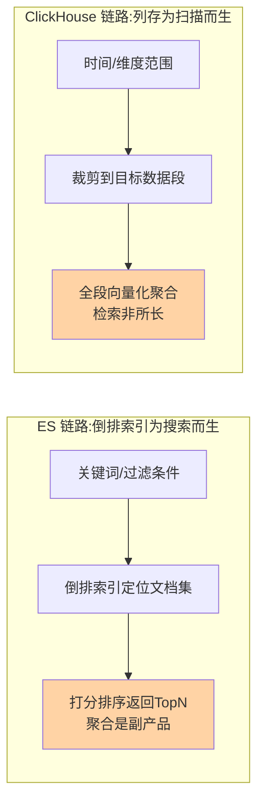

# ClickHouse 场景选型与边界：该用、不该用与邻居的分工

> 一句话：选型不看引擎多快，看「写入形态 × 查询形态」与引擎物理设计是否咬合——ClickHouse 咬合「批量追加 + 大范围聚合」，错配的代价在点查、事务、更新三个禁区。

## 🎯 本文核心

**核心一句话：ClickHouse 的适用判定只有一个公式——「数据以批量追加为主 + 查询以大范围扫描聚合为主」同时成立就上；高频点查、强事务、频繁更新三条任一出现就退回 OLTP/KV 库；与 Doris/StarRocks 比「产品化 JOIN 与运维形态」，与 ES 比「检索 vs 聚合」的分析边界。**

一图看懂选型决策流：

组织主线：该用的三类场景与特征 → 不该用的三条禁区与代价 → 与三位邻居（Doris/StarRocks、ES、时序库）的边界 → 一张总决策表。

## 一句话摘要

ClickHouse 适合三类场景：**日志分析**（应用/审计日志的过滤统计）、**用户行为分析**（埋点流水多维聚合漏斗留存）、**报表聚合**（交易/业务指标的实时大屏与明细下钻）——共同画像是「批量追加写入 + 亿级行 × 少数列扫描」。不适合三类：**高频点查**（稀疏索引定位到段不到行）、**强事务**（无完整 ACID）、**频繁更新**（更新即标记重写，后台合并风暴）。与 Doris/StarRocks 的定位差异一句话：三者都是 MPP 型 OLAP，ClickHouse 偏「极致扫描性能、组件自组装」，Doris/StarRocks 偏「开箱即用、JOIN 与在线服务化更强」（业内认知）；与 ES 的边界一句话：ES 是「检索引擎兼职聚合」（倒排索引为搜索而生），ClickHouse 是「聚合引擎兼职过滤」（列存压缩为扫描而生）。

## 5W 速记卡

| 维度 | 一句话 |
|---|---|
| What | ClickHouse 的选型判定与边界：追加 + 聚合上，点查/事务/更新退 |
| Why | 引擎物理设计决定擅长边界，错配的代价是架构级返工 |
| When | 日志分析/用户行为/报表聚合，亿级规模起步 |
| Where | 分析侧独立集群，与 OLTP/ES/Redis 按形态分工 |
| How | 用「三条最重查询」倒推引擎与建表，再定邻居分工 |

## 一、该用：三类场景与共同画像

### 场景一：日志分析

应用日志、访问日志、审计流水入 ClickHouse，典型查询形态：`WHERE 服务名 = x AND 时间 BETWEEN a AND b AND 级别 >= ERROR` 过滤后按维度聚合。业内量级感受：中型公司日志流水每天数十亿条起步（公开口径因公司而异），MySQL 存储与查询都撑不住，ClickHouse 单表万亿行量级仍可秒级聚合（官方公开基准口径）。

### 场景二：用户行为分析

埋点事件流（曝光/点击/下单/支付）多维分析：漏斗（连贯行为转化率）、留存（N 日回访）、路径。这类查询的 SQL 特征是「亿级明细 + 多维 GROUP BY + 窗口函数」——列存只读参与维度与指标的几列，扫描红利吃满。

### 场景三：报表聚合

交易指标看板（GMV/订单量/成功率按分钟聚合）、准实时大屏。配合物化视图把明细预聚合成分钟级汇总表，查询从「扫亿级明细」变「扫千万级汇总」，延迟与成本双降。

三类场景的共同画像即选型公式：**追加为主（写入批量化）+ 聚合为主（查询批量化）**。一个真实复盘案例：某数据分析平台早期把行为明细存 MySQL 分库分表，一条留存查询跑十几分钟（线上排查发现时间全耗在无效列的扫描与跨库归并上）；迁 ClickHouse 后同口径查询亚秒级——复盘结论是查询形态与引擎咬合了，迁移才有效，不是无脑搬。

> 💡 **实战提示**
> - 上量前先写「未来最重的三条查询 SQL」，倒推排序键与分区键设计——选型错了越优化越糟
> - 日志/埋点类表配 TTL（如保留 90 天）自动过期，别靠人工删数据——列存的 TTL 删除是分区级裁剪，代价极低
> - 从 Kafka 直接建表消费（引擎集成）比业务直写更稳：攒批、削峰、解耦三合一

## 二、不适用与常见误区：三条禁区与代价

- **高频点查**：用户详情页、订单详情页——ClickHouse 稀疏索引定位到 8192 行的段，取单行要拼几十个列文件，延迟与并发都远不如 OLTP 库。追问一层：能不能用缓存扛住点查？热 key 可以，但点查场景的尾部冷 key 长尾延迟会击穿体验——机制层面它就不是干这个的。再追问一层：为什么稀疏索引救不了点查？索引标记间隔 8192 行，定位粒度是「段」不是「行」，点查反而多读了 99% 的段内数据——为扫描优化的结构，对点查恰好是反优化
- **强事务**：跨行/跨表事务、回滚语义——ClickHouse 无完整 ACID（官方文档口径），把「下单扣库存」这类逻辑放进来是资金级风险。值得质疑的常见说法是「凑合用没出过事」——没有事务边界的数据一致性靠的是运气，出事就是资损级，这类侥幸正是要打破砂锅问清的隐患
- **频繁更新**：`ALTER ... UPDATE/DELETE` 是异步 mutation（标记重写），高频触发会产生后台合并风暴。打破砂锅问到底：为什么更新这么贵？因为 part 不可变是合并树的速度之源——更新意味着重写部件，成本正比于部件大小。快与可变是同一枚硬币的两面

误用代价的真实形态：某团队曾把 ClickHouse 当业务库存订单并高频更新状态，一周内集群磁盘翻倍、合并线程打满、查询全面变慢（故障复盘：磁盘放大来自 mutation 产生的部件重写，非数据量增长）——最后回迁 MySQL + CDC 同步到 ClickHouse 做分析，两边各归其位。

## 三、与 Doris 和 StarRocks 的区别：同赛道不同取向

三者的共同点先说清：都是列存 + MPP 架构的 OLAP 引擎，SQL 兼容，聚合场景都远快于行存。差异在取向（业内认知，公开口径）：

| 维度 | ClickHouse | Doris / StarRocks |
|---|---|---|
| 起源与形态 | Yandex 内部实践开源，组件化自组装 | 后起之秀，一体化产品化封装 |
| JOIN 能力 | 大表 JOIN 需谨慎设计 | JOIN 优化更重（分布式 JOIN 开箱可用） |
| 运维心智 | 手工拼装成分较多（分片/副本/物化视图自管） | 前端后端角色分工、管控面更全 |
| 社区生态 | 生态与集成最广（公开口径：社区活跃度居前） | 国内实时分析场景增长快 |

一句话定位：**ClickHouse 是「性能上限与自由度」取向，Doris/StarRocks 是「开箱即用与 JOIN 友好」取向**——差异的底层是两者对「引擎自治程度」的原理级取舍，不是功能多寡。反方案分析——为什么不无脑选「更好用」的 Doris 系？极端扫描吞吐与压缩率场景 ClickHouse 仍有优势（业内多方基准互有胜负，公开口径结论不一致）；为什么不无脑选「更快」的 ClickHouse？JOIN 密集的在线分析（Ad-hoc 多表关联）产品化成本更高。选型按团队运维能力与查询形态定，不按跑分定。

## 四、与 ES 的区别：检索引擎与聚合引擎的分析边界

两条查询链路的本质差异：

**「找出行」用 ES，算出数用 ClickHouse**：全文检索（分词、相关性打分、模糊匹配）是 ES 主场；亿级行的 GROUP BY 聚合与明细统计是 ClickHouse 主场。日志平台是两者协作的典型：ES 承接「查某服务的报错日志原文」，ClickHouse 承接「过去 24 小时错误率趋势与多维统计」——一套数据两条链路（或各自消费），检索与聚合各归其位。一句话记忆：ES 的倒排索引把「词」映射到文档，ClickHouse 的列存把「列」压缩成段——索引结构决定擅长边界。

## 五、典型使用场景总表

| 场景 | 推荐 | 理由 |
|---|---|---|
| 日志/审计分析 | ClickHouse（+ES 协作） | 追加 + 大范围聚合，TTL 过期 |
| 用户行为/埋点分析 | ClickHouse | 亿级明细多维聚合，列存红利最大化 |
| 实时报表大屏 | ClickHouse / Doris 系 | 物化视图预聚合 + 秒级刷新 |
| 多表 Ad-hoc 关联分析 | Doris / StarRocks 优先 | JOIN 产品化更成熟（业内认知） |
| 业务交易主库 | MySQL 等 OLTP | 强事务，不在此赛道 |
| 订单/用户详情页 | OLTP 库 + Redis | 高并发点查，列存禁区 |
| 全文检索站内搜索 | ES | 倒排索引主场 |
| 监控指标存储 | 时序数据库（见时序系列） | 时间序列专用压缩与降采样 |

量级分档一句话：十万行级报表 MySQL 就够；千万到亿级上单集群 OLAP；十亿到万亿级再谈分片与预聚合体系——量级不到，引擎复杂度就是负债。

## 六、什么时候用与不用：明确推荐

- **什么时候用 ClickHouse**：追加型明细 + 聚合型查询 + 亿级规模起点 + 团队有能力自管分片副本——四条满足**明确推荐**；若 JOIN 密集或想少运维，Doris/StarRocks 是同赛道替代
- **什么时候不用**：三条禁区任一命中（点查/事务/频繁更新），或数据量 GB 级（引擎复杂度大于收益）——不用的代价不是「慢」，是架构错位
- **怎么配邻居**：OLTP 主库存事实 → CDC 批量同步 ClickHouse 做分析 → ES 承接检索 → Redis 挡热点——按查询形态切引擎，是这套体系的设计思想核心

## 七、Trade-off：选型这注押的是什么

选 ClickHouse 的取舍：**押注「自组装换上限」——用组件拼装的运维复杂度，换极致扫描性能与生态自由度**；放弃的是开箱即用的产品化体验与 JOIN 友好度。反方案分析：「为什么不用云数仓/湖仓？」T+1 批处理的湖仓满足不了秒级交互分析，ClickHouse 补的是「快」这个维度；「为什么不用一套引擎全包？」本文三条禁区已证明——每个引擎的物理设计决定它必然有盲区，混合存储体系不是权宜之计而是长期架构。选型的成熟标志：能说清「每个场景为什么是这个引擎」，而不是「哪个引擎最新就上哪个」。

## 八、你们可能会问

**Q1：我司数据才千万级，需要上 ClickHouse 吗？**
大概率不需要。千万级聚合 MySQL 加好索引或上一读多从即可（业内经验共识）；先让量级与查询变慢的痛点真实出现，再评估引擎迁移——预付复杂度是最常见的过度设计。

**Q2：日志场景到底选 ES 还是 ClickHouse？**
按查询占比分：检索原文为主选 ES，统计聚合为主选 ClickHouse，两者都重要就并存。若只能选一个且以「趋势/统计/多维分析」为主，ClickHouse 的存储成本与聚合吞吐优势明显（业内认知）。

**Q3：ClickHouse 与 Doris 之间摇摆，有什么简单判据？**
两个问题：JOIN 密不密？运维精力多不多？JOIN 密或运维弱 → Doris/StarRocks；扫描吞吐极致或已有运维体系 → ClickHouse。判据来自查询形态与团队约束，不来自跑分截图。

## 九、开放问题

- 三大引擎边界持续互相渗透：ClickHouse 补 JOIN 能力、Doris 系补极致吞吐，两三年后「选型表」大概率要重写——演进中的结论要带有效期
- 湖仓一体（直接查对象存储上的开放表格式）会分流多少「自建 OLAP 集群」的需求，业内尚无定论

## 十、自测三问

1. 选型公式的两个条件是什么？三条禁区各自的机制根源是什么？
2. ClickHouse 与 Doris/StarRocks 的取向差异一句话怎么说？
3. ES 与 ClickHouse 在日志平台的分工边界是什么？为什么倒排索引不适合聚合？

## 🎯 核心带走

- **核心一句话**：选型 = 写入形态 × 查询形态与引擎物理设计是否咬合——追加 + 聚合上 ClickHouse；点查/事务/更新三条禁区退回传统引擎；Doris 系比产品化与 JOIN，ES 比检索，时序库比指标
- **主线**：三类该用场景 → 三条禁区 → 三邻居边界 → 总决策表 → Trade-off
- **哪里会坏**：预付复杂度（量级不到就上引擎）、按跑分选型不看查询形态、禁区场景硬上
- **边界**：本篇是选型层；分片部署与物化视图体系属特性层内容

## 📌 数据与事实声明

- 写于 2026-09-24；能力边界（无完整事务、mutation 机制、稀疏索引）以 ClickHouse 官方文档公开口径为准
- 「Doris/StarRocks JOIN 更产品化」「社区活跃度」「基准互有胜负」为业内认知与公开口径，结论随版本演进变化
- 免责：文中复盘案例已匿名化与泛化处理，用于说明机制不指向任何具体公司

## 📚 参考资料

| 类型 | 标题 | 来源 |
|---|---|---|
| 官方文档 | ClickHouse Documentation（Limits/Get started 章） | clickhouse.com/docs |
| 官方文档 | Apache Doris / StarRocks 官方文档 | doris.apache.org / starrocks.io |
| 官方文档 | Elasticsearch 官方文档 | elastic.co/guide |
| 系列导航 | ClickHouse 系列目录 | `docs/data/clickhouse/index.md` |
