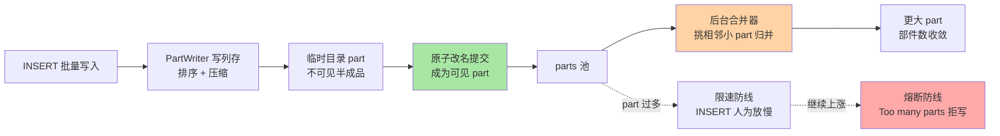
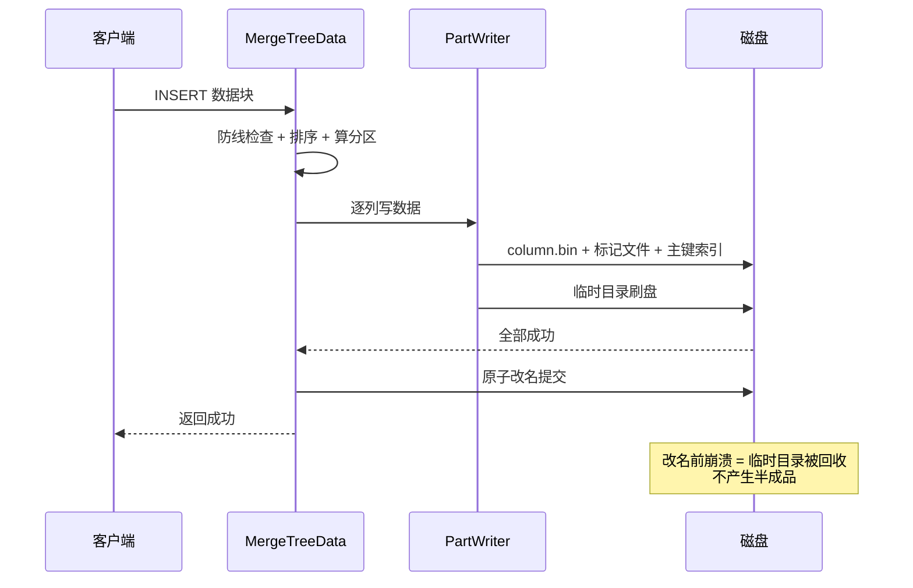
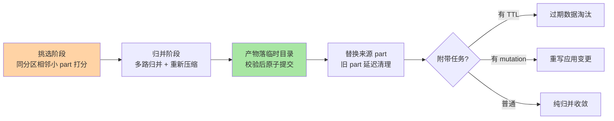
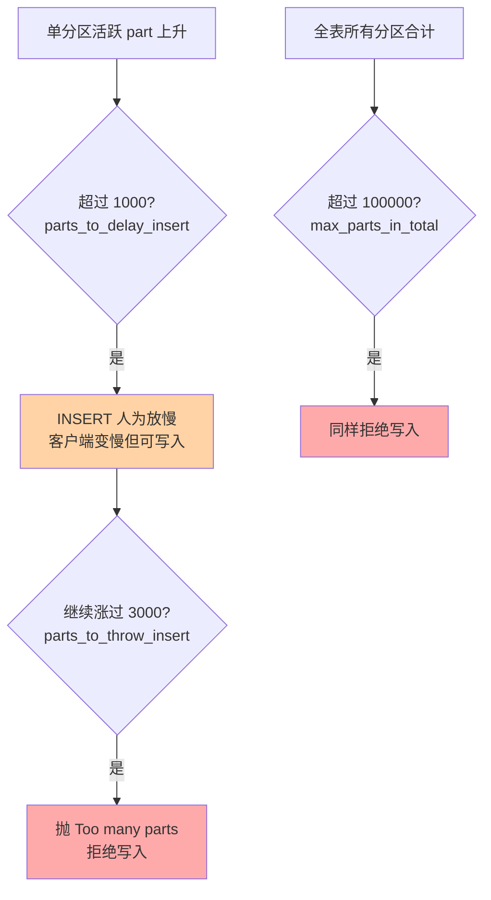
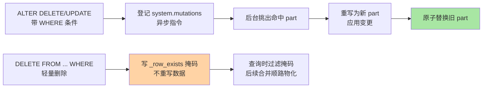

# MergeTree 写入与合并路径深度：part 生成、后台合并与 Too many parts 防线

> 一句话：MergeTree 的每一次写入都会落成一个不可变的「数据部件 part」，后台合并线程持续把小 part 归并成大 part——把这条「生成-合并-防线」路径拆开看，`Too many parts` 报错、写入被限速、mutation 生效慢这些日常问题就都有了机制级答案。

## 🎯 本文核心

**核心一句话：MergeTree 写入 = 「每批 INSERT 原子生成一个已排序的不可变 part，后台合并器按尺寸分层策略持续归并」——写入快、合并慢的剪刀差由两级防线兜底：part 超过阈值先人为给 INSERT 放慢速度（限速），再超就抛错拒绝写入（熔断），而绕开防线的唯一正解是把写入端改成大批次低频率。**

机制链：INSERT 到达 → 内存校验排序 → PartWriter 写列存文件 → 临时目录落盘 → 原子改名提交为可见 part → 合并器挑选相邻小 part → 后台归并成大 part → 部件数收敛。链条上任何一环积压，都会表现为 part 数量上涨——`system.parts` 是这条链的总仪表盘。读懂这层机制，比背参数更重要。

入门层讲过 MergeTree「追加 part + 异步合并」的思想与建表四要素，本篇往下钻一层：part 到底怎么生成、合并器怎么挑 part、防线参数怎么触发，以及 mutation 与轻量删除这两条「改数据」的特殊路径。

一图看懂全篇主线：

## 一句话摘要

MergeTree 是 ClickHouse 的核心表引擎，写入路径上每个批次都会产出一个**不可变、按排序键有序、原子可见**的数据部件；后台合并器（公开源码里由后台执行器线程池驱动）持续把小的部件归并成更大的部件，让部件数量收敛到「少量大部件」的理想态。这个设计的底层矛盾是：写入吞吐可以随客户端横向加压，但合并吞吐受限于服务端磁盘与 CPU——剪刀差只能靠「写入端节流 + 服务端两级防线」来平衡。公开文档口径的防线参数（当前默认值）：单分区活跃 part 超过 `parts_to_delay_insert`（1000）开始人为放慢 INSERT；超过 `parts_to_throw_insert`（3000）直接抛 `Too many parts` 拒写；全表所有分区合计超过 `max_parts_in_total`（100000）也会拒绝。更新与删除不走原地改写：`ALTER ... DELETE/UPDATE` 走 mutation 异步重写部件，23.3 版本起（公开口径）的轻量删除 `DELETE FROM` 只打删除掩码、查询时过滤——两条路径的代价差异巨大，选错就是生产事故。

## 5W 速记卡

| 维度 | 一句话 |
|---|---|
| What | 每批写入生成一个不可变 part，后台合并器持续归并收敛 |
| Why | 列存有序要顺序写，随机改写不起——用不可变部件 + 异步归并换写吞吐 |
| When | 写入积压、Too many parts 报错、mutation 卡住时，按本篇路径定位 |
| Where | 关键仪表盘：system.parts / system.merges / system.mutations |
| How | 大批次低频率写入（业内惯例：单表每秒至多一次 INSERT）+ 防线参数只兜底不依赖 |

## 一、写入路径：从一条 INSERT 到一个可见 part

### 1.1 关键路径拆解（公开源码结构）

以社区公开仓库的代码组织为参照（公开口径，模块名随版本可能微调），一次 INSERT 的关键路径：

1. **入口校验**：`MergeTreeData` 是 MergeTree 全家共用的核心引擎类，写入先经过它做分区字段求值、DDL 校验、防线检查（`delayInsertOrThrowIfNeeded` 就是两级防线的落点）
2. **数据处理**：数据块按排序键排序、按分区表达式算出所属分区目录
3. **落盘**：`PartWriter`（部件写入器）把数据块的每一列写成 `.bin` 数据文件 + `.mrk2` 标记文件，索引粒度级的 `primary.idx` 主键索引同步生成——这就是入门层讲的「稀疏索引每 8192 行一个路标」在写入侧的对应动作
4. **提交**：整个 part 先写进临时目录，全部文件刷盘成功后**原子改名**进入正式目录——改名前任何崩溃都只会留下一个被清理任务回收的临时目录，不会产生半成品 part

这套「临时目录 + 原子改名」的设计思想值得停一停：它把「多文件组成的逻辑单元」的可见性问题，简化成了一次文件系统改名操作——不可变性 + 原子改名，让查询端永远不需要加锁读半成品。

### 1.2 Wide 与 Compact：两种 part 物理形态

每个 part 有两种物理布局（公开文档口径）：**Wide** 格式每列一个独立文件（`column.bin` + `column.mrk2`），**Compact** 格式所有列共用一个文件。判据是 `min_bytes_for_wide_part`（当前默认 10MiB）与 `min_rows_for_wide_part`（当前默认 0）——小批次写入先落成 Compact、合并长大后转 Wide，省掉海量小文件的元数据开销。

追问：part 文件名里那一串 `202609_1_35_2` 是什么意思？这是部件命名规范：`分区号_最小数据块号_最大数据块号_合并层级`——合并层级就是该 part 参与过的合并次数，从层级分布能反推合并健康度。再追问一层：为什么数据块号是区间而不是单值？因为合并产物要「管辖」所有来源 part 的行区间，区间语义让不可变部件之间天然无交集、可并行扫描。打破砂锅再问：既然 part 不可变，那同一条数据想改怎么办？答案就是本篇第五节的 mutation 路径——不改旧 part，重写新 part。

### 1.3 写入去重：重复投递的第二道保险

`ReplicatedMergeTree` 默认开启插入去重（`replicated_deduplication_window` 当前默认 10000，公开文档口径）：同一数据块的内容哈希在协调服务里登记，窗口内的重复 INSERT 直接返回成功而不再落 part——上游消息队列重复投递时，这一层避免部件膨胀。注意边界：去重按「整块内容一致」判定，批内混入任何差异（哪怕只多一行）就是新块，幂等要靠写入端设计配合，不能全指望引擎。

## 二、后台合并：部件怎么收敛

### 2.1 合并器怎么挑 part

合并选择策略的直觉版：**在同一个分区内，把相邻、较小、数量偏多的 part 挑出来归并**（公开源码中的合并选择器按部件数量与尺寸评分，属尺寸分层思想的变体）。三条硬规则值得记住：

- **跨分区永不合并**——分区是裁剪边界，合并产物必须仍属于单一分区
- **合并产物写新文件组，成功后原子替换**，失败只浪费 IO 不损坏数据
- **合并是资源敏感型后台任务**，由后台执行器线程池调度，磁盘慢的机器合并吞吐天然低

### 2.2 合并不只是归并：四件事一次做完

后台合并是「顺路干活」的枢纽，一次归并同时承担四种职责：**纯尺寸收敛**（小并大）、**TTL 淘汰**（到期分区/列级数据清理）、**mutation 应用**（待变更部件重写）、**去重收敛**（ReplacingMergeTree 这类引擎在合并时丢掉同键旧行）。理解这一点，很多「为什么它生效这么慢」的问题就有答案了：**所有依赖合并的机制，速度上限都等于合并吞吐**。

追问：合并会不会把新写入的 part 立刻并掉，导致刚写的数据被反复重写？引擎对「过新的 part」有保护策略，刚提交的部件不会被立刻选中（避免写放大），这也解释了为什么刚插入的数据在 `system.parts` 里会安静地停留一会儿。再追问一层：那能不能手动触发合并一次到位？`OPTIMIZE TABLE ... FINAL` 可以，但它是把合并当同步操作跑，大表上代价极高——业内惯例是只在小表/维护窗口用，日常收敛交给后台。

反方案分析——为什么不用 LSM 系数据库那套分层压缩（leveled compaction）？LSM 的分层策略服务于「点查回溯路径最短」，每层键范围有序、层间查找有界；MergeTree 的负载是大范围扫描，部件按「相邻区间」归并即可让扫描端零回溯，分层反而引入层间放大。两种压缩策略的差异，本质是目标负载的差异，不是谁更先进的演进关系——这也是跨系统对比时最容易被误读的一处架构分野：上下游系统各自的归并策略，都长在自家读写负载上。

## 三、Too many parts 防线：机制、参数与触发现场

### 3.1 两级防线怎么工作

写入吞吐与合并吞吐的剪刀差，由两级防线兜底（参数默认值均为公开文档口径，随版本演进可能调整）：

- **限速层**：part 数超过 `parts_to_delay_insert`（当前默认 1000）后，服务端对 INSERT 引入人为延迟——客户端感知是「写入越来越慢」，这是引擎在替你踩刹车
- **熔断层**：超过 `parts_to_throw_insert`（当前默认 3000）直接抛错拒写；全部超 `max_parts_in_total`（当前默认 100000）同理

为什么先限速再熔断而不是直接拒绝？设计思想是**让故障先表现为性能退化而不是可用性中断**——限速给了运维与上游「自动降速后自愈」的机会，只有刹车失灵才断电。反方案分析——为什么不用无限重试队列把拒写的批次缓存起来？把「拒收」变成「服务端代持」，内存与磁盘会被失控客户端打爆，防线就形同虚设；拒写是故意的，把压力显式推回写入端。

### 3.2 一次 Too many parts 排查复盘（匿名化实践叙事）

一个典型的线上复盘（细节已匿名化）：某埋点接入服务凌晨开始报 `Too many parts`，监控显示写入 QPS 并不高。排查路径分四步，值得当作模板：

1. **看部件分布**：`system.parts` 按分区聚合活跃 part 数——发现 400+ 个分区各有几百个小 part，而不是单一分区爆量
2. **定位写入形态**：上游按「设备维度」分片写，每条消息独立 INSERT，分区键带秒级时间戳——分区过细 × 批次过小的双重错误
3. **验证合并吞吐**：`system.merges` 显示合并在跑但追不上——每个分区只有几个 part，合并器无从归并，部件只生不灭
4. **修复与验证**：上游改消息队列攒批（千行级/批）、分区键收敛到天级，part 数十分钟内回落，防线参数未动

复盘的结论只有一句：**防线参数背不动写入设计的锅**。参数是保险丝，不是变压器——把保险丝换成更粗的（调大阈值）只会把熔断推迟到磁盘被打满。

> 💡 **实战提示**
> - 见到 `Too many parts` 先看 `system.parts` 的分区分布再下结论：单分区爆量 = 批太小；多分区碎片化 = 分区键过细——两种病因修法完全不同
> - 临时救急可以 `SYSTEM STOP MERGES` 之外反向操作：手动 `OPTIMIZE` 收敛大分区，但根治必须回写入端改攒批
> - 阈值参数保持默认起步；确实要调，一次只调一档并观察 `system.merges` 的追赶速度

## 四、写入最佳实践：批大小与频率的量化边界

### 4.1 业内惯例的量化基线

ClickHouse 社区公开文档长期给出的写入建议（公开口径，业内共识）：**每次 INSERT 至少 1000 行以上，理想是 1 万到 10 万行级别的批量；对单表而言，每秒不超过 1 次 INSERT**。这个数字的约束来源是「每批次固定产生一个 part 的管理成本 × 合并吞吐的物理上限」——批太小，part 生成速度就超过合并速度，防线必然触发。

为什么是「每秒一次」而不是更精确的数？因为合并吞吐取决于磁盘、列宽、压缩率，无法给出通用精确值——社区给的是「保证合并追得上写入」的安全下界。上限在哪？单批次也不宜过大（百万行以上注意内存与 `max_insert_block_size` 相关上限），超大批次应拆分并行投递到不同表或分批串行。

### 4.2 攒批的三个层级

从业务端到引擎端，攒批有三个层级，按优先级递进：

1. **业务端攒批**：应用内缓冲区累积到千行/万行级再发——最根本，但每个业务都要自己实现
2. **消息队列攒批**：Kafka 类队列 + 消费端批量拉取投递——把攒批从业务逻辑里解耦出来，生产最常见的形态
3. **引擎端异步写**：`async_insert`（异步插入，服务端把小批次在内存里攒成大批次再落盘）——适合无法改造的既有小批次写入源，代价是数据可见延迟与内存占用

反方案分析——为什么不直接依赖 `async_insert` 兜底一切？它把攒批成本转移到服务端内存，写入源失控时服务端先被打爆；且异步化牺牲了「返回成功即落盘」的确定性语义。它是既有系统的补丁，不是新系统的正解——设计思想依旧是：**压力应该暴露在离数据源最近的地方**。

### 4.3 不同量级的思考：架构约束驱动解法

- **十万级（单表日增十万行）**：这一档的核心问题是运维简单与成本最小，而不是写入吞吐——约束来源是「该量级远低于单盘顺序写能力，唯一风险是高频小批触发防线」；思考方式：频率驱动——把批次攒到千行级、每秒一次以内，单机单副本都绰绰有余
- **百万级（单表日增百万行）**：这一档的核心问题是批次节奏与合并吞吐的匹配，而不是引入分片——约束来源是「单机合并吞吐仍有富余，防线参数开始有感知」；思考方式：节奏驱动——消息队列攒批固定化，监控 `system.parts` 走势作为健康度主指标
- **千万级（单表日增千万行）**：这一档的核心问题是分区与排序键的裁剪效率，而不是写宽表还是窄表——约束来源是「查询若裁剪失效，扫描量直接决定成本」；思考方式：裁剪驱动——分区键收敛到天/小时级，排序键按最高频查询左对齐，物化视图预聚合开始值得投入
- **亿级（单表日增亿行以上）**：这一档的核心问题是写入端扇出与集群拓扑的匹配，而不是单表调优——约束来源是「单分片磁盘顺序写与合并吞吐到达物理天花板」；思考方式：拓扑驱动——分片 + 副本 + 消息队列按分片键扇出，防线参数保持默认，把容量规划交给集群层（篇 3 展开）

自下而上收尾：四档的共同不变量是「每批一个 part 的管理成本」，变的只是谁在管理这个成本——量级每上一个台阶，管理权从「参数」上移到「节奏」再上移到「拓扑」；触发升级的信号永远是：合并追不上、防线开始报警。

## 五、mutation 与轻量删除：改数据的两条路径

### 5.1 mutation：异步重写部件

`ALTER TABLE ... DELETE/UPDATE` 不会立即改数据，而是往 `system.mutations` 登记一条变更指令；后台在涉及目标数据的 part 合并/重写时应用变更，产物是**重写后的新 part**。三条关键语义：

- **异步生效**：默认不等待，`SETTINGS mutations_sync = 1/2` 可选等待本机/所有副本完成
- **代价与命中的 part 数成正比**：命中越多 part，重写越多——条件里带分区裁剪列能显著缩小爆炸半径
- **失败可查**：`system.mutations` 有失败原因字段，卡住的 mutation 会阻塞后续变更，需要显式处理

### 5.2 轻量删除：掩码路径的适用边界

轻量删除（`DELETE FROM`，公开口径 23.3 版本起可用）走的是另一条路：给目标行写 `_row_exists` 掩码标记，查询时按掩码过滤，数据本体不动、后续合并再顺路物化删除。两条路径的选型边界：

| 维度 | mutation（ALTER DELETE/UPDATE） | 轻量删除（DELETE FROM） |
|---|---|---|
| 生效速度 | 异步重写，大表慢 | 掩码即时可见，查询过滤 |
| IO 代价 | 命中 part 全量重写 | 仅写掩码列，代价小 |
| 空间回收 | 新旧 part 替换后回收 | 要等合并物化后回收 |
| 适用 | 批量订正、GDPR 式硬删除 | 小范围删行、误删救急 |

追问：轻量删除既然快，能不能替代 mutation 做批量清理？掩码路径的过滤代价会摊到每一次后续查询头上——大范围删除让所有扫描都背着掩码判断，且空间不立即回收。再追问一层：为什么引擎不做原地物理删除？不可变部件是列存压缩与并发读的地基，原地改写会击穿整个设计——设计取舍依旧是那一条：**用「重写」换「不可变」，所有修改语义都为它让路**。

### 5.3 实践叙事：mutation 卡住的深夜（匿名化）

一次线上排查（细节匿名化）：某张亿行级明细表跑了一个不带分区条件的 `ALTER UPDATE`，几小时后 `system.mutations` 显示 is_done = 0，新提交的 mutation 全部排队。处置路径：先确认卡住的是重写量（命中了大半个历史分区），再决定「取消旧 mutation + 补上分区条件重发」，避免整个变更队列被一条失控指令堵死。教训沉淀成团队规约：**mutation 必须带分区条件、必须先在影子表上预估命中量、大批量订正走「建新表 + 筛选回灌」而不是原地重写**。

> 💡 **实战提示**
> - mutation 前先 `SELECT count()` 按 WHERE 条件 + 分区组合预估命中行数，命中超过千万行级就改走新表回灌方案
> - 轻量删除适合「删几百几千行」的救急场景；删完用 `SYSTEM` 级合并触发或等后台物化，别假设空间立刻归还
> - 高频 UPDATE 语义的需求本身就是错配信号：回到表设计（版本化排序键 + 查询侧取最新），而不是堆 mutation

## 六、什么时候用与不用：明确推荐

- **什么时候用原生 INSERT 路径**：批次能攒到千行以上、写入源可控——**明确推荐**「消息队列攒批 + 默认防线参数」，这是绝大多数场景的标准答案
- **什么时候用 `async_insert`**：既有系统无法改造、写入源天然小批次（如网关打点）——作为补丁启用，同时监控服务端内存
- **什么时候不用 mutation**：高频行级更新、大批量无分区条件订正——前者是引擎错配应回表设计，后者应走新表回灌
- **什么时候不用轻量删除**：大范围清理、需要立即回收空间——用 mutation 或分区级 `DROP PARTITION`（能按分区删除时它是最便宜的删除，没有之一）

## 七、Trade-off：写入路径押了什么

整条写入路径的取舍可以浓缩成一句话：**押注「数据不可变 + 合并可异步」，换取顺序写吞吐与并发安全；代价是修改语义的沉重（mutation 重写）、可见性的最终一致（去重/删除依赖合并节奏）与防线触发的写入中断风险**。反方案分析——「为什么不用 WAL + 原地更新兜住修改语义？」WAL 带来的随机改写会同时击穿列存压缩率与扫描连续性，为 1% 的修改场景拖垮 99% 的扫描场景，这笔账在 OLAP 负载下不成立。「为什么不做同步合并（写完立即归并）？」同步合并把合并延迟加进写入延迟，写入尾延迟随部件规模波动——异步化是「快路径与慢路径分离」的经典架构手法，防线参数则是快慢路径之间的缓冲带。

## 你们可能会问

**Q1：写入被限速（变慢但没报错）了，要不要立刻调大 `parts_to_delay_insert`？**
不要。限速是引擎在保护你，先看 `system.parts` 判断是单分区爆量还是分区碎片化，回写入端修批次形态——调大阈值只是把熔断点往后挪，剪刀差还在。参数调整只在「确实需要更陡的写入峰值」且合并吞吐验证足够时才考虑。

**Q2：`async_insert` 和客户端攒批怎么选？**
能改客户端就客户端攒批（千行级起步）；改不了（存量小批次源、多方接入）再开 `async_insert`。注意异步插入的可见延迟语义会传导到下游查询，对时效敏感的报表要验证端到端延迟。

**Q3：怎么判断合并吞吐是不是瓶颈？**
看三个表：`system.parts`（部件数走势，涨=追不上）、`system.merges`（当前合并任务与进度）、`system.part_log`（历史合并耗时）。部件数持续上涨且合并任务常驻，就是合并瓶颈；此时调参没用，出路是降写入频率、或加磁盘/分片摊合并负载。

**Q4：单表每秒一次 INSERT 的业内惯例，在多表场景怎么算？**
该建议针对单表的部件生成速率，多表各自独立计算；但磁盘 IO 与合并线程是全机共享的，多张高频小批表会互相挤压合并吞吐——总量视角仍然要守住「全机 part 生成速率 < 全机合并速率」。

## 开放问题

- 防线参数的「全局限速」与「按表隔离」之间的平衡仍在演进：多租户场景下一个坏写入源拖垮全机合并的问题，社区在探索更细粒度的资源隔离，尚未有统一答案
- 轻量删除的掩码过滤对扫描性能的长期影响、掩码物化的触发策略，各版本仍在调整——依赖它做常态化删除流程前，先在真实数据规模上验证

## 自测三问

1. 一条 INSERT 从到达到可见，经过哪四步？「临时目录 + 原子改名」保护的是什么？
2. 两级防线的参数与触发顺序是什么？为什么设计成「先限速后熔断」而不是直接拒绝？
3. mutation 与轻量删除的生效路径差在哪？「命中千万行级」的订正为什么推荐新表回灌？

下一篇讲「查询执行与向量化引擎」：part 之上，一条 SQL 怎么被切成流水线、向量化为什么快、PREWHERE 与近似计算又优化在哪。

## 🎯 核心带走

- **核心一句话**：MergeTree 写入 = 每批落一个不可变有序 part + 后台合并器尺寸分层归并；剪刀差由「限速 → 熔断」两级防线兜底，根治永远在写入端的批次形态
- **主线**：part 生成路径（PartWriter/原子提交）→ 合并四职责（收敛/TTL/mutation/去重）→ 防线参数（1000 限速 / 3000 熔断 / 100000 全表上限，公开文档口径）→ 攒批三层级 → mutation 与轻量删除的代价图谱
- **哪里会坏**：小批高频写（防线触发）、分区键过细（碎片化）、无分区条件的 mutation（堵死变更队列）、把 async_insert 当正解
- **边界**：本篇是单表写入侧；part 生成之后「查询怎么读这些 part」属篇 2，「部件在集群间怎么同步」属篇 3

## 📌 数据与事实声明

- 写于 2026-09-24；防线参数默认值（`parts_to_delay_insert` 1000 / `parts_to_throw_insert` 3000 / `max_parts_in_total` 100000）、Wide/Compact 判据（`min_bytes_for_wide_part` 10MiB）、去重窗口（`replicated_deduplication_window` 10000）均为 ClickHouse 官方文档当前公开口径，历史版本曾有不同默认，随版本演进可能调整
- 「单表每秒至多一次 INSERT、批次千行以上」为 ClickHouse 社区公开文档长期建议，属业内共识
- 源码模块描述（MergeTreeData/PartWriter/后台执行器）基于社区公开仓库代码组织，具体类名与内部实现随版本重构可能变化
- 文中事故叙事已匿名化，不含真实公司/系统/数据

## 📚 参考资料

| 类型 | 标题 | 来源 |
|---|---|---|
| 官方文档 | MergeTree 引擎设置（防线参数默认值） | clickhouse.com/docs/en/operations/settings/merge-tree-settings |
| 官方文档 | MergeTree 家庭页（part 合并语义） | clickhouse.com/docs/en/engines/table-engines/mergetree-family/mergetree |
| 官方文档 | 异步插入 async_insert 章 | clickhouse.com/docs |
| 官方文档 | 轻量删除 Lightweight Deletes 章 | clickhouse.com/docs |
| 公开仓库 | ClickHouse 社区源码（MergeTreeData / PartWriter 模块组织） | github.com/ClickHouse/ClickHouse |
| 系列导航 | 本系列入门层（建表四要素/稀疏索引前置） | `docs/data/clickhouse/入门层/` |
