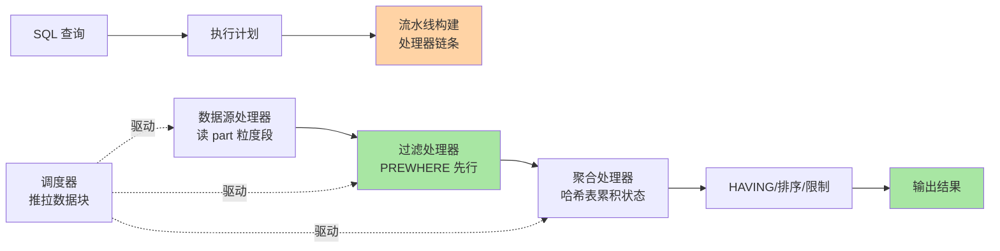
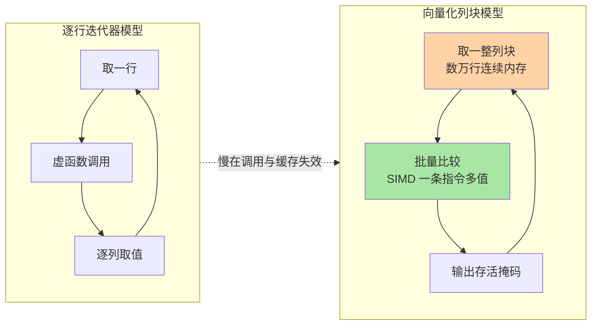
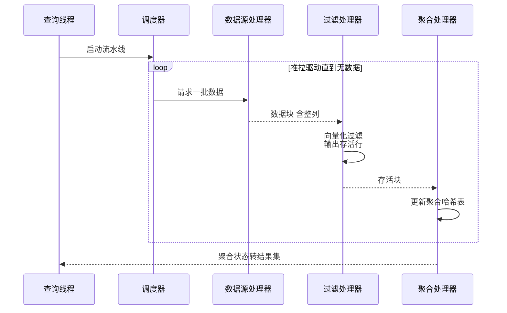
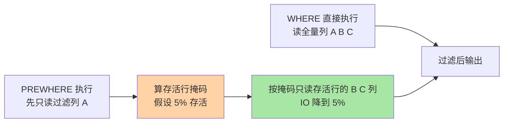

# 查询执行与向量化引擎：Pipeline 处理器模型、PREWHERE 与近似计算

> 一句话：ClickHouse 的查询引擎把一条 SQL 切成「数据一批一批流过处理器链条」的流水线——向量化让 CPU 每条指令处理一整列数据块，PREWHERE 让过滤提前到只读必要列，近似计算让超大表的统计瞬间出结果——三者共同回答「扫描型查询为什么能快成这样」。

## 🎯 本文核心

**核心一句话：ClickHouse 查询执行 = 「列块流水线」——查询计划被翻译成一组 Processor 处理器，端口之间以数据块为单位推拉调度，每个处理器拿到的是整列连续内存而不是一行记录，于是过滤/聚合/排序全部变成对连续数组的批量运算，吃满 CPU 缓存与 SIMD 指令；聚合状态常驻内存哈希表，PREWHERE 把「读哪些列」压缩到过滤后的存活行，采样与 uniq 类近似函数则用统计换时间，把亿级行的答案压到毫秒级。**

机制链：SQL 解析成执行计划 → 按 Storage 接口拉取 part 数据源 → 构建处理器流水线（数据源/过滤/聚合/变换/输出）→ 调度器推拉数据块驱动全链 → 结果输出。链上每一环的优化空间都指向同一个目标：**让磁盘只读必要列、让 CPU 只算存活数据**。

入门层讲过「稀疏索引怎么把扫描范围缩到目标粒度段」，本篇讲粒度段定位之后的部分：数据块进了内存，查询引擎怎么处理它。一条查询从「找到该读哪些数据」到「算出结果」，中间的执行引擎才是速度的另一半。

一图看懂执行引擎全景：

## 一句话摘要

ClickHouse 采用**向量化执行**（对成批的列数据做批量运算）加**流水线并行**（处理器链条上多线程同时处理不同数据块）的执行模型：公开源码里执行层被组织为 Processors 库——每个处理器实现统一的处理器接口、通过输入/输出端口连接，调度器以数据块为单位推拉驱动。向量化是相对「逐行解释执行」的迭代器模型而言的：一次函数调用处理一个数据块（通常数万行）的整列数据，CPU 指令缓存与 SIMD 能力被吃满，虚函数调用与分支预测失败的开销被摊薄到接近于零。查询侧的三大杠杆：**PREWHERE**（把高选择性过滤条件前置，只把存活行再传给后续列读取）、**聚合状态管理**（GROUP BY 的中间状态是内存哈希表，基数决定内存曲线）、**近似计算**（`SAMPLE` 采样与 `uniq`/分位数近似函数用统计精度换扫描量）。三者各有适用边界，用错杠杆同样会慢——本篇逐个拆。

## 5W 速记卡

| 维度 | 一句话 |
|---|---|
| What | 列块流水线 + 向量化批量运算的执行引擎，Processor 端口模型驱动 |
| Why | 扫描型负载下，逐行迭代器的函数调用与缓存失效成本不可接受 |
| When | 分析慢查询时，按「读了多少列/过滤多早/聚合基数多大」三问定位 |
| Where | EXPLAIN PIPELINE 看处理器链条；system.query_log 看执行画像 |
| How | 过滤列前置 PREWHERE、降聚合基数、亿级估算用近似函数 |

## 一、向量化执行：为什么整列批量算就快

### 1.1 逐行迭代器 vs 列块批量

传统行存 OLTP 引擎的执行模型是迭代器：一次调用返回一行，每行每个列值都要经过「虚函数调用 → 类型判断 → 取值」的路径。扫描亿行时，函数调用开销与 CPU 缓存失效把绝大部分时间花在「取数据」而不是「算数据」上。

向量化模型的解法（设计思想层面）：**把「控制流驱动的逐行处理」翻转成「数据流驱动的批量处理」**——一个过滤操作符拿到的是一整列连续内存，循环体退化为对连续数组的简单比较，CPU 分支预测近乎全中、SIMD 一条指令比较多个值、列数据顺序流过缓存。三层收益叠加：指令数减少（SIMD）、缓存命中率拉满（连续内存）、调用开销摊薄（一次调用一批）。

追问：向量化是 ClickHouse 发明的吗？不是——它是列存分析引擎的公共演进方向（公开口径：同代分析型引擎普遍走向向量化或向量化与编译混合路线），ClickHouse 的特点是把这条路走到了极致：内部数据结构直接围绕「连续列内存块」设计，连字符串都整列连续存放。再追问一层：所有操作都能向量化吗？不能——高基数字符串比较、复杂状态聚合等场景批量收益有限，引擎内部对个别路径保留了行式处理，向量化是主路径优化而非万能开关。打破砂锅再问：为什么不进一步用「把表达式编译成本地代码」的方案？编译执行与向量化是两条并行的演进路线（业内两条主流路线，公开口径），ClickHouse 核心选了向量化并配合 JIT 覆盖少数表达式热点——取舍点是工程复杂度与通用收益的平衡。

### 1.2 关键路径：Processors 库与端口模型

公开源码里的执行层组织（公开口径，随版本演进可能重构）：查询构建出处理器有向图，**每个 Processor 通过输入端口/输出端口与其他处理器相连，端口间流动的单位是数据块（Block，一组列的批量载体）**。调度器按拓扑序驱动：上游处理器往输出端口推块，下游从输入端口拉块，多线程时多个数据块在不同处理器上同时流动——流水线并行与数据并行由此合一。

实战视角的入口是 `EXPLAIN PIPELINE`：它把一条查询的处理器链条打出来——每个 stage 用了几个线程、聚合是几级哈希、有没有单线程瓶颈段。看懂它，「慢在哪一段」从猜测变成读图。

> 💡 **实战提示**
> - 慢查询先跑 `EXPLAIN PIPELINE`：链条里有单线程处理器段（如全排序的归并端）往往就是瓶颈，先考虑能不能用 LIMIT BY/ORDER BY 裁剪数据量再排
> - `system.query_log` 的 `read_rows/read_bytes/profile_events` 是执行画像的权威数据源，对比两条 SQL 的画像差异比凭感觉猜快得多
> - 表达式能下推就下推：过滤条件写在 WHERE 里让引擎自动前置，比在子查询外层再过滤快得多——执行引擎不会自动穿越聚合边界

## 二、聚合：状态、哈希表与内存

### 2.1 聚合状态是内存里的哈希表

GROUP BY 的执行画像：扫描端流式输出存活块，聚合处理器维护**「分组键 → 聚合状态」的哈希表**——count/sum 的状态是一个数字，avg 是和与计数，`uniq` 是去重结构，`quantile` 是近似草图。查询结束前，这些状态常驻内存；**内存曲线由分组键的基数决定，与扫描行数关系不大**——这就是「GROUP BY 一个高基数字段把内存打爆」的机制根源。

追问：基数太大内存装不下怎么办？引擎有两级手段：一是对高基数键自动升级为**两级哈希**（先按键哈希分桶，桶内再聚合，降低大哈希表的再哈希与锁竞争成本）；二是内存超限时落盘溢写（`max_bytes_before_external_group_by` 设置后，聚合状态可外排，公开文档口径）——外排换内存，代价是查询变慢。再追问一层：为什么默认不直接外排？聚合状态的外排需要序列化/反序列化全部中间状态，随机 IO 代价比顺序扫描还贵——默认留在内存是把「快路径」留给绝大多数查询，超限才降级。

### 2.2 聚合的两条提速路线

| 路线 | 手段 | 适用 |
|---|---|---|
| 预聚合 | 物化视图 + AggregatingMergeTree 沉淀聚合状态 | 固定维度报表，写入时算一次换来查询毫秒级 |
| 近似 | `uniq`/`quantile` 等近似函数替代精确版 | 亿级行快速估算，容忍约几个百分点误差（公开口径量级） |

反方案分析——为什么不用「把明细先排序再流式聚合」替代哈希聚合？排序聚合的内存可控（只需维护当前组），但排序本身是超线性成本，对「组数不多但行数巨大」的典型 OLAP 负载反而不划算；哈希聚合以内存换一次遍历完成，是扫描型负载的合算解。两条路线的分野依旧是负载形态：组数可控用哈希，组数爆炸要么外排、要么回到业务侧降基数（枚举化、分桶化）。

> 💡 **实战提示**
> - 看到聚合内存告警先查 `GROUP BY` 键基数：日增亿行的表直接按用户 ID 分组是常态性风险，改预聚合或分桶才是治本
> - `uniqExact` 与 `uniq` 的差是精确与近似的差：监控大盘用 `uniq`，对账口径用 `uniqExact`——混用会出现「大盘数与报表数对不上」的假差异
> - `max_bytes_before_external_group_by` 一旦启用，建议与 `max_memory_usage` 联动配置（留出哈希表膨胀余量），只设一个容易触发内存保护

## 三、PREWHERE：把过滤提前到列读取之前

### 3.1 机制：存活掩码驱动的列裁剪

PREWHERE 是 ClickHouse 的招牌优化：**先用高选择性条件只读过滤列，算出「存活行掩码」，再按掩码只读取存活行的其他列**。对比 WHERE 的默认语义（所有引用列都读完再过滤），PREWHERE 在「过滤掉大部分行」的场景下，把后续列的 IO 与解压量压到存活行规模。

关键事实：**引擎默认会自动把 WHERE 中高选择性条件改写为 PREWHERE**（公开文档口径：`optimize_move_to_prewhere` 默认开启）。也就是说多数场景不需要手写 PREWHERE——它留给人写的时机是：自动改写失效（比如条件里混了无法改写的表达式）而你明确知道「这个条件能砍掉 90% 以上行」时。

追问：既然自动改写，什么时候会判断失误？选择率的估算依赖统计信息与列压缩特征——条件选择性其实不高时强行前置，反而多一次列读取往返。再追问一层：PREWHERE 与「谓词下推到分区裁剪」是什么关系？分区裁剪是**跳过整个目录**（篇首讲的稀疏索引层），PREWHERE 是**目录内砍行**——两者是裁剪漏斗的上下游两级，不重复也不替代。

反方案分析——为什么不把所有过滤条件都放进 PREWHERE？前置是有代价的：过滤列要单独一轮读取与解压，条件越多这一轮越重；筛选率低时（几乎全存活），PREWHERE 纯属白跑一趟。所以它的收益公式是「砍掉的行比例 × 后续列宽」，失衡就亏损——这也是引擎自动改写而不是全量前置的原因。

### 3.2 采样与近似计算：统计换时间

- **`SAMPLE k` 采样查询**：按主键哈希抽取固定比例的数据子集扫描（抽样单位与排序键绑定，同键数据要么全在要么全不在，保证组内一致性）；配合 `SAMPLE OFFSET` 可以取不同切片交叉验证。适合探索性分析：亿级表先扫 1% 看分布形态，结论可信再决定是否全量跑
- **近似聚合函数**：`uniq`（基于哈希草图的基数估计）、`quantile`（分位数草图）类函数，内存与耗时近常数，误差在可配置的小百分比级（公开文档口径）——监控大盘、趋势观察的主力，业内惯例是「大盘用近似、对账用精确」分层口径；其底层原理是以有界误差换常数级资源
- **适用边界**：近似的本质是用可控误差换扫描量——误差敏感场景（计费、对账、合规报送）一律精确版；探索与监控场景一律近似版，把算力留给真需要的查询

> 💡 **实战提示**
> - 写 PREWHERE 前先确认自动改写没生效（对比 `EXPLAIN` 计划），别手动加一层反而干扰优化器判断
> - 采样查询的结论要标注采样比例；两组采样结果差异大时说明数据偏斜，采样不可靠，回全量
> - 近似函数的误差参数可调：内存预算紧的监控场景用更小的草图，误差要求高的分析场景换大草图或精确版——先定误差容忍度再选函数

## 四、一次慢查询的排查复盘（匿名化实践叙事）

一次典型线上排查（细节匿名化）：某张日增千万行的明细表，一条「近 30 天、某类目、按天聚合」的报表查询从秒级劣化到分钟级。排查按「执行画像三问」走：

1. **读了多少**：`system.query_log` 显示 `read_bytes` 是预估量的十几倍——分区裁剪失效，查询里日期条件写成了对分区列套函数的不可下推形式，全表分区都在扫
2. **过滤多早**：`EXPLAIN PIPELINE` 里 PREWHERE 段消失——改写被不可下推表达式挡住，类目过滤列与全量列一起读
3. **聚合多重**：分组键里混了一个高基数字段，聚合哈希表内存翻倍、两级哈希全开

修复对应三刀：日期条件还原为可下推的区间写法（分区裁剪恢复）、类目条件独立成 PREWHERE 可改写形式（列读取量降一个数量级）、高基数字段移出 GROUP BY 改到聚合后关联维表（哈希表回归单级）。三项叠加，查询回到秒级。复盘沉淀的规约：**慢查询先看执行画像再改 SQL——「读多了、读晚了、算重了」三问分别对应裁剪、前置、降基三个杠杆**。

## 五、什么时候用与不用：明确推荐

- **什么时候依赖自动 PREWHERE**：默认开启的场景全部交给优化器；只有验证自动改写失效且筛选率极高（公开口径的经验线：能砍掉九成以上行）才手写
- **什么时候用采样**：探索性分析、分布形态确认、开发期自测——**明确推荐**「先 1% 采样看形态，再决定全量」的工作流；正式报表不用采样
- **什么时候用近似函数**：监控大盘、趋势告警、容量估算——明确推荐近似版；对账、计费、报送——一律精确版
- **什么时候不用向量化直觉硬调**：查询瓶颈在单线程归并段（如全局大排序）时，加并发无效——先裁数据量，再谈并行

## 六、不同量级的思考：架构约束驱动解法

- **十万级（结果集十万行内的查询）**：这一档的核心问题是过滤条件的下推完整性，而不是执行并行度——约束来源是「数据量小到任何引擎都算得动，裁剪失效才是唯一慢因」；思考方式：裁剪驱动——分区条件规范写法 + 过滤列前置，一问就见效
- **百万级（扫描百万到千万行）**：这一档的核心问题是列宽与存活率，而不是算子选择——约束来源是「列存解压成本随列宽线性增长，PREWHERE 筛选率决定实际解压量」；思考方式：前置驱动——高频过滤列独立、窄表化，向量化自动吃到红利
- **千万级（扫描过亿行）**：这一档的核心问题是聚合基数与内存曲线——约束来源是「聚合状态常驻内存，基数决定哈希表规模」；思考方式：降基驱动——GROUP BY 键枚举化/分桶化，固定报表转物化视图预聚合
- **亿级（十亿行级以上扫描）**：这一档的核心问题是「全量算还是抽样算」的决策成本——约束来源是「全量扫描的物理耗时与集群占用已不可忽略」；思考方式：统计驱动——探索与监控全量改近似/采样，精确计算转预聚合离线链路

自下而上收尾：四个档位的杠杆逐级上移——裁剪是免费杠杆（十万级就该用满），前置是查询级杠杆，降基是建模级杠杆，统计换时间是架构级杠杆；触发升级的信号永远是「上一级杠杆用满仍然不够」。这与篇 1 写入侧「频率→节奏→拓扑」的上移路径互为镜像：读写两侧的成本管理权，都随量级从参数上移到设计。

## 七、Trade-off：向量化引擎押了什么

向量化 + 流水线的取舍可以浓缩为：**押注「扫描占绝对主导、算子可批量」的负载假设，换来指令级与缓存级的极致吞吐；代价是单行点查毫无优势（批量路径对一行数据全是开销）、复杂表达式收益衰减、以及流水线构建的固定成本对小查询不友好**。反方案分析——「为什么不用逐行模型保证点查与扫描双优？」逐行模型在扫描负载下的开销是数量级差距，为点查保留逐行路径意味着两套执行引擎并存，工程复杂度与测试面翻倍——ClickHouse 的回答是点查场景明确让位（该用 KV/OLTP 库）。「为什么流水线不做成完全自适应的动态优化？」运行期动态改图的调度复杂度极高，与「简单可预测」的工程哲学冲突——ClickHouse 选择了计划期确定、运行期推拉的朴素模型，用可预期性换智能性。

## 你们可能会问

**Q1：怎么确认一条查询真的用上了 PREWHERE？**
`EXPLAIN`（或旧版 `EXPLAIN PIPELINE`）的执行计划里出现 PREWHERE 阶段即生效；没生效通常是条件里混了不可改写表达式（函数包裹过滤列、跨表条件等）。先看计划再动手，不要凭感觉手写。

**Q2：采样查询的结果能直接对上报吗？**
不能。采样自带统计误差且抽样单位受排序键影响，正式口径必须全量或预聚合；采样的正确位置是探索与验证环节——「采样看形态、全量出结论」。

**Q3：GROUP BY 内存爆了，加内存还是改 SQL？**
先改 SQL：查分组键基数，能降基（枚举化/分桶/移出高基列）先降基；固定维度报表转物化视图预聚合；`max_bytes_before_external_group_by` 外排是最后防线——外排把内存压力换成查询耗时，属于降级运行，不应作为常态。

**Q4：向量化对字符串类聚合为什么收益低？**
SIMD 的批量红利在定长数值类型上最足；变长字符串的比较、哈希要处理长度差异与内存跳转，批量连续性被破坏。字符串密集场景的优化方向是字典编码（LowCardinality）把字符串运算转成整数运算，而不是指望向量化硬扛。

## 开放问题

- 向量化与编译执行的路线之争尚未收敛：两条路线在不同负载上各有胜场，混合引擎（扫描走向量化、复杂表达式走向编译）的边界仍在演进——新版本行为以所用版本文档为准
- 聚合状态的外排策略（什么时候降级、降多深）在存算分离架构下面临重新设计——内存与远端存储的价格曲线变化会持续改写这条边界

## 自测三问

1. 向量化相对逐行迭代器的三层收益分别是什么？为什么说它对单行点查毫无优势？
2. PREWHERE 的收益公式是什么？引擎自动改写在什么情况下会失效？
3. GROUP BY 内存曲线由什么决定？降基、外排、预聚合三个手段的优先级怎么排？

下一篇讲「集群与分布式表」：单机执行引擎之上，分片怎么路由、副本怎么同步、跨节点查询的一致性怎么权衡。

## 🎯 核心带走

- **核心一句话**：查询执行 = 处理器流水线上的列块批量运算——向量化吃满 CPU、PREWHERE 压缩列读取、近似计算用统计换时间，三个杠杆分别对应「算得快、读得少、算得省」
- **主线**：逐行 vs 列块（向量化收益三层）→ Processors 端口模型与推拉调度 → 聚合状态与基数内存曲线 → PREWHERE 收益公式与自动改写 → 采样与近似的边界 → 慢查询三问排查法
- **哪里会坏**：分区条件写法失效（裁剪丢失）、聚合高基数（内存爆）、近似函数混入对账口径（数字对不上）、单线程归并段误判为并发不足
- **边界**：本篇是单机执行引擎；「数据怎么在集群间分布与同步、查询怎么跨分片路由」留待篇 3

## 📌 数据与事实声明

- 写于 2026-09-24；PREWHERE 自动改写默认开启（`optimize_move_to_prewhere`）、聚合外排设置（`max_bytes_before_external_group_by`）、两级哈希等机制与开关，以 ClickHouse 官方文档公开口径为准，随版本演进可能调整
- 「同代分析型引擎普遍走向向量化/编译混合路线」「近似函数误差在可配置小百分比级」为公开文档与业内认知，不针对特定版本给出精确数值
- Processors 库的模块组织描述基于社区公开仓库代码结构，具体接口名随版本重构可能变化
- 文中慢查询排查叙事已匿名化，不含真实公司/系统/数据

## 📚 参考资料

| 类型 | 标题 | 来源 |
|---|---|---|
| 官方文档 | PREWHERE 章 | clickhouse.com/docs/en/sql-reference/statements/select/prewhere |
| 官方文档 | 采样 SAMPLE 与近似聚合函数章 | clickhouse.com/docs/en/sql-reference/aggregate-functions |
| 官方博客 | ClickHouse 向量化执行与 Processors 架构（公开技术分享） | clickhouse.com/blog |
| 公开仓库 | ClickHouse 社区源码（Processors 库组织） | github.com/ClickHouse/ClickHouse |
| 系列导航 | 本系列篇 1（写入路径前置） | `docs/data/clickhouse/特性层/深入理解MergeTree与查询引擎系列/` |
