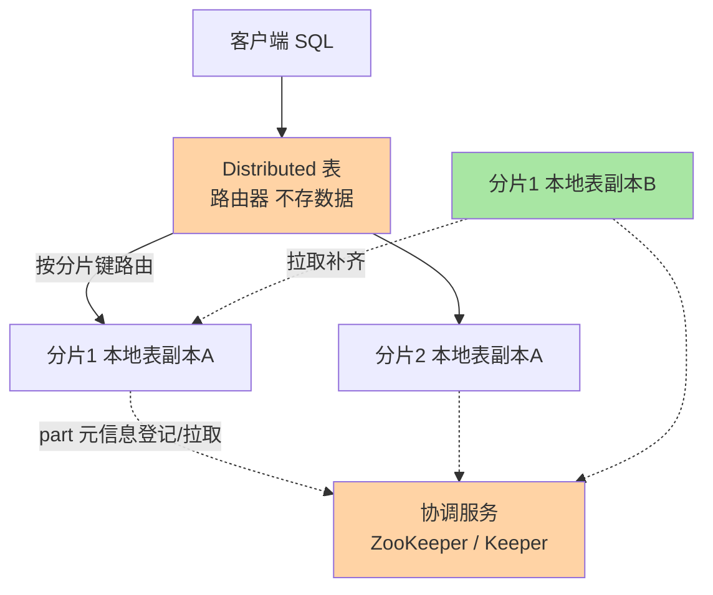
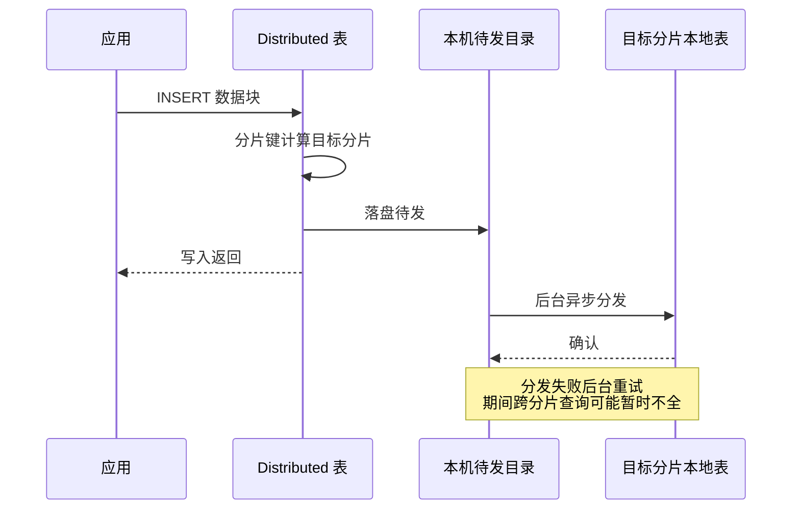
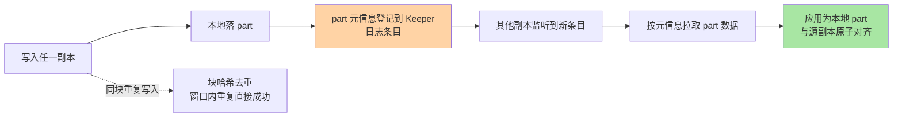
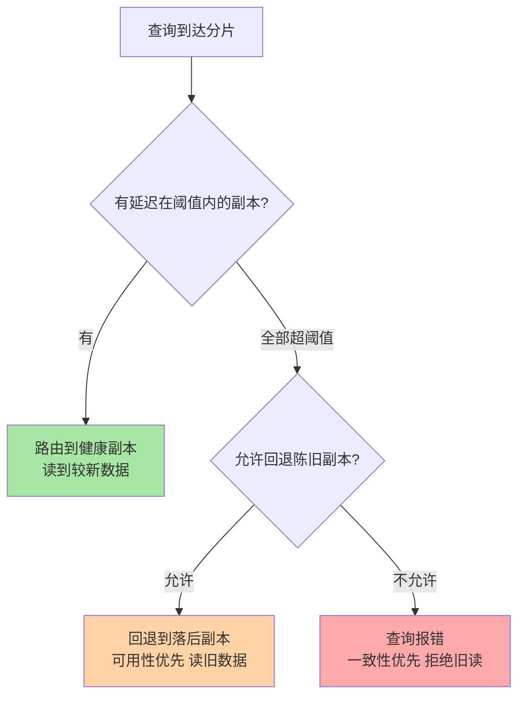

# 集群与分布式表深度：路由、副本同步与分片拓扑规划

> 一句话：Distributed 表引擎是一层「薄的查询与写入路由器」——它自己不存数据，只负责把 SQL 按分片键发往正确的分片、把结果归并回来；副本之间的数据同步则完全下沉到 ReplicatedMergeTree 与协调服务（ZooKeeper/Keeper），两层各管一摊，拆开看才不会被「分布式表」这个名字误导。

## 🎯 本文核心

**核心一句话：ClickHouse 集群 = 「分片管容量、副本管可用」两个正交层——Distributed 引擎做分片路由（按分片键算出数据该去哪个分片）与结果归并，ReplicatedMergeTree 做副本同步（part 元信息登记到协调服务、副本间按 part 拉取补齐）；查询一致性是显式权衡项：默认允许读略有延迟的副本（可用性优先），要强一致就付出仲裁与延迟的代价。**

机制链：SQL 打到 Distributed 表 → 按分片键计算目标分片 → 写入侧按集群配置分发到分片的某个副本 / 查询侧把子查询广播给各分片 → 各分片本地表执行 → 结果回传归并。链条上每一跳都是配置出来的：集群拓扑在配置文件里声明，路由规则由分片键决定，副本行为由 MergeTree 复制机制决定。

入门层讲过「ReplicatedMergeTree 基于 Keeper 做部件级同步」的概念，本篇把它放进集群全景：路由怎么算、分片键怎么选、副本落后怎么办、拓扑怎么规划，以及跨副本查询的一致性到底怎么权衡。

一图看懂集群两层分工：

## 一句话摘要

**Distributed 引擎的定位是「路由与归并的薄层」**（公开文档口径）：它本身不存储数据，写入时按分片键把数据块分发到目标分片，查询时把子查询发给所有相关分片、回收结果归并输出。**数据安全与复制由 ReplicatedMergeTree 承担**：每个 part 的元信息登记到协调服务（生产推荐 ClickHouse Keeper，ZooKeeper 兼容），副本间按元信息拉取补齐，天然多主、无单一复制流。分片键的选择决定数据倾斜与扩容难度——哈希分片求均匀、保序分片求裁剪，二选一是每张表都要做的取舍；跨副本读取默认是「可用性优先」的最终一致语义（延迟阈值内的副本都可能被路由到，阈值可配），强一致要显式开仲裁写入（`insert_quorum`，公开文档口径默认 0 即关闭）并接受写入延迟。业内惯例是「2 副本 × N 分片」起步、分片键选查询必带的维度、一致性按业务分级——明细读延迟可容忍，状态变更类写仲裁。

## 5W 速记卡

| 维度 | 一句话 |
|---|---|
| What | Distributed 薄路由层 + ReplicatedMergeTree 复制层的两层集群结构 |
| Why | 路由与复制解耦，各自独立演进与配置，故障域互不传染 |
| When | 单机容量/吞吐到顶要横向扩展时；多副本高可用要求时 |
| Where | cluster 配置声明拓扑；system.clusters / system.replicas 看健康 |
| How | 分片键算路由、Keeper 管复制、延迟阈值与仲裁管一致性 |

## 一、Distributed 表：不存数据的路由器

### 1.1 关键路径：写入分发与查询归并

以公开源码组织为参照（公开口径，实现细节随版本重构）：Distributed 引擎本体（对应社区仓库中的分布式存储实现）挂一张本地表作为目标，写入路径分三种模式（由集群配置的内部复制选项与引擎参数决定）：

1. **本地落盘再异步分发**（默认形态）：数据块先落到本机待发送目录，后台线程再按分片键发往目标分片——写入端零阻塞，代价是「分发失败要重试」与短暂的最终一致窗口
2. **同步分发**：写入请求里指定同步语义，数据直达目标分片成功才返回——延迟换确定性
3. **直连本地表**：业务绕过 Distributed 层按分片规则直写各分片（业内常见于超大规模写入，用客户端路由换掉一层转发开销）

查询路径则是**广播-归并**：子查询发给各分片的本地表，各分片本地执行（吃满篇 2 的向量化流水线），结果回传后由发起节点归并。聚合类查询能借分区与排序键在各分片预裁剪，归并量通常远小于明细量——这是「分片键 = 查询必带维度」收益的来源。

追问：异步分发期间查询会读到「缺一块」的数据吗？会——这就是最终一致的窗口。分片键若按哈希打乱，单条记录路由确定，但「跨分片的全量聚合」在分发未完成时确实可能少算刚写入的批次。再追问一层：为什么默认不做成同步？同步分发把写入延迟绑到最慢分片，任何一个分片抖动都会传导回写入端——默认异步是把「分布式开销」从写路径挪到后台，与 MergeTree「合并异步化」是同一设计思想的两次应用。

### 1.2 分片键怎么选：均匀、裁剪与扩容的三角取舍

分片表达式决定每条数据去哪个分片，三类典型选法对应三种负载假设：

| 选法 | 表达式形态 | 换来什么 | 代价 |
|---|---|---|---|
| 哈希分片 | `cityHash64(user_id)` | 数据均匀，热点打散 | 任何范围查询都要扫全部分片 |
| 保序分片 | 按日期/区间列直接取值 | 时间范围查询只命中部分分片 | 天然热点：新数据全进一个分片 |
| 业务路由 | 按租户/地域枚举值 | 数据主权与负载隔离 | 倾斜风险最高，依赖业务均匀性 |

业内惯例（公开口径）：**分析型负载优先哈希分片 + 查询条件不带分片键的假设；如果绝大多数查询都按时间范围切，用「哈希 × 时间」的复合思路（分片用哈希、分区用时间）兼顾两边**。反方案分析——为什么不用一致性哈希环让扩容时数据少迁移？社区引擎提供了跳跃一致性哈希类分片选项（扩容时只迁移少量区间），但代价是失去哈希取模的均匀粒度、且扩容仍需重写历史数据——ClickHouse 的扩容惯用解不是「数据迁移」而是「新数据进新分片 + 查询层聚合新旧分片」，业内叫扩容不动存量，一致性哈希在存储层的收益被这个运维模式替代了大半。

## 二、副本同步：Keeper 登记与 part 拉取

### 2.1 机制：多主复制怎么不冲突

ReplicatedMergeTree 的复制协议（公开文档口径）可以浓缩为「**登记 + 拉取 + 去重**」三步：

- **登记**：写入成功的副本把 part 元信息追加到 Keeper 上的复制日志，这条日志是副本间对齐的唯一真相源
- **拉取**：其他副本从日志发现新 part，主动向持有者拉取数据文件——没有主从复制流，任何副本都可写（多主）
- **去重**：同内容数据块的哈希在窗口内（`replicated_deduplication_window` 当前默认 10000 条，公开文档口径）登记，重复投递不产生第二个 part

冲突怎么不存在？因为 part 不可变——副本间同步的单位是「整个 part 的原子出现」，不存在「同一行被两边改成两个值」的合并问题。这是篇 1「不可变部件」设计红利在分布式层的延伸：**不可变性把复制协议从「冲突合并」降维成「补齐缺失」**。

追问：Keeper 挂了会怎样？写入会失败（登记不了元信息），但已同步的数据不丢——协调服务是控制面的单点，不是数据面的单点；生产用 Keeper 集群（3 或 5 节点仲裁，业内惯例）消除这个可用性风险。再追问一层：副本长期落后还能自动追上吗？能——拉取协议按元信息差异补齐，这是常态自愈；如果差异过大或元信息错乱，代价就变成重建副本，监控 `system.replicas` 的延迟与队列长度就是为了在「自动追不上」之前介入。

### 2.2 仲裁写入：强一致的显式代价

默认写入是「写本地成功即返回」，其余副本异步追——可用性优先。要强一致就显式开仲裁（`insert_quorum`，公开文档口径默认 0 关闭；开启后写入要等到指定数量的副本确认，与并行仲裁开关配合使用）：写入延迟上升、Keeper 压力上升、部分副本故障时写入可能失败——**用写路径的三项代价，买「写入至少多数副本确认」的确定性**。什么业务值得？状态变更类、下游强依赖「写后立即可读」的链路；明细流水类默认就够。

> 💡 **实战提示**
> - 副本健康三看：`system.replicas`（延迟秒数/队列任务数）、`system.replication_queue`（积压任务）、`system.part_log` 的拉取耗时——告警阈值按「正常延迟基线的数倍」设，不要拍脑袋定常数
> - 写入去重窗口依赖「块内容一致」，消费端重试要把同一批数据组装成一模一样的块，否则去重失效——幂等设计在客户端，不在引擎
> - 新集群起步直接用 Keeper（不自建 ZooKeeper），运维面更小；节点数选奇数保仲裁

## 三、跨副本查询：一致性与延迟的权衡

### 3.1 路由到哪个副本：默认的最终一致语义

查询打到一个分片时，实际路由到哪个副本由负载均衡策略决定（轮询/就近/按拓扑顺序等，可配）。关键机制是**延迟阈值过滤**：可配置一个「副本最大允许延迟」，超过阈值的副本先被排除；若所有副本都超阈值，可再配置「是否回退到陈旧副本」。两条配置项的组合构成四种姿态：

这就是「跨副本查询一致性」的真实答案：**引擎不给跨副本读的强一致承诺，给的是可配置的姿态选择**——监控大盘选「允许回退」（图比报错好看），财务口径查询选「不回退」（宁可报错不读旧数）。

### 3.2 一致性分级：一张决策表

| 业务形态 | 写入语义 | 读取姿态 | 理由 |
|---|---|---|---|
| 明细/日志/埋点 | 默认异步复制 | 允许回退陈旧副本 | 秒级延迟无感，可用性最高 |
| 监控告警 | 默认 + 副本延迟告警 | 阈值收紧但不回退 | 告警可容忍短暂不可用，不可容忍误读 |
| 状态/额度类 | 仲裁写入 | 写后读同一会话或主副本 | 强依赖写后立即可读 |

追问：为什么不做「每个查询都读最新副本」的自动强一致？跨副本的「最新」判定本身依赖协调服务的共识交互，每个查询都过一遍共识就把协调服务变成了读写路径的必经热点——业内对 OLAP 引擎的普遍定位是分析吞吐优先，强一致需求被显式留给业务分层（写仲裁 + 会话路由），这是定位取舍不是能力缺失。再追问一层：跨分片的聚合一致性呢？跨分片查询天然是「各分片某一时刻快照的归并」，引擎不提供跨分片全局快照——需要严格口径的报表走「先落数再出报表」的离线链路，这是公开文档与业内实践一致的处理方式。

## 四、一次副本延迟拖垮查询的排查复盘（匿名化实践叙事）

一次线上复盘（细节匿名化）：某集群报表查询随机性变慢，时快时慢无规律。排查路径：

1. **先看查询画像**：慢查询在各分片的执行耗时正常——瓶颈不在单机执行，怀疑路由层
2. **再看副本健康**：`system.replicas` 发现某分片一个副本延迟数十秒、复制队列积压——该分片磁盘 IO 被一个失控的大 mutation 占满，拉取任务排队
3. **对齐时间线**：延迟起点与那次无分区条件的 `ALTER UPDATE` 完全吻合（篇 1 的教训在集群层重演）
4. **处置与规约**：取消失控 mutation、等副本自愈追平；规约新增一条——大 mutation 分批执行且避开查询高峰，副本延迟告警接入值班

复盘结论：**单机层面的失控操作，在集群里会以「副本延迟 → 查询路由到慢副本 → 报表随机变慢」的形式二次伤害**——分布式系统的问题经常是单机问题的延迟投影。

## 五、拓扑规划：分片 × 副本怎么定

### 5.1 决策要素与常见形态

拓扑的三个输入：**容量**（数据总量 / 单机可用容量 → 最少分片数）、**写入吞吐**（集群合计写入 / 单分片安全写入 → 分片数下限）、**可用性等级**（副本数：2 副本起步是业内惯例，扛单机故障；更高等级叠加备份与跨机房）。输出形态：

- **小规模**：单分片 × 2 副本——容量够用先不引入分片复杂度，这是十万到亿级总量最常见的起步形态
- **中规模**：N 分片 × 2 副本，分片键哈希打散，Keeper 3 节点
- **大规模**：N 分片 × 2 副本 × 多机房部署，写入端按分片规则直连本地表，Distributed 层只承载查询归并——拓扑驱动思考的成熟形态

### 5.2 不同量级的思考：架构约束驱动解法

- **十万级（总量十万行级）**：这一档的核心问题是要不要上集群，而不是怎么上——约束来源是「单机容量与吞吐对十万级是完全过剩的，集群复杂度是纯负债」；思考方式：反直觉驱动——这一档的正确答案是单机 + 定期备份，副本都可以缓一缓
- **百万级（总量千万到亿行）**：这一档的核心问题是副本的高可用价值，而不是分片——约束来源是「单机仍装得下，但单机故障的恢复成本开始超过副本成本」；思考方式：可用性驱动——单分片 × 2 副本 + Keeper 3 节点，分片等容量信号出现再议
- **千万级（总量百亿行级 / 日增千万以上）**：这一档的核心问题是分片键的负载假设是否成立——约束来源是「分片一旦定型，改键 = 重写历史数据」；思考方式：假设验证驱动——先用查询日志验证「绝大多数查询形态」，再定哈希或复合分片，这一步的错误要到扩容时才暴露
- **亿级（日增亿行以上 / 总量 PB 级）**：这一档的核心问题是拓扑与组织的写入链路解耦——约束来源是「单分片写入与合并的物理天花板决定了分片数下限，跨机房部署决定了副本语义」；思考方式：拓扑驱动——写入端直连分片、Distributed 只做查询归并、扩容走「新数据进新分片」，容量规划进入季度例行的架构议题

自下而上收尾：四档的不变量是「分片定型成本极高、副本随时可加」——所以顺序铁律是**副本先行、分片慎行**；触发升级的信号依次是：单机故障恢复痛（上副本）→ 单机容量或写入到顶（上分片）→ 查询形态固化后仍要扩容（改拓扑不动存量）。与篇 1 写入侧、篇 2 执行侧合起来看，三篇的量级主线是同一条：**机制免费红利先用满，架构级动作按信号触发**。

## 六、什么时候用与不用：明确推荐

- **什么时候用 Distributed 表**：多分片集群的标准入口——**明确推荐**「Distributed 统一承载查询归并 + 写入量不大时也走它分发」；写入超大时改「写入直连本地表 + 查询仍走 Distributed」
- **什么时候不用分片**：单机容量与吞吐够用（十万到亿级总量）——不分片，只按需加副本；为「将来可能扩展」提前分片是过度设计，分片键的假设很可能先于容量过时
- **什么时候开仲裁写入**：状态/额度类强依赖写后立即可读——开；明细流水类——默认关闭，别为不存在的一致性问题付写延迟
- **什么时候不用跨副本读旧数据**：财务口径、对账链路——配置为不回退陈旧副本，宁可查询失败也不给下游旧数

## 七、Trade-off：两层结构的取舍

Distributed 与复制分层的取舍：**押注「路由薄、复制下沉」的职责分离，换来每层独立演进（路由层可以直连绕过、复制层可以离开路由层单用）与故障域隔离；代价是理解成本（两层各自的配置与状态都要看）与最终一致的默认语义（强一致要跨层显式配置）**。反方案分析——「为什么不用一个内置自动分片的大引擎？」内置自动分片（自动平衡、自动重分布）意味着路由与存储强耦合，任何重平衡都可能是黑盒数据移动，失败模式不可预测——ClickHouse 把重平衡做成显式运维动作（新分片 + 数据按需迁移），牺牲便利换可预期。「为什么副本同步不做成 Raft 强一致日志？」Raft 日志把写吞吐绑死在共识层，与 OLAP 的高吞吐批量写入假设冲突；part 级「登记 + 拉取」把共识范围压缩到元信息，数据面保持多主直写——这是分析负载下的合算解。

## 你们可能会问

**Q1：Distributed 表和本地表应该对业务暴露哪个？**
统一暴露 Distributed 表（业务无感分片拓扑）；写入端超大或直连方案成熟后才考虑暴露本地表。混用两种入口时，权限与监控要按入口分别建，避免「业务直写了某个分片」的隐性依赖。

**Q2：分片键定错了能改吗？**
代价是重写历史数据（建新表按新键回灌），在线改不了——所以分片键是集群层最重的决策，用真实查询日志验证假设后再定；定性错误（热点打不开/裁剪失效）比容量不足更难补救。

**Q3：Keeper 和 ZooKeeper 怎么选？**
新集群直接选 ClickHouse Keeper（公开文档口径：协议兼容、更轻、自带维护工具）；存量 ZooKeeper 集群可继续复用。选型看运维面与团队熟悉度，协议层两者对复制机制无差别。

**Q4：怎么衡量「该加分片了」？**
两个硬信号：单分片磁盘水位与写入吞吐持续逼近安全上限（写路径），或合并长期追赶不上（篇 1 的信号在集群层重现）。加副本解决「查得快、扛故障」，解决不了「写得进、装得下」——别用副本顶容量问题。

## 开放问题

- 存算分离形态下「分片」的物理含义在松动：数据上对象存储后，计算节点的分片边界与副本语义都在重新定义，扩容不动存量的运维模式可能进一步演化为「计算层无状态扩容」——社区各路线尚在收敛
- 跨分片全局一致快照查询目前是空白，依赖业务侧离线链路兜底；轻量级全局快照是否会成为引擎能力，尚无定论

## 自测三问

1. Distributed 层与 ReplicatedMergeTree 层各自负责什么？「登记 + 拉取 + 去重」为什么不会产生副本冲突？
2. 哈希分片与保序分片各换来什么、付出什么？为什么说分片键是集群层最重决策？
3. 跨副本读的默认语义是什么？「允许回退陈旧副本」与「不回退」分别适合什么业务？

本系列特性层三篇到此收口：写入路径（篇 1）→ 执行引擎（篇 2）→ 集群拓扑（篇 3），机制主线一路从单表到集群。

## 🎯 核心带走

- **核心一句话**：集群 = Distributed 薄路由层（分片键算路由 + 广播归并）+ ReplicatedMergeTree 复制层（Keeper 登记、副本拉取、块去重）——分片管容量、副本管可用，一致性是显式配置的权衡项
- **主线**：路由三模式（异步分发/同步/直连）→ 分片键三角取舍（均匀/裁剪/扩容）→ 复制三步协议 → 延迟阈值与回退的四姿态 → 拓扑决策（副本先行、分片慎行）
- **哪里会坏**：分片键假设错误（定型后难改）、副本延迟被路由命中（报表随机变慢）、单机失控操作在集群层二次投影、用副本顶容量
- **边界**：本篇是集群机制层；扩容的具体操作步骤、跨机房容灾演练属专题层，留待后续系列

## 📌 数据与事实声明

- 写于 2026-09-24；仲裁写入默认关闭（`insert_quorum` 默认 0，公开文档口径）、去重窗口（`replicated_deduplication_window` 默认 10000）等参数均为 ClickHouse 官方文档当前公开口径，历史版本默认不同，随版本演进可能调整
- 「生产推荐 Keeper」「2 副本 × N 分片起步」「Keeper 3/5 节点仲裁」为官方文档与业内惯例（公开口径）
- 负载均衡与延迟阈值相关配置的机制描述基于公开文档，具体配置项名称与默认值以所用版本文档为准
- 文中排查叙事已匿名化，不含真实公司/系统/数据

## 📚 参考资料

| 类型 | 标题 | 来源 |
|---|---|---|
| 官方文档 | Distributed 表引擎章 | clickhouse.com/docs/en/engines/table-engines/special/distributed |
| 官方文档 | 数据复制 Replication 与 Keeper 章 | clickhouse.com/docs/en/guides/sre/keeper |
| 官方文档 | 集群配置与 system.clusters 参考 | clickhouse.com/docs |
| 公开仓库 | ClickHouse 社区源码（Distributed 存储实现） | github.com/ClickHouse/ClickHouse |
| 系列导航 | 本系列篇 1（part 不可变性前置）与篇 2（执行引擎前置） | `docs/data/clickhouse/特性层/深入理解MergeTree与查询引擎系列/` |
