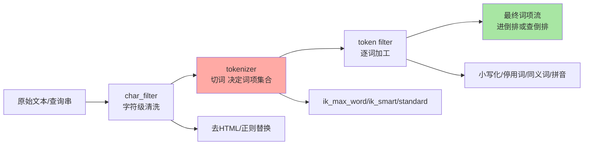
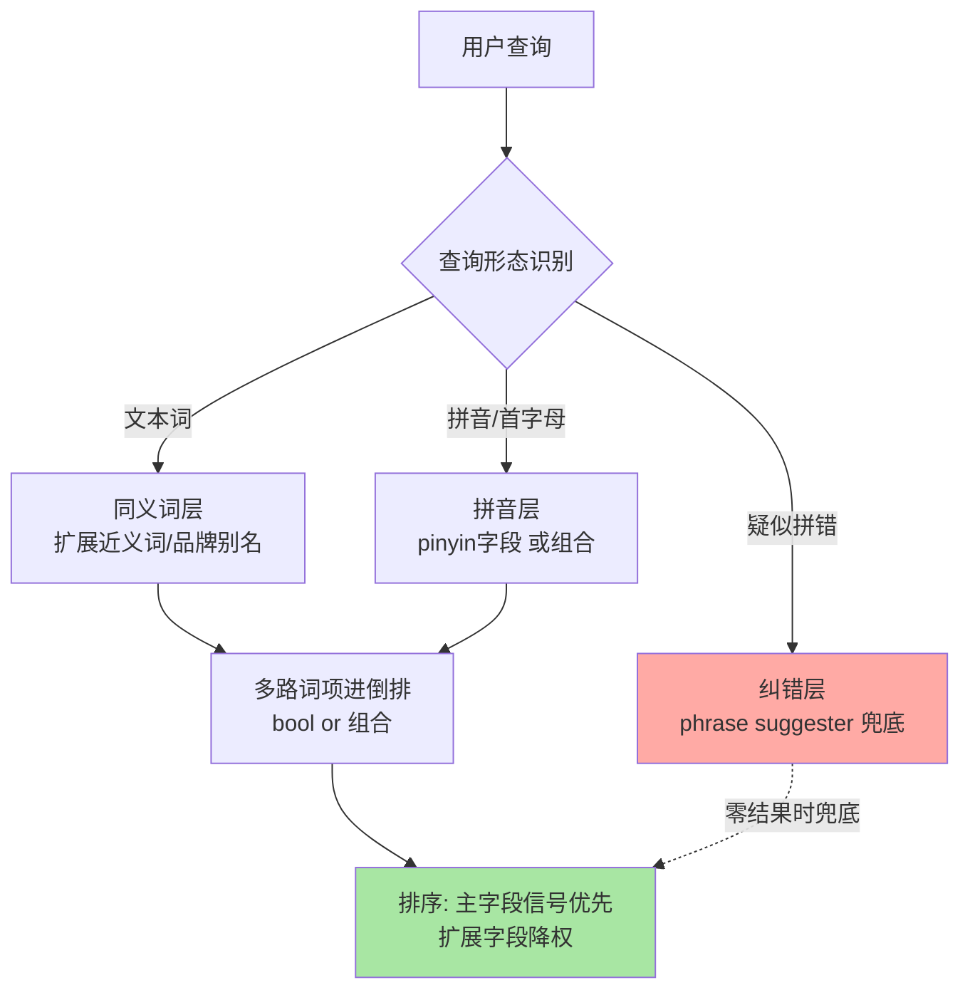
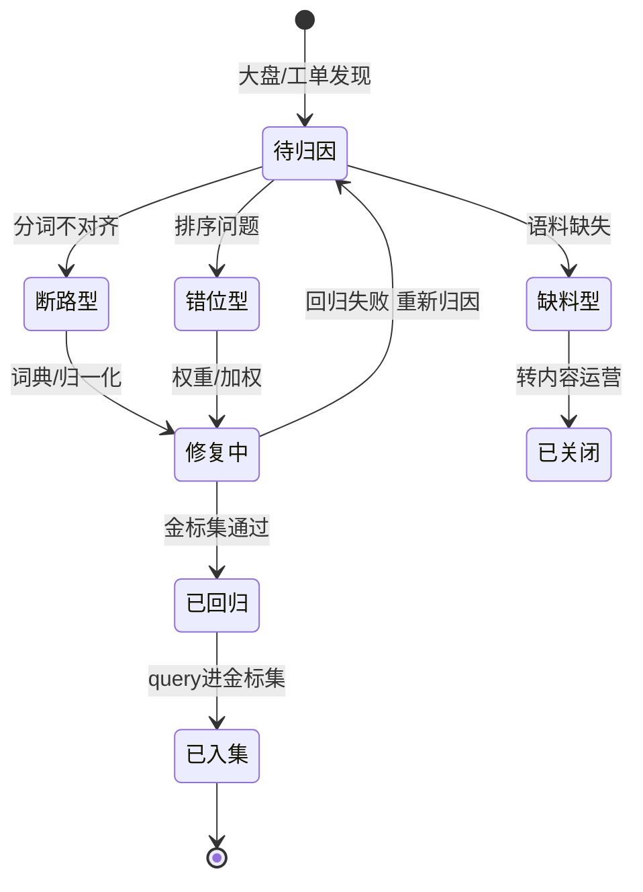
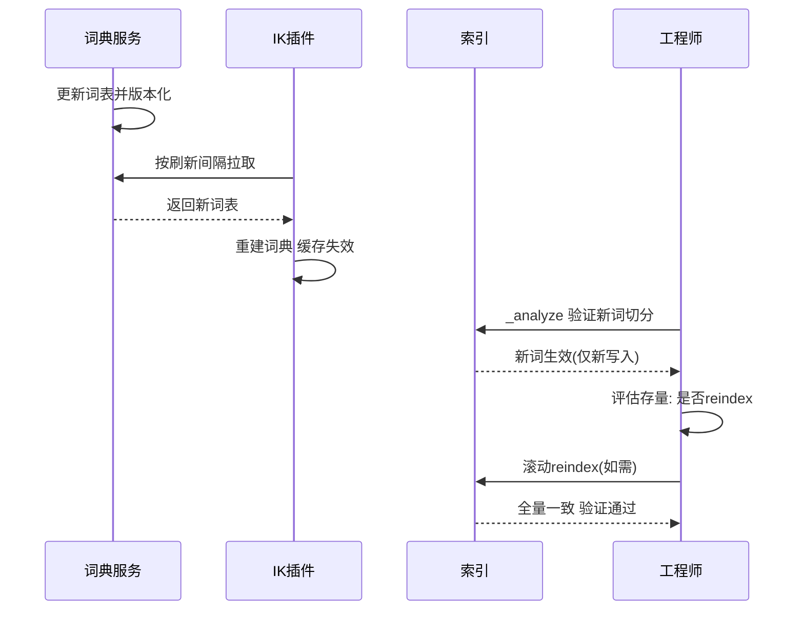

# 中文分词与检索质量：analyzer 链路、分词选型与 bad case 治理

> 中文检索的所有质量问题，一半在分词（查询与文档没切出同一批词），另一半在排序与语料治理。分词不是「装个 IK 就完事」——analyzer 链路的三个环节各有坑，索引期与查询期的分析器可以不同（这正是同义词的命门），检索质量要靠指标体系闭环而不是肉眼刷列表。这篇把中文检索从链路到治理串成一条完整的工程线。

## 一句话摘要

**analyzer 是三级流水线：char_filter（字符清洗）→ tokenizer（切词）→ token filter（词项加工）**——索引期与查询期各跑一条，两边词项空间必须对齐。IK 的 `ik_max_word`/`ik_smart` 是「索引细切 + 查询粗切」的经典配对；同义词/拼音/纠错是三个独立的召回扩展层，各有索引膨胀与歧义代价。**检索质量治理的闭环是：零结果率与首屏点击率监控 → bad case 归类（召回断路 / 排序错位 / 语料缺失）→ 分层修复 → 金标集回归**。

## 🎯 本文核心

**核心一句话：中文检索质量 = 词项空间对齐（分词）× 召回扩展（同义词/拼音/纠错）× 排序质量（BM25 与业务加权）三个独立因子的乘积——乘积结构决定了治理必须分层归因：零结果先查分词对齐，结果不对先查排序，语料缺失谁也救不了；而任何「检索体验不好」的笼统描述，都必须拆解成可度量的坏因才有治理价值。**

机制链：查询串 → char_filter 清洗 → tokenizer 切词 → filter 加工（归一化/同义词/拼音）→ 倒排查询 → BM25 排序 → 质量指标回流 → bad case 归因 → 链路某层修复。全文一句话可重构：「对齐词项空间，分层扩召回，指标闭环治质量」。

## 前置阅读

- 入门层篇 5《分词器与中文分词》：analyzer 概念与 IK 初识
- 入门层篇 6《文本处理》：同义词/停用词/拼音的用法概览
- 本系列特性层篇 2：BM25 排序与错乱排查（本篇的排序质量部分引用其 explain 流程）

## 目标导向

本文是什么：analyzer 链路的机制拆解 + 中文分词选型对比 + 召回扩展层的工程组合 + 质量评估闭环。功能是什么：让「改了词典为什么不生效、同义词更新为什么要 reindex、零结果率怎么降」三问有链路级答案。能得到什么：分词选型决策表、词典/同义词的热更新流程（含验证与回退）、bad case 治理的分类归因体系。为什么用：搜索质量的日常治理与搜索平台建设，必看。

## 一、边界：入门层讲过什么，本文讲什么

| 内容 | 入门层 | 本文 |
|---|---|---|
| analyzer 概念、IK 安装与基本用法 | ✅ 讲过 | 不重复安装与语法 |
| analyzer 三环节的机制细节与选型对比 | 未讲 | **本文核心一** |
| 同义词/拼音/纠错的工程组合与代价 | 提了 API | **本文核心二** |
| 检索质量指标与 bad case 治理体系 | 未讲 | **本文核心三** |
| BM25 打分原理 | ✅ 篇 2 已述 | 只在排序归因处引用 |

## 二、analyzer 链路：三级流水线的每一级都在改写词项空间



三个环节的职责边界必须刻进直觉：

1. **char_filter（字符级）**：在切词前改写字符流——HTML 标签剥离、全半角归一、自定义正则替换。它改变的是「tokenizer 看到的输入」，做清洗类工作
2. **tokenizer（切词级）**：把字符流切成词项——**这一级决定词项集合，是整个链路影响力最大的一级**。中文的一切分词器差异都在这一级
3. **token filter（词项级）**：对切好的词逐个加工——小写化、停用词移除、同义词扩展、拼音转换。同义词放在这一级意味着**它产出的是额外词项**（扩展进倒排或查询），不是运行时改写

用 `_analyze` API 观察链路（每个环节的产出可见）：

```json
GET my-index/_analyze
{
  "analyzer": "ik_max_word",
  "text": "中华人民共和国国歌"
}
```

**索引期与查询期可以（且经常应该）用不同的 analyzer**——mapping 里 `analyzer` 管写入、`search_analyzer` 管查询。这对设计自由度的唯一约束是：**查询期产出的词项必须能在索引期词项集合里找到**（对齐原则）。ik 的经典配对「索引用 `ik_max_word` 细切、查询用 `ik_smart` 粗切」正是这个原则的产物：索引侧切得越细（含粒度更小的子词），查询侧任意粒度的词都命中；查询侧切得粗（只留最合理的词），排序信号更干净。

**追问：为什么查询侧不也用 `ik_max_word` 细切，召回不是更全吗？** 细切会把查询拆出大量碎片词项——「苹果手机」拆成「苹果/手机/苹/果/手/机」级联碎片后，BM25 对每个碎片的匹配都计分，长尾单字噪音直接污染排序（相关性工单的经典来源，呼应特性层篇 2 的词法对齐排查）。**索引侧细切扩召回、查询侧粗切保精度——两边不对称才是对的**。

这里埋着一条重要的**设计思想**：analyzer 把「文本长什么样」与「词项怎么产生」解耦成可独立配置的流水线——切多细、扩什么、滤什么，全部变成配置声明而不是代码逻辑。这条链路设计的深远影响是**分析策略变成数据（配置）而非程序**，意味着它可以被版本化、被灰度、被影子验证——本篇后面所有「词典热更新」「金标集回归」的工程手段，都建立在「分析策略是可版本化数据」这个设计决定之上。

**再追问：词典切错的词还有救吗？** IK 的主词典可自定义扩展词、停用词、同义词（remote 扩展词典支持热更新，公开口径）；但「未登录词」（新词、人名、型号）识别是分词器的固有难题，切错的粒度已烧进倒排——**修词典只影响新写入**，存量文档要 reindex 才能重新切分。这就是「词典更新流程必须含 reindex 评估」的机制原因。

## 三、中文分词选型：一个决策表说清

| 维度 | IK（max_word/smart） | 标准 standard（单字切分） | 拼音分词器 | 自定义/其他（jieba 等） |
|---|---|---|---|---|
| 切分质量 | 词典 + 规则，主词典可维护 | 单字/连续二元，无语义 | 产出拼音词项 | 算法切分，各有词典机制 |
| 索引膨胀 | 中（细切产生子词） | 高（单字词表大） | 高（双份词项） | 视实现 |
| 热更新 | remote 词典支持（公开口径） | 不涉及 | 不涉及 | 视实现 |
| 维护成本 | 词典运营（新词入库） | 零 | 零 | 升级兼容风险 |
| 适用 | 通用中文搜索主切分 | 兜底/长尾单字召回 | 搜索框输音/输首字母场景 | 特定语料生态 |

选型决策的三条主线：

1. **主切分选 IK 级别的词典分词器**：单字切分能「搜到」但排序信号稀碎（所有文档都含大量常用单字，BM25 的区分度坍塌），标准分词器只适合做兜底而非主战场
2. **`ik_max_word` 索引 + `ik_smart` 查询**是默认起点；排序噪音大时查询侧再收紧，或对碎片词降权（多数字段再配一个「粗切字段」专供排序信号）
3. **搜索框输入不可控**是另一维度：输入法带出的全拼/首字母（如 "sjzs"）靠拼音分析器在**另一个字段**上扩展，与主字段「或」组合——不是替换主切分

**为什么不选「一个字段塞下所有分析器的产物」的反方案（multi-field 堆砌到极端）？** 每多一路分析就多一份倒排体积与写入 CPU，全拼+首字母+细切+粗切+原文五路并存，索引体积可到原文的数倍（业内认知口径）——膨胀的隐性账单是页缓存命中率下降，检索变慢。**扩展字段按「有真实查询日志支撑」逐路开通**，没有流量证据的分析路径不值得付索引税。

## 四、同义词、拼音与纠错：三个召回扩展层的组合

三个扩展层解决的问题域不同，组合方式也不同：



### 同义词：机制最重的一层

同义词 filter 的两种模式机制不同（公开口径）：

- **索引期（index-time）**：文档写入时把同义词组展开成多词项烧进倒排——查询快、语义可控；代价是**改同义词要 reindex**（旧倒排不变）
- **查询期（search-time）**：查询时把用户词扩展成同义词组——改词即时生效；代价是查询变复杂、多词项的打分合成容易失真（`synonym` filter 在查询期的多位置展开有打分歧义，官方推荐查询期用 `match` 的多子句替代或在索引期做）

**追问：为什么同义词更新后「不生效」是最常见的误报？** 两种模式各有生效条件：索引期同义词改了，**新文档生效、存量文档不生效**——检索不到效果的原因是测试查询命中的恰是存量文档；查询期同义词改了立即生效，但**分词在 synonym 之前还是之后**（filter 链顺序）决定扩展是否成功——链路顺序错则扩展从未发生。排查口诀：先确认模式，再 `_analyze` 验证链路产出，最后才谈生效。

**为什么不选「全部同义词都放查询期」图省事？** 查询期扩展让每次查询膨胀出 N 倍词项，排序打分在多词项合成时稀释主词信号（品牌别名与原文同权后排序错乱）；且同义词组规模增长后查询解析成本线性上升。**高频稳定的同义词组烧进索引期，少量试探性的放查询期**——生效速度与排序质量的分层取舍。

### 拼音层与纠错层

- **拼音**：`pinyin` 分析器产出全拼与首字母词项，独立字段承载（`pinyin_field`），搜索框场景与主字段组合查询；首字母歧义大（"zs" 可对应海量词），业内惯例是首字母只做**候选扩展不做排序信号**
- **纠错**：`phrase suggester` 基于索引词频给出「你是不是要搜」候选——放在零结果或低结果时的兜底位（`did_you_mean`），而不是每次查询都跑纠错（它是额外的一次检索，成本独立计价）

## 五、检索质量评估：从肉眼刷列表到指标闭环

质量治理的前提是**把「体验不好」翻译成可度量的指标**：

| 指标 | 度量什么 | 数据来源 |
|---|---|---|
| 零结果率 | 召回断路（分词/过滤条件过严） | 查询日志统计 |
| 首 3 位点击占比 | 排序头部质量 | 行为埋点 |
| 改写率 | 用户对首屏不满意的程度 | 查询日志（同会话改写行为） |
| MRR / NDCG | 标注集上的排序质量 | 人工标注 / 金标集 |

### bad case 治理的归因分类（步骤级）

第 1 步 前置：从监控大盘拉取零结果 query Top N 与「无点击 Top N」（每周例行）。
第 2 步 归因分类，逐条判型：
- **召回断路型**（零结果）：查询与文档没切出同一词项——`_analyze` 双侧验证，修词典/同义词/归一化
- **排序错位型**（有结果但顺序不对）：explain 归因（特性层篇 2 的三步流程），修字段权重或加权策略
- **语料缺失型**（确实没有该内容）：链路无解，转内容运营——**这一型占比高说明搜索没病，供给有病**
第 3 步 修复动作：只动一个因子，词典/同义词变更走流程（下述热更新步骤）。
第 4 步 验证：金标 query 集回归 + 修复后的 query 加入金标集（**bad case 是金标集的养料，闭环在这完成**）。
第 5 步 回退：词典与同义词的变更都要留版本（见下），回归不达标即回退。

每条 bad case 的生命周期是一个状态机，闭环的关键是「入集」这一步：



### 词典热更新的操作步骤（前置/命令/验证/回退）

热更新是一条「服务-分析器-索引」三方的协作链，时序先看清楚：



前置：IK 配置 remote 扩展词典（HTTP 地址由配置指向词典服务），词典服务提供文本行格式的词表。
命令：词典服务更新词表 → IK 按配置的刷新间隔自动重拉（公开口径支持热更新，间隔由配置决定）→ 无需重启节点。
验证：`GET index/_analyze` 用 `ik_max_word` 验证新词切分生效；**注意这只验证分析器，不验证存量文档**——存量生效需评估 reindex（见第五节追问）。
回退：词典服务回滚词表版本，IK 下轮拉取自动生效；已按新词典写入的文档需 reindex 回滚——**词典版本化是回退能力的前提，没有版本管理就不要开热更新**。

## 六、不同量级的思考：检索质量治理的档位约束

- **十万级（语料十万文档、日查询十万级以内）**：约束来自「反馈信号稀薄」——查询量不足以支撑统计意义上的质量指标，靠人工抽检与经验直觉；思考方式是「专家拍板」：把领域词典建扎实比搭指标体系优先。这一档的核心问题是「词典准不准」，而不是「指标全不全」
- **百万级（搜索成为主要入口之一）**：约束来自「bad case 开始成规模」——零结果率与改写率可统计了，治理从被动接工单转向主动看大盘；思考方式是「指标闭环」：每周 bad case 例会 + 归因分类 + 修复回归。这一档的核心问题是「坏因有没有归类」，而不是「单条 case 怎么修」
- **千万级（多业务共用搜索平台）**：约束来自「策略冲突」——不同业务的词典、同义词、排序偏好互相打架，各业务自改参数的秩序崩坏；思考方式是「平台化治理」：词典/同义词中心化运营、业务级策略隔离、变更审批流。这一档的核心问题是「策略有没有秩序」，而不是「某业务的指标好不好」
- **亿级（搜索生态与语义检索并立）**：约束来自「语义鸿沟」——词典匹配的天花板可见（说法不同但意图相同的查询），治理边界从「词项对齐」扩展到「意图对齐」，向量检索进入组合；思考方式是「混合检索」：稀疏（BM25）+ 稠密（向量）双路召回、统一重排。这一档的核心问题是「意图层面接没接住」，而不是「词项层面切得准不准」

思考方式总结：十万级靠「专家拍板」，百万级靠「指标闭环」，千万级靠「平台化治理」，亿级靠「混合检索」——约束来源依次是信号稀薄、case 规模、策略冲突、语义鸿沟，每档约束不同，治理手段整体换代。

**自下而上与触发升级**：先测两个数——零结果率与 bad case 工单增速，实测值决定所在档位。触发升级的信号：人工抽检跟不上 bad case 增速（该建指标闭环）、业务间词典冲突工单出现（该做平台化）、词典扩到维护成本陡增且排序 complaints 仍多（该评估混合检索）——升级依据是治理带宽与约束的失配，不是别人都上了所以我也上。

## 典型场景

- **电商搜索**：品牌/型号词典运营 + 查询期同义词（促销别名）+ 零结果兜底纠错——三条扩展层全开的典型场景，索引税换来转化率（业内认知）
- **内容站内搜索**：长尾查询占比高，拼音层优先级高于同义词层；首屏点击率对排序敏感，`ik_smart` 查询侧收紧的价值更大
- **企业内部检索**：内部代号/项目名是未登录词重灾区，remote 词典热更新 + 定期从查询日志挖新词入库是核心运维动作

## 业内惯例

> 💡 **实战提示**：查询日志是词典运营的金矿——高频零结果 query 每周挖一次，新词/别名入库走「发现-评审-入库-回归」四步，业内成熟的搜索团队都把词典运营做成了例行流程而不是救火。

> 💡 **实战提示**：任何词典/同义词变更先在影子索引验证——新建索引按新分析器写入抽样数据，金标集跑一遍对比，通过后再上生产；直接改生产 analyzer 字段配置会触发 reindex 依赖评估，跳过这一步的变更基本都翻过车。

> 💡 **实战提示**：`_analyze` 是分词问题的唯一仲裁者——「我觉得切错了」不算证据，双侧（索引 analyzer 与查询 analyzer 各跑一遍）`_analyze` 输出对比才是；把它做成工单模板的第一步，归因效率翻倍。

> 💡 **实战提示**：排序信号污染排查时，先关掉拼音/同义词扩展字段跑一次对照——扩展词项的噪音贡献往往比主字段大，对照实验十分钟出结论，比 explain 逐层拆更快。

## 事故复盘三则

**事故一：同义词批量上线把排序冲乱。** 某平台一次导入数千组同义词（查询期生效），上线当日首屏点击率显著下滑，改写率上升。排查路径：抽查 bad case 发现品牌别名与通用词同权参与打分，主词信号被稀释——「连衣裙」的查询被同义扩展后，别名词项的文档大量涌入前排。处置：同义词分组分批回滚，仅保留高置信组，其余改索引期 + 降低扩展字段权重。复盘 Action：同义词变更必须有金标集回归门槛；「同义词越多召回越好」是错觉，扩展词项全部参与排序。

**事故二：词典热更新后新旧文档检索不一致。** 某内部检索平台把一批内部项目代号加入 remote 词典，热更新生效后测试反馈「有的文档搜得到、有的搜不到」。排查路径：`_analyze` 显示新词已生效 → 对比两份文档的索引时间——新词典后写入的文档可命中，存量文档切分未变不可命中。处置：对受影响索引滚动 reindex，检索恢复一致。复盘 Action：词典变更流程必须含「存量影响评估」——reindex 的成本与窗口在变更评审时就要给出，而不是上线后补。

**事故三：首字母拼音层引来海量噪音。** 某站内搜索开通首字母拼音层后，两字母短查询的结果集暴涨且相关度极低，用户投诉「搜索变乱了」。排查路径：查询日志统计两字母 query 的占比与点击率——点击率近于零，确认首字母匹配大多是噪音。处置：首字母词项只在零结果兜底位生效，且不参与主排序；全拼保留在主组合里。复盘 Action：扩展层的「参与排序权重」必须单独评审——**每一路召回扩展都要回答「它的词项在排序里占多少话语权」**。

## 常见误区

- **「换分词器能同时改善召回与排序」**：两者经常冲突——细切扩召回稀释排序，粗切提精度缩召回；先明确当前主要矛盾是「搜不到」还是「排不对」，再动刀
- **「停用词表越大越好」**：中文语境过度移除停用词会误伤语义（「的」在部分品牌/型号里有区分意义），停用词表要做回归验证而不是拿来就用
- **「同义词字典从通用词表直接导入」**：通用同义词表在垂直语料里错误率高（「苹果」在水果语境与数码语境是两个词），同义词组必须垂直化运营
- **「纠错要每次查询都跑」**：phrase suggester 是独立检索，成本另计——正确位置是零结果/低结果兜底，常态常驻是性能税

## Trade-off：召回、精度与索引税的三方账

检索质量的 **Trade-off** 核心是「**召回 × 精度 × 索引税**」三角：每加一路召回扩展（同义词/拼音/细切子词），召回率上升，但排序信号被稀释（精度承压）+ 索引体积与写入成本上升（索引税）。取舍的机制依据是「查询日志的证据强度」：有真实流量支撑的扩展路径才值得开——**用日志投票决定付多少索引税**。反过来说，脱离流量证据的「能力堆料」（全分析器上齐）买来的是召回率的纸面数字，付出的是页缓存命中率与排序质量的实亏。取舍成熟的团队都有一张「扩展路径开通台账」：每路扩展对应的查询流量占比、指标收益、索引体积代价——把 Trade-off 从感觉变成账本。

**打破砂锅：为什么检索质量的治理总是「没有终点」？** 因为它对抗的两端都在流动——用户查询的分布随业务与季节漂移，语料内容随运营节奏更新，昨天的词典对今天的新词失效。设计思想上的正解不是「一次治理到位」而是「**把治理做成常态化的流水线**」：监控发现、归因分类、修复验证、金标沉淀四段循环——质量体系的价值不在某一刻的指标多好，而在指标恶化时多快能归一。这也是跨系统看搜索平台与数据平台共享的工程哲学：**治理能力比治理结果更接近核心竞争力**。

## 什么时候用/不用：扩展层决策

- **用词典分词器（IK 级）做主切分**：一切中文搜索的默认起点，明确推荐
- **用「索引细切 + 查询粗切」配对**：通用搜索默认配置，明确推荐；排序噪音大时收紧查询侧
- **用查询期同义词**：高频稳定的别名/品牌词——建议索引期烧入；试探性的、需要即时调整的放查询期并控规模
- **用拼音/首字母**：搜索框场景按查询日志证据开通；首字母只做兜底不进主排序
- **不用「全链路堆料」**：没有流量证据的扩展路径一律不开——索引税与排序稀释是实打实的成本
- **不用「搜索质量靠调参解决」**：语料缺失型 bad case 占比高时，转内容供给侧，链路层无解

## 你们可能会问

**Q1：怎么评估「该不该从单字切分换到 IK」这类切分方案变更？**
金标集先行：抽样真实 query 构建集合，两种切分各自跑零结果率与人工排序评分——对比「搜到率」与「首屏质量」两个维度。切换成本（全量 reindex + 词典运营人力）摊进评估，业内常见的结论是「主切分必须词典级，单字只做兜底字段」。

**Q2：IK 词典该多久更新一次？更新有什么节奏？**
跟随「查询日志新词挖掘」的节奏而不是日历节奏——高频零结果词里评审出该入词典的，批量按周/双周入库（业内惯例量级）。每次更新都是一次「变更」，走影子验证 + 版本化 + 回归，宁可节奏慢半拍，不要不做验证。

**Q3：同义词、拼音、纠错三层的投入优先级怎么排？**
看零结果归因的分布：召回断路里分词不对齐占大头先修词典，其次同义词（扩展面大），拼音看用户输入形态（移动端输入法用户多则优先），纠错最后（它解决的是「错」不是「缺」）。没有归因分布就排优先级，是拍脑袋工程。

**Q4：向量检索会取代分词吗？**
短期内是组合而非取代——语义向量解决「说法不同意图相同」，但精确匹配（型号、错误码、专有名词）仍是稀疏检索的主场；混合检索（稀疏 + 稠密双路 + 重排）是公开口径下的主流演进方向。分词与词典运营的价值长尾在「精确性」，这一段向量短期接不住。

## 开放问题

- 大模型时代的查询改写（query rewriting）正在进入搜索链路——「先让模型改写查询再走倒排」与传统的同义词扩展是叠加还是替代，工程边界仍在探索
- 检索质量评估从人工标注走向「模型评估 + 行为信号」混合，MRR/NDCG 的标注成本瓶颈可能被打破，bad case 归因的自动化是活跃方向

## 🎯 核心带走

- **核心一句话**：中文检索质量 = 词项对齐 × 召回扩展 × 排序质量的三因子乘积——分词管对齐（索引细切 + 查询粗切），同义词/拼音/纠错分层扩召回（各有索引税与排序稀释代价），零结果率与首屏点击率闭环治质量（bad case 归因三类：断路/错位/缺料）
- **机制链**：char_filter → tokenizer → token filter 双侧链路 → 对齐原则 → 扩展层组合 → 指标回流 → 金标集闭环
- **哪里会坏**：同义词更新后存量不生效（没 reindex）、链路顺序错导致扩展从未发生、首字母噪音进主排序、词典变更无版本无法回退
- **边界**：本篇管分词与质量治理；BM25 排序与 explain 在特性层篇 2，混合检索与向量在入门篇 21 与整合层

## 📌 数据与事实声明

- 写于 2026-09-17，analyzer 机制与 API 以 Elasticsearch 8.x 官方文档为准；IK 分词器的热更新与配置以该开源项目公开文档口径为准，具体配置项随版本变化，使用前核对
- 「索引体积可达原文数倍」「两字母查询点击率近零」等为业内经验口径与 anonymized 综合认知，非实测精确值
- 文中事故均为多来源 anonymized 综合叙事，不指向任何具体公司

## 📚 参考资料

| 类型 | 标题 | 来源 |
|---|---|---|
| 官方文档 | analyzers / token filters / synonym graph | elastic.co/guide（8.x） |
| 官方文档 | phrase suggester / pinyin 相关插件文档 | elastic.co/guide 与插件仓库（公开口径） |
| 开源项目 | IK Analyzer（infinilabs/analysis-ik 系口径）与 remote 扩展词典说明 | github.com（公开仓库） |
| 原理书 | 《Lucene 实战》分析（Analysis）章节 | 公开出版 |
| 方法论 | 信息检索评估指标（MRR/NDCG）标准定义 | 公开教材（如《Introduction to Information Retrieval》） |
