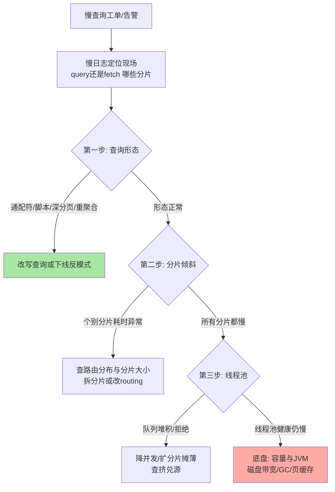
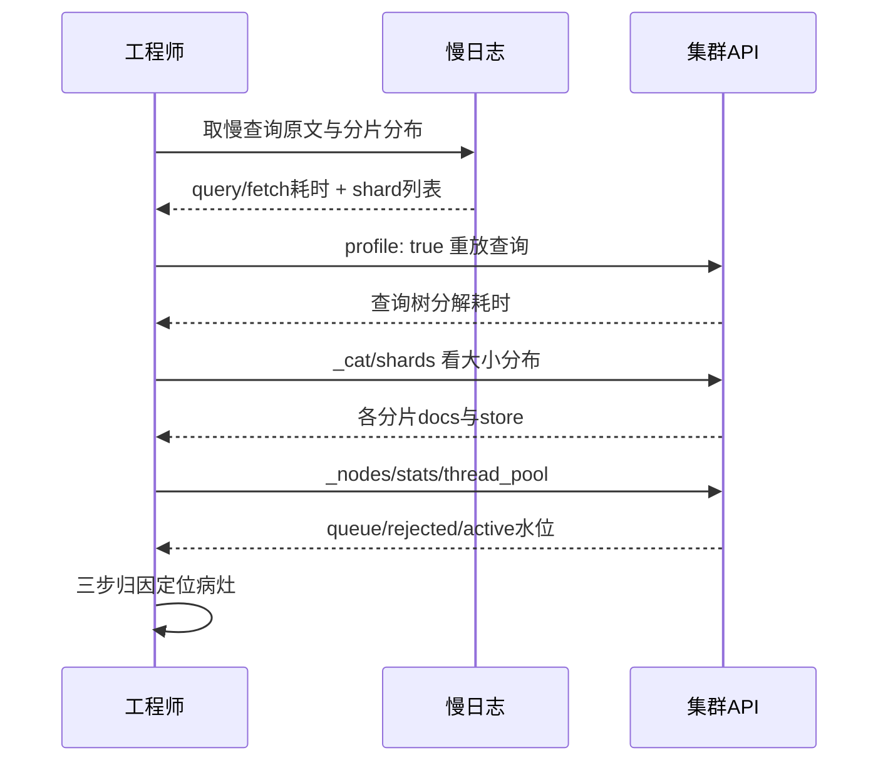
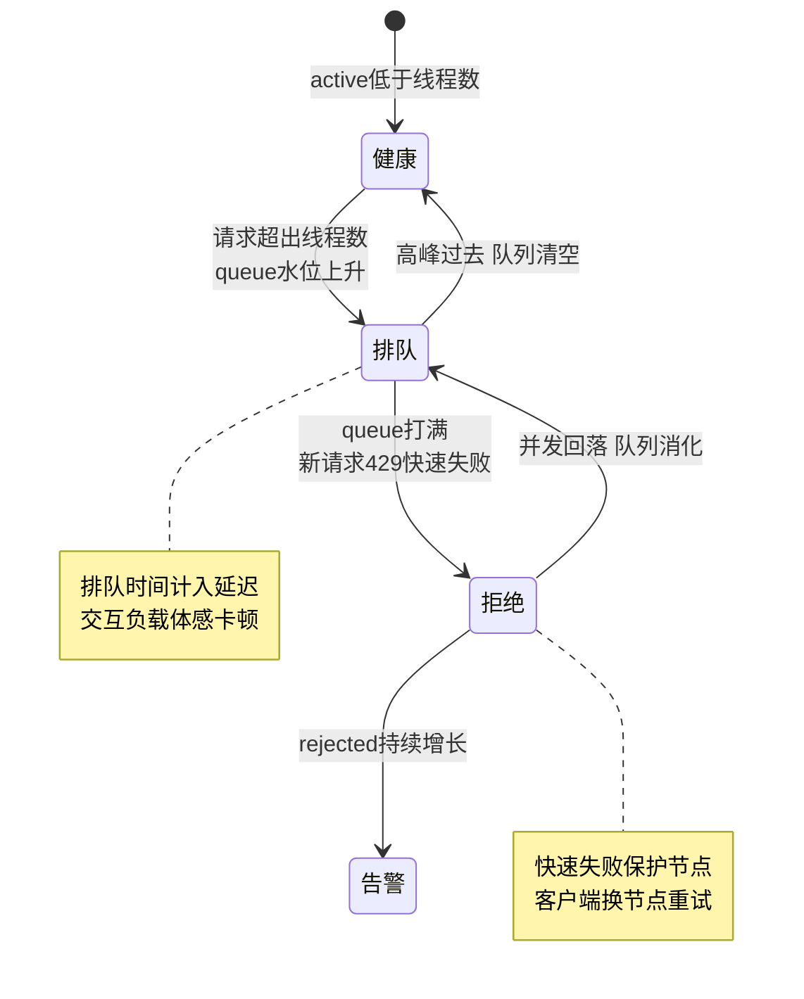
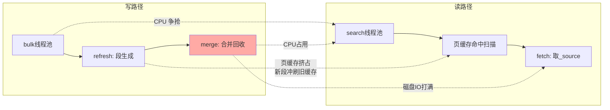

# 性能调优与慢查询归因：三步定位、读写挤兑与容量底盘

> 慢查询治理最容易犯的错是「上来就调参」——refresh、缓存、堆内存挨个拧一遍，慢查询还在，参数基线先乱了。正确的路径是**归因先于调优**：慢日志圈定现场，三步归因（查询形态 → 分片倾斜 → 线程池）定位病灶，再回到容量与 JVM 的底盘审视约束。这篇给出一套从日志到参数的完整归因流程。

## 一句话摘要

**慢查询的病灶九成藏在三处**：查询形态本身贵（通配符前缀、脚本、深分页、高基数聚合）、分片间忙闲不均（路由倾斜、分片大小失衡）、线程池过载（队列堆积与拒绝）。三步归因层层下钻后，剩下的少数派才是容量与 JVM 的结构性问题。**读写互相挤兑是 ES 特有的放大器**——同一节点的写线程（refresh/merge/bulk）与搜索线程共享 CPU、磁盘与页缓存，任何一方的尖峰都是另一方的慢查询。

## 🎯 本文核心

**核心一句话：性能治理的正确顺序是「先归因、后调参、再扩容」——慢日志提供现场，profile 归因查询形态，`_cat/shards` 与 hot_threads 归因倾斜与线程池，容量与 JVM 是最后才动的结构层；而读写挤兑要求任何优化都放在「读写混部」的真实负载下验证，隔离压测的结论在混部现场会失效。**

机制链：慢日志捕获（query/fetch 两阶段阈值）→ 第一步查询形态归因（profile API 分解）→ 第二步分片倾斜归因（per-shard 耗时对比）→ 第三步线程池归因（队列/拒绝水位）→ 读写挤兑分析（共享资源盘点）→ 容量与 JVM 底盘复盘。全文一句话可重构：「日志定现场，三步定病灶，底盘定上限，混部定真值」。

## 前置阅读

- 入门层篇 18《性能优化》：慢查询定位的初次建立
- 本系列特性层篇 1（写入链路）、篇 3（聚合执行）：挤兑分析引用其结论

## 目标导向

本文是什么：慢查询三步归因的完整工作流 + 读写挤兑机制 + 容量与 JVM 参数手册。功能是什么：让「慢日志开了看不懂、参数调了没效果、扩容后反而更慢」三问有流程化答案。能得到什么：可复制的归因步骤（含验证与回退）、参数清单、读写混部容量模型。为什么用：搜索/日志集群的性能治理与故障复盘，必看。

## 一、边界：入门层讲过什么，本文讲什么

| 内容 | 入门层 | 本文 |
|---|---|---|
| 慢日志怎么开、常见慢查询模式 | ✅ 讲过 | 不重复语法，直接进归因流程 |
| 三步归因的完整决策树与操作步骤 | 未讲 | **本文核心一** |
| 写与读互相挤兑的机制 | 未讲 | **本文核心二** |
| 容量推导与 JVM 参数级手册 | 提了概念 | **本文核心三** |
| 聚合/分页各自的深度优化 | 未讲 | 特性层篇 3 / 篇 4 已述 |

## 二、慢日志：两阶段阈值是归因的第一手证据

ES 把一次搜索拆成 **query 阶段**（各分片执行、取候选）与 **fetch 阶段**（拉取命中的 `_source` 与高亮）——慢日志也分两个阈值组，**两阶段分开记录是归因的第一把钥匙**：

```json
PUT my-index/_settings
{
  "index.search.slowlog.threshold.query.warn": "3s",
  "index.search.slowlog.threshold.query.info": "1s",
  "index.search.slowlog.threshold.fetch.warn": "1s",
  "index.search.slowlog.threshold.fetch.info": "500ms",
  "index.search.slowlog.level": "info"
}
```

- **query 阶段慢**：病灶在分片执行（查询形态、数据量、倾斜）——归因走第二步、第三步
- **fetch 阶段慢**：病灶在取回体积（`_source` 过大、高亮重算、深度分页的取回集）——优化方向是字段裁剪（`_source` 过滤 / docvalue_fields）而非查询改写
- 慢日志的 `took` 与分片级 `shard` 字段能直接看出**是否只有个别分片慢**——倾斜归因的入口就在日志行里

## 三、三步归因：决策树与操作步骤



### 第一步：查询形态归因（profile 分解）

三步归因在实操里是一条 API 协作链，先看全景再逐步展开：



前置：拿到慢日志里的具体查询原文。
命令：`GET index/_search` 请求体加 `"profile": true`——返回每个分片上查询树的分解耗时（rewrite / weight 创建 / 迭代打分各占多少）。
验证：profile 输出里 `breakdown` 计数器定位最贵的节点；反模式自检表对照——前缀通配符（`keyword*` 式）、每请求脚本、`from` 深分页、无界 terms 列表、高基数嵌套聚合。
回退：profile 只读不改状态，无回退需求；查询改写走灰度（金标 query 集回归后再全量）。

业内经验口径：慢查询工单里反模式占比过半，第一步就终结大部分战斗。**为什么归因先看形态而不是先看资源？** 因为资源症状（CPU 高、队列深）是形态的果——先改资源等于给反模式扩容，让它活得更滋润。

**追问：为什么前缀通配符查询特别贵？** `te*` 类查询无法用词典直接定位，要走 term 枚举 + 逐项展开——基数大的字段上等价于把词典扫一遍。它贵在「展开发生在每次查询、每个分片」，缓存帮不上（形态组合无限）。真有前缀需求，改用 `index_prefixes` 或 edge_ngram 预建索引——**把查询期展开换成写入期预建**，是这类病灶的标准手术。

### 第二步：分片倾斜归因

前置：慢日志确认「个别分片慢」或 P99 与 P50 差距异常大。
命令：`GET _cat/shards?v&h=index,shard,docs,store,node` 看分片大小与文档数分布；`GET _nodes/hot_threads` 看热点线程集中在哪个节点哪个分片。
验证：把最慢分片与最快分片的 docs/store 对比——比值显著偏离 1 即结构倾斜；若分片大小均匀仍倾斜，查 `routing` 是否把热点用户/租户全打到一个分片（自定义路由的典型副作用）。
回退：拆分片（新建索引 reindex）是大动作，先做无状态缓解——查询侧指定 `preference` 分散热点只对部分场景有效，倾斜的结构性根治仍需重建索引。

### 第三步：线程池归因

线程池是一个「健康 → 排队 → 拒绝」的三态机，水位位置决定归因方向：



前置：前两步排除了形态与倾斜，或慢查询伴随 429。
命令：`GET _nodes/stats/thread_pool`——看 `search` 与 `write` 池的 `queue`（当前排队）、`rejected`（累计拒绝）、`active`（活跃线程）。
验证：rejected 持续增长 = 供给不足（分片数 × 单分片能力 < 并发需求）；queue 水位高但 rejected 低 = 慢在执行不在排队（回到第一/二步）。
回退：线程池 `queue_size` 可以动态调，但**调大队列只是把拒绝改成超时**——排队时间计入延迟，用户侧从「快速失败」变「慢慢等死」，大多数场景回退参数比调大更正确。

**为什么 search 线程池默认队列不大（公开口径千级）而 write 队列万级？** 搜索是交互负载，排队 1 秒用户已感知卡顿——宁可快速失败让客户端换节点重试；写入是吞吐负载，排队是正常形态。两个池的默认值差异是「交互 SLA 与吞吐 SLA」的参数化表达——**默认值是设计意图的载体，改默认值前先读懂意图**。

## 四、写与读的互相挤兑：同一台机器的两面

ES 节点上写路径（bulk → refresh → merge）与读路径（search → fetch → 聚合）共享四类资源：



四个挤兑点逐个说清：

1. **CPU**：bulk 解析 + 索引构建与查询打分抢核——写高峰的 CPU 尖峰直接抬升搜索 P99，表现是「搜索没变但变慢了」
2. **页缓存**：refresh 持续生成新段，冲刷掉搜索热数据的缓存位——写密集期搜索的页缓存命中率下降，扫描从内存跌到磁盘
3. **磁盘 IO**：merge 是后台大 IO 消耗方，与 fetch 取 `_source` 抢带宽——merge 风暴期间慢日志 fetch 阶段异常增多（呼应篇 1 的放闸事故）
4. **堆与 GC**：两路径的临时对象共享堆，任一方的分配尖峰都触发 GC 停顿，停顿期间所有请求排队

**反方案分析：为什么不选「把读写参数同时调到最大」？** 资源是守恒的——写参数放大的是写路径资源占用，读参数放大的是读路径占用，两头放大只会让挤兑更频繁。「性能调优」在混部集群里实质是**资源分配的政治学**：先定 SLA 优先级（读优先还是写优先），再把另一侧的峰值削平（写入错峰、merge 限速、导入窗口隔离）。

**追问：挤兑为什么没法靠「给每条查询加速」根治？** 打破砂锅看底层：挤兑不是单条查询慢，而是**多类负载共享资源后的排队论问题**——单条查询再快，只要写路径的尖峰与读路径的尖峰同相（同时发生），队列照排。根治手段只有两种物理形态：错峰（让尖峰不同相）或隔离（让负载不共享资源）。这就是为什么「查询优化了一轮还是慢」的工单，最后往往终结在写入窗口调整而不是第 N 轮查询改写——**同相与异相的判断，比单条查询的快慢更根本**。

设计思想层面，混部治理的核心是「**为可预测的负载预付确定性**」：批量任务的时间窗是可以预测的，把可预测的负载钉进固定窗口，把不可预测的在线流量独享资源弹性——秩序来自「按可预测性分层」，这比按资源量分层更能扛住规模增长，也是跨周期看混部集群治理成熟度高低的第一判据。

**反方案分析：为什么不选「读写始终分开部署」？** 读写分离集群（读集群订阅写集群数据）确实根治挤兑，代价是数据新鲜度延迟 + 双份资源成本 + 链路复杂度。取舍锚点是「读写比的悬殊程度与新鲜度容忍度」：读写均衡、容忍秒级的中小规模，混部更经济；搜索 SLA 苛刻或写入巨量的大规模，分离是终点方案——**混部是默认，分离是升级，反过来做就是浪费**。

### 挤兑的隔离动作（步骤级）

前置：确认挤兑源（hot_threads 里 merge/refresh 线程与 search 线程同时在顶）。
命令：`PUT index/_settings` 把写密集索引的 `refresh_interval` 拉长；merge 限速观察 `indices.recovery` 与合并线程占用后按需调整；导入任务移出业务高峰或迁到专用写入集群。
验证：hot_threads 复测——search 线程占比回升，慢日志 P99 回落；`_cat/thread_pool/search` 队列水位恢复基线。
回退：所有 settings 动态可逆，逐项回退并记录每次回退后的指标变化，找出真实收益项。

## 五、容量与 JVM：底盘参数手册

### 参数清单

| 配置项 | 默认值 | 推荐分档 | 为什么 |
|---|---|---|---|
| JVM 堆大小 | 物理内存 50%（官方建议口径） | 中小集群 ≤31GB；大集群 31GB 封顶 | 压缩对象指针（compressed oops）在 32GB 附近失效，堆翻倍反而换不来对象寻址密度（业内认知） |
| 剩余内存（页缓存） | 物理内存另 50% | 只读场景可再让 10% 给缓存 | Lucene 的段访问走页缓存，缓存命中决定扫描速度 |
| GC | 8.x + JDK17 默认 G1（公开口径） | 堆 ≤8GB 可默认；更大堆盯 G1 停顿 | 大堆下停顿目标需要实测校准，换收集器是最后手段 |
| `thread_pool.search.queue_size` | 1000（公开口径） | 默认不动；隔离压测后再议 | 队列是延迟的化身，交互负载宁可快速失败 |
| `indices.queries.cache.size` | 堆 10%（公开口径） | 默认起步；命中率低可下调 | 缓存命中率长期低于两位数占比时，它只是堆的租客 |
| `index.refresh_interval` | 1s | 写密集 30s；导入窗口 -1 | 每次刷新生成新段，挤兑放大器（详见特性层篇 1） |
| `cluster.routing.allocation.disk.watermark.low/high` | 85% / 90%（公开口径） | 默认守住，水位告警提前 5% | 磁盘水位直接影响段合并空间与页缓存效率 |

### 容量推导（步骤级）

前置：明确两个输入——日增数据量（含副本与合并余量的经验系数，业内常用 1.3-1.5 倍做预算，公开口径）与峰值读写并发。
命令：磁盘量 = 日增量 × 保留天数 × 冗余系数；内存量 = 堆（≤31GB）× 2 的节点规格 × 节点数；分片数 = 单分片目标体量（业内经验口径：搜索型 10-50GB、日志型 30-100GB）反推。
验证：上线后盯三个底盘水位——磁盘 ≤ 水线下沿、堆使用率稳态 < 70%、页缓存命中率高位平稳；任一越线即触发容量评审而不是临时调参。
回退：容量不足的结构解（加节点/拆索引）不可「回退」，只能前置——容量评审要早于峰值季节，这一步没有运行时后悔药。

**追问：为什么容量公式看起来那么粗（经验系数）还能用？** 因为容量的目的是「定档不定额」——推导结果决定买什么规格的机器、几个节点，误差 20% 用余量吸收；精确到 GB 的推导是伪精度，负载形态变化后精确值立刻作废。**容量规划的价值在「决策颗粒度」而不是「数字精度」**——这是设计思想层面与「不编造精确数字」纪律同源的工程判断。

## 六、不同量级的思考：性能治理的档位约束

- **十万级（单机/小集群，日活搜索量十万级）**：约束来自「人力与误配置风险」——这个量级的慢查询几乎全是查询形态问题，资源永远够；思考方式是「治理反模式」，不做任何容量动作。这一档的核心问题是「查询写得对不对」，而不是「机器给够没有」
- **百万级（三五个节点起步的搜索服务）**：约束来自「混部资源曲线」——读写开始互相可见，挤兑成为慢查询的主要形态；思考方式是「错峰与限流」：写入错峰、慢查询限流、线程池水位监控。这一档的核心问题是「峰值时刻谁在挤兑谁」，而不是「参数怎么调优」
- **千万级（多索引、多业务线共享集群）**：约束来自「公平性与隔离」——业务互相挤兑升级为常态，单集群的线程池隔离不足以表达业务优先级；思考方式是「分集群/分角色部署」：读写分集群、大小业务分集群、冷热分节点。这一档的核心问题是「业务之间有没有边界」，而不是「单集群还能压榨多少」
- **亿级（多集群多中心的平台化形态）**：约束来自「光速与协调成本」——跨中心复制延迟、全局元数据同步成本成为新瓶颈，性能问题升格为架构问题；思考方式是「单元化与就近服务」：数据分单元、流量就近、全局序查询改异步步进。这一档的核心问题是「架构形态对不对」，而不是「单点性能怎么救」

思考方式总结：十万级靠「治理反模式」，百万级靠「错峰与限流」，千万级靠「分集群隔离」，亿级靠「单元化与就近服务」——约束来源依次是人力、混部资源、业务公平性、物理与协调成本，约束每升一档，思考方式必须整体换代。

**自下而上与触发升级**：先测三个信号——慢日志 P99/P50 比值（倾斜信号）、线程池 rejected 增速（供给信号）、页缓存命中率（底盘信号），实测值决定所在档位。触发升级的信号：P99 与 P50 差距持续拉大（该查倾斜）、rejected 每天都见（该做隔离）、参数调优边际收益归零（该上分集群）——升级依据是信号不是容量数字，业务翻倍只是提醒，信号越线才是动作。

## 典型场景

- **搜索服务 P99 抖动**：先查慢日志 fetch 阶段（`_source` 过大）与写高峰重合度——十次里八次是挤兑而非查询本身（业内经验口径）
- **日志集群周期性变慢**：对齐 merge 周期与 rollover 时刻——「变慢时刻表」与写入活动表叠图，挤兑源一目了然
- **扩容后反而更慢**：查分片再平衡期间的恢复 IO 与副本同步——扩容的「施工期抖动」常被误诊为「扩容无用」，等平衡完成再评估才是有效结论

## 业内惯例

> 💡 **实战提示**：慢日志三级阈值（warn/info/debug）按「告警用 warn、周报用 info、专项排查临时开 debug」分层使用——debug 级别全量常开会把日志子系统自己变成负载源。

> 💡 **实战提示**：每次性能变更（参数/查询/扩容）都落一条变更记录：动机、预期指标、实际指标、回退条件——性能治理跨周期看是台账战，没有台账的团队每个高峰都在重新归因一遍。

> 💡 **实战提示**：hot_threads 的正确用法是「高峰期定时采样」而不是「出事才看」——出事时的现场往往已经过去，定时采样的历史栈才是慢时刻的真相来源。

> 💡 **实战提示**：读写混部的容量验证必须做「混部压测」——读写分别压测达标不等于混部达标，挤兑是叠加态的产物；混部压测的成本远低于上线后第一次高峰事故。

## 事故复盘三则

**事故一：一个通配符查询打穿搜索线程池。** 某平台运营后台新上线「模糊搜索」功能，实现是 `*关键词*` 前后通配——上线半小时多节点 CPU 顶格，搜索全站超时。排查路径：hot_threads 显示 search 线程全部卡在 term 枚举 → 慢日志抓到高耗时通配符查询 → 定位到新功能。处置：功能侧改为 edge_ngram 预建字段，通配符查询下线；后台加查询白名单。复盘 Action：查询形态评审进功能上线检查单；`_all` 类全字段通配在网关层直接拦截。

**事故二：扩容一倍，P99 纹丝不动。** 某搜索集群容量翻倍后 P99 无改善，团队怀疑「ES 到顶了」。排查路径：慢日志对比发现慢查询集中在个别分片 → `_cat/shards` 显示某业务索引分片大小是其他索引的数十倍，热点分片钉死在原节点——扩容加的是「平均容量」，救不了「结构倾斜」。处置：该索引按时间 reindex 重切分片，P99 随即回落。复盘 Action：扩容评审前置分片分布体检，「平均够用」不等于「每分片够用」；倾斜索引有独立告警。

**事故三：导入任务把白天搜索挤成事故。** 某团队把历史数据回灌安排在工作日白天执行（评估时只看了写入侧指标），回灌期间 merge 风暴挤占 IO，搜索 fetch 阶段 P99 恶化数倍，业务侧体验事故。排查路径：慢日志 fetch 阶段异常增长与回灌时间窗完全重合 → hot_threads merge 线程持续在顶。处置：回灌立即降速并移至夜间窗口，索引 refresh 拉长，merge 限速观察。复盘 Action：所有批量任务执行前过「混部影响评估」——写入侧达标不是放行条件，读写联合指标才是；批量任务接入统一调度与窗口审批。

## 常见误区

- **「慢了先调 JVM/堆」**：堆是底盘不是病灶，九成慢查询死在形态/倾斜/挤兑三处（业内经验口径）——底盘动作排最后，且动底盘前要有 GC 与内存曲线证据
- **「线程池队列调大能扛住高峰」**：队列是延迟的化身，调大只是把拒绝换成超时——交互负载的正确方向是限流与扩容供给
- **「慢查询缓存命中率低所以加缓存」**：先看查询形态是否可缓存——形态无限组合的查询（通配符/脚本/随机参数）加多少缓存都白费，先治形态再谈缓存
- **「性能指标只看 P50」**：P50 舒适掩盖倾斜与长尾——P99 与 P50 的差距才是倾斜与挤兑的体温计

## Trade-off：性能、成本与复杂度的三边账

性能治理的终极 **Trade-off** 在三边之间：性能（P99 目标）、成本（资源量）、复杂度（架构层数）。加机器降复杂度涨成本；读写分离买性能付复杂度；单元化买扩展性付全局一致性。取舍的机制依据是「约束迁移」：反模式治理约束在工程纪律，混部调优约束在资源曲线，分集群约束在业务公平性，单元化约束在物理成本——**每一档 Trade-off 的正确解，都由当前最紧的那条约束决定**。跳档付成本（小集群做单元化）与滞档扛风险（亿级流量还混部）都是错配；取舍的功夫不在选最优解，在认出「现在哪条约束最紧」。

## 什么时候用/不用：治理手段决策

- **用慢日志 + 三步归因**：一切慢查询问题的入口，明确推荐——先归因后动手
- **用混部调优（错峰/限流/refresh 调速）**：百万级内的挤兑治理，明确推荐；成本最低见效最快
- **用读写分集群**：搜索 SLA 苛刻或写入量持续压挤兑上限时，明确推荐；接受新鲜度延迟与双份成本
- **不用「盲调 JVM/换 GC」**：没有内存曲线与停顿证据不动底盘——底盘变更的影响面全集群共享
- **不用「单集群硬扛多业务」**：业务间出现系统性挤兑且无法错峰时，隔离是唯一正解，调参是拖延

## 你们可能会问

**Q1：profile 输出太复杂，有没有更快的粗判方法？**
有：慢日志里 query 与 fetch 的耗时占比先看一眼——fetch 慢直接查 `_source` 体积与字段裁剪，不进 profile；query 慢再看「慢的是固定查询还是随机查询」（固定查询可缓存可优化，随机组合先治形态）。两眼定位不了再开 profile 细读，多数工单到不了这一步。

**Q2：怎么区分「负载高了变慢」和「系统坏了变慢」？**
看曲线形态：负载性变慢与流量曲线同构（峰值慢、谷值快），故障性变慢是台阶式跳变且与流量无关；再验证线程池——负载性慢的 queue 水位高、rejected 有增速，故障性慢常见 active 打满但 queue 空（执行卡死而非排队）。两问下去方向基本清楚。

**Q3：堆使用率长期 80% 上下，要不要扩堆？**
先看构成：`_nodes/stats` 拆开堆占用大头——fielddata/查询缓存等「可清理项」占比高就先治理（呼应篇 3 的 text 聚合教训）；稳态构成健康但接近水位线，扩堆才成立。扩堆还有 31GB 与物理内存分配的联动约束，不是单一数字的决策。

**Q4：监控大盘最该放哪几个性能指标？**
最小集合：慢日志条数速率、search/write 线程池的 queue 与 rejected、P99/P50、页缓存命中率、merge 与 refresh 的资源占用。这六个指标分别覆盖「症状、供给、倾斜、底盘、挤兑源」五个归因入口——大盘不在多，在能直接回答「三步归因第一步从哪进」。

## 开放问题

- 存算分离让「页缓存」的位置从本地内存移向缓存服务层，挤兑模型中的第三类资源（磁盘 IO）正在被重新定义，容量推导公式需要换代
- 服务端自适应限流（按线程池水位自动降级低优先查询）已有方向性讨论，「错峰靠人」可能演进为「错峰靠系统」，归因工作流的自动化是活跃方向

## 🎯 核心带走

- **核心一句话**：性能治理 = 先归因（慢日志两阶段 → 查询形态/分片倾斜/线程池三步）→ 再调参（挤兑错峰与限流）→ 后动底盘（容量与 JVM 排最后）——读写混部是 ES 性能问题的放大器，一切优化结论必须在混部负载下验证
- **机制链**：慢日志捕获 → profile 定形态 → `_cat/shards` 定倾斜 → 线程池水位定供给 → 共享资源盘点定挤兑 → 底盘复盘定上限
- **哪里会坏**：反模式查询打穿线程池、结构倾斜让扩容无效、批量任务的 merge 风暴挤兑在线搜索、堆水位误判引发盲调
- **边界**：本篇管归因与容量底盘；写入侧节奏在特性层篇 1、聚合内存与熔断在篇 3、分页成本在篇 4

## 📌 数据与事实声明

- 写于 2026-09-17，机制与默认值以 Elasticsearch 8.x 官方文档公开口径为准（线程池/缓存/水位默认值随版本可能变化，使用前按所用版本核对）
- 「反模式占工单过半」「单分片 10-50GB（搜索型）/30-100GB（日志型）」「冗余系数 1.3-1.5」「31GB 压缩指针阈值」等为业内经验或公开技术口径，非本仓库实测值
- 文中事故均为多来源 anonymized 综合叙事，不指向任何具体公司

## 📚 参考资料

| 类型 | 标题 | 来源 |
|---|---|---|
| 官方文档 | search slow log / index settings | elastic.co/guide（8.x） |
| 官方文档 | thread pool / circuit breaker / disk watermark | elastic.co/guide（8.x） |
| 官方博客 | JVM 堆大小与 compressed oops 口径（size your heap） | elastic.co（公开口径） |
| 原理书 | 《深入理解 Elasticsearch》（原书第 3 版）性能与调优章节 | 公开出版 |
| 实战书 | 《Elasticsearch 实战与原理解析》监控与调优章节 | 公开出版 |
