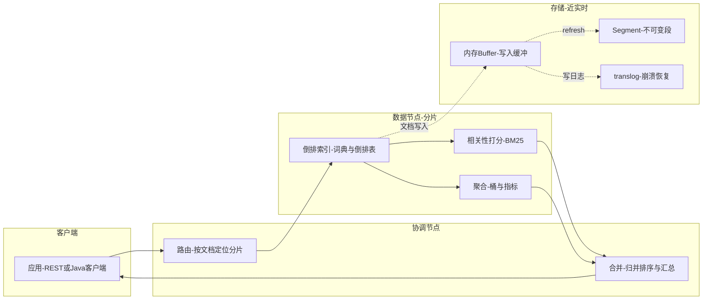
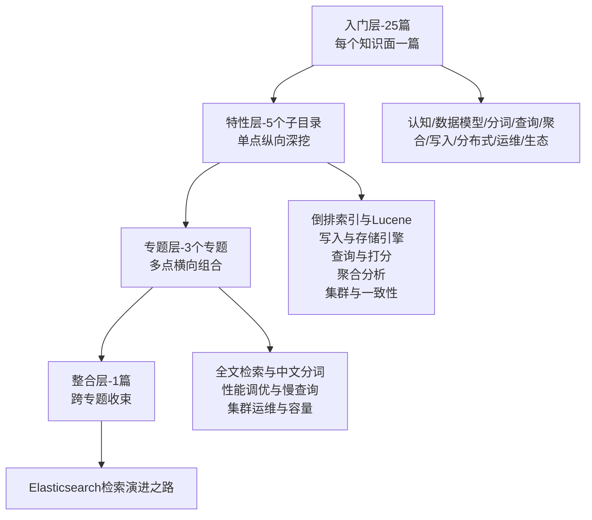

# Elasticsearch 系列导读 · 从一条查询的一生认识 ES

> 📖 本系列共 25 篇（0_导读 + 1-24 正文），覆盖 Elasticsearch 整个知识面：认知与原理、数据模型、分词、查询、聚合、写入与存储、分布式与高可用、运维与生态。
> 本篇是第 0 篇导读：先建立全局心智模型，再决定读哪条路。

## 一、为什么需要这套系列

Elasticsearch 是后端绕不开的搜索与分析底座：全文检索靠它、日志分析靠它、商品搜索靠它，最近向量检索也靠它。但 ES 的知识散落在官方文档、博客、书里，常见两种极端：

- **碎片化学习**：今天看倒排索引，明天看聚合，各知识点之间没有连线，看一篇懂一篇，合起来还是不会排查「为什么搜不到」「为什么这么慢」
- **一上来就啃原理**：直接读 Lucene 源码分析，没建立整体框架，读两章就放弃

这套系列的设计思路：**先主线后支线**。主线是「一条查询的一生」——从客户端发起到结果返回，把 ES 的分布式检索链路串起来；支线是挂在这条主线上的核心机制：倒排索引、相关性打分、聚合分析、写入链路、分片副本。主线通了，支线各自深挖时都知道「它在整条链路里处于什么位置」。

## 二、全局心智模型：一条查询的一生

一条查询的一生：

1. **协调节点**：接收请求，按文档 ID 路由到对应分片（分布式检索的第一道门）
2. **数据节点分片**：在倒排索引里按词条找文档——倒排索引是「为什么快」的地基
3. **相关性打分**：命中文档按 BM25 算相关度分数，决定谁排前面
4. **聚合分析**：如果带聚合，在命中文档上做桶/指标统计
5. **合并**：协调节点把各分片的结果归并排序、汇总后返回客户端

> tips：(知识地图) 这条主线是整套 ES 知识的主干：倒排索引/相关性打分/聚合/写入链路/分片副本全部是挂在「一条查询的一生」上的支线——先主线后支线。另一条「一条文档的一生」（写入 → 内存 buffer → refresh → segment → translog → 磁盘）是写入侧的主线，正文 12-14 会讲透。

## 三、系列导航表（25 篇）

| 序号 | 篇目 | 深度 | 一句话定位 | 对标书目 |
|---|---|---|---|---|
| 0 | 系列导读 | 全景 | 全局心智模型 + 阅读路径 | - |
| 1 | ES 是什么与应用场景全景 | 入门 | 搜索/日志/分析/向量四场景 + 为什么快 | 官方文档 |
| 2 | Lucene 与倒排索引 | 入门 | 倒排索引/词典/跳跃表 | 张超《源码解析》 |
| 3 | 索引/文档/字段 | 入门 | index/doc/field + type 移除史 | 官方文档 |
| 4 | Mapping 与字段类型 | 入门 | 动态映射/text/keyword/numeric | 官方文档 |
| 5 | 分词器与中文分词 | 入门 | analyzer/tokenizer + IK 中文分词 | 《Elasticsearch实战》 |
| 6 | 文本处理 | 入门 | 同义词/停用词/拼音/归一化 | 《Elasticsearch实战》 |
| 7 | 高亮与搜索建议 | 入门 | highlight/suggest | 《Elasticsearch实战》 |
| 8 | 查询 DSL | 入门 | match/term/range/bool | Radu《in Action》 |
| 9 | 相关性打分 | 入门 | TF-IDF/BM25/相关度调优 | Radu《in Action》 |
| 10 | 聚合分析 | 入门 | 桶/指标/管道聚合 | Radu《in Action》 |
| 11 | 复合查询与脚本 | 入门 | bool 嵌套/function_score/script | 官方文档 |
| 12 | 文档写入链路 | 入门 | refresh/translog/flush | 张超《源码解析》 |
| 13 | 段合并与存储结构 | 入门 | segment/段合并/forcemerge | 张超《源码解析》 |
| 14 | 索引生命周期与冷热 | 入门 | ILM/rollover/冷热分离 | 官方文档 |
| 15 | 分片与副本 | 入门 | primary/replica/路由/分片分配 | 张超《源码解析》 |
| 16 | 节点角色与协调 | 入门 | master/data/ingest/协调节点 | 官方文档 |
| 17 | 集群高可用与一致性 | 入门 | 选举/副本同步/脑裂 | Rafal Kuc |
| 18 | 性能优化 | 入门 | 慢查询/索引优化/堆内存 | Rafal Kuc |
| 19 | 监控与容量规划 | 入门 | 监控指标/快照/滚动升级 | Rafal Kuc |
| 20 | ELK 与日志分析 | 入门 | Logstash/Beats/Kibana | 官方文档 |
| 21 | 向量检索与 kNN | 入门 | dense_vector/kNN/语义搜索 | 官方文档 9.x |
| 22 | 安全与多租户 | 入门 | 认证/授权/字段级安全 | 官方文档 9.x |
| 23 | Java 客户端与 Spring 集成 | 入门 | HighLevelClient/Spring Data ES | Java 生态 |
| 24 | 版本演进与 ES 9 新特性 | 入门 | 1.x→9.x/type 移除/向量检索 | 官方 release notes |

## 四、从点到面：四层进阶路径

入门层 25 篇把知识面铺全之后，真正的深度在后面三层——这也是本系列「从点到面」的设计：

| 层级 | 定位 | 规模 | 适合 |
|---|---|---|---|
| 入门层 | 点：每个知识面一篇，建立完整认知 | 25 篇 | 所有读者必读 |
| 特性层 | 点 × 深：一个点拆开挖透 | 5 个子目录 × 2-3 篇 | 按兴趣挑重点 |
| 专题层 | 面：多个点组合成主题 | 3 个专题 × 2-4 篇 | 解决实际问题 |
| 整合层 | 体系：整个知识体系收束 | 1 篇 | 面试/实战前收束 |

## 五、入门读者最容易踩的 3 个认知误区

### 误区 1：以为 ES 是「数据库」

很多入门文章把 ES 当「能搜索的数据库」，容易让人以为它能替代 MySQL。实际上 ES 是**搜索引擎 + 分析引擎**，不是关系型数据库：它没有事务、没有 join、不适合做强一致的主数据存储。ES 的定位是**MySQL 主数据的「搜索投影」**——业务数据落 MySQL，需要全文检索/聚合分析的部分同步进 ES。知道这个边界，才能理解「为什么 ES 和 MySQL 互补，而不是替代」。

### 误区 2：以为写入后立刻能搜到

新手常见预期：写完一条文档，马上 search 就能查到。但 ES 是**近实时**，不是实时——文档先进内存 buffer，默认 1 秒 refresh 成 segment 才可搜索。这个「1 秒」是 ES 在「写入吞吐」和「搜索实时性」之间的权衡：要更实时可以调 refresh_interval，但要付出写入性能代价。

### 误区 3：以为全文检索就是 like 模糊匹配

「ES 搜索 = 数据库 like 的高级版」是常见误解。ES 的全文检索靠的是**倒排索引 + 分词 + 相关性打分**：把文本切词、建倒排表、查询时按词条命中并按相关度排序。它和 like 的字符串匹配是两套完全不同的机制——正因为有倒排索引和打分，ES 才能在千万级文档里毫秒级搜出「最相关」的结果，而 like 只能线性扫。

> tips：(三点区分) ES 是「搜索投影」不是「主数据库」；ES 是「近实时」不是「实时」；ES 靠「倒排+打分」不是「like 匹配」。这三个认知误区是新手最容易栽的，正文里每个都对应一篇讲透。

## 六、怎么读这套系列

- **零基础/刚入行**：从 0 按顺序读到 24，每天 1-2 篇，两周建立完整知识面
- **有 1-3 年经验**：快速扫入门层（每篇 10-15 分钟），重点读 2 倒排索引、8 查询 DSL、9 相关性打分、12 写入链路、15 分片副本，然后进特性层挑感兴趣的子目录深挖
- **准备面试/实战**：读完入门层后直接进专题层（全文检索/性能调优/集群运维）+ 整合层（检索演进之路），用实战场景把知识串起来

---

下一篇将讲 **1_ES 是什么与应用场景全景**：搜索、日志、分析、向量四大场景，以及 ES 为什么快——待正文落盘后补链接。
