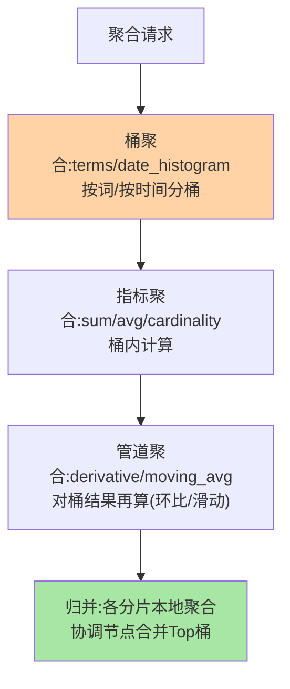

# 聚合分析：桶、指标与管道的实时 OLAP

> 「过去一小时各渠道的销售额、按类目分组统计、再算环比」——这类分析在数仓里是 T+1 的批处理，在 ES 里是毫秒到秒级的实时聚合。这篇讲清三类聚合的分工、doc_values 的支撑作用与精度取舍。

## 一句话摘要

聚合分三类：**桶聚合（bucket）**分组（terms 按词分桶、date_histogram 按时间分桶）、**指标聚合（metric）**算数（sum/avg/cardinality）、**管道聚合（pipeline）**对聚合结果再算（环比、移动平均）。支撑机制是 **doc_values 列存**（聚合不走倒排走列存，顺序扫描友好）。**精度取舍要显式**：terms 聚合的分桶在各分片本地 Top 后合并（shard_size 权衡精度与开销），cardinality 用 HyperLogLog 近似（可配精度阈值）——**「近似正确」是分布式聚合的设计选择，不是缺陷**。

## 一、为什么聚合是 ES 的第二张王牌

全文检索之外的另一半价值：数据写入 ES 后即可做**近实时多维分析**——不需要等数仓 T+1，不需要预建 OLAP Cube。日志平台的地域分布图、电商的实时销售看板、安全的事件聚合告警，底层都是 ES 聚合。它与倒排共享同一份数据但走不同结构（doc_values 列存）——「检索与分析一份数据双结构」是 ES 架构的精妙处。

## 5W 速记卡

| 维度 | 一句话 |
|---|---|
| What | 桶分组 + 指标计算 + 管道再计算的三层聚合体系 |
| Why | 实时多维分析，数仓 T+1 覆盖不了 |
| When | 看板/报表/监控/日志分析场景 |
| Where | `_search` 的 aggs 体（与 query 并列） |
| How | doc_values 列存支撑，分片本地聚合后协调节点归并 |

## 二、三类聚合与执行架构



经典嵌套：「按渠道分桶（terms）→ 桶内按天分桶（date_histogram）→ 桶内求销售额（sum）」三层嵌套即一张实时报表——销售看板的典型聚合：

```mermaid
flowchart LR
    AGG["聚合:渠道×时间×销售额"] --> B1["terms:渠道分桶<br/>线上/线下/分销"]
    B1 --> B2["date_histogram:按天分桶"]
    B2 --> M["sum:销售额指标"]
    M --> P["derivative:日环比(管道)"]
    style B1 fill:#ffd3a5
    style P fill:#a8e6a3
```**管道聚合特殊**：它不读文档，读的是「上一轮聚合的结果」——环比（derivative）、累计（cumulative_sum）、移动平均都在这层。

## 三、精度取舍：两个必须懂的真实代价

1. **terms 分桶的归并近似**：每个分片先取本地 Top N（shard_size，默认 size×1.5+10）再合并——**如果桶基数大且分布倾斜，全局 Top 桶可能算不准**（某桶在每个分片都不是 Top 但全局应该是）。解法：调大 shard_size（精度换开销），或者卡在「文档数多的查询」设计上
2. **cardinality 是近似值**：HyperLogLog+ 算法，precision_threshold（默认 3000，最大 40000）内近乎精确，之上是可量化的近似——UV 类统计接受「近似但实时」是这个 trade 的收益

这两个代价的共同哲学：**分布式聚合在「精确」与「实时」之间选择了可量化的近似**——用对近似机制的理解换回设计决策的主动权。

## 四、与 MySQL GROUP BY 的区别：MySQL 对照

| 维度 | ES 聚合 | MySQL GROUP BY |
|---|---|---|
| 数据规模 | 亿级文档实时 | 大表慢查询风险 |
| 嵌套灵活性 | 桶套桶任意深度组合 | 受执行计划限制 |
| 近似语义 | 显式的近似机制 | 精确（全量扫） |
| 适用定位 | 实时分析 | 业务事务内统计 |

MySQL 精确但扛不住「亿级 + 实时 + 任意嵌套」；ES 反之——「分析」离开 OLTP 库进 ES/数仓，是数据架构演进的标准分工。

## 五、典型场景与误区

**典型场景**：日志平台（按服务/级别/时间三桶嵌套统计错误率）、实时看板（date_histogram + sum 的销售额曲线）、安全告警（terms 聚合异常流量检测）。

**误区与不适用**：① text 字段直接聚合——fielddata 内存爆炸事故（聚合必须走 keyword 或 doc_values，text 聚合需显式开启且慎用）；② 深分页式大桶导出——聚合是「统计」不是「导明细」（导明细用 search_after/PIT）；③ 忽视 shard_size 默认值——Top 桶不准的排查从这里开始；④ 把 ES 当数仓用——超大规模离线分析仍该走专门 OLAP（ClickHouse 类），ES 的定位是「写入即分析的实时层」。

## 六、你们可能会问

**Q1：doc_values 是什么？为什么不走倒排聚合？**
倒排是「词→文档」，聚合要「文档→值」的正向遍历——doc_values 是写入时生成的列存（按列紧凑存储），顺序扫描对聚合友好。4.x 时代聚合走 fielddata（内存堆炸事故频发），5.x 起 doc_values 默认开启——「聚合内存事故」的历史包袱由此卸下。

**Q2：怎么判断 terms 聚合的结果准不准？**
看桶基数与 shard_size 的关系：全局桶基数远超 shard_size 且分布倾斜时要怀疑；验证方法是把 shard_size 调大对比结果是否漂移。

**Q3：聚合能分页吗？**
桶结果本身不支持传统分页——terms 有分桶截断（composite aggregation 支持按桶游标翻页），是「拉全量桶清单」的正确姿势。

## 七、自测三问

1. 三类聚合各做什么？管道聚合特殊在哪？
2. terms 归并近似与 cardinality 近似的机制是什么？各怎么调精度？
3. doc_values 与 fielddata 的演进关系是什么？

下一篇讲「复合查询与脚本」：bool 嵌套、function_score 与脚本的能力边界。

## 📌 数据与事实声明

- 写于 2026-09-08，聚合机制以 ES 9.x 官方文档为准；shard_size 默认值、precision_threshold 上限为官方默认
- doc_values 默认开启自 5.x 起为官方演进口径
- 免责：以 elastic.co/docs 为准

## 📚 参考资料

| 类型 | 标题 | 来源 |
|---|---|---|
| 官方文档 | Aggregations | elastic.co/docs |
| 实战书 | 《Elasticsearch in Action》Radu Gheorghe（聚合章） | 公开出版 |
| 实战书 | 《Elasticsearch 实战》（分析章） | 公开出版 |
