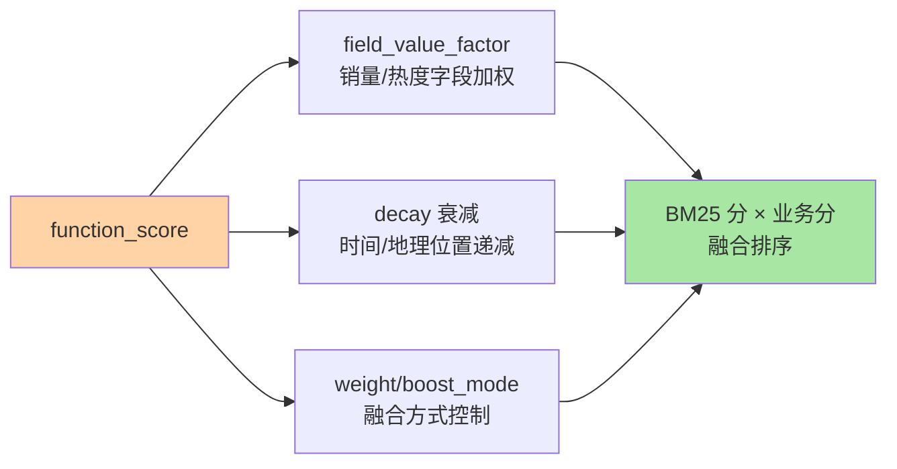
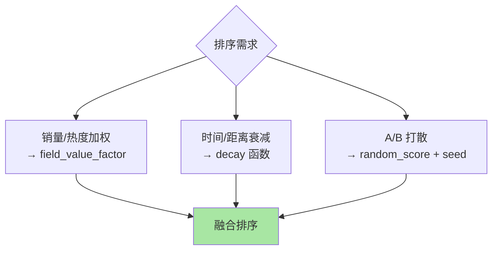

# 复合查询与脚本：能力边界与性能代价

> bool 组合器之外，ES 还有「重武器」：function_score 的业务分融合、script 的任意计算、boosting 的降权语义。重武器的共性是**性能代价陡增**——这篇讲清它们能做什么、代价是什么、什么场景才值得掏出来。

## 一句话摘要

复合查询三件套：**function_score**（BM25 分与业务分融合的工业标准——field_value_factor 加权、decay 新鲜度/距离衰减、随机采样）、**boosting/nested bool**（降权与嵌套语义）、**script_query/script_score**（Painless 脚本任意计算）。**脚本是性能红线**：每文档执行、不可用 filter 缓存、 JIT 无法优化——能用查询 DSL 原生表达的条件绝不用脚本；脚本必须配「预计算字段优先」的替代审查。

## 一、为什么复合查询是「进阶但危险」的层

基础 DSL 能表达「全文找 + 精确筛」，但工业搜索还要「销量加权」「新鲜度衰减」「A/B 实验打散」——这些超出布尔语义的能力就是复合查询的领地。它们的共性：**在打分管道里插入计算**——而打分管道是 ES 查询最贵的路径。理解这层的正确姿势不是记 API，是建立「**能力换性能**」的代价直觉：脚本表达力无限，代价也无限。

## 5W 速记卡

| 维度 | 一句话 |
|---|---|
| What | function_score / boosting / script 三类复合能力 |
| Why | 业务排序因子与任意计算超出布尔语义 |
| When | 排序融合、个性化、衰减类需求 |
| Where | query 的 function_score/script 块 |
| How | 预计算字段优先，decay 次之，实时脚本最后 |

## 二、function_score：排序融合的工业标准

融合形态的选择图：

三种常用函数：**field_value_factor**（拿文档字段值参与计算，`log(1+销量)` 类曲线防大数淹没）、**decay**（高斯/线性/指数衰减——「越新越靠前」「越近越靠前」的标准实现）、**random_score**（A/B 打散与多样性）。**boost_mode**（乘/加/替换）与 **score_mode**（多函数怎么合）控制融合语义——排序融合的全部艺术在这两个参数的组合里。

## 三、script：最后的手段

Painless 脚本能做任何计算（script_query 当过滤、script_score 当打分、script 字段取值），代价也最重：**每文档解释执行 + 无法进 filter 位图缓存 + JIT 失效**。纪律清单：① 先问「预计算能不能解决」（写入时算好排序因子存字段，查询只做 field_value_factor）——**把计算从查询时搬到索引时**是脚本优化的总思路；② 脚本参数化（params 传参）让脚本可缓存编译；③ 脚本数量进监控（script 执行指标），超阈值告警——能力与代价的 Trade-off 必须显式记录在方案文档里。

## 四、与 SQL 计算列的区别：MySQL 对照

| 维度 | ES function_score/script | MySQL ORDER BY 表达式 |
|---|---|---|
| 执行时机 | 查询时逐文档 | 查询时排序阶段 |
| 缓存 | 原生函数可用 filter 缓存 | 无 |
| 优化路径 | 预计算字段 | 索引 + 生成列 |

MySQL 的生成列（generated column）与 ES 的「预计算字段」是同一个思想的两种实现——**查询时少算，写入时多算**，跨系统的通用优化律。

## 五、典型场景与误区

**典型场景**：电商综合排序（BM25 × f(销量, 转化率) 的 field_value_factor 组合）、地图 POI 检索（geo decay 距离衰减）、内容时效搜索（date decay 新鲜度）、A/B 实验（random_score + seed 打散分流）。

**误区与不适用**：① function_score 里写 script 函数随手来——脚本的代价在热门查询上放大成集群事故，优先用原生函数；② decay 函数对每个文档实时算归一——origin/scale 参数固定后可接受，但 origin 每请求变化（如「按用户位置衰减」）要评估代价；③ 脚本里做 IO/正则——Painless 无 IO 但正则回溯是 CPU 黑洞，禁用。

## 六、你们可能会问

**Q1：综合排序的「相关性 × 业务分」比例怎么定？**
score_mode/boost_mode 先选乘还是加：乘（业务分放大相关性差异）vs 加（独立叠加）——没有标准答案，A/B 看转化；比例调整要走配置中心可灰度，别硬编码。

**Q2：脚本的替代审查怎么走？**
三问：预计算字段行不行？原生函数组合行不行？放宽需求行不行？——三问都过不了才写脚本，且脚本评审要带性能预估（命中集大小 × 脚本耗时）。

**Q3：function_score 会被弹性的排序服务替代吗？**
学习排序（LTR）是演进的下一站（ES 已有 LTR 能力）——function_score 是规则时代的解，LTR 是数据驱动的解，两者共存期会很长。

## 七、自测三问

1. function_score 三类函数各解决什么？boost_mode/score_mode 控制什么？
2. 脚本的性能代价来源是什么？替代审查的三问是什么？
3. 「查询时少算，写入时多算」在 ES 与 MySQL 里各自的实现形态？

下一篇进入写入侧：「文档写入链路」——refresh/translog/flush 三件套。

## 📌 数据与事实声明

- 写于 2026-09-08，function_score/script 语义以 ES 9.x 官方文档为准；Painless 为官方脚本语言
- 「脚本禁正则」为官方安全与性能口径
- 免责：以 elastic.co/docs 为准

## 📚 参考资料

| 类型 | 标题 | 来源 |
|---|---|---|
| 官方文档 | function_score query / Painless scripting | elastic.co/docs |
| 实战书 | 《Elasticsearch in Action》Radu Gheorghe | 公开出版 |
| 原理书 | 《深入理解 Elasticsearch（原书第 3 版）》 | 公开出版 |
